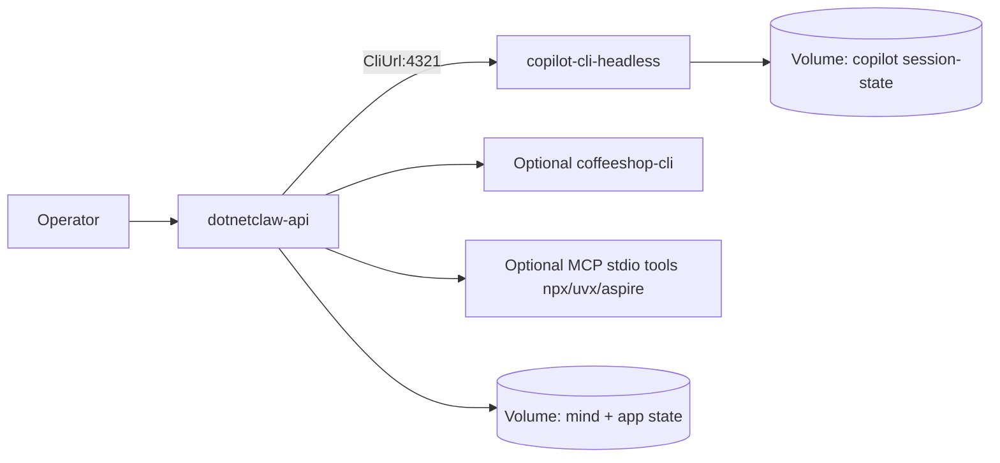
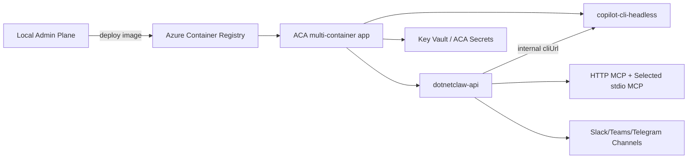

# DotNetClaw Cloud Deployment Gap Report (Docker Local + Azure Container Apps)

## Scope
Short analysis of running DotNetClaw in:
- Local Docker
- Azure Container Apps (ACA)

Baseline reference: Polyclaw supports both targets via a deployment picker (Local Docker + ACA experimental) and documents runtime isolation patterns. [S6][S7][S8][S9]

## Executive Findings
1. DotNetClaw is not container-ready yet by default.
2. The biggest blocker is external CLI/tool dependencies (Copilot CLI, `gh` auth, `coffeeshop-cli`, `npx`/`uvx` MCP servers).
3. Copilot SDK backend-services guidance recommends running Copilot CLI as an independent **headless server** and connecting SDK via `cliUrl` (`UseStdio=false`) instead of per-process stdio lifecycle. [S13]
4. Local Docker is still the right first step; ACA should be Phase 2 after dependency packaging, secret strategy, and CLI sidecar pattern are stable.
5. Polyclaw's two-target pattern is a good template: local-first container flow, then ACA deployment pipeline. [S6][S7]
6. **Is full packaging possible (Polyclaw-style Dockerfile with tools/skills/CLIs)? Yes, technically feasible** — but use staged profiles (`core` then `full`) to avoid oversized, fragile images. [S9][S10]

## Copilot SDK Backend-Services Model (Important)
Official SDK guidance for backend services:
1. Start Copilot CLI in headless mode (`copilot --headless --port 4321`). [S13]
2. Backend SDK connects through `CliUrl` / `cliUrl` and `UseStdio=false` in .NET. [S13]
3. Persist CLI session state on a mounted volume for restarts. [S13]
4. Add health checks and periodic session cleanup to avoid leaked sessions. [S13]

Why it matters for DotNetClaw:
- Current code uses SDK stdio autostart pattern in-process; backend-services model is better for containerized services and ACA.
- It cleanly supports sidecar/separate container topology and independent CLI lifecycle.

## What Polyclaw Proves (Use As Reference)
1. Two explicit deployment modes exist:
- Local Docker (recommended start)
- Azure Container Apps (experimental)
[S6][S7][S8]

2. Practical Docker model:
- Dockerfile includes required CLIs/tools in-image
- `docker-compose` runs split admin/runtime services
[S9][S10]

3. Practical ACA model:
- Image pushed to ACR, runtime deployed to ACA
- Managed identity for runtime (ACA path)
- Persistent admin control-plane state outside runtime container
[S8][S11]

## Polyclaw Dockerfile Approach Applied to DotNetClaw
### Feasibility verdict
Yes, DotNetClaw can follow Polyclaw's Dockerfile approach and package most required components into image(s). [S10]

### What can be packaged directly
1. Base runtime + app binaries (`dotnet publish` output)
2. Copilot CLI + `gh` CLI (Tier A)
3. Node + `npx` MCP tooling, Python + `uvx` MCP tooling (Tier C)
4. Playwright MCP + browser dependencies (if needed)
5. Optional `coffeeshop-cli` binary or install step (Tier B)

### What should stay outside image (or be runtime-configured)
1. Secrets/tokens (`COPILOT_GITHUB_TOKEN`, Slack tokens, etc.)
2. Session-state persistence (volume)
3. Optional heavy features not needed in `core` profile

### Observations from Polyclaw Dockerfile pattern
1. One image can include broad tooling, then runtime mode is selected by env/entrypoint. [S10][S15]
2. Compose/orchestration still matters (service split, volumes, health checks), not just Dockerfile content. [S9][S14]
3. This pattern is powerful but increases image size, cold start time, and maintenance burden.

### Recommended DotNetClaw packaging approaches
1. **Approach A (recommended): single build, dual-service runtime**
- Build one `dotnetclaw-full` image with required CLIs.
- Run as two services: `dotnetclaw-api` + `copilot-cli-headless` (same image, different command).
- Keeps backend-services best practice while minimizing Dockerfile duplication.

2. **Approach B: strict split images**
- `dotnetclaw-api` image (lean .NET runtime + minimal tools)
- `copilot-cli` image (Copilot CLI + session volume)
- Better isolation, more image management overhead.

3. **Approach C: monolith single process container**
- Put everything in one container and run app with stdio lifecycle.
- Simplest to start, but weakest alignment with backend-services guidance; not preferred for ACA.

## DotNetClaw Reality Check (Current)
1. Runtime uses Copilot SDK bridge that shells out to Copilot CLI; docs require `gh auth login` + `gh extension install github/gh-copilot`. [S2]
2. `SkillLoaderTool` requires `CoffeeshopCli:ExecutablePath` and throws if missing/nonexistent.
3. Current default `CoffeeshopCli:ExecutablePath` points to a local dev relative path, not container-safe. [S3][S4]
4. `ExecTool` executes shell commands (with blocklist), so container must include allowed tools the agent expects. [S3]
5. `mcp_servers.json` depends on `uvx`, `npx`, `aspire`, Playwright MCP, etc.; these binaries/runtimes must exist in-image (or server list must be reduced for cloud). [S5]
6. AppHost is Aspire local orchestration, not an ACA deployment pipeline by itself. [S12]

## Main Gap: External CLI Strategy
Without a CLI strategy, Docker/ACA deployment will be brittle.

Recommended strategy:
1. Split tools into tiers:
- Tier A (required): Copilot CLI + `gh` + `gh-copilot`
- Tier B (optional): `coffeeshop-cli` skills
- Tier C (optional MCP runtime): `node+npx`, `python+uvx`, `playwright`, `aspire`

2. Add feature flags:
- `Skills:Enabled` (disable `SkillLoaderTool` in cloud if binary not present)
- `Mcp:Profile` (`minimal`, `full`) to choose MCP server set

3. Container profiles:
- `dotnetclaw:core` (Tier A only)
- `dotnetclaw:full` (Tier A+B+C)

4. Copilot runtime topology (new):
- `dotnetclaw-api` container/process
- `copilot-cli-headless` sidecar/service (`:4321`)
- SDK configured with `CliUrl=<copilot-cli-host>:4321`, `UseStdio=false`

5. Skill packaging rule:
- `SkillLoaderTool` is strict about `CoffeeshopCli:ExecutablePath`; set a container path (`/opt/coffeeshop-cli/CoffeeshopCli`) or disable skills in `core` profile. [S4]

## Deployment Approaches
### Option 1 (Recommended): Local Docker First
1. Run `dotnetclaw-api` + `copilot-cli-headless` with Docker Compose (2 services).
2. Configure SDK to `CliUrl=copilot-cli:4321`, `UseStdio=false` (backend-services mode). [S13]
3. Mount persistent volume for Copilot CLI session state and DotNetClaw mind/state.
4. Disable skill loader by default unless `coffeeshop-cli` is present.
5. Start with minimal MCP profile (HTTP MCP servers first; avoid heavy local stdio servers initially).

Pros:
- Fastest path
- Easiest debugging
- Lowest cloud blast radius

### Option 2 (Phase 2): ACA Runtime
1. Push both images (or one image reused twice) to ACR: `dotnetclaw-api`, `copilot-cli-headless`.
2. Deploy to ACA as multi-container app (API + CLI sidecar) or two internal ACA apps.
3. Use private/internal network path between API and CLI (no public CLI endpoint). [S13]
4. Move secrets to ACA secrets / Key Vault references.
5. Keep admin/control plane local or separate service; runtime in ACA.

Pros:
- Cloud-hosted runtime
- Better identity model and scaling path

Risks:
- CLI auth complexity (`gh` + Copilot flow in container)
- CLI server is a potential single point of failure unless scaled/redundant. [S13]
- Local stdio MCP tools may fail without full runtime packaging
- Full-tool image can become very large and slow to update (Node+Python+Playwright+Azure CLI+gh+Copilot CLI)

## Recommended Phased Plan (Straight to Point)
1. Phase 0: Docker local (`core` image, minimal MCP profile, skills off by default)
2. Phase 1: Switch to Copilot backend-services model (`cliUrl` + headless CLI sidecar) in Docker [S13]
3. Phase 2: Add `full` image profile (coffeeshop-cli + selected stdio MCP tools)
4. Phase 3: ACA deploy pipeline (ACR + ACA + managed identity + secret mapping)
5. Phase 4: Optional split admin/runtime model inspired by Polyclaw runtime isolation [S11]

## Diagrams

## Decision
Use Polyclaw's two-target lesson directly:
- Start with Docker local as the default path.
- Align DotNetClaw with Copilot SDK backend-services model (`headless CLI + cliUrl`) before ACA.
- Treat ACA as next phase after CLI/toolchain packaging and sidecar networking are deterministic.

## Sources
- [S1] `gaps_polyclaw.md`
- [S2] `CLAUDE.md`
- [S3] `DotNetClaw/ExecTool.cs`
- [S4] `DotNetClaw/SkillLoaderTool.cs`
- [S5] `mcp_servers.json`
- [S6] `https://aymenfurter.github.io/polyclaw/getting-started/`
- [S7] `https://aymenfurter.github.io/polyclaw/getting-started/quickstart/`
- [S8] `https://aymenfurter.github.io/polyclaw/deployment/azure/`
- [S9] `https://aymenfurter.github.io/polyclaw/deployment/docker/`
- [S10] `https://raw.githubusercontent.com/aymenfurter/polyclaw/main/Dockerfile`
- [S11] `https://aymenfurter.github.io/polyclaw/deployment/runtime-isolation/`
- [S12] `DotNetClaw.AppHost/Program.cs`
- [S13] `https://raw.githubusercontent.com/github/copilot-sdk/main/docs/setup/backend-services.md`
- [S14] `https://raw.githubusercontent.com/aymenfurter/polyclaw/main/docker-compose.yml`
- [S15] `https://raw.githubusercontent.com/aymenfurter/polyclaw/main/entrypoint.sh`
