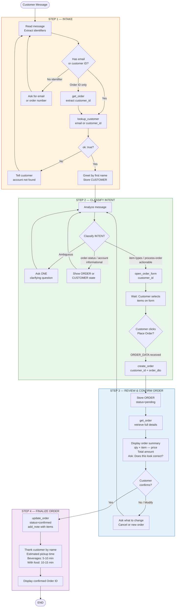

# Introduction

## Coffee Shop Order Submission — Activity Diagram

```mermaid
flowchart TD
    START([Customer Message]) --> S1_READ

    subgraph STEP1["STEP 1 — INTAKE"]
        S1_READ[Read message\nExtract identifiers] --> S1_HAS_ID{Has email\nor customer ID?}
        S1_HAS_ID -- Yes --> S1_LOOKUP[lookup_customer\nemail or customer_id]
        S1_HAS_ID -- Order ID only --> S1_GET_ORDER[get_order\nextract customer_id]
        S1_GET_ORDER --> S1_LOOKUP
        S1_HAS_ID -- No identifier --> S1_ASK[Ask for email\nor order number]
        S1_ASK --> S1_READ
        S1_LOOKUP --> S1_OK{ok: true?}
        S1_OK -- No --> S1_ERR[Tell customer\naccount not found]
        S1_ERR --> S1_READ
        S1_OK -- Yes --> S1_GREET[Greet by first name\nStore CUSTOMER]
    end

    S1_GREET --> STEP2_START

    subgraph STEP2["STEP 2 — CLASSIFY INTENT"]
        STEP2_START[Analyze message] --> S2_CLASSIFY{Classify INTENT}
        S2_CLASSIFY -- Ambiguous --> S2_CLARIFY[Ask ONE\nclarifying question]
        S2_CLARIFY --> STEP2_START
        S2_CLASSIFY -- order-status / account\ninformational --> S2_LOOKUP[Show ORDER or\nCUSTOMER state]
        S2_LOOKUP --> STEP2_START
        S2_CLASSIFY -- item-types / process-order\nactionable --> S2_OPEN_FORM[open_order_form\ncustomer_id]
        S2_OPEN_FORM --> S2_WAIT[Wait: Customer selects\nitems on form]
        S2_WAIT --> S2_SUBMIT{Customer clicks\nPlace Order?}
        S2_SUBMIT -- ORDER_DATA received --> S2_CREATE[create_order\ncustomer_id + order_dto]
    end

    S2_CREATE --> STEP3_START

    subgraph STEP3["STEP 3 — REVIEW & CONFIRM ORDER"]
        STEP3_START[Store ORDER\nstatus=pending] --> S3_GET[get_order\nretrieve full details]
        S3_GET --> S3_SHOW[Display order summary\nqty × item — price\nTotal amount\nAsk: Does this look correct?]
        S3_SHOW --> S3_CONFIRM{Customer\nconfirms?}
        S3_CONFIRM -- No / Modify --> S3_MODIFY[Ask what to change\nCancel or new order]
        S3_MODIFY --> STEP2_START
    end

    S3_CONFIRM -- Yes --> STEP4_START

    subgraph STEP4["STEP 4 — FINALIZE ORDER"]
        STEP4_START[update_order\nstatus=confirmed\nadd_note with items] --> S4_THANK[Thank customer by name\nEstimated pickup time\nBeverages: 5-10 min\nWith food: 10-15 min]
        S4_THANK --> S4_DONE[Display confirmed Order ID]
    end

    S4_DONE --> END_NODE([END])

    style STEP1 fill:#fff3e0,stroke:#e65100
    style STEP2 fill:#e8f5e9,stroke:#2e7d32
    style STEP3 fill:#e3f2fd,stroke:#1565c0
    style STEP4 fill:#f3e5f5,stroke:#6a1b9a
```

Check out: [skills\coffeeshop\SKILL.md](skills\coffeeshop\SKILL.md)
