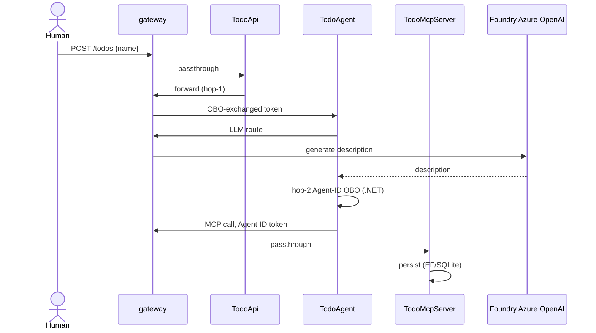

# AgenticTodo

Demo: dual Entra ID On-Behalf-Of (OBO) chain thru **agentgateway** mesh. Human creates todo
by name only, agent enriches + persists, user identity flows every hop.

## Flow

Full mesh: every hop thru agentgateway, not just ingress. No separate UI — call TodoApi
directly (Scalar UI at `/scalar`).

## Stack

.NET 10 · Aspire · agentgateway v1.4.0-beta.1 · Microsoft Entra ID + Entra Agent ID ·
Microsoft Agent Framework · MCP C# SDK · EF Core/SQLite · OpenTelemetry.

## Services / ports (fixed, not dynamic)

| Service | Port | Role |
|---|---|---|
| gateway | 3000 (public), 4000 (llm), 16000 (admin) | mesh, hop-1 OBO, LLM key injection |
| TodoApi | 5001 | entry, thin, Scalar UI + OpenAPI |
| TodoAgent | 5002 | description gen (ChatClient) + hop-2 Agent-ID OBO |
| TodoMcpServer | 5003 | MCP tools, EF Core/SQLite |

Ports fixed on purpose — gateway.yaml is a static bind-mounted file, can't follow dynamic
service discovery; Entra also needs a stable Scalar OAuth redirect URI.

## Run it

1. `pwsh scripts/setup-entra-obo-chain.ps1 -TenantId <your-tenant>` — provisions Entra
   (app regs + Agent ID chain), writes real values to `.env` (git-ignored).
2. Add `AZURE_OPENAI_*` values to `.env` yourself (script only does Entra, not Foundry).
3. `aspire run` — boots the whole mesh.
4. `http://localhost:5001/scalar` — Authorize (Entra login), try `POST /todos`.

`.env.local` = committed placeholder template (safe on GitHub, dummy values).
`.env` = git-ignored, real secrets. `apphost.cs` loads `.env.local` then layers `.env` on top.

## Authorization

Entra security-group RBAC: `SuperAdminGroup` = full read/write, everyone else = read-only.
Enforced independently at all 3 services (defense in depth). Fail-closed default — no
group claim, no elevation. Token acquisition: `docs/GET-TOKEN.md`.

## Docs (source of truth — check these before guessing)

- `prd.md` — requirements, decisions, resolved blindspots (§8 = RBAC addendum, dated)
- `arch.md` — C4 diagrams, hexagonal/vertical-slice design, ADRs
- `plan/feature-agentic-todo-obo-1.md` — full build history, every real bug found + fixed
- `docs/GET-TOKEN.md` — mint a test user token
- `CLAUDE.md` — landmines or agents working this repo need to know

## Dev

`dotnet build` · `dotnet test AgenticTodo.slnx -m:1` (parallel test projects collide on
fixed ports — always pass `-m:1`) · `aspire run` for live E2E.
