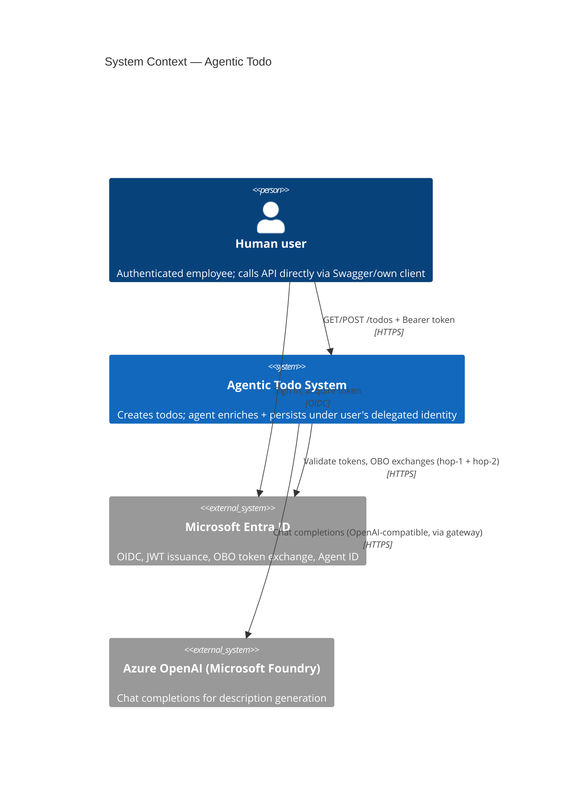
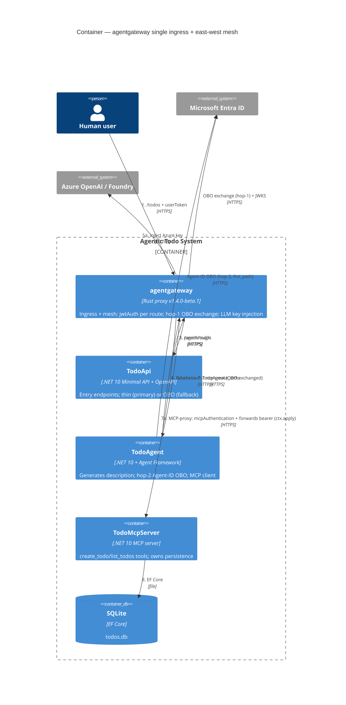
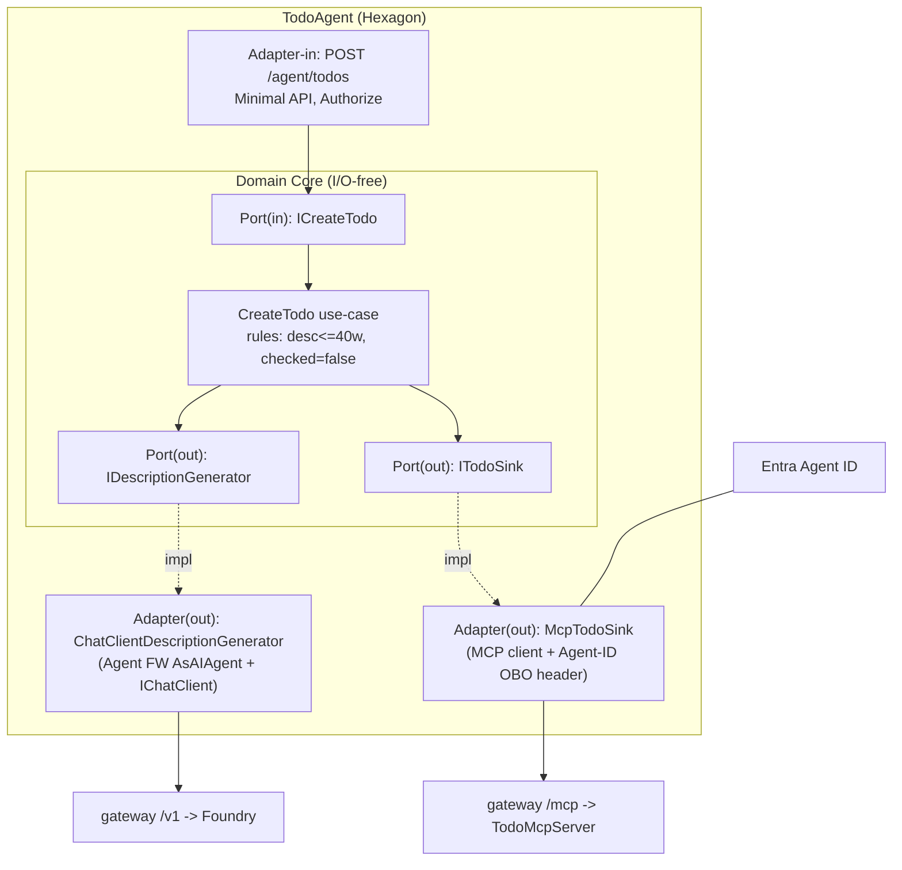
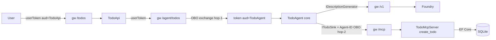
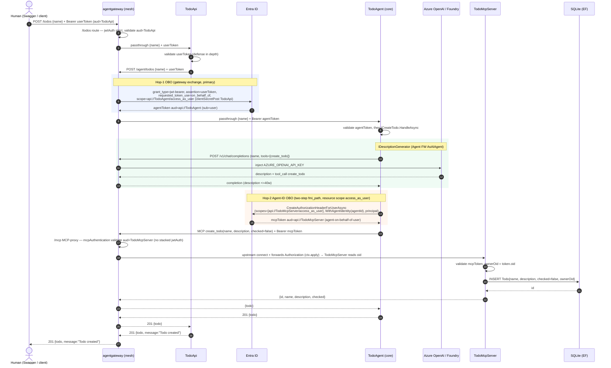

# Architecture Blueprint — Agentic Todo with Dual Entra OBO Chain

> **Companion to** [`prd.md`](./prd.md) · **Generated:** 2026-07-23 · **Status:** Target architecture (design; not yet implemented)
> **Config:** PROJECT_TYPE=.NET 10 · PATTERN=Hexagonal (Ports & Adapters) + Vertical Slice · DIAGRAMS=C4 + Flow + Component · code examples ✓ · implementation patterns ✓ · decision records ✓ · extensibility-focused ✓

---

## 1. Architecture Detection & Analysis

Greenfield system derived from `prd.md`, patterned on the `loop-runtime` reference (net10, Aspire, agentgateway, MCP C# SDK, Microsoft Agent Framework, Microsoft.Identity.Web + AgentIdentities). No code exists yet — this is the **blueprint to build against**.

**Stack (per service).**
| Concern | Technology |
|---|---|
| Runtime | .NET 10, `Microsoft.NET.Sdk.Web` |
| Orchestration | .NET Aspire (AppHost + ServiceDefaults) |
| Ingress/mesh | agentgateway v1.4.0-beta.1 (container) |
| AuthN/Z | Microsoft.Identity.Web (JWT bearer) + Microsoft.Identity.Web.AgentIdentities |
| Agent | Microsoft Agent Framework (`Microsoft.Agents.AI`, `Microsoft.Extensions.AI`) |
| LLM | Azure OpenAI in Microsoft Foundry, reached OpenAI-compatible via gateway |
| Tools transport | MCP C# SDK (`ModelContextProtocol[.AspNetCore]`), Streamable HTTP |
| Persistence | EF Core + SQLite |
| Observability | OpenTelemetry (OTLP via ServiceDefaults) |

**Two patterns, two axes.**
- **Hexagonal (Ports & Adapters)** — *depth* axis: each service isolates a domain core behind ports; all I/O (HTTP, MCP, EF, LLM, token exchange) lives in adapters. Enables swapping (e.g., hop-1 OBO gateway↔.NET) without touching the core.
- **Vertical Slice** — *breadth* axis: each service organizes by feature (`Features/CreateTodo`, `Features/ListTodos`), colocating endpoint + handler + DTOs, not by technical layer.

The system as a whole = **three hexagons wired through an agentgateway mesh**.

---

## 2. Architectural Overview

**Guiding principles.**
1. **Identity flows end-to-end.** Every hop carries the human's delegated identity via two OBO exchanges; owner derived from validated token claims, never request body.
2. **Gateway is the only network peer.** Services never call each other directly — the gateway is single ingress + east-west mesh. Validate JWT at every route.
3. **Domain core is I/O-free.** Tokens, HTTP, EF, LLM are adapters behind ports. Core knows only `Todo` + use-case contracts.
4. **Swap-ability over cleverness.** Hop-1 OBO location (gateway vs .NET) is a config toggle because both sides sit behind the same port.
5. **Secretless in prod, simple in dev.** TodoAgent authenticates with a client secret on its Blueprint in local dev, and a Federated Identity Credential (FIC) in prod — config-swap, no code change.

**Boundaries & enforcement.**
- Process boundary per service (Aspire projects) + container (gateway).
- Trust boundary at each gateway route (`jwtAuth: strict`, audience-pinned) **and** in-service (`AddMicrosoftIdentityWebApi`, defense-in-depth).
- Domain boundary via ports (C# interfaces) — adapters depend inward only.

---

## 3. Architecture Visualization

### 3.1 C4 L1 — System Context



### 3.2 C4 L2 — Container (the mesh)



### 3.3 C4 L3 — Component (inside TodoAgent, the richest hexagon)



### 3.4 Flow — Create Todo (end-to-end)

See `prd.md` §4.3 for the authoritative sequence. Condensed control/identity flow:



End-to-end sequence (control + identity, mesh in the middle):



---

## 4. Core Architectural Components

### 4.1 agentgateway — ingress + mesh (infrastructure adapter for the whole system)
- **Responsibility:** terminate ingress, validate JWT per route, perform hop-1 OBO *exchange*, **MCP-proxy** hop-2 (`mcpAuthentication` + forwards the bearer upstream via `ctx.apply`), inject LLM key. Single network peer.
- **Structure:** one listener, four routes (`/todos`, `/agent/todos`, `/mcp`, `/v1` llm). Config in `gateway.yaml` (prd §4.4).
- **Interaction:** all inter-service HTTP. Hot-reloads config.
- **Evolution:** add a route per new backend; flip `oauthTokenExchange`↔`passthrough` to relocate an exchange.

### 4.2 TodoApi — driving adapter (entry hexagon)
- **Responsibility:** expose `/todos` (GET/POST), validate user token, forward to agent through gateway. Owns OpenAPI/Swagger.
- **Core:** thin — no domain logic beyond request shaping. In fallback mode gains an outbound OBO port adapter.
- **Ports:** out `IAgentGateway` (forward call). Adapter = typed `HttpClient` to gateway.

### 4.3 TodoAgent — the primary domain hexagon
- **Responsibility:** own the `CreateTodo`/`ListTodos` use-cases; generate description; delegate persistence.
- **Core:** `Todo`, use-case handlers, rules. **Ports:** in `ICreateTodo`/`IListTodos`; out `IDescriptionGenerator`, `ITodoSink`.
- **Adapters:** in = Minimal API; out = `ChatClientDescriptionGenerator` (Agent FW), `McpTodoSink` (MCP client + Agent-ID OBO).
- **Evolution:** new capability = new outbound port + adapter; new agent instance = new Agent Identity under same Blueprint.

### 4.4 TodoMcpServer — persistence hexagon behind MCP
- **Responsibility:** expose `create_todo`/`list_todos` MCP tools; own EF Core/SQLite; derive owner from token.
- **Core:** `Todo` entity + repository port `ITodoRepository`. **Adapters:** in = MCP tool methods (`[McpServerTool]`); out = `EfTodoRepository`.
- **Evolution:** new tool = new `[McpServerTool]` method + repository method. DB swap = new `ITodoRepository` adapter.

---

## 5. Architectural Layers & Dependencies

**Per-hexagon dependency rule (inward only):**
```
Adapters (HTTP / MCP / EF / LLM / OBO)  ->  Ports (interfaces)  ->  Domain Core
        \___________________ depend on ______________________/
Core depends on NOTHING (no Microsoft.Identity.*, no EF, no HttpClient).
```

- **Layer separation** enforced by project/folder split: `*.Domain` (core + ports), `*.Adapters.*` (implementations), `*.Api`/`*.Mcp` (host + composition root).
- **DI = composition root** (`Program.cs`) binds ports→adapters. Core references only `*.Domain`.
- **No circular deps:** services never reference each other's assemblies; contracts shared via a `Contracts` package (DTOs only) if needed.
- **Cross-service dependency** is runtime-only, through the gateway — never compile-time.

---

## 6. Data Architecture

- **Domain model:** single aggregate `Todo { Id, Name, Description, Checked, OwnerObjectId }`. Invariants: `Name` from user, `Description` agent-generated (≤40 words), `Checked=false` at creation, `OwnerObjectId` from token `oid`.
- **Access pattern:** Repository port (`ITodoRepository`) in TodoMcpServer; EF Core adapter (`TodoDbContext`, `DbSet<Todo>`).
- **Ownership scoping:** every query filtered by `OwnerObjectId == token.oid` (row-level isolation).
- **Migrations:** EF Core `Database.Migrate()` at TodoMcpServer startup (SQLite file `todos.db`).
- **No caching / no mapping frameworks** in v1 (records ⇄ entity by hand; minimal surface).

```csharp
// TodoMcpServer domain + port (I/O-free)
public sealed record Todo(int Id, string Name, string Description, bool Checked, string OwnerObjectId);
public interface ITodoRepository
{
    Task<Todo> AddAsync(string name, string description, bool @checked, string ownerOid, CancellationToken ct);
    Task<IReadOnlyList<Todo>> ListAsync(string ownerOid, CancellationToken ct);
}
```

---

## 7. Cross-Cutting Concerns

### 7.1 AuthN / AuthZ (the heart)
- **Validation:** gateway `jwtAuth: strict` per route (audience-pinned) + in-service `AddMicrosoftIdentityWebApi`. Two independent gates.
- **Hop-1 (TodoApi→TodoAgent):** OBO *exchange in gateway* (`backendAuth.oauthTokenExchange`, jwt-bearer, `requested_token_use=on_behalf_of`, `clientSecretPost` with TodoApi creds). Fallback = .NET OBO + passthrough (toggle `Hop1:Mode`).
- **Hop-2 (TodoAgent→TodoMcpServer):** **Entra Agent ID** via `Microsoft.Identity.Web.AgentIdentities`. `IAuthorizationHeaderProvider.CreateAuthorizationHeaderForUserAsync(scopes, opts.WithAgentIdentity(agentId), principal)`. Under the hood = **two-step `fmi_path` exchange with `client_credentials`** (NOT RFC 8693 — that returns `AADSTS82001`). Resource scope = `api://<TodoMcpServer>/access_as_user` (our API, not `.default`); the SDK uses `/.default` only for the internal fmi_path parent-token step. Blueprint credential = client secret (local dev) / FIC (prod).
- **Owner integrity:** `oid` from validated token only.
- **Group-based RBAC (appended 2026-07-27, prd §8):** binary SuperAdmin/NormalUser split via the Entra `groups` claim, not roles. `groupMembershipClaims: "SecurityGroup"` set on all 3 app registrations (per-resource — each hop's exchanged token is governed by *its own* audience app's setting, not TodoApi's). Shared `ServiceDefaults.AddGroupAuthorization()` registers a `RequireSuperAdmin` policy (`RequireClaim("groups", superAdminGroupId)`, [claims-based authorization](https://learn.microsoft.com/en-us/aspnet/core/security/authorization/claims?view=aspnetcore-10.0)) + a `FriendlyForbiddenResponseHandler` (`IAuthorizationMiddlewareResultHandler`) that replaces the default empty `403` with a `ProblemDetails` body naming the admin contact. Enforced at all 3 write surfaces independently (defense in depth, not single-point trust): TodoApi's `POST /todos`, TodoAgent's `POST /agent/todos`, and TodoMcpServer's `create_todo` MCP tool (a manual claim check, since MCP tool calls don't flow through the ASP.NET Core authorization middleware). Read/list paths stay open to any authenticated user. Fail-safe default: missing claim or wrong group value → NormalUser (read-only), never elevated.

### 7.2 Error Handling & Resilience
- `AddProblemDetails()` + `UseExceptionHandler()`/`UseStatusCodePages()` in every host; failures surface as RFC 7807.
- **No partial writes:** DB insert only inside `create_todo`; a failed hop → no row.
- Aspire `AddStandardResilienceHandler` on outbound `HttpClient` (retry/circuit-breaker/timeout) for gateway calls.
- Permission-propagation: retry `403` from Entra with 30–120 s backoff after consent (Agent ID claim delay).

### 7.3 Logging & Monitoring
- OpenTelemetry via `AddServiceDefaults()` (logs + traces + metrics, OTLP). Trace spans span the mesh.
- Custom tags: `gen_ai.tool.name`, `mcp.method.name`, `mcp.session.id`, `todo.owner.oid` (audit correlation). GenAI content capture gated by `OTEL_INSTRUMENTATION_GENAI_CAPTURE_MESSAGE_CONTENT` (dev only).

### 7.4 Validation
- Input: DTO `[Required]`/`[Description]` + Minimal API binding; invalid → `400` ProblemDetails.
- Domain: `Description` length rule enforced in the use-case (truncate/reject), not the adapter.

### 7.5 Configuration & Secrets
- `AzureAd` section per service. TodoAgent: `AzureAd:ClientCredentials:0:SourceType=ClientSecret` (local dev) or `SignedAssertionFilePath` (FIC, prod) — swap by config. TodoApi secret + Foundry endpoint/deployment/key (`AZURE_OPENAI_*`) injected into the **gateway** only (values supplied by the operator via env).
- Endpoints wired by Aspire (`Agent__GatewayBaseUrl`, `Mcp__Endpoint=/mcp`, `AgentGateway__LlmEndpoint=/v1`).
- Toggle: `Hop1:Mode = gateway | dotnet`.

---

## 8. Service Communication Patterns
- **Boundaries:** each service = a hexagon; the only inbound port is its host (HTTP or MCP).
- **Protocols:** HTTP/JSON (TodoApi), MCP Streamable HTTP (TodoMcpServer), OpenAI-compatible HTTP (LLM). All via gateway.
- **Sync vs async:** all synchronous request/response in v1 (single agent turn). No queues.
- **Discovery:** Aspire service discovery → gateway hostnames; clients hold only the gateway URL.
- **Versioning:** OpenAPI doc versioned (`/openapi/v1.json`); MCP tools versioned by name.
- **Resilience:** standard resilience handler on gateway-bound clients.

---

## 9. .NET-Specific Architectural Patterns
- **Host model:** `WebApplication.CreateBuilder` + `AddServiceDefaults()` (Aspire) in all three services; TodoMcpServer is `Exe` web host.
- **Middleware pipeline:** `UseExceptionHandler` → `UseStatusCodePages` → `UseAuthentication` → `UseAuthorization` → endpoints. `MapOpenApi()` (TodoApi), `MapMcp().RequireAuthorization()` (TodoMcpServer).
- **Minimal API:** `MapGroup("/todos").RequireAuthorization()`, `Results<Created<T>, ProblemHttpResult>`, `TypedResults`, `WithName`/`WithSummary` (per aspnet-minimal-api-openapi skill).
- **DI:** constructor injection; ports registered `AddScoped`, adapters bound in composition root; `AddChatClient` (gateway provider), `AddAgentIdentities()`, `AddDbContext<TodoDbContext>(UseSqlite)`.
- **Agent Framework:** `_chatClient.AsAIAgent(instructions, tools)`; MCP tools surfaced as `AIFunction`s; LLM autonomously tool-calls `create_todo`.

---

## 10. Implementation Patterns

### 10.1 Vertical Slice (feature-colocated)
```
TodoAgent/
  Domain/                      # I/O-free core + ports
    Todo.cs
    Ports/ICreateTodo.cs  Ports/IDescriptionGenerator.cs  Ports/ITodoSink.cs
  Features/
    CreateTodo/
      CreateTodoEndpoint.cs    # inbound adapter (Minimal API)
      CreateTodoHandler.cs     # use-case (implements ICreateTodo)
      CreateTodoRequest.cs     # DTOs colocated
    ListTodos/ ...
  Adapters/
    Llm/ChatClientDescriptionGenerator.cs   # out adapter
    Mcp/McpTodoSink.cs                       # out adapter (Agent-ID OBO)
  Program.cs                   # composition root
```

### 10.2 Port + inbound adapter + use-case
```csharp
// Domain/Ports — core owns the contract
public interface ICreateTodo { Task<TodoResult> HandleAsync(string name, ClaimsPrincipal user, CancellationToken ct); }
public interface IDescriptionGenerator { Task<string> GenerateAsync(string name, CancellationToken ct); }
public interface ITodoSink { Task<TodoResult> SaveAsync(string name, string description, ClaimsPrincipal user, CancellationToken ct); }

// Features/CreateTodo — use-case (no HTTP, no MSAL, no EF)
public sealed class CreateTodoHandler(IDescriptionGenerator gen, ITodoSink sink) : ICreateTodo
{
    public async Task<TodoResult> HandleAsync(string name, ClaimsPrincipal user, CancellationToken ct)
    {
        var description = Trim40(await gen.GenerateAsync(name, ct));   // domain rule
        return await sink.SaveAsync(name, description, user, ct);
    }
    static string Trim40(string s) => string.Join(' ', s.Split(' ').Take(40));
}

// Features/CreateTodo — inbound adapter
public static class CreateTodoEndpoint
{
    public static RouteGroupBuilder MapCreateTodo(this RouteGroupBuilder g) =>
        g.MapPost("/", async Task<Results<Created<TodoResponse>, ProblemHttpResult>> (
            CreateTodoRequest body, ICreateTodo uc, HttpContext ctx, CancellationToken ct) =>
        {
            var r = await uc.HandleAsync(body.Name, ctx.User, ct);
            return TypedResults.Created($"/todos/{r.Id}", r.ToResponse("Todo created"));
        })
        .WithName("CreateTodo").WithSummary("Create a todo by name; agent generates the description")
        .Produces<TodoResponse>(StatusCodes.Status201Created) is var _ ? g : g;
}
```

### 10.3 Outbound adapter — hop-2 Agent-ID OBO + MCP (the load-bearing adapter)
```csharp
public sealed class McpTodoSink(IAuthorizationHeaderProvider auth, IConfiguration cfg) : ITodoSink
{
    public async Task<TodoResult> SaveAsync(string name, string description, ClaimsPrincipal user, CancellationToken ct)
    {
        // hop-2: Agent ID OBO (two-step fmi_path handled by AgentIdentities); resource scope = access_as_user
        var header = await auth.CreateAuthorizationHeaderForUserAsync(
            new[] { $"{cfg["Mcp:AppIdUri"]}/access_as_user" },                 // api://<TodoMcpServer>/access_as_user (not .default)
            new AuthorizationHeaderProviderOptions().WithAgentIdentity(cfg["AgentIdentity:AgentIdentityId"]!),
            user, ct);
        var transport = new HttpClientTransport(new()
        {
            Endpoint = new Uri(cfg["Mcp:Endpoint"]!),                          // gateway /mcp
            TransportMode = HttpTransportMode.StreamableHttp,
            AdditionalHeaders = { ["Authorization"] = header },
        });
        await using var client = await McpClient.CreateAsync(transport, cancellationToken: ct);
        var result = await client.CallToolAsync("create_todo",
            new() { ["name"] = name, ["description"] = description, ["checked"] = false }, ct);
        return result.ToTodoResult();
    }
}
```

### 10.4 Composition root (bind ports → adapters)
```csharp
builder.Services.AddScoped<ICreateTodo, CreateTodoHandler>();
builder.Services.AddScoped<IDescriptionGenerator, ChatClientDescriptionGenerator>();
builder.Services.AddScoped<ITodoSink, McpTodoSink>();
// swap ITodoSink -> FakeTodoSink in tests without touching the core
```

---

## 11. Testing Architecture
- **Domain/core unit tests:** use-cases with fake ports (`FakeDescriptionGenerator`, `FakeTodoSink`) — fast, no I/O. (Fakes are *test doubles for ports*, distinct from LLM — the LLM client stays **real** per prd §3.2.)
- **Adapter tests:** `McpTodoSink` against a stub MCP server; `EfTodoRepository` against SQLite in-memory; token-exchange contract test against a mock token endpoint (`mock_token.py` pattern) asserting form body / exchanged `aud`+`sub`.
- **Integration (mesh):** Aspire test host boots gateway + services; assert full OBO chain + `oid` on persisted row.
- **Eval:** 30-case description benchmark, real `IChatClient`, rubric ≥90% (prd §3.2).

---

## 12. Deployment Architecture
- **Local:** Aspire AppHost orchestrates the **published** gateway image (`cr.agentgateway.dev/agentgateway:v1.4.0-beta.1`) + three projects; gateway is the public endpoint and fronts the human→TodoApi hop too (full mesh, R-A2). Agent uses a **client secret** (no local FIC issuer needed, R-2).
- **Env config (operator-supplied):** `Hop1:Mode`, `AI:Provider=gateway`, agent client secret, and Foundry `AZURE_OPENAI_ENDPOINT`/`AZURE_OPENAI_DEPLOYMENT`/`AZURE_OPENAI_API_KEY` into the gateway (R-A5).
- **Prod (out of scope v1):** container apps behind gateway; **FIC (MI+WIF)** replaces the dev client secret; SQLite → managed store as a repository-adapter swap.

---

## 13. Extension & Evolution Patterns

**Add a feature (e.g., CompleteTodo).**
1. Domain: add rule + `ICompleteTodo` port. 2. `Features/CompleteTodo/` slice (endpoint + handler + DTO). 3. TodoMcpServer: new `[McpServerTool] complete_todo` + repository method. 4. Gateway: no change (same `/mcp` route). 5. Bind in composition root.

**Add an outbound dependency (e.g., notifications).** New out-port + adapter; register; gateway gets a new route + `jwtAuth`/backendAuth policy.

**Add an agent instance.** New **Agent Identity** under the *same* Blueprint (distinct `sub`/audit); no code change — config `AgentIdentity:AgentIdentityId`.

**Relocate hop-1 OBO.** Flip `Hop1:Mode`: gateway `oauthTokenExchange`↔`passthrough` + add/remove the .NET OBO adapter in TodoApi. Core untouched (it never saw the token exchange).

**Swap persistence.** New `ITodoRepository` adapter (e.g., Postgres); TodoMcpServer core + tools unchanged.

**Anti-corruption:** external systems enter only through an out-port adapter that maps their model to `Todo` — core never imports vendor types.

---

## 14. Architectural Pattern Examples

**Layer separation — core depends on abstraction, adapter injects concrete:**
```csharp
// core (Domain) — depends on IDescriptionGenerator only
class CreateTodoHandler(IDescriptionGenerator gen, ITodoSink sink) : ICreateTodo { ... }
// adapter (Adapters/Llm) — the ONLY place Agent Framework / IChatClient appears
class ChatClientDescriptionGenerator(IChatClient chat) : IDescriptionGenerator
{
    public async Task<string> GenerateAsync(string name, CancellationToken ct)
    {
        var agent = chat.AsAIAgent("Write one concise todo description (<=40 words).");
        return (await agent.RunAsync($"name: {name}", ct)).Text;
    }
}
```

**Component communication — MCP tool as inbound adapter over a repository port:**
```csharp
[McpServerToolType]
public class TodoTools
{
    [McpServerTool(Name = "create_todo"), Description("Persist a new todo")]
    public static async Task<TodoResponse> CreateTodo(
        ITodoRepository repo, IHttpContextAccessor http,
        [Description("Human-supplied name")] string name,
        [Description("Agent-generated description")] string description,
        [Description("Completion state")] bool @checked = false)
    {
        var oid = http.HttpContext!.User.FindFirst("oid")?.Value ?? throw new UnauthorizedAccessException();
        var t = await repo.AddAsync(name, description, @checked, oid, default);
        return new(t.Id, t.Name, t.Description, t.Checked);
    }
}
```

**Extension point — config-driven hop-1 swap:**
```csharp
if (cfg["Hop1:Mode"] == "dotnet")            // fallback: OBO in TodoApi
    builder.Services.AddScoped<IAgentGateway, OboAgentGateway>();
else                                          // primary: gateway does exchange
    builder.Services.AddScoped<IAgentGateway, PassthroughAgentGateway>();
```

---

## 15. Architectural Decision Records

**ADR-001 — Hexagonal + Vertical Slice hybrid.**
*Context:* multi-service identity-critical app that must swap token-exchange strategies. *Decision:* ports/adapters for depth (swap-ability), vertical slices for breadth (feature cohesion). *Consequences:* + isolated, testable core; + config-swap of adapters. − more interfaces up front. *Alternatives:* Clean Architecture (heavier), classic layered (leaks I/O into core).

**ADR-002 — agentgateway as single ingress + east-west mesh.**
*Context:* every hop must be JWT-validated and centrally policy-controlled. *Decision:* all traffic transits the gateway; services never call each other directly. *Consequences:* + one policy/observability chokepoint, + token exchange at the edge; − gateway is a hard dependency + SPOF (mitigate: HA in prod). *Alternatives:* per-service SDK calls (scatters policy), service mesh sidecars (heavier).

**ADR-003 — Hop-1 OBO in gateway (primary), .NET OBO fallback.**
*Context:* `oauthTokenExchange` is alpha. *Decision:* try gateway exchange first; fall back to .NET OBO + passthrough via `Hop1:Mode`. *Consequences:* + thin TodoApi when it works, + proven escape hatch; − two code paths to test. *Alternatives:* commit to one (loses resilience or thinness).

**ADR-004 — Hop-2 via Microsoft.Identity.Web.AgentIdentities (fmi_path).**
*Context:* agent needs its own auditable identity acting for the user. *Decision:* `.WithAgentIdentity()` + `CreateAuthorizationHeaderForUserAsync`; two-step `fmi_path` `client_credentials`; resource scope `access_as_user`; Blueprint credential = client secret (dev) / FIC (prod). *Consequences:* + per-instance `sub`/audit; − preview API, propagation delays, SDK forces `/.default` on the internal parent step. *Rejected:* RFC 8693 token-exchange → `AADSTS82001`; user token with Graph/`.default` aud → `AADSTS50013` (assertion must be `api://<blueprint>/access_as_user`).

**ADR-005 — Persistence behind MCP (TodoMcpServer owns EF/SQLite).**
*Context:* second OBO hop needs a meaningful protected resource; agent should reach data as a tool. *Decision:* TodoMcpServer exposes `create_todo`/`list_todos`; owns the DB. *Consequences:* + clean tool boundary, + hop-2 justified, + agent tool-calls persist; − extra network hop. *Alternatives:* agent owns DB (hop-2 becomes description-gen — rejected by product).

**ADR-006 — LLM via gateway OpenAI-compatible (Foundry), OpenAIClient.**
*Context:* keep the Azure/Foundry key off the agent, uniform egress. *Decision:* gateway `llm` route injects `AZURE_OPENAI_API_KEY`; agent uses `OpenAIClient` against gateway `/v1`. *Consequences:* + agent never holds the key, + swap model at gateway; − gateway must proxy LLM. *Alternatives:* Azure SDK direct (leaks key, bypasses mesh).

**ADR-007 — Agent credential: client secret (local dev) → FIC (prod).**
*Context:* FIC issuer must be internet-reachable; FIC + agentgateway failed on alpha.1. *Decision:* client secret on the Blueprint for local dev (retrying on alpha.2), FIC in prod; TodoApi secret lives in gateway config. *Consequences:* + no local tunnel/issuer needed, + prod stays secretless; − a dev secret exists (scope it tightly, rotate). *Watch:* if the agent hop still fails on alpha.2, escalate (prd R-2/W-2).

**ADR-008 — Entra object topology.**
*Decision:* TodoApi + TodoMcpServer = standard **app registrations** (`entra-app-registration`); TodoAgent = **Agent ID** chain: Blueprint (application, holds FIC) → BlueprintPrincipal (SP, must be created explicitly) → Agent Identity (SP per instance, no creds). *Consequences:* + per-agent audit + independent grants (`oauth2PermissionGrants` per Agent Identity); − extra provisioning steps (BlueprintPrincipal not auto-created; `identifierUris: api://{appId}` required before scope resolution).

---

## 16. Architecture Governance
- **Dependency guard:** `*.Domain` must not reference `Microsoft.Identity.*`, `Microsoft.EntityFrameworkCore`, `System.Net.Http`, or `ModelContextProtocol` — enforce with a NetArchTest/`Roslyn` rule in CI.
- **Audience assertions:** integration test asserts each exchanged token's `aud` (SC-3, prd §1). Fail build on drift.
- **OpenAPI diff:** snapshot `/openapi/v1.json` in CI; breaking changes require version bump.
- **ADR discipline:** any change to OBO placement, gateway topology, or persistence boundary needs a new ADR entry here.

---

## 17. Blueprint for New Development

**Workflow (new feature).**
1. Start in `*.Domain` — add entity rule + port. 2. Add a `Features/<Name>/` slice (endpoint + handler + DTO). 3. If it touches data, add an MCP tool + repository method in TodoMcpServer. 4. Add/adjust a gateway route (with `jwtAuth` + audience). 5. Bind ports→adapters in the composition root. 6. Tests: core (fake ports) → adapter → mesh integration.

**Templates.**
- Port: `interface I<Verb><Noun> { Task<Result> HandleAsync(..., ClaimsPrincipal user, CancellationToken ct); }`
- Inbound adapter: `MapGroup(...).RequireAuthorization()` + `TypedResults` + `WithName`/`WithSummary` + `Produces<>`.
- Outbound adapter: constructor-inject the SDK client; map vendor model ⇄ domain; never leak vendor types upward.

**Common pitfalls.**
- ❌ Reading `oid`/owner from request body (spoofable) — always from validated token.
- ❌ Calling a peer service directly — must transit the gateway.
- ❌ RFC 8693 grant for Agent ID (`AADSTS82001`) — use `fmi_path` `client_credentials`.
- ❌ `.default` on our own APIs — use `access_as_user` (R-3). (`/.default` only on the SDK-internal fmi_path parent step, which you don't hand-write.)
- ❌ Credentials on the Agent Identity SP (`PropertyNotCompatibleWithAgentIdentity`) — put on the Blueprint.
- ❌ Domain core importing EF/MSAL/HttpClient — breaks hexagon; CI guard catches it.
- ❌ Skipping BlueprintPrincipal creation — `Agent Blueprint Principal does not exist`.

**Keep updated:** regenerate this blueprint when ADR-002/003/004/005 change, or when a new service/hexagon joins the mesh.

---

## 18. Blindspots & Confidence Notes (implementation-level)

Wiring facts a first-timer misses. **High confidence** — but each has a "verify against installed version" edge because the stack is alpha/preview. The illustrative code in §10/§14 will need these adjustments.

- **CN-A ✅ RESOLVED (verified vs alpha.2 source).** Real local config = `config: {}` + `binds → listeners → routes → backends[].policies` — **policies live under the backend**, not the route. The prd §4.4 `gateway.yaml` is now rewritten to this shape. Hop-1 `backendAuth.oauthTokenExchange` keys (`grantType: jwtBearer`, `clientAuth.method: clientSecretPost`, `additionalParams` CEL) are **confirmed** by `examples/traffic-token-exchange/jwt-authz-grant/config.yaml`. (CRD form differs: `spec.policies.auth.oauthTokenExchange` with `backendRef`/`secretRef` — not used here.)
- **CN-B ✅ PRESENT, but corrected.** MCP support is real and tested (`crates/agentgateway/src/mcp/streamablehttp.rs`, `protocol: StreamableHTTP`, multiplex, e2e `mcp_test.go`). **But it is an MCP-aware *proxy*, not HTTP passthrough**: configure `backends: [{mcp: {targets: [{static: {…, protocol: StreamableHTTP}}]}}]` with `policies.mcpAuthentication` for the downstream token. The gateway terminates MCP and re-connects upstream.
- **CN-C / PRV-1 — CORRECTED BY LIVE PROOF (2026-07-23).** Source-only read predicted the MCP-aware proxy forwards the downstream `Authorization` header unconditionally via `ctx.apply` (`mcp/upstream/streamablehttp.rs:95`). Live testing disproved this: with no `backendAuth` policy on the MCP target, TodoMcpServer received **no** Authorization header (confirmed via a temporary diagnostic middleware logging `Authorization present=False`). `mcpAuthentication` validates AND STRIPS the header exactly like `jwtAuth` — `ctx.apply` only forwards a token that's still present, and `mcpAuthentication` removes it first. Real fix: add an explicit `backendAuth: { passthrough: {} }` policy as a **sibling of the target's `mcp:` block** (`LocalMcpTarget { name, spec, policies: Option<SimpleLocalBackendPolicies> }` in `local.rs`). With that policy in place, TodoMcpServer receives the user OBO bearer and reads `oid` — owner-from-token works, proven live end-to-end. **Design constraint (still valid):** `/mcp` uses `mcpAuthentication` **only**, never a stacked route `jwtAuth` (`auth.rs:34-42` rejects a pre-validated/stripped token).
- **CN-D Agent Framework API names** still indicative — verify against `Microsoft.Agents.AI 1.13` + `ModelContextProtocol 1.1.0`.
- **CN-E Aspire↔container networking** unchanged (`host.docker.internal`, published ports).
- **CN-F v2.0 issuer/audience exact-match** at gateway `jwtAuth`/`mcpAuthentication` — confirmed the alpha.2 policies take `issuer`/`audiences`/`jwks`.
- **CN-D Agent Framework API names are indicative.** `chat.AsAIAgent(...)`, `agent.RunAsync(...)`, `result.Text`/structured-output, and MCP-tool→`AIFunction` conversion (`McpClientTool` / `AIFunctionFactory.Create`) must be checked against `Microsoft.Agents.AI 1.13` + `ModelContextProtocol 1.1.0`. Method shapes moved between preview versions.
- **CN-E Aspire ↔ container networking is fiddly.** The gateway **container** reaching host-run .NET projects uses `host.docker.internal:<port>` (reference pattern), and `GetEndpoint("http")` yields different URLs inside the container vs on the host. Ports must be explicitly published, and the bind-mounted `gateway.yaml` backend hosts must match the container's view. Budget real time here.
- **CN-F v2.0 token config bites the gateway too.** `jwtAuth.issuer` must be the `/v2.0` issuer and `audiences` must match the app's App ID URI/client-id exactly, or every request 401s at the edge before any code runs.

## 19. Resolved Decisions (implementation topology)

Answers folded in (2026-07-23). Identity/tenant decisions are in `prd.md` §7 (R-1..R-5).

- **R-A1 Gateway image.** Pull the **published** image `cr.agentgateway.dev/agentgateway:v1.4.0-beta.1` (from the GitHub release, upgraded from alpha.2 on 2026-07-27) — no local build. Applied in AppHost (prd §4.4).
- **R-A2 Local-dev ingress.** **Full mesh** — the human→TodoApi hop goes through the gateway too (matches prod). Accept the container↔host networking cost (CN-E).
- **R-A3 MCP transport.** MCP goes **through the gateway over Streamable HTTP** — ✅ supported (CN-B), MCP-aware proxy route. PRV-1 ✅ resolved live: gateway forwards the user OBO bearer to TodoMcpServer only once an explicit `backendAuth: { passthrough: {} }` policy is added on the MCP target (source-only `ctx.apply` prediction was incomplete — `mcpAuthentication` strips the header by default, see §18 CN-C/PRV-1). Use `mcpAuthentication` only on `/mcp`.
- **R-A4 Reuse from loop-runtime.** **Reuse** `ServiceDefaults`, `ChatClientProvider`, and the FIC issuer as-is; **adapt** the Entra setup scripts to this project's 3-app todo domain (TodoApi, TodoAgent Blueprint+Agent Identity, TodoMcpServer). So §10 is mostly *adapted*, not clean-room.
  - *Sub-question raised by user:* "can the FIC issuer be configured via `agentgateway.yaml`?" → **No.** FIC is an Entra concept; the client assertion is consumed by the **.NET** agent (`Microsoft.Identity.Web`, `SourceType=SignedAssertionFilePath`) when it authenticates to Entra — not by the gateway. The gateway's `clientAuth` for hop-1 uses TodoApi's **client secret** (`clientSecretPost`), unrelated to the agent's FIC. In local dev the agent uses a client secret anyway (R-2), so no FIC issuer is needed locally.
- **R-A5 Foundry via env.** Code/config reads Foundry **endpoint**, **deployment/model name**, and **key** from **env vars** (`AZURE_OPENAI_ENDPOINT`, `AZURE_OPENAI_DEPLOYMENT`, `AZURE_OPENAI_API_KEY`); the operator supplies values. No hard-coded resource/region.

### Remaining prerequisites — updated after alpha.2 source proof
- **W-2b ✅ RESOLVED (2026-07-23, live):** full OBO chain proven end-to-end — `GET /todos` (full public path) returns `200 []` with a real captured JWT. 3 real gateway.yaml bugs found+fixed (bare-vs-`api://` audience, hop-1 backendTLS URI-form requirement, MCP path/backendAuth — see prd §7 W-2/PRV-1), none in hop-1/hop-2 mechanics; `Hop1:Mode=dotnet` fallback never needed.
- ✅ Retired by live proof: CN-A (shape verified), CN-B (MCP proxy present), CN-C/PRV-1 (bearer forwarded to TodoMcpServer, but only with explicit `backendAuth` — source-only `ctx.apply` prediction corrected), W-2 (full exchange proven, not just gateway pieces), W-1 (`oid` reachable, confirmed live).
