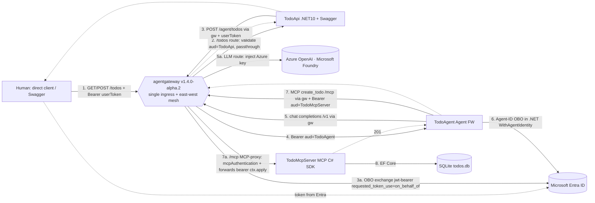
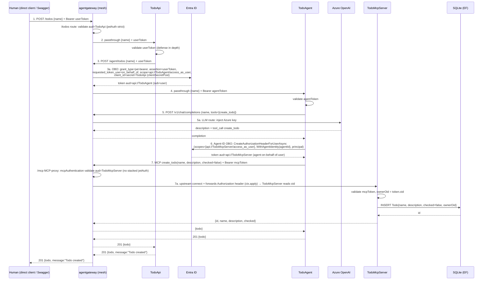

# PRD — Agentic Todo with Dual Entra OBO Chain

> **Status:** Draft v1.0 · **Date:** 2026-07-23 · **Owner:** chungquang.thang@heineken.com
> **Stack:** C#/.NET 10 · Aspire · agentgateway v1.4.0-alpha.2 · Microsoft Entra ID + Entra Agent ID · Microsoft Agent Framework · MCP C# SDK · EF Core (SQLite) · OpenTelemetry

---

## 1. Executive Summary

**Problem.** Teams want an AI-augmented todo app where a human supplies only a *name* and an agent enriches it — but every hop (user → API → agent → data store) must carry the *user's* identity for audit and least-privilege, not a shared service credential. Standard bearer-passthrough loses the delegation chain; naive service accounts over-grant.

**Solution.** A three-service system (no separate UI) where **agentgateway sits in front of every component as the single ingress + east-west mesh** — *all* traffic transits it (Human→**gw**→TodoApi→**gw**→TodoAgent→**gw**→Azure OpenAI, TodoAgent→**gw**→TodoMcpServer). The mesh chains **two On-Behalf-Of (OBO) token exchanges**:
1. **TodoApi → TodoAgent** — OBO *exchange performed in the gateway* (`backendAuth.oauthTokenExchange`, RFC 7523 jwt-bearer / Microsoft Entra OBO shape) on the `/agent/todos` route. **Primary path**; falls back to .NET OBO + gateway passthrough if the alpha exchange proves unstable (§4.4).
2. **TodoAgent → TodoMcpServer** — OBO performed *in .NET* via Microsoft Entra **Agent ID** (`IAuthorizationHeaderProvider.CreateAuthorizationHeaderForUserAsync(...).WithAgentIdentity(...)`); the resulting MCP call still **transits the gateway** as an **MCP-aware proxy** (`mcpAuthentication` validates the token at the edge, then forwards the `Authorization` header upstream so TodoMcpServer reads the user `oid` — PRV-1 ✅ proven, §7). Constraint: `/mcp` uses `mcpAuthentication` only (no stacked route `jwtAuth`). The gateway cannot mint FIC agent-identity tokens, so this hop's exchange stays in-process.

Other gateway routes: `/todos` (validate `aud=TodoApi`, passthrough → TodoApi) and `/v1/*` (LLM route → Azure OpenAI, injects the Azure key). Gateway validates the JWT at every route (`jwtAuth: strict`).

The agent uses a Microsoft Agent Framework `ChatClient` to generate a todo `description`, then calls an MCP tool that persists to SQLite via EF Core. The user's delegated identity flows end-to-end.

**Success Criteria (measurable KPIs).**
- **SC-1 Identity chain:** 100% of persisted todos carry an audit record whose `sub`/`oid` == the originating human user (verified from the token TodoMcpServer validated).
- **SC-2 Agent credential model:** TodoAgent (Blueprint) authenticates to Entra with a **client secret in local dev** (simplest; FIC issuer needs public reachability) and a **FIC signed assertion in production** (0 secrets). Credential source is config-swappable (`ClientCredentials`), no code change between envs.
- **SC-3 Token scoping:** Each exchanged token's `aud` matches only its immediate downstream (TodoAgent token `aud=api://<TodoAgent>`, TodoMcpServer token `aud=api://<TodoMcpServer>`); no over-scoped `.default` leakage to unintended resources (audited via decoded-token assertions in integration tests).
- **SC-4 Latency:** `POST /todos` p95 ≤ 3.5 s end-to-end (dominated by one LLM completion), excluding cold start.
- **SC-5 Description quality:** ≥ 90% of generated descriptions pass eval rubric (non-empty, ≤ 40 words, semantically related to name) over a 30-case benchmark.
- **SC-6 Auth enforcement:** 100% of unauthenticated/invalid-audience requests to TodoApi, gateway routes, and TodoMcpServer return `401/403` (never reach business logic).

---

## 2. User Experience & Functionality

### 2.1 Personas
- **Human user (primary):** authenticated employee (Entra ID). Calls TodoApi **directly** (OpenAPI/Swagger *try-it-out*, or own HTTP client) with a bearer token. Wants to jot a todo by name and get an auto-written description. Cares nothing about the internal token dance.
- **Platform/security engineer:** needs the full delegation chain auditable and least-privilege.

### 2.2 Epic

> **EPIC-1 — Delegated agentic todo creation.** As an authenticated user, I can create a todo by name and have an AI agent enrich and persist it, with my identity securely delegated through the API, the agent, and the data tier via two Entra OBO exchanges.

### 2.3 User Stories & Acceptance Criteria

**US-1 — Load todos.**
> As a human user, I want to `GET /todos` and see all my todos, so I have my working list.

- **AC-1.1** `GET {TodoApi}/todos` with `Authorization: Bearer <userToken>` (`aud=api://<TodoApi>`). No bearer / invalid → `401`.
- **AC-1.2** The caller obtains the token from Microsoft Entra ID out-of-band (Swagger *Authorize* / MSAL in their own client). TodoApi is a pure bearer-protected API — no interactive OIDC redirect, no server-rendered UI.
- **AC-1.3** Response is a JSON array of `{ id, name, description, checked }` scoped to the caller's `oid`.
- **AC-1.4** TodoApi exposes an OpenAPI document (`/openapi/v1.json`) + Swagger UI with the OAuth2 security scheme wired, so a human can authenticate and submit directly from the browser.

**US-2 — Create a todo (the OBO chain).**
> As a human user, I want to POST a name directly to TodoApi, so an agent writes the description and saves it.

- **AC-2.1** `POST {TodoApi}/todos` body `{ "name": "<string>" }`, `Bearer <userToken>`.
- **AC-2.2** TodoApi **validates** the token against Entra (issuer, audience `api://<TodoApi>`, signature, expiry). Invalid → `401`.
- **AC-2.3** TodoApi forwards the request to TodoAgent **through agentgateway**; the gateway performs the Entra OBO exchange (user token → `aud=api://<TodoAgent>` token) and forwards it. TodoApi writes **no** OBO code.
- **AC-2.4** TodoAgent validates the exchanged token, generates a `description` from `name` via `ChatClient`.
- **AC-2.5** TodoAgent performs Agent-ID OBO (→ `aud=api://<TodoMcpServer>`) and calls MCP tool `create_todo(name, description, checked=false)`.
- **AC-2.6** TodoMcpServer validates the token and persists `{ name, description, checked=false, ownerObjectId=<user oid> }` to SQLite via EF Core.
- **AC-2.7** On success, TodoApi returns `201` with `{ id, name, description, checked, message: "Todo created" }`.
- **AC-2.8** Any hop failure surfaces a `ProblemDetails` payload with the originating status. No partial writes (a failed persist → no todo row).

**US-3 — Auditable delegation (security engineer).**
> As a security engineer, I want each persisted todo to record the human's identity, so access is auditable.

- **AC-3.1** TodoMcpServer derives `ownerObjectId` from the validated token's `oid` claim — **not** from request body.
- **AC-3.2** The TodoMcpServer token shows agent-acting-on-behalf-of-user semantics (agent identity in actor claim; user in `oid`/`sub`).

### 2.4 Non-Goals (v1)
- **No front-end / UI project.** TodoApi is a bearer-protected API; humans call it directly (Swagger *try-it-out* or own client). No Blazor/SPA, no OIDC redirect, no textbox/button page.
- No edit/delete/complete endpoints (create + list only).
- No multi-tenant. Single Entra tenant.
- No production infra (Bicep/Container Apps). Local **Aspire** orchestration only.
- No autonomous (app-only) agent path — user-delegated (OBO) only.
- No streaming/token-by-token UI.
- No RBAC beyond scope/audience checks.

---

## 3. AI System Requirements

### 3.1 Tools & APIs
| Capability | Provider | Notes |
|---|---|---|
| Description generation | Microsoft Agent Framework `ChatClient` (`IChatClient`) | Model via **Azure OpenAI (Microsoft Foundry)**, reached through agentgateway `llm` endpoint (OpenAI-compatible `/v1`), matching reference pattern. Agent uses `OpenAIClient` — never the Azure SDK directly. |
| Persistence tool | MCP tool `create_todo` on TodoMcpServer | `[McpServerTool]`, called by the agent over Streamable HTTP. |
| List tool | MCP tool `list_todos` | Backs `GET /todos`. |

**Agent design.** TodoAgent = `_chatClient.AsAIAgent(instructions, tools:[create_todo])`. Instruction: *"Given a todo name, write one concise description (≤40 words), then call `create_todo` with name, your description, and checked=false. Return the saved todo."* The MCP tool is registered as an `AIFunction`; the LLM invokes it autonomously (tool-calling), so description-gen + persist happen in one agent turn.

### 3.2 Evaluation Strategy
- **Benchmark set:** 30 todo names (chores, work tasks, ambiguous one-word names).
- **Rubric (LLM-as-judge + assertions):** description non-empty, ≤ 40 words, no hallucinated commitments (dates/people not in name), topically related. **Pass ≥ 90%.**
- **Tool-call correctness:** 100% of runs must emit exactly one `create_todo` call with `checked=false` and the human-supplied `name` unchanged.
- **Real ChatClient in tests (no fakes):** tests exercise the **real** `IChatClient` (gateway provider) against the Azure OpenAI model via the agentgateway `llm` endpoint — same path as production. Reduce nondeterminism with low temperature + capped `max_tokens` and rubric assertions rather than exact-match. Pipeline (auth → OBO → MCP → EF) assertions do not depend on exact LLM text.

---

## 4. Technical Specifications

### 4.1 Component & Identity Map

| Component | Type | Entra registration | Key credential | Exposed scope |
|---|---|---|---|---|
| **TodoApi** | .NET 10 minimal API (+ OpenAPI/Swagger) | `entra-app-registration` | **client secret** (used by gateway for hop-1 OBO) | `api://<TodoApi>/access_as_user` |
| **TodoAgent** | .NET 10 + Agent FW | **Entra Agent ID** (blueprint + agent identity) | **client secret (local dev)** / **FIC signed assertion (prod)** on the Blueprint | `api://<TodoAgent>/access_as_user` |
| **TodoMcpServer** | .NET 10 MCP server | `entra-app-registration` | validation only | `api://<TodoMcpServer>/access_as_user` |
| **agentgateway** | published container `cr.agentgateway.dev/agentgateway:v1.4.0-alpha.2` — **single ingress + east-west mesh** (fronts every service) | uses TodoApi client creds for hop-1 exchange; holds Foundry creds for LLM route | TodoApi `clientSecret` + `AZURE_OPENAI_{ENDPOINT,DEPLOYMENT,API_KEY}` | — |

### 4.2 Architecture Overview



### 4.3 Sequence — `POST /todos` (the full OBO chain)



### 4.4 Integration Points & Config

**agentgateway = single ingress + east-west mesh (production, real Entra)** — `gateway.yaml`. An HTTP listener with routes `/todos` (validate+passthrough) and `/agent/todos` (OBO **exchange**), an **MCP-aware proxy** route `/mcp` (`mcpAuthentication` + upstream connect — NOT passthrough, see PRV-1), and an `llm` block (Foundry key injection). Every service sits behind the gateway. Config shape verified against alpha.2 examples.
```yaml
# Local standalone config (run: agentgateway -f gateway.yaml).
# SHAPE VERIFIED against alpha.2 examples: config + binds -> listeners -> routes -> backends[].policies
# ISSUER_V2 = https://login.microsoftonline.com/<TENANT_ID>/v2.0
# JWKS      = https://login.microsoftonline.com/<TENANT_ID>/discovery/v2.0/keys
config: {}
binds:
- port: 3000
  listeners:
  - name: public
    protocol: HTTP
    routes:
    # ---- INGRESS: Human -> gateway -> TodoApi (validate + passthrough) ----
    - name: todos
      matches: [{ path: { pathPrefix: /todos } }]
      policies:
        jwtAuth: { mode: strict, issuer: <ISSUER_V2>, audiences: [ api://<TodoApi_ClientId> ], jwks: { url: <JWKS> } }  # inbound-auth placement per alpha.2 — verify route vs listener
      backends:
      - host: todoapi:5001
        policies:
          backendAuth: { passthrough: {} }     # forward user token unchanged

    # ---- HOP-1 OBO EXCHANGE: TodoApi -> gateway -> TodoAgent (fields CONFIRMED vs alpha.2 example) ----
    - name: agent-todos
      matches: [{ path: { pathPrefix: /agent/todos } }]
      policies:
        jwtAuth: { mode: strict, issuer: <ISSUER_V2>, audiences: [ api://<TodoApi_ClientId> ], jwks: { url: <JWKS> } }
      backends:
      - host: todoagent:5002
        policies:
          backendAuth:
            oauthTokenExchange:                # <<< hop-1 OBO happens HERE
              host: login.microsoftonline.com:443   # :443 auto-enables backendTLS
              path: /<TENANT_ID>/oauth2/v2.0/token
              grantType: jwtBearer             # inbound token sent as `assertion`
              clientAuth:
                clientId: <TodoApi_ClientId>
                clientSecret: <TodoApi_ClientSecret>
                method: clientSecretPost       # client_id/secret in BODY
              scopes: [ api://<TodoAgent_ClientId>/access_as_user ]   # NOT .default (our own API)
              additionalParams:
                requested_token_use: '"on_behalf_of"'   # CEL string literal (inner quotes)

    # ---- MCP-AWARE PROXY: TodoAgent -> gateway -> TodoMcpServer ----
    # ⚠ agentgateway TERMINATES MCP and re-connects upstream — NOT transparent HTTP passthrough.
    - name: mcp
      matches: [{ path: { pathPrefix: /mcp } }]
      policies:
        mcpAuthentication:                     # validate downstream (agent) bearer at the edge
          mode: strict
          issuer: <ISSUER_V2>
          audiences: [ api://<McpServer_ClientId> ]
          jwks: { url: <JWKS> }
      backends:
      - mcp:
          targets:
          - name: todo-mcp
            static: { host: todomcpserver, port: 5003, path: /mcp, protocol: StreamableHTTP }
            # PRV-1 ✅ RESOLVED (§7): gateway forwards the downstream Authorization header
            #   to TodoMcpServer (ctx.apply, streamablehttp.rs:95) → TodoMcpServer reads user oid.
            #   Constraint: use mcpAuthentication ONLY on /mcp — do NOT add route jwtAuth here
            #   (auth.rs:34-42 rejects a pre-validated/stripped token).

# ---- LLM: TodoAgent -> gateway -> Azure OpenAI (Foundry) ----
llm:                                           # OpenAI-compatible endpoint on the gateway
  provider:
    azure:                                     # Azure OpenAI resource in Microsoft Foundry
      endpoint: ${AZURE_OPENAI_ENDPOINT}       # operator-supplied (R-A5)
      deployment: ${AZURE_OPENAI_DEPLOYMENT}   # deployment/model name
      apiKey: ${AZURE_OPENAI_API_KEY}          # injected by gateway; agent never sees it
  # TodoAgent uses AgentGateway:LlmEndpoint (…/v1/chat/completions). Verify exact llm keys in alpha.2.
```
Equivalent raw Entra request the gateway produces:
```
POST https://login.microsoftonline.com/<TENANT_ID>/oauth2/v2.0/token
grant_type=urn:ietf:params:oauth:grant-type:jwt-bearer
&requested_token_use=on_behalf_of
&assertion=<userToken>
&scope=api://<TodoAgent_ClientId>/access_as_user
&client_id=<TodoApi_ClientId>&client_secret=<TodoApi_ClientSecret>
```

#### Hop-1 strategy: gateway exchange (primary) → .NET OBO + passthrough (fallback)

agentgateway v1.4.0-**alpha.2** `oauthTokenExchange` is preview. Plan:

1. **Primary — try first.** Gateway does the OBO exchange (`backendAuth.oauthTokenExchange`, config above). TodoApi stays thin (forwards inbound bearer). **Validation gate:** integration test asserts the exchanged token forwarded to TodoAgent has `aud=api://<TodoAgent>`, `sub=<user>` (decode at a temporary echo backend / mock token endpoint, per the `mock_token.py` pattern).
2. **Fallback — only if primary fails** (alpha bug, unsupported param, unstable exchange). Switch the `/agent/todos` route to `backendAuth: { passthrough: {} }` and move OBO **into TodoApi (.NET)** — matching the loop-runtime reference. No other component changes; TodoAgent/TodoMcpServer/gateway topology identical.

**Fallback `/agent/todos` route** (exchange removed):
```yaml
- name: agent-todos
  matches: [{ path: { pathPrefix: /agent/todos } }]
  policies:
    jwtAuth: { mode: strict, issuer: <ISSUER>, audiences: [ api://<TodoAgent_ClientId> ], jwks: { url: <JWKS> } }
    backendAuth: { passthrough: {} }           # TodoApi already exchanged; forward unchanged
  backends: [ { host: todoagent:5002 } ]
```

**Fallback TodoApi** — adds OBO before forwarding (replaces the thin forward):
```csharp
// registration
builder.Services.AddAuthentication(JwtBearerDefaults.AuthenticationScheme)
    .AddMicrosoftIdentityWebApi(builder.Configuration.GetSection("AzureAd"))
    .EnableTokenAcquisitionToCallDownstreamApi()          // <-- fallback only
    .AddInMemoryTokenCaches();

// in the forward helper: mint TodoAgent token via .NET OBO, attach instead of the inbound bearer
var header = await _authHeaderProvider.CreateAuthorizationHeaderForUserAsync(
    new[] { $"{cfg["Agent:AppIdUri"]}/access_as_user" });  // api://<TodoAgent>/access_as_user, OBO of HttpContext.User
req.Headers.Authorization = AuthenticationHeaderValue.Parse(header);
// route now aud=api://<TodoAgent>, gateway passthrough forwards it
```
> Fallback flips one flag: gateway route `oauthTokenExchange`→`passthrough`, and TodoApi gains `EnableTokenAcquisitionToCallDownstreamApi()` + one OBO call. Toggle behind config `Hop1:Mode = gateway | dotnet`.

**TodoApi (primary — thin, no OBO code)**
```csharp
var builder = WebApplication.CreateBuilder(args);
builder.AddServiceDefaults();                              // Aspire OTel/health
builder.Services.AddAuthentication(JwtBearerDefaults.AuthenticationScheme)
    .AddMicrosoftIdentityWebApi(builder.Configuration.GetSection("AzureAd"));
builder.Services.AddHttpClient("agent", c =>
    c.BaseAddress = new Uri(builder.Configuration["Agent:GatewayBaseUrl"]!)); // -> agentgateway
builder.Services.AddProblemDetails();
builder.Services.AddOpenApi(o =>                          // .NET OpenAPI + OAuth2 security scheme
    o.AddDocumentTransformer((doc, ctx, ct) => { /* add OAuth2 authorizationCode scheme for api://<TodoApi> */ return Task.CompletedTask; }));
var app = builder.Build();
app.UseExceptionHandler(); app.UseStatusCodePages();
app.UseAuthentication(); app.UseAuthorization();
app.MapOpenApi();                                          // /openapi/v1.json  (+ Swagger UI in dev)

var todos = app.MapGroup("/todos").RequireAuthorization();

todos.MapGet("/", async (IHttpClientFactory f, HttpContext ctx) =>
{
    var res = await Forward(f, ctx, HttpMethod.Get, "/agent/todos", null);
    return Results.Stream(await res.Content.ReadAsStreamAsync(), "application/json");
})
.WithName("ListTodos").WithSummary("List all todos for the signed-in user");

todos.MapPost("/", async Task<Results<Created<TodoResponse>, ProblemHttpResult>>
    (CreateTodoRequest body, IHttpClientFactory f, HttpContext ctx) =>
{
    // forward inbound bearer verbatim; gateway does the OBO exchange
    var res = await Forward(f, ctx, HttpMethod.Post, "/agent/todos", body);
    if (!res.IsSuccessStatusCode)
        return TypedResults.Problem(await res.Content.ReadAsStringAsync(), statusCode: (int)res.StatusCode);
    var todo = await res.Content.ReadFromJsonAsync<TodoResponse>();
    return TypedResults.Created($"/todos/{todo!.Id}", todo with { Message = "Todo created" });
})
.WithName("CreateTodo").WithSummary("Create a todo by name; agent generates the description");

// helper: copy Authorization header onto the outbound request
static async Task<HttpResponseMessage> Forward(IHttpClientFactory f, HttpContext ctx,
    HttpMethod m, string path, object? body)
{
    var req = new HttpRequestMessage(m, path);
    req.Headers.Authorization = AuthenticationHeaderValue.Parse(ctx.Request.Headers.Authorization!);
    if (body is not null) req.Content = JsonContent.Create(body);
    return await f.CreateClient("agent").SendAsync(req);
}

public record CreateTodoRequest([property: Required, Description("Todo name")] string Name);
public record TodoResponse(int Id, string Name, string Description, bool Checked, string? Message = null);
```

**TodoAgent (hop-2 Agent-ID OBO + Agent FW)**
```csharp
builder.Services.AddAuthentication(JwtBearerDefaults.AuthenticationScheme)
    .AddMicrosoftIdentityWebApi(builder.Configuration.GetSection("AzureAd"))
    .EnableTokenAcquisitionToCallDownstreamApi()
    .AddInMemoryTokenCaches();
builder.Services.AddAgentIdentities();                    // Microsoft.Identity.Web.AgentIdentities
UseScopedOidcFicSignedAssertionProvider(builder.Services);// FIC signed-assertion cred (no secret)
builder.Services.AddChatClient(builder.Configuration);    // REAL IChatClient (gateway provider)
// AI:Provider=gateway, AgentGateway:LlmEndpoint=<gateway llm :4000>, AI:Model=<e.g. gpt-*-mini>
// -> new OpenAIClient(new ApiKeyCredential("agentgateway"), Endpoint={llm}/v1)
//        .GetChatClient(model).AsIChatClient() wrapped in TaggingChatClient. No FakeChatClient.

app.MapPost("/agent/todos", [Authorize] async Task<Results<Ok<TodoResponse>, ProblemHttpResult>>
    (CreateTodoRequest body, IChatClient chat, IAuthorizationHeaderProvider auth,
     IConfiguration cfg, HttpContext ctx, CancellationToken ct) =>
{
    // 1) MCP tool bound with hop-2 Agent-ID OBO auth header
    var mcp = await BuildMcpClient(auth, cfg, ctx.User, ct);
    var tools = await mcp.ListToolsAsync(ct);            // includes create_todo

    // 2) agent turn: LLM writes description then calls create_todo
    var agent = chat.AsAIAgent(
        instructions: "Given a todo name, write one concise description (<=40 words), " +
                      "then call create_todo(name, description, checked=false). Return the saved todo.",
        tools: tools);
    var result = await agent.RunAsync($"name: {body.Name}", ct);
    return TypedResults.Ok(result.GetStructured<TodoResponse>());
})
.WithName("CreateTodoViaAgent");

static async Task<McpClient> BuildMcpClient(IAuthorizationHeaderProvider auth,
    IConfiguration cfg, ClaimsPrincipal user, CancellationToken ct)
{
    var agentIdentityId = cfg["AgentIdentity:AgentIdentityId"]!;
    var scopes = new[] { $"{cfg["Mcp:AppIdUri"]}/access_as_user" };  // api://<TodoMcpServer>/access_as_user (our API)
    // NOTE: AgentIdentities SDK uses /.default internally for the fmi_path parent-token step; the *resource* scope stays access_as_user
    // *** hop-2 OBO exchange: user token -> TodoMcpServer token, agent-on-behalf-of-user ***
    var header = await auth.CreateAuthorizationHeaderForUserAsync(
        scopes,
        new AuthorizationHeaderProviderOptions().WithAgentIdentity(agentIdentityId),
        user, ct);
    var transport = new HttpClientTransport(new()
    {
        Endpoint = new Uri(cfg["Mcp:Endpoint"]!),
        TransportMode = HttpTransportMode.StreamableHttp,
        AdditionalHeaders = { ["Authorization"] = header },
    });
    return await McpClient.CreateAsync(transport, cancellationToken: ct);
}
```

**TodoMcpServer (MCP C# SDK + EF Core/SQLite persistence)**
```csharp
builder.AddServiceDefaults();
builder.Services.AddAuthentication(JwtBearerDefaults.AuthenticationScheme)
    .AddMicrosoftIdentityWebApi(builder.Configuration.GetSection("AzureAd"));
builder.Services.AddDbContext<TodoDbContext>(o =>
    o.UseSqlite(builder.Configuration.GetConnectionString("Todos")));   // Data Source=todos.db
builder.Services.AddMcpServer().WithHttpTransport().WithToolsFromAssembly();

var app = builder.Build();
app.UseAuthentication(); app.UseAuthorization();
app.MapMcp().RequireAuthorization();                       // MCP endpoint requires valid token
app.MapGet("/health", () => Results.Ok()).AllowAnonymous();
using (var s = app.Services.CreateScope())
    s.ServiceProvider.GetRequiredService<TodoDbContext>().Database.Migrate();
app.Run();

[McpServerToolType]
public class TodoTools
{
    [McpServerTool(Name = "create_todo"), Description("Persist a new todo")]
    public static async Task<TodoResponse> CreateTodo(
        TodoDbContext db, IHttpContextAccessor http,
        [Description("Human-supplied name")] string name,
        [Description("Agent-generated description")] string description,
        [Description("Completion state")] bool @checked = false)
    {
        var oid = http.HttpContext!.User.FindFirst("oid")?.Value    // owner from TOKEN, not body
                  ?? throw new UnauthorizedAccessException();
        var e = new Todo { Name = name, Description = description, Checked = @checked, OwnerObjectId = oid };
        db.Todos.Add(e);
        await db.SaveChangesAsync();
        return new(e.Id, e.Name, e.Description, e.Checked);
    }

    [McpServerTool(Name = "list_todos"), Description("List todos for the caller")]
    public static async Task<List<TodoResponse>> ListTodos(TodoDbContext db, IHttpContextAccessor http)
    {
        var oid = http.HttpContext!.User.FindFirst("oid")!.Value;
        return await db.Todos.Where(t => t.OwnerObjectId == oid)
            .Select(t => new TodoResponse(t.Id, t.Name, t.Description, t.Checked)).ToListAsync();
    }
}

public class Todo
{
    public int Id { get; set; }
    public string Name { get; set; } = "";
    public string Description { get; set; } = "";
    public bool Checked { get; set; }
    public string OwnerObjectId { get; set; } = "";
}
public class TodoDbContext(DbContextOptions<TodoDbContext> o) : DbContext(o)
{
    public DbSet<Todo> Todos => Set<Todo>();
}
```

**Aspire AppHost wiring**
```csharp
var builder = DistributedApplication.CreateBuilder(args);

// backends — reached ONLY through the gateway, never directly
var mcp   = builder.AddProject<Projects.TodoMcpServer>("todomcpserver");
var agent = builder.AddProject<Projects.TodoAgent>("todoagent")
    .WithEnvironment("AgentIdentity__AgentIdentityId", "<TodoAgent_AgentIdentityId>");
var api   = builder.AddProject<Projects.TodoApi>("todoapi");

// agentgateway — single ingress + east-west mesh in front of every service
var gateway = builder.AddContainer("agentgateway", "cr.agentgateway.dev/agentgateway", "v1.4.0-alpha.2")
    .WithBindMount("./gateway.yaml", "/app/gateway.yaml")
    .WithArgs("-f", "/app/gateway.yaml")
    // Foundry Azure OpenAI values supplied by operator via env (R-A5)
    .WithEnvironment("AZURE_OPENAI_ENDPOINT",   builder.Configuration["AzureOpenAI:Endpoint"])
    .WithEnvironment("AZURE_OPENAI_DEPLOYMENT", builder.Configuration["AzureOpenAI:Deployment"])
    .WithEnvironment("AZURE_OPENAI_API_KEY",    builder.Configuration["AzureOpenAI:ApiKey"])
    .WaitFor(api).WaitFor(agent).WaitFor(mcp);            // gateway is the public endpoint

// every service points at the gateway, never at each other
api.WithEnvironment("Agent__GatewayBaseUrl", gateway.GetEndpoint("http"));          // -> /agent/todos
agent.WithEnvironment("Mcp__Endpoint", $"{gateway.GetEndpoint("http")}/mcp")        // -> TodoMcpServer
     .WithEnvironment("AgentGateway__LlmEndpoint", gateway.GetEndpoint("http"));    // -> /v1 (Azure OpenAI)

builder.Build().Run();
```

### 4.5 Security & Privacy
- **Token validation at every hop:** TodoApi (JWT bearer), gateway route (`jwtAuth: strict`), TodoMcpServer (`RequireAuthorization`). Audience pinned per resource.
- **Least privilege:** each exchanged token scoped to exactly its downstream (`aud` check). No token reused across resources.
- **Agent credential:** **local dev** = client secret on the TodoAgent Blueprint (`SourceType=ClientSecret`); **prod** = FIC signed assertion (`SourceType=SignedAssertionFilePath`, `AZURE_FEDERATED_TOKEN_FILE`) — matches reference. Hop-1 secret (TodoApi) lives only in the gateway config, injected via env/secret store. ⚠ FIC + agentgateway did **not** work on alpha.1; retrying on alpha.2 — if the client-secret path also fails on the agent hop, escalate (see §7 R-2).
- **Owner integrity:** `ownerObjectId` taken from validated token `oid`, never request body (prevents spoofing another user's list).
- **Data:** SQLite local file; todo text may be user content — no PII beyond `oid`. Description generated by LLM (Azure OpenAI, no training on data).
- **Transport:** TLS to Entra (`:443` auto backendTLS); MCP over HTTPS in non-local.
- **Consent:** Agent identity requires admin consent for `api://<TodoMcpServer>` delegated permission; setup via Graph (`AgentIdentityBlueprint.*` scopes).

### 4.6 Observability (OpenTelemetry)
- Aspire `ServiceDefaults.AddServiceDefaults()` on every service (logging + tracing + metrics, OTLP exporter).
- Custom spans/tags: `gen_ai.tool.name=create_todo`, `mcp.method.name`, `mcp.session.id`, plus a `todo.owner.oid` tag on the create span for audit correlation.
- `OTEL_INSTRUMENTATION_GENAI_CAPTURE_MESSAGE_CONTENT` gated (off by default; on in dev only).

---

## 5. Risks & Roadmap

### 5.1 Phased Rollout
| Phase | Scope |
|---|---|
| **MVP** | Local Aspire (published gateway image). **Real** `IChatClient` (gateway provider → Foundry Azure OpenAI via gateway `llm`). Both OBO hops against real Entra; agent uses **client secret** (R-2). `create_todo` + `list_todos` MCP tools. Human hits gateway `/todos` directly (Swagger / az token). |
| **v1.1** | Eval harness (30-case benchmark, SC-5). Error toasts + ProblemDetails polish. Optional record/replay of LLM responses for CI speed (still the real client shape). |
| **v2.0** | Edit/complete/delete todos. Per-user todo sharing. Deploy infra (Bicep/Container Apps). Optional autonomous agent path. |

### 5.2 Technical Risks
| Risk | Impact | Mitigation |
|---|---|---|
| agentgateway v1.4.0-**alpha.2** OBO (`oauthTokenExchange`) preview instability | Hop-1 (primary) breaks | **Defined fallback** (§4.4): flip route to `passthrough` + do OBO in TodoApi (.NET), toggled by `Hop1:Mode`. Pin version; contract-test exchanged token `aud`/`sub` against mock endpoint (`mock_token.py` pattern) before trusting primary. |
| Entra Agent ID (preview) consent setup friction | Hop-2 blocked | Scripted setup (`setup-entra-obo-chain.ps1` pattern, adapted to 3-app todo domain); **client secret** on Blueprint for dev (no FIC issuer, R-2); `oauth2PermissionGrants` for delegated consent; repair-consent script. |
| LLM latency / cost on every create | SC-4 miss | Small model (`gpt-*-mini`); cap tokens; description ≤40 words; async UI. |
| Missing `oid` claim in exchanged token | Persist fails / bad audit | Assert `oid` presence in token; reject `401` early with clear message. |
| Partial failure (LLM ok, persist fails) | Orphaned work | No DB write until `create_todo`; single transaction; idempotency key optional in v1.1. |

### 5.3 Open Assumptions
- Hop-1 OBO: **try gateway `oauthTokenExchange` first** (primary); **fall back to .NET OBO + gateway passthrough** (loop-runtime's proven path) if the alpha exchange fails. Toggle `Hop1:Mode = gateway | dotnet` (§4.4). Both ship; primary is default.
- TodoMcpServer owns EF/SQLite persistence (`create_todo`/`list_todos`) — confirmed.
- Model reached via gateway `llm` OpenAI-compatible endpoint (reference pattern), not Azure SDK directly.
- Single tenant (confirmed R-4); TodoApi client **secret** used for hop-1 (in gateway). Agent hop uses client secret in local dev, FIC in prod (R-2).

---

## 6. Blindspots & Confidence Notes (first-timer)

Load-bearing facts a first build of an Entra OBO chain usually misses. **High confidence** — treat as build constraints.

- **CN-1 OBO needs a *delegated* user token.** OBO only works when the inbound token is delegated (carries a `scp` claim, e.g. `access_as_user`) — **not** an app-only/roles token. The human must acquire the token via an interactive/delegated flow (auth-code / device-code / Swagger *Authorize*). An app-only token → hop-1 exchange fails.
- **CN-2 Consent is a prerequisite, not runtime.** `.default`/OBO requires permissions **pre-consented** (admin consent). For the Agent Identity's delegated permission to TodoMcpServer, the Azure portal consent screen **does not work** — grant it programmatically via Graph `oauth2PermissionGrants`. After consent, new claims take 30–120 s to propagate (retry `403`).
- **CN-3 Token version must be v2.0.** Register all apps with `accessTokenAcceptedVersion = 2` so issuer is `.../v2.0` and `oid`/`scp` claims line up with `AddMicrosoftIdentityWebApi` and the gateway `jwtAuth.issuer`. Mismatched token version = silent `401`s.
- **CN-4 Read owner via the right claim.** Use `ClaimsPrincipal.GetObjectId()` (Microsoft.Identity.Web), not `FindFirst("oid")` — the raw claim is often the long `.../objectidentifier` URI, so a naive `oid` lookup returns null and breaks owner scoping.
- **CN-5 The two OBO hops are *chained* — hop-1's output is hop-2's input.** The token hop-1 mints (aud = TodoAgent) becomes the *assertion* for hop-2's Agent-ID OBO. Entra Agent ID OBO requires that assertion's audience be `api://<TodoAgent-Blueprint>/access_as_user` **with a delegated scope** — a bare `.default`-audience token is rejected (`AADSTS50013`). ✅ **RESOLVED (R-3):** hop-1 requests `api://<TodoAgent>/access_as_user` (not `.default`) — applied throughout §4.4 + diagrams.
- **CN-6 Provisioning happens *before* first run.** All Entra objects must exist first: 2 app registrations (TodoApi, TodoMcpServer) + the Agent-ID chain (Blueprint → **BlueprintPrincipal** (not auto-created) → Agent Identity) + exposed scopes + `identifierUris: api://{appId}` + delegated grants + FIC. Script it (PowerShell/Graph), like the reference `setup-entra-obo-chain.ps1`. Chicken-and-egg if skipped.
- **CN-7 Agent ID is preview.** Feature availability, licensing, and Graph roles (Agent Identity Developer/Administrator) are tenant-gated. Confirm before designing around it. See Q-1.

## 7. Resolved Decisions & Test Guidance

Answers folded in (2026-07-23). Locked unless noted.

- **R-1 Tenant & licensing.** Agent ID preview **enabled** in tenant `768437b2-…`. Setup principal's Graph roles/scopes (`AgentIdentityBlueprint.*`, `AgentIdentity.Create.All`, `DelegatedPermissionGrant.ReadWrite.All`) will be acquired at implementation time via PowerShell (`Connect-MgGraph -Scopes …`) and recorded in the setup script.
- **R-2 Agent credential.** **Local dev = client secret** on the TodoAgent Blueprint; **prod = FIC**. ⚠ Watch item: FIC + agentgateway failed on **alpha.1**; retrying on **alpha.2**. If the client-secret agent hop also fails on alpha.2, flag immediately — do not silently work around.
- **R-3 Scopes.** Use explicit `access_as_user` for **all** our own APIs (hop-1 `api://<TodoAgent>/access_as_user`, hop-2 `api://<TodoMcpServer>/access_as_user`); **never `.default`** (all apps are ours). (The AgentIdentities SDK still uses `/.default` internally for the fmi_path parent step — that's separate from the resource scope.)
- **R-4 Tenant topology.** Single tenant for all three apps + the agent. No cross-tenant.
- **R-5 Human token for testing.** Use `az account get-access-token` or device-code. Guidance below — follow it to mint a token with the **right scope**.

### Getting a user token to call TodoApi (test guidance)

The token MUST be a **delegated user token** with audience `api://<TodoApi_ClientId>` and scope `access_as_user` (CN-1).

**Option A — Azure CLI (fastest).**
```bash
# Pre-req: authorize the Azure CLI client on TodoApi's app registration:
#   TodoApi > Expose an API > Authorized client applications >
#   add 04b07795-8ddb-461a-bbee-02f9e1bf7b46 (Azure CLI) for the access_as_user scope.
az login --tenant <TENANT_ID>
az account get-access-token \
  --scope "api://<TodoApi_ClientId>/access_as_user" \
  --query accessToken -o tsv
# -> paste as: Authorization: Bearer <token>  (hit the GATEWAY /todos, not TodoApi directly)
```

**Option B — Device code (no CLI pre-authorization; needs a public-client app reg).**
```bash
# Register a public client "TodoTestClient" (Allow public client flows = yes),
# grant it delegated permission api://<TodoApi_ClientId>/access_as_user + admin consent.
curl -s -X POST "https://login.microsoftonline.com/<TENANT_ID>/oauth2/v2.0/devicecode" \
  -d "client_id=<TodoTestClient_ClientId>" \
  -d "scope=api://<TodoApi_ClientId>/access_as_user offline_access"
# open verification_uri, enter user_code, then poll the token endpoint:
curl -s -X POST "https://login.microsoftonline.com/<TENANT_ID>/oauth2/v2.0/token" \
  -d "grant_type=urn:ietf:params:oauth:grant-type:device_code" \
  -d "client_id=<TodoTestClient_ClientId>" \
  -d "device_code=<device_code_from_above>"
# -> use .access_token as the Bearer against the gateway /todos
```
> Verify the minted token before use: decode at jwt.ms and confirm `aud = api://<TodoApi_ClientId>`, `scp` contains `access_as_user`, `ver = 2.0`. Wrong `aud`/`scp` → hop-1 OBO fails.

### Proof results & watch items (verified against agentgateway v1.4.0-alpha.2 source, 2026-07-23)
- **W-1 ✅ RESOLVED (you confirmed):** `oid` reachable inside `[McpServerTool]` — *provided the user token actually reaches TodoMcpServer* (see PRV-1, which can invalidate this).
- **W-2 ✅ PROVEN LIVE (2026-07-23):** hop-1 `oauthTokenExchange` works end-to-end against the real tenant. Two real bugs found+fixed along the way, neither in the exchange mechanics itself: (1) `audiences:` must be the bare client-ID GUID, never `api://`-prefixed — a real v2.0 token's `aud` claim is always bare, regardless of the `api://.../scope` requested; agentgateway's `jwtAuth`/`mcpAuthentication` do a literal match (no `api://` leniency, unlike `Microsoft.Identity.Web`). (2) `oauthTokenExchange.host` must be a full `https://` URI, not a bare `host:port` string — a bare string parses as `TargetOrUri::Target` (`agent.rs` ~L1462-1518) which never enables backendTLS, causing "connection closed before message completed" against Entra's TLS-only port 443; only the `https://` URI form auto-pushes a `BackendTLS` policy.
- **PRV-1 — CORRECTED (2026-07-23, live proof superseded the source-only read below).** The source-only analysis below concluded `mcpAuthentication` forwards the Authorization header unconditionally via `ctx.apply`. Live testing proved this incomplete: with no `backendAuth` policy configured on the MCP target, TodoMcpServer received **no** Authorization header at all (confirmed via a temporary diagnostic middleware logging `Authorization present=False`). The real requirement: an explicit `backendAuth: { passthrough: {} }` policy is needed as a **sibling of the target's `mcp:` block** (`LocalMcpTarget { name, spec, policies: Option<SimpleLocalBackendPolicies> }` in `local.rs`) — without it, `mcpAuthentication` validates and STRIPS the header same as `jwtAuth`, exactly like every other route type. Original source-only note (superseded, kept for record):
  - ~~The MCP-aware proxy **does forward** the downstream `Authorization` header to the upstream TodoMcpServer: `crates/agentgateway/src/mcp/upstream/streamablehttp.rs:95` calls `ctx.apply(&mut req)` on every upstream request...~~ — `ctx.apply` forwarding was real but only applies to a token that already reached the proxy layer; `mcpAuthentication` strips the token before that point unless `backendAuth` re-adds it.
  - Also found live: the gateway route's external path prefix (`/mcp`) does not need to match TodoMcpServer's own served path — `MapMcp()` with no argument serves at root `/`, so the target host must have no `/mcp` suffix.
  - **Design constraint (from `auth.rs:34-42`, still valid):** on the `/mcp` route use **`mcpAuthentication` ONLY — do NOT also add route-level `jwtAuth`**. If a prior JWT layer validates/strips the token first, `mcpAuthentication` rejects with *"JWT token already validated and stripped"*. (The gateway.yaml `/mcp` route already uses `mcpAuthentication` alone.)
  - Residual (trivial): `mcpAuthentication` (strict, `aud=<TodoMcpServer>` bare GUID) and TodoMcpServer's own `AddMicrosoftIdentityWebApi` validate the *same* token — same issuer/aud, so both pass.
- **W-2b ✅ RESOLVED (2026-07-24, both read+write proven):** full OBO chain proven end-to-end for both `GET /todos` (`200`) and `POST /todos` (`201`, real ChatClient-generated description, persisted) through the complete public path (Human → gateway → TodoApi → gateway hop-1 exchange → TodoAgent → hop-2 Agent-ID OBO → gateway → TodoMcpServer, plus TodoAgent → gateway LLM route → Foundry). `Hop1:Mode=dotnet` fallback was never needed — none of the 5 real bugs found were hop-1/hop-2 mechanics. Note: an initial `POST /todos` `404 model_not_found` was first (wrongly) attributed to a bad Foundry deployment name in `.env.local` — that guess was disproven (`az cognitiveservices account deployment list` confirmed the deployment is real and running). The actual cause: agentgateway's `/v1/chat/completions` route matches the request's `model` field against `gateway.yaml`'s `llm.models[].name` by **exact string match** (`model_router.rs::resolve_concrete_model`), and `apphost.cs` was sending the raw Azure deployment name instead of the gateway's route name (`"agentic-todo"`). Fixed by wiring `AI__Model` to the literal route name.

---

## 8. Addendum — Group-Based Authorization (Entra Security Groups)

> **Appended 2026-07-27 04:32 UTC.** Everything above this line is the ORIGINAL PRD (through §7); everything below is a NEW requirement layered on top of the already-shipped, already-proven OBO chain. Identifiers in this section use an `RBAC-` prefix (not `R-`/`CN-`/`W-`) specifically so they're never confused with the original decisions above.

### 8.1 Executive Summary

- **Problem:** every authenticated user currently has identical rights — anyone who can mint a token can create todos. There is no notion of an administrator vs. a regular user.
- **Solution:** gate todo *creation* (write access) behind Entra security-group membership. Members of `SuperAdminGroup` retain full read/write access; members of `NormalUserGroup` (and anyone not in `SuperAdminGroup`) get read-only access and a clear, actionable error if they attempt to write.
- **Success criteria:**
  - SC-RBAC-1: bob (SuperAdminGroup) can `POST /todos` and receives `201`.
  - SC-RBAC-2: alice (NormalUserGroup) can `GET /todos` (`200`) but `POST /todos` returns a `403` with an actionable `ProblemDetails` message (not a bare empty "Forbidden") — generic wording, no PII (see 8.4 correction).
  - SC-RBAC-3: the same enforcement holds at all three service boundaries (TodoApi, TodoAgent, TodoMcpServer) — defense in depth, not just a single UI-adjacent check.

### 8.2 Actors (real tenant objects, verified live via Microsoft Graph 2026-07-27)

| Actor | Value |
|-------|-------|
| SuperAdminGroup | `bc0caaf3-67d3-4db3-a8bd-dbb7e74ddcda` |
| NormalUserGroup | `bcb0d596-cd1a-4026-b5ea-11cd434b3644` |
| bob (SuperAdmin) | `bob@thangchungonthenetgmail.onmicrosoft.com`, oid `71df37ed-6ba5-4ce8-a012-6439d12d68b8` — confirmed member of SuperAdminGroup via `GET /groups/{id}/members` |
| alice (NormalUser) | `alice@thangchungonthenetgmail.onmicrosoft.com`, oid `c17bbeb6-f319-4b7e-b2ea-a3399420a3db` — confirmed member of NormalUserGroup via `GET /groups/{id}/members` |

### 8.3 User Stories & Acceptance Criteria

- **Story RBAC-A:** As bob (SuperAdmin), I want to create and list todos so I can manage the system without restriction.
  - AC: `POST /todos` → `201`; `GET /todos` → `200`.
- **Story RBAC-B:** As alice (NormalUser), I want to list todos so I can see what exists, but I should be blocked from creating one and be told to contact an admin.
  - AC: `GET /todos` → `200`; `POST /todos` → `403` with a `ProblemDetails` body whose `detail` is `"You do not have permission to perform this action. Contact application admin to request access."` — not a bare `403 Forbidden`, and no admin email or other PII in the response (see 8.4 correction).
- **Non-goals:** no admin UI to manage group membership (managed in Entra directly); no per-todo ACLs; no role hierarchy beyond the binary SuperAdmin/NormalUser split; no self-service "request access" flow (RBAC-B's error message is informational only).

### 8.4 Technical Design

- **Claim source:** Entra `groups` claim on the access token. Requires `groupMembershipClaims: "SecurityGroup"` on the **app registration whose audience the token targets** — this is per-resource, not global. Verified live (2026-07-27): TodoApi already had it set; TodoAgent (Blueprint) and TodoMcpServer did not — both were updated (`az rest PATCH /applications(appId=...) {"groupMembershipClaims":"SecurityGroup"}`) so the `groups` claim survives the hop-1 (TodoApi→TodoAgent) and hop-2 (TodoAgent→TodoMcpServer) OBO exchanges, not just the original human token TodoApi sees.
- **Enforcement pattern:** ASP.NET Core claims-based authorization, per [Microsoft Learn: Claim-based authorization](https://learn.microsoft.com/en-us/aspnet/core/security/authorization/claims?view=aspnetcore-10.0) — `AddAuthorizationBuilder().AddPolicy("RequireSuperAdmin", policy => policy.RequireClaim("groups", superAdminGroupId))`, applied only to the write route/tool, not the read path.
- **Enforcement points (defense in depth, all three services per operator's explicit request):**
  1. TodoApi — `POST /todos` requires the `RequireSuperAdmin` policy.
  2. TodoAgent — `POST /agent/todos` requires the same policy (in case TodoApi is ever bypassed, e.g. a future direct-to-gateway caller).
  3. TodoMcpServer — the `create_todo` MCP tool checks group membership itself before touching the database (the last line of defense before persistence).
- **Fail-safe default:** absence of the `groups` claim, or presence without the SuperAdminGroup GUID, is treated as NormalUser (read-only) — never elevated. No implicit trust of a missing claim.
- **Friendly error:** a shared, environment-agnostic forbidden-response handler (not the ASP.NET Core default empty `403`) returns a `ProblemDetails` body, reused across all three services (same "shared cross-cutting concern lives in ServiceDefaults" pattern already used for token diagnostics).
- **Config, not hardcoding:** the SuperAdminGroup GUID flows in via an Aspire parameter (`apphost.cs`), matching the existing discipline for every other Entra ID used in this project — never hardcoded in application code.
- **CORRECTED (2026-07-27, same day, operator-flagged):** the first implementation put the admin's email address (bob's) directly in the `403` response body. Operator correctly flagged this as exposing user PII to any caller that can trigger the check (not just legitimate admins). Fixed: the message is now the fixed generic string above, with no interpolated contact info. The `Authorization:AdminContact` config key, the `admin-contact-email` Aspire parameter, and `ADMIN_CONTACT_EMAIL` in `.env`/`.env.local` were all removed as dead code rather than left unused.

### 8.5 Risks & Watch Items

- **RBAC-RISK-1:** Entra's `groups` claim overflows to a `hasgroups: true` marker (requiring a Graph call fallback) once a user belongs to more groups than the overage threshold (default ~200 for JWTs from v2.0 endpoints, exact number tenant/token-type dependent). Not a concern for bob/alice today (1 relevant group each), but a real limit if group count grows — out of scope to solve now, flagged for awareness.
- **RBAC-RISK-2:** `groupMembershipClaims: "SecurityGroup"` only returns *security* groups, not Microsoft 365 groups or directory roles — both SuperAdminGroup/NormalUserGroup are confirmed security groups, so this is correct for now but would need revisiting (`"All"`) if future groups are of a different type.
