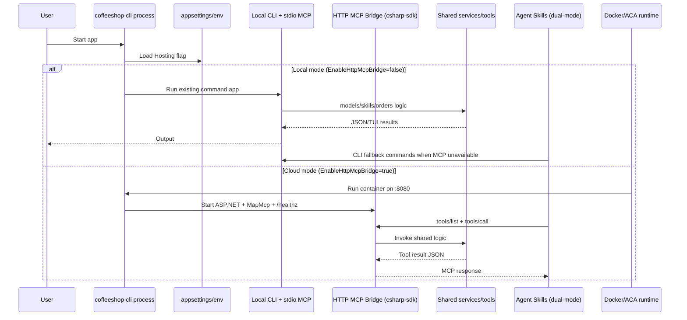

# CLI + MCP Dual-Mode

Single binary. `Hosting:EnableHttpMcpBridge=false` → local CLI + stdio MCP (default). `=true` → ASP.NET Core HTTP MCP bridge on `:8080`.

## MCP Bridge ([csharp-sdk](https://github.com/modelcontextprotocol/csharp-sdk)) + Dual-Mode Code

### Program.cs

```csharp
using CoffeeshopCli.Commands.Docs;
using CoffeeshopCli.Commands.Mcp;
using CoffeeshopCli.Commands.Models;
using CoffeeshopCli.Commands.Skills;
using CoffeeshopCli.Configuration;
using CoffeeshopCli.Infrastructure;
using CoffeeshopCli.Mcp;
using CoffeeshopCli.Mcp.Tools;
using CoffeeshopCli.Models;
using CoffeeshopCli.Services;
using Microsoft.AspNetCore.Builder;
using Microsoft.Extensions.DependencyInjection;
using ModelContextProtocol.Protocol;
using ModelContextProtocol.Server;
using Spectre.Console.Cli;

var cfg = ConfigLoader.Load();

return cfg.Hosting.EnableHttpMcpBridge
    ? await RunHttpBridgeAsync(cfg)
    : RunCliMode(args, cfg);

static int RunCliMode(string[] args, CliConfig cfg)
{
    var services = new ServiceCollection();
    services.AddSingleton(cfg);
    services.AddSingleton<ModelRegistry>();
    services.AddSingleton<IDiscoveryService>(sp =>
    {
        var registry = sp.GetRequiredService<ModelRegistry>();
        var loaded = sp.GetRequiredService<CliConfig>();
        return new FileSystemDiscoveryService(registry, loaded.Discovery.SkillsDirectory);
    });
    services.AddSingleton<SkillRunner>();
    services.AddSingleton<ModelTools>();
    services.AddSingleton<SkillTools>();
    services.AddSingleton<OrderTools>();
    services.AddSingleton<OrderSubmitHandler>();
    services.AddSingleton<ToolRegistry>();
    services.AddSingleton<McpServerHost>();

    var registrar = new TypeRegistrar(services);
    var app = new CommandApp(registrar);

    app.Configure(config =>
    {
        config.SetApplicationName("coffeeshop-cli");

        config.AddBranch("models", models =>
        {
            models.SetDescription("Browse and submit data models");
            models.AddCommand<ModelsListCommand>("list");
            models.AddCommand<ModelsShowCommand>("show");
            models.AddCommand<ModelsQueryCommand>("query");
            models.AddCommand<ModelsBrowseCommand>("browse");
            models.AddCommand<ModelsSubmitCommand>("submit");
        });

        config.AddBranch("skills", skills =>
        {
            skills.SetDescription("Browse and invoke agent skills");
            skills.AddCommand<SkillsListCommand>("list");
            skills.AddCommand<SkillsShowCommand>("show");
            skills.AddCommand<SkillsInvokeCommand>("invoke");
        });

        config.AddBranch("mcp", mcp =>
        {
            mcp.SetDescription("Expose tools over stdio MCP transport");
            mcp.AddCommand<McpServeCommand>("serve");
        });

        config.AddBranch("docs", docs =>
        {
            docs.SetDescription("Browse docs in TUI");
            docs.AddCommand<DocsBrowseCommand>("browse");
        });
    });

    return app.Run(args);
}

static async Task<int> RunHttpBridgeAsync(CliConfig cfg)
{
    var builder = WebApplication.CreateBuilder();

    if (!string.IsNullOrWhiteSpace(cfg.Hosting.Urls))
        builder.WebHost.UseUrls(cfg.Hosting.Urls);

    builder.Services.AddSingleton(cfg);
    builder.Services.AddSingleton<ModelRegistry>();
    builder.Services.AddSingleton<IDiscoveryService>(sp =>
    {
        var registry = sp.GetRequiredService<ModelRegistry>();
        var loaded = sp.GetRequiredService<CliConfig>();
        return new FileSystemDiscoveryService(registry, loaded.Discovery.SkillsDirectory);
    });
    builder.Services.AddSingleton<SkillParser>();
    builder.Services.AddSingleton<OrderSubmitHandler>();
    builder.Services.AddHealthChecks();

    builder.Services
        .AddMcpServer(options =>
        {
            options.ServerInfo = new Implementation
            {
                Name = "coffeeshop-cli-http-bridge",
                Version = "0.1.0"
            };
        })
        .WithHttpTransport()
        .WithTools<CoffeeshopMcpBridgeTools>();

    var app = builder.Build();
    app.MapHealthChecks(cfg.Hosting.HealthRoute);
    app.MapMcp(cfg.Hosting.HttpMcpRoute);

    await app.RunAsync();
    return 0;
}

public sealed class CoffeeshopMcpBridgeTools
{
    private readonly IDiscoveryService _discovery;
    private readonly SkillParser _skillParser;
    private readonly OrderSubmitHandler _orderSubmitHandler;

    public CoffeeshopMcpBridgeTools(
        IDiscoveryService discovery,
        SkillParser skillParser,
        OrderSubmitHandler orderSubmitHandler)
    {
        _discovery = discovery;
        _skillParser = skillParser;
        _orderSubmitHandler = orderSubmitHandler;
    }

    [McpServerTool(Name = "skill_list", Title = "List discovered skills")]
    public object SkillList() =>
        new
        {
            ok = true,
            skills = _discovery.DiscoverSkills().Select(s => new
            {
                name = s.Name,
                description = s.Description,
                version = s.Version,
                category = s.Category,
                loop_type = s.LoopType
            })
        };

    [McpServerTool(Name = "skill_show", Title = "Show one skill manifest")]
    public object SkillShow(string name)
    {
        var skill = _discovery.DiscoverSkills()
            .FirstOrDefault(s => s.Name.Equals(name, StringComparison.OrdinalIgnoreCase));

        if (skill is null)
        {
            return new { ok = false, error = "skill_not_found", name };
        }

        var content = skill.Content ?? File.ReadAllText(skill.Path);
        var manifest = _skillParser.Parse(content);

        return new
        {
            ok = true,
            skill = new
            {
                name = manifest.Frontmatter.Name,
                description = manifest.Frontmatter.Description,
                metadata = manifest.Frontmatter.Metadata,
                body = manifest.Body
            }
        };
    }

    [McpServerTool(Name = "skill_invoke", Title = "Invoke skill non-interactive")]
    public async Task<object> SkillInvoke(string name, SkillInvokeArgs args)
    {
        if (!name.Equals("coffeeshop-counter-service", StringComparison.OrdinalIgnoreCase))
        {
            return new { ok = false, error = "skill_not_supported_for_remote", name };
        }

        if (!args.intent.Equals("process-order", StringComparison.OrdinalIgnoreCase))
        {
            return new { ok = false, error = "intent_not_supported_for_submit", intent = args.intent };
        }

        if (!args.confirm)
        {
            return new
            {
                ok = true,
                state = new
                {
                    customer_id = args.customer_id,
                    intent = args.intent,
                    items = args.items,
                    confirmed = false
                },
                message = "confirmation_required"
            };
        }

        var input = new SimplifiedOrderInput
        {
            CustomerId = args.customer_id,
            Items = (args.items ?? []).Select(i => new SimplifiedOrderItemInput
            {
                ItemType = Enum.Parse<ItemType>(i.item_type, ignoreCase: true),
                Qty = i.qty
            }).ToList()
        };

        var order = await _orderSubmitHandler.SubmitAsync(input);

        return new
        {
            ok = true,
            skill = name,
            state = new
            {
                customer_id = order.CustomerId,
                intent = args.intent,
                confirmed = true
            },
            result = new
            {
                order_id = order.OrderId,
                status = order.Status.ToString(),
                total = order.Total,
                placed_at = order.PlacedAt
            }
        };
    }

    [McpServerTool(Name = "menu_list_items", Title = "List menu items")]
    public object MenuListItems() =>
        new
        {
            ok = true,
            items = SampleDataStore.Menu.Select(i => new
            {
                item_type = i.ItemType.ToString(),
                name = i.Name,
                category = i.Category,
                price = i.Price
            })
        };

    [McpServerTool(Name = "customer_lookup", Title = "Lookup customer by email or id")]
    public object CustomerLookup(string? email = null, string? customer_id = null)
    {
        var customer = !string.IsNullOrWhiteSpace(email)
            ? SampleDataStore.GetCustomerByEmail(email)
            : !string.IsNullOrWhiteSpace(customer_id)
                ? SampleDataStore.GetCustomerById(customer_id)
                : null;

        if (customer is null)
        {
            return new { ok = false, error = "customer_not_found" };
        }

        return new
        {
            ok = true,
            customer = new
            {
                customer_id = customer.CustomerId,
                name = customer.Name,
                email = customer.Email,
                tier = customer.Tier.ToString()
            }
        };
    }

    [McpServerTool(Name = "order_submit", Title = "Submit simplified order")]
    public async Task<object> OrderSubmit(string customer_id, List<OrderLineInput> items)
    {
        var input = new SimplifiedOrderInput
        {
            CustomerId = customer_id,
            Items = items.Select(i => new SimplifiedOrderItemInput
            {
                ItemType = Enum.Parse<ItemType>(i.item_type, ignoreCase: true),
                Qty = i.qty
            }).ToList()
        };

        var order = await _orderSubmitHandler.SubmitAsync(input);

        return new
        {
            ok = true,
            order_id = order.OrderId,
            customer_id = order.CustomerId,
            status = order.Status.ToString(),
            total = order.Total,
            placed_at = order.PlacedAt
        };
    }

    public sealed record OrderLineInput(string item_type, int qty);
    public sealed record SkillInvokeArgs(
        string customer_id,
        string intent,
        List<OrderLineInput>? items,
        bool confirm = false);
}
```

> **Notes:**
> - `RegisterCoreServices` removed. Stdio-specific services (`McpServerHost`, `ToolRegistry`, etc.) stay in `RunCliMode`; HTTP mode registers only what it needs.
> - `models_browse` tool dropped — `menu_list_items` covers it; skills already prefer it.

### CoffeeshopCli.csproj (required changes)

Two additions. The project SDK stays as `Microsoft.NET.Sdk`; add a `FrameworkReference` to unlock ASP.NET Core APIs without switching the full SDK.

```xml
<ItemGroup>
  <!-- existing -->
  <FrameworkReference Include="Microsoft.AspNetCore.App" />

  <!-- add alongside existing packages -->
  <PackageReference Include="ModelContextProtocol.AspNetCore" Version="1.1.0" />
</ItemGroup>
```

> Check https://www.nuget.org/packages/ModelContextProtocol.AspNetCore for the latest stable/preview version.

### CliConfig.cs (required changes)

Add `HostingConfig` record and a `Hosting` property to `CliConfig`. Without this `cfg.Hosting` does not exist and `Program.cs` fails to compile.

```csharp
/// <summary>
/// HTTP MCP bridge hosting configuration.
/// </summary>
public sealed record HostingConfig
{
    public bool EnableHttpMcpBridge { get; init; } = false;
    public string HttpMcpRoute { get; init; } = "/mcp";
    public string HealthRoute { get; init; } = "/healthz";
    public string Urls { get; init; } = "http://0.0.0.0:8080";
}

// Update CliConfig to include Hosting:
public sealed record CliConfig
{
    public DiscoveryConfig Discovery { get; init; } = new();
    public McpConfig Mcp { get; init; } = new();
    public HostingConfig Hosting { get; init; } = new(); // ADD
}
```

### ConfigLoader.cs (required changes)

Replace the entire loader. Drop user profile config (`~/.config/coffeeshop-cli/config.json`) and the `COFFEESHOP_*` prefix. Single source of truth: `appsettings.json` + environment variables only.

```csharp
public static CliConfig Load(string? basePath = null)
{
    var env = Environment.GetEnvironmentVariable("ASPNETCORE_ENVIRONMENT") ?? "Production";

    var builder = new ConfigurationBuilder();

    if (basePath is not null)
        builder.SetBasePath(basePath);

    builder
        .AddJsonFile("appsettings.json", optional: true, reloadOnChange: false)
        .AddJsonFile($"appsettings.{env}.json", optional: true, reloadOnChange: false)
        .AddEnvironmentVariables();

    var configuration = builder.Build();

    var skillsDirectory = configuration["Discovery:SkillsDirectory"] ?? "./skills";

    var cfg = new CliConfig
    {
        Discovery = new DiscoveryConfig { SkillsDirectory = skillsDirectory },
        Mcp = new McpConfig(),
        Hosting = new HostingConfig()
    };

    var serversSection = configuration.GetSection("Mcp:Servers");
    if (serversSection.Exists())
    {
        var servers = new Dictionary<string, McpServerConfig>(StringComparer.OrdinalIgnoreCase);
        foreach (var child in serversSection.GetChildren())
        {
            var server = new McpServerConfig
            {
                Command = child["Command"] ?? "",
                Args = child.GetSection("Args").GetChildren().Select(c => c.Value ?? "").ToList(),
                WorkingDirectory = child["WorkingDirectory"] ?? "."
            };
            servers[child.Key] = server;
        }
        cfg = cfg with { Mcp = new McpConfig { Servers = servers } };
    }

    var hostingSection = configuration.GetSection("Hosting");
    if (hostingSection.Exists())
    {
        cfg = cfg with
        {
            Hosting = new HostingConfig
            {
                    EnableHttpMcpBridge = bool.TryParse(hostingSection["EnableHttpMcpBridge"], out var flag) && flag,
                HttpMcpRoute        = hostingSection["HttpMcpRoute"] ?? "/mcp",
                HealthRoute         = hostingSection["HealthRoute"]  ?? "/healthz",
                Urls                = hostingSection["Urls"]         ?? "http://0.0.0.0:8080"
            }
        };
    }

    return cfg;
}
```

> `basePath` is only needed in tests (pass a temp directory path). Production callers use `ConfigLoader.Load()` with no arguments.

### appsettings.json

```json
{
  "Hosting": {
    "EnableHttpMcpBridge": false,
    "HttpMcpRoute": "/mcp",
    "HealthRoute": "/healthz",
    "Urls": "http://0.0.0.0:8080"
  },
  "Discovery": {
    "SkillsDirectory": "./skills"
  }
}
```

ACA: set only `Hosting__EnableHttpMcpBridge=true`. All other values match defaults and need no override.

## Dockerfile — [`mcr.microsoft.com/dotnet/aspnet`](https://mcr.microsoft.com/en-us/artifact/mar/dotnet/aspnet/about)

```dockerfile
FROM mcr.microsoft.com/dotnet/sdk:10.0 AS build
WORKDIR /src

COPY coffeeshop-cli.slnx ./
COPY src/CoffeeshopCli/CoffeeshopCli.csproj src/CoffeeshopCli/
RUN dotnet restore src/CoffeeshopCli/CoffeeshopCli.csproj

COPY . .
RUN dotnet publish src/CoffeeshopCli/CoffeeshopCli.csproj \
    -c Release \
    -o /app/publish \
    /p:UseAppHost=false

FROM mcr.microsoft.com/dotnet/aspnet:10.0 AS runtime
WORKDIR /app

ENV Hosting__EnableHttpMcpBridge=false
ENV Hosting__Urls=http://0.0.0.0:8080
ENV Hosting__HealthRoute=/healthz
ENV Hosting__HttpMcpRoute=/mcp

COPY --from=build /app/publish ./
USER app
EXPOSE 8080
ENTRYPOINT ["dotnet", "CoffeeshopCli.dll"]
```

```bash
docker build -t coffeeshop-cli:latest .

# Cloud MCP bridge mode
docker run --rm -p 8080:8080 -e Hosting__EnableHttpMcpBridge=true coffeeshop-cli:latest
```

## Skills: Dual-Mode Rule (full files)

MCP-first, CLI fallback. Each skill tries MCP tools first; runs `Coffeeshop-Cli` exec only when MCP is unavailable.

### skills/coffeeshop-menu-guide/SKILL.md

```markdown
---
name: coffeeshop-menu-guide
description: >
  Help users explore menu items, categories, and prices. MCP-first, CLI fallback.
license: MIT
metadata:
  author: coffeeshop-cli
  version: "1.1"
  category: discovery
---

# Coffee Shop Menu Guide Skill

Use this skill when the user asks for menu options, categories, prices, or recommendations.

## Data Access — `get_menu_catalog`

1. `tools/call menu_list_items {}`
2. `Coffeeshop-Cli models browse MenuItem --json`

Normalize to: `[{"item_type":"...","name":"...","category":"...","price":0.00}]`

## Workflow

1. Execute `get_menu_catalog`.
2. Filter/group by user intent. Return 3-6 options unless full list requested.
3. Offer handoff to `coffeeshop-counter-service` if user wants to order.

## Safety Notes

- Never fabricate items or prices.
- Format money as `$<amount with 2 decimals>`.
- If all paths fail, return concise retry guidance.
```

### skills/coffeeshop-customer-lookup/SKILL.md

```markdown
---
name: coffeeshop-customer-lookup
description: >
  Resolve customer identity and account basics by email or customer ID. MCP-first, CLI fallback.
license: MIT
metadata:
  author: coffeeshop-cli
  version: "1.1"
  category: support
---

# Coffee Shop Customer Lookup Skill

Use this skill when the user asks account-related questions or provides customer identifiers.

## Data Access — `lookup_customer`

1. `tools/call customer_lookup {"email":"<email>"}` or `{"customer_id":"<id>"}`
2. `Coffeeshop-Cli models query Customer --email <email> --json`
   (or `--customer-id <id>`, or `models browse Customer --json`)

Normalize to: `{"customer_id":"...","name":"...","email":"...","tier":"..."}`

## Workflow

1. Extract email or customer ID from context.
2. Resolve `lookup_customer`. Prefer specific lookup over broad browse.
3. Return normalized summary.

## Safety Notes

- Never infer identity from a weak match.
- Never expose unrelated customer records.
- If lookup fails, ask for exact email/customer ID.
```

### skills/coffeeshop-counter-service/SKILL.md

```markdown
---
name: coffeeshop-counter-service
description: >
  End-to-end counter: identify customer, classify intent, build order, confirm, submit.
  MCP-first, CLI fallback.
license: MIT
metadata:
  author: coffeeshop-cli
  version: "3.4"
  category: operations
  loop-type: agentic
---

# Coffee Shop Order Submission Skill

## Data Access

| Action | MCP tool | CLI fallback |
|--------|----------|--------------|
| `lookup_customer` | `customer_lookup` | `Coffeeshop-Cli models query Customer ... --json` |
| `list_menu` | `menu_list_items` | `Coffeeshop-Cli models browse MenuItem --json` |
| `submit_order` | `order_submit` | `Coffeeshop-Cli models submit Order --json` |

## Agentic Loop

1. **INTAKE** — Identify customer.
2. **CLASSIFY INTENT** — `account | item-types | process-order | order-status`.
3. **REVIEW & CONFIRM** — Build items + total. Show summary. Require explicit confirmation.
4. **FINALIZE** — Submit. Return order ID, total, ETA.

## Safety Notes

- Never invent unavailable menu items.
- Never finalize before user confirmation.
```

## Cloud Mode: How Tools and Skills Are Called

In cloud mode, MCP clients can do both:
- skill management via `skill_list` and `skill_show`
- skill execution via `skill_invoke` (non-interactive contract)

Tool discovery:

```http
POST /mcp
Content-Type: application/json

{
    "jsonrpc": "2.0",
    "id": 1,
    "method": "tools/list",
    "params": {}
}
```

Expected tool names include:
- `skill_list`
- `skill_show`
- `skill_invoke`
- `menu_list_items`
- `customer_lookup`
- `order_submit`

MCP calls for skill load/show/invoke:

```http
POST /mcp
Content-Type: application/json

{
    "jsonrpc": "2.0",
    "id": 2,
    "method": "tools/call",
    "params": {
        "name": "skill_list",
        "arguments": {}
    }
}
```

```http
POST /mcp
Content-Type: application/json

{
    "jsonrpc": "2.0",
    "id": 3,
    "method": "tools/call",
    "params": {
        "name": "skill_show",
        "arguments": {
            "name": "coffeeshop-counter-service"
        }
    }
}
```

```http
POST /mcp
Content-Type: application/json

{
    "jsonrpc": "2.0",
    "id": 4,
    "method": "tools/call",
    "params": {
        "name": "skill_invoke",
        "arguments": {
            "name": "coffeeshop-counter-service",
            "args": {
                "customer_id": "C-1001",
                "intent": "process-order",
                "items": [
                    { "item_type": "LATTE", "qty": 1 }
                ],
                "confirm": true
            }
        }
    }
}
```

Domain calls used inside those skill flows:

```http
POST /mcp
Content-Type: application/json

{
    "jsonrpc": "2.0",
    "id": 5,
    "method": "tools/call",
    "params": {
        "name": "menu_list_items",
        "arguments": {}
    }
}
```

```http
POST /mcp
Content-Type: application/json

{
    "jsonrpc": "2.0",
    "id": 6,
    "method": "tools/call",
    "params": {
        "name": "customer_lookup",
        "arguments": {
            "email": "alice@example.com"
        }
    }
}
```

```http
POST /mcp
Content-Type: application/json

{
    "jsonrpc": "2.0",
    "id": 7,
    "method": "tools/call",
    "params": {
        "name": "order_submit",
        "arguments": {
            "customer_id": "C-1001",
            "items": [
                { "item_type": "LATTE", "qty": 1 },
                { "item_type": "CROISSANT", "qty": 2 }
            ]
        }
    }
}
```

Skill-to-tool mapping in cloud mode:
- `coffeeshop-menu-guide` -> `menu_list_items`
- `coffeeshop-customer-lookup` -> `customer_lookup`
- `coffeeshop-counter-service` -> `skill_invoke` (orchestrator), internally using `customer_lookup`, `menu_list_items`, `order_submit`

## End-to-End Diagram



## Acceptance Criteria

1. `EnableHttpMcpBridge=false`: existing CLI behavior unchanged.
2. `EnableHttpMcpBridge=true`: `/mcp` and `/healthz` respond in container.
3. Skills run MCP-first, CLI fallback.
4. Docker image switches modes via `Hosting__EnableHttpMcpBridge` env override only.

## References

| Name | URL |
|------|-----|
| MCP C# SDK (`ModelContextProtocol.AspNetCore`) | https://github.com/modelcontextprotocol/csharp-sdk |
| Model Context Protocol spec | https://modelcontextprotocol.io/ |
| Spectre.Console | https://spectreconsole.net/ |
| .NET 10 / ASP.NET Core | https://dotnet.microsoft.com/en-us/download/dotnet/10.0 |
| .NET container images (`sdk:10.0`, `aspnet:10.0`) | https://mcr.microsoft.com/en-us/artifact/mar/dotnet/aspnet/about |
| Azure Container Apps | https://learn.microsoft.com/en-us/azure/container-apps/overview |
