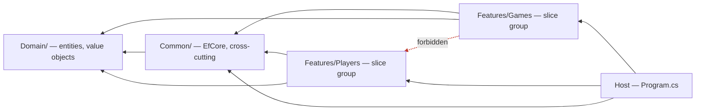
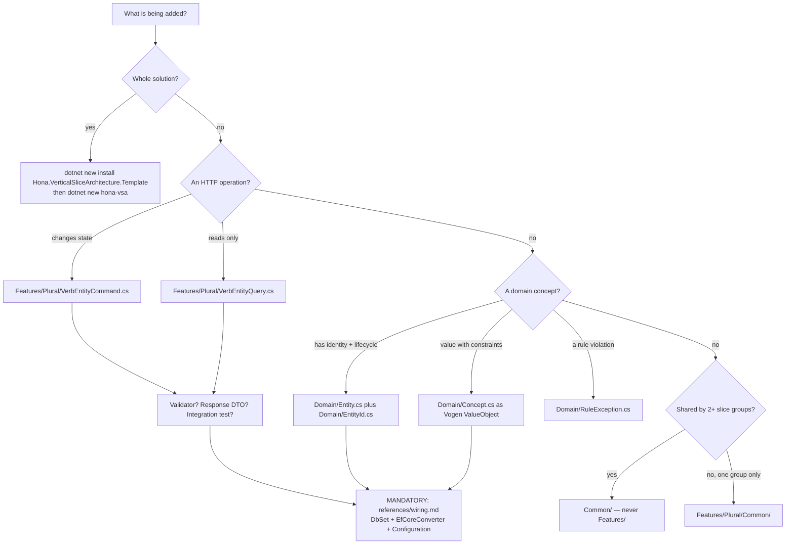
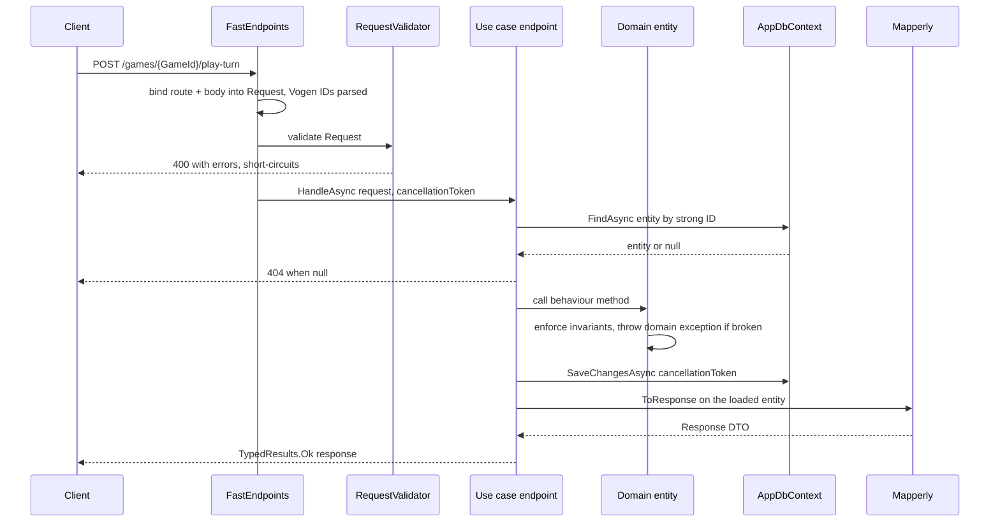

# Vertical Slice Architecture (Clean Architecture, sliced)

This skill encodes the structure of the `Hona/VerticalSliceArchitecture` template so you can
scaffold components correctly the first time and reason about an unfamiliar repo quickly.

The single most valuable thing here is the **wiring map**: in this architecture most additions
touch more than one file, and the extra files are not discoverable by reading the file you edit.
Skipping them produces code that compiles and fails at runtime. Read `references/wiring.md`
before finishing any scaffolding task.

## Why this layout exists

Classic Clean Architecture cuts the codebase **horizontally** — one project per ring, and an
interface at every ring boundary (`IGameRepository`, `IDateTimeProvider`, …). The cost is that a
single feature is smeared across four projects, and most of those interfaces have exactly one
implementation forever.

VSA keeps Clean Architecture's **dependency rule** (dependencies point inward, `Domain` at the
centre, and nothing in `Domain` knows about the web or the database) and deletes the
**project-per-ring plus interface-per-boundary** ceremony. One use case is one file. Coupling is
cut per feature instead of per layer.

Practical consequence: `AppDbContext` is injected straight into an endpoint. That is deliberate,
not a mistake — do not "fix" it by introducing a repository interface unless the user asks.

### Clean Architecture ring → VSA location

| Clean Architecture ring | Lives in | May depend on |
| --- | --- | --- |
| Entities / domain model | `Domain/` | nothing (only BCL + Vogen/Guard attributes) |
| Use cases / application logic | body of `HandleAsync` in the slice file | `Domain`, `Common` |
| Interface adapters (controller, presenter, DTOs) | same slice file: `Configure()`, `Request`, plus `Features/{Plural}/Common/{Entity}Response.cs` | `Domain`, `Common` |
| Infrastructure / frameworks | `Common/EfCore/`, `Program.cs` | `Domain` |

Because the use case and its adapter sit in the same file, a slice is read top-to-bottom: DTO,
validator, route, logic. That is the property that makes this layout fast to navigate.

## Dependency model



Five invariants the architecture tests enforce. Treat them as hard constraints while scaffolding:

1. **`Domain` depends on nothing.** No EF Core, no ASP.NET, no `Common`, no `Features`.
2. **`Common` depends only on `Domain`.** It never reaches into `Features`.
3. **Slice groups never depend on each other.** If `Features/Games` needs something from
   `Features/Players`, that something belongs in `Domain` or `Common` — move it, do not import
   across groups. This is the invariant most often broken by accident.
4. **Use cases are `internal sealed`, CQRS-named** (`*Command` for writes, `*Query` for reads),
   and each has a sibling `Request` and, unless it returns `Created`/`NoContent`, a `Response`.
5. **Every entity's ID is a Vogen value object**, never a bare `Guid`/`int`.

## Directory map

```
src/{App}/
├── Program.cs                     host: DI, FastEndpoints, Swagger, migrations
│                                  also holds [assembly: VogenDefaults(...)]
│                                  ends with `public partial class Program;` (tests need it)
├── GlobalUsings.cs                why slice files have almost no `using` lines
├── Domain/                        dependency-free core
│   ├── {Entity}.cs                entity: private EF ctor + public ctor + behaviour methods
│   ├── {Entity}Id.cs              [ValueObject<Guid>] strong ID
│   ├── {Concept}.cs               value objects, enums
│   └── {Rule}Exception.cs         domain exceptions
├── Common/                        infrastructure + cross-cutting, one level above Domain
│   └── EfCore/
│       ├── AppDbContext.cs        DbSet per aggregate root; applies configs by assembly scan
│       ├── EfCoreConverters.cs    [EfCoreConverter<T>] per Vogen ID — easy to forget
│       ├── DependencyInjectionExtensions.cs
│       ├── Configuration/{Entity}Configuration.cs
│       └── Migrations/
└── Features/                      one folder per slice group (plural noun)
    └── {Plural}/
        ├── {Verb}{Entity}Command.cs   one write use case, whole file
        ├── {Verb}{Entity}Query.cs     one read use case, whole file
        └── Common/                    shared *within this group only*
            └── {Entity}Response.cs    response DTO + [Mapper] Mapperly class

tests/
├── {App}.Unit.Tests/Domain/         entity behaviour, no host, no DB
├── {App}.Integration.Tests/         real host + Testcontainers Postgres, per-slice tests
│   ├── IntegrationTestBase.cs
│   ├── TestAppFactory.cs
│   └── Features/{Plural}/{UseCase}Tests.cs
└── {App}.Architecture.Tests/        the five invariants above
```

### Naming convention

Derived from the template's own `dotnet new` symbols. Stay consistent — the architecture tests and
the source generators both key off these shapes.

| Symbol | Example | Used for |
| --- | --- | --- |
| `{Entity}` | `Game` | entity type, DTO prefix, config class |
| `{Plural}` | `Games` | `Features/Games/`, `DbSet<Game> Games` |
| `{pluralCamel}` | `games` | route segment: `/games`, `/games/{GameId}/play-turn` |
| `{Verb}{Entity}` | `PlayTurn`, `NewGame`, `ViewGame` | use-case class name stem |

## Scaffolding decision flow



`dotnet new hona-vsa` already scaffolds the solution and `dotnet new hona-vsa-slice
--featureName X` scaffolds a slice group. Prefer those over hand-writing boilerplate when the
template is installed; hand-write single slices, since a slice is one file.

## Request lifecycle



The read path differs in one important way: a query never loads an entity and maps it. It projects
in the database via `ProjectToResponse()` on `IQueryable<T>` with `AsNoTracking()`, so only the
response columns are fetched. Using `ToResponse()` in a query is a correctness-neutral but real
performance bug — see `references/templates.md`.

## Slice anatomy

One use case, one file, in this order. The order matters for readability, which is the point of
the architecture.

```
namespace {App}.Features.{Plural};

public  sealed record {Verb}{Entity}Request(...)          // public: tests construct it
internal sealed class {Verb}{Entity}RequestValidator      // optional; auto-discovered
         : AbstractValidator<{Verb}{Entity}Request>
internal sealed class {Verb}{Entity}Command(AppDbContext db)
         : Endpoint<{Verb}{Entity}Request, Results<Ok<{Entity}Response>, NotFound>>
    Configure()      // verb + route + auth + Swagger summary
    HandleAsync()    // the entire use case
```

Pseudocode for the two shapes. Port these to any stack; the branch structure is the contract.

```
COMMAND (writes):
    entity <- db.FindAsync<Entity>(request.StrongId, ct)
    if entity is null: return NotFound
    entity.BehaviourMethod(request...)        # invariants live in Domain, not here
    db.SaveChangesAsync(ct)
    return Ok(entity.ToResponse())            # in-memory map, entity already loaded

QUERY (reads):
    response <- db.{Plural}
                  .AsNoTracking()
                  .Where(x => x.Id == request.StrongId)
                  .ProjectToResponse()        # projection pushed into SQL
                  .FirstOrDefaultAsync(ct)
    if response is null: return NotFound
    return Ok(response)

CREATE (writes, no response body):
    entity <- new Entity(EntityId.FromNewGuid(), request...)
    db.Add(entity); db.SaveChangesAsync(ct)
    return Created("/{pluralCamel}/" + entity.Id)
```

Two rules for where logic goes, both from the template's own guidance:

- **Start in the slice.** Write "just get it working" code in `HandleAsync`. Promote logic into
  `Domain` only when a second use case needs it. Premature domain modelling is the main failure
  mode here.
- **Invariants are the exception.** Anything that must hold for the entity to be valid belongs in
  the entity from the start, so no slice can bypass it.

## Wiring checklist

Each line is a dependency that is invisible from the file you are editing. Full explanations,
failure symptoms, and code in `references/wiring.md` — read it, do not work from memory.

- Adding a **Vogen strong ID** → also add `[EfCoreConverter<TId>]` in
  `Common/EfCore/EfCoreConverters.cs`, or EF Core cannot persist it.
- Using **`Id.FromNewGuid()`** → requires `[assembly: VogenDefaults(customizations:
  Customizations.AddFactoryMethodForGuids)]` in `Program.cs`.
- Adding an **aggregate root** → also add `DbSet<T>` to `AppDbContext` and
  `Common/EfCore/Configuration/{Entity}Configuration.cs`.
- Mapping a **collection or array property** → the `HasConversion` needs a `ValueComparer`, or EF
  Core silently misses changes and `SaveChangesAsync` writes nothing.
- Adding an **endpoint** → discovery is source-generated; new endpoints appear via
  `DiscoveredTypes.All` and need no registration, but they do need `FastEndpoints.Generator`
  referenced and a successful build.
- Adding an **integration test** → `Program.cs` must keep `public partial class Program;`.
- Throwing a **domain exception** from a slice → decide its HTTP mapping explicitly; the template
  ships no global handler, so an uncaught domain exception becomes a 500.

## Verify before reporting done

```bash
dotnet build                      # source generators run here; endpoint + mapper errors surface
dotnet test tests/{App}.Architecture.Tests   # the five invariants
dotnet test                        # integration tests need Docker for Testcontainers
```

A change is not finished until `dotnet build` is clean: FastEndpoints, Vogen, and Mapperly are all
source generators, so a large class of mistakes in this architecture is invisible until build time
and does not appear in the editor.

## References

- `references/templates.md` — copy-ready code for every component: entity, value object, strong
  ID, EF configuration, command, query, validator, Mapperly response, and the three test kinds.
  Read when writing any new file.
- `references/wiring.md` — the dependency and correlation map: what to touch when adding each
  component, why, and the runtime symptom when it is missed. Read before finishing any scaffolding
  task.
</content>
</invoke>
