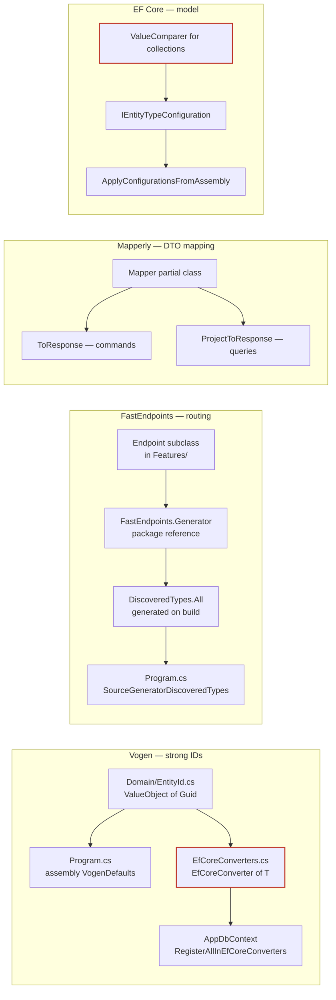
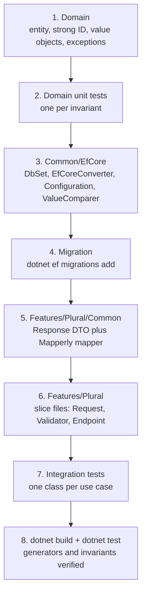

# Wiring and correlation map

In this architecture a component is rarely self-contained. Four source generators (Vogen,
Mapperly, FastEndpoints, EF Core's model builder) stitch files together, so the file you edit
usually does not mention the other file you must also edit. Nothing in the editor points at the
gap.

Use this document as a checklist when scaffolding, and as a lookup table when something behaves
strangely at runtime.

## 1. Component → what else must change

| Adding | Also touch | Consequence of skipping |
| --- | --- | --- |
| Vogen strong ID (`[ValueObject<Guid>]`) | `Common/EfCore/EfCoreConverters.cs`: add `[EfCoreConverter<TId>]` | Model-building exception at startup; EF treats the ID as an unmapped type |
| Any call to `Id.FromNewGuid()` | `Program.cs`: `[assembly: VogenDefaults(customizations: Customizations.AddFactoryMethodForGuids)]` | Compile error, `FromNewGuid` does not exist |
| Aggregate root entity | `AppDbContext`: `DbSet<T>`; plus `Configuration/{Entity}Configuration.cs` | No `DbSet` means no LINQ entry point for queries; no key configured means a model-building exception |
| Property that is a collection or array, via `HasConversion` | a `ValueComparer` as the third `HasConversion` argument | **Silent data loss** — in-place mutations are never detected, `SaveChangesAsync` writes nothing, the HTTP response still looks correct |
| Owned value object | `builder.OwnsOne(...)` in the parent's configuration; no `DbSet` of its own | Model-building exception, or the type is mapped as a separate table |
| Endpoint (`*Command` / `*Query`) | nothing to register — but the project must reference `FastEndpoints.Generator` and the build must succeed | Route 404s; `DiscoveredTypes.All` is regenerated only on a successful build |
| Response DTO | `[Mapper]` class in the same `Features/{Plural}/Common/` file, with **both** `ToResponse` and `ProjectToResponse` | Commands or queries cannot map; adding the missing overload later is easy to forget |
| Enum on a request or response | already handled by the three `JsonStringEnumConverter` registrations in `Program.cs`; tests must pass `JsonSerializerOptions` | Enums serialise as integers in tests only, producing confusing assertion failures |
| Request validator | nothing — same-assembly `AbstractValidator<T>` is auto-discovered | (none; but a validator in a different assembly is silently ignored) |
| New EF migration | `dotnet ef migrations add` into `Common/EfCore/Migrations/` | `MigrateAsync()` in `Program.cs` has nothing to apply; schema drifts from the model |
| Integration test project | `Program.cs` must keep `public partial class Program;` | `WebApplicationFactory<Program>` cannot resolve the entry point — the error appears in the *test* project |
| Shared logic used by 2+ slice groups | move it to `Domain` (a rule) or `Common` (infrastructure) | A cross-group `using` fails `Features_DontDependOn_EachOther` |
| Constant reused across layers (`MaxNameLength`) | the entity's guard, the request validator, and `HasMaxLength` in the configuration | The three limits drift; validation passes and the database truncates or throws |

## 2. The four generator chains

Each chain has a link that produces no compile error when broken. These are the ones to verify
explicitly.

The two red nodes are the silent failures:

- **`EfCoreConverters.cs`** — no compile error, no editor warning. It fails when the app builds
  its EF model, i.e. on first request or first test.
- **`ValueComparer`** — no error at all, ever. The write is simply dropped. This is the most
  dangerous omission in the architecture, and the reason the integration-test template in
  `templates.md` re-reads the entity in a **fresh scope**: within the original scope the change
  tracker returns the mutated in-memory graph and the assertion passes regardless.

## 3. Symptom → cause

| Symptom | Likely cause |
| --- | --- |
| Startup or first-request exception mentioning a property of type `{Entity}Id` | Missing `[EfCoreConverter<{Entity}Id>]` in `EfCoreConverters.cs` |
| `FromNewGuid` does not compile | Missing `VogenDefaults` assembly attribute in `Program.cs` |
| New endpoint returns 404 | Build did not succeed, so `DiscoveredTypes.All` is stale; or `FastEndpoints.Generator` is not referenced |
| Endpoint responds 200 but the change is not in the database | Missing `ValueComparer` on a converted collection; or `AsNoTracking()` used on a write path |
| Query is slow and loads whole entities | `ToResponse()` used on a materialised entity instead of `.ProjectToResponse()` on the `IQueryable` |
| `ProjectToResponse` does not compile | A custom `[UserMapping]` method used in the projection is not expression-translatable |
| Enum arrives as `0` instead of `"XTurn"` in a test | Test call omitted the base class's `JsonSerializerOptions` |
| Integration tests fail to start, host not found | `public partial class Program;` was removed from `Program.cs` |
| Integration tests fail with a Docker or container error | Docker is not running; Testcontainers needs a live daemon |
| Architecture test `Features_DontDependOn_EachOther` fails | A `using {App}.Features.<OtherGroup>` crept in — promote the shared type to `Domain` or `Common` |
| Architecture test `UseCases_Are_CqrsNamed` fails | Use-case class not suffixed `Command` or `Query` |
| Architecture test `DomainEntity_Id_IsStrongId` fails | Entity keyed on a bare `Guid`/`int` instead of a Vogen value object |
| Domain exception surfaces as HTTP 500 | Expected — the template ships no global handler; see §5 |

## 4. Order of operations

Adding a feature touches layers inward-out, because each step compiles against the one before it.
Following this order means the build stays green between steps.

Skipping straight to step 6 is the common shortcut and it is where the wiring gaps in §1 get
introduced, because the slice file compiles perfectly without any of steps 3–5 being complete.

## 5. Known gaps in the template

Not bugs to fix silently — decisions the template leaves to the consuming project. Raise them with
the user rather than inventing a convention.

- **No global exception handler.** A domain exception thrown inside `HandleAsync` becomes a 500
  with no body. Two reasonable resolutions: catch it in the slice and return
  `TypedResults.BadRequest(...)`, or add a FastEndpoints exception handler in `Program.cs`. Pick
  one and apply it consistently; mixing the two makes the API's error contract unpredictable.
- **No pipeline for cross-cutting concerns.** Logging, authorisation, and transaction scoping are
  per-slice today. The template's own README lists FastEndpoints pre/post processors as the
  intended home for these.
- **`AllowAnonymous()` on every endpoint.** The template's default. Any real deployment must
  revisit it; do not copy it into a new slice without asking.
- **`EnsureCreatedAsync()` before `MigrateAsync()` in `Program.cs`, under `#if DEBUG`.** Fine for
  local development, wrong for production — the release path applies no migrations at all, so
  deployment must run them another way.
</content>
