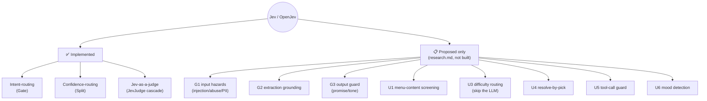
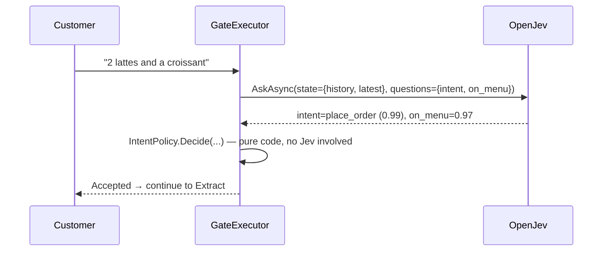
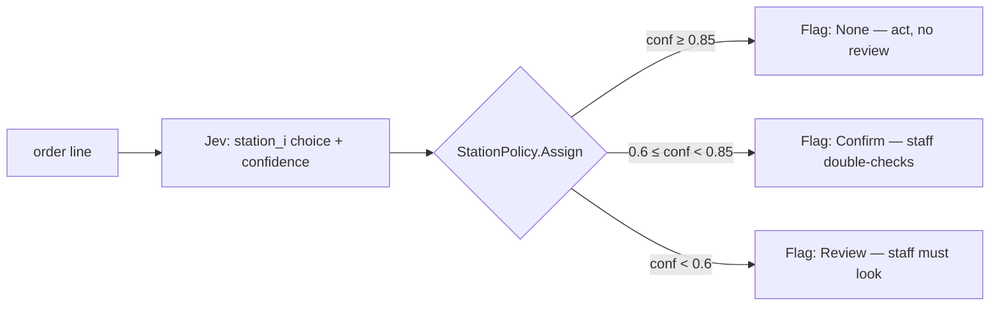
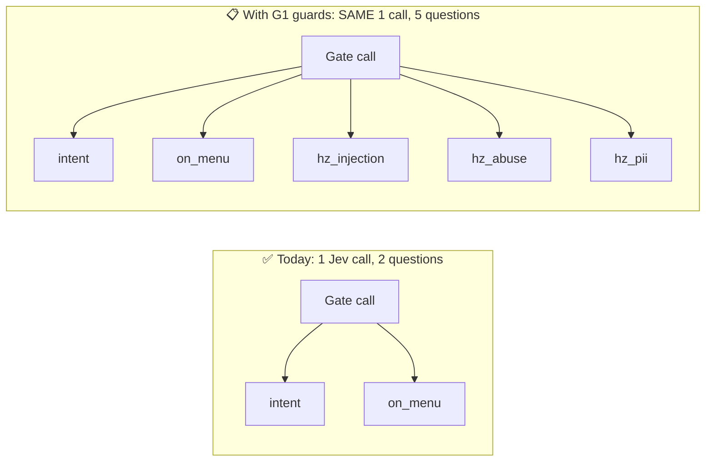
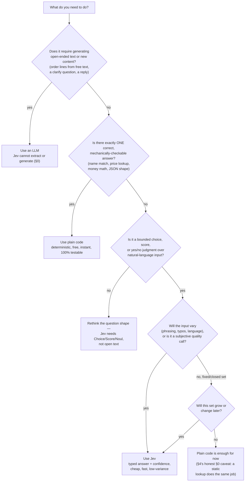

# Learning Jev: every use case and pattern in this repo

A complete inventory of how Jev/OpenJev is actually used (and proposed to be used) in
`coffeeshop-jev`, with pros/cons of Jev vs. the alternatives for each. This is the "when and why"
companion — see `LearningLLMAsJudgeWithJev.md` for the eval/judge mechanics in depth.

**Ground rule for this document:** every pattern below is labeled **✅ Implemented** (real code,
verified live this session) or **📋 Proposed only** (designed in `research.md`, never built — Phase
1b guards were explicitly skipped, see `tasks.md`). Don't confuse the two.

---

## 1. What Jev actually is, in one paragraph

Jev is **not an LLM**. It doesn't generate text — it reads a `state` (any JSON) plus one or more
typed `questions`, and returns typed `answers`: a category (`Choice`), a position on an ordered
scale (`Score`), or a probability (`Noul`), each with a confidence. See
`LearningLLMAsJudgeWithJev.md` §6 for the full mechanical explanation. This document is about **when to
reach for that tool versus an LLM versus plain code**, across every place this repo does (or
considered) exactly that.

---

## 2. The full inventory



| # | Pattern | Status | File | research.md |
|---|---|---|---|---|
| 1 | Intent-routing | ✅ | `GateExecutor.cs`, `GateQuestions.cs` | §4.1 |
| 2 | Confidence-routing | ✅ | `SplitExecutor.cs`, `StationQuestions.cs` | §4.2 |
| 3 | Jev-as-a-judge (accept/escalate) | ✅ | `tests/CoffeeShop.Evals/JevJudge.cs` | §10.6, §10.6a |
| 4 | G1 input hazards | 📋 | — | §11.4 |
| 5 | G2 extraction grounding | 📋 | — | §11.4 |
| 6 | G3 output guard | 📋 | — | §11.4 |
| 7 | U1 menu-content screening | 📋 | — | §12.3 |
| 8 | U3 difficulty routing / fast path | 📋 | — | §12.3 |
| 9 | U4 resolve-by-pick | 📋 | — | §12.3 |
| 10 | U5 tool-call guard | 📋 (deferred: no tools exist) | — | §12.3 |
| 11 | U6 customer-mood detection | 📋 (deferred, optional) | — | §12.3 |

---

## 3. ✅ Pattern 1: Intent-routing (the Gate)

**What it does:** every order text (and every clarify answer) gets one Jev call asking 2
questions — is this a place-order, a menu question, off-topic, or something else (`Choice`), and
is everything they mentioned actually on the menu (`Noul`).



Real code (`GateQuestions.cs`):

```csharp
[QIntent] = JevQuestion.Choice("What does the customer want?", new() {
    ["place_order"] = "Names one or more specific food/drink items they want, with or without an order verb",
    ["ask_menu"]    = "Asks what's available, for the full menu, or for prices in general",
    ["off_topic"]   = "Not about ordering food or drinks",
    ["other"]       = "None of the above",
});
[QOnMenu] = JevQuestion.Noul("Is every item in the customer's latest request on the menu?");
```

The routing decision itself (`IntentPolicy.Decide`) is **plain, pure C# code** — Jev only supplies
the raw signal; the policy (confidence ≥ 0.5 → trust the choice, `place_order` + on-menu → Accept,
etc.) is deterministic and unit-tested in isolation (`PolicyTests.cs`), independent of Jev. That
split is deliberate — see §8 below.

### Jev vs. the alternatives, for this exact job

| | ✅ Jev (what's built) | LLM classification | Plain code (regex/keywords) |
|---|---|---|---|
| **Handles paraphrase, typos, non-English** | Yes — G09 (Vietnamese), G08 (typos) pass most runs | Yes | No — a fixed rule can't generalize |
| **Latency per call** | ~70-80ms, measured live in this project's own Aspire traces (`research.md` didn't need to guess — the dashboard showed `Duration 73.17ms`/`76.53ms` for real gate calls) | 1-3s+ (token-by-token generation) | ~0ms |
| **Returns a usable confidence** | Yes, directly — `intent.confidence`, no parsing | Only if you ask it to self-report, which is itself unreliable | N/A — a regex either matches or doesn't, no gradient |
| **Consistency, same input twice** | High, but not perfect — real baseline run (`research.md` §10.9) hit 81.5%, not 100%, and `on_menu` can vary run to run near the boundary | Lower (token sampling variance) | Perfect (it's code) |
| **Can extract structured data** (turn "2 lattes and a croissant" into lines) | **No — Jev cannot extract**, this is stated everywhere in `research.md` (§0, §11.1 rule 6). Still need an LLM for `ExtractExecutor` | Yes | No |
| **Dependency risk** | A live network call to a self-hosted LAN service — single point of failure, needs `G4 fail-closed` handling (`Rejected(JevDown)`) | Same category of risk, usually a hosted vendor with more redundancy | None — always available |

**Bottom line for this use case:** Jev wins decisively over regex/keyword matching (natural
language really does vary), and wins over an LLM on cost/latency/consistency **for the narrow job
of classification** — but it cannot replace the LLM entirely, because it can't generate the
structured order lines. This repo uses both, each for what they're actually good at.

---

## 4. ✅ Pattern 2: Confidence-routing (the Split)

**What it does:** once lines are extracted, one Jev call asks "which station prepares this?" per
line, and the resulting confidence gets mapped to a UI flag (`None`/`Confirm`/`Review`) — never
sent back to the customer, only shown to staff.

```csharp
questions[QuestionId(i)] = JevQuestion.Choice($"Which station prepares '{lines[i].Name}'?", new() {
    ["barista"] = "Coffee and espresso drinks",
    ["kitchen"] = "Food: pastries, cakes, meals",
    ["other"]   = "Anything else",
});
```



### The honest limitation, straight from `research.md` itself

This is the pattern the design docs are most upfront about (`research.md` §0, caveat 3):

> "Jev split over a closed 11-item catalog is demo value. A static `station` column would do the
> same. Jev earns its place with free-text item names."

That's worth sitting with. For *this exact* 11-item fixed menu, a `Dictionary<string, Station>`
would give 100% accuracy, 0ms latency, 0 network calls, and no calibration effort — genuinely
better on every axis that matters here, **except one**: it doesn't produce a confidence band for
free. But a real coffee shop's menu isn't fixed forever, and once item names come from free text
(a "surprise of the day" special, a misspelled item, a menu that grows without code changes), the
static table breaks and Jev's actual value — handling *variation* — kicks in.

| | ✅ Jev | Plain code (static lookup) |
|---|---|---|
| **Accuracy on this fixed 11-item menu** | 100% in the real baseline run (`research.md` §10.9, R-S1) | 100% (it's a dictionary) |
| **Handles a menu that changes/grows** | Yes, no code change needed | No — every new item needs a code change |
| **Handles free-text/misspelled item names** | Yes | No |
| **Cost for a fixed, closed catalog** | Unnecessary network call + calibration burden | Free |
| **Confidence signal for staff review** | Built in | Would need to be invented separately (and would be meaningless for a lookup that's always right) |

**Bottom line:** this pattern is correctly implemented, but it's the one to be honest about in an
interview or a design review — it's demonstrating the *pattern* more than proving *necessity* at
the current menu size. `research.md` says so itself; that kind of self-aware limitation is worth
learning to write, not just the win cases.

---

## 5. ✅ Pattern 3: Jev-as-a-judge (accept/escalate cascade)

Covered in full in `LearningLLMAsJudgeWithJev.md` §6-7 (the mechanics, the external validation, the
cascade design) — summarized here for completeness of the inventory, not repeated in depth.

**What it does:** for 3 quality-judgment rubric items (is this clarify question polite? are these
prep steps realistic? does this reply sound friendly?), Jev answers first; only a low-confidence
Jev answer escalates to a real LLM judge; only a still-uncertain escalated answer gets flagged for
a human.

| | ✅ Jev as judge | LLM as judge (the usual approach) |
|---|---|---|
| **Cost per grade** (external benchmark, `research.md` §10.6a) | $0.00035 | $0.00039-$0.02811 depending on model |
| **Score variance, same input reread** | 0.0000149 (external benchmark); this project's own repeated-read check landed 2.4e-6 to 1.9e-5 — same order of magnitude, independently confirmed | 92×-913× higher (external benchmark) |
| **Accuracy vs. human labels** | 100% (external benchmark, small sample) | 80-99.8% depending on model |
| **Weak spot** | Derivation-checking, resisting an elaborately-written wrong answer (CMU paper) | N/A — this is what LLMs are comparatively better at |
| **What this repo does about the weak spot** | Never hands Jev a derivation-checking task — those got made **deterministic** instead (R-D2 money math, R-E3 exact line match) per the §10.1 rule | — |

**Bottom line:** for genuinely subjective quality checks (tone, plausibility), Jev-as-judge with
an escalation fallback for the uncertain tail beats pure LLM-as-judge on cost and consistency,
without giving up accuracy — but only because the harder judgment tasks were routed to
deterministic code instead of asked of *any* judge.

---

## 6. 📋 Proposed-only patterns (designed, never built)

These are real, detailed designs in `research.md` §11-§12 — not vague ideas — but this session's
scope was explicitly narrowed to skip Phase 1b (guards) and go straight to evals (see `tasks.md`,
"Phase 1b ... explicitly skipped by user decision"). They're included here because you asked for
*every* pattern, and understanding the ones that weren't built teaches as much as the ones that
were.

### 6.1 The "ride-along" insight (why these are cheap even though unbuilt)

The single most reusable idea across all the guardrail patterns: **add hazard questions to a Jev
call you're already making, instead of making a new one.**



`research.md` §11.3: "G1 and G2 ride along in the existing gate and split requests... so they add
**0 round trips**." This is the pattern to remember: Jev questions are cheap to *add* to an
existing call, expensive to add as a *new* call.

### 6.2 The guardrail patterns, table form

| ID | Question(s) Jev would answer | Code owns | Jev-down behavior | Jev vs. the alternative |
|---|---|---|---|---|
| **G1** input hazards | `hz_injection`, `hz_abuse`, `hz_pii` (3× `Noul`) | The block/review/pass mapping (thresholds 0.75/0.25) | **fail closed** — never accept unscreened | vs. plain regex: catches paraphrased attacks ("pretend you're a pirate") a keyword filter misses. vs. LLM: 1 call instead of a whole generation, ride-along cost |
| **G2** extraction grounding | `grounded_i`: "did the customer ask for {qty}×{name}?" | Unclear→confirm below 0.7 | open + flag Review (code boundary — name∈menu, catalog price — still holds) | Catches the LLM *inventing or miscounting* items — a check ON the LLM's own output, which is exactly Jev's "verify, don't extract" role (§0) |
| **G3** output guard | `out_promise`, `out_tone` (2× `Noul`) | Exact checks run first (money/names/coverage) — Jev only for what code can't see | closed → deterministic template | vs. code-only: catches "I've added a free croissant!" that no regex would flag; exact checks stay code because they're 100% checkable |
| **U1** menu screening | `hz_injection` over the MCP-fetched menu payload | Regex name/price validation runs first | closed → last-good cached menu | Defense in depth: mostly redundant *today* (exact regex already blocks garbage names) but becomes the real defense if free-text menu fields (descriptions, specials) get added later |

**The recurring architectural principle** (`research.md` §11.2, stated as directly as it gets):

> Code guards are the **security boundary**. Jev guards are **quality/UX signals**.

Concretely: this coffee shop's agents have **no tools with side effects** — that's *why* a prompt
injection can't actually cause harm here, not because Jev would catch it. If Jev is wrong about a
hazard (and a probabilistic model always can be), nothing breaks; it's a worse UX, not a security
hole. **Never let a probabilistic judge be the only thing standing between an attacker and an
action with real consequences.**

### 6.3 The routing/efficiency patterns

| ID | Idea | Jev vs. the alternative | Why it's Phase 2, not now |
|---|---|---|---|
| **U3** difficulty routing | Score how hard an order is to parse; route "simple" orders through a cheap Jev-`Choice`-over-code-extracted-candidates path instead of a full LLM generation | Saves the most expensive step (LLM generation) entirely for the easy majority. vs. always-LLM: cheaper/faster. vs. always-fast-path: **wrong** — a hard order needs the LLM | Must prove, with evals, that the fast path matches `expect.lines` on every golden case tagged `simple` *before* trusting it — `research.md` quotes the source article directly: "sending a hard request down the cheap path can erase any saving" |
| **U4** resolve-by-pick | When a clarify answer picks among *already-offered* candidates ("the first one"), that's a bounded `Choice`, not free text — skip the LLM extract call entirely | Same cost/latency win as U3, narrower scope (only fires after a clarify question), lower risk since the candidate set is already known-good | Same evals-first discipline as U3; not built yet |
| **U5** tool-call guard | Score every tool call's risk before executing | N/A yet — **there are no tools with side effects in this project**. Wiring this up before a real tool exists would be guarding nothing | Correctly deferred until it's needed |
| **U6** mood detection | Score customer frustration; flag `Review`, soften the reply tone | Pure UX polish, no safety value | Correctly deferred as optional |

---

## 7. Cross-cutting: when do you reach for Jev at all?



---

## 8. Overall: pros and cons of using Jev in this domain

### Pros, measured, not assumed

- **Real, measured latency in this deployment**: ~70-80ms per gate call (Aspire dashboard traces,
  this session), matching the external benchmark's ~0.44s ballpark and far below any LLM call.
- **Token usage is tracked per call** (`JevAnswer`'s `Usage.InputTokens`/`OutputTokens`), so cost
  monitoring is possible even without this deployment's own $/token pricing being known.
- **Typed answers remove a whole class of bugs**: no `JsonSerializer.Deserialize` on free text
  that might not be valid JSON (the exact bug that silently broke Barista/Kitchen tickets for a
  while — see `LearningLLMAsJudgeWithJev.md` §10.2). Jev's `Choice`/`Score`/`Noul` answers are already
  structured.
- **Confidence is a first-class field**, not something you have to prompt-engineer an LLM into
  self-reporting honestly.
- **Ride-along cost**: adding a question to an existing call is close to free (§6.1).
- **GenAI-standard observability for free**: `JevClient.cs` emits OpenTelemetry GenAI semantic
  convention spans (`gen_ai.operation.name`, `gen_ai.usage.*`) — every Jev call shows up in the
  Aspire dashboard exactly like an OpenAI call, with real prompt/response content, token counts
  and duration. This made every latency number in this document *provable*, not estimated.

### Cons, equally real

- **Cannot extract or generate.** This is the single most repeated caveat in `research.md` — you
  will always need an LLM alongside Jev for anything that produces new text.
- **Not perfectly consistent.** The real baseline run hit 81.5% gate accuracy, not 100% — and one
  case (G16) literally classified differently across two consecutive runs of this document's own
  work. Jev reduces variance versus an LLM judge; it doesn't eliminate it.
- **Adds a network dependency** a pure-code check wouldn't have — every Jev-dependent step needs
  explicit fail-open/fail-closed handling (`G4`, `research.md` §12.4's table), which is real code
  you have to write and test, not free.
- **Demo value can exceed real value** at small scale — the Split pattern (§4) is the textbook
  example: a closed 11-item menu doesn't *need* a probabilistic classifier, and the design docs
  say so themselves.
- **Newer, more niche tooling** than mainstream LLM APIs — smaller ecosystem, fewer examples to
  learn from, and (in this project) a self-hosted LAN dependency with no built-in redundancy.
- **Calibration is real work, not a checkbox.** Every threshold in this project (0.5 intent
  confidence, 0.6/0.85 station bands, 0.6 judge cascade band) is explicitly marked in `research.md`
  §10.8 as a "proposal" until measured against labeled data — using Jev well means budgeting time
  for that measurement, not just wiring up an API.

### The one-sentence takeaway

**Use Jev for bounded classification/scoring/judgment decisions where you need speed,
consistency, and a usable confidence signal — never for generating new content, and only where the
underlying decision genuinely has ambiguity a static rule can't handle; where it doesn't
(a fixed lookup table, a regex, a money calculation), plain code remains both cheaper and more
correct.**

---

## 9. Where to go from here

| I want to... | Look at |
|---|---|
| Understand the judge/rubric mechanics in depth | `LearningLLMAsJudgeWithJev.md` |
| See the guardrail design in full (not just the summary table) | `research.md` §11-§12 |
| See exactly what's implemented vs. descoped, with dates | `research.md` §10.9, `tasks.md` |
| See the Jev SDK itself (the 3 question types) | `src/Jev.Client/JevQuestion.cs`, `JevClient.cs` |
| Watch a real Jev call in the trace dashboard | `README.md` → "Run + debug (Aspire)" → Dashboard |
