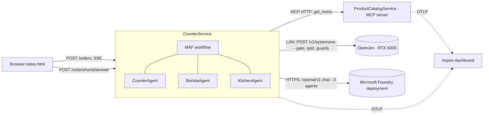
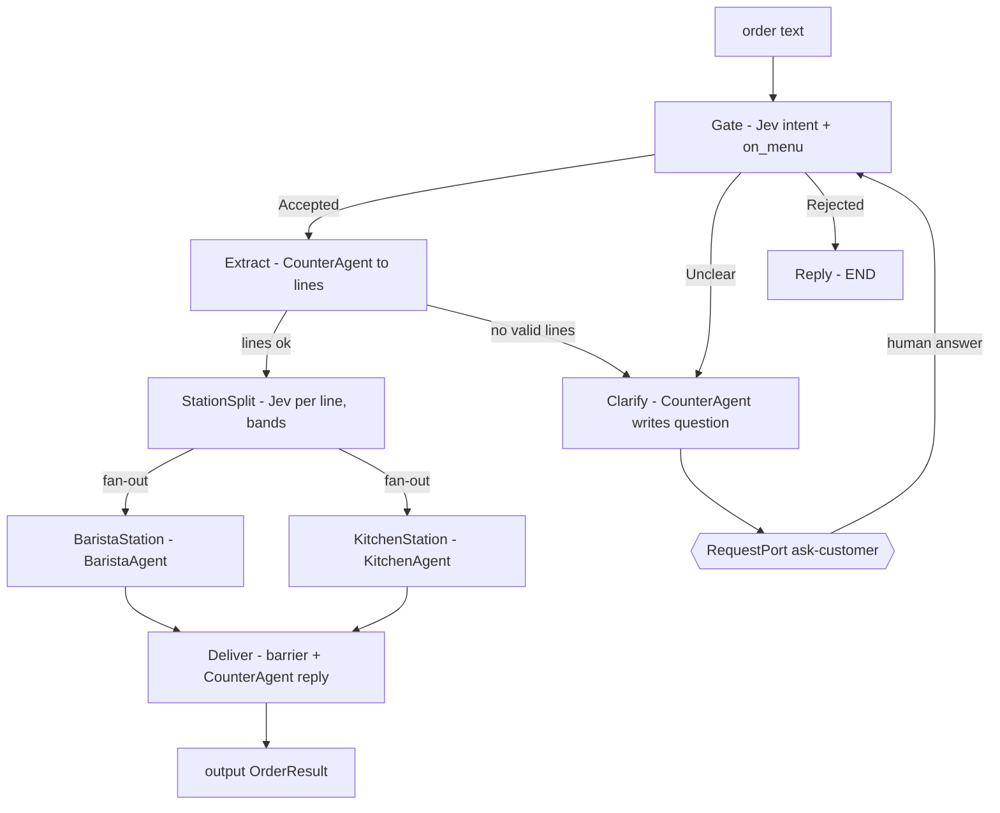
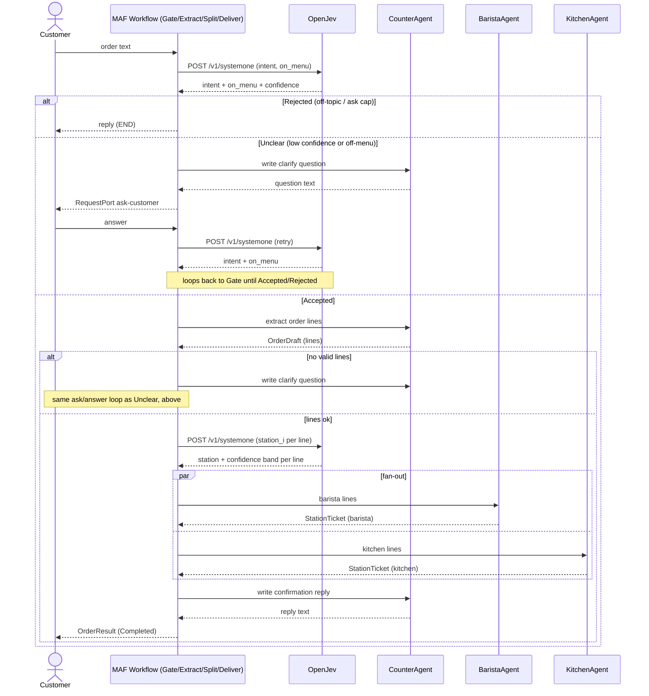
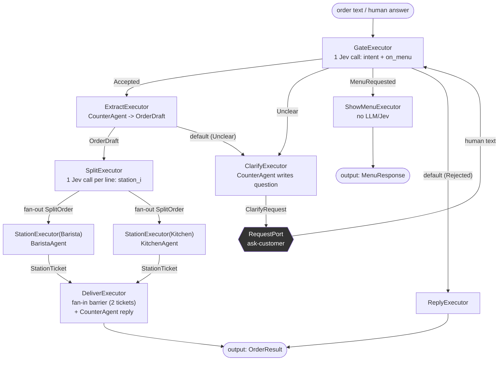

# coffeeshop-jev

Coffee-shop ordering demo: .NET 10 + Aspire + Microsoft Agent Framework, using [Jev](https://docs.typesafe.ai/introduction)/OpenJev for intent- and confidence-routing instead of an LLM. 3 in-process MAF agents (Counter, Barista, Kitchen).

Design + rationale: `research.md`. Task breakdown: `tasks.md`.

## Runtime



## Workflow (Microsoft Agent Framework)



Same workflow, as a sequence diagram:



## Prerequisites

- .NET SDK `10.0.302`+ (`global.json` pins it)
- A reachable OpenJev server (`/v1/systemone`)
- An OpenAI-compatible chat endpoint (Foundry, or any compatible gateway) for the 3 agents

## Configure secrets (once)

```bash
cd src/AppHost
dotnet user-secrets set "openjev-url" "http://<your-openjev-lan-host>:<port>"
dotnet user-secrets set "openai-base-url" "https://<your-endpoint>/v1"
dotnet user-secrets set "openai-model" "<model-name>"
dotnet user-secrets set "openai-api-key" "<key>"
```

`openjev-url` is the OpenJev server's base URL; the client appends `/v1/systemone`. Use the LAN URL above for your local OpenJev server, or set it to `https://api.typesafe.ai` to use hosted Jev. `AppHost` passes this exact URL to CounterService, including its scheme, so both HTTP and HTTPS work. Change the same setting to switch endpoints; AppHost reads it via `Parameters:*` (see `AppHost.cs`). Keep API keys in user-secrets, not in committed settings files.

## Run + debug (Aspire)

```bash
aspire run
```

Or press F5 in VS Code / Rider with `AppHost` as the startup project — breakpoints in `CounterService`/`ProductCatalogService` work normally, Aspire attaches to both.

`aspire run` prints the dashboard URL with a login token:

- **Dashboard**: `https://localhost:17214/login?t=<token>` — traces, logs, resource health. GenAI-enriched spans for both the OpenJev calls and the agent LLM calls (`chat jev-latest`, `chat <model>`).
- **Counter UI**: `http://localhost:5100`
- **Catalog API**: `http://localhost:5101`

If `openjev-url` is unreachable, `counter` still starts (fails closed at the call site, not at startup).

## Run evals (Jev as judge)

Live evals hit the real OpenJev + chat endpoint — same secrets as above (`EvalConfig.cs` reads the same AppHost user-secrets store, no extra setup). If secrets aren't configured, these tests **fail fast** with the exact `dotnet user-secrets set` command to run — they don't skip silently.

```bash
# offline only (fast, no network, runs in CI)
dotnet test tests/CoffeeShop.Tests

# gate + station accuracy against real Jev
dotnet test tests/CoffeeShop.Evals --filter "GateEvals|StationEvals"

# JevJudge accept/escalate cascade (Jev judges; low-confidence items escalate to the LLM)
dotnet test tests/CoffeeShop.Evals --filter "JudgeCascadeTests|JevJudgeEscalationTests"

# variance smoke check (30 repeated reads x 3 frozen tickets)
dotnet test tests/CoffeeShop.Evals --filter "JevJudgeVarianceTests"

# build the combined report from whatever ran above
dotnet test tests/CoffeeShop.Evals --filter "FullyQualifiedName~CoffeeShop.Evals.Report"
```

Report: `tests/CoffeeShop.Evals/bin/Debug/net10.0/evals/out/report.md` (gate/station accuracy, JevJudge accept/escalate/human-review counts per rubric item). Variance detail: `evals/out/judge-variance.md`.

Design + what's implemented vs. descoped: `research.md` §10 (esp. §10.6a, §10.9).

## Executor wiring (as built, `OrderWorkflow.Build`)

`src/CounterService/Features/Orders/Workflow/OrderWorkflow.cs` wires 8 `Executor` classes with `WorkflowBuilder`. This reflects the actual code (class names, message types), not the `research.md` §5.2 design sketch — two differences: the split step's real class is `SplitExecutor` (not `StationSplitExecutor`), and a `MenuRequested`/`ShowMenuExecutor` branch (ask-for-menu, no LLM/Jev call) exists in code but wasn't in the original design.



Notes tied to the code:
- `AddSwitch(gate, ...)` routes on message *type* (`Accepted` / `Unclear` / `MenuRequested`), falling through to `[reply]` for anything else (`Rejected`) — `OrderWorkflow.cs:41-45`.
- `extract` and `clarify` share one loop: `ExtractExecutor` falls back to `Unclear` when no valid lines parse, which lands back on `ClarifyExecutor` → `ask` → `gate` again (`OrderWorkflow.cs:46-50`).
- `barista` and `kitchen` are two instances of the same `StationExecutor` class, parameterized by `Station` + `AIAgent` + executor id (`AgentKeys.Barista` / `AgentKeys.Kitchen`) — not two separate classes.
- `AddFanInBarrierEdge` only releases `DeliverExecutor` once **both** stations have sent a `StationTicket`; `StationExecutor` always returns one (real, fallback, or `StationTicket.Empty`) even when it has no lines for that station — otherwise the barrier would hang forever (`StationExecutor.cs:24-26`).
- `DeliverExecutor` reaches across executors via `SplitExecutor.SplitLinesKey`, reading the priced lines `SplitExecutor` wrote into shared per-order state, since the `StationTicket` it receives on the barrier edge carries no price (`DeliverExecutor.cs:32`, `SplitExecutor.cs:16,39`).
- `WithOutputFrom(deliver, reply, showMenu)` — these 3 are the only executors that terminate a run; every other executor always sends onward.
