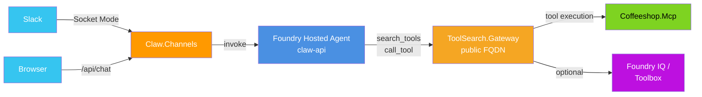
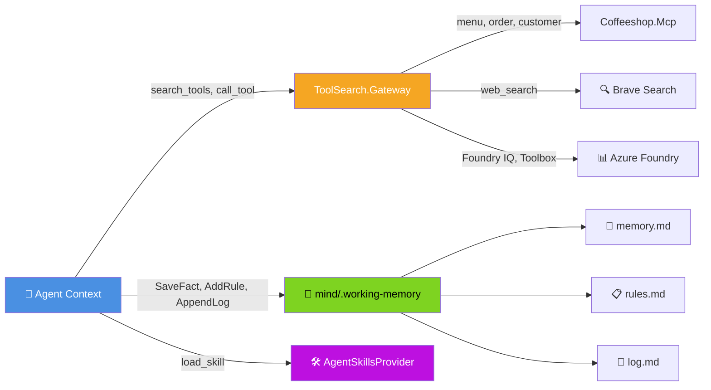

# foundry-agentfx

Coffeeshop AI agent. **4 services** wired via Aspire:

| Service | Role | Host |
|---------|------|------|
| **Coffeeshop.Mcp** | MCP tool server (menu, orders, customers) | ACA |
| **ToolSearch.Gateway** | Hides all tools behind `search_tools` + `call_tool` | ACA |
| **Claw.Api** | AI brain — MAF + Foundry provider, `/invocations` endpoint | Foundry Hosted Agent |
| **Claw.Channels** | Thin Slack adapter source project — deployed service name stays `claw-slack` | ACA |



---

## Prerequisites

- [.NET 10 SDK](https://dotnet.microsoft.com/download)
- `dotnet workload install aspire`
- [Azure CLI](https://docs.microsoft.com/cli/azure/install-azure-cli) + [azd](https://learn.microsoft.com/azure/developer/azure-developer-cli/install-azd)

### VS Code autocomplete (local)

This repo includes `.vscode/extensions.json` + `.vscode/settings.json` for C# IntelliSense.

1. Install recommended extensions when VS Code prompts (`ms-dotnettools.csdevkit`, `ms-dotnettools.csharp`).
2. Run `dotnet restore foundry-agentfx.slnx`.
3. Reload VS Code window.

---

## Local dev (Aspire)

```bash
# Wire secrets (one-time)
dotnet user-secrets set "Parameters:agent-provider"                "foundry"
dotnet user-secrets set "Parameters:foundry-endpoint"              "<AZURE_AI_PROJECT_ENDPOINT>"
dotnet user-secrets set "Parameters:foundry-model"                 "gpt-5.4-mini"
dotnet user-secrets set "Parameters:foundry-iq-endpoint"           "<AZURE_AI_SEARCH_ENDPOINT>"
dotnet user-secrets set "Parameters:foundry-iq-kb-name"            "coffeeshop-kb"
dotnet user-secrets set "Parameters:appinsights-connection-string" "<APPINSIGHTS_CONNECTION_STRING>"
dotnet user-secrets set "Parameters:slack-bot-token"               "xoxb-..."   # optional
dotnet user-secrets set "Parameters:slack-app-token"               "xapp-..."   # optional
dotnet user-secrets set "Parameters:slack-signing-secret"          "..."        # optional
dotnet user-secrets set "Parameters:brave-search-api-key"          "<key>"      # optional

# Run all 4 services
dotnet aspire run
```

`claw-api` runs on :5000 with `/invocations` endpoint (gated by `Agent__HostedMode=foundry`).  
`Claw.Channels` is the source project name for the Slack adapter; the deployed ACA service name is `claw-channels` and it runs on :5003, calling `claw-api` via Aspire service discovery.

Test invocations locally:
```bash
curl -X POST http://localhost:5000/invocations \
  -H "Content-Type: application/json" \
  -d '{"input":"list the menu"}'
```

### Hybrid local runtime + cloud infra-only

Use this mode when you want cloud Foundation resources (Foundry project, model deployment, AI Search, App Insights, ACR), but run app services locally with Aspire.

**What `SKIP_CONTAINER_APPS=true` does:**
- Provisions infra via Bicep
- Skips Container Apps resources for `claw-channels`, `toolsearch-gateway`, `coffeeshop-mcp`
- Skips hosted-agent registration hook during deploy

```bash
az login && azd auth login
azd env new <env-name>
azd env set AZURE_LOCATION eastus2
azd env set SKIP_CONTAINER_APPS true

# Provision cloud dependencies only
azd provision
```

Map provisioned outputs into local settings (via user-secrets or `appsettings.Development.json` Parameters):

```bash
ENDPOINT=$(azd env get-values | grep AZURE_AI_PROJECT_ENDPOINT | cut -d= -f2 | tr -d '"')
MODEL=$(azd env get-values | grep AZURE_AI_MODEL_DEPLOYMENT_NAME | cut -d= -f2 | tr -d '"')
SEARCH=$(azd env get-values | grep AZURE_AI_SEARCH_SERVICE_ENDPOINT | cut -d= -f2 | tr -d '"')
APPINSIGHTS=$(azd env get-values | grep APPLICATIONINSIGHTS_CONNECTION_STRING | cut -d= -f2 | tr -d '"')

dotnet user-secrets set "Parameters:agent-provider" "foundry"
dotnet user-secrets set "Parameters:foundry-endpoint" "$ENDPOINT"
dotnet user-secrets set "Parameters:foundry-model" "$MODEL"
dotnet user-secrets set "Parameters:foundry-iq-endpoint" "$SEARCH"
dotnet user-secrets set "Parameters:foundry-iq-kb-name" "coffeeshop-kb"
dotnet user-secrets set "Parameters:toolbox-endpoint" "${SEARCH}/knowledgebases/coffeeshop-kb/mcp?api-version=2025-11-01-preview"
dotnet user-secrets set "Parameters:appinsights-connection-string" "$APPINSIGHTS"
```

Then run local stack:

```bash
dotnet aspire run
```

Expected path in hybrid mode:
`claw-api (local) -> toolsearch-gateway (local) -> coffeeshop-mcp (local)`
with Foundry model/search resources from cloud config.

> Keep `azd deploy` for full cloud app deployment mode. In hybrid mode, use `azd provision` only.

---

## Cloud deployment

### Manual deploy (step-by-step)

```bash
az login && azd auth login
azd env new <env-name>
azd env set AZURE_LOCATION eastus2   # must support Foundry Hosted Agents

# Slack tokens
azd env set SLACK_BOT_TOKEN     "xoxb-..."
azd env set SLACK_APP_TOKEN     "xapp-..."
azd env set SLACK_SIGNING_SECRET "..."

# Optional
azd env set BRAVE_SEARCH_API_KEY "<key>"

# Step 1: provision infra (creates ACR, Foundry project, App Insights, etc.)
azd provision

# Step 2: deploy all services — ACA + Foundry Hosted Agent (claw-api) in one shot
azd deploy
```

**How it works:**
- `azd provision` -> creates ACR + Foundry project + ACA env
- `azd deploy` -> builds+pushes all 4 images via ACR remote build, then:
  - deploys `claw-channels`, `coffeeshop-mcp`, `toolsearch-gateway` as Container Apps
  - builds+pushes `claw-api` image, registers as Foundry Hosted Agent (version), waits for `active`
- `claw-api` runs on Foundry compute, not ACA. Env vars (`Agent__Provider`, `Services__ToolSearchGateway__Url`, etc.) injected via `agent.yaml`.

Verify after deploy:

```bash
azd ai agent show claw-api
```

### Invoke agent (cloud)

```bash
TOKEN=$(az account get-access-token --resource https://ai.azure.com --query accessToken -o tsv)
ENDPOINT=$(azd env get-values | grep AZURE_AI_PROJECT_ENDPOINT | cut -d= -f2 | tr -d '"')

curl -X POST "$ENDPOINT/agents/claw-api/endpoint/protocols/invocations?api-version=v1" \
  -H "Authorization: Bearer $TOKEN" \
  -H "Content-Type: application/json" \
  -d '{"input":"I want a large oat milk latte"}'
```

### Check agent status

```bash
azd ai agent show claw-api

# Or via REST
ENDPOINT=$(azd env get-values | grep AZURE_AI_PROJECT_ENDPOINT | cut -d= -f2 | tr -d '"')
az rest --method GET \
  --url "$ENDPOINT/agents/claw-api?api-version=v1" \
  --resource https://ai.azure.com
```

---

## GitHub Actions CI/CD

Workflow: `.github/workflows/azure-deploy.yml` — triggers on push to `main`.

**3 jobs:**
1. `build-and-test` — dotnet build + test all projects
2. `provision` — `azd provision` (creates infra)
3. `deploy` — `azd deploy` (builds+pushes all images; registers claw-api as Foundry Hosted Agent; polls until active) → smoke test

### Required repo variables (Settings → Actions → Variables)

| Variable | Value |
|----------|-------|
| `AZURE_CLIENT_ID` | Service principal client ID (OIDC) |
| `AZURE_TENANT_ID` | Azure AD tenant ID |
| `AZURE_SUBSCRIPTION_ID` | Subscription ID |
| `AZURE_ENV_NAME` | azd env name (e.g. `prod`) |
| `AZURE_LOCATION` | Region (e.g. `eastus2`) |

### Required secrets (Settings → Actions → Secrets)

| Secret | Purpose |
|--------|---------|
| `SLACK_BOT_TOKEN` | Slack bot token (`xoxb-...`) |
| `SLACK_APP_TOKEN` | Slack app-level token (`xapp-...`) |
| `SLACK_SIGNING_SECRET` | Slack signing secret |
| `BRAVE_SEARCH_API_KEY` | _(optional)_ enables `web_search` tool |

### OIDC setup (one-time)

```bash
SP=$(az ad sp create-for-rbac --name "foundry-agentfx-gh" --role Contributor \
  --scopes /subscriptions/<sub-id> --json-auth)
CLIENT_ID=$(echo $SP | jq -r .clientId)

az ad app federated-credential create --id $CLIENT_ID --parameters '{
  "name": "foundry-agentfx-main",
  "issuer": "https://token.actions.githubusercontent.com",
  "subject": "repo:<owner>/<repo>:ref:refs/heads/main",
  "audiences": ["api://AzureADTokenExchange"]
}'
```

---

## Agent Mind & Skills

`Claw.Api` loads its identity, behavioral rules, skills, and working memory at startup from `src/Claw.Api/mind/`:

```
mind/
├── SOUL.md                          # Identity + personality (loaded first)
├── .github/agents/
│   └── coffeeshop.agent.md          # Behavioral instructions: tool usage, skill routing,
│                                    # memory tools (MANDATORY section)
├── .working-memory/
│   ├── memory.md                    # Durable facts (appended by SaveFact)
│   ├── rules.md                     # Behavioral rules (appended by AddRule)
│   └── log.md                       # Session log (appended by AppendLog)
└── skills/
    ├── coffeeshop-counter-service/SKILL.md   # End-to-end order flow playbook
    ├── coffeeshop-customer-lookup/SKILL.md   # Customer identity resolution
    └── coffeeshop-menu-guide/SKILL.md        # Menu browse + recommendations
```

### How it loads

`MindLoader` concatenates: `SOUL.md` → `.github/agents/*.agent.md` → `.working-memory/` → system message.

Skills use MAF `AgentSkillsProvider` (file-based, no scripts). At startup, skill names + descriptions are advertised in the system prompt. Full playbook content is loaded on demand via the `load_skill` tool (progressive disclosure → token savings).

Foundry path wires skills into the chat client pipeline:
```csharp
clientFactory: chatClient => chatClient.AsBuilder()
    .UseAIContextProviders(skillsProvider)
    .Build()
```

### Memory tools

Agent has 3 always-on tools registered directly in `Claw.Api` (not routed through gateway — need local fs access):

| Tool | Writes to | Trigger |
|------|-----------|---------|
| `SaveFact(fact)` | `memory.md` | User shares preference/name/setting |
| `AddRule(rule)` | `rules.md` | User corrects agent behavior |
| `AppendLog(entry)` | `log.md` | Session start, task done, handover |

Working memory persists across restarts. Loaded into system prompt every session start.

### Tool routing summary




```
foundry-agentfx/
├── apphost.cs                        # Aspire AppHost (4 services)
├── azure.yaml                        # azd service definitions (claw-channels, coffeeshop-mcp, toolsearch-gateway)
├── infra/
│   ├── main.bicep                    # Subscription-scoped entry; wires all modules
│   ├── modules/
│   │   └── container-apps.bicep     # ACA env + 3 services + RBAC for claw-channels
│   ├── hooks/
│   │   ├── postprovision.sh         # Seeds coffeeshop-kb + Foundry Toolbox
│   │   └── register-agent.sh        # Registers claw-api as Foundry Hosted Agent
│   └── core/ai/ai-project.bicep     # Foundry project + App Insights (auto-injects connection string)
└── src/
    ├── Claw.Api/                     # Foundry Hosted Agent: MAF workflow + /invocations endpoint
    ├── Claw.Channels/                  # Slack adapter: FoundryAgentClient → Foundry invocations
    ├── Coffeeshop.Mcp/              # MCP tool server
    ├── ToolSearch.Gateway/          # Tool-search gateway
    ├── Claw.Core/                   # Shared runtime interfaces
    ├── Coffeeshop.Models/           # Domain types
    └── ServiceDefaults/             # Aspire + OTel defaults
```
