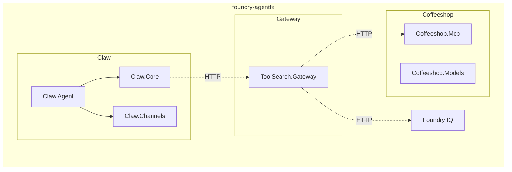
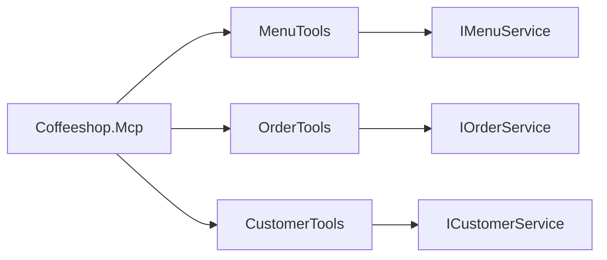
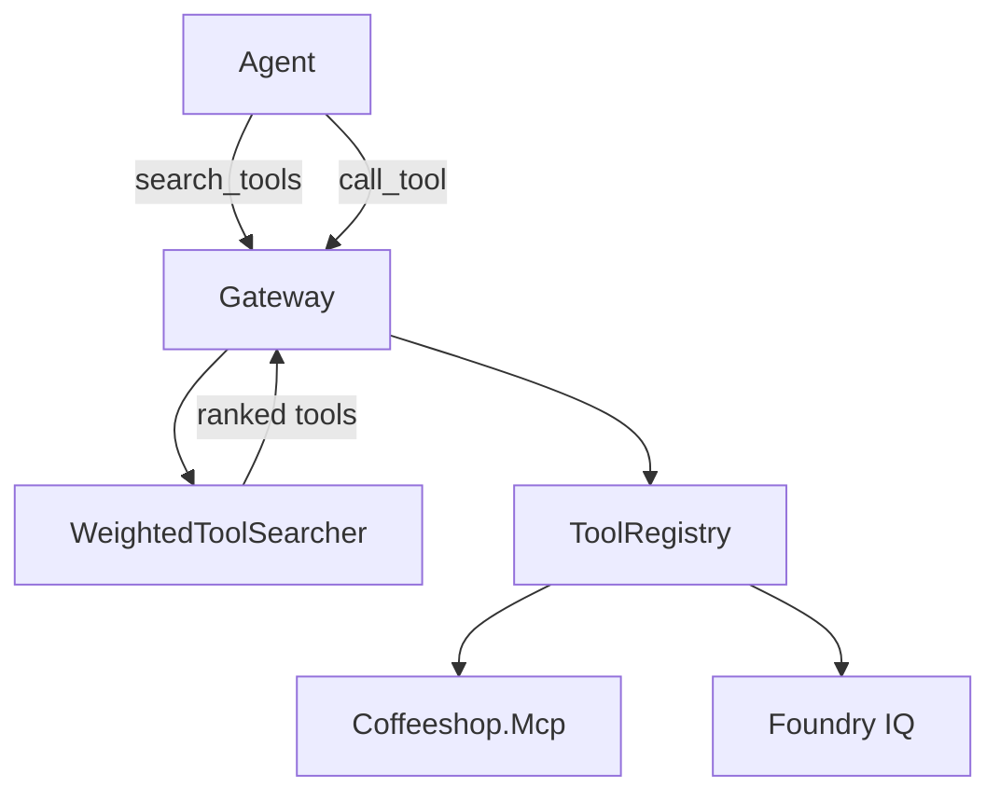
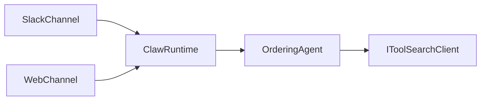
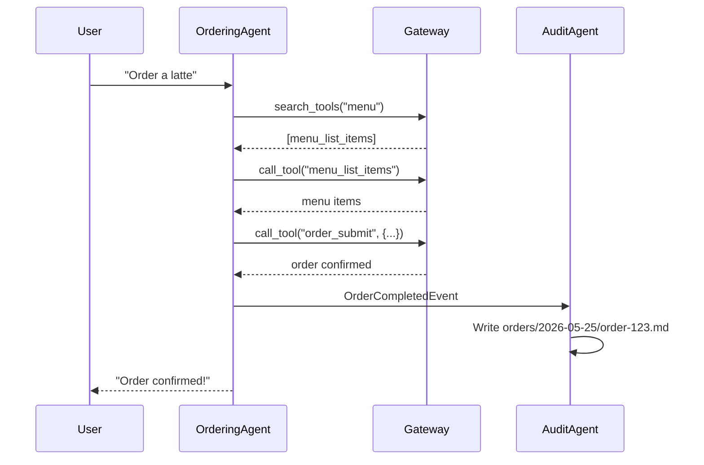

# Implementation Plan — foundry-agentfx

**Source refs:**
- DotNetClaw: `../DotNetClaw/DotNetClaw/` (ClawRuntime, channels, tools)
- coffeeshop-cli: `../coffeeshop-cli/src/CoffeeshopCli/` (MCP server, services)
- mcp-experiments: `../mcp-experiments/src/McpServer/` (ToolSearch, Registry, WeightedSearcher)
- https://github.com/microsoft/agent-framework
- https://github.com/microsoft/agent-framework/tree/main/dotnet/samples/03-workflows
- https://github.com/microsoft/agent-framework/tree/main/dotnet/samples/04-hosting
- https://github.com/Azure-Samples/foundry-hosted-agentframework-demos
- https://learn.microsoft.com/en-us/azure/search/agentic-retrieval-how-to-retrieve
- https://learn.microsoft.com/en-us/azure/foundry/agents/how-to/tools/toolbox
- https://github.com/github/copilot-sdk
- https://github.com/pamelafox/presentation-writeups/blob/main/presentations/foundry-agents-agentframework/outputs/writeup.md
- https://gofastmcp.com/servers/transforms/tool-search
- https://opentelemetry.io/docs/specs/semconv/gen-ai/
- https://opentelemetry.io/docs/specs/semconv/gen-ai/mcp/
- https://opentelemetry.io/docs/specs/semconv/gen-ai/gen-ai-metrics/

---

## Milestones

### Phase 1: Monorepo Setup
- [x] Create `foundry-agentfx.slnx` with folder structure
- [x] Create `ServiceDefaults/` project (Aspire + OTel)
- [x] Create `AppHost/` Aspire orchestration (startup order: coffeeshop → gateway → claw)
- [x] Verify: `dotnet build` passes

### Phase 2: Coffeeshop.Mcp
- [x] Create `Coffeeshop.Models/` (MenuItem, Customer, OrderItem, OrderResult)
- [x] Create `Coffeeshop.Mcp/` MCP server
- [x] Port `MenuTools`, `OrderTools`, `CustomerTools` from coffeeshop-cli
- [x] Remove CLI bridge — tools call services directly
- [x] Verify: `curl POST /mcp` returns tools

### Phase 3: Tool-Search Gateway
- [x] Create `ToolSearch.Gateway/` project
- [x] Port `WeightedToolSearcher` from mcp-experiments
- [x] Port `ToolRegistry` from mcp-experiments
- [x] Implement `search_tools` + `call_tool` meta-tools
- [x] Add OTel instrumentation (GenAI semconv)
- [x] Verify: Gateway proxies to Coffeeshop.Mcp

### Phase 4: Claw Agent
- [x] Create `Claw.Core/` (runtime, agents, IToolSearchClient)
- [x] Create `Claw.Channels/` (Slack, Web adapters)
- [x] Create `Claw.Agent/` ASP.NET host
- [x] Port `ClawRuntime` from DotNetClaw
- [x] Replace Copilot SDK → Foundry SDK (`AIProjectClient`)
- [x] Implement `ToolSearchClient` (calls gateway MCP)
- [x] Configure Slack auth (BotToken, SigningSecret)
- [x] Verify: `POST /api/chat` responds

### Phase 5: Multi-Agent Workflow
- [x] Implement `OrderingAgent` (ChatClientAgent)
- [x] Implement `AuditAgent` (custom Executor<OrderResult, string>)
- [x] Create MAF workflow (OrderingAgent → AuditAgent)
- [x] Write orders to `orders/*.md`
- [x] Verify: Order flow produces audit markdown

### Phase 6: Foundry Integration
- [x] Add `KnowledgeBaseRetrievalClient` (Foundry IQ)
- [x] Add Toolbox MCP client (`web_search`, `code_interpreter`)
- [x] Register both in gateway's ToolRegistry
- [x] Verify: Agent can query KB and use web_search

### Phase 7: Deployment
- [x] Create `infra/` Bicep templates
- [x] Create `azure.yaml` for azd
- [x] Create GitHub Actions workflow
- [x] Verify: `azd up` deploys to Container Apps

---

## Architecture



---

## Phase 2: Coffeeshop.Mcp Detail

**Source:** `../coffeeshop-cli/src/CoffeeshopCli/Mcp/`



**Code pattern (from coffeeshop-cli, simplified):**

```csharp
// Tools call services directly — no CLI bridge
[McpTool("menu_list_items")]
public async Task<MenuResponse> ListMenuItems(
    [FromServices] IMenuService menuService)
{
    return await menuService.GetAllItemsAsync();
}

[McpTool("order_submit")]
public async Task<OrderResponse> SubmitOrder(
    string customerId,
    List<OrderItem> items,
    [FromServices] IOrderService orderService)
{
    return await orderService.SubmitAsync(customerId, items);
}
```

---

## Phase 3: Tool-Search Gateway Detail

**Source:** `../mcp-experiments/src/McpServer/ToolSearch/`



**Code pattern (from mcp-experiments):**

```csharp
// MetaTools.cs — 2 synthetic tools
[McpTool("search_tools")]
public async Task<ToolDescriptor[]> SearchTools(
    string query,
    int maxResults = 5)
{
    using var activity = _activitySource.StartActivity(
        "tools/list search_tools",
        ActivityKind.Client);
    activity?.SetTag("mcp.method.name", "tools/list");
    activity?.SetTag("gen_ai.operation.name", "execute_tool");
    
    return await _searcher.SearchAsync(query, maxResults);
}

[McpTool("call_tool")]
public async Task<JsonElement> CallTool(
    string toolName,
    JsonElement arguments)
{
    using var activity = _activitySource.StartActivity(
        $"tools/call {toolName}",
        ActivityKind.Client);
    activity?.SetTag("mcp.method.name", "tools/call");
    activity?.SetTag("gen_ai.tool.name", toolName);
    
    return await _registry.InvokeAsync(toolName, arguments);
}
```

---

## Phase 4: Claw Agent Detail

**Source:** `../DotNetClaw/DotNetClaw/`



**Code pattern (from DotNetClaw, adapted):**

```csharp
// Program.cs — Foundry-first
builder.Services.AddSingleton<AIProjectClient>(sp =>
    new AIProjectClient(
        config["Foundry:Endpoint"],
        new DefaultAzureCredential()));

builder.Services.AddHttpClient<IToolSearchClient, ToolSearchClient>(
    client => client.BaseAddress = new Uri(config["Gateway:Url"]));

builder.Services.AddSingleton<IAgent>(sp =>
{
    var project = sp.GetRequiredService<AIProjectClient>();
    var gateway = sp.GetRequiredService<IToolSearchClient>();
    
    return project.GetAgentsClient().CreateAgent(
        model: "gpt-4o",
        name: "OrderingAgent",
        instructions: LoadInstructions(),
        tools: [gateway.AsTools()]  // Only search_tools + call_tool
    );
});
```

---

## Phase 5: Multi-Agent Workflow Detail



**MAF Workflow (from research.md):**

```csharp
var workflow = new WorkflowBuilder(orderingAgent)
    .AddEdge(orderingAgent, auditAgent)
    .WithOutputFrom(orderingAgent)
    .Build();

await workflow.RunAsync(new WorkflowInput { UserMessage = message });
```

---

## Karpathy Guidelines Check

| Guideline | Status | Notes |
|-----------|--------|-------|
| **Think Before Coding** | ✅ | Assumptions explicit: Foundry-first, gateway pattern, no CLI |
| **Simplicity First** | ✅ | 7 phases, each verifiable. No speculative features |
| **Surgical Changes** | ✅ | Port existing code, don't rewrite from scratch |
| **Goal-Driven** | ✅ | Each phase has verify step |

**Risks:**
- Foundry IQ API still preview → Phase 6 may need adjustment
- Tool-search latency unknown → Monitor in Phase 3
- OTel MCP semconv experimental → May evolve

**Verdict:** ✅ Plan valid. Proceed phase-by-phase.

---

## File Mapping

| Source | Target |
|--------|--------|
| `DotNetClaw/ClawRuntime.cs` | `Claw.Core/ClawRuntime.cs` |
| `DotNetClaw/SlackChannel.cs` | `Claw.Channels/SlackChannel.cs` |
| `DotNetClaw/WebChannel.cs` | `Claw.Channels/WebChannel.cs` |
| `coffeeshop-cli/Mcp/McpServerHost.cs` | `Coffeeshop.Mcp/Program.cs` |
| `coffeeshop-cli/Services/*` | `Coffeeshop.Mcp/Services/*` |
| `mcp-experiments/ToolSearch/MetaTools.cs` | `ToolSearch.Gateway/MetaTools.cs` |
| `mcp-experiments/Search/WeightedToolSearcher.cs` | `ToolSearch.Gateway/WeightedToolSearcher.cs` |
| `mcp-experiments/Registry/ToolRegistry.cs` | `ToolSearch.Gateway/ToolRegistry.cs` |

---

## NuGet Packages

| Project | Packages |
|---------|----------|
| ServiceDefaults | `Aspire.Hosting.AppHost`, `OpenTelemetry.Extensions.Hosting`, `Azure.Monitor.OpenTelemetry.AspNetCore` |
| Claw.Core | `Microsoft.Extensions.AI`, `Azure.AI.Projects`, `Azure.Identity` |
| Claw.Channels | `Slack.NetStandard` |
| Coffeeshop.Mcp | `ModelContextProtocol`, `ModelContextProtocol.AspNetCore` |
| ToolSearch.Gateway | `ModelContextProtocol`, `ModelContextProtocol.AspNetCore`, `System.Text.Json` |

---

## Next Action

Start Phase 1: Create monorepo structure.
