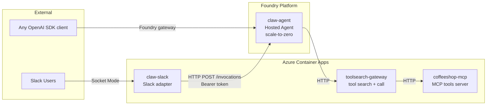
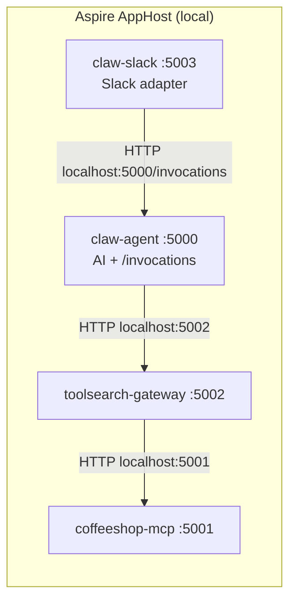
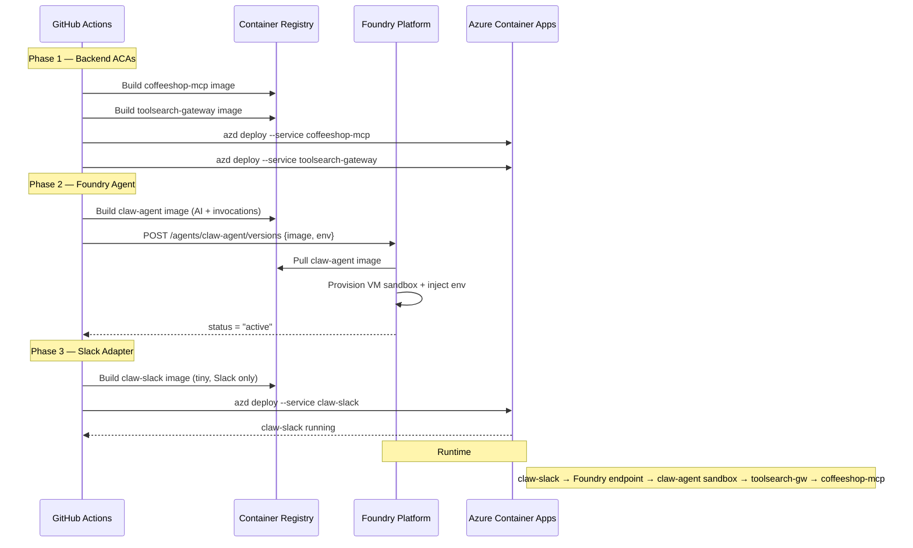

# Refactor: Foundry Hosted Agent + Slack Adapter (Option B)

## Task Checklist

### Phase 1: Create Claw.Slack project (code split)

| # | Task | Confidence | Notes |
|---|------|-----------|-------|
| 1.1 | [x] Create `src/Claw.Slack/Claw.Slack.csproj` (SlackNet, Azure.Identity, ServiceDefaults) | 95% | Standard .NET project scaffolding |
| 1.2 | [x] Create `src/Claw.Slack/FoundryAgentClient.cs` (HttpClient + DefaultAzureCredential) | 90% | Raw HTTP, well-documented pattern. Risk: token audience string |
| 1.3 | [x] Move `SlackChannel.cs` → `src/Claw.Slack/SlackMessageHandler.cs` (adapt to FoundryAgentClient) | 90% | Mechanical refactor. Risk: DI wiring order |
| 1.4 | [x] Create `src/Claw.Slack/Program.cs` (minimal host: Slack + HTTP client) | 95% | Thin host, no AI deps |
| 1.5 | [x] Create `src/Claw.Slack/Dockerfile` | 95% | Copy from Claw.Agent, simpler (fewer layers) |
| 1.6 | [x] Create `src/Claw.Slack/appsettings.json` + `appsettings.Production.json` | 95% | Config for Agent:InvocationsUrl, Agent:TokenResource |
| 1.7 | [x] Add Claw.Slack to `foundry-agentfx.slnx` | 98% | One line |

### Phase 2: Strip Slack from Claw.Agent

| # | Task | Confidence | Notes |
|---|------|-----------|-------|
| 2.1 | [x] Remove SlackNet packages from `Claw.Agent.csproj` | 98% | Delete 2 PackageReference lines |
| 2.2 | [x] Delete `src/Claw.Agent/SlackChannel.cs` | 98% | Moved to Claw.Slack |
| 2.3 | [x] Remove `AddSlackChannel()` + `MapSlack()` from `Program.cs` | 95% | 2 lines. Risk: ensure no compile error from dangling using |
| 2.4 | [x] Verify: `dotnet build` Claw.Agent passes without Slack | 98% | Mechanical |

### Phase 3: Aspire AppHost (local dev wiring)

| # | Task | Confidence | Notes |
|---|------|-----------|-------|
| 3.1 | [x] Update `apphost.cs`: add claw-slack project reference | 90% | Need `#:project` directive + `Projects.Claw_Slack` |
| 3.2 | [x] Wire claw-slack env: `Agent__InvocationsUrl` → claw-agent endpoint | 85% | Risk: Aspire endpoint URL concatenation syntax for `/invocations` path |
| 3.3 | [x] Remove Slack env vars from claw-agent in apphost | 95% | Delete 3 `.WithEnvironment` lines |
| 3.4 | [x] Add `Agent__HostedMode=foundry` to claw-agent locally | 95% | Enables `/invocations` endpoint |
| 3.5 | [ ] Verify: `dotnet run` starts 4 services, dashboard green | 80% | Risk: service discovery URL format, port conflicts |

### Phase 4: Infra (Bicep + deploy scripts)

| # | Task | Confidence | Notes |
|---|------|-----------|-------|
| 4.1 | [x] Replace `clawApi` → `clawSlack` in `container-apps.bicep` | 85% | Smaller container (0.25 cpu, 0.5Gi). Risk: ACA name change = recreate, not update |
| 4.2 | [x] Add `foundryAgentInvocationsUrl` param to bicep | 90% | String param, passed from main.bicep |
| 4.3 | [x] Add RBAC assignment: claw-slack identity → `Foundry User` on project | 75% | Used "Azure AI Developer" role GUID (64702f94-c441-49e6-a78b-ef80e0188fee); gated on foundryProjectResourceId |
| 4.4 | [x] Update `register-agent.sh`: remove Slack vars, add `Agent__Provider` | 95% | Straightforward edit |
| 4.5 | [x] Update `azure.yaml`: `claw-agent` → `claw-slack` service | 90% | Risk: azd may need `host: containerapp` + docker config aligned |
| 4.6 | [x] Add claw-agent to `azure.yaml` as `host: none` + custom deploy hook (or remove entirely) | 80% | Chose: claw-agent removed from azd; built via `az acr build` in CI/CD; documented in azure.yaml comment |

### Phase 5: CI/CD workflow

| # | Task | Confidence | Notes |
|---|------|-----------|-------|
| 5.1 | [x] CD: add `deploy-claw-agent-hosted` job (az acr build + register-agent.sh) | 90% | Implemented in azure-deploy.yml |
| 5.2 | [x] CD: add `deploy-claw-slack` job (azd deploy --service claw-slack) | 90% | Combined with infra job in azure-deploy.yml |
| 5.3 | [x] CD: add wait-for-active step (poll agent status) | 85% | 20×30s poll loop; exits 0 on timeout to avoid blocking |
| 5.4 | [x] CD: add smoke test (invoke Foundry endpoint) | 80% | curl with 60s timeout; soft-fails on cold start |

### Phase 6: Verification (end-to-end)

| # | Task | Confidence | Notes |
|---|------|-----------|-------|
| 6.1 | [ ] Local: `curl localhost:5000/invocations -d '{"input":"menu"}'` → coffee response | 85% | Depends on Foundry/Copilot provider working locally; requires live run |
| 6.2 | [ ] Local: Slack DM → claw-slack → claw-agent → reply | 80% | Depends on Slack tokens configured in user-secrets |
| 6.3 | [ ] Cloud: Foundry agent status = `active` | 85% | Depends on region support + image pull success |
| 6.4 | [ ] Cloud: `az rest POST .../invocations` → text response | 80% | Depends on toolsearch-gateway reachable from sandbox |
| 6.5 | [ ] Cloud: Slack DM → claw-slack ACA → Foundry → reply | 75% | Full chain. Risk: RBAC propagation delay (up to 10 min) |
| 6.6 | [ ] Cloud: App Insights shows distributed trace across all services | 85% | Should work if connection string correct |

### Overall Confidence Summary

| Phase | Avg Confidence | Blocking Risk |
|-------|---------------|---------------|
| Phase 1 (Claw.Slack) | **93%** | Low — standard .NET project |
| Phase 2 (Strip Slack) | **97%** | Very low — mechanical deletion |
| Phase 3 (Aspire local) | **89%** | Medium — Aspire endpoint URL syntax |
| Phase 4 (Infra) | **86%** | Medium — RBAC role GUID, ACA rename behavior |
| Phase 5 (CI/CD) | **86%** | Medium — cold start timeout, azd hook behavior |
| Phase 6 (Verification) | **82%** | Medium-High — full chain depends on all pieces |

**Overall project confidence: ~88%**

**Highest-risk items:**
- 4.3: RBAC `Foundry User` role GUID (75%) — may need `az role definition list` to find
- 6.5: Full Slack→Foundry chain (75%) — RBAC propagation + cold start + network
- 3.5: Local 4-service Aspire run (80%) — endpoint URL concatenation quirks
- 5.4: Smoke test on cold start (80%) — first invocation may take 30s+

---

## 1. Research Findings

### How Foundry Hosted Agent Works

Foundry **pulls image from ACR → provisions own VM sandbox → exposes gateway endpoint**.
NOT proxy. NOT routing to your ACA. Completely independent compute.

**Invocations Protocol (what container exposes):**

| Item | Value |
|------|-------|
| Container port | 8080 (configurable via `ASPNETCORE_HTTP_PORTS`) |
| Local endpoint | `POST /invocations` |
| External endpoint | `{foundry_endpoint}/agents/{name}/endpoint/protocols/invocations?api-version=v1` |
| Request body | `{"input": "..."}` or `{"message": "..."}` |
| Response | `text/plain` body (current impl) or `{"response": "..."}` JSON |
| Auth (external) | Bearer token scoped to `https://ai.azure.com` |
| Required header | `Foundry-Features: HostedAgents=V1Preview` (preview period) |
| RBAC role | `Foundry User` on the Foundry project |
| Session continuity | `?agent_session_id=<uuid>` query param |

**Platform auto-injects into hosted container:**
- `FOUNDRY_PROJECT_ENDPOINT`
- `APPLICATIONINSIGHTS_CONNECTION_STRING` (from project-connected App Insights — same instance as ACAs)
- Dedicated Entra agent identity (DefaultAzureCredential works)

**Platform does NOT inject:**
- `Agent__Provider` (must declare)
- `AZURE_AI_MODEL_DEPLOYMENT_NAME` (must declare)
- `Services__ToolSearchGateway__Url` (must declare)

### Observability: Single App Insights Instance

All services share ONE App Insights resource (provisioned in `infra/core/ai/ai-project.bicep`):

```
infra/core/ai/ai-project.bicep
  └── creates App Insights
  └── creates appInsightConnection (links App Insights → Foundry project)

infra/main.bicep
  └── passes APPLICATIONINSIGHTS_CONNECTION_STRING to container-apps.bicep
```

| Service | How it gets App Insights | Same instance? |
|---------|--------------------------|----------------|
| coffeeshop-mcp (ACA) | Bicep env var `APPLICATIONINSIGHTS_CONNECTION_STRING` | ✅ |
| toolsearch-gateway (ACA) | Bicep env var `APPLICATIONINSIGHTS_CONNECTION_STRING` | ✅ |
| claw-slack (ACA) | Bicep env var `APPLICATIONINSIGHTS_CONNECTION_STRING` | ✅ |
| claw-agent (Foundry Hosted) | Platform injects from project-connected App Insights | ✅ |

**Result:** All traces, metrics, logs → single App Insights → unified view in portal.
No extra config needed. Foundry reads it from the `appInsightConnection` resource.

### Current State (Redundant)

```
Same image → ACA (always-on, full AI + Slack) = $$$
Same image → Foundry Hosted (scale-to-zero, invocations only) = $$
Both running = double cost, double config
```

### Decision: Option B — Split

Slack = long-lived WebSocket (Socket Mode). Foundry = request/response.
**Different traffic patterns → different services.**

---

## 2. Target Architecture



### Service Responsibilities

| Service | Runtime | Role |
|---------|---------|------|
| **claw-agent** | Foundry Hosted Agent | AI brain: receives input → runs agent → calls tools → returns answer |
| **claw-slack** | ACA (always-on, tiny) | Channel adapter: Slack WebSocket → extract text → call Foundry → post reply |
| **toolsearch-gateway** | ACA | Tool routing: search_tools + call_tool → fans out to MCP servers |
| **coffeeshop-mcp** | ACA | Domain tools: menu, orders, customers |

### Local Development (Aspire)



Locally, claw-slack calls claw-agent directly (no Foundry gateway needed).
In cloud, claw-slack calls Foundry endpoint (with auth).

---

## 3. What Changes

### 3.1 New Project: `Claw.Slack` (thin adapter)

Minimal ASP.NET app. No AI logic. Just:
1. Receive Slack events (Socket Mode)
2. Extract message text
3. HTTP POST to Foundry agent endpoint (cloud) or claw-agent (local)
4. Post reply back to Slack

```csharp
// src/Claw.Slack/Program.cs — PSEUDOCODE
var builder = WebApplication.CreateBuilder(args);
builder.AddServiceDefaults();

// Config: where to send messages
var agentUrl = builder.Configuration["Agent:InvocationsUrl"]
    ?? "http://localhost:5000/invocations"; // local default

var agentResource = builder.Configuration["Agent:TokenResource"]
    ?? ""; // empty = no auth (local); "https://ai.azure.com" = cloud

builder.Services.AddSingleton(new FoundryAgentClient(agentUrl, agentResource));
builder.Services.AddSlackChannel(builder.Configuration); // reuse existing extension

var app = builder.Build();
app.MapDefaultEndpoints();
app.MapSlack(builder.Configuration);
app.Run();
```

```csharp
// src/Claw.Slack/FoundryAgentClient.cs — PSEUDOCODE
public sealed class FoundryAgentClient(string url, string tokenResource)
{
    private readonly HttpClient _http = new();
    private readonly DefaultAzureCredential _cred = new();

    public async Task<string> InvokeAsync(string sessionId, string input, CancellationToken ct)
    {
        // Get bearer token (only in cloud when tokenResource is set)
        if (!string.IsNullOrEmpty(tokenResource))
        {
            var token = await _cred.GetTokenAsync(
                new Azure.Core.TokenRequestContext([tokenResource + "/.default"]), ct);
            _http.DefaultRequestHeaders.Authorization =
                new System.Net.Http.Headers.AuthenticationHeaderValue("Bearer", token.Token);
        }

        var requestUrl = $"{url}?agent_session_id={sessionId}";
        var body = new StringContent(
            System.Text.Json.JsonSerializer.Serialize(new { input }),
            System.Text.Encoding.UTF8, "application/json");

        var response = await _http.PostAsync(requestUrl, body, ct);
        response.EnsureSuccessStatusCode();
        return await response.Content.ReadAsStringAsync(ct);
    }
}
```

```csharp
// SlackMessageHandler change: inject FoundryAgentClient instead of ClawRuntime
public sealed class SlackMessageHandler(
    FoundryAgentClient agent,  // ← NEW (was: ClawRuntime runtime)
    ISlackApiClient slack,
    IConfiguration config,
    ILogger<SlackMessageHandler> logger) : IEventHandler<MessageEvent>, IEventHandler<AppMention>
{
    // ... same logic, but replace:
    //   var reply = await runtime.HandleAsync(sessionId, e.Text, default);
    // with:
    //   var reply = await agent.InvokeAsync(sessionId, e.Text, default);
}
```

**Dependencies:** SlackNet, Azure.Identity, ServiceDefaults. No AI packages.

### 3.2 claw-agent stays (strip Slack)

Remove Slack from claw-agent. It becomes pure AI + invocations:
- Keep: `AIAgent`, `CoffeeshopWorkflow`, `ToolSearchClient`, `MapInvocationsServer`
- Remove: `SlackNet` packages, `SlackChannel.cs`, `AddSlackChannel()`, `MapSlack()`
- Remove: `Slack__*` env vars from Dockerfile/Bicep/register-agent.sh

### 3.3 Aspire AppHost (local dev)

```csharp
// apphost.cs — ADD claw-slack project
var clawApi = builder.AddProject<Projects.Claw_Api>("claw-agent")
    .WithHttpEndpoint(port: 5000, name: "http")
    .WithEnvironment("Services__ToolSearchGateway__Url", gateway.GetEndpoint("http"))
    .WithEnvironment("Agent__Provider", agentProvider)
    .WithEnvironment("Agent__HostedMode", "foundry") // enable /invocations locally
    .WithEnvironment("Foundry__Endpoint", foundryEndpoint)
    .WithEnvironment("Foundry__Model", foundryModel)
    .WithEnvironment("OTEL_INSTRUMENTATION_GENAI_CAPTURE_MESSAGE_CONTENT", "true")
    .WithEnvironment("APPLICATIONINSIGHTS_CONNECTION_STRING", appInsightsConn)
    .WaitFor(gateway);

builder.AddProject<Projects.Claw_Slack>("claw-slack")
    .WithHttpEndpoint(port: 5003, name: "http")
    // Point to local claw-agent /invocations endpoint
    .WithEnvironment("Agent__InvocationsUrl", clawApi.GetEndpoint("http").Property(EndpointProperty.Url) + "/invocations")
    .WithEnvironment("Agent__TokenResource", "") // empty = no auth locally
    .WithEnvironment("Slack__BotToken", slackBotToken)
    .WithEnvironment("Slack__AppToken", slackAppToken)
    .WithEnvironment("Slack__SigningSecret", slackSigningSecret)
    .WithEnvironment("APPLICATIONINSIGHTS_CONNECTION_STRING", appInsightsConn)
    .WaitFor(clawApi);
```

### 3.4 Bicep Changes

```bicep
// container-apps.bicep changes:

// 1. RENAME clawApi resource → clawSlack (or add new, delete old)
resource clawSlack 'Microsoft.App/containerApps@2024-03-01' = {
  name: 'claw-slack'
  // ... same identity, env setup but ONLY:
  env: [
    { name: 'ASPNETCORE_ENVIRONMENT', value: 'Production' }
    { name: 'ASPNETCORE_HTTP_PORTS', value: '8080' }
    { name: 'Agent__InvocationsUrl', value: foundryAgentInvocationsUrl }
    { name: 'Agent__TokenResource', value: 'https://ai.azure.com' }
    { name: 'Slack__BotToken', value: slackBotToken }
    { name: 'Slack__AppToken', value: slackAppToken }
    { name: 'Slack__SigningSecret', value: slackSigningSecret }
    { name: 'APPLICATIONINSIGHTS_CONNECTION_STRING', value: appInsightsConnectionString }
  ]
  // resources: tiny — cpu: 0.25, memory: 0.5Gi (no AI, just HTTP relay)
}

// 2. ADD param for Foundry agent URL (output from register-agent.sh or azd env)
param foundryAgentInvocationsUrl string

// 3. ADD RBAC: claw-slack managed identity needs "Foundry User" on project
```

### 3.5 register-agent.sh (strip Slack, keep clean)

```sh
AGENT_DEFINITION='{
  "definition": {
    "kind": "hosted",
    "image": "'${FULL_IMAGE}'",
    "cpu": "1",
    "memory": "2Gi",
    "container_protocol_versions": [
      {"protocol": "invocations", "version": "1.0.0"}
    ],
    "environment_variables": {
      "ASPNETCORE_HTTP_PORTS": "8080",
      "ASPNETCORE_ENVIRONMENT": "Production",
      "Agent__Provider": "foundry",
      "Agent__HostedMode": "foundry",
      "Foundry__Model": "'${MODEL_DEPLOYMENT}'",
      "AZURE_AI_MODEL_DEPLOYMENT_NAME": "'${MODEL_DEPLOYMENT}'",
      "OTEL_INSTRUMENTATION_GENAI_CAPTURE_MESSAGE_CONTENT": "true",
      "Services__ToolSearchGateway__Url": "'${GATEWAY_URL}'"
    }
  }
}'
```

No Slack vars. No `APPLICATIONINSIGHTS_CONNECTION_STRING` (platform injects from project-connected App Insights — same instance ACAs use).
No `Foundry__Endpoint` (platform injects as `FOUNDRY_PROJECT_ENDPOINT`).

### 3.6 CD Workflow

```yaml
deploy-claw-agent-hosted:
  steps:
    - name: Build + push claw-agent image
      run: |
        az acr build --registry ${{ vars.ACR_NAME }} \
          --image claw-agent:${{ github.sha }} \
          --file src/Claw.Agent/Dockerfile .

    - name: Register Foundry Hosted Agent
      run: ./infra/hooks/register-agent.sh

    - name: Wait for active
      run: |
        for i in $(seq 1 30); do
          STATUS=$(az rest --method GET \
            --url "$FOUNDRY_ENDPOINT/agents/claw-agent?api-version=2025-11-15-preview" \
            --resource "https://ai.azure.com" --query status -o tsv 2>/dev/null || echo "pending")
          [ "$STATUS" = "active" ] && exit 0
          sleep 10
        done
        exit 1

deploy-claw-slack:
  needs: [deploy-claw-agent-hosted]
  steps:
    - name: Deploy claw-slack ACA
      run: azd deploy --service claw-slack
```

---

## 4. Deployment Flow (End-to-End)



---

## 5. Local → Cloud Mapping

| Concern | Local (Aspire) | Cloud |
|---------|----------------|-------|
| AI agent | claw-agent @ localhost:5000 | Foundry Hosted Agent (scale-to-zero) |
| Slack adapter | claw-slack @ localhost:5003 | claw-slack ACA (always-on, tiny) |
| Tool gateway | toolsearch-gateway @ localhost:5002 | toolsearch-gateway ACA |
| MCP server | coffeeshop-mcp @ localhost:5001 | coffeeshop-mcp ACA |
| Slack → Agent call | `http://localhost:5000/invocations` (no auth) | `{foundry_endpoint}/agents/claw-agent/endpoint/protocols/invocations` (Bearer token) |
| Agent → Tools | `http://localhost:5002` (service discovery) | `https://toolsearch-gateway.*.azurecontainerapps.io` (external FQDN) |
| Observability | Aspire dashboard (OTel collector) | App Insights (single shared instance) |

### Observability: Local vs Cloud

**Local (Aspire):**
- `APPLICATIONINSIGHTS_CONNECTION_STRING` param can be empty or real
- If empty: traces go to Aspire dashboard only (OTel → Aspire collector)
- If set: traces go to BOTH Aspire dashboard + App Insights (live cloud view)
- All 4 services configured identically via `appInsightsConn` parameter

**Cloud:**
- ACAs (coffeeshop-mcp, toolsearch-gw, claw-slack): get connection string from Bicep
- Foundry Hosted Agent (claw-agent): platform injects from project-connected App Insights
- All traces correlate in same App Insights workspace
- Distributed trace: `claw-slack → Foundry gateway → claw-agent → toolsearch-gw → coffeeshop-mcp`

**No extra infra needed.** Existing `infra/core/ai/ai-project.bicep` already provisions
App Insights + connects it to Foundry project. Works for both ACA and Hosted Agent.

---

## 6. Critical Design Decisions

### D1: Port = 8080 (not 8088)

Foundry samples use 8088 by convention. Our Dockerfile exposes 8080.
Foundry doesn't care — routes to whatever `ASPNETCORE_HTTP_PORTS` declares.
**Keep 8080** — no change needed.

### D2: Foundry sandbox → toolsearch-gateway network

Foundry sandbox = separate VNet. Must reach toolsearch-gateway via **public internet**.
toolsearch-gateway already has `external: true` ingress. ✅

**Risk:** No auth on toolsearch-gateway. Anyone with URL can call it.
**Acceptable for now.** Future: add API key or managed identity auth.

### D3: claw-slack auth to Foundry

claw-slack ACA needs `Foundry User` RBAC on Foundry project.
Uses its **system-assigned managed identity** + `DefaultAzureCredential`.

```bash
# One-time setup (in Bicep or post-provision hook):
az role assignment create \
  --assignee-object-id $(az containerapp show -n claw-slack -g $RG --query identity.principalId -o tsv) \
  --role "Foundry User" \
  --scope "/subscriptions/$SUB/resourceGroups/$RG/providers/Microsoft.CognitiveServices/accounts/$ACCOUNT/projects/$PROJECT"
```

### D4: Session management

Slack user → stable `agent_session_id` = `slack:{channel}:{user}`
This enables multi-turn conversations through Foundry's session continuity.

### D5: `AddSlackChannel` throws when tokens missing

Current code: `?? throw new InvalidOperationException("Slack:BotToken is not configured.")`
**Problem:** claw-agent (Foundry hosted) has no Slack tokens → startup crash.

**Fix:** Make Slack registration conditional (already done in current code — tokens are only
passed to claw-slack, not claw-agent in the new architecture).

---

## 7. Files Created / Modified / Deleted

### Created
| File | Purpose |
|------|---------|
| `src/Claw.Slack/Claw.Slack.csproj` | Minimal project: SlackNet, Azure.Identity, ServiceDefaults |
| `src/Claw.Slack/Program.cs` | Slack Socket Mode → Foundry HTTP client |
| `src/Claw.Slack/FoundryAgentClient.cs` | HTTP client for Foundry invocations endpoint |
| `src/Claw.Slack/SlackMessageHandler.cs` | Copied from claw-agent, adapted to use FoundryAgentClient |
| `src/Claw.Slack/Dockerfile` | Minimal .NET 10 container |
| `src/Claw.Slack/appsettings.json` | Agent URL config |

### Modified
| File | Change |
|------|--------|
| `apphost.cs` | Add claw-slack project, remove Slack from claw-agent |
| `src/Claw.Agent/Program.cs` | Remove `AddSlackChannel()`, `MapSlack()` |
| `src/Claw.Agent/Claw.Agent.csproj` | Remove SlackNet packages |
| `infra/modules/container-apps.bicep` | Replace `clawApi` → `clawSlack` (tiny, Slack only) |
| `infra/hooks/register-agent.sh` | Remove Slack env vars, add Agent__Provider |
| `azure.yaml` | Replace `claw-agent` host=containerapp → `claw-slack` host=containerapp |
| `foundry-agentfx.slnx` | Add Claw.Slack project reference |

### Deleted
| File | Reason |
|------|--------|
| `src/Claw.Agent/SlackChannel.cs` | Moved to Claw.Slack |

---

## 8. Verification Criteria

| # | Check | Pass condition |
|---|-------|----------------|
| 1 | `dotnet build foundry-agentfx.slnx` | All 5 projects compile (+ Claw.Slack) |
| 2 | Aspire `dotnet run` starts all 4 services | Dashboard shows green |
| 3 | Local: POST `localhost:5000/invocations` with `{"input":"menu"}` | Returns coffee items |
| 4 | Local: Slack DM → claw-slack → claw-agent → reply | Reply posted in Slack |
| 5 | Cloud: `register-agent.sh` → agent status = active | Within 5 min |
| 6 | Cloud: Foundry invocation → response | `az rest POST .../invocations` returns text |
| 7 | Cloud: Slack DM → claw-slack ACA → Foundry → reply | End-to-end Slack works |
| 8 | Cloud: toolsearch-gateway reachable from Foundry sandbox | Logs show successful tool calls |
| 9 | Cloud: App Insights traces flow | Traces visible in portal |

---

## 9. Migration Steps (Ordered)

```
 1. Create src/Claw.Slack/ project                   → builds clean
 2. Move SlackChannel.cs → Claw.Slack                → claw-agent builds without Slack
 3. Create FoundryAgentClient.cs                     → HTTP client for invocations
 4. Adapt SlackMessageHandler to use FoundryAgentClient
 5. Update apphost.cs (add claw-slack, remove Slack from claw-agent)
 6. Verify local: Aspire starts all 4 services       → dashboard green
 7. Verify local: Slack DM → reply works             → end-to-end
 8. Strip Slack from claw-agent csproj + Program.cs    → verify: no SlackNet refs
 9. Update container-apps.bicep (clawApi → clawSlack)
10. Update register-agent.sh (no Slack, add Agent__Provider)
11. Update azure.yaml (claw-slack replaces claw-agent)
12. Deploy: azd deploy coffeeshop-mcp + toolsearch-gw
13. Deploy: az acr build claw-agent + register-agent.sh
14. Deploy: azd deploy claw-slack
15. Verify cloud: Foundry invocation returns text
16. Verify cloud: Slack DM end-to-end works
```
