# Research: DotNetClaw + Coffeeshop.Mcp Rewrite

## References

| Source | URL |
|--------|-----|
| DotNetClaw | `/Users/chungt02/source_codes/oss/agent-engineering-experiment/DotNetClaw` |
| coffeeshop-cli | `/Users/chungt02/source_codes/oss/agent-engineering-experiment/coffeeshop-cli` |
| mcp-experiments | `/Users/chungt02/source_codes/oss/agent-engineering-experiment/mcp-experiments` |
| MAF .NET SDK | https://github.com/microsoft/agent-framework |
| MAF Workflows | https://github.com/microsoft/agent-framework/tree/main/dotnet/samples/03-workflows |
| MAF Hosting | https://github.com/microsoft/agent-framework/tree/main/dotnet/samples/04-hosting |
| Foundry Hosted Demos | https://github.com/Azure-Samples/foundry-hosted-agentframework-demos |
| Foundry IQ Docs | https://learn.microsoft.com/en-us/azure/search/agentic-retrieval-how-to-retrieve |
| Foundry Toolbox | https://learn.microsoft.com/en-us/azure/foundry/agents/how-to/tools/toolbox |
| Copilot SDK | https://github.com/github/copilot-sdk |
| Presentation Writeup | https://github.com/pamelafox/presentation-writeups/blob/main/presentations/foundry-agents-agentframework/outputs/writeup.md |
| FastMCP Tool-Search | https://gofastmcp.com/servers/transforms/tool-search |
| OTel GenAI Semconv | https://opentelemetry.io/docs/specs/semconv/gen-ai/ |
| OTel MCP Semconv | https://opentelemetry.io/docs/specs/semconv/gen-ai/mcp/ |
| OTel GenAI Metrics | https://opentelemetry.io/docs/specs/semconv/gen-ai/gen-ai-metrics/ |

---

## Executive Summary

Rewrite 2 repos → 1 monorepo. Stack: C#/.NET 10 + MAF + Foundry.

Key findings:
- MAF workflows support multi-agent orchestration (writer-critic, handoff)
- Foundry IQ: `KnowledgeBaseRetrievalClient` for RAG search
- Foundry Toolbox: MCP-compatible endpoint for web_search + code_interpreter
- coffeeshop MCP server exposes tools for agent consumption

---

## 1. Existing Codebases Analysis

**Ref:** [DotNetClaw](DotNetClaw), [coffeeshop-cli](coffeeshop-cli)

### 1.1 DotNetClaw Architecture

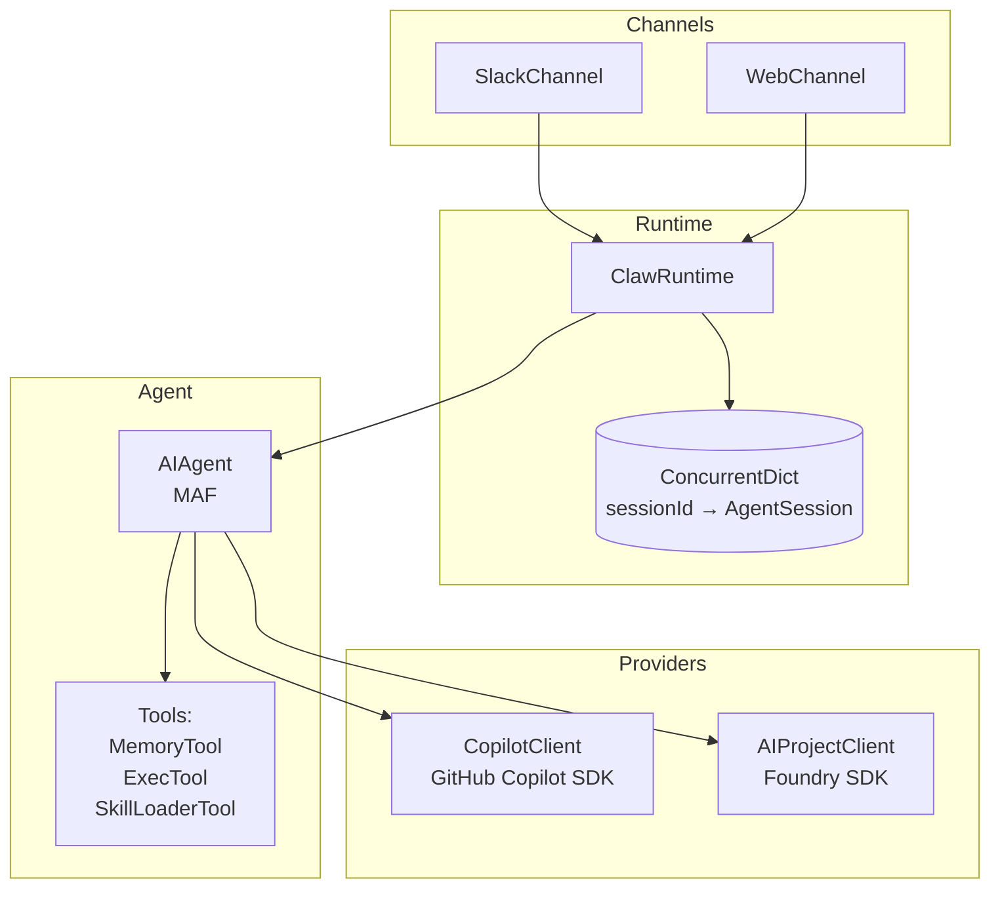

**Pseudo-code: Agent creation (Program.cs)**

```pseudo
function CreateAgent(config, tools):
    mind = MindLoader()
    systemMessage = mind.LoadSystemMessage()
    skillAdvertisement = BuildSkillAdvertisement()
    instructions = systemMessage + skillAdvertisement  // Combined
    
    if config.Provider == "foundry":
        client = AIProjectClient(endpoint, DefaultAzureCredential)
        return client.AsAIAgent(
            model: config.Model,
            instructions: instructions,  // ← uses system message
            name: "DotNetClaw",
            tools: tools
        )
    else:
        copilotClient = CopilotClient(cwd=mind.MindRoot)
        sessionConfig = SessionConfig(
            SystemMessage: { Mode: Replace, Content: instructions },
            Tools: tools
        )
        return copilotClient.AsAIAgent(sessionConfig)
```

**Key patterns:**
- Provider: Foundry-first via `AIProjectClient`
- Session isolation: sessionId → AgentSession
- Tool registration: `AIFunctionFactory.Create(toolMethod)`
- MCP integration: SkillLoaderTool calls Coffeeshop.Mcp directly

### 1.2 Coffeeshop.Mcp Architecture (MCP Server Only)

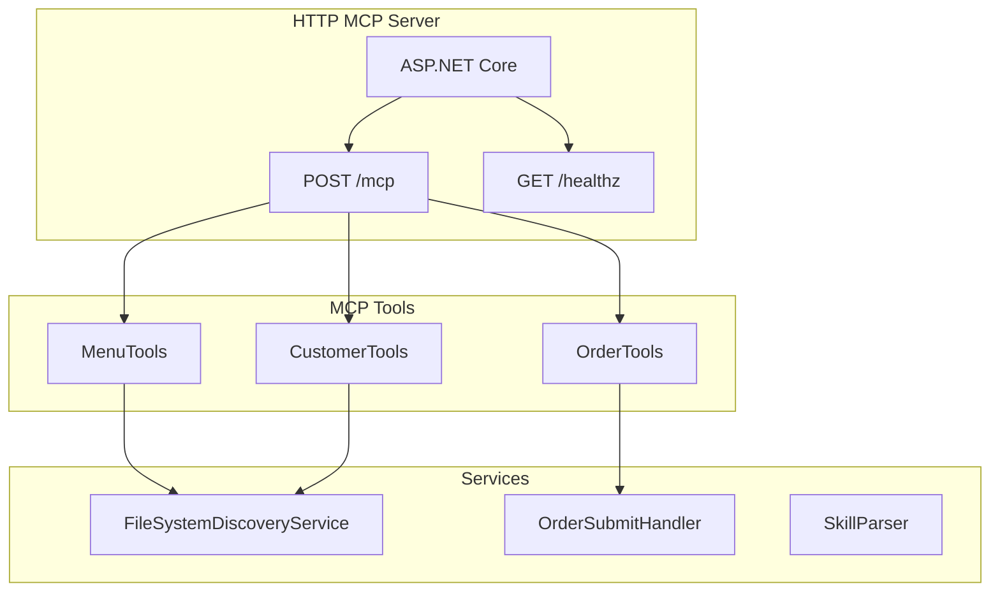

**Pseudo-code: MCP Server (Program.cs)**

```pseudo
// MCP server - tools call domain services directly (no CLI bridge)
builder = WebApplication.CreateBuilder()
builder.Services.AddScoped<IMenuService, MenuService>()
builder.Services.AddScoped<ICustomerService, CustomerService>()
builder.Services.AddScoped<IOrderService, OrderService>()
builder.Services.AddMcpServer()
    .WithHttpTransport()
    .WithTools<MenuTools>()
    .WithTools<CustomerTools>()
    .WithTools<OrderTools>()

app = builder.Build()
app.MapHealthChecks("/healthz")
app.MapMcp("/mcp")
app.Run()
```

**Key point:** Pure MCP streaming server. No conditionals.

---

## 2. MCP Gateway with Tool-Search-Tool

**Ref:** [FastMCP Tool-Search](https://gofastmcp.com/servers/transforms/tool-search), [mcp-experiments](mcp-experiments)

### 2.1 Problem

When agent has 100+ tools → context explosion. LLM sees all schemas → token waste + selection degradation.

**FastMCP solution:** Replace full catalog with 2 synthetic tools:
- `search_tools` — discover tools matching query
- `call_tool` — execute discovered tool

### 2.2 Architecture

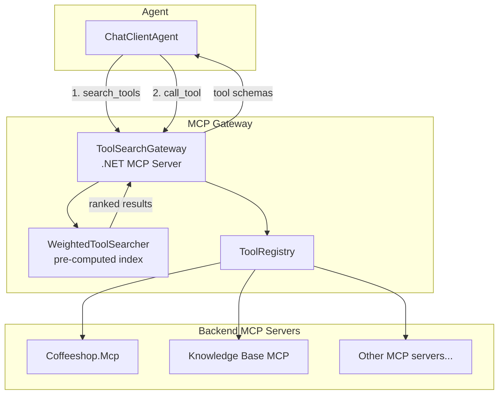

**Key:** Agent never sees full tool catalog. Discovers on-demand, executes via proxy.

### 2.3 C# Implementation

**ToolDescriptor:**

```csharp
public sealed record ToolDescriptor(
    string Name,
    string Description,
    string InputJsonSchema,
    IReadOnlyList<string> Tags,
    bool IsPinned,       // always visible
    bool IsSynthetic,    // meta-tool (search/call)
    Func<UserContext, bool> IsVisible,
    Func<JsonElement, CancellationToken, Task<object?>> Handler);
```

**IToolRegistry:**

```csharp
public interface IToolRegistry
{
    IReadOnlyList<ToolDescriptor> GetVisibleTools(UserContext context);
    ToolDescriptor? FindByName(string name, UserContext context);
    Task<object?> InvokeAsync(string name, JsonElement args, UserContext context, CancellationToken ct);
}
```

**WeightedToolSearcher (scoring):**

```csharp
public sealed class WeightedToolSearcher : IToolSearcher
{
    private const int ExactNameWeight = 100;
    private const int NameTokenWeight = 30;
    private const int DescriptionTokenWeight = 10;
    private const int ParameterNameTokenWeight = 8;
    private const int ParameterDescriptionTokenWeight = 4;
    private const int TagTokenWeight = 3;
    
    private readonly Dictionary<string, ToolSearchEntry> _searchIndex;
    
    public WeightedToolSearcher(IToolRegistry registry)
    {
        // Pre-compute tokenized index at startup
        var allTools = registry.GetVisibleTools(new UserContext(IsAdmin: true));
        _searchIndex = allTools.ToDictionary(
            t => t.Name,
            t => new ToolSearchEntry(
                t,
                t.Name.ToLowerInvariant(),
                Tokenize(t.Name),
                Tokenize(t.Description),
                t.Tags.SelectMany(Tokenize).ToHashSet(),
                t.InputJsonSchema.ToLowerInvariant()),
            StringComparer.OrdinalIgnoreCase);
    }
    
    public IReadOnlyList<ToolDescriptor> Search(string query, int limit, UserContext context)
    {
        var normalizedQuery = query.Trim().ToLowerInvariant();
        var queryTokens = Tokenize(query);
        
        return _registry.GetVisibleTools(context)
            .Select(t => (Tool: t, Score: Score(_searchIndex[t.Name], normalizedQuery, queryTokens)))
            .Where(x => x.Score > 0)
            .OrderByDescending(x => x.Score)
            .Take(limit)
            .Select(x => x.Tool)
            .ToArray();
    }
    
    private static int Score(ToolSearchEntry entry, string query, HashSet<string> tokens)
    {
        int score = 0;
        if (entry.LowerName == query) score += ExactNameWeight;
        foreach (var token in tokens)
        {
            if (entry.NameTokens.Contains(token)) score += NameTokenWeight;
            if (entry.DescriptionTokens.Contains(token)) score += DescriptionTokenWeight;
            if (entry.TagTokens.Contains(token)) score += TagTokenWeight;
            if (entry.LowerSchema.Contains($"\"{token}\"")) score += ParameterNameTokenWeight;
        }
        return score;
    }
}
```

**MetaTools (synthetic tools):**

```csharp
public sealed class MetaTools(IToolRegistry registry, IToolSearcher searcher)
{
    private static readonly HashSet<string> BlockedRecursive = 
        ["search_tools", "call_tool"];
    
    public IReadOnlyList<ToolDefinition> SearchTools(string query, int limit, UserContext ctx)
        => searcher.Search(query, limit, ctx).Select(ToDefinition).ToArray();
    
    public async Task<object?> CallToolAsync(
        string name, JsonElement args, UserContext ctx, CancellationToken ct)
    {
        if (BlockedRecursive.Contains(name.ToLowerInvariant()))
            throw new SyntheticToolRecursionException(name);
        
        return await registry.InvokeAsync(name, args, ctx, ct);
    }
}
```

**MCP Handler Registration:**

```csharp
[McpServerToolType]
public static class ToolSearchHandlers
{
    [McpServerTool(Name = "search_tools")]
    [Description("Search tool catalog. Returns name, description, input schema.")]
    public static IReadOnlyList<ToolDefinition> SearchTools(
        [Description("Natural language query")] string query,
        [Description("Max results (default 5)")] int limit,
        [FromServices] MetaTools meta,
        [FromServices] UserContext ctx)
        => meta.SearchTools(query, limit, ctx);
    
    [McpServerTool(Name = "call_tool")]
    [Description("Execute tool by name. Blocked for synthetic tools.")]
    public static async Task<object?> CallTool(
        [Description("Tool name")] string name,
        [Description("JSON arguments")] JsonElement arguments,
        [FromServices] MetaTools meta,
        [FromServices] UserContext ctx,
        CancellationToken ct)
        => await meta.CallToolAsync(name, arguments, ctx, ct);
}
```

### 2.4 Integration with Coffeeshop.Mcp

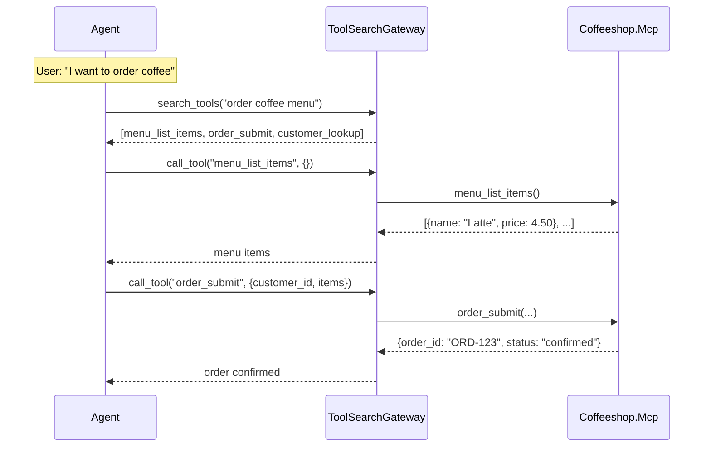

### 2.5 DI Registration

```csharp
// Program.cs
builder.Services.AddSingleton<IToolRegistry, ToolRegistry>();
builder.Services.AddSingleton<IToolSearcher, WeightedToolSearcher>();
builder.Services.AddSingleton<MetaTools>();

// Register backend MCP servers as tool sources
builder.Services.AddHostedService<McpServerDiscoveryService>(sp =>
{
    var registry = sp.GetRequiredService<IToolRegistry>();
    var config = sp.GetRequiredService<IConfiguration>();
    
    // Register Coffeeshop.Mcp tools
    registry.RegisterMcpServer("coffeeshop", config["CoffeeshopMcp:BaseUrl"]);
    
    // Register Knowledge Base MCP
    registry.RegisterMcpServer("kb", config["Foundry:KnowledgeBaseMcp"]);
    
    return new McpServerDiscoveryService(registry);
});

// MCP server with only search_tools + call_tool exposed
builder.Services.AddMcpServer()
    .WithHttpTransport()
    .WithTools<ToolSearchHandlers>();
```

### 2.6 Token Savings

| Approach | Tools in context | Tokens (approx) |
|----------|------------------|-----------------|
| Direct all tools | 20 tools | ~4000 |
| Tool-search-tool | 2 tools | ~200 |
| **Savings** | - | **95%** |

### 2.7 OpenTelemetry Observability (GenAI + MCP Semantic Conventions)

**Ref:** [OTel GenAI Semconv](https://opentelemetry.io/docs/specs/semconv/gen-ai/), [OTel MCP Semconv](https://opentelemetry.io/docs/specs/semconv/gen-ai/mcp/)

**Addresses:** Error surface + debuggability concerns.

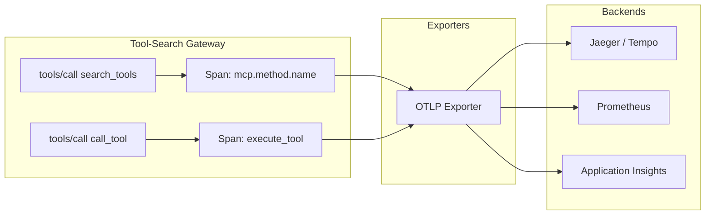

**MCP Spans (per OTel MCP semconv):**

| Attribute | Required | Example |
|-----------|----------|---------|
| `mcp.method.name` | ✅ | `tools/call` |
| `mcp.session.id` | Recommended | `sess-123` |
| `mcp.protocol.version` | Recommended | `2025-06-18` |
| `gen_ai.tool.name` | Conditionally | `menu_list_items` |
| `gen_ai.operation.name` | Recommended | `execute_tool` |
| `error.type` | If error | `tool_error` |
| `server.address` | Recommended | `coffeeshop-mcp:8080` |

```csharp
public sealed class MetaTools
{
    private static readonly ActivitySource ActivitySource = new("McpServer.MetaTools");
    
    public async Task<object?> CallToolAsync(string name, JsonElement args, UserContext ctx, CancellationToken ct)
    {
        // Span name: "{mcp.method.name} {gen_ai.tool.name}"
        using var activity = ActivitySource.StartActivity($"tools/call {name}", ActivityKind.Client);
        
        // MCP semantic conventions (required)
        activity?.SetTag("mcp.method.name", "tools/call");
        activity?.SetTag("mcp.session.id", ctx.SessionId);
        activity?.SetTag("mcp.protocol.version", "2025-06-18");
        
        // GenAI semantic conventions
        activity?.SetTag("gen_ai.operation.name", "execute_tool");
        activity?.SetTag("gen_ai.tool.name", name);
        activity?.SetTag("gen_ai.tool.call.arguments", args.ToString());  // Opt-in
        
        // Server info
        activity?.SetTag("server.address", _config["CoffeeshopMcp:Host"]);
        activity?.SetTag("server.port", _config["CoffeeshopMcp:Port"]);
        
        var sw = Stopwatch.StartNew();
        try
        {
            var result = await _registry.InvokeAsync(name, args, ctx, ct);
            sw.Stop();
            
            activity?.SetTag("gen_ai.tool.call.result", JsonSerializer.Serialize(result));  // Opt-in
            
            // Record metrics
            McpMetrics.OperationDuration.Record(sw.Elapsed.TotalSeconds, 
                new("mcp.method.name", "tools/call"),
                new("gen_ai.tool.name", name));
            
            return result;
        }
        catch (Exception ex)
        {
            activity?.SetTag("error.type", ex is ToolException ? "tool_error" : ex.GetType().Name);
            activity?.SetStatus(ActivityStatusCode.Error, ex.Message);
            
            McpMetrics.OperationDuration.Record(sw.Elapsed.TotalSeconds,
                new("mcp.method.name", "tools/call"),
                new("gen_ai.tool.name", name),
                new("error.type", "tool_error"));
            
            throw;
        }
    }
}
```

**Metrics (per OTel GenAI + MCP semconv):**

```csharp
public static class McpMetrics
{
    private static readonly Meter Meter = new("McpServer.Gateway");
    
    // mcp.client.operation.duration (required per MCP semconv)
    public static readonly Histogram<double> OperationDuration = Meter.CreateHistogram<double>(
        "mcp.client.operation.duration",
        unit: "s",
        description: "MCP operation duration",
        advice: new() { HistogramBucketBoundaries = [0.01, 0.02, 0.04, 0.08, 0.16, 0.32, 0.64, 1.28, 2.56, 5.12, 10.24, 20.48, 40.96, 81.92] });
    
    // gen_ai.client.token.usage (recommended when applicable)
    public static readonly Histogram<long> TokenUsage = Meter.CreateHistogram<long>(
        "gen_ai.client.token.usage",
        unit: "{token}",
        description: "GenAI token usage",
        advice: new() { HistogramBucketBoundaries = [1, 4, 16, 64, 256, 1024, 4096, 16384, 65536] });
    
    // mcp.client.session.duration (recommended)
    public static readonly Histogram<double> SessionDuration = Meter.CreateHistogram<double>(
        "mcp.client.session.duration",
        unit: "s",
        description: "MCP session duration");
}
```

**Context propagation (per MCP semconv):**

```csharp
// Inject trace context into MCP request params._meta
var mcpRequest = new McpRequest
{
    Method = "tools/call",
    Params = new {
        name = toolName,
        arguments = args,
        _meta = new {
            traceparent = Activity.Current?.Id,
            tracestate = Activity.Current?.TraceStateString
        }
    }
};
```

**DI Registration:**

```csharp
// Program.cs
builder.Services.AddOpenTelemetry()
    .WithTracing(tracing => tracing
        .AddSource("McpServer.MetaTools")
        .AddSource("McpServer.ToolRegistry")
        .AddAspNetCoreInstrumentation()
        .AddHttpClientInstrumentation()
        .AddOtlpExporter())
    .WithMetrics(metrics => metrics
        .AddMeter("McpServer.Gateway")
        .AddAspNetCoreInstrumentation()
        .AddHttpClientInstrumentation()
        .AddOtlpExporter());

// For Azure Application Insights
builder.Services.AddOpenTelemetry()
    .UseAzureMonitor(options => 
        options.ConnectionString = config["ApplicationInsights:ConnectionString"]);
```

**Key spans to monitor:**

| Span name | Attributes | Alert on |
|-----------|------------|----------|
| `tools/call {tool}` | mcp.method.name, gen_ai.tool.name | error.type present |
| `tools/list` | mcp.method.name | error.type present |

**Key metrics:**

| Metric | Type | Alert threshold |
|--------|------|-----------------|
| `mcp.client.operation.duration` | Histogram | p99 > 2s |
| `gen_ai.client.token.usage` | Histogram | Baseline deviation |
| `mcp.client.session.duration` | Histogram | p99 > 300s |

---
## 3. Coffeeshop Skills Workflows

**Ref:** [coffeeshop-cli skills](coffeeshop-cli/skills), [MAF Workflows](MAF-Workflows)

3 skills define agent workflows:

### 3.1 coffeeshop-counter-service (ordering)

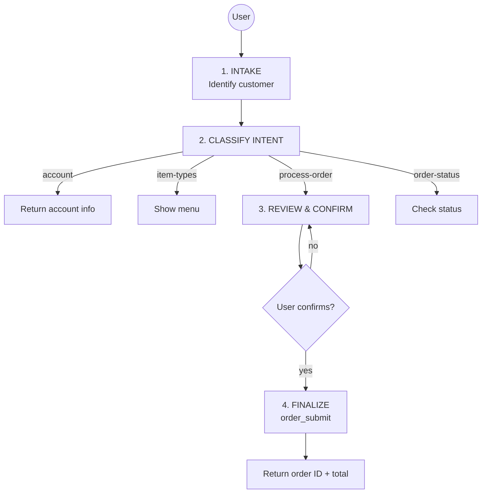

**MCP tools:** `customer_lookup`, `menu_list_items`, `order_submit`

### 3.2 coffeeshop-customer-lookup (support)

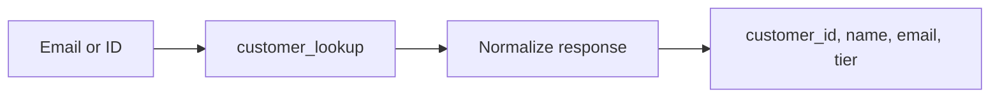

**MCP tool:** `customer_lookup`

### 3.3 coffeeshop-menu-guide (discovery)

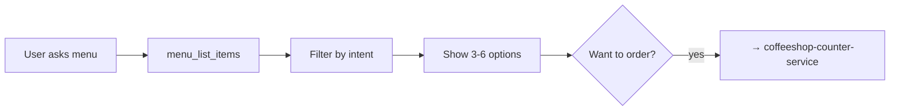

**MCP tool:** `menu_list_items`

### 3.4 Multi-Agent Workflow (MAF + Foundry + Tool-Search)

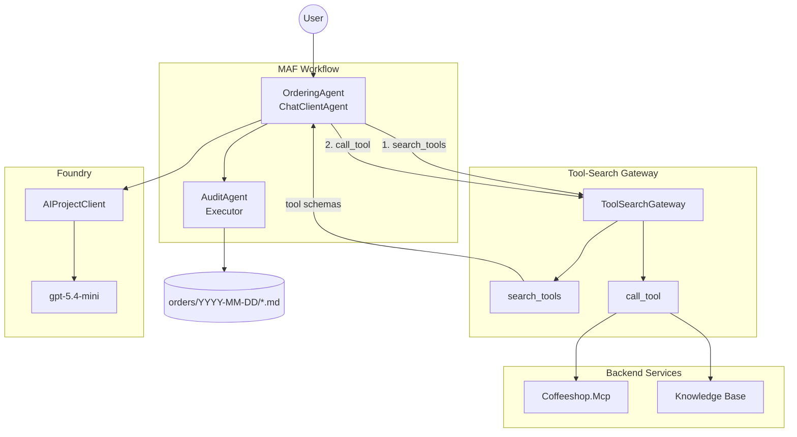

**Key insight:** Agent uses tool-search-gateway. Only sees `search_tools` + `call_tool`. Backend MCP servers hidden.

**C# Implementation:**

```csharp
// Program.cs — MAF workflow with Tool-Search Gateway

// 1. Create Foundry chat client
var projectClient = new AIProjectClient(
    new Uri(config["Foundry:Endpoint"]),
    new DefaultAzureCredential());

IChatClient chatClient = projectClient
    .GetChatClient(config["Foundry:Model"])
    .AsIChatClient();

// 2. Connect to Tool-Search Gateway (only 2 tools exposed)
var gatewayTransport = new HttpClientTransport(new HttpClientTransportOptions
{
    Endpoint = new Uri(config["ToolSearchGateway:BaseUrl"] + "/mcp")
});
var gatewayClient = await McpClient.CreateAsync(gatewayTransport);

// 3. Define tools (search + call only)
var tools = new List<AITool>
{
    AIFunctionFactory.Create(async (string query, int limit) => 
        await gatewayClient.CallToolAsync("search_tools", new { query, limit }),
        "search_tools", "Search for tools by natural language query"),
    
    AIFunctionFactory.Create(async (string name, JsonElement arguments) => 
        await gatewayClient.CallToolAsync("call_tool", new { name, arguments }),
        "call_tool", "Execute a discovered tool by name"),
};

// 4. Create agents
var orderingAgent = new ChatClientAgent(chatClient, new ChatClientAgentOptions
{
    Name = "OrderingAgent",
    Instructions = LoadSkill("coffeeshop-counter-service"),
    Tools = tools  // Only search_tools + call_tool
});

var auditAgent = new AuditExecutor();

// 6. Build MAF workflow
var workflow = new WorkflowBuilder(orderingAgent)
    .AddEdge(orderingAgent, auditAgent)
    .WithOutputFrom(auditAgent)
    .Build();

// 7. Execute
await using var run = await InProcessExecution.RunStreamingAsync(workflow, userMessage);
await foreach (var evt in run.WatchStreamAsync())
{
    // Handle AgentResponseUpdateEvent, WorkflowOutputEvent, etc.
}
```

**AuditExecutor:**

```csharp
public sealed class AuditExecutor : Executor<OrderResult, string>
{
    public override async ValueTask<string> HandleAsync(
        OrderResult order,
        IWorkflowContext context,
        CancellationToken ct = default)
    {
        var date = order.PlacedAt.ToString("yyyy-MM-dd");
        var dir = Path.Combine("orders", date);
        Directory.CreateDirectory(dir);
        
        var path = Path.Combine(dir, $"{order.OrderId}.md");
        var content = $"""
            # Order {order.OrderId}
            
            - **Customer:** {order.CustomerName} ({order.CustomerId})
            - **Status:** {order.Status}
            - **Placed:** {order.PlacedAt:O}
            - **Total:** ${order.Total:F2}
            
            ## Items
            
            | Item | Qty | Price |
            |------|-----|-------|
            {string.Join("\n", order.Items.Select(i => $"| {i.Name} | {i.Qty} | ${i.Price:F2} |"))}
            """;
        
        await File.WriteAllTextAsync(path, content, ct);
        return $"Order {order.OrderId} logged to {path}";
    }
}
```

---

## 4. Foundry IQ Research

**Ref:** [Foundry IQ](Foundry-IQ), [KnowledgeBaseRetrievalClient](Foundry-IQ-API)

### 4.1 Knowledge Base Retrieval

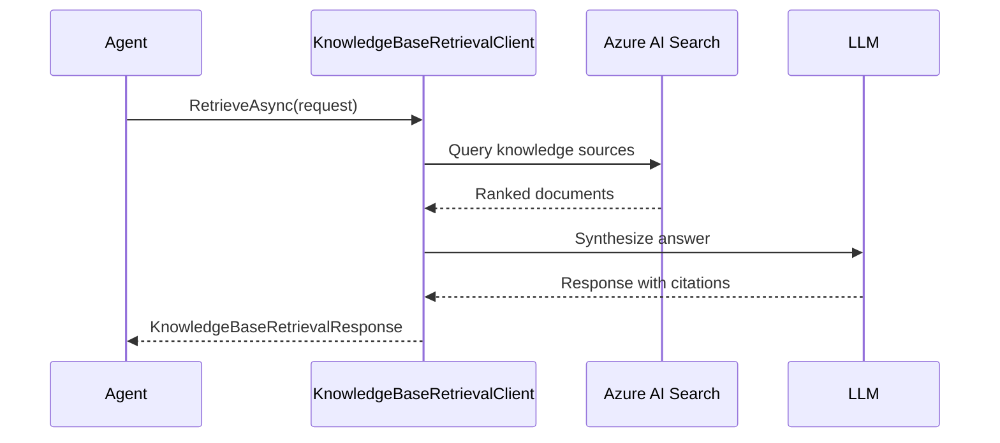

### 4.2 API Shape (C#)

**Pseudo-code: Foundry IQ Integration**

```pseudo
// Create client
kbClient = new KnowledgeBaseRetrievalClient(
    endpoint: searchServiceUrl,
    knowledgeBaseName: "coffeeshop-kb",
    tokenCredential: DefaultAzureCredential()
)

// Build request
request = new KnowledgeBaseRetrievalRequest()
request.Messages.Add(
    KnowledgeBaseMessage(role: "user", content: "What is the information of the coffeeshop?")
)
request.KnowledgeSourceParams.Add(
    SearchIndexKnowledgeSourceParams(knowledgeSourceName: "menu-index")
)

// Execute
result = await kbClient.RetrieveAsync(request)
answer = result.Response[0].Content[0].Text
```

### 4.3 MCP Endpoint Alternative

Knowledge bases also expose MCP endpoint:
- URL: `{search_url}/knowledgebases/{name}/mcp`
- Usable via `MCPStreamableHTTPTool`

---

## 5. Foundry Toolbox Research

**Ref:** [Foundry Toolbox](Foundry-Toolbox-Docs), [Toolbox MCP](Foundry-MCP-Endpoint)

### 5.1 Toolbox Architecture

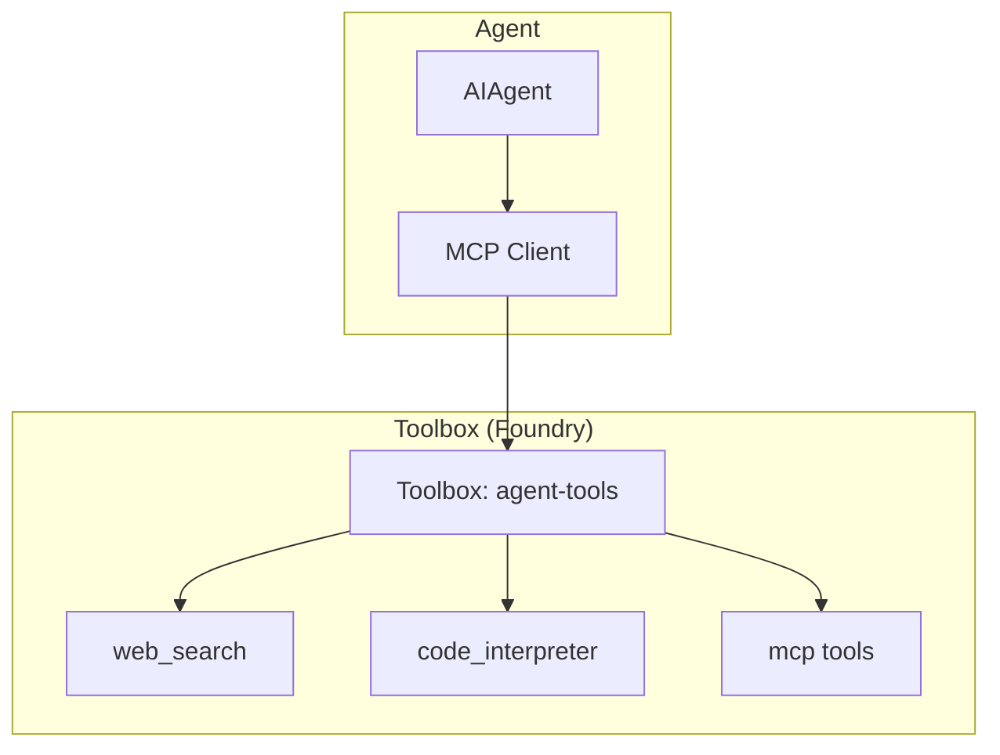

### 5.2 Toolbox Creation (C#)

**Pseudo-code: Create Toolbox**

```pseudo
// Create client
projectClient = new AIProjectClient(projectEndpoint, DefaultAzureCredential())
toolboxClient = projectClient.AgentAdministrationClient.GetAgentToolboxes()

// Define tools
webTool = ProjectsAgentTool.AsProjectTool(
    ResponseTool.CreateWebSearchTool()
)
codeInterpTool = ProjectsAgentTool.AsProjectTool(
    ResponseTool.CreateCodeInterpreterTool()
)

// Create toolbox version
toolboxVersion = await toolboxClient.CreateToolboxVersionAsync(
    toolboxName: "agent-tools",
    tools: [webTool, codeInterpTool],
    description: "Web search + code interpreter"
)
```

### 5.3 Toolbox Consumption

**Endpoint pattern:**
- Consumer: `{project}/toolboxes/{name}/mcp?api-version=v1`
- Developer: `{project}/toolboxes/{name}/versions/{v}/mcp?api-version=v1`

**Required header:** `Foundry-Features: Toolboxes=V1Preview`

**Pseudo-code: Connect to Toolbox**

```pseudo
// Environment vars (injected by hosted agent runtime)
FOUNDRY_AGENT_TOOLBOX_ENDPOINT = env.Get("FOUNDRY_AGENT_TOOLBOX_ENDPOINT")

// Create MCP transport
transport = new HttpClientTransport(
    endpoint: FOUNDRY_AGENT_TOOLBOX_ENDPOINT,
    headers: ["Foundry-Features": "Toolboxes=V1Preview"]
)

// List tools
mcpClient = await McpClient.CreateAsync(transport)
tools = await mcpClient.ListToolsAsync()

// Call tool
result = await mcpClient.CallToolAsync("web_search", {"search_query": "coffee trends"})
```

---

## 6. Copilot SDK Research

**Ref:** [Copilot SDK](Copilot-SDK)

### 6.1 When to Use

| Scenario | Use |
|----------|-----|
| GitHub auth, Copilot billing | Copilot SDK |
| Azure auth, Foundry platform | Foundry SDK |
| Both needed | Copilot SDK w/ BYOK pointing to Foundry |

### 6.2 Key Insight

Current DotNetClaw already supports both:
- `Agent:Provider = "copilot"` → CopilotClient
- `Agent:Provider = "foundry"` → AIProjectClient

For rewrite: default to Foundry, optionally fall back to Copilot.

---

## 7. Proposed Monorepo Structure

**Ref:** [DotNetClaw](DotNetClaw), [coffeeshop-cli](coffeeshop-cli)

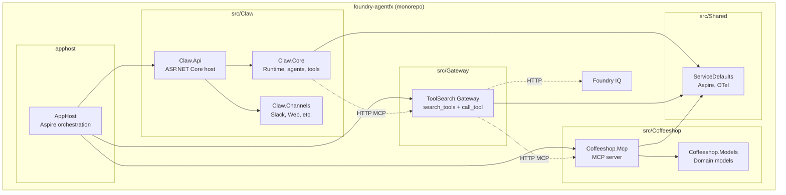

**Connections:**

| From | To | Type | Purpose |
|------|-----|------|---------|
| Claw.Core | ToolSearch.Gateway | HTTP MCP | Agent calls `search_tools` + `call_tool` |
| ToolSearch.Gateway | Coffeeshop.Mcp | HTTP MCP | Gateway proxies tool calls |
| ToolSearch.Gateway | Foundry IQ | HTTP | Gateway proxies KB queries |

### 7.1 Folder Layout

```
foundry-agentfx/
├── src/
│   ├── Claw.Api/                 # ASP.NET host (channels, endpoints)
│   ├── Claw.Core/                # Runtime, agents, tools
│   ├── Claw.Channels/            # Slack, Web channel adapters
│   ├── Coffeeshop.Mcp/           # HTTP MCP server
│   ├── Coffeeshop.Models/        # Domain: Menu, Customer, Order
│   ├── ToolSearch.Gateway/       # Tool-search MCP gateway
│   └── ServiceDefaults/          # Aspire service defaults
├── apphost/
│   └── AppHost/                  # Aspire orchestration
├── tests/
│   ├── Claw.Tests/
│   ├── Coffeeshop.Tests/
│   └── ToolSearch.Tests/
├── skills/                       # SKILL.md manifests
├── mind/                         # Agent identity files
└── foundry-agentfx.slnx
```

### 7.2 Claw.Api DI Registration (Program.cs)

```pseudo
// Program.cs - Claw.Api
builder = WebApplication.CreateBuilder()

// 1. Aspire service defaults (OTel, health checks)
builder.AddServiceDefaults()

// 2. Foundry AI Project (core)
builder.Services.AddSingleton<AIProjectClient>(sp => 
    new AIProjectClient(
        config["Foundry:Endpoint"],
        new DefaultAzureCredential()
    )
)

// 3. Foundry IQ - Knowledge Base (Section 4)
builder.Services.AddSingleton<KnowledgeBaseRetrievalClient>(sp =>
    new KnowledgeBaseRetrievalClient(
        config["FoundryIQ:SearchEndpoint"],
        config["FoundryIQ:KnowledgeBaseName"],
        new DefaultAzureCredential()
    )
)

// 4. Foundry Toolbox - web_search, code_interpreter (Section 5)
builder.Services.AddSingleton<IMcpClient>(sp =>
    McpClient.CreateAsync(
        new HttpClientTransport(
            endpoint: config["Toolbox:McpEndpoint"],
            headers: ["Foundry-Features": "Toolboxes=V1Preview"]
        )
    ).Result
)

// 5. Tool-Search Gateway client (Section 2)
builder.Services.AddHttpClient<IToolSearchClient, ToolSearchClient>(client =>
    client.BaseAddress = new Uri(config["ToolSearch:GatewayUrl"])
)

// 6. Agent with tools
builder.Services.AddSingleton<IAgent>(sp =>
    CreateAgent(config, [
        sp.GetRequiredService<IToolSearchClient>()  // Agent only sees gateway
    ])
)

// 7. Channels
builder.Services.AddSlackChannel()
builder.Services.AddWebChannel()

app = builder.Build()
app.MapSlackEvents("/slack")
app.MapChatApi("/api/chat")
app.Run()
```

**Key:** Agent uses `IToolSearchClient` only → gateway proxies to Foundry IQ, Toolbox, Coffeeshop.Mcp.

---

## 8. Multi-Agent Design

**Ref:** [MAF Workflows](MAF-Workflows), [Foundry Hosted Demos](Foundry-Hosted-Demos)

### 8.1 Agent Responsibilities

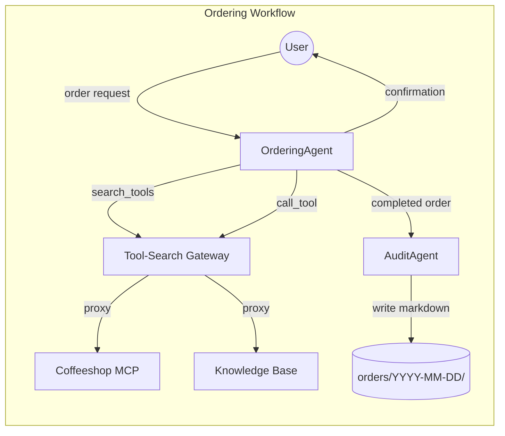

### 8.2 Workflow Definition

**Pseudo-code: Ordering + Audit Workflow**

```pseudo
// Agents
orderingAgent = CreateOrderingAgent(chatClient, gatewayTools)
auditAgent = CreateAuditExecutor()

// Workflow — user sees OrderingAgent response
workflow = new WorkflowBuilder(orderingAgent)
    .AddEdge(orderingAgent, auditAgent)
    .WithOutputFrom(orderingAgent)  // ← user gets agent reply, not audit log
    .Build()

// OrderingAgent tools (via gateway)
gatewayTools = [
    SearchToolsTool,  // search_tools → discover available tools
    CallToolTool,     // call_tool → execute discovered tool
]

// AuditAgent executor
class AuditExecutor : Executor<OrderResult, string>:
    async HandleAsync(order, context, ct):
        // Write markdown log
        date = order.PlacedAt.ToString("yyyy-MM-dd")
        path = $"orders/{date}/{order.OrderId}.md"
        content = FormatOrderMarkdown(order)
        await File.WriteAllTextAsync(path, content)
        return $"Order {order.OrderId} logged to {path}"
```

### 8.3 Audit Markdown Format

```markdown
# Order ORD-1234

- **Customer:** Alice Smith (C-1001)
- **Status:** Completed
- **Placed:** 2026-05-24T14:30:00Z
- **Total:** $12.50

## Items

| Item | Qty | Price |
|------|-----|-------|
| Latte | 2 | $4.50 |
| Croissant | 1 | $3.50 |

---
*Logged by AuditAgent*
```

---

## 9. Integration Points

**Ref:** [Section 2 (Gateway)](#2-mcp-gateway-with-tool-search-tool), [Section 3 (Workflows)](#3-coffeeshop-skills-workflows)

### 9.1 Tool-Search Gateway Integration

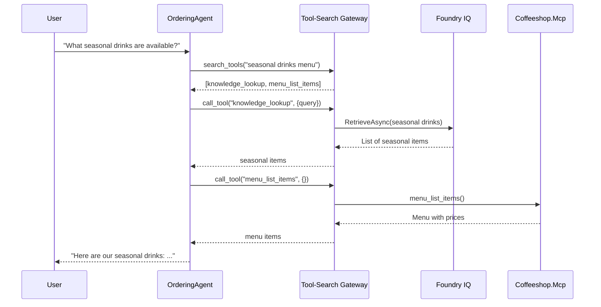

**Use case:** Agent discovers tools via gateway, then calls them. Backend services (Foundry IQ, Coffeeshop.Mcp) hidden.

### 9.2 Foundry Toolbox for Extended Capabilities

| Tool | Use Case |
|------|----------|
| `web_search` | Current coffee trends, competitor prices |
| `code_interpreter` | Calculate totals, discounts, analytics |

**Note:** Toolbox tools also registered in gateway's ToolRegistry.

### 9.3 Core Interfaces & Types

**IToolSearchClient** (Claw.Core calls Gateway):

```csharp
public interface IToolSearchClient
{
    Task<ToolDescriptor[]> SearchToolsAsync(string query, int limit = 5);
    Task<JsonElement> CallToolAsync(string name, JsonElement args);
}

public class ToolSearchClient : IToolSearchClient
{
    private readonly HttpClient _http;
    
    public ToolSearchClient(HttpClient http) => _http = http;
    
    public async Task<ToolDescriptor[]> SearchToolsAsync(string query, int limit = 5)
    {
        var response = await _http.PostAsJsonAsync("/mcp", new {
            method = "tools/call",
            params = new { name = "search_tools", arguments = new { query, limit } }
        });
        return await response.Content.ReadFromJsonAsync<ToolDescriptor[]>();
    }
    
    public async Task<JsonElement> CallToolAsync(string name, JsonElement args)
    {
        var response = await _http.PostAsJsonAsync("/mcp", new {
            method = "tools/call",
            params = new { name = "call_tool", arguments = new { toolName = name, arguments = args } }
        });
        return await response.Content.ReadFromJsonAsync<JsonElement>();
    }
}
```

**Domain Types** (Coffeeshop.Models):

```csharp
public record MenuItem(string Id, string Name, string Category, decimal Price);
public record Customer(string Id, string Name, string Email, string Phone);
public record OrderItem(string MenuItemId, int Quantity);
public record OrderResult(
    string OrderId,
    string CustomerId,
    List<OrderItem> Items,
    decimal Total,
    DateTimeOffset PlacedAt);
```

**Service Interfaces** (Coffeeshop.Mcp):

```csharp
public interface IMenuService
{
    Task<IEnumerable<MenuItem>> GetAllItemsAsync();
    Task<MenuItem?> GetByIdAsync(string id);
}

public interface ICustomerService
{
    Task<Customer?> LookupAsync(string nameOrPhone);
}

public interface IOrderService
{
    Task<OrderResult> SubmitAsync(string customerId, List<OrderItem> items);
}
```

### 9.4 Configuration Schema

**appsettings.json** (Claw.Api):

```json
{
  "Foundry": {
    "Endpoint": "https://<project>.api.azureml.ms",
    "Model": "gpt-4o"
  },
  "FoundryIQ": {
    "SearchEndpoint": "https://<search>.search.windows.net",
    "KnowledgeBaseName": "coffeeshop-kb"
  },
  "Toolbox": {
    "McpEndpoint": "https://<project>.api.azureml.ms/toolboxes/agent-tools/mcp"
  },
  "ToolSearch": {
    "GatewayUrl": "http://localhost:5002"
  },
  "Slack": {
    "BotToken": "${SLACK_BOT_TOKEN}",
    "SigningSecret": "${SLACK_SIGNING_SECRET}"
  }
}
```

**AppHost configuration** (Aspire startup order):

```csharp
// AppHost/Program.cs
var builder = DistributedApplication.CreateBuilder(args);

// 1. Coffeeshop MCP must start first
var coffeeshop = builder.AddProject<Projects.Coffeeshop_Mcp>("coffeeshop-mcp")
    .WithHttpEndpoint(port: 5001, name: "mcp");

// 2. Gateway depends on Coffeeshop
var gateway = builder.AddProject<Projects.ToolSearch_Gateway>("toolsearch-gateway")
    .WithHttpEndpoint(port: 5002, name: "mcp")
    .WithReference(coffeeshop);

// 3. Claw.Api depends on Gateway
builder.AddProject<Projects.Claw_Api>("claw-api")
    .WithHttpEndpoint(port: 5000)
    .WithReference(gateway)
    .WithEnvironment("ToolSearch__GatewayUrl", gateway.GetEndpoint("mcp"));

builder.Build().Run();
```

---


## 10. Karpathy Guidelines Critique

**Ref:** [Karpathy Guidelines](Karpathy-Guidelines), [OTel GenAI Semconv](https://opentelemetry.io/docs/specs/semconv/gen-ai/)

### 10.0 Consistency & Confidence Assessment

| Section | Consistent with Gateway Pattern? | Confidence |
|---------|----------------------------------|------------|
| 1. Existing Codebases | ✅ Foundation analyzed | 95% |
| 2. Tool-Search Gateway | ✅ Core pattern defined | 90% |
| 3. Coffeeshop Workflows | ✅ Uses gateway via Section 3.4 | 90% |
| 4. Foundry IQ | ✅ Backend behind gateway | 85% |
| 5. Foundry Toolbox | ✅ Backend behind gateway | 85% |
| 6. Copilot SDK | ✅ Optional BYOK fallback | 80% |
| 7. Monorepo | ✅ HTTP runtime connections shown | 90% |
| 8. Multi-Agent | ✅ OrderingAgent + AuditAgent via gateway | 90% |
| 9. Integration Points | ✅ All flows use gateway | 90% |
| 10. Karpathy | N/A (this section) | N/A |
| 11. Phases | ✅ Gateway in Phase 8 | 85% |
| 12. Deployment | ✅ Container Apps + OTel | 85% |

**Overall Confidence: 88%**

Key risks:
- Foundry IQ API still preview → may change
- Tool-search latency in prod unknown → monitor p99
- OTel MCP semconv still experimental → may evolve

### 10.1 Think Before Coding

| Question | Answer |
|----------|--------|
| Assumptions explicit? | ✅ Foundry-first, MCP bridge retained |
| Multiple interpretations? | Copilot fallback = optional, not required |
| Simpler approach exists? | ⚠️ Could skip Foundry IQ initially |

### 10.2 Simplicity First

| Check | Status |
|-------|--------|
| Features beyond ask? | ❌ All requested |
| Abstractions for single-use? | ⚠️ Watch for over-engineering audit logging |
| Error handling for impossible? | ✅ Keep minimal |

**Recommendation:** Implement OrderingAgent + AuditAgent together to demonstrate multi-agent workflow architecture.

### 10.3 Surgical Changes

| Principle | Application |
|-----------|-------------|
| Touch only what must | Keep MCP server, remove legacy code |
| Match existing style | Follow current DotNetClaw patterns |
| Orphan cleanup | Remove unused dependencies |

### 10.4 Goal-Driven Execution

**Success criteria:**

1. `dotnet run --project Claw.Api` → agent responds to Slack/Web
2. `dotnet run --project Coffeeshop.Mcp` → MCP server on :8080
3. OrderingAgent can:
   - List menu via MCP
   - Lookup customer via MCP
   - Submit order via MCP
4. AuditAgent logs completed orders to `orders/YYYY-MM-DD/*.md`
5. Foundry Toolbox tools (web_search, code_interpreter) callable

### 10.5 Tool-Search-Tool Critique

| Guideline | Assessment |
|-----------|------------|
| **Simplicity** | ✅ 2 tools vs 20+ = simpler context |
| **Token efficiency** | ✅ ~95% reduction = Karpathy approved |
| **Indirection cost** | ⚠️ Extra hop (search → call) adds latency — acceptable trade-off |
| **Error surface** | ✅ Mitigated with OpenTelemetry traces + metrics (Section 2.7) |
| **Debuggability** | ✅ Mitigated with OpenTelemetry traces + metrics (Section 2.7) |

**Verdict:** ✅ **Use tool-search-tool for this project.** Token savings + scalability outweigh latency cost. Observability via OTel.

**Benefits for this project:**
- Coffeeshop + KB + Toolbox = 10+ tools → gateway essential
- Token efficiency: ~95% reduction
- Scalable: add more MCP servers without agent changes
- Observable: OTel traces + metrics for debugging

---

## 11. Implementation Phases (Recommended)

**Ref:** [Section 10.4 Success Criteria](#104-goal-driven-execution)

| Phase | Scope | Verify |
|-------|-------|--------|
| 1 | Monorepo structure, build passes | `dotnet build` |
| 2 | Coffeeshop.Mcp standalone | `curl POST /mcp` |
| 3 | Claw.Api with Foundry provider | `POST /api/chat` |
| 4 | OrderingAgent + MCP integration | Order via Slack |
| 5 | AuditAgent + workflow | Check `orders/` folder |
| 6 | Foundry IQ integration | RAG search works |
| 7 | Foundry Toolbox | web_search callable |
| 8 | Tool-Search Gateway | search_tools + call_tool work |

---

## 12. Deployment (azd + Bicep)

**Ref:** [Azure Developer CLI](https://learn.microsoft.com/azure/developer/azure-developer-cli/), [Container Apps](https://learn.microsoft.com/azure/container-apps/)

### 12.1 Deployment Architecture

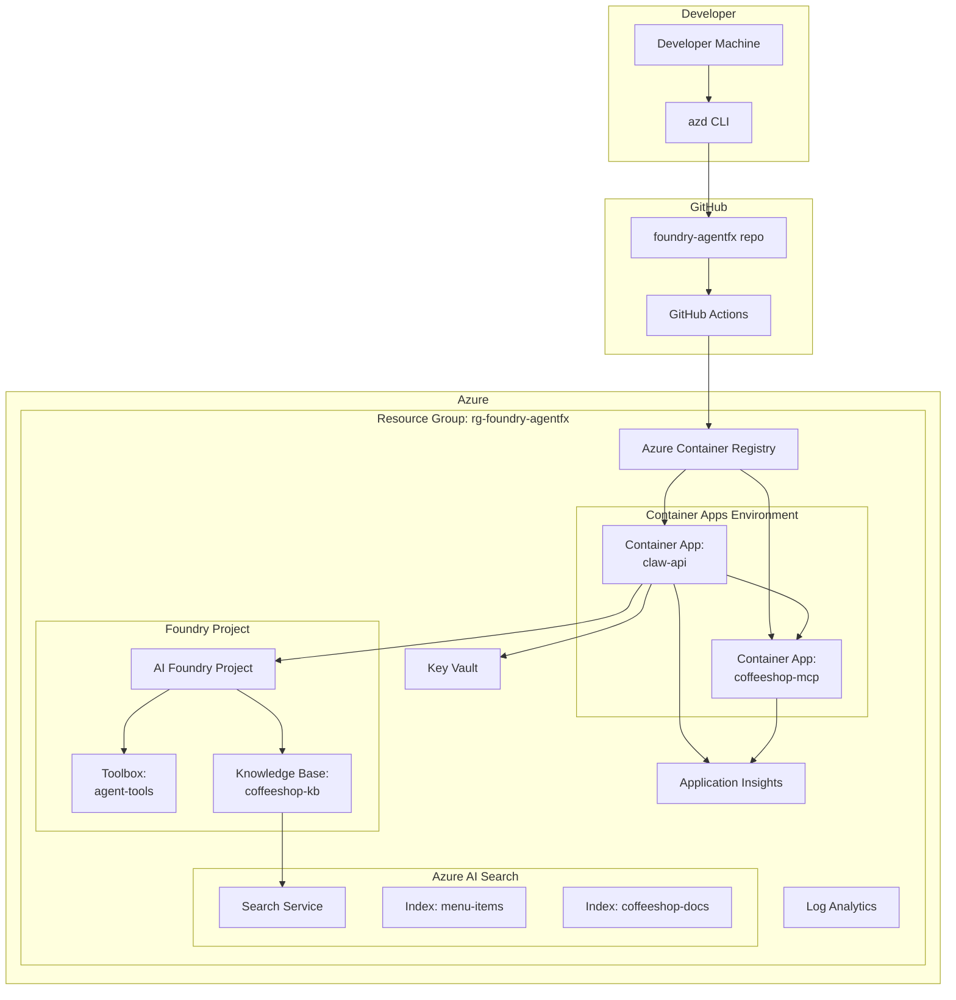

### 12.2 azd Project Structure

```
foundry-agentfx/
├── azure.yaml                    # azd project definition
├── infra/
│   ├── main.bicep               # Main orchestration
│   ├── main.parameters.json     # Environment parameters
│   ├── modules/
│   │   ├── container-apps.bicep # Container Apps + Environment
│   │   ├── container-registry.bicep
│   │   ├── foundry-project.bicep
│   │   ├── ai-search.bicep
│   │   ├── toolbox.bicep
│   │   ├── knowledge-base.bicep
│   │   ├── monitoring.bicep
│   │   └── keyvault.bicep
│   └── scripts/
│       ├── create-search-indexes.py
│       └── seed-knowledge-base.py
├── src/
│   ├── Claw.Api/
│   │   └── Dockerfile
│   └── Coffeeshop.Mcp/
│       └── Dockerfile
└── .github/
    └── workflows/
        └── azure-deploy.yml
```

### 12.3 azure.yaml

```yaml
name: foundry-agentfx
metadata:
  template: foundry-agentfx@0.1.0

infra:
  provider: bicep
  path: infra

services:
  claw-api:
    project: src/Claw.Api
    language: dotnet
    host: containerapp
    docker:
      path: src/Claw.Api/Dockerfile
      context: .

  coffeeshop-mcp:
    project: src/Coffeeshop.Mcp
    language: dotnet
    host: containerapp
    docker:
      path: src/Coffeeshop.Mcp/Dockerfile
      context: .

hooks:
  postprovision:
    shell: pwsh
    run: |
      Write-Host "Creating search indexes..."
      python infra/scripts/create-search-indexes.py
      Write-Host "Seeding knowledge base..."
      python infra/scripts/seed-knowledge-base.py
```

### 12.4 Bicep: main.bicep

```bicep
targetScope = 'subscription'

@description('Environment name (dev, staging, prod)')
param environmentName string

@description('Primary location for resources')
param location string = 'eastus2'

@description('Foundry model deployment name')
param modelDeploymentName string = 'gpt-5.4-mini'

// Tags applied to all resources
var tags = {
  'azd-env-name': environmentName
  'project': 'foundry-agentfx'
}

var abbrs = loadJsonContent('abbreviations.json')
var resourceToken = toLower(uniqueString(subscription().id, environmentName, location))

// Resource Group
resource rg 'Microsoft.Resources/resourceGroups@2024-03-01' = {
  name: 'rg-${environmentName}'
  location: location
  tags: tags
}

// Monitoring (Log Analytics + App Insights)
module monitoring 'modules/monitoring.bicep' = {
  name: 'monitoring'
  scope: rg
  params: {
    location: location
    tags: tags
    logAnalyticsName: '${abbrs.operationalInsightsWorkspaces}${resourceToken}'
    appInsightsName: '${abbrs.insightsComponents}${resourceToken}'
  }
}

// Key Vault
module keyVault 'modules/keyvault.bicep' = {
  name: 'keyvault'
  scope: rg
  params: {
    location: location
    tags: tags
    keyVaultName: '${abbrs.keyVaultVaults}${resourceToken}'
  }
}

// Container Registry
module containerRegistry 'modules/container-registry.bicep' = {
  name: 'container-registry'
  scope: rg
  params: {
    location: location
    tags: tags
    registryName: '${abbrs.containerRegistryRegistries}${resourceToken}'
  }
}

// Azure AI Search
module aiSearch 'modules/ai-search.bicep' = {
  name: 'ai-search'
  scope: rg
  params: {
    location: location
    tags: tags
    searchServiceName: '${abbrs.searchSearchServices}${resourceToken}'
    sku: 'basic'
  }
}

// Foundry Project
module foundryProject 'modules/foundry-project.bicep' = {
  name: 'foundry-project'
  scope: rg
  params: {
    location: location
    tags: tags
    projectName: 'foundry-agentfx-${resourceToken}'
    modelDeploymentName: modelDeploymentName
  }
}

// Toolbox (depends on Foundry Project)
module toolbox 'modules/toolbox.bicep' = {
  name: 'toolbox'
  scope: rg
  params: {
    foundryProjectEndpoint: foundryProject.outputs.projectEndpoint
    toolboxName: 'agent-tools'
  }
  dependsOn: [foundryProject]
}

// Knowledge Base (depends on AI Search + Foundry)
module knowledgeBase 'modules/knowledge-base.bicep' = {
  name: 'knowledge-base'
  scope: rg
  params: {
    searchServiceEndpoint: aiSearch.outputs.searchEndpoint
    knowledgeBaseName: 'coffeeshop-kb'
    indexNames: ['menu-items', 'coffeeshop-docs']
  }
  dependsOn: [aiSearch, foundryProject]
}

// Container Apps Environment + Apps
module containerApps 'modules/container-apps.bicep' = {
  name: 'container-apps'
  scope: rg
  params: {
    location: location
    tags: tags
    environmentName: '${abbrs.appManagedEnvironments}${resourceToken}'
    logAnalyticsWorkspaceId: monitoring.outputs.logAnalyticsWorkspaceId
    appInsightsConnectionString: monitoring.outputs.appInsightsConnectionString
    containerRegistryLoginServer: containerRegistry.outputs.loginServer
    keyVaultUri: keyVault.outputs.vaultUri
    foundryProjectEndpoint: foundryProject.outputs.projectEndpoint
    toolboxEndpoint: toolbox.outputs.toolboxEndpoint
    searchServiceEndpoint: aiSearch.outputs.searchEndpoint
    knowledgeBaseName: knowledgeBase.outputs.knowledgeBaseName
  }
  dependsOn: [containerRegistry, foundryProject, toolbox, knowledgeBase]
}

// Outputs for azd
output AZURE_CONTAINER_REGISTRY_ENDPOINT string = containerRegistry.outputs.loginServer
output AZURE_CONTAINER_REGISTRY_NAME string = containerRegistry.outputs.registryName
output CLAW_API_URL string = containerApps.outputs.clawApiUrl
output COFFEESHOP_MCP_URL string = containerApps.outputs.coffeeshopMcpUrl
output FOUNDRY_PROJECT_ENDPOINT string = foundryProject.outputs.projectEndpoint
output AZURE_AI_SEARCH_ENDPOINT string = aiSearch.outputs.searchEndpoint
```

### 12.5 Bicep: container-apps.bicep

```bicep
@description('Location for resources')
param location string

@description('Tags for resources')
param tags object

@description('Container Apps environment name')
param environmentName string

@description('Log Analytics workspace ID')
param logAnalyticsWorkspaceId string

@description('App Insights connection string')
param appInsightsConnectionString string

@description('Container registry login server')
param containerRegistryLoginServer string

@description('Key Vault URI')
param keyVaultUri string

@description('Foundry project endpoint')
param foundryProjectEndpoint string

@description('Toolbox MCP endpoint')
param toolboxEndpoint string

@description('AI Search endpoint')
param searchServiceEndpoint string

@description('Knowledge base name')
param knowledgeBaseName string

// Container Apps Environment
resource containerAppsEnv 'Microsoft.App/managedEnvironments@2024-03-01' = {
  name: environmentName
  location: location
  tags: tags
  properties: {
    appLogsConfiguration: {
      destination: 'log-analytics'
      logAnalyticsConfiguration: {
        customerId: reference(logAnalyticsWorkspaceId, '2023-09-01').customerId
        sharedKey: listKeys(logAnalyticsWorkspaceId, '2023-09-01').primarySharedKey
      }
    }
  }
}

// Claw API Container App
resource clawApi 'Microsoft.App/containerApps@2024-03-01' = {
  name: 'claw-api'
  location: location
  tags: union(tags, { 'azd-service-name': 'claw-api' })
  identity: {
    type: 'SystemAssigned'
  }
  properties: {
    managedEnvironmentId: containerAppsEnv.id
    configuration: {
      ingress: {
        external: true
        targetPort: 8080
        transport: 'http'
      }
      registries: [
        {
          server: containerRegistryLoginServer
          identity: 'system'
        }
      ]
      secrets: [
        {
          name: 'slack-bot-token'
          keyVaultUrl: '${keyVaultUri}secrets/slack-bot-token'
          identity: 'system'
        }
        {
          name: 'slack-signing-secret'
          keyVaultUrl: '${keyVaultUri}secrets/slack-signing-secret'
          identity: 'system'
        }
      ]
    }
    template: {
      containers: [
        {
          name: 'claw-api'
          image: '${containerRegistryLoginServer}/claw-api:latest'
          resources: {
            cpu: json('0.5')
            memory: '1Gi'
          }
          env: [
            { name: 'ASPNETCORE_ENVIRONMENT', value: 'Production' }
            { name: 'APPLICATIONINSIGHTS_CONNECTION_STRING', value: appInsightsConnectionString }
            { name: 'Agent__Provider', value: 'foundry' }
            { name: 'Foundry__Endpoint', value: foundryProjectEndpoint }
            { name: 'Foundry__Model', value: 'gpt-5.4-mini' }
            { name: 'FOUNDRY_AGENT_TOOLBOX_ENDPOINT', value: toolboxEndpoint }
            { name: 'CoffeeshopMcp__BaseUrl', value: 'https://coffeeshop-mcp.internal' }
            { name: 'Slack__BotToken', secretRef: 'slack-bot-token' }
            { name: 'Slack__SigningSecret', secretRef: 'slack-signing-secret' }
          ]
        }
      ]
      scale: {
        minReplicas: 1
        maxReplicas: 10
        rules: [
          {
            name: 'http-scaling'
            http: {
              metadata: {
                concurrentRequests: '100'
              }
            }
          }
        ]
      }
    }
  }
}

// Coffeeshop MCP Container App (internal only)
resource coffeeshopMcp 'Microsoft.App/containerApps@2024-03-01' = {
  name: 'coffeeshop-mcp'
  location: location
  tags: union(tags, { 'azd-service-name': 'coffeeshop-mcp' })
  identity: {
    type: 'SystemAssigned'
  }
  properties: {
    managedEnvironmentId: containerAppsEnv.id
    configuration: {
      ingress: {
        external: false  // Internal only
        targetPort: 8080
        transport: 'http'
      }
      registries: [
        {
          server: containerRegistryLoginServer
          identity: 'system'
        }
      ]
    }
    template: {
      containers: [
        {
          name: 'coffeeshop-mcp'
          image: '${containerRegistryLoginServer}/coffeeshop-mcp:latest'
          resources: {
            cpu: json('0.25')
            memory: '512Mi'
          }
          env: [
            { name: 'ASPNETCORE_ENVIRONMENT', value: 'Production' }
            { name: 'APPLICATIONINSIGHTS_CONNECTION_STRING', value: appInsightsConnectionString }
            { name: 'Hosting__Urls', value: 'http://+:8080' }
          ]
        }
      ]
      scale: {
        minReplicas: 1
        maxReplicas: 5
      }
    }
  }
}

output clawApiUrl string = 'https://${clawApi.properties.configuration.ingress.fqdn}'
output coffeeshopMcpUrl string = 'http://coffeeshop-mcp.internal'
```

### 12.6 Bicep: toolbox.bicep

```bicep
@description('Foundry project endpoint')
param foundryProjectEndpoint string

@description('Toolbox name')
param toolboxName string

// Note: Toolbox creation via Bicep requires Azure.AI.Projects deployment extension
// This is a reference implementation - actual deployment uses azd hooks or SDK

resource toolboxDeploymentScript 'Microsoft.Resources/deploymentScripts@2023-08-01' = {
  name: 'create-toolbox'
  location: resourceGroup().location
  kind: 'AzurePowerShell'
  properties: {
    azPowerShellVersion: '9.7'
    timeout: 'PT30M'
    retentionInterval: 'PT1H'
    environmentVariables: [
      { name: 'FOUNDRY_PROJECT_ENDPOINT', value: foundryProjectEndpoint }
      { name: 'TOOLBOX_NAME', value: toolboxName }
    ]
    scriptContent: '''
      # Install Azure AI Projects module
      Install-Module -Name Az.AIServices -Force -AllowClobber
      
      # Create toolbox with web_search + code_interpreter
      $tools = @(
        @{ type = 'web_search'; description = 'Search the web for current information' }
        @{ type = 'code_interpreter'; description = 'Execute Python code for calculations' }
      )
      
      # Note: Actual implementation requires Azure.AI.Projects SDK
      # This script is illustrative - use Python/C# SDK in hooks
      Write-Output "Toolbox '$env:TOOLBOX_NAME' configured for deployment"
      
      $DeploymentScriptOutputs = @{
        toolboxEndpoint = "$env:FOUNDRY_PROJECT_ENDPOINT/toolboxes/$env:TOOLBOX_NAME/mcp?api-version=v1"
      }
    '''
  }
}

output toolboxEndpoint string = toolboxDeploymentScript.properties.outputs.toolboxEndpoint
```

### 12.7 Deployment Commands

**Pseudo-code: azd deployment flow**

```pseudo
// Initial setup
azd auth login
azd init --template foundry-agentfx

// Configure environment
azd env new dev
azd env set AZURE_LOCATION eastus2
azd env set MODEL_DEPLOYMENT_NAME gpt-5.4-mini

// Set secrets (prompted or from Key Vault)
azd env set SLACK_BOT_TOKEN xoxb-xxx --secret
azd env set SLACK_SIGNING_SECRET xxx --secret

// Provision infrastructure
azd provision
// → Creates: RG, ACR, Container Apps, Foundry Project, AI Search, Toolbox, KB

// Build and deploy containers
azd deploy
// → Builds Docker images
// → Pushes to ACR
// → Updates Container Apps

// Verify deployment
azd monitor --live   // Stream logs
curl https://claw-api.xxx.azurecontainerapps.io/healthz

// Invoke agent
azd ai agent invoke --new-session "Order a latte for alice@example.com"
```

### 12.8 GitHub Actions Workflow

```yaml
# .github/workflows/azure-deploy.yml
name: Deploy to Azure

on:
  push:
    branches: [main]
  workflow_dispatch:

permissions:
  id-token: write
  contents: read

env:
  AZURE_CLIENT_ID: ${{ vars.AZURE_CLIENT_ID }}
  AZURE_TENANT_ID: ${{ vars.AZURE_TENANT_ID }}
  AZURE_SUBSCRIPTION_ID: ${{ vars.AZURE_SUBSCRIPTION_ID }}

jobs:
  deploy:
    runs-on: ubuntu-latest
    environment: production
    
    steps:
      - uses: actions/checkout@v4
      
      - name: Install azd
        uses: Azure/setup-azd@v1
        
      - name: Log in with Azure (Federated Credentials)
        run: |
          azd auth login `
            --client-id "${{ env.AZURE_CLIENT_ID }}" `
            --federated-credential-provider "github" `
            --tenant-id "${{ env.AZURE_TENANT_ID }}"
            
      - name: Provision Infrastructure
        run: azd provision --no-prompt
        env:
          AZURE_ENV_NAME: ${{ vars.AZURE_ENV_NAME }}
          
      - name: Deploy Application
        run: azd deploy --no-prompt
        env:
          AZURE_ENV_NAME: ${{ vars.AZURE_ENV_NAME }}
```

### 12.9 Environment Configuration

| Variable | Description | Source |
|----------|-------------|--------|
| `AZURE_LOCATION` | Azure region | `eastus2` (Foundry support) |
| `MODEL_DEPLOYMENT_NAME` | Foundry model | `gpt-5.4-mini` |
| `SLACK_BOT_TOKEN` | Slack OAuth token | Key Vault secret |
| `SLACK_SIGNING_SECRET` | Slack signing secret | Key Vault secret |
| `FOUNDRY_PROJECT_ENDPOINT` | Foundry project URL | Bicep output |
| `FOUNDRY_AGENT_TOOLBOX_ENDPOINT` | Toolbox MCP URL | Bicep output |
| `AZURE_AI_SEARCH_ENDPOINT` | Search service URL | Bicep output |

### 12.10 Post-Deployment Verification

```bash
# Check container health
az containerapp show -n claw-api -g rg-dev --query "properties.latestRevisionFqdn"

# Test health endpoint
curl https://<claw-api-url>/healthz

# Test MCP endpoint
curl -X POST https://<coffeeshop-mcp-url>/mcp \
  -H "Content-Type: application/json" \
  -d '{"jsonrpc":"2.0","id":1,"method":"tools/list","params":{}}'

# Test agent via azd
azd ai agent invoke "What coffee options do you have?"

# View logs
azd monitor --live
```

---

## Appendix: Key API References

- MAF Workflows: `Microsoft.Agents.AI.Workflows`
- Foundry IQ: `Azure.Search.Documents.KnowledgeBases`
- Foundry Toolbox: `Azure.AI.Projects`
- MCP: `ModelContextProtocol.Server`, `ModelContextProtocol.Client`
- Copilot SDK: `GitHub.Copilot.SDK`
- azd CLI: `azd provision`, `azd deploy`, `azd ai agent`
- Bicep: Container Apps, Foundry Project, AI Search modules
