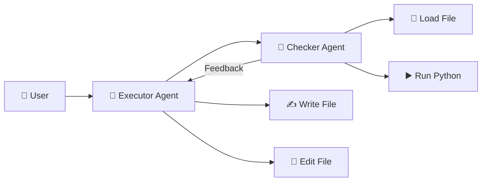
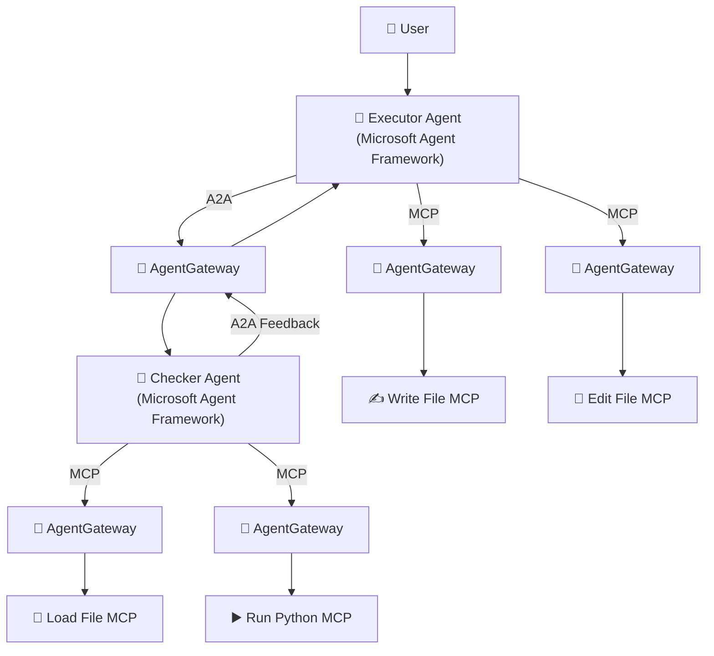
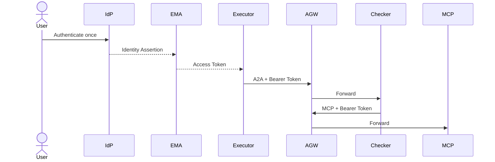
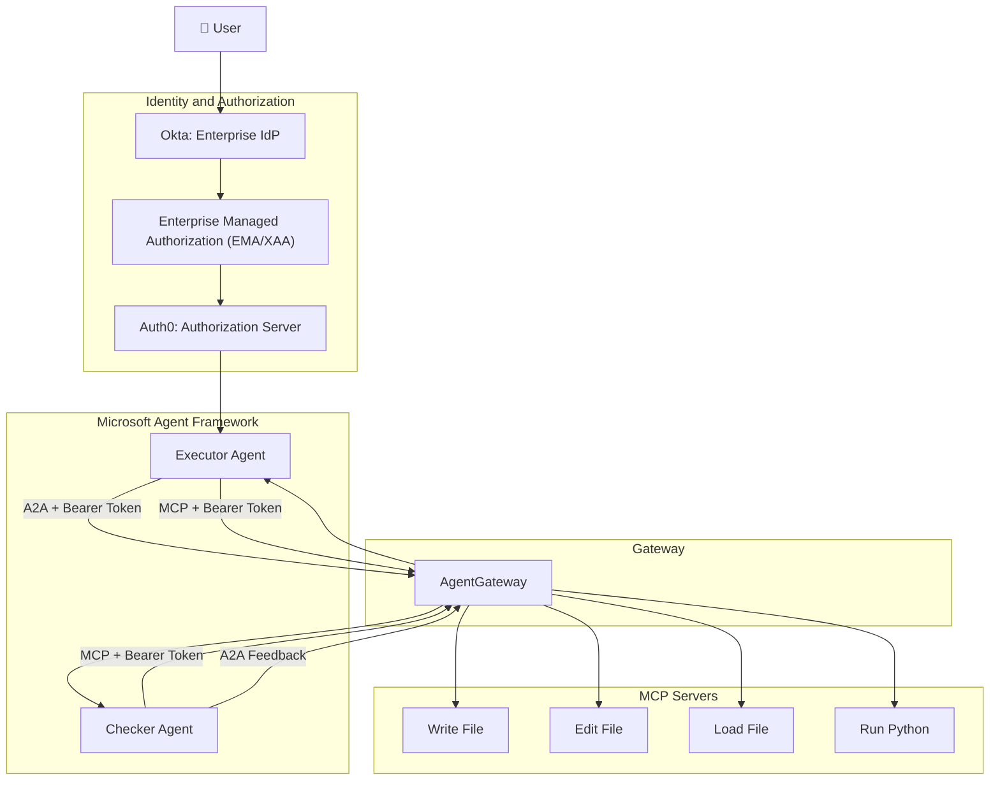
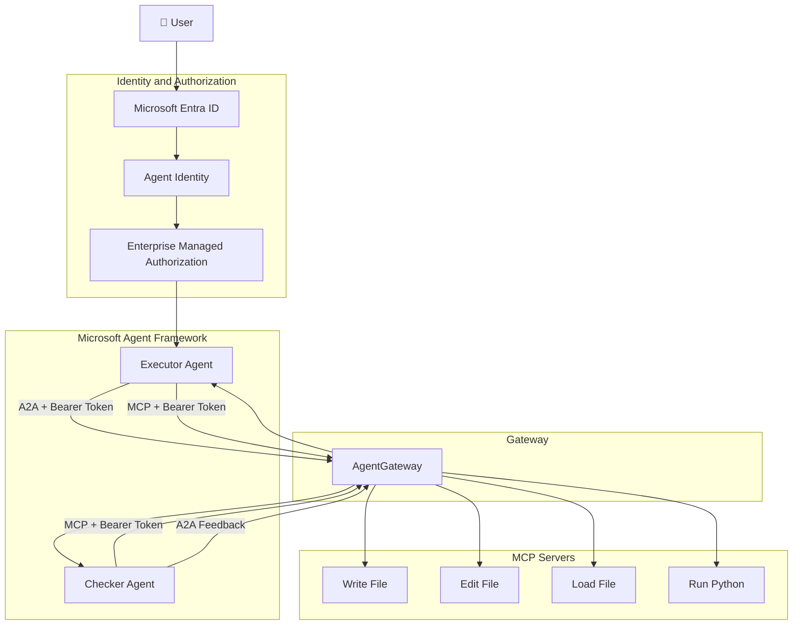
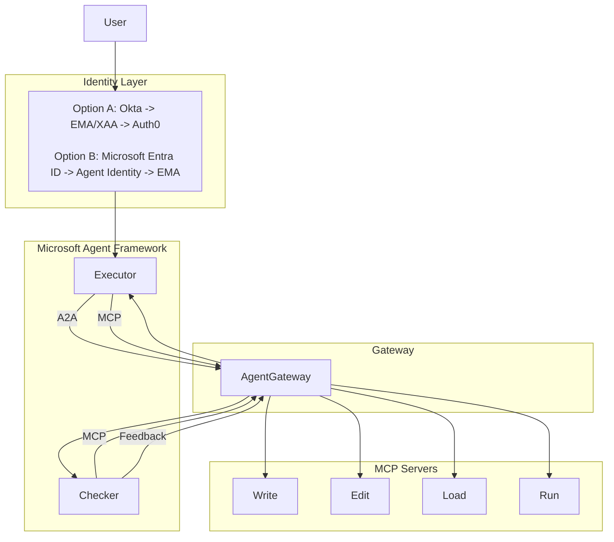
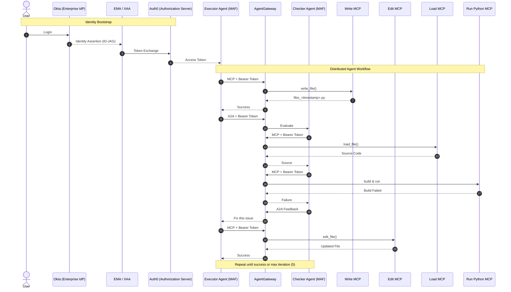
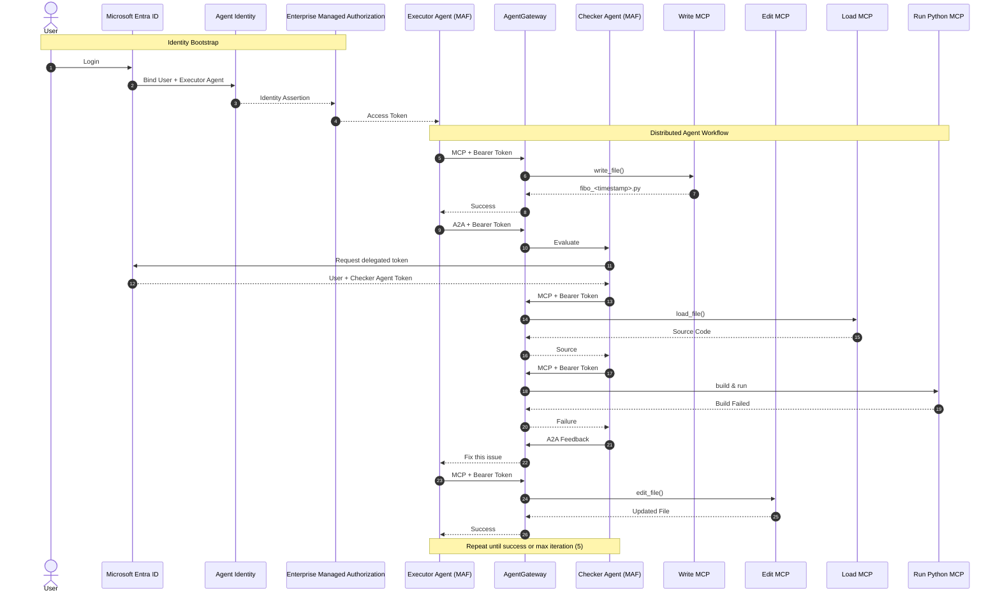

I think we've arrived at the right abstraction. The key is to stop thinking in terms of **products** (MAF, MCP, A2A, AgentGateway, Entra, Okta) and instead think in terms of **invariants**.

A convergent architecture is one where **adding a new agent or tool does not require inventing a new communication or security model**.

---

# Refenrences

# References

## 1. Microsoft Agent Framework (MAF)

### GitHub Repository
- https://github.com/microsoft/agent-framework

### Documentation
- https://learn.microsoft.com/agent-framework/

---

# 2. Agent-to-Agent (A2A)

## Specification
- https://a2aproject.github.io/A2A/

## GitHub
- https://github.com/a2aproject/A2A

---

# 3. Model Context Protocol (MCP)

## Official Specification
- https://modelcontextprotocol.io/

## Specification
- https://spec.modelcontextprotocol.io/

## GitHub
- https://github.com/modelcontextprotocol

---

# 4. Enterprise Managed Authorization (EMA)

## Official Announcement
- https://blog.modelcontextprotocol.io/posts/enterprise-managed-auth/

## Official Specification
- https://modelcontextprotocol.io/extensions/auth/enterprise-managed-authorization

---

# 5. OAuth Identity Assertion Authorization Grant (ID-JAG)

## IETF Draft
- https://www.ietf.org/archive/id/draft-ietf-oauth-identity-assertion-authz-grant-04.html

## Datatracker
- https://datatracker.ietf.org/doc/html/draft-ietf-oauth-identity-assertion-authz-grant

---

# 6. OAuth 2.0 Token Exchange

## RFC 8693
- https://www.rfc-editor.org/rfc/rfc8693

---

# 7. JWT Bearer Authorization Grant

## RFC 7523
- https://www.rfc-editor.org/rfc/rfc7523

---

# 8. OAuth 2.0 Authorization Framework

## RFC 6749
- https://www.rfc-editor.org/rfc/rfc6749

---

# 9. OAuth 2.0 Bearer Token Usage

## RFC 6750
- https://www.rfc-editor.org/rfc/rfc6750

---

# 10. OpenID Connect Core

## Specification
- https://openid.net/specs/openid-connect-core-1_0.html

---

# 11. AgentGateway

## GitHub Repository
- https://github.com/agentgateway/agentgateway

## Documentation
- https://agentgateway.dev/

---

# 12. AgentGateway Cross-App Access Example (Okta + Auth0)

## Example Configuration
- https://github.com/agentgateway/agentgateway/blob/main/examples/traffic-cross-app-access/okta-auth0/gateway.yaml

---

# 13. Microsoft Entra Agent ID

## Christian Posta Blog Series
- https://blog.christianposta.com/entra-agent-id-agw/

---

# 14. Microsoft Identity Platform

## Microsoft Identity Platform
- https://learn.microsoft.com/entra/identity-platform/

## OAuth On-Behalf-Of Flow
- https://learn.microsoft.com/entra/identity-platform/v2-oauth2-on-behalf-of-flow

---

# 15. Microsoft Entra Workload Identity

## Documentation
- https://learn.microsoft.com/entra/workload-id/

---

# 16. Microsoft Entra Conditional Access

## Documentation
- https://learn.microsoft.com/entra/identity/conditional-access/

---

# 17. Microsoft Authentication Library (MSAL)

## Documentation
- https://learn.microsoft.com/entra/msal/

---

# 18. OAuth 2.1 Draft

## IETF Draft
- https://datatracker.ietf.org/doc/draft-ietf-oauth-v2-1/

---

# 19. JSON Web Token (JWT)

## RFC 7519
- https://www.rfc-editor.org/rfc/rfc7519

---

# 20. JSON Web Signature (JWS)

## RFC 7515
- https://www.rfc-editor.org/rfc/rfc7515

---

# 21. JSON Web Key (JWK)

## RFC 7517
- https://www.rfc-editor.org/rfc/rfc7517

---

# 22. OAuth 2.0 Dynamic Client Registration

## RFC 7591
- https://www.rfc-editor.org/rfc/rfc7591

---

# 23. OAuth 2.0 Authorization Server Metadata

## RFC 8414
- https://www.rfc-editor.org/rfc/rfc8414

---

# 24. OpenID Connect Discovery

## Specification
- https://openid.net/specs/openid-connect-discovery-1_0.html

---

## Problem Statement

The system accepts a user's request to generate a Python program and uses two collaborating AI agents to iteratively produce a correct, executable solution.

### Executor Agent

The **Executor Agent** is responsible for producing and refining the Python code.

Responsibilities:

* Receive the user's programming request (e.g., *"Write a Fibonacci program"*).
* Generate the initial Python implementation.
* Persist the source code by calling the **Write File MCP** tool.
* If the file already exists within the same execution session, update it using the **Edit File MCP** tool instead of creating a new file.
* Delegate validation to the **Checker Agent** using the **A2A protocol**.
* Receive feedback from the Checker Agent and iteratively improve the code.
* Stop when either:

  * the Checker Agent reports success, or
  * the maximum number of iterations (e.g., five) is reached.

The generated file is stored in:

```text
outputs/fibo_<timestamp>.py
```

---

### Checker Agent

The **Checker Agent** is responsible for verifying that the generated program is correct and executable.

Responsibilities:

* Receive a validation request from the Executor Agent through **A2A**.
* Load the generated source code using the **Load File MCP** tool.
* Build and execute the program using the **Run Python MCP** tool.
* Validate:

  * syntax
  * build success
  * runtime execution
  * expected output (if applicable)
* If validation succeeds, return a success result.
* If validation fails, generate structured feedback and return it to the Executor Agent via **A2A**.
* Continue participating in the feedback loop until the program succeeds or the maximum iteration count is reached.

---

## End-to-End Workflow

```text
User
  │
  ▼
Executor Agent
  │
  ├── Write File MCP
  │
  └── A2A
        │
        ▼
   Checker Agent
        │
        ├── Load File MCP
        ├── Run Python MCP
        │
        └── Validation Result
                │
         Success ─────────────► Finish
                │
              Failure
                │
                ▼
         Feedback (A2A)
                │
                ▼
        Executor Agent
                │
        Edit File MCP
                │
           Retry (≤ 5 iterations)
```

---

## Security and Communication Model

Every distributed interaction follows the same architecture:

* **Microsoft Agent Framework (MAF)** orchestrates the Executor and Checker agents.
* **A2A** is used for all inter-agent communication.
* **MCP** is used for all tool invocations (Write, Edit, Load, Run).
* **Enterprise Managed Authorization (EMA/XAA)** acquires and propagates OAuth access tokens for protected resources.
* **AgentGateway** enforces authentication, authorization, routing, rate limiting, auditing, and observability at every network boundary.
* The identity provider can be implemented using either:

  * **Okta + Auth0** (OAuth Identity Assertion and Cross-App Access), or
  * **Microsoft Entra ID + Agent Identity**, where delegated agent identities are propagated across A2A and MCP interactions.

The business workflow remains identical regardless of the identity provider. Only the mechanism for issuing and exchanging access tokens changes; all A2A and MCP requests continue to propagate the resulting bearer token through AgentGateway to the target agent or MCP server.

---

# First Principle

Your system has exactly **one computation**.

> Transform a user request into a correct Python program.

Everything else exists to support that computation.

```text
User Intent
      │
      ▼
Distributed Computation
      │
      ▼
Correct Python Program
```

The Executor, Checker, MCP servers, and AgentGateway are all implementation details.

---

# Layer 1 — Business Computation

This layer answers only one question:

> **How do we solve the problem?**



Notice:

There is

* no OAuth
* no JWT
* no AgentGateway

Only business logic.

This is the pure computation graph.

---

# Layer 2 — Communication

Business logic cannot directly invoke remote workloads.

It needs protocols.

There are only two.

```text
Agent
      │
      ▼
Agent

A2A


Agent
      │
      ▼
Tool

MCP
```

Nothing else.

Every communication becomes one of these two protocols.

---

# Layer 3 — Identity

Now ask

> Can the receiver trust the caller?

Neither A2A nor MCP answers this.

Identity is orthogonal.

EMA provides the answer.

```text
Need Resource

↓

EMA

↓

Bearer Token
```

This happens **before** the request.

EMA's responsibility ends when it returns a token.

---

# Layer 4 — Enforcement

Now the request is sent.

Every network boundary is identical.

```text
Caller

↓

AgentGateway

↓

Target
```

Always.

Whether the target is

* another MAF agent
* an MCP server
* a REST API

doesn't matter.

AgentGateway enforces

* JWT validation
* authorization
* routing
* rate limiting
* observability
* auditing

This is the only place those concerns exist.

---

# Layer 5 — Identity Provider

Finally,

Where did the token come from?

There are two interchangeable implementations.

## Option A

```text
Okta

↓

Identity Assertion

↓

Auth0

↓

Access Token
```

Cross-domain identity federation (EMA/XAA).

---

## Option B

```text
Microsoft Entra ID

↓

Agent Identity

↓

Delegated Token

↓

Access Token
```

Unified identity with agent-aware delegation.

Everything above this layer remains unchanged.

---

# The Complete Architecture

This is the convergent architecture.



Notice the symmetry.

Every network edge is

```
Caller
     │
AgentGateway
     │
Target
```

There are no exceptions.

---

# Identity Flow

Now overlay identity.



Notice something important.

The token is

* acquired once
* propagated
* validated repeatedly

It is **not recreated** at every hop unless required by the authorization model.

---

# Identity Provider Variants

The entire architecture above is identical.

Only the token acquisition changes.

## Option 1

```text
User

↓

Okta

↓

Identity Assertion

↓

Auth0

↓

EMA Token
```

---

## Option 2

```text
User

↓

Microsoft Entra ID

↓

Agent Identity

↓

EMA Token
```

Everything else stays exactly the same.

---

# The Responsibility Matrix

| Layer                          | Responsibility                      | Technology                                      |
| ------------------------------ | ----------------------------------- | ----------------------------------------------- |
| Business                       | Solve the problem                   | Microsoft Agent Framework                       |
| Agent Communication            | Agent ↔ Agent                       | A2A                                             |
| Tool Communication             | Agent ↔ Tool                        | MCP                                             |
| Authentication & Authorization | Acquire access token                | EMA / XAA                                       |
| Policy Enforcement             | Validate, authorize, observe, route | AgentGateway                                    |
| Identity                       | Issue identities                    | Okta + Auth0 or Microsoft Entra ID (+ Agent ID) |

Notice there is exactly one owner for every concern.

No overlaps.

No ambiguity.

---

# Why this architecture is convergent

Suppose tomorrow you add

* Planner Agent
* Reviewer Agent
* Security Agent
* Git MCP
* Docker MCP
* Azure MCP
* Kubernetes MCP
* Bash MCP

Nothing changes.

Every new component follows the same invariant:

```text
Need Resource

↓

Acquire Token (EMA)

↓

Send Request

↓

AgentGateway

↓

Target

↓

Response
```

No component implements its own authentication.

No component validates JWTs.

No component performs authorization.

No component implements rate limiting.

No component performs auditing.

Every responsibility remains in exactly one place.

---

# Final First-Principles Model

Everything you've built reduces to six orthogonal layers:

```text
┌──────────────────────────────────────────────────────────────┐
│ User Intent                                                  │
└──────────────────────────────────────────────────────────────┘
                              │
                              ▼
┌──────────────────────────────────────────────────────────────┐
│ Microsoft Agent Framework                                    │
│ • Executor Agent                                              │
│ • Checker Agent                                               │
│ • Workflow / Loop (max 5 iterations)                         │
└──────────────────────────────────────────────────────────────┘
                              │
                ┌─────────────┴─────────────┐
                ▼                           ▼
        A2A (Agent ↔ Agent)         MCP (Agent ↔ Tool)
                │                           │
                └─────────────┬─────────────┘
                              ▼
┌──────────────────────────────────────────────────────────────┐
│ Enterprise Managed Authorization (EMA/XAA)                  │
│ • Acquire appropriate OAuth access token                    │
│ • Propagate token across A2A and MCP calls                  │
└──────────────────────────────────────────────────────────────┘
                              │
                              ▼
┌──────────────────────────────────────────────────────────────┐
│ AgentGateway                                                 │
│ • JWT validation                                             │
│ • Authorization                                               │
│ • Routing                                                     │
│ • Rate limiting                                               │
│ • Observability & Audit                                      │
└──────────────────────────────────────────────────────────────┘
                              │
                              ▼
┌──────────────────────────────────────────────────────────────┐
│ Identity Provider                                             │
│ • Okta + Auth0 (Cross-App Access / federation)               │
│                 OR                                             │
│ • Microsoft Entra ID (+ Agent ID)                            │
└──────────────────────────────────────────────────────────────┘
```

This architecture is convergent because every new capability—whether an agent, an MCP tool, or another distributed service—reuses the same computation model (MAF), the same communication protocols (A2A and MCP), the same authorization mechanism (EMA), the same enforcement point (AgentGateway), and one interchangeable identity backend (Okta + Auth0 or Microsoft Entra ID + Agent ID). No new capability requires inventing another security or communication pattern.

---

I agree. The previous diagram stopped at the **Identity Provider**, but the architectural difference between **Okta + Auth0 (XAA)** and **Microsoft Entra ID (+ Agent ID)** is exactly what readers want to compare.

The cleanest way is to **keep 95% of the architecture identical** and isolate the identity layer. That makes the convergence obvious.

# Option A — Okta + Auth0 + EMA/XAA



Notice the identity chain:

```text
User

↓

Okta

↓

EMA/XAA

↓

Auth0

↓

Bearer Token

↓

Everything
```

The **Auth0 access token** is propagated through **A2A** and **MCP**.

---

# Option B — Microsoft Entra ID + Agent ID + EMA

Exactly the same architecture.

Only the identity implementation changes.



The identity chain becomes

```text
User

↓

Microsoft Entra ID

↓

Agent Identity

↓

EMA

↓

Bearer Token

↓

Everything
```

---

# The best "convergent" architecture

After all the research, I think this is actually the best diagram because it shows that **only one box changes**. Everything below EMA is identical.



## Why this is the most convergent model

From first principles, the system has six orthogonal layers:

| Layer                   | Responsibility                                                | Implementation (Both Approaches)                                                                                                           |
| ----------------------- | ------------------------------------------------------------- | ------------------------------------------------------------------------------------------------------------------------------------------ |
| **Business Logic**      | Generate and validate Python code                             | Microsoft Agent Framework (Executor & Checker)                                                                                             |
| **Agent Communication** | Agent ↔ Agent                                                 | A2A                                                                                                                                        |
| **Tool Communication**  | Agent ↔ Tool                                                  | MCP                                                                                                                                        |
| **Authorization**       | Acquire and propagate access tokens                           | EMA (backed by XAA for Okta + Auth0, or by Microsoft Entra ID)                                                                             |
| **Policy Enforcement**  | Validate tokens, authorize, route, rate limit, audit, observe | AgentGateway                                                                                                                               |
| **Identity Provider**   | Authenticate users and represent principals                   | **Option A:** Okta + Auth0 (federated Cross-App Access) **Option B:** Microsoft Entra ID + Agent Identity (agent-aware delegated identity) |

This illustrates the architectural convergence clearly: **A2A, MCP, Microsoft Agent Framework, and AgentGateway remain completely unchanged**. Swapping from **Okta + Auth0** to **Microsoft Entra ID + Agent Identity** only changes the implementation of the **identity provider layer**. The rest of the distributed agent system is unaffected, which is exactly what a convergent architecture should achieve.

---

Yes. A **sequence diagram** is actually the best way to explain the runtime because it shows **when** each technology participates. The flow also makes it obvious that **MAF, A2A, MCP, EMA, and AgentGateway are orthogonal concerns**.

I would use **exactly two sequence diagrams** with identical actors so readers can immediately spot the only architectural differences.

---

# Approach 1 — Okta + Auth0 + EMA/XAA



---

# Approach 2 — Microsoft Entra ID + Agent Identity + EMA

Exactly the same workflow.

Only the identity bootstrap changes.



---

# What these diagrams reveal (First Principles)

If you ignore the technology names, both systems are **95% identical**.

```
User
    │
Authenticate
    │
Acquire Token
    │
Executor Agent
    │
───────────────
A2A
───────────────
Checker Agent
    │
───────────────
MCP
───────────────
Tools
```

The only place where the implementations differ is the **Identity Bootstrap**.

## Okta + Auth0

```
User
   │
   ▼
Okta
   │
Identity Assertion (ID-JAG)
   │
   ▼
EMA/XAA
   │
Token Exchange
   │
   ▼
Auth0 Access Token
```

This aligns closely with the **OAuth Identity Assertion Authorization Grant (ID-JAG)** draft and Cross-App Access, where identity is asserted by one trusted provider and exchanged for a resource-specific access token.

## Microsoft Entra ID

```
User
   │
   ▼
Microsoft Entra ID
   │
Bind User + Agent Identity
   │
   ▼
EMA
   │
Access Token
```

Here, the emphasis is on binding the user and the executing agent into the issued identity before authorization. During A2A, a delegated token can be obtained for the receiving agent while preserving the user context.

---

## A small refinement

One subtle point from the first-principles analysis: in the **Microsoft Entra ID** flow, it is more accurate to show **Agent Identity** participating in the issuance of the initial and delegated tokens rather than showing **EMA** as a separate token issuer. EMA is the authorization pattern (or protocol extension) governing how authorization is managed across MCP servers; the actual tokens are still issued by the underlying identity and authorization infrastructure. Likewise, in the **Okta + Auth0** flow, EMA/XAA leverages identity assertions and token exchange rather than issuing tokens independently.

With that refinement, these sequence diagrams faithfully separate responsibilities:

* **Microsoft Agent Framework** orchestrates the workflow.
* **A2A** transports agent-to-agent requests.
* **MCP** transports agent-to-tool requests.
* **EMA/XAA** defines how authorization is obtained and propagated.
* **AgentGateway** enforces policy at every network boundary.
* **Okta + Auth0** or **Microsoft Entra ID (+ Agent Identity)** provide the underlying identities and tokens used throughout the workflow.

