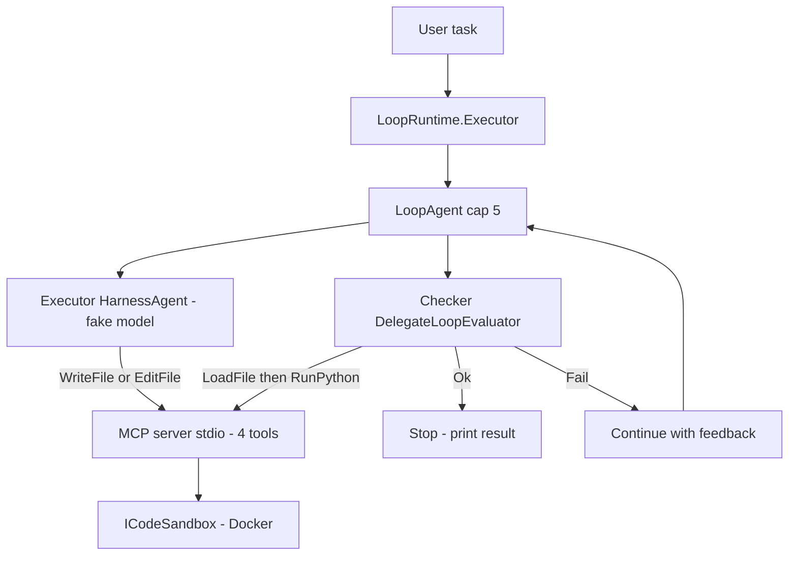
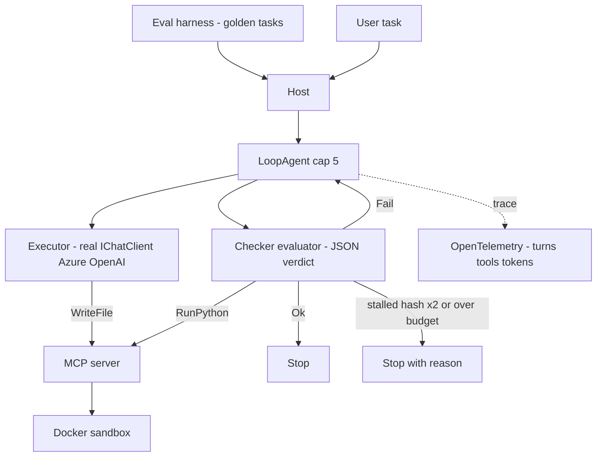
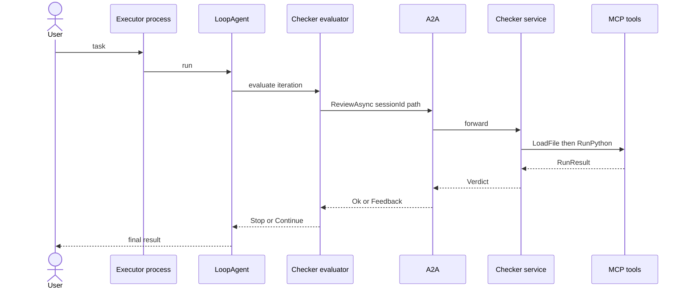
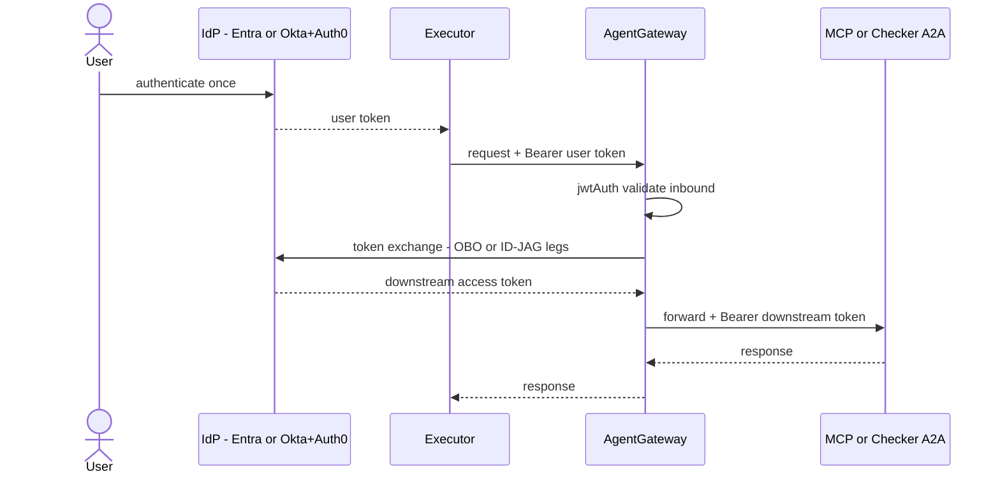

# Loop-Runtime Milestone Plan

Caveman mode. C#/.NET 10. Executor+Checker code-gen loop.

## Implementation Status

- [x] Package infra: `Directory.Packages.props` + `Directory.Build.props` + `NuGet.Config` — version locked.
- [x] Phase 1 code complete:
  - `LoopRuntime.Agents`: `ExecutorAgent` (uses real MAF `LoopAgent` + `DelegateLoopEvaluator`), `CheckerAgent`, `FakeChatClient` (implements `IChatClient`).
  - `LoopRuntime.Mcp`: proper MCP stdio server via `ModelContextProtocol 1.2.0` + 4 `[McpServerTool]` classes.
  - `LoopRuntime.Executor`: wired to `ExecutorAgent`; `/run` endpoint.
  - `LoopRuntime.ServiceDefaults`: OTel tracing + metrics via `OpenTelemetry.Extensions.Hosting`.
- [x] Phase 2 scaffold: stall detection (same-code hash) in `ExecutorAgent`; eval runner in `LoopRuntime.Evals`.
- [x] Phase 3 scaffold: `CheckerA2AEndpoint` in `LoopRuntime.Checker`; A2A.AspNetCore package added.
- [x] Phase 4 scaffold: AgentGateway container in `AppHost` + `gateway.yaml` (Okta+Auth0 XAA skeleton).
- [x] Tests: `LoopOrchestratorTests` + `CheckerAgentTests` + `DockerSandboxTests` (docker-gated).
- [x] All projects in `LoopRuntime.slnx`.

**Deviation from plan-pinned "Harness" version**: Plan pins `Microsoft.Agents.AI.Harness 1.13.0-preview.260703.1`; that preview ID does not exist on public nuget.org. `LoopAgent`/`DelegateLoopEvaluator`/`IChatClient.AsAIAgent()` confirmed in `Microsoft.Agents.AI 1.13.0` (public). Using stable 1.13.0.

Rule: each phase ship runnable thing. Verify before next. No phase depend on unbuilt phase.

---

## Pinned Versions

Source: MAF `Directory.Packages.props` @ commit `7ca73c0`.

| Thing | Version | Phase |
|---|---|---|
| .NET | 10 | 1 |
| MAF (.NET) | 1.13.0 | 1 |
| ModelContextProtocol (MCP SDK) | 1.2.0 | 1 |
| A2A + A2A.AspNetCore | 1.0.0-preview2 | 3 |
| Microsoft.Extensions.AI | 10.6.0 | 1 |
| Microsoft.Agents.AI.Harness (LoopAgent + HarnessAgent) | 1.13.0-preview.260703.1 | 1 |
| Aspire.Hosting + Aspire.AppHost.Sdk | 13.4.6 | 1 |
| Microsoft.Agents.AI.Hyperlight (optional future sandbox impl) | 1.13.0-preview.260703.1 | Later |
| hyperlight-wasm Python guest (optional, needed only for Hyperlight) | matching | Later |
| agentgateway | v1.4.0-alpha.1 | 4 |

Note: MCP/A2A versions = what MAF 1.13.0 pins. Don't bump independent → MAF break risk. All pre-release (A2A preview2, gateway alpha, optional Hyperlight preview) → API churn expect, re-verify before P3/P4.

---

## Assumptions (surface first — karpathy #1)

- **Sandbox strategy = Docker first on Mac** behind `ICodeSandbox`. Ship Docker now, add more impls later with no loop rewrite.
- `ICodeSandbox` is extension point for future sandbox backends (Hyperlight Linux/KVM, remote sandbox, others).
- Docker Desktop available local (required for P1/P2).
- Model provider = Azure OpenAI (swap later via `IChatClient`). If wrong, tell me.
- Python target lang for generated code (per reqs).
- Single dev machine, no cloud IdP day-1.
- **MAF orchestrates** (business layer, per reqs). Versions = Pinned Versions table above. MCP/A2A locked to MAF-compatible.
- **Loop = native MAF `LoopAgent`** (Harness pkg), not hand-rolled. Cap via `LoopAgentOptions.MaxIterations = 5`.
- **Checker = `LoopEvaluator`**, not peer agent in P1. `DelegateLoopEvaluator` runs code via sandbox → `LoopEvaluation.Stop()` on pass / `.Continue(feedback)` on fail. Feedback injected as next input.
- Executor = `HarnessAgent` (`.AsHarnessAgent`) → free context compaction + history persist (subsumes P2 context guard).
- Harness = preview channel → experimental API pragmas (`MAAI001`, `OPENAI001`). Churn expect.
- "Session" = one user request run, own id + own output dir.

If any wrong → say before phase-1.

---

## Solution Layout (build skeleton first)

One `.slnx`, projects:
```
LoopRuntime.Contracts         // records: Verdict, Feedback, RunResult, ICodeSandbox, IChecker
LoopRuntime.Sandbox           // DockerSandbox (P1), HyperlightSandbox (later phase)
LoopRuntime.ServiceDefaults   // Aspire ServiceDefaults — OTel + health checks, shared by all services
LoopRuntime.Mcp               // 1 MCP server, stdio, 4 tools; RunPython -> ICodeSandbox
LoopRuntime.Agents            // Executor (HarnessAgent), Checker, LoopAgent wiring, fake IChatClient
LoopRuntime.Executor          // console entrypoint: read task arg -> run LoopAgent -> print result
LoopRuntime.AppHost           // Aspire AppHost — orchestrates all services, containers, AgentGateway
LoopRuntime.Checker           // P3 only: A2A endpoint wrapping Checker
LoopRuntime.Tests             // deterministic (fake model + fake sandbox)
LoopRuntime.Evals             // P2 only: golden tasks, pass-rate
```
Dev entry: `aspire start` (not `dotnet run`). Aspire handles startup order, service discovery, OTel dashboard.
Config/secrets: `IConfiguration` + `dotnet user-secrets` (dev), env vars (CI). No keys in code.

---

## Checker Pass Rule (define success — else loop can't stop)

`Verdict.Ok = build/import ok AND exitCode == 0 AND (no expected output OR stdout matches expected)`.
- P1 fibonacci: no expected output → Ok = ran, exit 0, no stderr.
- Fail → `Feedback.Reason` = first error line, `Fixes` = hints. Feed to `Continue`.

---

## Phase 1 — Walking Skeleton

Goal: MAF drive loop end-to-end. Fake model. No auth. No gateway. No network split.



Build:
- **MAF orchestrates.** Executor = `HarnessAgent`. Loop = native `LoopAgent` decorator (Harness pkg), cap 5 via `LoopAgentOptions.MaxIterations`. No hand-rolled loop.
- **Checker = `DelegateLoopEvaluator`.** Reads path from session (see plumbing note), loads file, runs Python via `RunPython` (→ `ICodeSandbox`), returns `Stop()` on pass / `Continue(feedback)` on fail.
- **Path plumbing:** Executor's response/session carries `sessionId` + written path. Evaluator reads it from `ctx.Session` (NOT a local var) — `LoopAgent` only passes text between turns.
- **Fake `IChatClient` scripts tool calls,** not just text: turn1 = function-call `WriteFile(fibo code)`, then final message. Text-only fake never writes a file. Deterministic sequence.
- **One execution path:** `RunPython` MCP tool delegates to `ICodeSandbox`. Do NOT also use CodeAct provider — Checker owns execution.
- In-proc, no A2A yet.
- One MCP server, stdio, 4 tools. Agents call tools via MAF MCP client.
- Sandbox behind `ICodeSandbox`. P1 = **Docker impl** (real, Mac + Linux). Hyperlight = later phase (not P2). Both: no net, cpu/mem/wall limit, scratch dir only.
- **Aspire AppHost** wires `Host` + `Mcp` projects. `aspire start` = only dev run command. Aspire injects config/endpoints; no hardcoded ports.

Contracts:
```csharp
// MCP tools (one server, stdio)
WriteFile(string sessionId, string name, string content) -> string path
EditFile(string sessionId, string path, string content) -> string path
LoadFile(string path) -> string content
RunPython(string path) -> RunResult(int exitCode, string stdout, string stderr, bool timedOut)

// agents + loop (native MAF Harness)
// Executor = CreateChatClient().AsHarnessAgent(...)  -> inner AIAgent
// loop     = new LoopAgent(executor, checkerEvaluator, new LoopAgentOptions { MaxIterations = 5 })
interface IChecker { Task<Verdict> ReviewAsync(string sessionId, string path, CancellationToken ct); }
// checkerEvaluator = new DelegateLoopEvaluator(async (ctx, ct) => {
//     var (sid, path) = ReadFromSession(ctx.Session);           // path rides in session, NOT a local
//     var v = await checker.ReviewAsync(sid, path, ct);         // loads + runs via ICodeSandbox
//     return v.Ok ? LoopEvaluation.Stop()
//                 : LoopEvaluation.Continue(v.Feedback!.ToString());
// });

record Verdict(bool Ok, Feedback? Feedback);          // Ok = build ok && exit 0 && output-match
record Feedback(string Reason, string[] Fixes);        // -> LoopEvaluation.Continue
record Draft(string SessionId, string Path);

// sandbox abstraction (RunPython MCP tool delegates here — single exec path)
interface ICodeSandbox { Task<RunResult> RunAsync(string code, CancellationToken ct); }
// impls now: DockerSandbox (P1, real)
// later: HyperlightSandbox (Linux/KVM) or other backends without contract change
```

Sandbox contract:
```
Docker (P1, primary — Mac + Linux):
  container: python:3-slim (pinned)
  --network=none  --memory=256m  --cpus=1  --pids-limit=64
  wall timeout 10s (kill)
  mount: scratch dir rw, nothing else
  non-root user

Hyperlight (future optional impl, Linux/KVM only):
  Microsoft.Agents.AI.Hyperlight, HyperlightExecuteCodeFunction
  needs HYPERLIGHT_PYTHON_GUEST_PATH — building the wasm guest is a Rust sub-project (days). Optional.
  hypervisor micro-VM isolation. Skip if Docker meets isolation bar.
```

Verify (karpathy #4):
- `aspire start` → all resources healthy on dashboard → run task "fibonacci" → file in `outputs/fibo_<ts>.py` → evaluator `Stop()` → exit.
- Inject bad canned code → `LoopAgent` re-invokes → hit `MaxIterations = 5` → stop clean, no hang.
- `RunPython` on `while True: pass` → timedOut=true, sandbox killed <15s.
- `RunPython` on net call → fails (no net).
- Same `ICodeSandbox` contract passes on Docker impl (Mac). Any new sandbox impl is later and non-gating.

Done when: 5 verifies green (Docker path).

---

## Phase 2 — Real Model + Evals + Trace

Goal: swap fake model for real. Know if it work.



Build:
- Real `IChatClient` (Azure OpenAI). Key from env/user-secrets, not code.
- Structured Checker out via JSON mode (`Verdict` schema enforced).
- Eval harness: N golden tasks, score pass/fail, separate from unit tests.
- **OTel = Aspire ServiceDefaults** (`builder.AddServiceDefaults()` in each service). Aspire dashboard shows traces, logs, metrics — no manual exporter setup.
- No-progress detect: same code hash 2x → evaluator `Stop`, reason="stalled".
- Context guard = HarnessAgent compaction (`MaxContextWindowTokens`). Already free from P1, just tune.
- Keep `ICodeSandbox` stable. Add extra sandbox impl only if Docker isolation is not enough. Do NOT block P2 on it.

Verify:
- Eval suite runs, prints pass rate. Baseline recorded.
- Trace shows every turn+tool for one run.
- Deterministic test uses fake model (phase-1) → still green (no regression).
- Repeat-code task → stall stop fires, not 5 wasted iters.
- Budget exceeded → stop with reason, not silent spend.

Done when: eval pass-rate baseline exist + trace visible + guards fire. (Extra sandbox parity = bonus, not gating.)

---

## Phase 3 — Split Over A2A

Goal: Executor + Checker separate processes. Business logic unchanged.



Build:
- Checker = own service (`LoopRuntime.Checker`). Agent card + A2A endpoint.
- `DelegateLoopEvaluator` now calls Checker over A2A instead of in-proc. `LoopAgent` mechanics unchanged — stays in Executor process.
- **Aspire AppHost** adds `AddProject<Projects.LoopRuntime_Checker>("checker")`. Executor gets checker URL via `WithReference(checker)` — no hardcoded address.
- Same `Verdict`/`Feedback` contract over wire.
- Timeout + retry on hop. Idempotent file writes (sessionId+name).

Verify:
- Two processes up. Same fibonacci task → same result as phase-1.
- Kill Checker mid-run → Executor timeout + clean error, no hang.
- In-proc test path still works (keep for fast tests).

Done when: cross-proc run == in-proc result + failure handled.

---

## Phase 4 — Harden (Gateway + Auth)

Goal: add security layers. App code stay dumb about them. Pick ONE IdP path (A or B).

**Priority now = 4A Okta + Auth0 XAA first.** 4B Entra support comes later.
4A needs Okta Cross App Access (Early Access) AND Auth0 XAA (**private Beta**). Confirm both gates open before 4A execution.



Build:
- AgentGateway in front of agents + MCP. Config only, no app change.
- **Aspire AppHost** adds AgentGateway as container resource with `gateway.yaml` bind-mount:
  ```csharp
  builder.AddContainer("agentgateway", "ghcr.io/agentgateway/agentgateway", "v1.4.0-alpha.1")
      .WithBindMount("./gateway.yaml", "/config/gateway.yaml")
      .WithHttpEndpoint(port: 3032, name: "http");
  ```
  Services reference the gateway endpoint via Aspire service discovery — no hardcoded `localhost:3032`.
- Gateway does JWT validate + token exchange + route + rate limit + audit.
- Bearer propagate through gateway to A2A + MCP backends.

---

### 4.0 AgentGateway base config

Binary: agentgateway `v1.4.0-alpha.1`+ (first release with Cross App Access). Alpha may have **no prebuilt binary → build from source** (Rust `cargo build --release`). Confirm toolchain before P4. Run:
```bash
agentgateway -f ./gateway.yaml --validate-only   # check first
agentgateway -f ./gateway.yaml                    # run
```

Config shape (`gateway.yaml`): `binds` → `listeners` → `routes` → `policies` + `backends`.
- `jwtAuth` policy = validate inbound token (issuer, audiences, jwks url).
- `backendAuth` policy = mint/attach downstream token (crossAppAccess for A; OBO/token-exchange for B).
- `backends` = your MCP servers / Checker A2A endpoint (`host:port`; HTTPS needs `backendTLS: {}`).
- Values from env vars, expanded at load. Export in same shell that runs gateway.
- Debug legs: `RUST_LOG=agentgateway=trace`.

Skeleton:
```yaml
# yaml-language-server: $schema=https://agentgateway.dev/schema/config
binds:
- port: 3032
  listeners:
  - protocol: HTTP
    routes:
    - policies:
        jwtAuth: { issuer: ..., audiences: [ ... ], jwks: { url: ... } }
        backendAuth: { ... }        # A now, B later
      backends:
      - host: mcp-run-python:8080   # or Checker A2A host:port
```

---

### 4A. Okta + Auth0 XAA (Cross App Access / ID-JAG)

Flow per call, no 2nd login: inbound **Okta ID token** → gateway → leg1 Okta token-exchange (RFC 8693) mints **ID-JAG** → leg2 Auth0 jwt-bearer (RFC 7523) mints **access token** → attach `Bearer` to backend.

Prereqs (feature gates): Okta Cross App Access = self-service **Early Access** (Admin Console → Settings → Features). Auth0 XAA = **private Beta** (contact Auth0 support).

Okta setup (Enterprise IdP):
1. Register requesting app (= the gateway). Fast path: App Catalog → **Agent0** placeholder → add. Copy Client ID/Secret → `OKTA_CLIENT_ID`/`OKTA_CLIENT_SECRET`. Note token-endpoint auth method (Post vs Basic) → must match config `clientAuth.method`.
2. Register resource app: App Catalog → **Todo0** placeholder (or real XAA resource app pointing at Auth0 issuer + client id).
3. Create managed connection: resource app → **Manage Connections** → **Add apps** → select requesting app (Agent0) → Save. Must show **Managed** (no managed conn = no ID-JAG).
4. Use **org** authz server: token = `https://<OKTA_DOMAIN>/oauth2/v1/token`, jwks = `https://<OKTA_DOMAIN>/oauth2/v1/keys` (not `/oauth2/<id>/...`).

Auth0 setup (Resource AS):
1. Create API → its **Identifier** = access-token audience. Recommend set as tenant **Default Audience**.
2. Create Application → **Regular Web App** (confidential, first-party). Enable **Cross App Access** toggle. Copy Client ID/Secret → `AUTH0_CLIENT_ID`/`AUTH0_CLIENT_SECRET`.
3. Trust Okta: create **Okta Workforce** enterprise connection → enter resource app id/secret + Okta Issuer URL → activate **"Cross App Access – Resource Application"** role → link under Applications tab → callback matches Okta redirect URI.
4. Token endpoint = `https://<AUTH0_DOMAIN>/oauth/token`.

Env + gateway `backendAuth`:
```yaml
backendAuth:
  crossAppAccess:
    identityProvider:                 # leg 1 (Okta org AS) → ID-JAG
      host: https://$OKTA_DOMAIN
      tokenEndpointPath: /oauth2/v1/token
      clientAuth: { clientId: $OKTA_CLIENT_ID, method: clientSecretPost, clientSecret: $OKTA_CLIENT_SECRET }
    resourceAuthorizationServer:      # leg 2 (Auth0) → access token
      host: https://$AUTH0_DOMAIN
      tokenEndpointPath: /oauth/token
      clientAuth: { clientId: $AUTH0_CLIENT_ID, method: clientSecretPost, clientSecret: $AUTH0_CLIENT_SECRET }
    audience: https://$AUTH0_DOMAIN/   # trailing slash REQUIRED (#1 leg-2 failure)
    scopes: [ $SCOPE ]
    resources: [ $AUTH0_API ]          # RFC 8707, binds ID-JAG to target API
    cache: { defaultTtl: 1h }
```
Gotchas: `audience` trailing slash; export vars in same shell; TLS — crossAppAccess endpoints use `https://host` (auto-TLS), route backend needs `host:443` + `backendTLS: {}`.

---

### 4B. Microsoft Entra ID (app + OBO delegation, later)

Flow: user signs in → gateway holds user's Entra access token (aud = gateway API) → OBO exchange at Entra token endpoint → downstream token (aud = MCP/A2A API) → attach `Bearer`.

App registrations (Entra admin center → App registrations):
1. **Client app** (or gateway front): register, add redirect URI. Standard auth-code sign-in gets the user token for the middle-tier API.
2. **Middle-tier API** (= gateway/agent): register. Expose an API → add scope (e.g. `access_as_user`). Add credential: client **secret** or **certificate** (cert preferred prod).
3. **Downstream API** (MCP/A2A resource): register + expose scope. Grant middle-tier the delegated permission to it. Pre-authorize or admin-consent to avoid prompts.
4. Consent: use `.default` combined consent (add client to middle-tier `knownClientApplications`), or admin consent. Don't mix `.default` with other delegated scopes → `AADSTS70011`.

OBO token request (what gateway does):
```
POST https://login.microsoftonline.com/<tenant>/oauth2/v2.0/token
grant_type=urn:ietf:params:oauth:grant-type:jwt-bearer
client_id=<middle-tier-app-id>
client_secret=<secret>              # OR client_assertion(+_type) for cert
assertion=<user-access-token-sent-to-gateway>   # aud MUST = middle-tier app
requested_token_use=on_behalf_of
scope=<downstream-api>/.default
```
Response = downstream access token → gateway attaches to MCP/A2A backend call.

Gateway `backendAuth` = OBO/token-exchange policy pointing at Entra token endpoint (same jwtAuth inbound validates the user token: issuer `https://login.microsoftonline.com/<tenant>/v2.0`, jwks from that issuer's discovery).

Agent identity: register the agent/workload as its own Entra identity (service principal) for workload-identity + Conditional Access policies. Prefer MSAL for token acquisition over hand-rolling HTTP. OBO = user principals only (delegated scopes); pure workload calls = client-credentials, not OBO.

---

Verify (Phase 4A now):
- Request no token → gateway 401.
- Valid Okta user token → full loop works, same result as P3.
- One acquire → token propagates all hops (trace proves; not re-minted per hop unless authz needs).
- Bad `audience`/scope → exchange rejected, error surfaced (not silent).
- Rate limit trips on flood.

Done when: unauth blocked + authed flow == phase-3 result + token exchange legs traced for 4A.

Verify (Phase 4B later):
- Same checks using Entra OBO path after 4A is stable.

---

## Karpathy Gate (apply every phase)

- Simplest thing that pass verify. Cut if 200 lines could be 50.
- No speculative abstraction. No config nobody asked.
- Every changed line trace to a requirement.
- No phase start until prev verifies green.
- Ambiguous → stop + ask, no silent guess.

## Non-Goals (scope fence)

- No multi-user, no persistence DB, no UI (unless asked).
- No both-IdP support. One only.
- No extra agents/tools beyond reqs (Planner/Git/Docker MCP = later, not now).
