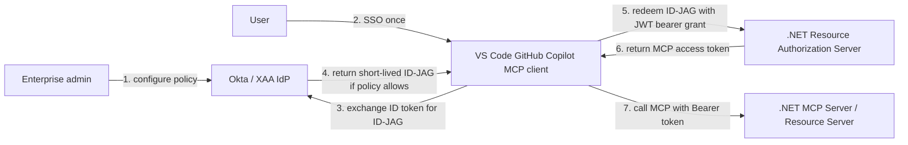
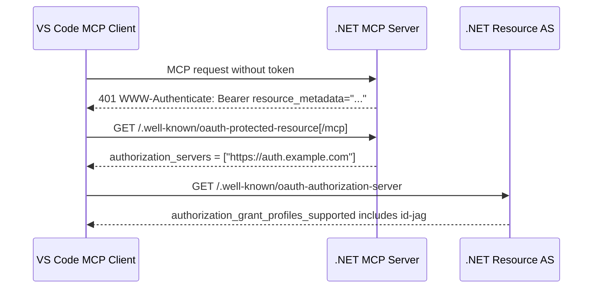
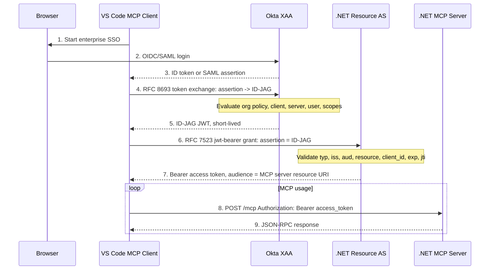
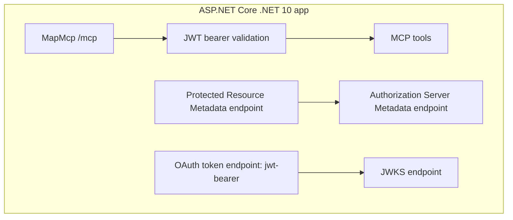
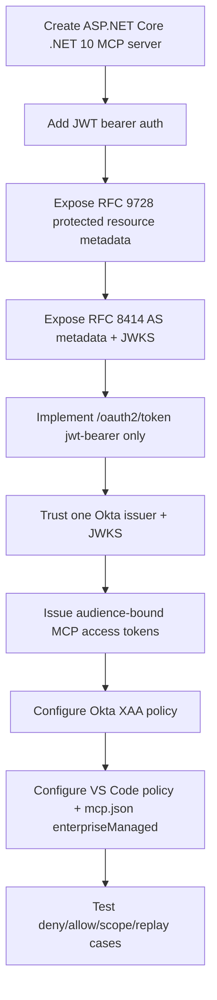
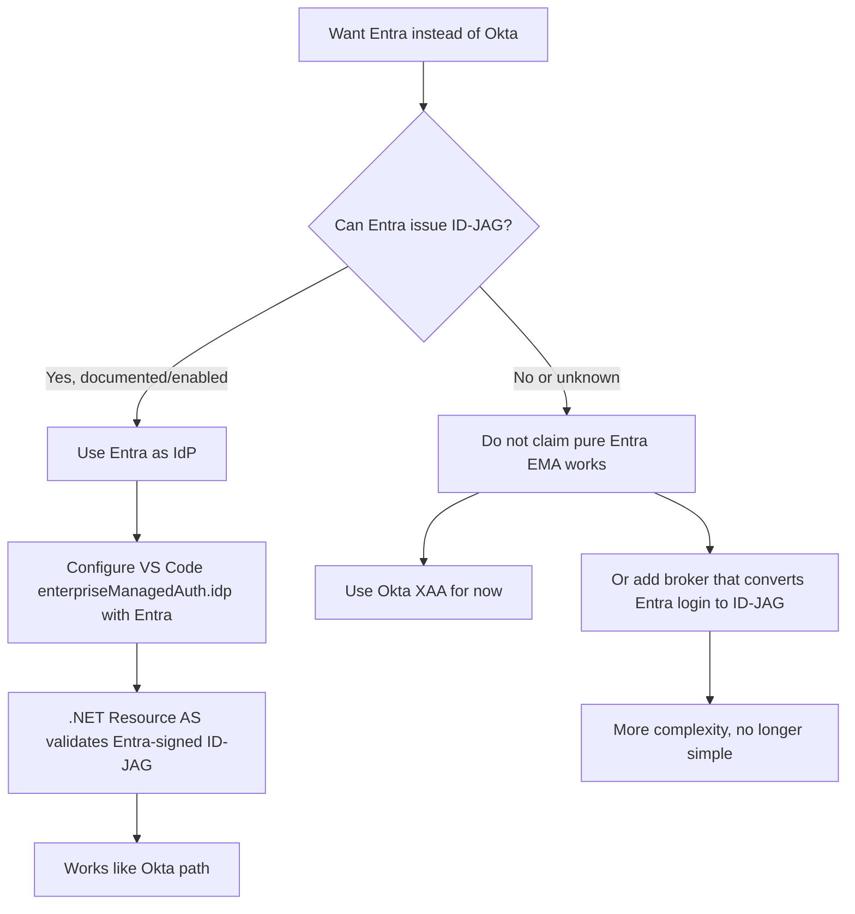
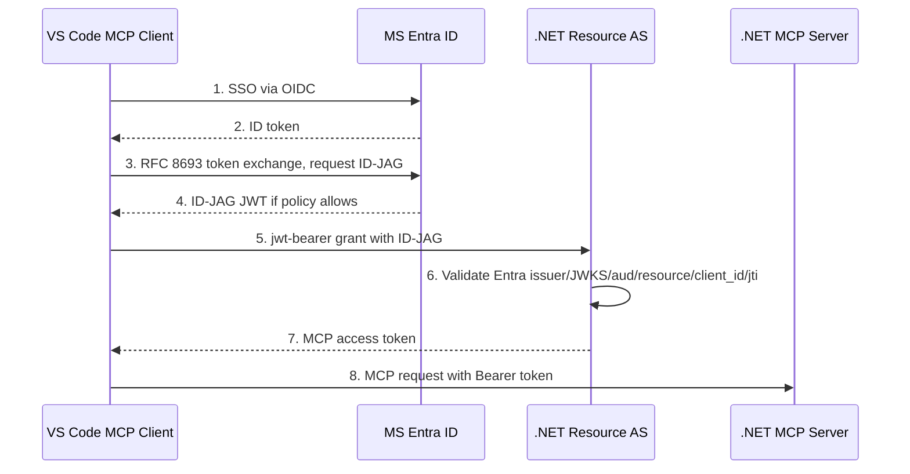

# Enterprise-Managed Authorization Research

Date: 2026-06-23

Mode: research only. No implementation.

## Sources

- MCP EMA blog: https://blog.modelcontextprotocol.io/posts/enterprise-managed-auth/
- Okta Cross App Access: https://www.okta.com/identity-101/cross-app-access-securing-ai-agent-and-app-to-app-connections/
- MCP auth extensions repo: https://github.com/modelcontextprotocol/ext-auth
- Stable EMA spec: https://github.com/modelcontextprotocol/ext-auth/blob/main/specification/stable/enterprise-managed-authorization.mdx
- MCP EMA docs: https://modelcontextprotocol.io/extensions/auth/enterprise-managed-authorization
- Independent EMA analysis: https://ehosseini.info/articles/mcp-enterprise-managed-authorization-ema/
- VS Code 1.123 enterprise-managed MCP auth preview: https://code.visualstudio.com/updates/v1_123#_enterprise-managed-mcp-authentication-preview
- XAA sample environment: https://xaa.dev/
- MCP authorization spec: https://modelcontextprotocol.io/specification/2025-06-18/basic/authorization
- C# MCP SDK: https://github.com/modelcontextprotocol/csharp-sdk
- C# MCP SDK transports: https://github.com/modelcontextprotocol/csharp-sdk/blob/main/docs/Transports.md
- ASP.NET Core JWT bearer auth: https://learn.microsoft.com/en-us/aspnet/core/security/authentication/configure-jwt-bearer-authentication
- Microsoft Entra ID: https://learn.microsoft.com/en-us/entra/identity/
- Microsoft identity platform authorization code flow: https://learn.microsoft.com/en-us/entra/identity-platform/v2-oauth2-auth-code-flow
- Microsoft identity platform OAuth 2.0 on-behalf-of flow: https://learn.microsoft.com/en-us/entra/identity-platform/v2-oauth2-on-behalf-of-flow
- Okta newsroom XAA partners announcement: https://www.okta.com/newsroom/press-releases/okta-announces-cross-app-access-partners/
- Okta developer blog (enterprise AI + XAA): https://developer.okta.com/blog/2025/06/23/enterprise-ai
- Okta developer blog (XAA implementation): https://developer.okta.com/blog/2025/09/03/cross-app-access
- Okta developer blog anchor (Create resource app Todo0): https://developer.okta.com/blog/2025/09/03/cross-app-access#create-the-resource-app-todo0
- Okta XAA MCP sample repo: https://github.com/oktadev/okta-cross-app-access-mcp
- Okta XAA MCP sample AWS Bedrock guide: https://github.com/oktadev/okta-cross-app-access-mcp/blob/main/guide/aws-bedrock.md
- Okta admin docs (Configure Cross App Access): https://help.okta.com/oie/en-us/content/topics/apps/apps-cross-app-access.htm
- Okta article (AI agent identity challenge): https://www.okta.com/newsroom/articles/understanding-the-ai-agent-identity-challenge/
- OAuth Identity and Authorization Chaining draft: https://datatracker.ietf.org/doc/draft-ietf-oauth-identity-chaining/
- OAuth Identity Assertion Authorization Grant draft: https://datatracker.ietf.org/doc/draft-ietf-oauth-identity-assertion-authz-grant/
- Identity Assertion Authorization Grant appendix reference: https://www.ietf.org/archive/id/draft-parecki-oauth-identity-assertion-authz-grant-04.html#appendix-A.3
- Auth0 XAA resource app docs: https://auth0.com/docs/xaa-resource-app

## Short Verdict

Requirement can work.

Confidence: **medium-high, 75%** for a simple .NET 10 MCP server + resource server + Resource Authorization Server using Okta XAA/EMA and VS Code as the MCP client path used by GitHub Copilot.

Why not higher: VS Code support is currently **Preview**, EMA depends on policy-managed VS Code settings, Okta XAA tenant capability, and server-side Resource Authorization Server implementation. .NET side is feasible, but not a config-only feature.

Stop condition: **not triggered**. No hard blocker found.

## Requirement Fit

| Requirement | Works? | Confidence | Notes |
|---|---:|---:|---|
| .NET 10 app as MCP Server | Yes | 90% | Official C# MCP SDK supports ASP.NET Core HTTP MCP servers. Use Streamable HTTP. |
| Same .NET app acts as OAuth Resource Server | Yes | 85% | ASP.NET Core can validate bearer tokens with issuer/audience/signature/expiry. MCP server must reject non-audience-bound tokens. |
| Expose Protected Resource Metadata endpoint | Yes | 85% | MCP core auth requires RFC 9728 metadata and `WWW-Authenticate` challenge. C# SDK has Protected Resource Metadata types/helpers. |
| Custom Resource Authorization Server in .NET | Yes, but main work | 65% | Must implement `jwt-bearer` grant that accepts ID-JAG, validates Okta-issued JWT, replay-protects `jti`, maps scopes, and issues MCP access token. |
| Okta as IdP | Yes | 80% | Okta is first/early IdP shipping Cross App Access / EMA support. Tenant/features/admin setup required. |
| VS Code GitHub Copilot as MCP client | Yes, preview | 70% | VS Code 1.123 adds enterprise-managed MCP auth preview. Needs policy-managed `mcp.enterpriseManagedAuth.idp` and per-server `oauth.enterpriseManaged: true`; then VS Code routes that server through the XAA provider instead of the normal per-server registration path. |
| Simple apps, no extra complexity | Mostly | 70% | App can stay simple if tool set is small and scopes coarse. Authorization server cannot be skipped. |

## What EMA Does

EMA moves “may this MCP client connect to this MCP server for this user?” into enterprise IdP policy.

Old MCP OAuth: each user authorizes each MCP server. Friction, weak central audit, hard offboarding.

EMA/XAA: user signs into enterprise IdP once. Client uses that identity assertion to get server-specific access tokens without per-server consent screens.

Key fact: EMA governs **connection + token issuance**, not every tool call.

## VS Code 1.123 Deep Read

The VS Code release note matches the core design, with a few precise wording points:

1. This feature is **Preview**.
2. VS Code frames it as **cross-app authorization (XAA)** for MCP.
3. VS Code says centralized IdPs can be **Entra, Okta, or Auth0** style providers.
4. VS Code signs in once against the enterprise IdP.
5. VS Code gets a **resource-scoped assertion using ID-JAG**.
6. VS Code redeems that assertion at the MCP server authorization server for an access token.
7. Goal: no per-server Dynamic Client Registration path for enterprise-managed servers.
8. Admin setup uses policy-managed `mcp.enterpriseManagedAuth.idp`.
9. Policy delivery is Windows Group Policy, macOS managed preferences, or Linux `/etc/vscode/policy.json`; it does not sync.
10. Server opt-in is per `mcp.json` entry with `"enterpriseManaged": true` inside `oauth`.
11. When that flag is present, VS Code routes the server through the XAA provider instead of standard per-server registration.
12. VS Code warns ID-JAG is emerging and not widely adopted; `xaa.dev` is the suggested sample environment.

Mismatch fixed: earlier wording sounded like Okta was the only VS Code-shaped IdP path. Better wording: Okta is explicitly first supported in the MCP launch blog; VS Code itself names Entra, Okta, and Auth0 as centralized IdP examples, while ID-JAG adoption remains the real compatibility gate.



## Exact Protocol Shape

Roles:

| EMA role | In this app |
|---|---|
| MCP Client | VS Code GitHub Copilot MCP client |
| Resource Server | .NET MCP HTTP server |
| Resource Authorization Server | .NET OAuth token issuer for MCP server |
| IdP Authorization Server | Okta XAA / enterprise IdP |

Discovery:



EMA token flow:



## Required Endpoints

Simple .NET deployment can be one ASP.NET Core app, but two logical roles:

```text
https://mcp.example.com/mcp
  MCP Streamable HTTP endpoint
  Requires Bearer access token

https://mcp.example.com/.well-known/oauth-protected-resource/mcp
  RFC 9728 Protected Resource Metadata
  Returns resource + authorization_servers

https://mcp.example.com/.well-known/oauth-authorization-server
  RFC 8414 Authorization Server Metadata
  Must advertise ID-JAG grant profile

https://mcp.example.com/oauth2/token
  OAuth token endpoint
  Accepts jwt-bearer grant with ID-JAG assertion

https://mcp.example.com/.well-known/jwks.json
  Public keys for access tokens issued by Resource AS
```

Resource metadata sketch:

```json
{
  "resource": "https://mcp.example.com/mcp",
  "authorization_servers": ["https://mcp.example.com"],
  "bearer_methods_supported": ["header"],
  "resource_name": "Todo App MCP"
}
```

Authorization server metadata sketch:

```json
{
  "issuer": "https://mcp.example.com",
  "token_endpoint": "https://mcp.example.com/oauth2/token",
  "jwks_uri": "https://mcp.example.com/.well-known/jwks.json",
  "grant_types_supported": ["urn:ietf:params:oauth:grant-type:jwt-bearer"],
  "authorization_grant_profiles_supported": [
    "urn:ietf:params:oauth:grant-profile:id-jag"
  ],
  "token_endpoint_auth_methods_supported": ["private_key_jwt", "client_secret_post"]
}
```

VS Code MCP config shape:

```json
{
  "servers": {
    "todo_app": {
      "type": "http",
      "url": "https://mcp.example.com/mcp",
      "oauth": {
        "enterpriseManaged": true
      }
    }
  }
}
```

VS Code enterprise IdP config must be policy-managed, not normal user sync config. Release note names the setting, but not the full object schema:

```json
{
  "mcp.enterpriseManagedAuth.idp": {
    "issuer": "https://company.okta.com/oauth2/default",
    "clientId": "vscode-or-copilot-enterprise-client-id",
    "authorizationEndpoint": "https://company.okta.com/oauth2/default/v1/authorize",
    "tokenEndpoint": "https://company.okta.com/oauth2/default/v1/token"
  }
}
```

Exact schema may differ by VS Code build/policy docs. Treat above as conceptual shape, not final policy payload. The confirmed release-note facts are the setting name, policy delivery mechanisms, non-sync behavior, and `oauth.enterpriseManaged: true` opt-in.

## .NET App Architecture

Keep it small:



Pseudocode:

```csharp
var builder = WebApplication.CreateBuilder(args);

builder.Services.AddAuthentication("Bearer")
    .AddJwtBearer("Bearer", options =>
    {
        options.Authority = "https://mcp.example.com";
        options.Audience = "https://mcp.example.com/mcp";
        options.MapInboundClaims = false;
    });

builder.Services.AddAuthorizationBuilder()
    .SetFallbackPolicy(new AuthorizationPolicyBuilder()
        .RequireAuthenticatedUser()
        .Build());

builder.Services.AddMcpServer()
    .WithHttpTransport(options => options.Stateless = true)
    .WithTools<LoopTools>();

var app = builder.Build();

app.UseAuthentication();
app.UseAuthorization();

app.MapGet("/.well-known/oauth-protected-resource/mcp", GetProtectedResourceMetadata)
   .AllowAnonymous();

app.MapGet("/.well-known/oauth-authorization-server", GetAuthorizationServerMetadata)
   .AllowAnonymous();

app.MapGet("/.well-known/jwks.json", GetJwks)
   .AllowAnonymous();

app.MapPost("/oauth2/token", ExchangeIdJagForAccessToken)
   .AllowAnonymous();

app.MapMcp("/mcp").RequireAuthorization();
```

Token endpoint pseudocode:

```csharp
async Task<IResult> ExchangeIdJagForAccessToken(HttpRequest request)
{
    var form = await request.ReadFormAsync();

    Require(form["grant_type"] == "urn:ietf:params:oauth:grant-type:jwt-bearer");
    var assertion = form["assertion"];
    var clientId = form["client_id"];

    var header = ReadJwtHeader(assertion);
    Require(header.Typ == "oauth-id-jag+jwt");

    var claims = ValidateJwt(
        assertion,
        issuerAllowlist: TenantTrustedOktaIssuers,
        jwksResolver: OktaJwksByIssuer,
        expectedAudience: "https://mcp.example.com");

    Require(claims.Resource == "https://mcp.example.com/mcp");
    Require(claims.ClientId == AuthenticatedClientId(clientId, request));
    Require(!ReplayCache.Seen(claims.Jti));

    ReplayCache.Store(claims.Jti, claims.Exp);

    var userKey = $"{claims.Iss}|{claims.Sub}";
    var grantedScopes = ScopePolicy.IntersectAllowed(claims.Scope, userKey, clientId);

    var accessToken = AccessTokenIssuer.CreateJwt(new()
    {
        Subject = userKey,
        Audience = "https://mcp.example.com/mcp",
        Issuer = "https://mcp.example.com",
        ClientId = clientId,
        Scopes = grantedScopes,
        ExpiresIn = TimeSpan.FromHours(1)
    });

    return Results.Json(new
    {
        token_type = "Bearer",
        access_token = accessToken,
        expires_in = 3600,
        scope = string.Join(' ', grantedScopes)
    });
}
```

MCP tool authorization pseudocode:

```csharp
[McpServerTool]
[Authorize(Policy = "todo.read")]
public static Task<string> GetStatus(ClaimsPrincipal user)
{
    // token already proved connection authorization
    // tool still checks app-local policy/scope/resource rules
}
```

## Important Specificities

1. `ID-JAG` is not an access token. It is a short-lived grant. Resource AS redeems it once.
2. ID-JAG JWT header `typ` must be exactly `oauth-id-jag+jwt`.
3. ID-JAG `aud` must be Resource Authorization Server issuer.
4. ID-JAG `resource`, when present, must be MCP server resource identifier.
5. Access token issued by Resource AS must be audience-bound to MCP server.
6. MCP server must not accept Okta ID token or ID-JAG directly as MCP bearer token.
7. MCP server must not pass received MCP access token to downstream APIs.
8. User identity key is `iss + sub`, not email.
9. `email` may help account linking, but must not be authorization identity.
10. Replay protection for ID-JAG `jti` is needed for grant lifetime.
11. Okta/XAA policy decides approved client-server-user-scope combos.
12. Runtime tool authorization remains app responsibility.

## Gaps And How To Fill

| Gap | Impact | Fill |
|---|---|---|
| VS Code EMA is preview | Behavior/config may change | Pin minimum VS Code version, test against current Insiders/Stable, document policy payload, and verify policy delivery through Group Policy / macOS managed preferences / Linux `/etc/vscode/policy.json`. |
| Okta XAA tenant feature availability | Flow may be unavailable in normal Okta tenant | Confirm Okta SKU/feature flag and admin API/config path before build. |
| Resource Authorization Server is not automatic | Biggest implementation chunk | Implement small OAuth token endpoint for `jwt-bearer`; use standard JWT/JWKS libs; keep grant support narrow. |
| Client authentication to Resource AS unclear | Security boundary | VS Code can configure OAuth `clientId` and store client secret for normal OAuth servers; verify whether XAA path uses that, `private_key_jwt`, or Client ID Metadata Document. |
| IdP trust multi-tenancy | Wrong tenant could mint accepted grant | Maintain per-tenant allowlist: Okta issuer, JWKS, allowed client IDs, allowed resource URI. |
| Per-action authorization absent from EMA | Over-broad token can do too much | Define small OAuth scopes and enforce local policies per MCP tool/resource. |
| Access token revocation semantics | Already-issued access token may live until expiry | Use short access token TTL, no refresh token from Resource AS unless needed, re-run exchange. |
| Metadata exact routes | Client discovery fails if mismatch | Return `WWW-Authenticate` with exact `resource_metadata` URL; support default and path-specific RFC 9728 routes. |

## Karpathy-Guidelines Design Judgment

Assumptions:

- Remote HTTP MCP server, not stdio.
- One enterprise tenant first.
- Small fixed tool set.
- Okta XAA available.
- VS Code version includes enterprise-managed MCP auth preview; GitHub Copilot uses that VS Code MCP client path.

Simplicity first:

- Use one ASP.NET Core app with logical separation, not microservices.
- Use Streamable HTTP stateless mode.
- Use one resource URI: `https://mcp.example.com/mcp`.
- Use 2-4 coarse scopes only, e.g. `todo.read`, `todo.write`.
- Issue short-lived JWT access tokens from Resource AS.
- Avoid dynamic multi-tenant onboarding in v1; configure one trusted Okta issuer.

Surgical scope:

- Do not build IdP, OAuth UI, consent screen, or generic OAuth server.
- Do not support non-EMA fallback unless product requires non-Okta orgs.
- Do not add per-action policy engine in v1 unless tools can mutate sensitive state.
- Do not treat EMA as downstream API auth.

Verifiable success criteria:

1. VS Code discovers protected resource metadata after unauthenticated `/mcp` call.
2. VS Code reads Resource AS metadata and sees `urn:ietf:params:oauth:grant-profile:id-jag`.
3. Okta returns ID-JAG only for approved user/client/server/scope.
4. Resource AS rejects ID-JAG with wrong `typ`, `aud`, `iss`, `resource`, `client_id`, `exp`, or replayed `jti`.
5. Resource AS issues access token with `aud = https://mcp.example.com/mcp`.
6. MCP server accepts only Resource AS access token, not Okta ID token or ID-JAG.
7. Scope-limited token can call only matching MCP tools.

## Recommended Minimal Build Plan Later

Do not implement now. Future build order:



## Final Confidence

Overall: **75%**.

Reason: protocol pieces line up, vendors named in requirement are current early adopters, VS Code preview explicitly supports XAA/ID-JAG for MCP, and official C# SDK supports ASP.NET Core MCP servers plus ID-JAG client-side primitives. Main uncertainty is operational: Okta tenant setup and exact VS Code policy schema/client-auth behavior.

Best next research before implementation: create a tiny compatibility spike against `xaa.dev` or Okta test tenant, verifying VS Code emits ID-JAG flow, routes `oauth.enterpriseManaged: true` through the XAA provider, and shows what client authentication it uses at Resource AS.

## MS Entra ID Instead Of Okta

Question: can MS Entra ID replace Okta as the IdP in this exact EMA design?

Short answer: **maybe, and VS Code explicitly names Entra as an example IdP, but pure Entra ID-JAG issuance is still not confirmed from public Entra docs found here**.

Confidence: **55% today** for pure Entra ID replacing Okta in the exact XAA / ID-JAG role. This rose because the VS Code release note names Entra as an example centralized IdP for enterprise-managed MCP auth. It is still not high because ID-JAG is called emerging and not widely adopted, and the fetched Entra docs did not prove ID-JAG issuance. Confidence can rise to **75%+** only if Microsoft documents or enables these exact pieces for the tenant:

1. Entra token endpoint accepts RFC 8693 token exchange with `requested_token_type=urn:ietf:params:oauth:token-type:id-jag`.
2. Entra issues an ID-JAG JWT with `typ=oauth-id-jag+jwt`.
3. Entra puts correct `aud`, `resource`, `client_id`, `scope`, `jti`, `exp`, and `iat` claims in that ID-JAG.
4. VS Code policy-managed `mcp.enterpriseManagedAuth.idp` works with the Entra tenant endpoints.
5. Enterprise admin can define policy for user + MCP client + MCP server + scopes.

What works now with high confidence:

| Entra capability | Works? | Confidence | Meaning for EMA |
|---|---:|---:|---|
| Enterprise SSO with OIDC/OAuth | Yes | 95% | VS Code can sign users in through Entra-style endpoints if configured. |
| Conditional Access, MFA, groups, app assignment | Yes | 90% | Good enterprise policy base. |
| Auth code flow / ID token issuance | Yes | 95% | Enough for normal login, not enough for EMA by itself. |
| OAuth jwt-bearer OBO flow | Yes | 85% | Similar shape, but it is not the same as ID-JAG token exchange. |
| VS Code can be configured toward an Entra-like IdP | Likely | 70% | VS Code release note names Entra as an example IdP, but does not give full policy schema. |
| ID-JAG issuance for MCP EMA | Not proven | 40% | This is the missing hard requirement. VS Code supports the client side, but Entra token endpoint behavior still needs proof. |
| Okta-style XAA admin policy | Not proven | 40% | Entra docs fetched do not show this exact product feature. |

Karpathy judgment: do not treat “Entra supports OAuth/OIDC” as proof that “Entra supports EMA”. That is the trap. EMA needs a specific ID-JAG token-exchange profile, not just login, not just OBO, not just access tokens.

Decision tree:



Minimal Entra-compatible architecture if ID-JAG is available:



If Entra ID-JAG is not available, fill gap options:

| Option | Simplicity | Works? | Notes |
|---|---:|---:|---|
| Keep Okta XAA for EMA | Best | Yes | Best fit for current public docs because Okta is explicitly named as first supported IdP. |
| Wait for / enable Entra ID-JAG support | Good | Unknown | Cleanest Entra path if Microsoft exposes the exact grant profile. |
| Build broker between Entra and Resource AS | Worse | Possible | Broker signs ID-JAG after validating Entra login/token. Adds new trust root, policy engine, keys, audit, replay protection. Not “simple app” anymore. |
| Use Entra OBO directly instead of EMA | Medium | Not for this requirement | Good for downstream API delegation, but it skips MCP EMA ID-JAG semantics and may not satisfy VS Code enterprise-managed MCP flow. |

Final Entra verdict: **do not stop the project**, but mark Entra as an open compatibility gap. VS Code says Entra is in the intended IdP family for this feature, so Entra is plausible. Pure Entra path should not be committed until a tenant test proves Entra can issue `urn:ietf:params:oauth:token-type:id-jag` for VS Code XAA/EMA. For a simple first implementation, Okta remains the safer IdP choice because the MCP launch blog explicitly says Okta is first supported.