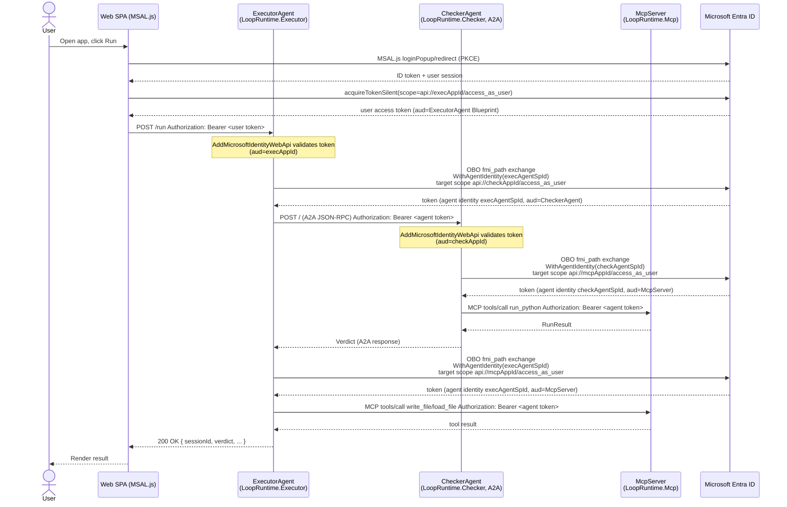

# Entra Agent ID — Implementation Plan (LoopRuntime)

Not implemented. Plan + pseudocode only.

## First-principles analysis

Two docs analyzed:
- `entra-docs/call-api-custom.md` — 3 ways to call downstream API from .NET agent: `IDownstreamApi` (low complexity, recommended), `MicrosoftIdentityMessageHandler` (HttpClient DI pipeline), `IAuthorizationHeaderProvider` (full control). All need `Microsoft.Identity.Web.AgentIdentities` + `AddAgentIdentities()`. Agent identity selected per-call via `.WithAgentIdentity(id)`; `RequestAppToken=true` = autonomous (app-only), unset/false = OBO (user-context).
- `agent-identity-samples/call-azure-service` — confirms pattern: Blueprint holds creds (secret/FIC), `AddMicrosoftIdentityWebApi` validates incoming token (audience = Blueprint), `MicrosoftIdentityTokenCredential.Options.WithAgentIdentity(id)` picks which Agent Identity instance acts. Agent Identity ≠ app itself — it's a distinct sub-identity with own audit trail.

Consequence for LoopRuntime's 4-node chain:
- **Web is a static SPA** (`wwwroot/index.html`, plain JS `fetch`) — no server-side OBO code runs here. It's a **public client**: MSAL.js signs the user in, acquires a token for ExecutorAgent's `access_as_user` scope, attaches as `Authorization: Bearer`. Entra's OBO chain starts at ExecutorAgent, not at Web.
- **ExecutorAgent & CheckerAgent are Blueprint-backed Agent Identities** — each process authenticates AS its Blueprint (secret/FIC in `AzureAd:ClientCredentials`), validates incoming user tokens (`AddMicrosoftIdentityWebApi`), then re-mints a token for the next hop scoped to a specific **Agent Identity instance** (`WithAgentIdentity(execAgentSpId)` / `WithAgentIdentity(checkAgentSpId)`) via OBO (`GetForUserAsync` / `CreateAuthorizationHeaderForUserAsync`, no `RequestAppToken`).
- **McpServer is a leaf API** — only validates incoming bearer tokens (audience = its own Blueprint... actually plain App Reg here, not Blueprint), no outbound calls, no `AddAgentIdentities()` needed.
- Recommended API per hop: `IDownstreamApi` for Checker (A2A JSON-RPC is just POST+JSON, fits `IDownstreamApi`/raw HTTP); `MicrosoftIdentityMessageHandler` for MCP (its `HttpClientTransport` takes a plain `HttpClient` — perfect DI slot for the handler).

---

## Component → Entra object mapping

| LoopRuntime component | Project | Entra object | Role |
|---|---|---|---|
| Web | `src/LoopRuntime.Executor/wwwroot/index.html` | App Reg (SPA), `Web` | Public client, MSAL.js, no secret |
| ExecutorAgent | `src/LoopRuntime.Executor` | Agent Identity Blueprint, `ExecutorAgentBlueprint` (+ instance `ExecutorAgent-instance-1`) | Confidential client + resource server |
| CheckerAgent | `src/LoopRuntime.Checker` | Agent Identity Blueprint, `CheckerAgentBlueprint` (+ instance `CheckerAgent-instance-1`) | Confidential client + resource server |
| McpServer | `src/LoopRuntime.Mcp` | App Reg, `McpServer` | Resource server only (leaf) |

IDs come from running `entra_agent_id.md`'s setup script (renamed `CheckerAgent`). Placeholders below: `<webAppId>`, `<execAppId>`, `<execAgentSpId>`, `<checkAppId>`, `<checkAgentSpId>`, `<mcpAppId>`.

---

## Workflow (Mermaid)



---

## Package additions

| Project | New NuGet packages |
|---|---|
| `LoopRuntime.Executor` | `Microsoft.Identity.Web`, `Microsoft.Identity.Web.AgentIdentities`, `Microsoft.Identity.Web.DownstreamApi` |
| `LoopRuntime.Checker` | `Microsoft.Identity.Web`, `Microsoft.Identity.Web.AgentIdentities`, `Microsoft.Identity.Web.DownstreamApi` |
| `LoopRuntime.Mcp` | `Microsoft.Identity.Web` (JwtBearer validation only, no AgentIdentities/DownstreamApi) |
| Web (`wwwroot`) | `@azure/msal-browser` (via CDN `<script>` or npm+bundle) |

---

## appsettings.json (pseudocode / placeholders)

### `LoopRuntime.Executor/appsettings.json`

```jsonc
{
  "AzureAd": {
    "Instance": "https://login.microsoftonline.com/",
    "TenantId": "<tenantId>",
    "ClientId": "<execAppId>",          // ExecutorAgent Blueprint appId
    "ClientCredentials": [
      { "SourceType": "ClientSecret", "ClientSecret": "<from user-secrets>" }
      // prod: replace with FederatedIdentityCredential SourceType, no secret in config
    ]
  },
  "AgentIdentity": {
    "AgentIdentityId": "<execAgentSpId>"   // ExecutorAgent-instance-1
  },
  "DownstreamApis": {
    "CheckerAgent": {
      "BaseUrl": "<checker service base url — Aspire service discovery>",
      "Scopes": [ "api://<checkAppId>/access_as_user" ]
    },
    "McpServer": {
      "BaseUrl": "<mcp service base url — Aspire service discovery>",
      "Scopes": [ "api://<mcpAppId>/access_as_user" ]
    }
  }
}
```

### `LoopRuntime.Checker/appsettings.json`

```jsonc
{
  "AzureAd": {
    "Instance": "https://login.microsoftonline.com/",
    "TenantId": "<tenantId>",
    "ClientId": "<checkAppId>",          // CheckerAgent Blueprint appId
    "ClientCredentials": [
      { "SourceType": "ClientSecret", "ClientSecret": "<from user-secrets>" }
    ]
  },
  "AgentIdentity": {
    "AgentIdentityId": "<checkAgentSpId>"  // CheckerAgent-instance-1
  },
  "DownstreamApis": {
    "McpServer": {
      "BaseUrl": "<mcp service base url>",
      "Scopes": [ "api://<mcpAppId>/access_as_user" ]
    }
  }
}
```

### `LoopRuntime.Mcp/appsettings.json`

```jsonc
{
  "AzureAd": {
    "Instance": "https://login.microsoftonline.com/",
    "TenantId": "<tenantId>",
    "ClientId": "<mcpAppId>"    // validates tokens only, no ClientCredentials needed
  }
}
```

Secrets: `dotnet user-secrets set "AzureAd:ClientCredentials:0:ClientSecret" "..."` per project (dev). Prod: FIC, no secret in config at all (matches existing plan.md rule "No keys in code").

---

## Program.cs wiring (pseudocode)

### `LoopRuntime.Mcp` (leaf — validate only)

```csharp
builder.Services.AddAuthentication(JwtBearerDefaults.AuthenticationScheme)
    .AddMicrosoftIdentityWebApi(builder.Configuration.GetSection("AzureAd"));
builder.Services.AddAuthorization();
// ...
app.UseAuthentication();
app.UseAuthorization();
app.MapMcp().RequireAuthorization();   // was: app.MapMcp() with no auth
```

### `LoopRuntime.Checker` (validate incoming + call McpServer OBO)

```csharp
builder.Services.AddAuthentication(JwtBearerDefaults.AuthenticationScheme)
    .AddMicrosoftIdentityWebApi(builder.Configuration.GetSection("AzureAd"))
    .EnableTokenAcquisitionToCallDownstreamApi()
    .AddInMemoryTokenCaches();
builder.Services.AddDownstreamApi("McpServer", builder.Configuration.GetSection("DownstreamApis:McpServer"));
builder.Services.AddAgentIdentities();
// ...
app.UseAuthentication();
app.UseAuthorization();
// A2A JSON-RPC + agent card endpoints — add .RequireAuthorization() to the mapped routes
app.MapA2AJsonRpc("checker", "/").RequireAuthorization();
```

`RemoteMcpTools` (used by Checker) — attach agent-identity OBO token instead of anonymous `HttpClient`:

```csharp
// pseudocode: replace `new HttpClient()` in CreateClientAsync with an
// IHttpClientFactory-created client that has MicrosoftIdentityMessageHandler
// pre-configured for the "McpServer" downstream + current agent identity.

services.AddHttpClient("McpClient")
    .AddHttpMessageHandler(sp => new MicrosoftIdentityMessageHandler(
        sp.GetRequiredService<IAuthorizationHeaderProvider>(),
        new MicrosoftIdentityMessageHandlerOptions
        {
            Scopes = ["api://<mcpAppId>/access_as_user"],
            AuthorizationHeaderProviderOptions = new() {
                AcquireTokenOptions = new() { /* WithAgentIdentity(checkAgentSpId) */ }
            }
        }));

// RemoteMcpTools.CreateClientAsync:
var httpClient = _httpClientFactory.CreateClient("McpClient");
var transport = new HttpClientTransport(new() { Endpoint = _endpoint, TransportMode = StreamableHttp }, httpClient, ...);
```

### `LoopRuntime.Executor` (validate incoming user token + OBO to both Checker and McpServer)

```csharp
builder.Services.AddAuthentication(JwtBearerDefaults.AuthenticationScheme)
    .AddMicrosoftIdentityWebApi(builder.Configuration.GetSection("AzureAd"))
    .EnableTokenAcquisitionToCallDownstreamApi()
    .AddInMemoryTokenCaches();
builder.Services.AddDownstreamApi("CheckerAgent", builder.Configuration.GetSection("DownstreamApis:CheckerAgent"));
builder.Services.AddDownstreamApi("McpServer", builder.Configuration.GetSection("DownstreamApis:McpServer"));
builder.Services.AddAgentIdentities();
// ...
app.UseAuthentication();
app.UseAuthorization();
app.MapPost("/run", [Authorize] async (RunRequest request, ExecutorAgent executor, ...) => { ... });
```

`A2ACheckerClient` (Executor → Checker, A2A) — pseudocode change:

```csharp
public async Task<Verdict> ReviewAsync(string sessionId, string path, CancellationToken ct)
{
    var authHeader = await _authorizationHeaderProvider.CreateAuthorizationHeaderForUserAsync(
        scopes: ["api://<checkAppId>/access_as_user"],
        options: new AuthorizationHeaderProviderOptions().WithAgentIdentity("<execAgentSpId>"),
        // no RequestAppToken=true => OBO, carries current HttpContext user
        cancellationToken: ct);

    // attach authHeader to the HttpClient used inside A2AClient (ctor overload accepting HttpClient),
    // or wrap with MicrosoftIdentityMessageHandler like RemoteMcpTools above
    var a2aClient = new A2AClient(new Uri(a2aBaseUrl), httpClientWithAuthHeader);
    ...
}
```

`RemoteMcpTools` (Executor → McpServer) — same pattern as Checker's, but agent identity = `<execAgentSpId>`, target scope = `api://<mcpAppId>/access_as_user`.

---

## Web SPA (`wwwroot/index.html`) — MSAL.js pseudocode

```html
<script src="https://alcdn.msauth.net/browser/3.x/js/msal-browser.min.js"></script>
<script>
  const msalConfig = {
    auth: {
      clientId: "<webAppId>",
      authority: "https://login.microsoftonline.com/<tenantId>",
      redirectUri: window.location.origin
    }
  };
  const msalInstance = new msal.PublicClientApplication(msalConfig);

  async function getAccessToken() {
    const account = msalInstance.getAllAccounts()[0]
      ?? (await msalInstance.loginPopup({ scopes: ["api://<execAppId>/access_as_user"] })).account;

    const result = await msalInstance.acquireTokenSilent({
      scopes: ["api://<execAppId>/access_as_user"],
      account
    }).catch(() => msalInstance.acquireTokenPopup({ scopes: ["api://<execAppId>/access_as_user"] }));

    return result.accessToken;
  }

  // existing fetch('/run', ...) — add auth header:
  async function runPrompt(prompt) {
    const token = await getAccessToken();
    const res = await fetch('/run', {
      method: 'POST',
      headers: {
        'Content-Type': 'application/json',
        'Authorization': `Bearer ${token}`   // NEW
      },
      body: JSON.stringify({ prompt })
    });
    ...
  }
</script>
```

Requires: Web app registration redirect URI = Executor's serving origin (e.g. `https://localhost:5003`), since SPA is served from Executor's `wwwroot`.

---

## Aspire AppHost notes

- Inject `AzureAd__ClientId`, `AzureAd__TenantId` etc. as env vars per project via `.WithEnvironment(...)` in `LoopRuntime.AppHost/Program.cs` — same pattern as existing `AI__Provider`/`AI__Model`.
- Client secrets via `builder.AddParameter("executor-client-secret", secret: true)` + `dotnet user-secrets`, never literal in `Program.cs` (matches AGENTS.md rule).
- `DownstreamApis:*:BaseUrl` should resolve via Aspire service discovery (`services__checker__http__0` style), not hardcoded — mirror how `Services:AgentGateway:Gateway:0` is already wired.

---

## Open items (decide before implementing)

1. A2A JSON-RPC endpoint auth: confirm `MapA2AJsonRpc(...).RequireAuthorization()` is supported by `Microsoft.Agents.AI.Hosting.A2A.AspNetCore`, or auth must be applied via middleware ordering instead.
2. `MicrosoftIdentityMessageHandler` + MCP's `HttpClientTransport`: confirm the transport accepts a DI-created `HttpClient` with handler already attached (it does — ctor takes `HttpClient` directly) vs. needing raw `IAuthorizationHeaderProvider` header injection instead.
3. CORS: Web SPA and Executor share origin (served from same wwwroot) — no CORS needed unless split later.
4. Local dev vs Aspire: `AzureAd` config duplicated per project's `appsettings.Development.json` — confirm real tenant/app IDs only live in user-secrets/env, not committed files.

Not implemented — plan + pseudocode only, run/implement yourself.
