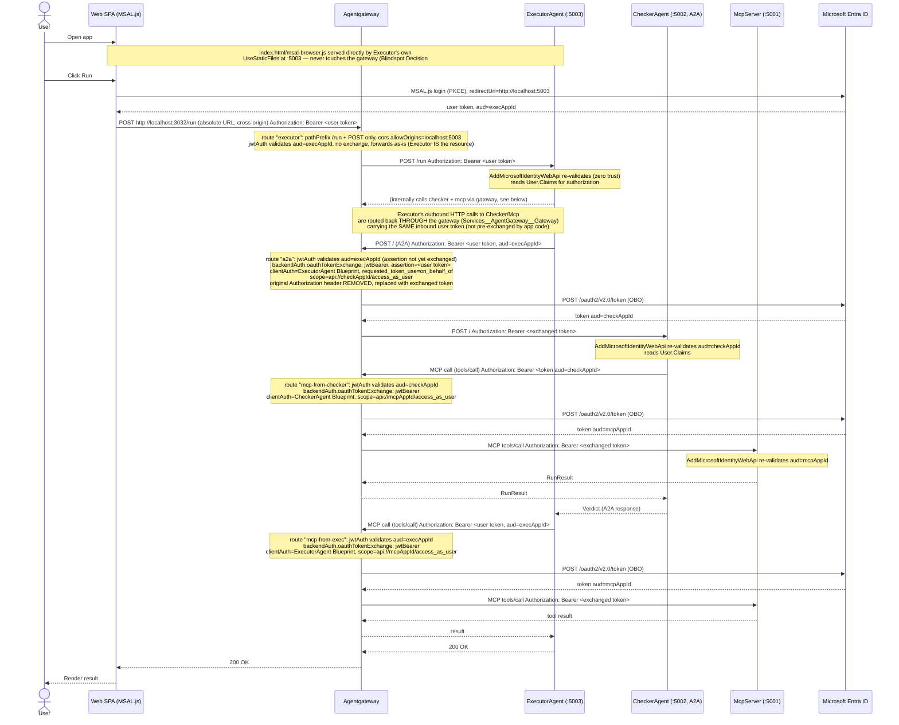

# Entra OBO via Agentgateway — Implementation Plan (LoopRuntime)

Not implemented. Plan + pseudocode/config only.

## Blindspot pass — unknown unknowns before you implement

First time touching Entra/agentgateway/A2A/MCP auth stack — here's what will bite you that isn't obvious from the plan above.

### Decisions — answered, locked in

1. **Direct-port bypass (`:5001`/`:5002`/`:5003` vs gateway-only).** DECIDED: keep host-exposed for local debugging. No `AppHost/Program.cs` change — `WithHttpEndpoint` stays on all three projects. Each service's own `AddMicrosoftIdentityWebApi` (zero trust) is the only thing guarding a direct hit; accepted tradeoff, not a gap.
2. **SPA origin.** DECIDED + **tested working**: option (b) — browser loads `index.html`/`msal-browser.js` directly from Executor `:5003` (same-origin, no gateway involved for static assets), then calls `/run` against the gateway's absolute URL `http://localhost:3032/run` (cross-origin). Consequences, now locked into the plan below:
   - MSAL.js `redirectUri` = Executor's own origin (`http://localhost:5003`), NOT the gateway's.
   - `fetch('/run', ...)` in `wwwroot/index.html` must become `fetch('http://localhost:3032/run', ...)` — absolute URL, not relative (relative would hit Executor `:5003` directly, bypassing the gateway's `jwtAuth`/audit entirely).
   - Gateway's `executor` route needs a CORS policy allowing Executor's origin (`http://localhost:5003`) — added to gateway.yaml below.
   - Confidence Item (old) about needing a static-vs-`/run` path split inside the gateway is now **moot** — static assets never reach the gateway at all under option (b). Gateway's `executor` route can stay scoped to `/run` only, no split needed.
3. **Route-matching precedence.** DECIDED: keep assuming most-specific-match (matches today's working `gateway.yaml` behavior); not verifying against agentgateway source further. Revisit only if routes start behaving unexpectedly.

### Confidence items — explained, no decision needed

1. **Multi-hop OBO ("OBO-ing an OBO token") is already solved, not new.** Checker forwarding an already-Executor-exchanged token as the NEXT assertion (Checker → Mcp hop) only works because `entra_agent_id.md`'s setup script already wired `preAuthorizedApplications` / delegated grants across the whole chain. This is why that script mattered — no new Entra config needed for chained OBO, it's a consequence of what's already been provisioned.
2. **Secret plumbing, 3 hops, not magic.** `dotnet user-secrets set "Parameters:executor-client-secret" "..."` (dev) → Aspire's `builder.AddParameter("executor-client-secret", secret: true)` reads it into `IConfiguration` → `.WithEnvironment("EXECUTOR_CLIENT_SECRET", execClientSecret)` bakes it into the agentgateway container's env at `docker run` time → `gateway.yaml`'s `${EXECUTOR_CLIENT_SECRET}` interpolates it. Container never touches `dotnet user-secrets` directly — Aspire is the only thing that reads it and re-injects as a plain env var.
3. **Token expiry mid-chain — not usually a real risk here.** Entra access tokens default to ~60-90 min lifetime; the whole Web→Executor→Checker→Mcp chain is sub-second. Real risk is a SPA session left open for a long time — `acquireTokenSilent` before EVERY `/run` call (not just once at login) avoids stale tokens. Already in the MSAL.js pseudocode.
4. **`host.docker.internal` works on your setup.** You're on macOS with Docker Desktop — `host.docker.internal` resolves fine. Only breaks on native Linux Docker (needs `--add-host` or different networking). Not a concern here, flagging so you know why it'd break if this ever runs on a Linux CI box.

## Yes — can do it

Repo already runs agentgateway as the front door (`gateway.yaml`, `LoopRuntime.AppHost/Program.cs`): all traffic to `checker` (A2A), `mcp`, `executor` passes through it. Agentgateway v1.4.0-alpha.1+ ships `backendAuth.oauthTokenExchange` with `grantType: jwtBearer` + Entra OBO shape (`additionalParams.requested_token_use`). Move OBO out of app code, into gateway config. Kills the `Microsoft.Identity.Web.AgentIdentities` app-side OBO plan in `entra_agent_id_impl.md` — gateway does the exchange, apps just validate inbound + read forwarded token.

## First principles (from the two sources)

- **Inbound validation ≠ outbound exchange.** Gateway route `policies.jwtAuth` (plain HTTP/A2A route) or `policies.mcpAuthentication` (MCP route, full MCP-Authorization-spec discovery) checks the caller's token BEFORE the request reaches the backend. Separately, `backend.policies.backendAuth.oauthTokenExchange` runs AFTER auth, exchanging that validated inbound bearer for a new token scoped to the specific upstream, then forwards it. Two independent knobs, same route/backend.
- **Entra OBO ≠ RFC 8693.** Entra doesn't speak token-exchange grant. It's jwt-bearer (RFC 7523) with `requested_token_use=on_behalf_of` vendor extension. Agentgateway config: `grantType: jwtBearer`, inbound token sent as `assertion` (not `subject_token`), `clientAuth.method: clientSecretPost` (Entra wants creds in body not `Authorization: Basic`), `additionalParams.requested_token_use: '"on_behalf_of"'` (CEL string literal — note inner quotes).
- **No `actorToken`/`resources`/`requestedTokenType` for jwtBearer** — those are RFC-8693-only fields, rejected at config load for this grant.
- **Client identity for exchange = the Blueprint, not the Agent Identity instance.** `clientAuth.clientId/clientSecret` = ExecutorAgent/CheckerAgent Blueprint's own app creds (same ones already in `entra_agent_id.md`). Gateway does the OBO call as that Blueprint app.
- **`scopes` on the oauthTokenExchange block = target resource's exposed scope** (`api://<mcpAppId>/access_as_user`, `api://<checkAppId>/access_as_user`) — this drives `aud` in the minted token, same as the `.WithAgentIdentity(...)` scope selection in the app-side plan.
- Caching: gateway caches exchanged token per subject+params, TTL capped by inbound JWT `exp` — replaces `AddInMemoryTokenCaches()` from the app-side plan.

## Component → Entra + Gateway mapping

| Hop | Inbound validation (route) | Outbound exchange (backend) |
|---|---|---|
| Web → Executor | `jwtAuth` on `executor` route (scoped to `POST /run` only, CORS-enabled — see Blindspot Decision #2), aud=`<execAppId>` | — (Executor is the resource here) |
| Executor → CheckerAgent (A2A) | `jwtAuth` on `a2a` route, aud=`<execAppId>` (assertion is still the Web-issued token, not yet exchanged) | `oauthTokenExchange` on `a2a` backend, exchange for `<checkAppId>` scope, `clientAuth`=ExecutorAgent Blueprint creds |
| Executor → McpServer | `jwtAuth` on **`mcp-from-exec`** route, aud=`<execAppId>` | `oauthTokenExchange` on `mcp-from-exec` backend, exchange for `<mcpAppId>` scope, `clientAuth`=ExecutorAgent Blueprint creds |
| CheckerAgent → McpServer | `jwtAuth` on **`mcp-from-checker`** route, aud=`<checkAppId>` (assertion is the token Checker received from the a2a hop) | `oauthTokenExchange` on `mcp-from-checker` backend, exchange for `<mcpAppId>` scope, `clientAuth`=CheckerAgent Blueprint creds |

Same 4 Entra objects as before (`Web`, `ExecutorAgentBlueprint`, `CheckerAgentBlueprint`, `McpServer`) from `entra_agent_id.md`. Every service still does `AddMicrosoftIdentityWebApi` (zero-trust — never trust gateway blindly, always re-validate + read `User.Claims` for authorization).

`mcp` route split into `mcp-from-exec` / `mcp-from-checker` (decision on Open Item #1 — see below): two gateway routes, same MCP backend host, different `jwtAuth`/`backendAuth.clientAuth` per caller.

## Workflow (Mermaid)



## gateway.yaml changes (pseudocode/config)

Extend existing `binds[0].listeners[0].routes` — add `policies.jwtAuth` per route, add `policies.backendAuth.oauthTokenExchange` per backend.

```yaml
binds:
- port: 3032
  listeners:
  - name: public
    protocol: HTTP
    routes:
    - name: a2a
      matches:
      - path: { exact: / }
        method: POST
      - path: { exact: /.well-known/agent-card.json }
      policies:
        a2a: {}
        jwtAuth:                                    # assertion still carries execAppId aud (not yet exchanged)
          issuer: https://sts.windows.net/<tenantId>/
          audiences: ["api://<execAppId>"]
          jwks:
            url: https://login.microsoftonline.com/<tenantId>/discovery/v2.0/keys
      backends:
      - host: host.docker.internal:5002
        policies:
          backendAuth:
            oauthTokenExchange:
              host: login.microsoftonline.com:443
              path: /<tenantId>/oauth2/v2.0/token
              grantType: jwtBearer
              clientAuth:
                clientId: <execAppId>                # ExecutorAgent Blueprint
                clientSecret: ${EXECUTOR_CLIENT_SECRET}
                method: clientSecretPost
              scopes:
              - api://<checkAppId>/access_as_user
              additionalParams:
                requested_token_use: '"on_behalf_of"'

    # Open Item #1 resolved: split MCP into per-caller routes (option a) —
    # each caller gets its own jwtAuth audience + its own oauthTokenExchange.clientAuth
    # (own Blueprint), so McpServer sees a distinct azp per caller in its token.
    - name: mcp-from-exec
      matches:
      - path: { pathPrefix: /mcp-from-exec }
      policies:
        jwtAuth:                                    # Open Item #3: plain jwtAuth, not mcpAuthentication —
          issuer: https://sts.windows.net/<tenantId>/  # McpServer is only ever called server-to-server here,
          audiences: ["api://<execAppId>"]             # never by an interactive MCP client (VS Code/Claude Desktop),
          jwks:                                        # so the MCP-Authorization-spec discovery/401 dance is unneeded.
            url: https://login.microsoftonline.com/<tenantId>/discovery/v2.0/keys
      backends:
      - mcp:
          targets:
          - name: mcp
            mcp:
              host: http://host.docker.internal:5001/
        policies:
          backendAuth:
            oauthTokenExchange:
              host: login.microsoftonline.com:443
              path: /<tenantId>/oauth2/v2.0/token
              grantType: jwtBearer
              clientAuth:
                clientId: <execAppId>                 # ExecutorAgent Blueprint
                clientSecret: ${EXECUTOR_CLIENT_SECRET}
                method: clientSecretPost
              scopes:
              - api://<mcpAppId>/access_as_user
              additionalParams:
                requested_token_use: '"on_behalf_of"'

    - name: mcp-from-checker
      matches:
      - path: { pathPrefix: /mcp-from-checker }
      policies:
        jwtAuth:
          issuer: https://sts.windows.net/<tenantId>/
          audiences: ["api://<checkAppId>"]
          jwks:
            url: https://login.microsoftonline.com/<tenantId>/discovery/v2.0/keys
      backends:
      - mcp:
          targets:
          - name: mcp
            mcp:
              host: http://host.docker.internal:5001/
        policies:
          backendAuth:
            oauthTokenExchange:
              host: login.microsoftonline.com:443
              path: /<tenantId>/oauth2/v2.0/token
              grantType: jwtBearer
              clientAuth:
                clientId: <checkAppId>                # CheckerAgent Blueprint
                clientSecret: ${CHECKER_CLIENT_SECRET}
                method: clientSecretPost
              scopes:
              - api://<mcpAppId>/access_as_user
              additionalParams:
                requested_token_use: '"on_behalf_of"'

    - name: executor
      matches:
      - path: { pathPrefix: /run }                    # scoped, not catch-all "/" — SPA statics never hit gateway (decision: option b)
        method: POST
      policies:
        cors:                                         # NEW — cross-origin, SPA is served from Executor:5003 directly
          allowOrigins:
          - http://localhost:5003
          allowHeaders:
          - authorization
          - content-type
          allowMethods:
          - POST
          - OPTIONS
        jwtAuth:                                     # validate Web's user token; Executor is resource, no exchange
          issuer: https://sts.windows.net/<tenantId>/
          audiences: ["api://<execAppId>"]
          jwks:
            url: https://login.microsoftonline.com/<tenantId>/discovery/v2.0/keys
      backends:
      - host: host.docker.internal:5003
```

Secrets: `${EXECUTOR_CLIENT_SECRET}` / `${CHECKER_CLIENT_SECRET}` — env vars injected via Aspire `AddParameter(..., secret: true)` + `.WithEnvironment(...)` on the `agentgateway` container resource (mirrors existing `AZURE_OPENAI_API_KEY` pattern already in `Program.cs`), never literal in `gateway.yaml`.

## AppHost changes (pseudocode)

Yes, needed — two separate things. (No change to `WithHttpEndpoint(port: 5001/5002/5003, ...)` — Blindspot Decision #1 keeps these host-exposed as-is.)

**1. Gateway container secrets** (client creds for the exchange):

```csharp
var execClientSecret  = builder.AddParameter("executor-client-secret", secret: true);
var checkerClientSecret = builder.AddParameter("checker-client-secret", secret: true);

var agentgateway = builder
    .AddContainer("agentgateway", "cr.agentgateway.dev/agentgateway", "v1.4.0-alpha.1")
    .WithBindMount("./gateway.yaml", "/app/gateway.yaml")
    // ...existing...
    .WithEnvironment("EXECUTOR_CLIENT_SECRET", execClientSecret)
    .WithEnvironment("CHECKER_CLIENT_SECRET", checkerClientSecret)
    .WaitFor(mcp);
```

**2. Per-project `Mcp:PathSuffix` env var** — required because of the Item #1 route split. Executor and Checker each need to hit a DIFFERENT gateway path now (`/mcp-from-exec` vs `/mcp-from-checker`), so each project's `RemoteMcpTools` needs to know which one it is. Wire it the same way `AI__Provider`/`AI__Model` are already injected:

```csharp
var checker = builder
    .AddProject<Projects.LoopRuntime_Checker>("checker")
    .WithHttpEndpoint(port: 5002, name: "http")
    .WithEnvironment("AI__Provider", aiProvider)
    .WithEnvironment("AI__Model", aiModel)
    .WithEnvironment("AgentGateway__LlmEndpoint", agentgateway.GetEndpoint("llm"))
    .WithEnvironment("Services__AgentGateway__Gateway__0", agentgateway.GetEndpoint("gateway"))
    .WithEnvironment("Mcp__PathSuffix", "/mcp-from-checker")   // NEW
    .WithEnvironment("OTEL_INSTRUMENTATION_GENAI_CAPTURE_MESSAGE_CONTENT", "true")
    .WaitFor(agentgateway);

builder
    .AddProject<Projects.LoopRuntime_Executor>("executor")
    .WithHttpEndpoint(port: 5003, name: "http")
    .WithEnvironment("AI__Provider", aiProvider)
    .WithEnvironment("AI__Model", aiModel)
    .WithEnvironment("AgentGateway__LlmEndpoint", agentgateway.GetEndpoint("llm"))
    .WithEnvironment("Services__AgentGateway__Gateway__0", agentgateway.GetEndpoint("gateway"))
    .WithEnvironment("Mcp__PathSuffix", "/mcp-from-exec")      // NEW
    .WithEnvironment("OTEL_INSTRUMENTATION_GENAI_CAPTURE_MESSAGE_CONTENT", "true")
    .WaitFor(checker);
```

Without this, both projects would keep hitting the old hardcoded `/mcp` path, which no longer exists in `gateway.yaml` (replaced by `mcp-from-exec`/`mcp-from-checker`) — hard failure, not silent.

## appsettings.json — `AzureAd` section per project

Validation-only now (no `ClientCredentials`, no `DownstreamApis` — gateway holds the Blueprint secrets, not the app). Each project's `ClientId` = its OWN Entra object's appId, so each service only ever accepts tokens minted for itself.

### `LoopRuntime.Executor/appsettings.json`

```jsonc
{
  "AzureAd": {
    "Instance": "https://login.microsoftonline.com/",
    "TenantId": "<tenantId>",
    "ClientId": "<execAppId>"      // ExecutorAgent Blueprint appId — validates aud=execAppId only
  }
}
```

### `LoopRuntime.Checker/appsettings.json`

```jsonc
{
  "AzureAd": {
    "Instance": "https://login.microsoftonline.com/",
    "TenantId": "<tenantId>",
    "ClientId": "<checkAppId>"     // CheckerAgent Blueprint appId — validates aud=checkAppId only
  }
}
```

### `LoopRuntime.Mcp/appsettings.json`

```jsonc
{
  "AzureAd": {
    "Instance": "https://login.microsoftonline.com/",
    "TenantId": "<tenantId>",
    "ClientId": "<mcpAppId>"       // McpServer App Reg appId — validates aud=mcpAppId only
  }
}
```

No secrets in any of these — `AddMicrosoftIdentityWebApi` in validate-only mode needs no `ClientCredentials`. Real `<tenantId>`/`<*AppId>` values come from `entra_agent_id.md`'s setup script output; inject via `appsettings.Development.json` (local) or AppHost env vars (`AzureAd__ClientId` etc., same `.WithEnvironment(...)` pattern as `Mcp__PathSuffix` above) — never commit real tenant/app IDs to `appsettings.json` directly if the repo is public.

## App-side changes (pseudocode) — zero-trust: every hop re-validates

- `LoopRuntime.Executor/Program.cs`, `LoopRuntime.Checker/Program.cs`, `LoopRuntime.Mcp/Program.cs`: **keep `AddMicrosoftIdentityWebApi`** (JwtBearer validation) on all three — zero trust, never assume gateway-validated == safe. Still **drop** `AddAgentIdentities()` / `EnableTokenAcquisitionToCallDownstreamApi()` / `DownstreamApis` config — gateway does the exchange, app never mints outbound tokens itself.

```csharp
// Executor / Checker / Mcp — each validates its OWN audience:
builder.Services.AddAuthentication(JwtBearerDefaults.AuthenticationScheme)
    .AddMicrosoftIdentityWebApi(builder.Configuration.GetSection("AzureAd"));
    // AzureAd:ClientId = own Blueprint/App appId (execAppId / checkAppId / mcpAppId)
    // no ClientCredentials needed here — this instance never calls Entra itself, only validates
builder.Services.AddAuthorization();
// ...
app.UseAuthentication();
app.UseAuthorization();
app.MapPost("/run", [Authorize] (RunRequest req, ClaimsPrincipal user, ...) =>
{
    // read user.Claims for authz decisions (roles, groups, oid, ...)
    var userId = user.FindFirst("oid")?.Value;
    ...
});
```

Endpoint-level enforcement, matched to the REAL mapping calls already in the repo (grounded, not invented — see Standards Compliance Check below for proof these need `.RequireAuthorization()`):

```csharp
// LoopRuntime.Mcp/Program.cs — actual call today is `app.MapMcp();` with no auth.
app.MapMcp().RequireAuthorization();     // NEW — was unauthenticated

// LoopRuntime.Checker/Program.cs — actual calls today:
//   app.MapA2AJsonRpc("checker", "/");
//   app.MapWellKnownAgentCard(agentCard, string.Empty);
app.MapA2AJsonRpc("checker", "/").RequireAuthorization();               // NEW
app.MapWellKnownAgentCard(agentCard, string.Empty).RequireAuthorization(); // NEW — agent-card must be protected too
```

- `RemoteMcpTools`: endpoint suffix now differs per caller (Open Item #1 decision) — Executor targets `/mcp-from-exec`, Checker targets `/mcp-from-checker`. Make the suffix configurable instead of the current hardcoded `"/mcp"`:

```csharp
// RemoteMcpTools.cs pseudocode
var configured = configuration["Services:AgentGateway:Gateway:0"];
var mcpPathSuffix = configuration["Mcp:PathSuffix"];   // NEW: "/mcp-from-exec" (Executor appsettings)
                                                        //      "/mcp-from-checker" (Checker appsettings)
_endpoint = new Uri(configured.TrimEnd('/') + mcpPathSuffix, UriKind.Absolute);
```

- `A2ACheckerClient` / `RemoteMcpTools`: **forward the inbound user's bearer token** on the outbound call — app code does NOT pre-exchange, gateway does. Pull it from the current request context:

```csharp
// A2ACheckerClient.ReviewAsync pseudocode
var inboundAuthHeader = httpContextAccessor.HttpContext.Request.Headers.Authorization.ToString();
var httpClient = httpClientFactory.CreateClient("A2AClient");
httpClient.DefaultRequestHeaders.Authorization = AuthenticationHeaderValue.Parse(inboundAuthHeader);
var a2aClient = new A2AClient(new Uri(a2aBaseUrl), httpClient);
```

- `wwwroot/index.html`: same MSAL.js pseudocode as `entra_agent_id_impl.md` (Web still signs the user in and attaches the initial bearer token), with two changes from the Blindspot decision above: `redirectUri: window.location.origin` (resolves to Executor `:5003`, unchanged code — no hardcoding needed) and `fetch('/run', ...)` → `fetch('http://localhost:3032/run', ...)` (absolute gateway URL, `mode: 'cors'`).

## Standards compliance check — MCP + A2A, proven against real SDK sources

Read (not guessed): [`modelcontextprotocol/csharp-sdk` — `samples/ProtectedMcpServer/Program.cs`](https://github.com/modelcontextprotocol/csharp-sdk/blob/main/samples/ProtectedMcpServer/Program.cs) (official reference for auth-protected MCP server in .NET), and [`a2aproject/a2a-dotnet` — `docs/security.md`](https://github.com/a2aproject/a2a-dotnet/blob/8fe65cfaa65a72b2d63bc9bef2e2d32fddc12a18/docs/security.md) (pinned commit, exact security contract of the SDK we use).

### MCP — matches the reference pattern, one nuance found

Reference sample wiring:
```csharp
builder.Services.AddAuthentication(options => {
    options.DefaultChallengeScheme = McpAuthenticationDefaults.AuthenticationScheme;
    options.DefaultAuthenticateScheme = JwtBearerDefaults.AuthenticationScheme;
})
.AddJwtBearer(options => {
    options.TokenValidationParameters = new TokenValidationParameters {
        ValidAudience = serverUrl,   // <-- audience = the MCP resource's OWN URL (RFC 8707 resource indicator)
        ...
    };
})
.AddMcp(options => { options.ResourceMetadata = new() { ... }; });  // PRM discovery, only if a real MCP client needs it
...
app.MapMcp().RequireAuthorization().RequireCors("McpBrowserClient");
```

- **Confirms our decision**: `.RequireAuthorization()` on `MapMcp()` is exactly the standard pattern — added to the pseudocode above, grounded in the repo's actual `app.MapMcp();` call site.
- **Confirms Open Item #3** (skip `mcpAuthentication`/PRM discovery, use plain `jwtAuth`): the sample's `.AddMcp(options => ResourceMetadata = ...)` + `McpAuthenticationDefaults` challenge scheme exist specifically so an *interactive* MCP client (browser app, VS Code, Claude Desktop) can discover the auth server via `/.well-known/oauth-protected-resource` and do its own OAuth dance. LoopRuntime's MCP calls are 100% server-to-server (Executor/Checker only, through the gateway) — no discovery consumer exists, so this machinery is correctly skipped. Not a compliance violation, a correct scope reduction.
- **Nuance — audience convention differs, flagged, not a blocker.** The reference sample validates `aud = serverUrl` (the literal callable resource URL, per RFC 8707 resource indicators — MCP's own recommended pattern). Our plan validates `aud = api://<mcpAppId>` (Entra's Application-ID-URI convention, what `AddMicrosoftIdentityWebApi` + Entra token issuance do automatically). Both are valid OAuth resource-audience patterns; Entra does not force RFC 8707 raw-URL audiences, and enterprises overwhelmingly use the `api://<appId>` form. Not changing the plan, but documenting the deviation from the MCP SDK's own reference sample so it's a conscious choice, not an oversight. **CORS**: the sample's `RequireCors(...)` only matters when a browser calls MCP directly — LoopRuntime's MCP is never called from a browser (only Executor/Checker via gateway), so no CORS policy needed on `LoopRuntime.Mcp`.

### A2A — SDK enforces nothing, confirms our design is the ONLY correct one

Direct quote from `docs/security.md` (pinned commit `8fe65cfaa6`):
> "The A2A protocol expects authentication at the HTTP layer, not in the JSON-RPC payload. The SDK does **not** apply any authentication or authorization to A2A endpoints."
> "Required application controls: Apply authentication middleware ... to all A2A endpoints, **including `/.well-known/agent-card.json` for protected agents**."

- Proves gateway-level `jwtAuth` alone is not suffient — app-level `.RequireAuthorization()` is mandatory per the SDK's own stated non-goals (SDK truly does zero auth, matches what we assumed but now proven from the source, not inferred from behavior).
- Confirmed real repo call sites needing this: `app.MapA2AJsonRpc("checker", "/")` AND `app.MapWellKnownAgentCard(agentCard, string.Empty)` — **both** need `.RequireAuthorization()`; earlier drafts of this doc only mentioned the JSON-RPC endpoint, the agent-card mapping was missing. Fixed above.
- **New gap surfaced, out of scope for this plan but worth flagging**: `docs/security.md` §6 Tenant Isolation — *"The SDK does not enforce any tenant boundaries... Derive tenant context from the authenticated principal... never from client-supplied request fields."* `A2ACheckerClient`/`CheckerAgent` currently key everything off a caller-supplied `sessionId` (see `IChecker.ReviewAsync(sessionId, path, ...)` — `SessionState.cs`). Once auth lands, `sessionId` should be validated against/derived from the authenticated principal's claims (`oid`), not trusted as-is from the request. Not part of this plan's scope (no session/task-store changes requested) — flagged for follow-up, not implemented here.

## Open items — resolved

1. **Shared `mcp` backend, two callers.** DECIDED: option (a), split into `mcp-from-exec` / `mcp-from-checker` routes (see gateway.yaml above). Each route has its own `jwtAuth.audiences` + `backendAuth.oauthTokenExchange.clientAuth`, so McpServer's token has the correct per-caller `azp`. Cost: `RemoteMcpTools` needs a configurable path suffix per project (see App-side changes above); URL split is intentional, not hidden.
2. **`jwtAuth` audience placement.** FIXED. Audiences updated to match the REAL inbound token at each hop (the assertion, pre-exchange): `a2a` route validates `aud=execAppId` (Web's token, forwarded unexchanged by Executor); `mcp-from-exec` validates `aud=execAppId`; `mcp-from-checker` validates `aud=checkAppId` (the token Checker itself received from the exchanged `a2a` hop). `executor` route stays `aud=execAppId` (unchanged, correct from the start).
3. **`mcpAuthentication` vs `jwtAuth` on MCP routes.** DECIDED: plain `jwtAuth`, not `mcpAuthentication`. McpServer here is called only server-to-server (Executor, Checker) via the gateway — never a real interactive MCP client (VS Code/Claude Desktop) needing OAuth-discovery/401-`WWW-Authenticate` dance. `mcpAuthentication`'s extra discovery machinery (`resourceMetadata`, dynamic client registration) buys nothing in this topology; `jwtAuth` is the simpler, correct fit. Revisit only if a real external MCP client is added later.
4. **Original vs exchanged token forwarded — PROVEN, not assumed.** Read agentgateway source at the exact pinned tag. `crates/agentgateway/src/http/auth/oauth/mod.rs`, fn `insert_exchanged_token` (called from `apply_token_exchange`):
   ```rust
   fn insert_exchanged_token(&self, req: &mut Request, access_token: &str) -> Result<bool, ProxyError> {
       // Replace the original credentials with the backend's.
       self.subject_token.source.remove(req)?;
       if let Some(actor) = &self.actor_token {
           actor.source.remove(req)?;
       }
       self.authorization_location.insert(req, access_token)?;
       Ok(true)
   }
   ```
   Confirmed: original `Authorization` header is explicitly **removed**, then the exchanged token is inserted. Backend only ever sees the exchanged, correctly-scoped token — never both, never the original.
5. **Does `v1.4.0-alpha.1` actually ship this — PROVEN, not trusting the blog.** Cloned `agentgateway/agentgateway`, checked out tag `v1.4.0-alpha.1` (commit `13d6cc332a5bdd7b48e488157ffff01d85877934` — confirmed via `git rev-parse v1.4.0-alpha.1` == same SHA, i.e. the tag points exactly at this commit, not something later). At this exact commit:
   - `crates/agentgateway/src/http/auth/oauth/mod.rs` defines `struct OAuthTokenExchangeAuth` with fields `token_endpoint_path`, `grant_type: OAuthGrantType`, `client_auth: Option<OAuthClientAuth>`, `additional_params: BTreeMap<String, Arc<cel::Expression>>` — matches the blog's config shape field-for-field.
   - `enum OAuthGrantType { TokenExchange (default), JwtBearer }` — `JwtBearer` variant exists, doc comment: *"RFC 7523; the subject token is sent as the `assertion`"* — matches blog exactly.
   - `crates/agentgateway/src/http/auth/oauth/client_auth.rs`: `enum OAuthClientAuthMethod { ClientSecretBasic, ClientSecretPost, ... }` — `ClientSecretPost` (creds in body, what Entra needs) exists.
   - `crates/agentgateway/src/types/agent_xds.rs:1093`: `BackendAuth::OAuthTokenExchange(...)` wiring confirms it's a real, reachable backend-auth policy variant, not dead code.
   - **Conclusion: confirmed shipped at the exact pinned version `v1.4.0-alpha.1`. No version bump needed.** (Interesting side-note: this same commit's own message is "auth: OAuth Identity Assertion Authorization Grant Support (ID-JAG / Cross App Access / XAA)" — the OBO/jwt-bearer building block landed as part of the larger XAA feature, which lines up with the blog's closing mention of `traffic-cross-app-access` reusing the same primitive.)

Not implemented — plan + config/pseudocode only, ready to implement.

## References

Blogs / articles:
- [Agentgateway adds token exchange, jwt-assertion, and Entra OBO](https://agentgateway.dev/blog/2026-07-12-agentgateway-token-exchange-jwt-assertion-entra-obo/)
- [Enterprise MCP SSO With Microsoft Entra and Agentgateway](https://agentgateway.dev/blog/2026-01-26-enterprise-mcp-sso/)

Agentgateway examples / config (GitHub):
- [`examples/traffic-token-exchange`](https://github.com/agentgateway/agentgateway/tree/main/examples/traffic-token-exchange) — overview of all 3 exchange mechanisms
- [`examples/traffic-token-exchange/jwt-authz-grant/README.md`](https://github.com/agentgateway/agentgateway/blob/main/examples/traffic-token-exchange/jwt-authz-grant/README.md) — RFC 7523 jwt-bearer + Entra OBO shape walkthrough
- [`examples/traffic-token-exchange/jwt-authz-grant/config.yaml`](https://raw.githubusercontent.com/agentgateway/agentgateway/main/examples/traffic-token-exchange/jwt-authz-grant/config.yaml) — real `oauthTokenExchange` config, ground truth for field names

Agentgateway source (cloned + verified, not guessed):
- [`agentgateway/agentgateway`](https://github.com/agentgateway/agentgateway) repo, tag `v1.4.0-alpha.1` = commit [`13d6cc332a5bdd7b48e488157ffff01d85877934`](https://github.com/agentgateway/agentgateway/tree/13d6cc332a5bdd7b48e488157ffff01d85877934) (verified tag==commit)
  - `crates/agentgateway/src/http/auth/oauth/mod.rs` — `OAuthTokenExchangeAuth`, `OAuthGrantType`, `insert_exchanged_token`
  - `crates/agentgateway/src/http/auth/oauth/client_auth.rs` — `OAuthClientAuthMethod`
  - `crates/agentgateway/src/types/agent_xds.rs` — `BackendAuth::OAuthTokenExchange` wiring

MCP standard reference:
- [`modelcontextprotocol/csharp-sdk` — `samples/ProtectedMcpServer/Program.cs`](https://github.com/modelcontextprotocol/csharp-sdk/blob/main/samples/ProtectedMcpServer/Program.cs)

A2A standard reference:
- [`a2aproject/a2a-dotnet` — `docs/security.md`](https://github.com/a2aproject/a2a-dotnet/blob/8fe65cfaa65a72b2d63bc9bef2e2d32fddc12a18/docs/security.md) (pinned commit `8fe65cfaa6`)

Entra / app-side OBO background (from the companion doc `entra_agent_id_impl.md`, same research thread):
- [Microsoft Entra docs — `docs/agent-id/call-api-custom.md`](https://github.com/MicrosoftDocs/entra-docs/blob/main/docs/agent-id/call-api-custom.md)
- [`willvelida/agent-identity-samples` — `entra-agent-id/call-azure-service/README.md`](https://github.com/willvelida/agent-identity-samples/blob/main/entra-agent-id/call-azure-service/README.md)

Repo files inspected (ground truth for pseudocode, not invented):
- `src/LoopRuntime.AppHost/gateway.yaml`, `src/LoopRuntime.AppHost/Program.cs`
- `src/LoopRuntime.Executor/Program.cs`, `src/LoopRuntime.Checker/Program.cs`, `src/LoopRuntime.Mcp/Program.cs`
- `src/LoopRuntime.Contracts/IChecker.cs`
- `src/LoopRuntime.Agents/RemoteMcpTools.cs`, `src/LoopRuntime.Agents/A2ACheckerClient.cs`
- `src/LoopRuntime.Executor/wwwroot/index.html`
