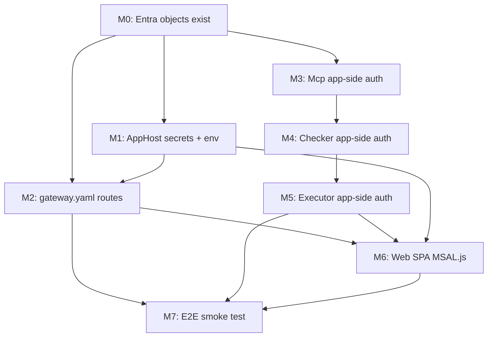
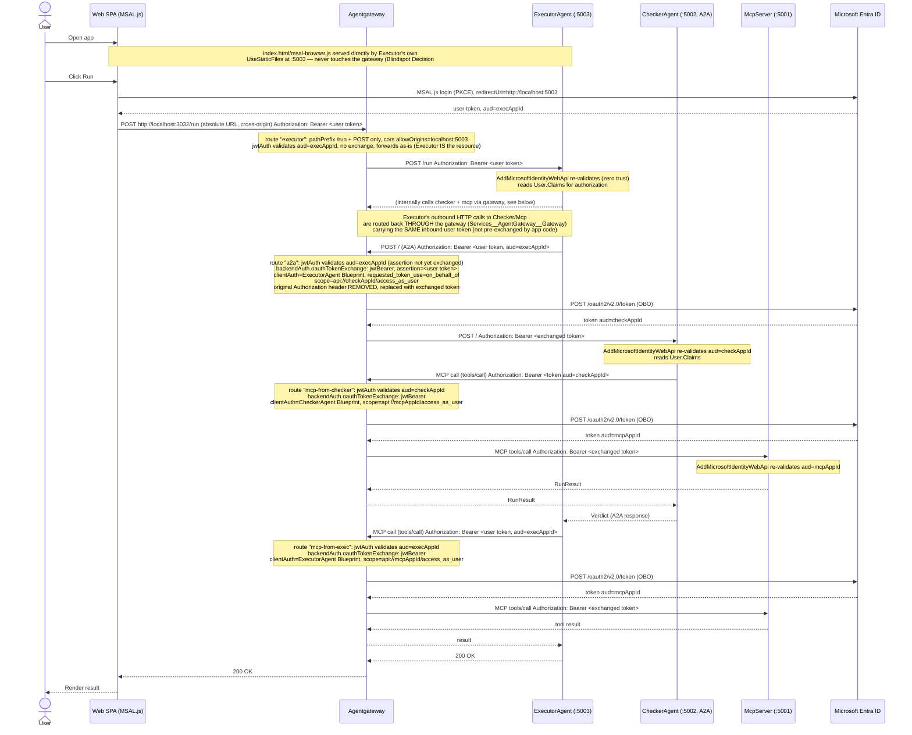

# Entra OBO via Agentgateway — Delivery Plan (LoopRuntime)

Implementation status for `entra_agent_id_impl_agent_gw.md` plus the selected option-2 deviation: keep Entra Agent ID Blueprint apps, stop using AgentGateway jwt-bearer OBO for downstream hops, and let app code acquire downstream user-context tokens with the Blueprint app's configured `SignedAssertionFilePath` credential. Mermaid/YAML/pseudocode below may reflect the original gateway-OBO design; status notes record the current implementation truth.

Source of truth: [`entra_agent_id_impl_agent_gw.md`](./entra_agent_id_impl_agent_gw.md) (includes all research links — agentgateway blog/source, MCP SDK sample, A2A security.md, Entra docs). This plan does not repeat that research, only sequences the work.

---

## 🔴 User Input Required — placeholder lookup table

Every `<angleBracket>` value below the line is a placeholder. Real value comes from your `entra_agent_id.md` setup script output (the terminal dump you already ran). Fill these in before/during the milestone listed — don't guess, copy exact values from your script run.

| Placeholder | What it is | Get it from | Fill in during |
|---|---|---|---|
| `<tenantId>` | Your Entra tenant GUID | `az account show --query tenantId` or setup script's `Connect-MgGraph` output | M0 (record), used in M2, M3-M5 appsettings |
| `<webAppId>` | Web SPA app registration's `appId` | setup script output line `Web appId=...` | M6 (index.html MSAL config) |
| `<execAppId>` | ExecutorAgent Blueprint's `appId` | setup script output line `ExecutorAgent Blueprint appId=...` | M0 (record), M1, M2, M3 (appsettings), M6 |
| `<execAppSecret>` | ExecutorAgent Blueprint's client secret | generate via `az ad app credential reset --id <execAppId>` (not printed by setup script) | Superseded for option 2; current code uses `Parameters:federated-token-file` |
| `<checkAppId>` | CheckerAgent Blueprint's `appId` | setup script output line `CheckerAgent Blueprint appId=...` | M0 (record), M1, M2, M4 (appsettings) |
| `<checkAppSecret>` | CheckerAgent Blueprint's client secret | generate via `az ad app credential reset --id <checkAppId>` | Superseded for option 2; current code uses `Parameters:federated-token-file` |
| `<mcpAppId>` | McpServer app registration's `appId` | setup script output line `McpServer appId=...` | M0 (record), M1, M2, M3 (appsettings) |
| `<federatedTokenFile>` | Local signed assertion file path for Blueprint FIC | user-provided signed assertion file | M1/M7 (`dotnet user-secrets set "Parameters:federated-token-file" "..."`) |
| `<federatedIssuer>` / `<federatedSubject>` | FIC issuer/subject matching the signed assertion file | issuer/sub claims in the assertion source | setup script rerun with `-FederatedIssuer` / `-FederatedSubject` |

Everywhere else in this doc these placeholders appear inside code/config blocks, marked `👉 INPUT` right above the block. 3 spots: gateway.yaml, `LoopRuntime.Mcp/appsettings.json`, `wwwroot/index.html`. No other values need manual input — everything else (routes, ports, paths) is fixed/known already.

---

## Milestones — dependency-ordered checklist

Order matters: each milestone only makes sense once the one above it exists. Do not skip ahead — a later milestone's tests will fail without the earlier one in place.

Grouped into 2 delivery phases:

- **Phase 1 (M0-M2)** — infra/config only, zero app code touched, fully reversible. Verify with `curl`/Postman against the gateway directly. Safe pause point.
- **Phase 2 (M3-M7)** — app code changes + validation. This is where a mistake can 401 the running app — treat as its own review/rollback unit.

---

## Phase 1 — Infra/config only (no app code changes)

### M0 — Prerequisite: Entra objects exist (already done, verify only)

- [x] Confirm `entra_agent_id.md`'s setup script has been run and these still resolve: `Web` appId, `ExecutorAgentBlueprint` appId + `access_as_user` scope, `CheckerAgentBlueprint` appId + `access_as_user` scope, `McpServer` appId + `access_as_user` scope.
- [x] Confirm `preAuthorizedApplications`/delegated grants chain (Web→Exec, Exec→Checker, Exec→Mcp, Checker→Mcp) is intact — required for chained OBO (see `entra_agent_id_impl_agent_gw.md` Blindspot Confidence Item #1).
- [x] Record 3 values you'll need repeatedly below: `<tenantId>`, `<execAppId>`, `<checkAppId>`, `<mcpAppId>`.

No code change. Blocks everything else — nothing below works without real Entra objects.

### M1 — AppHost: secrets + env wiring (config only, no app logic)

- [x] `LoopRuntime.AppHost/Program.cs`: add `federated-token-file` secret parameter and inject it into Executor/Checker as `AzureAd__ClientCredentials__0__SignedAssertionFileDiskPath` plus `AZURE_FEDERATED_TOKEN_FILE`.
- [x] `dotnet user-secrets set "Parameters:federated-token-file" "<federatedTokenFile>"` — local FIC assertion file is configured and Executor/Checker start successfully with `SignedAssertionFilePath`.
- [x] `setup-entra-obo-chain.ps1`: optional `-FederatedIssuer`, `-FederatedSubject`, `-FederatedAudience` create FICs on Executor/Checker Blueprint apps.
- [x] Existing Blueprint apps have matching local FICs; do not rerun non-idempotent setup just to refresh FICs. Use `tools/local-fic-issuer/add-local-fic-to-existing-blueprints.ps1` for FIC repair.
- [x] `tools/repair-agent-identity-consent.ps1`: idempotent Graph repair for Agent Identity instance delegated consent. Live `/run` proved downstream acquisition now selects the Agent Identity instance appId and fails with `AADSTS65001 consent_required` until this tenant grant is applied.
- [x] `LoopRuntime.AppHost/Program.cs`: add `Mcp__PathSuffix` env var — `/mcp-from-exec` on `executor`, `/mcp-from-checker` on `checker`.
- [x] Add `AzureAd__TenantId` / `AzureAd__ClientId` env vars per project (Executor=`<execAppId>`, Checker=`<checkAppId>`, Mcp=`<mcpAppId>`) — avoids hardcoding real IDs in `appsettings.json`.

Depends on: M0 (needs real appIds/secrets). Independent of M2+ — can be done in parallel with gateway.yaml edits.

### M2 — gateway.yaml: routes, CORS, jwtAuth, oauthTokenExchange

- [x] `a2a` route: validate Checker audience and use `backendAuth.passthrough: {}`. Executor now acquires the Checker token in app code before calling gateway.
  - Supersedes gateway `oauthTokenExchange`; real Entra rejected AgenticApp jwt-bearer OBO with `AADSTS82002`.
- [x] Split `mcp` route into `mcp-from-exec` (`jwtAuth` aud=`<execAppId>`, exchange as Executor Blueprint) and `mcp-from-checker` (`jwtAuth` aud=`<checkAppId>`, exchange as Checker Blueprint) — both targeting the same MCP backend host.
  - Current option-2 implementation validates MCP audience on both routes and uses `backendAuth.passthrough: {}`. Executor/Checker acquire MCP tokens in app code before calling gateway.
- [x] `executor` route: narrow match from catch-all `pathPrefix: /` to `pathPrefix: /run` + `method: POST`; add `cors.allowOrigins: [http://localhost:5003]`; add `jwtAuth` (`audiences: ["<execAppId>"]`); added `backendAuth.passthrough: {}` so the validated inbound token is forwarded unchanged to Executor.
- [x] Confirm agentgateway container image is still `v1.4.0-alpha.1` (already verified to ship `oauthTokenExchange`/`jwtBearer` — no version bump needed, see Standards Compliance proof in the design doc).

Depends on: M0 (appIds), M1 (FIC env config must be present for app-side downstream token acquisition). Config-only — no app code touched yet, so apps still work exactly as today until M3+ lands (safe to land this milestone alone and manually smoke-test with `curl` against the gateway before touching app code).

**Phase 1 done here.** Checkpoint: gateway exchanges tokens correctly (verify via `curl`), no app touched, everything still reversible with a `git checkout -- gateway.yaml`/AppHost revert.

---

## Phase 2 — App code changes + validation

### M3 — App-side auth: Mcp (do first — leaf, no downstream calls, simplest)

- [x] `LoopRuntime.Mcp/appsettings.json`: add `AzureAd` section (`Instance`, `TenantId`, `ClientId=<mcpAppId>`).
- [x] `LoopRuntime.Mcp/Program.cs`: `AddAuthentication(JwtBearerDefaults.AuthenticationScheme).AddMicrosoftIdentityWebApi(...)` + `AddAuthorization()`.
- [x] `LoopRuntime.Mcp/Program.cs`: `app.MapMcp()` → `app.MapMcp().RequireAuthorization();`
- [x] Add `Microsoft.Identity.Web` NuGet package to `LoopRuntime.Mcp.csproj`.
- [x] Test: `WebApplicationFactory`-based test — unauthenticated MCP call → 401; valid fake-JWT-scheme call → passes through to tool.

Depends on: M0. Independent of M1/M2 for local unit testing (fake JWT test auth handler doesn't need the real gateway or Entra tenant) — but needs M1/M2 for real end-to-end.

### M4 — App-side auth: Checker (A2A endpoint + agent-card)

- [x] `LoopRuntime.Checker/appsettings.json`: add `AzureAd` section (`ClientId=<checkAppId>`).
- [x] `LoopRuntime.Checker/Program.cs`: `AddMicrosoftIdentityWebApi(...)` + `AddAuthorization()`.
- [x] `LoopRuntime.Checker/Program.cs`: `app.MapA2AJsonRpc("checker", "/").RequireAuthorization();` and `app.MapWellKnownAgentCard(agentCard, string.Empty).RequireAuthorization();` (both — proven required by A2A SDK's `docs/security.md`, agent-card must be protected too).
- [x] `RemoteMcpTools.cs` (used by Checker): read `Mcp:PathSuffix` from config instead of hardcoded `"/mcp"`.
- [x] `RemoteMcpTools.cs`: acquire a downstream MCP bearer with `IAuthorizationHeaderProvider.CreateAuthorizationHeaderForUserAsync(...)` and attach it to outbound MCP calls. Token acquisition uses the service's configured `AzureAd:ClientId` Blueprint app plus `SignedAssertionFilePath` credential.
- [x] Add `Microsoft.Identity.Web` NuGet package to `LoopRuntime.Checker.csproj`.
- [x] Test: extend `RemoteMcpToolsTests.cs` — path suffix builds the correct endpoint URI (`/mcp-from-checker`); a fake `HttpMessageHandler` captures that the outbound request carries the forwarded `Authorization` header.
- [x] Test: `WebApplicationFactory` test on the A2A JSON-RPC endpoint AND `/.well-known/agent-card.json` — both 401 unauthenticated, both pass with fake JWT.

Depends on: M3 (same package/pattern, do the simpler leaf project first to validate the approach once).

### M5 — App-side auth: Executor (entry point + both outbound calls)

- [x] `LoopRuntime.Executor/appsettings.json`: add `AzureAd` section (`ClientId=<execAppId>`).
- [x] `LoopRuntime.Executor/Program.cs`: `AddMicrosoftIdentityWebApi(...)` + `AddAuthorization()`.
- [x] `LoopRuntime.Executor/Program.cs`: `app.MapPost("/run", [Authorize] (...) => ...)`.
- [x] `RemoteMcpTools.cs` (used by Executor): `Mcp:PathSuffix` = `/mcp-from-exec` (same code path as M4, config-driven — no Executor-specific code fork).
- [x] `A2ACheckerClient.cs`: acquire a downstream Checker bearer with `IAuthorizationHeaderProvider.CreateAuthorizationHeaderForUserAsync(...)` and attach it to outbound A2A calls. Token acquisition uses the Executor Blueprint app plus `SignedAssertionFilePath` credential.
- [x] `A2ACheckerClient.cs`: token acquisition uses `AuthorizationHeaderProviderOptions().WithAgentIdentity(<executorAgentIdentityAppId>)`; regression test proves `fmiPathForClientAssertion` is set.
- [x] Add `Microsoft.Identity.Web` NuGet package to `LoopRuntime.Executor.csproj`.
- [x] Test: extend/add `CheckerAgentTests.cs`-style test — fake `HttpMessageHandler`/`A2AClient` test double confirms `Authorization` header is forwarded unchanged.
- [x] Test: `WebApplicationFactory` test on `POST /run` — 401 unauthenticated, 200 with fake JWT + `ClaimsPrincipal.Claims` populated (`oid` readable).

Depends on: M4 (reuses the same `RemoteMcpTools` config pattern; Executor is the most complex node, do it last of the three services).

### M6 — Web SPA: MSAL.js wiring

- [x] `wwwroot/index.html`: add MSAL.js (`@azure/msal-browser` via CDN), `PublicClientApplication` config (`clientId=<webAppId>`, `redirectUri=window.location.origin`, `navigateToLoginRequestUrl: false`).
- [x] `wwwroot/index.html`: `acquireTokenSilent` with fallback to `loginRedirect`/`acquireTokenRedirect` (current-window redirect, not popup) for scope `api://<execAppId>/access_as_user`, called before every `/run` call; expired/missing token triggers a fresh redirect login.
- [x] `wwwroot/index.html`: change `fetch('/run', ...)` → `fetch('http://localhost:3032/run', { ..., mode: 'cors', headers: { Authorization: 'Bearer ' + token } })`; response parsed only when `res.ok`.
- [x] Entra: confirm `Web` app registration's redirect URI = `http://localhost:5003` (Executor's own origin, per Blindspot Decision #2). Verified by successful redirect login.
- [x] Test: manual browser flow verified — clearing storage triggers Entra redirect, returning with code; MSAL exchanges code for token; subsequent `/run` via gateway returns 200 JSON.

Depends on: M2 (gateway CORS + `/run` route must exist), M5 (Executor must actually validate + accept the token).

### M7 — End-to-end smoke test (manual, real Entra + Docker)

- [x] `aspire start`, confirm `agentgateway`, `mcp`, `checker`, `executor` all healthy.
- [~] Browser: open `http://localhost:5003`, sign in, submit a prompt, confirm `/run` succeeds end-to-end (Executor→Checker→Mcp and Executor→Mcp both exercised).
  - **Partial**: Executor entry `/run` reaches app code through gateway and current-window MSAL login works. Old `AADSTS82002` is gone. Fresh browser proof now fails later with `AADSTS65001 consent_required` for `ExecutorAgent-instance-1` (`6e1590ce-042e-49e8-bfd1-75104fa813a7`), which proves `WithAgentIdentity` is active and tenant delegated consent for Agent Identity instance callers is missing.
- [x] Confirm a direct unauthenticated `curl` to `:5001`/`:5002`/`:5003` (bypassing gateway) now gets 401, not a silent pass-through (zero-trust check).
- [ ] Run `pwsh ./tools/repair-agent-identity-consent.ps1`, restart Aspire, and confirm downstream Executor→Checker, Executor→Mcp, Checker→Mcp calls succeed through gateway with no Entra `AADSTS65001`/`AADSTS82002` or backend 401/403.

Depends on: M1–M6 all complete. This is the only step that needs the real tenant + Docker together — everything before it is unit-testable in isolation.

---

## Dependency graph (why this order)



M3→M4→M5 is a straight line (leaf-first: Mcp has no outbound calls so it's the simplest place to prove the `AddMicrosoftIdentityWebApi` + `RequireAuthorization` pattern works before repeating it on Checker and Executor). M1/M2 (infra config) can run in parallel with M3/M4/M5 (app code) — they don't touch the same files. M6/M7 are the only steps that need everything else finished.

---

## Workflow (Mermaid) — historical gateway-OBO design, superseded by option 2

This sequence is kept as design history only. Current implementation does **not** send the same inbound user token to downstream routes for gateway `oauthTokenExchange`; Executor/Checker acquire downstream target-audience tokens in app code and gateway validates + passes them through.



---

## gateway.yaml — historical gateway-OBO config, superseded by option 2

This YAML block is kept as design history only. Current checked-in config uses `jwtAuth` + `backendAuth.passthrough: {}` on downstream routes because Entra AgenticApp registrations reject gateway jwt-bearer OBO with `AADSTS82002`.

👉 **HISTORICAL INPUT**: this old block referenced `${EXECUTOR_CLIENT_SECRET}` / `${CHECKER_CLIENT_SECRET}`. Option 2 supersedes those with `Parameters:federated-token-file` and matching Blueprint FIC issuer/subject.

```yaml
binds:
- port: 3032
  listeners:
  - name: public
    protocol: HTTP
    routes:
    - name: a2a
      matches:
      - path: { exact: / }
        method: POST
      - path: { exact: /.well-known/agent-card.json }
      policies:
        a2a: {}
        jwtAuth:                                    # assertion still carries execAppId aud (not yet exchanged)
          issuer: https://sts.windows.net/<tenantId>/
          audiences: ["api://<execAppId>"]
          jwks:
            url: https://login.microsoftonline.com/<tenantId>/discovery/v2.0/keys
      backends:
      - host: host.docker.internal:5002
        policies:
          backendAuth:
            oauthTokenExchange:
              host: login.microsoftonline.com:443
              path: /<tenantId>/oauth2/v2.0/token
              grantType: jwtBearer
              clientAuth:
                clientId: <execAppId>                # ExecutorAgent Blueprint
                clientSecret: ${EXECUTOR_CLIENT_SECRET}
                method: clientSecretPost
              scopes:
              - api://<checkAppId>/access_as_user
              additionalParams:
                requested_token_use: '"on_behalf_of"'

    # Open Item #1 resolved: split MCP into per-caller routes (option a) —
    # each caller gets its own jwtAuth audience + its own oauthTokenExchange.clientAuth
    # (own Blueprint), so McpServer sees a distinct azp per caller in its token.
    - name: mcp-from-exec
      matches:
      - path: { pathPrefix: /mcp-from-exec }
      policies:
        jwtAuth:                                    # Open Item #3: plain jwtAuth, not mcpAuthentication —
          issuer: https://sts.windows.net/<tenantId>/  # McpServer is only ever called server-to-server here,
          audiences: ["api://<execAppId>"]             # never by an interactive MCP client (VS Code/Claude Desktop),
          jwks:                                        # so the MCP-Authorization-spec discovery/401 dance is unneeded.
            url: https://login.microsoftonline.com/<tenantId>/discovery/v2.0/keys
      backends:
      - mcp:
          targets:
          - name: mcp
            mcp:
              host: http://host.docker.internal:5001/
        policies:
          backendAuth:
            oauthTokenExchange:
              host: login.microsoftonline.com:443
              path: /<tenantId>/oauth2/v2.0/token
              grantType: jwtBearer
              clientAuth:
                clientId: <execAppId>                 # ExecutorAgent Blueprint
                clientSecret: ${EXECUTOR_CLIENT_SECRET}
                method: clientSecretPost
              scopes:
              - api://<mcpAppId>/access_as_user
              additionalParams:
                requested_token_use: '"on_behalf_of"'

    - name: mcp-from-checker
      matches:
      - path: { pathPrefix: /mcp-from-checker }
      policies:
        jwtAuth:
          issuer: https://sts.windows.net/<tenantId>/
          audiences: ["api://<checkAppId>"]
          jwks:
            url: https://login.microsoftonline.com/<tenantId>/discovery/v2.0/keys
      backends:
      - mcp:
          targets:
          - name: mcp
            mcp:
              host: http://host.docker.internal:5001/
        policies:
          backendAuth:
            oauthTokenExchange:
              host: login.microsoftonline.com:443
              path: /<tenantId>/oauth2/v2.0/token
              grantType: jwtBearer
              clientAuth:
                clientId: <checkAppId>                # CheckerAgent Blueprint
                clientSecret: ${CHECKER_CLIENT_SECRET}
                method: clientSecretPost
              scopes:
              - api://<mcpAppId>/access_as_user
              additionalParams:
                requested_token_use: '"on_behalf_of"'

    - name: executor
      matches:
      - path: { pathPrefix: /run }                    # scoped, not catch-all "/" — SPA statics never hit gateway (decision: option b)
        method: POST
      policies:
        cors:                                         # NEW — cross-origin, SPA is served from Executor:5003 directly
          allowOrigins:
          - http://localhost:5003
          allowHeaders:
          - authorization
          - content-type
          allowMethods:
          - POST
          - OPTIONS
        jwtAuth:                                     # validate Web's user token; Executor is resource, no exchange
          issuer: https://sts.windows.net/<tenantId>/
          audiences: ["api://<execAppId>"]
          jwks:
            url: https://login.microsoftonline.com/<tenantId>/discovery/v2.0/keys
      backends:
      - host: host.docker.internal:5003
```

---

## Code snippets — current app-side auth shape

### M3 — `LoopRuntime.Mcp/Program.cs`

```csharp
builder.Services.AddAuthentication(JwtBearerDefaults.AuthenticationScheme)
    .AddMicrosoftIdentityWebApi(builder.Configuration.GetSection("AzureAd"));
builder.Services.AddAuthorization();
// ...
app.UseAuthentication();
app.UseAuthorization();
app.MapMcp().RequireAuthorization();   // was: app.MapMcp();
```

`appsettings.json`: 👉 **INPUT** `<tenantId>`, `<mcpAppId>`
```jsonc
{ "AzureAd": { "Instance": "https://login.microsoftonline.com/", "TenantId": "<tenantId>", "ClientId": "<mcpAppId>" } }
```

### M4 — `LoopRuntime.Checker/Program.cs` + `RemoteMcpTools.cs`

```csharp
builder.Services.AddAuthentication(JwtBearerDefaults.AuthenticationScheme)
    .AddMicrosoftIdentityWebApi(builder.Configuration.GetSection("AzureAd"));
builder.Services.AddAuthorization();
// ...
app.UseAuthentication();
app.UseAuthorization();
app.MapA2AJsonRpc("checker", "/").RequireAuthorization();
app.MapWellKnownAgentCard(agentCard, string.Empty).RequireAuthorization();
```

```csharp
// RemoteMcpTools.cs — path suffix now configurable
var configured = configuration["Services:AgentGateway:Gateway:0"];
var mcpPathSuffix = configuration["Mcp:PathSuffix"];   // "/mcp-from-checker" here
_endpoint = new Uri(configured.TrimEnd('/') + mcpPathSuffix, UriKind.Absolute);

// acquire downstream MCP token for current user; gateway validates MCP audience and passes through
var principal = httpContextAccessor.HttpContext?.User;
var authorizationHeader = await authorizationHeaderProvider.CreateAuthorizationHeaderForUserAsync(
  scopes,
  new AuthorizationHeaderProviderOptions(),
  principal,
  cancellationToken);
httpClient.DefaultRequestHeaders.Authorization = AuthenticationHeaderValue.Parse(authorizationHeader);
```

### M5 — `LoopRuntime.Executor/Program.cs` + `A2ACheckerClient.cs`

```csharp
builder.Services.AddAuthentication(JwtBearerDefaults.AuthenticationScheme)
    .AddMicrosoftIdentityWebApi(builder.Configuration.GetSection("AzureAd"));
builder.Services.AddAuthorization();
// ...
app.UseAuthentication();
app.UseAuthorization();
app.MapPost("/run", [Authorize] async (RunRequest request, ExecutorAgent executor,
    HttpContext httpContext, ILogger<Program> logger, CancellationToken cancellationToken) =>
{
    var userId = httpContext.User.FindFirst("oid")?.Value;   // available for authz decisions, YAGNI: not enforcing anything with it yet
    // ...unchanged body...
});
```

```csharp
// A2ACheckerClient.cs — acquire downstream Checker token for current user
var principal = httpContextAccessor.HttpContext?.User;
var authorizationHeader = await authorizationHeaderProvider.CreateAuthorizationHeaderForUserAsync(
  scopes,
  new AuthorizationHeaderProviderOptions(),
  principal,
  cancellationToken);
var httpClient = httpClientFactory.CreateClient("A2AClient");
httpClient.DefaultRequestHeaders.Authorization = AuthenticationHeaderValue.Parse(authorizationHeader);
var a2aClient = new A2AClient(new Uri(a2aBaseUrl), httpClient);
```

### M6 — `wwwroot/index.html`

👉 **INPUT**: `<webAppId>`, `<tenantId>`, `<execAppId>` (all in the MSAL config below).

```html
<script src="https://alcdn.msauth.net/browser/3.x/js/msal-browser.min.js"></script>
<script>
  const msalInstance = new msal.PublicClientApplication({
    auth: { clientId: "<webAppId>", authority: "https://login.microsoftonline.com/<tenantId>", redirectUri: window.location.origin }
  });

  async function getAccessToken() {
    const account = msalInstance.getAllAccounts()[0]
      ?? (await msalInstance.loginPopup({ scopes: ["api://<execAppId>/access_as_user"] })).account;
    const result = await msalInstance.acquireTokenSilent({ scopes: ["api://<execAppId>/access_as_user"], account })
      .catch(() => msalInstance.acquireTokenPopup({ scopes: ["api://<execAppId>/access_as_user"] }));
    return result.accessToken;
  }

  async function runPrompt(prompt) {
    const token = await getAccessToken();   // called every time, not cached at login only
    const res = await fetch('http://localhost:3032/run', {
      method: 'POST', mode: 'cors',
      headers: { 'Content-Type': 'application/json', 'Authorization': `Bearer ${token}` },
      body: JSON.stringify({ prompt })
    });
    // ...unchanged rest...
  }
</script>
```

---

## Test coverage plan (YAGNI-scoped — only what proves this milestone's change)

| Milestone | Test type | What it proves | New/extended file |
|---|---|---|---|
| M3 | `WebApplicationFactory` + fake JWT auth handler | Unauthenticated MCP call → 401; valid token → tool call succeeds | new `tests/LoopRuntime.Tests/McpAuthTests.cs` |
| M4 | Unit test, fake `HttpMessageHandler` | `RemoteMcpTools` builds `/mcp-from-checker` endpoint URI correctly; forwards `Authorization` header unchanged | extend `RemoteMcpToolsTests.cs` |
| M4 | `WebApplicationFactory` + fake JWT | A2A JSON-RPC endpoint AND `/.well-known/agent-card.json` both 401 unauthenticated, both pass with valid token | new `tests/LoopRuntime.Tests/CheckerAuthTests.cs` |
| M5 | Unit test, fake `HttpMessageHandler`/`A2AClient` test double | `A2ACheckerClient` forwards inbound `Authorization` header on outbound A2A call | extend `CheckerAgentTests.cs` or new `A2ACheckerClientTests.cs` |
| M5 | `WebApplicationFactory` + fake JWT | `POST /run` 401 unauthenticated; 200 with valid token; `ClaimsPrincipal` claims readable (`oid`) | new `tests/LoopRuntime.Tests/ExecutorAuthTests.cs` |
| M6 | None automated (manual browser smoke test only) | MSAL.js login + token attach works | — (YAGNI: not worth automated browser E2E for one login flow) |
| M2, M7 | None automated (manual `curl`/Docker smoke test) | gateway.yaml routes + real Entra OBO exchange work end-to-end | — (config/infra, not unit-testable without live Entra tenant + Docker) |

All `WebApplicationFactory` tests use a lightweight `TestAuthHandler : AuthenticationHandler<...>` registered only in the test host (standard `Microsoft.Identity.Web` testing pattern — no real Entra call needed for unit tests, matches how `entra_agent_id_impl.md`/`_impl_agent_gw.md` already assume "Fake model + fake sandbox keep tests deterministic" per `AGENTS.md`'s existing testing principle).

---

## YAGNI — explicitly NOT doing

- No `Microsoft.Identity.Web.AgentIdentities` / `DownstreamApi` packages — source-proven DI issue in `AddAgentIdentities()`/OIDC-FIC helper path (`ICustomSignedAssertionProvider` singleton consuming scoped `ITokenAcquirerFactory`). Current code uses `Microsoft.Identity.Web` token acquisition plus `Microsoft.Identity.Abstractions` directly.
- No `mcpAuthentication` policy / PRM discovery on the MCP route — no interactive MCP client exists in this topology (see Standards Compliance Check in the design doc).
- No CORS policy on `LoopRuntime.Mcp` — never called from a browser.
- No change to tenant isolation / `sessionId` validation against authenticated principal — real gap (flagged in design doc), but out of scope for this plan; don't scope-creep into `SessionState.cs`/`ITaskStore` changes here.
- No removal of host-exposed ports (`:5001`/`:5002`/`:5003`) — decided to keep for local debugging (Blindspot Decision #1).
- No automated browser E2E test harness for MSAL.js — one manual smoke-test step (M7) covers it; disproportionate to build Playwright automation for a single login flow at this stage.

---

## References

Same sources as `entra_agent_id_impl_agent_gw.md` — not re-listing here, see that doc's `## References` section for the full list (agentgateway blog/source, MCP SDK sample, A2A security.md, Entra docs, repo files inspected).

Implementation in progress. M3-M6 and source validation are complete; M7 live E2E awaits real FIC assertion file + issuer/subject values.
