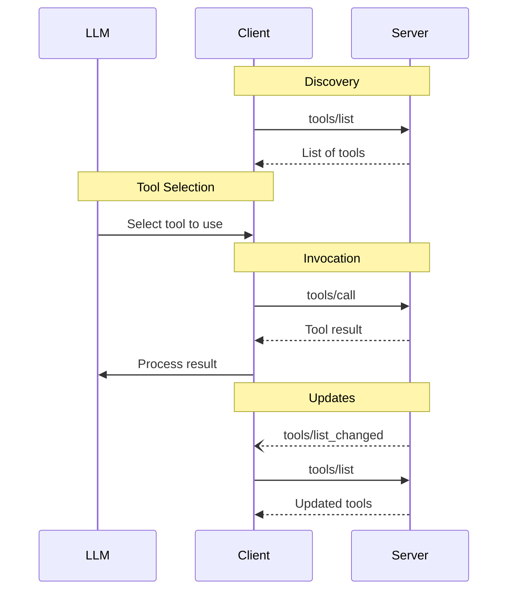
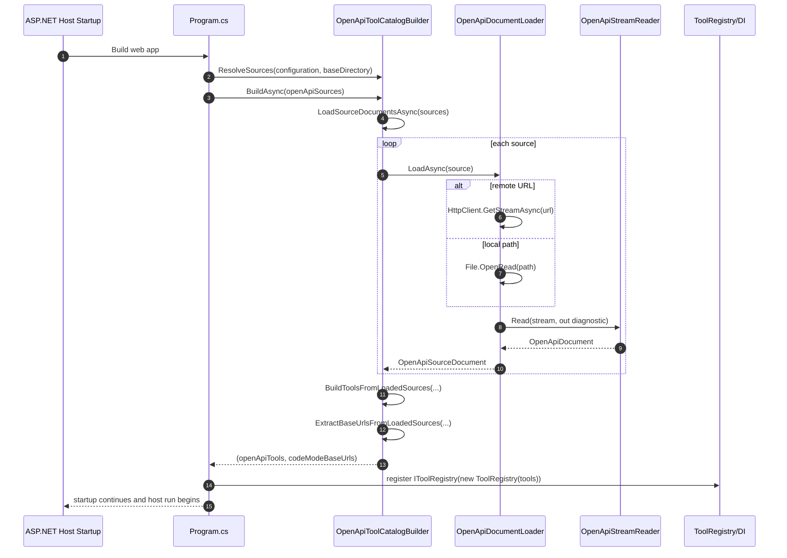
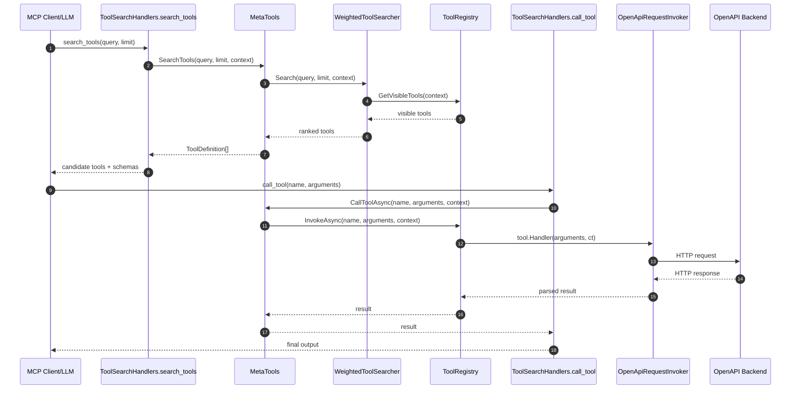
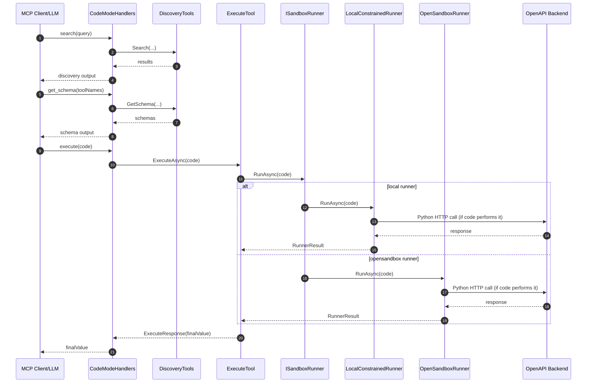
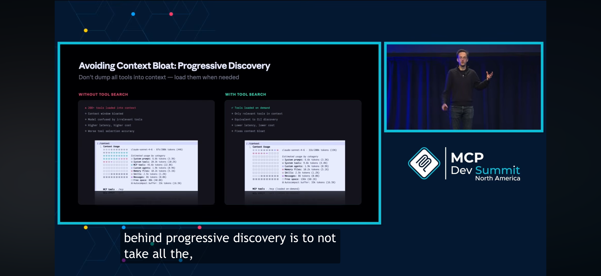
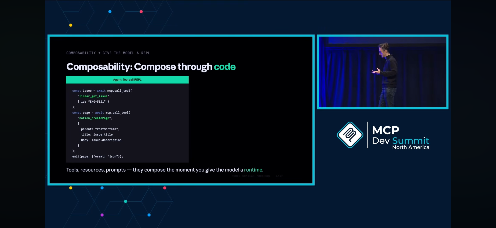

# MCP in the enterprise AI integration

## MCP Traditional Flow

## MCP problems
- Performance and Practical Limitations
  - **Context Window Bloat**: Active MCP servers consume large amounts of tokens to describe their capabilities to the LLM, reducing performance and increasing costs.
  - Operational Complexity: Managing multiple, concurrent local servers is difficult, often leading to debugging challenges and high "context rot".
- Security Vulnerabilities
  - Data Leakage/Exfiltration: Malicious or poorly configured servers can steal or leak sensitive data to third parties.
  - Remote Code Execution (RCE): Unauthenticated users can run arbitrary commands on machines hosting improperly secured MCP servers.
  - Tool Poisoning/Injection: Malicious instructions can be hidden in tool descriptions, manipulating AI agents into taking unauthorized actions (e.g., reading/exfiltrating private files).
  - Excessive Permissions/Credential Theft: MCP servers often access more data than necessary and can steal API keys or passwords.
  - Broken Authentication/Authorization: The protocol lacks strong, built-in security standards, relying on often-weak, inconsistent implementations.
- You name it

## Context reduction strategy

- **Dynamic tool search**: 2 tools - search, call (*)
- Command-line interfaces: OpenClaw (MCPorter), Moltworker
- Client-side Code Mode
  - https://block.github.io/goose/blog/2025/12/15/code-mode-mcp/
  - https://platform.claude.com/docs/en/agents-and-tools/tool-use/programmatic-tool-calling
- **Server-side Code Mode**: 3 tools - search, get_schema and execute(code) (*)

## 1) OpenAPI Specs Load at Startup

## 2) Tool-Search-Tool Calling OpenAPI

## 3) Code Mode Calling OpenAPI (If Code Performs HTTP)

## MCP - roadmap 2026

**MCP Creator Reveals the 2026 Roadmap for AI Agents** by **David Soria Parra**: https://youtu.be/kAVRFYgCPg0?si=467OYBqrZPErmKbj

### Progressive discovery

Ref: https://github.com/modelcontextprotocol/modelcontextprotocol/issues/1821

### Composability via code

## References
- https://www.anthropic.com/engineering/code-execution-with-mcp
- https://www.anthropic.com/engineering/advanced-tool-use
- https://blog.cloudflare.com/code-mode-mcp/
- https://blog.cloudflare.com/code-mode/
- https://nx.dev/blog/why-we-deleted-most-of-our-mcp-tools
- https://docs.spring.io/spring-ai/reference/2.0/guides/dynamic-tool-search.html
