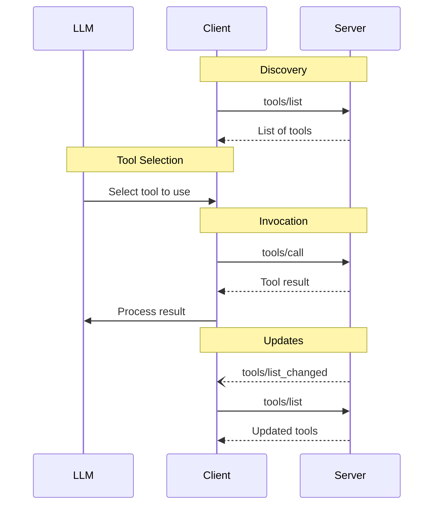
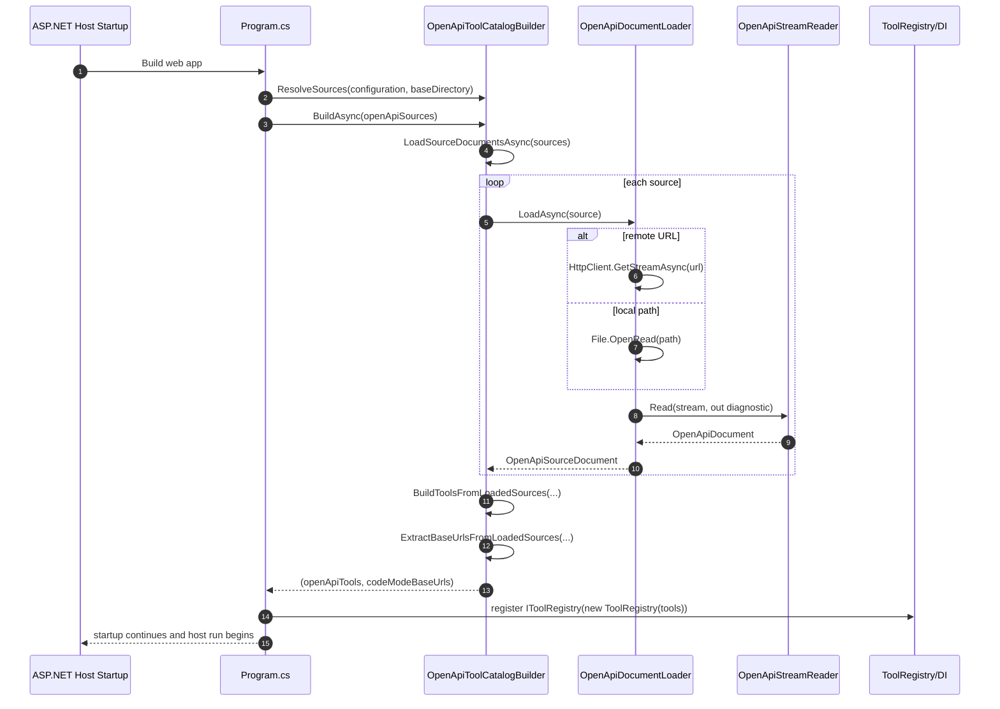
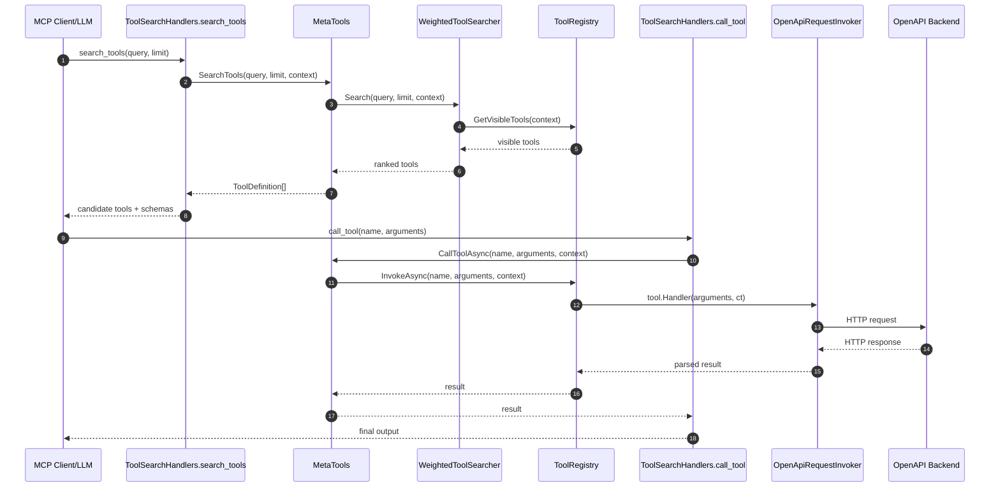
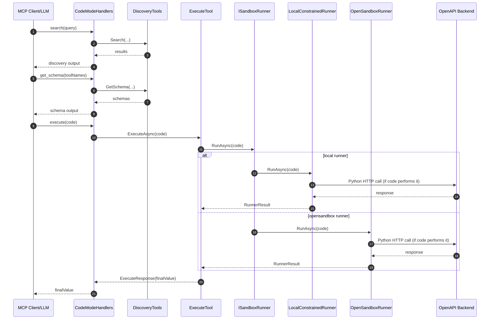

# MCP Experiments Sequence Diagrams

## MCP Traditional Flow

## 1) OpenAPI Specs Load at Startup

## 2) Tool-Search-Tool Calling OpenAPI

## 3) Code Mode Calling OpenAPI (If Code Performs HTTP)

