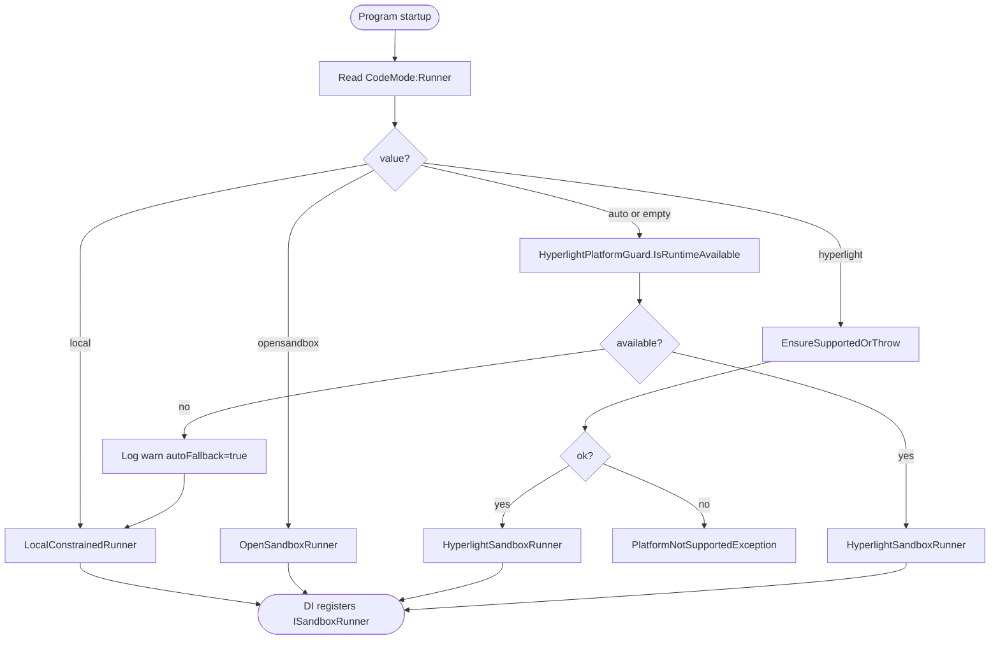
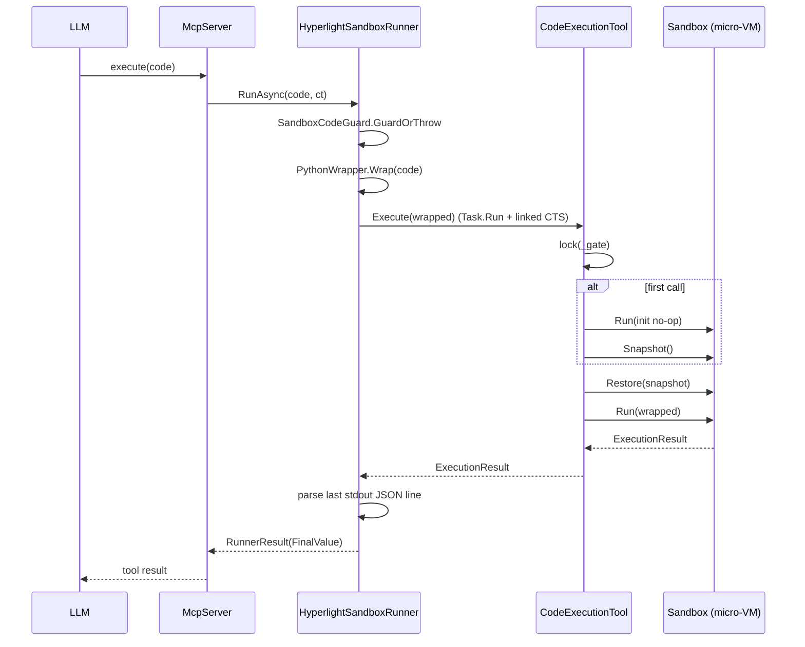
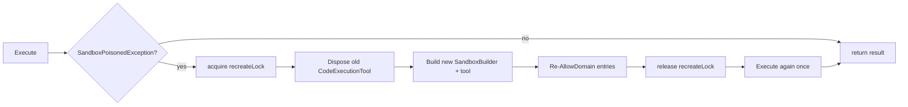
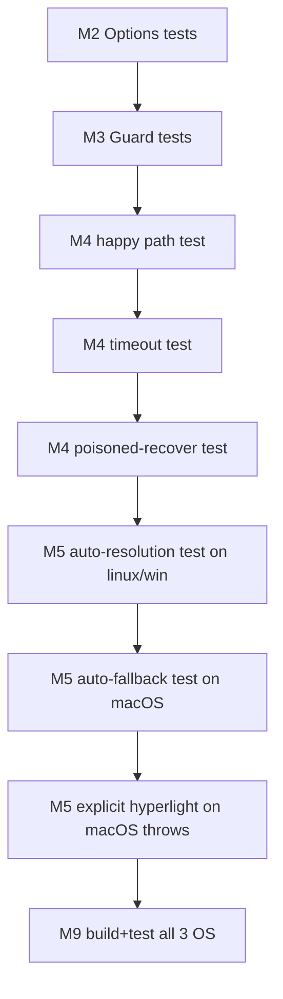
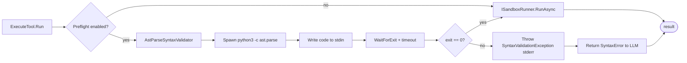
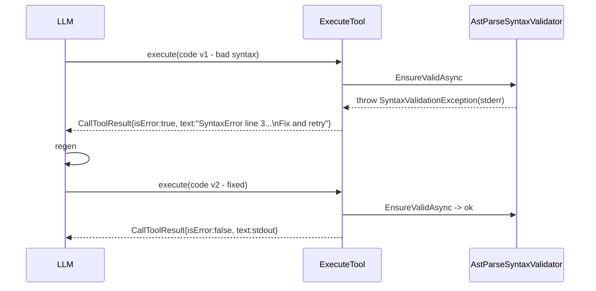
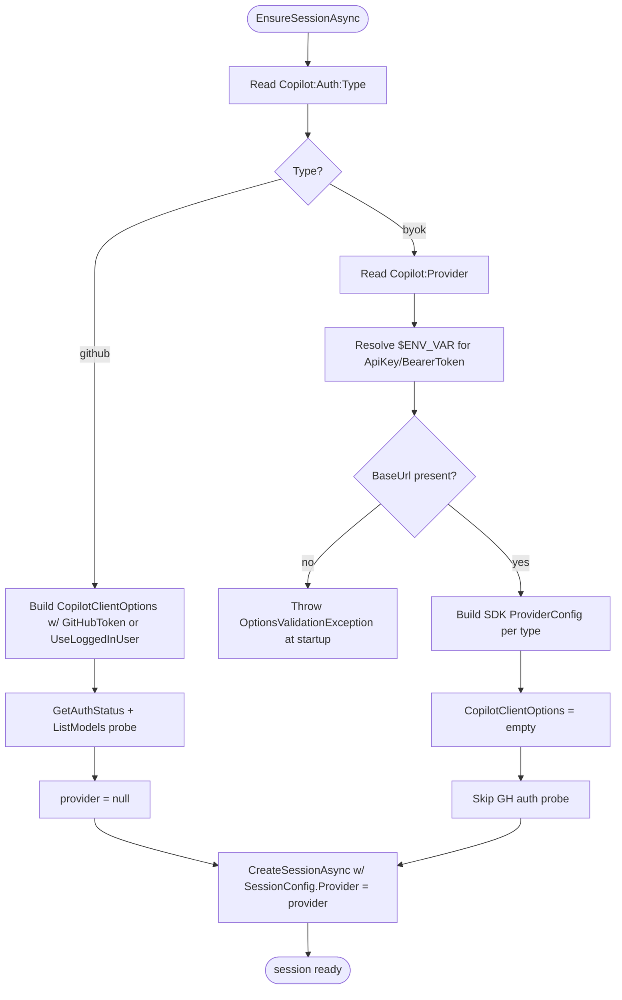

# Plan: Hyperlight Sandbox Provider (default on Linux+Windows)

Date: 2026-05-09 (rev 2)
Mode: caveman
Source: research.md (rev 2)

---

## Milestones & Tracking Checklist

> Tick boxes as work lands. One milestone == one PR ideally. Red-green tests per phase.

- [x] **M0 — Spike**: confirm `Hyperlight.HyperlightSandbox.*` NuGet availability + RIDs (linux-x64, win-x64). No commit.
- [x] **M1 — Project plumbing**: add Hyperlight NuGet refs to `McpServer.csproj` (unconditional). Build still green on linux/win/mac.
- [x] **M2 — Options DTO**: `HyperlightRunnerOptions` + unit tests.
- [x] **M3 — Platform guard**: `HyperlightPlatformGuard` (`IsRuntimeAvailable` + `EnsureSupportedOrThrow`) + unit tests.
- [x] **M4 — Runner**: `HyperlightSandboxRunner` (singleton `CodeExecutionTool`, snapshot/restore, poisoned recovery, timeout) + unit tests.
- [x] **M5 — Factory auto-resolution**: `SandboxRunnerFactory` returns Hyperlight by default on supported platforms; auto-fallback to `local` on macOS / missing hypervisor + tests.
- [x] **M6 — Config + docs**: `appsettings.json` default `CodeMode:Runner=auto`. README platform matrix + WHP enable note. `.github/copilot-instructions.md` updated.
- [x] **M7 — Trace tags**: emit `mcp.sandbox.provider`, `mcp.sandbox.autoFallback`, `mcp.sandbox.poisonedRecover`. Verify in existing trace tests.
- [x] **M8 — CI matrix**: linux-latest + windows-latest runtime tests; macos-latest build + auto-fallback assertion.
- [x] **M9 — Acceptance gate**: `dotnet build` + `dotnet test` green on all 3 OS; `tools/list` diff empty; manual smoke `execute(code)` on Linux + Windows.
- [x] **M10 — Optional `ast.parse` subprocess preflight (OFF by default)**: add `IPythonSyntaxValidator` + `NullSyntaxValidator` + `AstParseSyntaxValidator`; gated by `CodeMode:PreflightSyntaxCheck=true`. NO new NuGet dep — spawns `python3 -c "import ast,sys; ast.parse(sys.stdin.read())"` and pipes user code via stdin. Tests for valid/invalid/timeout. **Failure must surface as `CallToolResult { isError:true, content:stderr+hint }` so MCP agent loop auto-regens code.** See research.md §7b.
- [x] **M11 — BYOK provider for `CopilotChatService`**: add `Copilot:Auth:Type` (`github` default | `openai` | `azure` | `azure-foundry` | `anthropic`) + `Copilot:Provider` block in `appsettings.json`. New `CopilotProviderFactory` builds SDK `ProviderConfig` from config; `CopilotChatService.EnsureSessionAsync` branches on factory output. GitHub path unchanged when type=`github`. Env-var indirection (`${OPENAI_API_KEY}`) for secrets. Skip GH auth probe under BYOK. NO new NuGet. See research.md §7c.
- [x] **M12 — Bench scaffold**: add `tests/McpServer.Benchmarks/` (BDN console, Release-only). pkg: `BenchmarkDotNet`, `Aspire.Hosting.Testing`. ref: `src/McpServer`, `src/AppHost`. wire `Program.Main` -> `BenchmarkSwitcher.FromAssembly(...).Run(args)`. green build only.
- [x] **M13 — Stub HTTP server**: `tests/McpServer.Benchmarks/StubServer/` minimal Kestrel `WebApplication` exposing `/breweries/random`, `/breweries`. `[GlobalSetup]` boots, `[GlobalCleanup]` shuts. deterministic body. no network egress.
- [x] **M14 — Workload catalog**: `WorkloadCatalog.Get(workloadId, style)` -> canned Python strings.
  - workloads: `simple` (random brewery), `complex` (paginated SD + moon).
  - styles: `a_requests` (works on local/opensandbox/hyperlight), `b_http_get` (hyperlight only).
  - exact bodies live in `research.md` §Provider-specific Workloads. unit test: every (workload, style) returns non-empty + parseable Python (use `IronPython` or just regex sanity).
  - guard: `Get(simple, b_http_get)` allowed only when caller declares `RuntimeSupportsHttpGet=true` else throws.
- [x] **M15 — Runner builder for bench**: `RunnerBuilder.Build(name)` thin wrapper over `SandboxRunnerFactory` taking `(IConfiguration, ILoggerFactory)` from a minimal in-proc host. supports `local | hyperlight | opensandbox`. unit test per name returns expected concrete type.
- [x] **M16 — BDN class + jobs**: `CodeModeBench` with `[Params]` Workload (`simple|complex`) + `[Params]` Style (`a_requests|b_http_get`) + `RunnerJobsConfig` (3 jobs by env `MCP_BENCH_RUNNER`). `[MemoryDiagnoser]`, exporters md/json/csv. local + hyperlight jobs run green end-to-end. opensandbox job stubbed (skip if env missing). hyperlight runs both styles; local/opensandbox skip style=b_http_get via category filter.
- [x] **M16a — Stub data fixture for W_complex**: stub serves >= 200 SD breweries across multi-page paginate + ≥ 5 `moon` matches. golden output frozen via `tests/fixtures/expected-complex.json`. [GlobalSetup] verifies first run output matches golden -> bench refuses noisy data.
- [x] **M17 — AppHost bench filter**: AppHost reads `BENCH_ONLY_OPENSANDBOX=true` -> graph trims to `opensandbox-server` resource only. unit test: with flag, AppHost model contains exactly one resource named `opensandbox-server`.
- [x] **M18 — Opensandbox via Aspire test host**: `[GlobalSetup]` (when runner=opensandbox) builds `DistributedApplicationTestingBuilder<Projects.AppHost>(["DcpPublisher:RandomizePorts=false"])`, sets `BENCH_ONLY_OPENSANDBOX=true`, starts app, resolves endpoint+key, sets `SANDBOX_DOMAIN`/`SANDBOX_API_KEY`, builds runner. `[GlobalCleanup]` disposes app. NO `docker compose`. gate by `BENCH_OPENSANDBOX=1` env (skip otherwise).
- [x] **M19 — Cold vs warm split**: 2nd BDN class `CodeModeColdBench` with `[IterationSetup]` recreating runner per iter (hyperlight + opensandbox only). report `AppHostBootMs` separately as a custom column for opensandbox.
- [x] **M20 — E2E bench project**: `tests/McpServer.E2EBenchmarks/` xUnit. `[Theory] InlineData("local"|"hyperlight"|"opensandbox")` -> boots full AppHost with `MCP_CODEMODE_RUNNER` override, `app.CreateHttpClient("mcp-server")`, drives `/codemode/execute` 50x, records p50/p95. one test per runner, opensandbox gated.
- [x] **M21 — PS1 driver**: `scripts/run-benchmarks.ps1`. params: `-Runners`, `-IncludeOpensandbox`. sets `MCP_BENCH_RUNNER` per loop. invokes `dotnet run -c Release` for BDN + `dotnet test -c Release` for e2e. NO docker calls. writes artifacts to `docs/benchmarks/<yyyyMMdd>/`.
- [x] **M22 — Bench report aggregator**: tiny console step inside ps1 that copies `BenchmarkDotNet.Artifacts/results/*.md` + `*.json` into dated folder, emits `summary.md` with baseline=local ratios for hyperlight + opensandbox across W1/W2/W3.
- [x] **M23 — CI bench job (manual trigger)**: GH Actions `bench.yml`, `workflow_dispatch` only. matrix linux/win. local+hyperlight always; opensandbox only when `BENCH_OPENSANDBOX=1` and docker engine available (skip on macOS).
- [x] **M24 — Acceptance gate**: BDN report green for `compute` + `single_http` on all 3 runners locally (opensandbox via Aspire host, no compose). e2e theory passes for all 3. ps1 reproduces full sweep one-shot.

---

## Goal

Add 3rd `ISandboxRunner` = `HyperlightSandboxRunner`. CodeAct via `CodeExecutionTool`. **Default runner on Linux + Windows.** macOS auto-falls back to `local`. Zero public-API change. `local` + `opensandbox` stay as opt-in alternatives.

## Guiding rules (copilot-instructions)

- KISS / YAGNI / DRY / Boy-Scout.
- Red-green tests per scenario.
- Caveman comms.
- Surgical edits only.

---

## Workflow Diagrams (mermaid)

### Runner selection at startup



### Per-request execute lifecycle



### Poisoned sandbox recovery



### Test ladder (red-green by milestone)



---

## Phases (mapped to milestones)

### Phase 0 — Spike (M0)

1. `dotnet add package Hyperlight.HyperlightSandbox.Api --prerelease` in throwaway console.
2. Verify `runtimes/linux-x64/native` + `runtimes/win-x64/native` payload present.
3. Confirm `HyperlightSandbox.Api`, `HyperlightSandbox.Extensions.AI`, `HyperlightSandbox.Guest.Python` namespaces.
4. If not on nuget.org -> document vendor path: git submodule + `just dotnet dist` + `<RestoreSources>`.

Exit: NuGet refs available OR vendoring path documented.

### Phase 1 — Project plumbing (M1)

`src/McpServer/McpServer.csproj`:

```xml
<ItemGroup>
  <PackageReference Include="Hyperlight.HyperlightSandbox.Api"           Version="0.4.0-*" />
  <PackageReference Include="Hyperlight.HyperlightSandbox.Extensions.AI" Version="0.4.0-*" />
  <PackageReference Include="Hyperlight.HyperlightSandbox.Guest.Python"  Version="0.4.0-*" />
</ItemGroup>
```

No conditional gate — Hyperlight is first-class. macOS dev still builds: managed assemblies resolve; native lib never loaded (factory picks `local`).

Red test: `dotnet build` on macOS still green. Green criteria: no `DllNotFoundException` at build/restore.

### Phase 2 — Options DTO (M2)

File: `src/McpServer/CodeMode/Hyperlight/HyperlightRunnerOptions.cs`

```csharp
namespace McpServer.CodeMode.Hyperlight;

public sealed class HyperlightRunnerOptions
{
    public string Backend { get; init; } = "wasm-python";
    public string? GuestModulePath { get; init; }
    public string? HeapSize { get; init; } = "50Mi";
    public string? StackSize { get; init; } = "35Mi";
    public bool UseTempOutput { get; init; } = true;
    public IReadOnlyList<string> AllowedDomains { get; init; } = Array.Empty<string>();
    public TimeSpan Timeout { get; init; } = TimeSpan.FromSeconds(5);
    public int MaxToolCalls { get; init; } = 10;
}
```

Tests: `HyperlightRunnerOptionsTests.Defaults_ApplyExpectedValues`.

### Phase 3 — Platform guard (M3)

File: `src/McpServer/CodeMode/Hyperlight/HyperlightPlatformGuard.cs`

```csharp
using System.Runtime.InteropServices;

namespace McpServer.CodeMode.Hyperlight;

internal static class HyperlightPlatformGuard
{
    public static bool IsRuntimeAvailable()
    {
        if (OperatingSystem.IsMacOS()) return false;
        if (OperatingSystem.IsLinux())   return IsKvmAccessible();
        if (OperatingSystem.IsWindows()) return IsWhpAvailable();
        return false;
    }

    public static void EnsureSupportedOrThrow()
    {
        if (OperatingSystem.IsMacOS())
            throw new PlatformNotSupportedException(
                "Hyperlight runner does not support macOS. Set CodeMode:Runner=local|opensandbox|auto.");

        if (OperatingSystem.IsLinux() && !IsKvmAccessible())
            throw new PlatformNotSupportedException(
                "Hyperlight on Linux requires /dev/kvm (or MSHV).");

        if (OperatingSystem.IsWindows() && !IsWhpAvailable())
            throw new PlatformNotSupportedException(
                "Hyperlight on Windows requires Windows Hypervisor Platform. " +
                "Enable: dism /online /enable-feature /featurename:HypervisorPlatform /all");
    }

    private static bool IsKvmAccessible()
    {
        try { return File.Exists("/dev/kvm"); } catch { return false; }
    }

    private static bool IsWhpAvailable()
    {
        try
        {
            int present = 0;
            uint written = 0;
            int hr = WHvGetCapability(
                WHvCapabilityCodeHypervisorPresent,
                ref present,
                (uint)sizeof(int),
                ref written);
            return hr == 0 && present != 0;
        }
        catch { return false; }
    }

    private const int WHvCapabilityCodeHypervisorPresent = 0x00000000;

    [DllImport("WinHvPlatform.dll", ExactSpelling = true)]
    private static extern int WHvGetCapability(
        int capabilityCode,
        ref int capabilityBuffer,
        uint capabilityBufferSizeInBytes,
        ref uint writtenSizeInBytes);
}
```

Tests:
- `EnsureSupportedOrThrow_ThrowsOnMacOS`.
- `IsRuntimeAvailable_ReturnsFalse_OnMacOS`.
- `EnsureSupportedOrThrow_ThrowsWhenKvmMissing` (linux-only, integration).

### Phase 4 — Runner (M4)

File: `src/McpServer/CodeMode/Hyperlight/HyperlightSandboxRunner.cs`

```csharp
using System.Diagnostics;
using System.Text.Json;
using HyperlightSandbox.Api;
using HyperlightSandbox.Extensions.AI;
using HyperlightSandbox.Guest.Python;

namespace McpServer.CodeMode.Hyperlight;

public sealed class HyperlightSandboxRunner : ISandboxRunner, IAsyncDisposable
{
    private static readonly ActivitySource ActivitySource = new("McpServer.CodeMode.HyperlightSandboxRunner");
    private static readonly JsonSerializerOptions PayloadJson = new() { PropertyNameCaseInsensitive = true };

    private readonly HyperlightRunnerOptions options;
    private readonly ILogger<HyperlightSandboxRunner> logger;
    private readonly Func<CodeExecutionTool> toolFactory;
    private readonly SemaphoreSlim recreateLock = new(1, 1);
    private CodeExecutionTool? tool;

    public string SyntaxGuide =>
        """
        Runner: Hyperlight (Python in Wasm micro-VM)
        Pure Python. Assign final value to lowercase `result`.
        Tool-Search meta-tools forbidden inside code mode.
        HTTP via stdlib urllib or shimmed `requests` (timeout=10).
        Snapshot/restore makes warm calls fast.
        """;

    public HyperlightSandboxRunner(
        HyperlightRunnerOptions options,
        ILoggerFactory loggerFactory,
        Func<CodeExecutionTool>? toolFactory = null)
    {
        ArgumentNullException.ThrowIfNull(options);
        ArgumentNullException.ThrowIfNull(loggerFactory);
        this.options = options;
        this.logger = loggerFactory.CreateLogger<HyperlightSandboxRunner>();
        this.toolFactory = toolFactory ?? BuildDefaultTool;
    }

    public async Task<RunnerResult> RunAsync(string code, CancellationToken ct)
    {
        ArgumentException.ThrowIfNullOrWhiteSpace(code);

        if (SandboxCodeGuard.ContainsForbiddenMetaToolUsage(code))
            throw new InvalidOperationException(
                "Code mode is isolated from tool-Search tools. Use pure Python compute.");

        using Activity? activity = ActivitySource.StartActivity("hyperlight.run", ActivityKind.Internal);
        activity?.SetTag("mcp.code", code);
        activity?.SetTag("mcp.code.length", code.Length);
        activity?.SetTag("mcp.sandbox.provider", "hyperlight");
        activity?.SetTag("mcp.sandbox.backend", options.Backend);

        using CancellationTokenSource timeoutCts = new(options.Timeout);
        using CancellationTokenSource linked = CancellationTokenSource.CreateLinkedTokenSource(ct, timeoutCts.Token);

        string wrapped = PythonWrapper.Wrap(code);

        try
        {
            ExecutionResult exec = await Task.Run(() => ExecuteWithRecover(wrapped), linked.Token);
            return ParseResult(exec, activity);
        }
        catch (OperationCanceledException ex) when (!ct.IsCancellationRequested)
        {
            activity?.SetTag("mcp.Execute.timeout", true);
            throw new TimeoutException(
                $"Hyperlight execution timed out after {options.Timeout.TotalSeconds:0.###}s.", ex);
        }
    }

    private ExecutionResult ExecuteWithRecover(string wrapped)
    {
        try
        {
            return EnsureTool().Execute(wrapped);
        }
        catch (SandboxPoisonedException)
        {
            logger.LogWarning("Hyperlight sandbox poisoned; recreating.");
            RecreateTool();
            using Activity? recover = ActivitySource.StartActivity("hyperlight.recover");
            recover?.SetTag("mcp.sandbox.poisonedRecover", true);
            return EnsureTool().Execute(wrapped);
        }
    }

    private CodeExecutionTool EnsureTool()
    {
        if (tool is not null) return tool;
        recreateLock.Wait();
        try { tool ??= toolFactory(); return tool; }
        finally { recreateLock.Release(); }
    }

    private void RecreateTool()
    {
        recreateLock.Wait();
        try { tool?.Dispose(); tool = toolFactory(); }
        finally { recreateLock.Release(); }
    }

    private CodeExecutionTool BuildDefaultTool()
    {
        SandboxBuilder builder = new SandboxBuilder().WithPythonModule();
        if (!string.IsNullOrWhiteSpace(options.GuestModulePath)) builder = builder.WithModulePath(options.GuestModulePath);
        if (!string.IsNullOrWhiteSpace(options.HeapSize))        builder = builder.WithHeapSize(options.HeapSize);
        if (!string.IsNullOrWhiteSpace(options.StackSize))       builder = builder.WithStackSize(options.StackSize);
        if (options.UseTempOutput)                                builder = builder.WithTempOutput();

        CodeExecutionTool t = new(builder);
        foreach (string domain in options.AllowedDomains) t.AllowDomain(domain);
        return t;
    }

    private RunnerResult ParseResult(ExecutionResult exec, Activity? activity)
    {
        if (!exec.Success)
            throw new InvalidOperationException($"Hyperlight guest exited {exec.ExitCode}. stderr: {exec.Stderr}");

        string? payloadLine = exec.Stdout
            .Split('\n', StringSplitOptions.RemoveEmptyEntries | StringSplitOptions.TrimEntries)
            .LastOrDefault();
        if (string.IsNullOrWhiteSpace(payloadLine))
            throw new InvalidOperationException("Hyperlight execution produced no parseable output.");

        SandboxExecutionPayload? payload = JsonSerializer.Deserialize<SandboxExecutionPayload>(payloadLine, PayloadJson)
            ?? throw new InvalidOperationException("Hyperlight payload empty.");

        if (!payload.Ok)
            throw new InvalidOperationException(
                $"Hyperlight script error: {payload.Error}. {payload.Traceback} {payload.Stderr}");

        object? finalValue = payload.FinalValue
            ?? (string.IsNullOrWhiteSpace(payload.Stdout) ? null : payload.Stdout.TrimEnd());

        activity?.SetTag("mcp.Execute.callCount", 0);
        activity?.SetTag("mcp.Execute.hasFinalValue", finalValue is not null);
        return new RunnerResult(finalValue, 0);
    }

    public ValueTask DisposeAsync()
    {
        tool?.Dispose();
        recreateLock.Dispose();
        return ValueTask.CompletedTask;
    }
}
```

Helper `Hyperlight/PythonWrapper.cs`: extract shared template (DRY) used by Local/OpenSandbox runners. If extraction risks regression, copy verbatim from `OpenSandboxRunner.BuildPythonCommand` and defer DRY. Reuse `OpenSandbox/SandboxExecutionPayload.cs` (move up to `CodeMode/SandboxExecutionPayload.cs` if cross-namespace import is awkward).

Tests (`tests/.../CodeMode/Hyperlight/HyperlightSandboxRunnerTests.cs`):
1. `RunAsync_ReturnsFinalValue_WhenCodeAssignsResult` (skip on macOS + no hypervisor).
2. `RunAsync_ThrowsOnMetaToolUsage`.
3. `RunAsync_TimesOut_WhenExceedingConfiguredTimeout`.
4. `RunAsync_RecoversAfterPoisonedException` (inject fake `Func<CodeExecutionTool>`; first call throws, second succeeds).
5. `DisposeAsync_DisposesUnderlyingTool`.

Skip helper:
```csharp
[SkippableFact]
public async Task RunAsync_ReturnsFinalValue()
{
    Skip.IfNot(HyperlightPlatformGuard.IsRuntimeAvailable());
    // arrange + act + assert
}
```

### Phase 5 — Factory auto-resolution (M5)

`src/McpServer/CodeMode/SandboxRunnerFactory.cs`:

```csharp
public static ISandboxRunner Create(
    IConfiguration configuration,
    ILoggerFactory loggerFactory,
    IReadOnlyList<string>? allowedBaseUrls = null)
{
    ArgumentNullException.ThrowIfNull(configuration);
    ArgumentNullException.ThrowIfNull(loggerFactory);

    string requested = configuration["CodeMode:Runner"]?.Trim() ?? "auto";
    ILogger log = loggerFactory.CreateLogger("SandboxRunnerFactory");

    string resolved = requested.ToLowerInvariant() switch
    {
        "auto" or "" => HyperlightPlatformGuard.IsRuntimeAvailable() ? "hyperlight" : LogFallback(log),
        _ => requested.ToLowerInvariant()
    };

    return resolved switch
    {
        "hyperlight"  => CreateHyperlight(configuration, loggerFactory, allowedBaseUrls),
        "opensandbox" => CreateOpenSandbox(configuration, loggerFactory),
        _             => CreateLocal(configuration, loggerFactory, allowedBaseUrls),
    };
}

private static string LogFallback(ILogger log)
{
    log.LogWarning(
        "Hyperlight runtime unavailable on this host (macOS or missing hypervisor); falling back to LocalConstrainedRunner. " +
        "Override with CodeMode:Runner=hyperlight|local|opensandbox.");
    return "local";
}

private static ISandboxRunner CreateHyperlight(
    IConfiguration configuration,
    ILoggerFactory loggerFactory,
    IReadOnlyList<string>? allowedBaseUrls)
{
    HyperlightPlatformGuard.EnsureSupportedOrThrow();

    HyperlightRunnerOptions opts = new()
    {
        Backend         = configuration["Hyperlight:Backend"] ?? "wasm-python",
        GuestModulePath = configuration["Hyperlight:GuestModulePath"],
        HeapSize        = configuration["Hyperlight:HeapSize"] ?? "50Mi",
        StackSize       = configuration["Hyperlight:StackSize"] ?? "35Mi",
        UseTempOutput   = configuration.GetValue("Hyperlight:UseTempOutput", true),
        AllowedDomains  = configuration.GetSection("Hyperlight:AllowedDomains").Get<string[]>()
                          ?? (allowedBaseUrls ?? Array.Empty<string>()).ToArray(),
        Timeout         = TimeSpan.FromMilliseconds(configuration.GetValue("CodeMode:TimeoutMs", 5000)),
        MaxToolCalls    = configuration.GetValue("CodeMode:MaxToolCalls", 10),
    };
    return new HyperlightSandboxRunner(opts, loggerFactory);
}
```

Tests (`SandboxRunnerFactoryAutoTests`):
- `Create_ReturnsHyperlight_WhenRuntimeAvailable_AndAuto` (skip if not available).
- `Create_FallsBackToLocal_OnMacOS_WhenAuto`.
- `Create_Throws_WhenExplicitHyperlightOnUnsupported`.
- `Create_ReturnsLocal_WhenExplicitLocal`.
- `Create_ReturnsOpenSandbox_WhenExplicitOpensandboxAndConfigured`.

### Phase 6 — Config + docs (M6)

`src/McpServer/appsettings.json`:
```json
{
  "CodeMode": { "Runner": "auto", "TimeoutMs": 5000, "MaxToolCalls": 10 },
  "Hyperlight": {
    "Backend": "wasm-python",
    "HeapSize": "50Mi",
    "StackSize": "35Mi",
    "UseTempOutput": true
  }
}
```

`README.md` new section "Sandbox runners":
- Default = `auto` -> `hyperlight` on Linux/Windows with hypervisor; `local` on macOS / missing hypervisor.
- Platform matrix (copy from research.md §4).
- Windows enable WHP: `dism /online /enable-feature /featurename:HypervisorPlatform /all` then reboot.
- Linux enable KVM: ensure `/dev/kvm` exists + group `kvm` membership.

`.github/copilot-instructions.md` patch: note default sandbox = Hyperlight.

### Phase 7 — Trace tags (M7)

Tags emitted:
- `mcp.sandbox.provider` (`hyperlight` | `local` | `opensandbox`)
- `mcp.sandbox.backend` (`wasm-python` etc.)
- `mcp.sandbox.autoFallback` (true when factory auto-fell back)
- `mcp.sandbox.poisonedRecover` (true on recovery path)
- `mcp.code`, `mcp.code.length`
- `mcp.Execute.callCount`, `mcp.Execute.hasFinalValue`, `mcp.Execute.timeout`

### Phase 8 — CI matrix (M8)

`.github/workflows/*.yml`:
- linux-latest: `dotnet build` + `dotnet test`. Hyperlight integration tests skip if `/dev/kvm` not exposed.
- windows-latest: `dotnet build` + `dotnet test`. Hyperlight integration tests skip if WHP probe fails.
- macos-latest: `dotnet build` + `dotnet test`. Assert factory auto-falls back to `local`.

### Phase 9 — Acceptance gate (M9)

- `dotnet build` green on all 3 OS (no flag needed).
- `dotnet test` green on all 3 OS.
- macOS: factory auto-resolves to `local`; one warn log.
- Linux + Windows (with hypervisor): factory auto-resolves to `hyperlight`; smoke `execute(code)` returns `result` value.
- `tools/list` JSON diff vs main = empty.
- Existing local + opensandbox tests untouched and green.

---

## File delta summary

Add:
- `src/McpServer/CodeMode/Hyperlight/HyperlightRunnerOptions.cs`
- `src/McpServer/CodeMode/Hyperlight/HyperlightPlatformGuard.cs`
- `src/McpServer/CodeMode/Hyperlight/HyperlightSandboxRunner.cs`
- `src/McpServer/CodeMode/Hyperlight/PythonWrapper.cs` (optional DRY pull)
- `tests/McpServer.UnitTests/CodeMode/Hyperlight/HyperlightSandboxRunnerTests.cs`
- `tests/McpServer.UnitTests/CodeMode/Hyperlight/HyperlightPlatformGuardTests.cs`
- `tests/McpServer.UnitTests/CodeMode/SandboxRunnerFactoryAutoTests.cs`

Edit:
- `src/McpServer/CodeMode/SandboxRunnerFactory.cs` (auto + branch)
- `src/McpServer/McpServer.csproj` (Hyperlight NuGets, unconditional)
- `src/McpServer/appsettings.json` (`CodeMode:Runner=auto` + Hyperlight defaults)
- `README.md` (Hyperlight default + platform matrix + WHP/KVM enable)
- `.github/copilot-instructions.md` (default sandbox note)

Do NOT touch:
- `ISandboxRunner.cs`
- `ExecuteTool.cs`
- `DiscoveryTools.cs`, `CodeModeHandlers.cs`, `SandboxCodeGuard.cs`
- ToolSearch / Registry / Search / OpenAPI / Cli

---

## Open items to confirm during M0

1. NuGet ID + version of `Hyperlight.HyperlightSandbox.*` actually published.
2. RIDs shipped: linux-x64 + win-x64 mandatory; arm64 nice-to-have; macOS absent OK.
3. Whether `Sandbox.RunAsync` honors `CancellationToken` for hard cancel mid-guest.
4. Windows WHP P/Invoke signature (`WHvGetCapability`) stable.

---

## Phase 10 — Optional `ast.parse` subprocess preflight (M10)

**Default OFF.** Zero new NuGet deps. Spawns the same `python3` already required by Local runner.

### Why this approach (caveman)

- No `Python.Runtime`, no GIL, no `Runtime.PythonDLL` setup.
- Same Python binary that Local runner uses → grammar match for that runner; for Hyperlight/OpenSandbox host vs guest drift = acceptable noise.
- ~30–50ms cold subprocess; cheaper than letting bad code boot a sandbox.
- Pure additive; flip flag off and it disappears.

### Workflow



### Files

Add:
- `src/McpServer/CodeMode/Validation/IPythonSyntaxValidator.cs`
  ```csharp
  public interface IPythonSyntaxValidator
  {
      Task EnsureValidAsync(string code, CancellationToken ct);
  }
  public sealed class SyntaxValidationException : Exception
  {
      public SyntaxValidationException(string message, Exception? inner = null) : base(message, inner) {}
  }
  ```
- `src/McpServer/CodeMode/Validation/PreflightOptions.cs`
  ```csharp
  public sealed class PreflightOptions
  {
      public bool Enabled { get; init; } = false;
      public string PythonPath { get; init; } = OperatingSystem.IsWindows() ? "python" : "python3";
      public TimeSpan Timeout { get; init; } = TimeSpan.FromSeconds(2);
  }
  ```
- `src/McpServer/CodeMode/Validation/NullSyntaxValidator.cs`
  ```csharp
  public sealed class NullSyntaxValidator : IPythonSyntaxValidator
  {
      public Task EnsureValidAsync(string code, CancellationToken ct) => Task.CompletedTask;
  }
  ```
- `src/McpServer/CodeMode/Validation/AstParseSyntaxValidator.cs`
  ```csharp
  public sealed class AstParseSyntaxValidator : IPythonSyntaxValidator
  {
      private const string PreflightScript = "import ast,sys; ast.parse(sys.stdin.read())";
      private readonly PreflightOptions options;
      private readonly ILogger<AstParseSyntaxValidator> logger;

      public AstParseSyntaxValidator(PreflightOptions options, ILoggerFactory loggerFactory)
      {
          this.options = options;
          this.logger = loggerFactory.CreateLogger<AstParseSyntaxValidator>();
      }

      public async Task EnsureValidAsync(string code, CancellationToken ct)
      {
          ArgumentException.ThrowIfNullOrWhiteSpace(code);

          using var activity = ActivitySource.StartActivity("preflight.astparse");
          activity?.SetTag("mcp.preflight.enabled", true);

          var psi = new ProcessStartInfo(options.PythonPath, $"-c \"{PreflightScript}\"")
          {
              RedirectStandardInput = true,
              RedirectStandardError = true,
              RedirectStandardOutput = true,
              UseShellExecute = false,
              CreateNoWindow = true,
          };

          using var proc = Process.Start(psi) ?? throw new InvalidOperationException("Failed to start python preflight.");
          using var timeoutCts = new CancellationTokenSource(options.Timeout);
          using var linked = CancellationTokenSource.CreateLinkedTokenSource(ct, timeoutCts.Token);

          try
          {
              await proc.StandardInput.WriteAsync(code.AsMemory(), linked.Token);
              proc.StandardInput.Close();
              await proc.WaitForExitAsync(linked.Token);
          }
          catch (OperationCanceledException) when (timeoutCts.IsCancellationRequested)
          {
              try { proc.Kill(entireProcessTree: true); } catch { }
              throw new SyntaxValidationException($"Python preflight timed out after {options.Timeout.TotalSeconds:0.###}s.");
          }

          if (proc.ExitCode != 0)
          {
              string stderr = await proc.StandardError.ReadToEndAsync(ct);
              activity?.SetTag("mcp.preflight.failed", true);
              throw new SyntaxValidationException($"Python syntax error: {stderr.Trim()}");
          }
          activity?.SetTag("mcp.preflight.passed", true);
      }
  }
  ```
- `tests/McpServer.UnitTests/CodeMode/Validation/AstParseSyntaxValidatorTests.cs`:
  - `EnsureValidAsync_Passes_OnValidPython`
  - `EnsureValidAsync_Throws_OnInvalidPython` (e.g. `"def ("`).
  - `EnsureValidAsync_Throws_OnTimeout` (use script `while True: pass` indirectly — but `ast.parse` doesn't execute, so timeout test uses fake `python` path or huge input).
  - `NullSyntaxValidator_Always_Passes`.
  - All `[SkippableFact]` if `python3`/`python` not on PATH.

Edit:
- `src/McpServer/CodeMode/ExecuteTool.cs`:
  ```csharp
  try
  {
      await syntaxValidator.EnsureValidAsync(code, ct);
  }
  catch (SyntaxValidationException ex)
  {
      // MUST be tool-level error, NOT transport exception.
      // MCP agent clients loop on isError:true and feed the content back to the LLM,
      // which then regenerates the code. Transport failure = opaque error = bad regen.
      return new CallToolResult
      {
          IsError = true,
          Content = [ new TextContentBlock {
              Text = ex.Message + "\n\nFix the Python syntax and call execute again."
          }],
      };
  }
  return await runner.RunAsync(code, ct);
  ```
- `src/McpServer/Program.cs`:
  ```csharp
  bool preflight = configuration.GetValue("CodeMode:PreflightSyntaxCheck", false);
  if (preflight)
  {
      var opts = new PreflightOptions
      {
          Enabled    = true,
          PythonPath = configuration["CodeMode:Preflight:PythonPath"]
                       ?? (OperatingSystem.IsWindows() ? "python" : "python3"),
          Timeout    = TimeSpan.FromMilliseconds(configuration.GetValue("CodeMode:Preflight:TimeoutMs", 2000)),
      };
      services.AddSingleton(opts);
      services.AddSingleton<IPythonSyntaxValidator, AstParseSyntaxValidator>();
  }
  else
  {
      services.AddSingleton<IPythonSyntaxValidator, NullSyntaxValidator>();
  }
  ```
- `src/McpServer/appsettings.json`:
  ```json
  "CodeMode": {
    "PreflightSyntaxCheck": false,
    "Preflight": { "PythonPath": "python3", "TimeoutMs": 2000 }
  }
  ```
- `README.md`: opt-in note + PATH requirement.

Do NOT touch: `ISandboxRunner.cs`, runner impls, `SandboxCodeGuard.cs`, `McpServer.csproj` (no NuGet).

### Trace tags

- `mcp.preflight.enabled`
- `mcp.preflight.passed`
- `mcp.preflight.failed`
- `mcp.preflight.durationMs`
- `mcp.preflight.python` (configured `PythonPath`)

### Agent Feedback Loop

Preflight failure path **must** return MCP tool-level error so client loop regenerates code:



No new wiring. Standard MCP agent behavior on `isError:true`. Document in README that hosts SHOULD set client-side max-retry (3–5).

### Acceptance

- Default build + run: validator = `NullSyntaxValidator`; zero behavioral change vs current.
- Flag on, valid Python: passes through to runner; trace shows `passed=true`.
- Flag on, invalid Python (e.g. `def (`): runner NOT called; tool returns `CallToolResult{isError:true}` with stderr + retry hint in `content`.
- **Loop test**: integration test asserts that two sequential `execute` calls (bad → good) succeed end-to-end with the bad call returning `isError:true` and good call returning `isError:false`.
- Flag on, missing `python3`: ctor or first call surfaces clear `Win32Exception` / startup error — documented in README.
- Timeout honored: hung child killed within `Preflight:TimeoutMs`.
- All existing tests green with flag off.
- No new NuGet PackageReference in `McpServer.csproj`.

### Open items for M10

- Decide PATH override per-OS in CI (Windows uses `python` or `py -3`).
- Decide whether to pool a long-lived `python3` worker (pipe many programs through one process) once profiling justifies it. YAGNI v1.
- Confirm that piping via stdin handles non-ASCII / large code (>64KB) without deadlock — use async writes (already in sketch).

---

## Bottom line

One folder, three small files, one factory branch, one csproj edit, README + appsettings tweak. **Hyperlight = default on Linux+Windows.** macOS auto-falls back to `local` with a warn log. Snapshot-restore is the win. Architecture untouched; revert = config flip. `ast.parse` subprocess preflight = optional M10, no new NuGet, off by default. **BYOK provider = optional M11**, no new NuGet, default unchanged (`Auth:Type=github`); flip one key in appsettings to point at OpenAI / Azure / Foundry / Anthropic / Ollama.

---

## Phase 11 — BYOK provider for `CopilotChatService` (M11)

Spec source: [github/copilot-sdk byok.md](https://github.com/github/copilot-sdk/blob/main/docs/auth/byok.md). Existing code: `src/McpServer/Services/CopilotChatService.cs` only wires `GitHubToken` / `UseLoggedInUser`.

### Goal

Additive auth path. Config-driven. Default behavior unchanged. Pseudo-code only here — no impl.

### Workflow



### Files

Add:
- `src/McpServer/Services/CopilotAuthOptions.cs`:
  ```csharp
  public enum CopilotAuthType { Github, OpenAI, Azure, AzureFoundry, Anthropic }

  public sealed class CopilotAuthOptions
  {
      public const string SectionName = "Copilot:Auth";
      public CopilotAuthType Type { get; init; } = CopilotAuthType.Github;
  }
  ```
- `src/McpServer/Services/CopilotProviderOptions.cs`:
  ```csharp
  public sealed class CopilotProviderOptions
  {
      public const string SectionName = "Copilot:Provider";
      public string?  BaseUrl     { get; init; }
      public string?  ApiKey      { get; init; }   // supports ${ENV} indirection
      public string?  BearerToken { get; init; }   // supports ${ENV} indirection
      public string?  WireApi     { get; init; }   // completions | responses
      public AzureProviderOptions Azure { get; init; } = new();
  }
  public sealed class AzureProviderOptions
  {
      public string ApiVersion { get; init; } = "2024-10-21";
  }
  ```
- `src/McpServer/Services/CopilotProviderFactory.cs`:
  ```csharp
  internal static class CopilotProviderFactory
  {
      public static ProviderConfig? Build(CopilotAuthOptions auth, CopilotProviderOptions p)
      {
          if (auth.Type == CopilotAuthType.Github) return null; // GH path -> no provider

          if (string.IsNullOrWhiteSpace(p.BaseUrl))
              throw new OptionsValidationException(
                  typeof(CopilotProviderOptions).Name,
                  new[] { nameof(p.BaseUrl) },
                  new[] { "Copilot:Provider:BaseUrl is required when Copilot:Auth:Type != github." });

          var key    = ResolveSecret(p.ApiKey);
          var bearer = ResolveSecret(p.BearerToken);

          return auth.Type switch
          {
              CopilotAuthType.OpenAI       => new ProviderConfig { Type="openai",    BaseUrl=p.BaseUrl, ApiKey=key, BearerToken=bearer, WireApi=p.WireApi ?? "completions" },
              CopilotAuthType.Azure        => new ProviderConfig { Type="azure",     BaseUrl=p.BaseUrl, ApiKey=key, AzureApiVersion=p.Azure.ApiVersion },
              CopilotAuthType.AzureFoundry => new ProviderConfig { Type="openai",    BaseUrl=p.BaseUrl, ApiKey=key, WireApi=p.WireApi ?? "responses" },
              CopilotAuthType.Anthropic    => new ProviderConfig { Type="anthropic", BaseUrl=p.BaseUrl, ApiKey=key },
              _ => throw new InvalidOperationException($"Unsupported BYOK auth type: {auth.Type}"),
          };
      }

      // Empty/null -> null. "${VAR}" -> Environment.GetEnvironmentVariable("VAR")
      // (throw if VAR missing). Plain literal -> returned as-is.
      private static string? ResolveSecret(string? raw) { /* regex ^\$\{(\w+)\}$ */ }
  }
  ```
- `tests/McpServer.UnitTests/Services/CopilotProviderFactoryTests.cs`:
  - `Build_Returns_Null_For_Github`
  - `Build_Maps_OpenAI_Defaults_WireApi_To_Completions`
  - `Build_Maps_Azure_With_ApiVersion`
  - `Build_Maps_AzureFoundry_With_WireApi_Responses`
  - `Build_Maps_Anthropic`
  - `Build_Throws_When_BaseUrl_Missing`
  - `Build_Resolves_EnvVar_Indirection`
  - `Build_Throws_When_EnvVar_Missing`

Edit:
- `src/McpServer/Services/CopilotChatService.cs`:
  ```csharp
  // ctor: replace single string field with options.
  public CopilotChatService(
      IConfiguration configuration,
      IOptions<CopilotAuthOptions> auth,
      IOptions<CopilotProviderOptions> provider,
      ILogger<CopilotChatService> logger)
  { ... this.authOptions = auth.Value; this.providerOptions = provider.Value; ... }

  // EnsureSessionAsync: derive provider once, branch on null.
  ProviderConfig? provider = CopilotProviderFactory.Build(authOptions, providerOptions);

  if (client is null)
  {
      CopilotClientOptions opts = provider is null
          ? new CopilotClientOptions { GitHubToken = gitHubToken, UseLoggedInUser = string.IsNullOrWhiteSpace(gitHubToken) }
          : new CopilotClientOptions(); // BYOK: no GH auth on client
      client = new CopilotClient(opts);
      await client.StartAsync(ct);

      if (provider is null)
      {
          ValidateConfiguredToken(gitHubToken);
          var auth = await client.GetAuthStatusAsync(ct);
          if (!auth.IsAuthenticated) throw new InvalidOperationException("...");
          await client.ListModelsAsync(ct);
      }
      // else: BYOK -- skip GH probe, let session creation surface provider errors.
  }

  SessionConfig config = new()
  {
      Model    = model,
      Provider = provider,            // <-- new
      OnPermissionRequest = PermissionHandler.ApproveAll,
      SystemMessage = ...,
      McpServers    = BuildMcpServerConfig(),
  };
  ```
- `src/McpServer/Program.cs`:
  ```csharp
  builder.Services.Configure<CopilotAuthOptions>(builder.Configuration.GetSection("Copilot:Auth"));
  builder.Services.Configure<CopilotProviderOptions>(builder.Configuration.GetSection("Copilot:Provider"));
  builder.Services.AddSingleton<CopilotChatService>(); // already exists
  ```
- `src/McpServer/appsettings.json`:
  ```json
  "Copilot": {
    "Model": "gpt-5",
    "Auth":   { "Type": "github" },
    "Provider": {
      "BaseUrl":     null,
      "ApiKey":      null,
      "BearerToken": null,
      "WireApi":     null,
      "Azure":       { "ApiVersion": "2024-10-21" }
    }
  }
  ```
- `README.md`: BYOK matrix table + 4 examples (OpenAI, Azure native, Azure Foundry, Anthropic, Ollama) + env-var indirection note.

Do NOT touch: MCP transport, runners, preflight, OpenAPI loader, code-mode tools.

### Trace tags

- `copilot.auth.type`           (`github` | `openai` | `azure` | `azure-foundry` | `anthropic`)
- `copilot.provider.baseUrl`    (host only — strip path + query before tagging)
- `copilot.provider.wireApi`    (`completions` | `responses` | absent)
- `copilot.byok.credential`     (`apiKey` | `bearerToken` | `none`)

Secrets NEVER tagged or logged.

### Acceptance

- Default config (`Auth:Type=github`): zero behavioral change. All existing tests green.
- `Auth:Type=openai` + valid `BaseUrl` + `${OPENAI_API_KEY}` env set: `/chat/send` succeeds with no GH auth probe (verify via log absence + trace tag `copilot.auth.type=openai`).
- `Auth:Type=azure-foundry`: factory emits `ProviderConfig{type=openai, wireApi=responses}` regardless of `Provider:WireApi`.
- `Auth:Type=openai` + missing `BaseUrl`: app fails at startup with clear `OptionsValidationException`.
- `${MISSING_ENV}` indirection: throws at startup, not at first request.
- Unit tests cover all 5 type mappings + 2 error paths + env-var resolution.
- No secrets in logs/traces (verify via log capture in tests).
- No new `PackageReference` in `McpServer.csproj`.

### Open items for M11

- `ProviderConfig` exact field names on .NET SDK (`AzureApiVersion` vs `Azure.ApiVersion`) — confirm at impl time against SDK 0.2.1+.
- Decide whether to expose `OnListModels` callback for BYOK custom model listing (YAGNI v1; document as M11+).
- README guidance on Foundry Local dynamic port (`foundry service status`).

---


---

# Provider Benchmark Plan (caveman)

## scope
bench three runners: local, opensandbox, hyperlight. micro + e2e. no LLM in loop.

## projects to add
1. tests/McpServer.Benchmarks/ (console, net10, Release)
   - pkg: BenchmarkDotNet, Aspire.Hosting.Testing
   - ref: src/McpServer, src/AppHost (Projects.AppHost)
2. tests/McpServer.E2EBenchmarks/ (xUnit)
   - pkg: Aspire.Hosting.Testing, BenchmarkDotNet, xunit
   - ref: src/AppHost (Projects.AppHost), src/McpServer (for client types)
3. scripts/run-benchmarks.ps1
4. tests/McpServer.Benchmarks/StubServer/ (kestrel mini api: /breweries/random etc) for deterministic HTTP

## orchestration model (NO docker compose)
- single source of truth = AppHost. opensandbox container is already declared there as a resource.
- BDN harness uses `DistributedApplicationTestingBuilder<Projects.AppHost>` ONLY when runner=opensandbox.
  - lifecycle owned by Aspire test host: starts container resource, exposes endpoint, tears down on dispose.
  - bench reads `SANDBOX_DOMAIN` / `SANDBOX_API_KEY` from resource env / connection string and feeds them into in-proc `OpenSandboxRunner`.
- runner=local | hyperlight: skip apphost entirely. construct runner directly via `SandboxRunnerFactory`. zero container cost.
- no `docker compose` invocation anywhere. no compose yaml dependency in bench path.
- fallback option (documented, not used by default): Testcontainers .NET, if AppHost path is undesired in CI.

## workflow
1. dev runs `dotnet run -c Release --project tests/McpServer.Benchmarks -- --filter *` -> BDN spins jobs per runner.
2. opensandbox path: BDN `[GlobalSetup]` boots AppHost via `DistributedApplicationTestingBuilder`, waits opensandbox resource healthy, captures endpoint+key into env vars, then bench loop runs in-proc against it. `[GlobalCleanup]` disposes app -> container stopped.
3. hyperlight path: in-proc, nothing to prestart.
4. local path: in-proc, nothing to prestart.
5. e2e path: `dotnet test tests/McpServer.E2EBenchmarks` -> xUnit per provider, each test starts AppHost via `DistributedApplicationTestingBuilder` with `MCP_CODEMODE_RUNNER=<name>` env override, then drives Execute, captures timings.

## micro bench design (BDN)
- one BenchmarkClass with [Params] for workload + style.
- [Params] WorkloadId in {simple, complex}
- [Params] Style in {a_requests, b_http_get}
- skip cell when (runner != hyperlight AND Style == b_http_get) -> mark `[BenchmarkCategory("hyperlight-only")]`, filter via job.
- Job-per-runner via custom IConfig:
  - Job.Default.WithId("local").WithEnv("MCP_BENCH_RUNNER","local")
  - Job.Default.WithId("hyperlight").WithEnv("MCP_BENCH_RUNNER","hyperlight")
  - Job.Default.WithId("opensandbox").WithEnv("MCP_BENCH_RUNNER","opensandbox")
- [GlobalSetup] reads env, builds ISandboxRunner via SandboxRunnerFactory, picks canned Python from `WorkloadCatalog.Get(WorkloadId, Style)`.
- [Benchmark] calls `runner.RunAsync(code, ct).GetAwaiter().GetResult()`
- [GlobalCleanup] disposes runner.
- enable [MemoryDiagnoser], [ThreadingDiagnoser]. exporters: Markdown, Json, Csv.
- ColdRun variant: use [IterationSetup] to recreate runner each iter (only for cold-bench class).

## e2e bench design (Aspire test host)
- one [Theory] with InlineData for runner names.
- per test:
  1. builder = await DistributedApplicationTestingBuilder.CreateAsync<Projects.AppHost>(args, configure)
  2. set env override: MCP_CODEMODE_RUNNER, plus disable randomize if needed
  3. await builder.BuildAsync().StartAsync()
  4. http = app.CreateHttpClient("mcp-server")
  5. wait for resource healthy
  6. POST /codemode/execute (or call MCP tool directly) with canned snippet; loop N times; record stopwatch, p50, p95.
  7. await app.DisposeAsync()

## pseudo-code: micro bench class
```
[MemoryDiagnoser]
[Config(typeof(RunnerJobsConfig))]
public class CodeModeBench
{
    private ISandboxRunner runner = default!;
    private string code = "";

    [Params("compute","single_http","chained_http")]
    public string Workload;

    private DistributedApplication? app;

    [GlobalSetup]
    public async Task Setup()
    {
        var name = Environment.GetEnvironmentVariable("MCP_BENCH_RUNNER") ?? "local";
        if (name == "opensandbox")
        {
            var builder = await DistributedApplicationTestingBuilder.CreateAsync<Projects.AppHost>(
                args: ["DcpPublisher:RandomizePorts=false"],
                configureBuilder: (opt, host) => {
                    // limit graph: only opensandbox-server resource needed by bench
                    host.Configuration["BENCH_ONLY_OPENSANDBOX"] = "true";
                });
            app = await builder.BuildAsync().StartAsync();
            var ep = await app.GetEndpointAsync("opensandbox-server");
            Environment.SetEnvironmentVariable("SANDBOX_DOMAIN", ep.Url);
            Environment.SetEnvironmentVariable("SANDBOX_API_KEY", await app.GetSecretAsync("opensandbox-key"));
        }
        runner = RunnerBuilder.Build(name); // wraps SandboxRunnerFactory
        code = WorkloadCatalog.Get(Workload);
    }

    [Benchmark]
    public async Task<object?> Execute()
    {
        var r = await runner.RunAsync(code, CancellationToken.None);
        return r.FinalValue;
    }

    [GlobalCleanup]
    public async Task Teardown()
    {
        (runner as IDisposable)?.Dispose();
        if (app is not null) await app.DisposeAsync();
    }
}

class RunnerJobsConfig : ManualConfig
{
    public RunnerJobsConfig()
    {
        AddJob(Job.Default.WithId("local").WithEnvironmentVariable("MCP_BENCH_RUNNER","local"));
        AddJob(Job.Default.WithId("hyperlight").WithEnvironmentVariable("MCP_BENCH_RUNNER","hyperlight"));
        AddJob(Job.Default.WithId("opensandbox").WithEnvironmentVariable("MCP_BENCH_RUNNER","opensandbox"));
        AddDiagnoser(MemoryDiagnoser.Default);
        AddExporter(MarkdownExporter.GitHub, JsonExporter.Brief, CsvExporter.Default);
    }
}
```

## pseudo-code: e2e harness
```
public class CodeModeE2EBench
{
    [Theory]
    [InlineData("local")]
    [InlineData("hyperlight")]
    [InlineData("opensandbox")]
    public async Task Execute_RoundTrip(string runner)
    {
        var builder = await DistributedApplicationTestingBuilder
            .CreateAsync<Projects.AppHost>(
                args: ["DcpPublisher:RandomizePorts=false"],
                configureBuilder: (opt, host) => {
                    host.Configuration["MCP_CODEMODE_RUNNER"] = runner;
                });

        await using var app = await builder.BuildAsync().StartAsync();
        var http = app.CreateHttpClient("mcp-server");

        await WaitHealthy(http);

        var sw = Stopwatch.StartNew();
        var samples = new List<long>();
        for (int i = 0; i < 50; i++)
        {
            var t0 = Stopwatch.GetTimestamp();
            var resp = await http.PostAsJsonAsync("/codemode/execute", new { code = CannedCode });
            resp.EnsureSuccessStatusCode();
            samples.Add(Stopwatch.GetElapsedTime(t0).Ticks);
        }
        Report(runner, samples);
    }
}
```

## pseudo-code: ps1 driver (no docker compose)
```
param([string[]]$Runners = @("local","hyperlight","opensandbox"))

foreach ($r in $Runners) {
    $env:MCP_BENCH_RUNNER = $r
    # opensandbox container lifecycle is owned by Aspire test host inside BDN [GlobalSetup].
    # local + hyperlight: in-proc, no external dep.
    dotnet run -c Release --project tests/McpServer.Benchmarks -- `
        --filter "*CodeModeBench*" --job $r --exporters json,markdown
}

dotnet test -c Release tests/McpServer.E2EBenchmarks
```

## results matrix (target shape)

| workload | style | local | opensandbox | hyperlight |
|---|---|---|---|---|
| simple  | a_requests  | mean+p95+alloc | mean+p95+alloc | mean+p95+alloc |
| simple  | b_http_get  | n/a | n/a | mean+p95+alloc |
| complex | a_requests  | mean+p95+alloc | mean+p95+alloc | mean+p95+alloc |
| complex | b_http_get  | n/a | n/a | mean+p95+alloc |

- baseline column = local on style A.
- shim tax = hyperlight(style A) − hyperlight(style B). expected positive.
- isolation tax = opensandbox − local on style A. expected positive (container roundtrip).
- VM tax = hyperlight(style B) − local on style A. expected small / negative depending on guest.

## report format
- BDN markdown -> BenchmarkDotNet.Artifacts/results/
- aggregate to docs/benchmarks/<yyyyMMdd>/
- columns: Method, Workload, Style, Job(runner), Mean, P95, Allocated
- baseline = local style A. ratios for opensandbox + hyperlight (both styles where applicable).

## phases
- P1: scaffold projects, deterministic stub server, single workload (compute) on local + hyperlight. green.
- P2: add opensandbox via Aspire test host `[GlobalSetup]` (no compose). capture cold/warm.
- P3: add http workloads (W2/W3) hitting stub server.
- P4: e2e harness with Aspire test host, parity check vs micro.
- P5: parallel/throughput W4 + ps1 orchestration + docs/benchmarks artifact.

## risks
- opensandbox network roundtrip dominates -> expected, document.
- hyperlight cold cost large -> separate cold/warm reports.
- BDN refuses DEBUG / attached debugger -> ensure CI uses Release, no debug.
- aspire e2e flakiness from port randomization -> set RandomizePorts=false in tests.
- AppHost-in-bench startup cost charged to opensandbox cold metric -> isolate via `[GlobalSetup]` (excluded from measurement) + report separate `AppHostBootMs` value.
- container runtime availability in CI -> gate opensandbox bench behind env flag BENCH_OPENSANDBOX=1; skip Job if docker engine missing.
- AppHost graph may include unrelated resources -> add `BENCH_ONLY_OPENSANDBOX` switch in AppHost to filter graph to opensandbox-server only when set.

## exit criteria
- all 3 runners produce comparable BDN report for W1+W2.
- e2e harness runs all 3 runners green.
- single ps1 reproduces full sweep locally.
