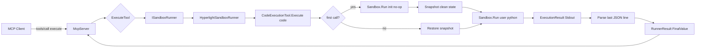
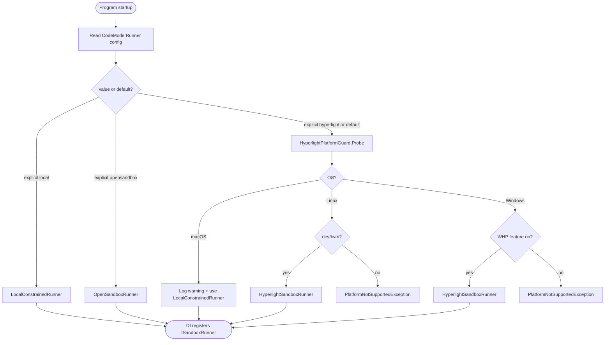
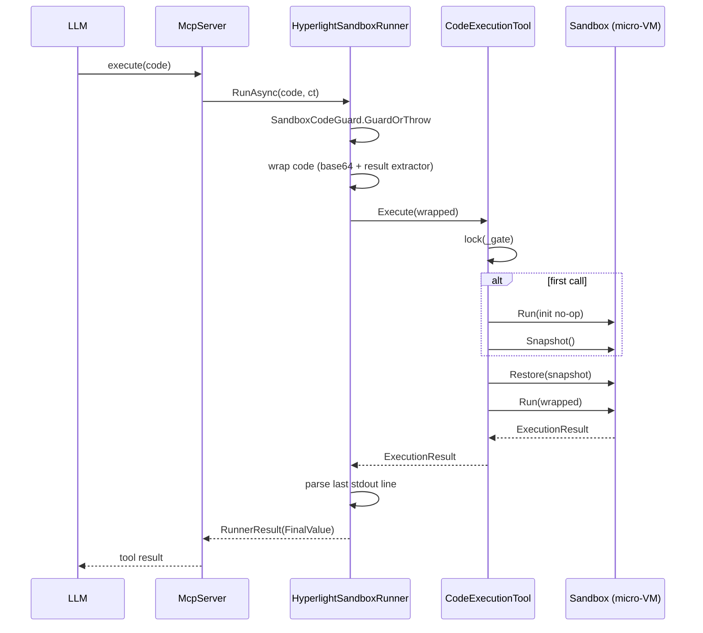
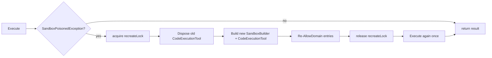
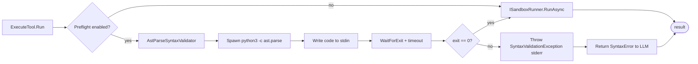
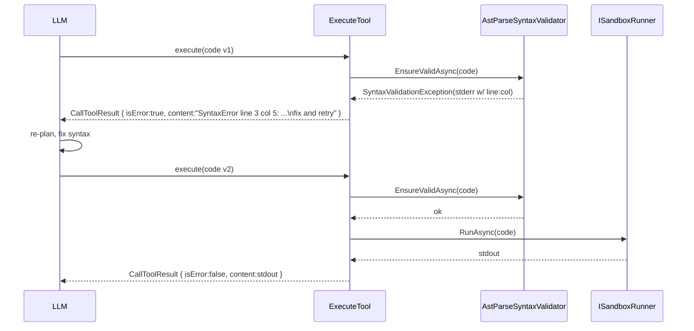
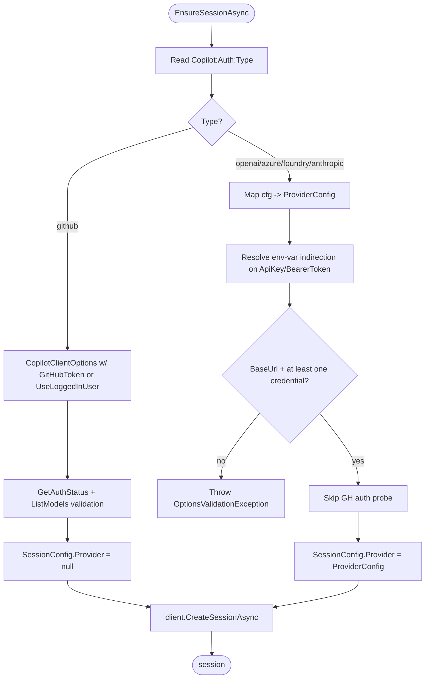

# Research: Add Hyperlight Sandbox Provider (CodeAct, C#/.NET)

Date: 2026-05-09 (rev 2)
Mode: caveman

## TL;DR

- Hyperlight = micro-VM sandbox. Rust core + cdylib FFI + .NET P/Invoke.
- .NET SDK ships `SandboxBuilder`, `Sandbox`, `CodeExecutionTool` (Extensions.AI).
- CodeAct: LLM writes code -> `CodeExecutionTool.Execute(code)` -> snapshot/restore -> `ExecutionResult{Stdout,Stderr,ExitCode,Success}`.
- **Decision (rev 2)**: Hyperlight = **default runner** on Linux + Windows. macOS = auto-fallback to `local`. `local` + `opensandbox` stay as opt-in alternatives.
- Add 3rd `ISandboxRunner` impl. ~1 new runner file + options + platform guard + factory branch. NO public MCP API change.
- Platform reality: Linux first-class (KVM/MSHV), Windows first-class (WHP), macOS unsupported by core hyperlight.
- Risks: pre-release NuGet, native lib + Python AOT guest payload, hypervisor required at OS level.

---

## 0. Workflow Diagrams (mermaid)

### 0.1 End-to-end CodeAct flow with Hyperlight



### 0.2 Runner selection at startup



### 0.3 Per-request execute lifecycle (warm path)



### 0.4 Poisoned sandbox recovery



---

## 1. Hyperlight .NET SDK – What Exists

Source: `hyperlight-sandbox/src/sdk/dotnet`, branch main.

### 1.1 Layered packages

| NuGet | Job |
|---|---|
| `Hyperlight.HyperlightSandbox.PInvoke` | LibraryImport bindings + native cdylib `hyperlight_sandbox_ffi` |
| `Hyperlight.HyperlightSandbox.Api` | High-level: `Sandbox`, `SandboxBuilder`, `ExecutionResult`, `SandboxSnapshot` |
| `Hyperlight.HyperlightSandbox.Extensions.AI` | `CodeExecutionTool` -> `AIFunction` (MEAI / Copilot SDK / Agent Framework) |
| `Hyperlight.HyperlightSandbox.Guest.Python` | Bundled Python Wasm/AOT guest + `WithPythonModule()` |
| `Hyperlight.HyperlightSandbox.Guest.JavaScript` | Bundled JS guest + `WithJavaScriptModule()` |

Pre-release. Verify nuget.org availability at Phase 0 spike.

### 1.2 Core API surface

`SandboxBuilder`: `WithPythonModule()`, `WithJavaScriptModule()`, `WithModulePath(path)`, `WithBackend(...)`, `WithHeapSize`, `WithStackSize` (`"50Mi"`), `WithInputDir(ro)`, `WithOutputDir`, `WithTempOutput`, `Build()` -> `Sandbox`.

`Sandbox`: `Run(string code) -> ExecutionResult`, `RunAsync(...)`, `RegisterTool<TArgs,TResult>(...)`, `AllowDomain(target, methods?)`, `Snapshot() -> SandboxSnapshot`, `Restore(snapshot)`, `GetOutputFiles()`. Thread-safe via internal `lock`, **Send not Sync**.

`ExecutionResult`: `Stdout`, `Stderr`, `ExitCode`, `Success`.

Exceptions: `SandboxException`, `SandboxTimeoutException`, `SandboxPoisonedException`, `SandboxPermissionException`, `SandboxGuestException`.

### 1.3 `CodeExecutionTool` – CodeAct heart

File: `core/Extensions.AI/CodeExecutionTool.cs`.

- Ctor takes pre-configured `SandboxBuilder`. Calls `builder.Build()` once.
- Holds `_sandbox`, `_snapshot`, `_initialized`, `_disposed`, `_gate` (lock).
- `AllowDomain` proxy.
- **`Execute(code)` lifecycle**:
  1. First call: `_sandbox.Run(InitializationCode)` (`"None"` for Wasm/Python). Forces guest runtime warm-up.
  2. `_snapshot = _sandbox.Snapshot()` – CLEAN post-init state.
  3. Sets `_initialized = true`.
  4. Every call: `_sandbox.Restore(_snapshot)` then `_sandbox.Run(code)`.
  5. Returns `ExecutionResult`.
  6. All under one big `lock(_gate)`.
- `AsAIFunction(name="execute_code", description?)` returns MEAI `AIFunction`.
- `Dispose` under lock.

### 1.4 Examples

`examples/agent-framework`, `examples/copilot-sdk` both = `SandboxBuilder().WithPythonModule().WithTempOutput()` -> `CodeExecutionTool` -> `RegisterTool<...>()` -> `AsAIFunction()`. Our adapter does NOT need `RegisterTool` — HTTP via `BASE_URL` covers tool calls.

### 1.5 Architecture

```
.NET app -> Api (Sandbox) -> PInvoke (SafeHandle) -> hyperlight_sandbox_ffi (cdylib)
                                                 -> hyperlight-sandbox (Rust)
                                                 -> hyperlight-wasm-sandbox / hyperlight-javascript-sandbox
                                                 -> KVM/MSHV (Linux) | WHP (Windows)
```

### 1.6 Requirements (gotchas)

- .NET 8.0+
- **Linux**: KVM module loaded, `/dev/kvm` accessible.
- **Windows**: Windows Hypervisor Platform feature on (Win10/11 Pro+ or Server). Enable: `dism /online /enable-feature /featurename:HypervisorPlatform /all` + reboot.
- **macOS**: no hypervisor backend in core hyperlight today.
- Python guest needs `.aot` or `.wasm` artifact bundled in NuGet `Guest.Python`.

---

## 2. Current Codebase Sandbox Surface

### 2.1 Files

- `src/McpServer/CodeMode/ISandboxRunner.cs` — `string SyntaxGuide`, `Task<RunnerResult> RunAsync(string code, CancellationToken ct)`.
- `RunnerResult(object? FinalValue, int CallsExecuted)`.
- `Local/LocalConstrainedRunner.cs` — spawns `python3 -` subprocess; Python wrapper builds `requests` shim; prints final JSON `{ok, finalValue=scope["result"], stdout, stderr}` on last stdout line.
- `OpenSandbox/OpenSandboxRunner.cs` — per-call `Sandbox.CreateAsync(...)` -> `sandbox.Commands.RunAsync(BuildPythonCommand(code))` -> parse last stdout line -> `SandboxExecutionPayload`. `KillAsync` in finally.
- `OpenSandbox/OpenSandboxRunnerOptions.cs`.
- `SandboxRunnerFactory.Create(IConfiguration, ILoggerFactory, allowedBaseUrls)` switches on `CodeMode:Runner`.
- `SandboxCodeGuard.ContainsForbiddenMetaToolUsage(code)` blocks `SearchTools, CallTool, Search, GetSchema, Execute`.

### 2.2 Contract specifics that matter for adapter

- Runner is **stateless externally** — gets only code + ct, returns `RunnerResult`.
- No host-bridge `RegisterTool` needed. Tool calls go via HTTP to OpenAPI base URL.
- Final value extracted from Python variable `result` (lowercase only).
- `BASE_URL` injected, `ALLOWED_BASE_URLS` allowlist on local runner.
- Timeout: `CodeMode:TimeoutMs` for execute window.

---

## 3. Hyperlight Adapter Design (Hyperlight = Default)

### 3.1 Default selection logic

`SandboxRunnerFactory` resolves the runner like this:

1. Read `CodeMode:Runner`. Empty/`null`/`"auto"` -> auto.
2. Auto rule:
   - macOS -> `local` (auto-fallback, log warning).
   - Else `HyperlightPlatformGuard.IsRuntimeAvailable()` true -> `hyperlight`.
   - Else -> `local` (auto-fallback, log warning).
3. Explicit `local` / `opensandbox` / `hyperlight` overrides auto.
4. Explicit `hyperlight` on macOS -> `PlatformNotSupportedException`.
5. Explicit `hyperlight` on Linux without `/dev/kvm` -> `PlatformNotSupportedException`.
6. Explicit `hyperlight` on Windows without WHP -> `PlatformNotSupportedException`.

### 3.2 Wiring

- New folder `src/McpServer/CodeMode/Hyperlight/`.
- New files: `HyperlightSandboxRunner.cs`, `HyperlightRunnerOptions.cs`, `HyperlightPlatformGuard.cs`.
- Modify ONE existing file: `SandboxRunnerFactory.cs`.
- `McpServer.csproj` adds Hyperlight NuGets **unconditionally** — Linux + Windows = first-class. macOS dev still builds (managed assemblies resolve); native lib never loaded because factory selects `local` on macOS.

### 3.3 Runner shape

```csharp
public sealed class HyperlightSandboxRunner : ISandboxRunner, IAsyncDisposable
{
    private readonly HyperlightRunnerOptions options;
    private readonly ILogger<HyperlightSandboxRunner> logger;
    private readonly SemaphoreSlim recreateLock = new(1, 1);
    private CodeExecutionTool? tool;

    public string SyntaxGuide => "Pure Python. Assign final value to lowercase result. ...";

    public async Task<RunnerResult> RunAsync(string code, CancellationToken ct) { /* see plan.md */ }
}
```

Key decisions:

1. **Reuse Python `result` wrapper** — single contract for `RunnerResult.FinalValue`. No prompt regression.
2. **Singleton `CodeExecutionTool`** — Hyperlight cold ~2.5s vs warm-restore ~2ms. This is the whole win.
3. **Cancellation** — link MCP `ct` + timeout CTS. `SandboxTimeoutException` -> rethrow `TimeoutException`.
4. **No `RegisterTool` host bridge** in v1.
5. **`AllowDomain`** — once at construct from `Hyperlight:AllowedDomains[]` (default = OpenAPI base URLs).
6. **Poisoned recovery** — on `SandboxPoisonedException`: dispose, recreate under `SemaphoreSlim`, retry once.
7. **Thread safety** — internal `CodeExecutionTool` lock serializes; `SemaphoreSlim` guards recreate.

### 3.4 Options

```csharp
public sealed class HyperlightRunnerOptions
{
    public string Backend { get; init; } = "wasm-python";
    public string? GuestModulePath { get; init; }
    public string? HeapSize { get; init; } = "50Mi";
    public string? StackSize { get; init; } = "35Mi";
    public bool UseTempOutput { get; init; } = true;
    public IReadOnlyList<string> AllowedDomains { get; init; } = Array.Empty<string>();
    public TimeSpan Timeout { get; init; } = TimeSpan.FromSeconds(5);
    public int MaxToolCalls { get; init; } = 10;
}
```

Config keys: `CodeMode:Runner` (`auto|local|opensandbox|hyperlight`, default `auto`), `Hyperlight:Backend`, `Hyperlight:HeapSize`, `Hyperlight:StackSize`, `Hyperlight:AllowedDomains:0..N`.

### 3.5 Trace tags

Reuse `mcp.code`, `mcp.code.length`, `mcp.Execute.callCount`, `mcp.Execute.hasFinalValue`. Add `mcp.sandbox.provider=hyperlight`, `mcp.sandbox.backend`, `mcp.sandbox.poisonedRecover`, `mcp.sandbox.autoFallback`.

---

## 4. Cross-Platform Strategy (Hyperlight default, mac fallback)

| Platform | Auto resolves to | Explicit `hyperlight` |
|---|---|---|
| Linux x64 (KVM/MSHV) | **hyperlight** | works |
| Linux x64 (no KVM) | local (warn) | throws `PlatformNotSupportedException` |
| Windows x64 (WHP on) | **hyperlight** | works |
| Windows x64 (WHP off) | local (warn) | throws `PlatformNotSupportedException` |
| macOS | local (warn) | throws `PlatformNotSupportedException` |

Probe impl:

```csharp
internal static class HyperlightPlatformGuard
{
    public static bool IsRuntimeAvailable() =>
        !OperatingSystem.IsMacOS() &&
        ((OperatingSystem.IsLinux() && IsKvmAccessible()) ||
         (OperatingSystem.IsWindows() && IsWhpAvailable()));

    public static void EnsureSupportedOrThrow()
    {
        if (OperatingSystem.IsMacOS())
            throw new PlatformNotSupportedException("Hyperlight does not support macOS. Use CodeMode:Runner=local|opensandbox|auto.");
        if (OperatingSystem.IsLinux() && !IsKvmAccessible())
            throw new PlatformNotSupportedException("Hyperlight on Linux requires /dev/kvm (or MSHV).");
        if (OperatingSystem.IsWindows() && !IsWhpAvailable())
            throw new PlatformNotSupportedException("Hyperlight on Windows requires Windows Hypervisor Platform feature.");
    }

    private static bool IsKvmAccessible() { try { return File.Exists("/dev/kvm"); } catch { return false; } }
    private static bool IsWhpAvailable()   { /* WHvGetCapability(WHvCapabilityCodeHypervisorPresent) */ }
}
```

CI matrix:
- linux-latest: build + run hyperlight tests (skip integration if `/dev/kvm` not on runner image).
- windows-latest: build + run; skip integration if WHP off.
- macos-latest: build only; assert auto-fallback returns `LocalConstrainedRunner`.

---

## 5. Risks + Guardrails

1. **Pre-release SDK churn** — pin exact NuGet version; isolate behind `ISandboxRunner`.
2. **Native lib + AOT guest size** — `PInvoke` + `Guest.Python` add native binaries.
3. **Hypervisor not available** — auto-fallback warns; explicit fails fast.
4. **Sandbox is Send-not-Sync** — serialize `Execute`. Pool deferred (YAGNI).
5. **Snapshot poisoning** — `SandboxPoisonedException` -> dispose + recreate + retry once.
6. **macOS regression** — auto picks `local`; explicit refused.
7. **Finalizer order** — follow `CodeExecutionTool` pattern.
8. **Lock + async** — wrap sync `Execute` in `Task.Run`; respect `ct` for cooperative cancel.
9. **Snapshot lifetime vs `result` extraction** — restore-then-run keeps each call clean.
10. **Windows WHP detection** — best-effort probe; on false negative the runner ctor / first `Execute` surfaces a clear SDK error.

---

## 6. Acceptance Criteria

1. Default install on Linux+Windows (with hypervisor) ends up running `HyperlightSandboxRunner` without any config change.
2. Default install on macOS auto-falls back to `LocalConstrainedRunner` with a single warn-level log.
3. All existing `execute` prompts continue to pass (Python/`result` contract preserved).
4. Local + OpenSandbox unit tests untouched, still green.
5. New tests: success path, timeout, poisoned-sandbox retry, auto-fallback on macOS, throw-on-explicit-mac, throw-on-missing-WHP/KVM.
6. Trace contains `mcp.sandbox.provider=hyperlight` + `mcp.Execute.callCount`.
7. No public MCP tool surface change (`tools/list` diff = empty).

---

## 7. File Delta (Smallest Practical Set)

Add:
- `src/McpServer/CodeMode/Hyperlight/HyperlightSandboxRunner.cs`
- `src/McpServer/CodeMode/Hyperlight/HyperlightRunnerOptions.cs`
- `src/McpServer/CodeMode/Hyperlight/HyperlightPlatformGuard.cs`
- `tests/McpServer.UnitTests/CodeMode/Hyperlight/HyperlightSandboxRunnerTests.cs`
- `tests/McpServer.UnitTests/CodeMode/Hyperlight/HyperlightPlatformGuardTests.cs`
- `tests/McpServer.UnitTests/CodeMode/SandboxRunnerFactoryAutoTests.cs`

Update:
- `src/McpServer/CodeMode/SandboxRunnerFactory.cs` (auto-resolution + `hyperlight` branch)
- `src/McpServer/McpServer.csproj` (unconditional Hyperlight NuGet refs)
- `src/McpServer/appsettings.json` (default `CodeMode:Runner=auto`)
- `README.md` (Hyperlight default section + platform matrix + WHP/KVM enable note)
- `.github/copilot-instructions.md` (default sandbox = Hyperlight w/ macOS auto-fallback)

NO change to: `ISandboxRunner.cs`, `ExecuteTool.cs`, `DiscoveryTools.cs`, `CodeModeHandlers.cs`, `SandboxCodeGuard.cs`, search/registry/meta-tool surface.

---

## 7b. Optional Preflight: `ast.parse` Subprocess Syntax Check

User pick: skip pythonnet, use `python3 -c "import ast,sys; ast.parse(sys.stdin.read())"` instead. Same syntax check, **zero managed dep**, uses same `python3` host already required by Local runner.

### Why this beats pythonnet (caveman)

- No `Python.Runtime` NuGet, no `Runtime.PythonDLL`, no GIL bottleneck in-process.
- Same `python3` binary the Local runner spawns -> grammar match guaranteed for that runner; for Hyperlight/OpenSandbox guests, host vs guest may still drift but cost = zero new dep.
- Subprocess fork cheap (~30–50ms cold); cheaper than Hyperlight cold (~2.5s) and OpenSandbox per-call create.
- Stays cross-platform (Windows uses `python` or `py -3`, configurable).
- Pure additive: no change to runner contract.

### Trade-offs

Win:
- Catches `SyntaxError` before any sandbox boot.
- Fail-fast feedback to LLM (better tool-use loop).
- Trivial to disable (config flag).

Lose:
- Adds ~30–50ms per execute on warm path. Mitigate: pool `python3` worker (deferred, YAGNI).
- Catches only `SyntaxError`, not `NameError` / `ImportError` / semantic bugs.
- Requires `python3` on host even if runner is Hyperlight/OpenSandbox (Hyperlight wouldn't otherwise need host Python).
- Cross-OS shell quoting: pipe code via stdin to avoid arg-length + escaping issues.

### Design

**Abstraction** in `src/McpServer/CodeMode/Validation/`:

```csharp
public interface IPythonSyntaxValidator
{
    Task EnsureValidAsync(string code, CancellationToken ct);
}
public sealed class SyntaxValidationException : Exception
{
    public SyntaxValidationException(string message, Exception? inner = null) : base(message, inner) {}
}
```

Impls:
- `NullSyntaxValidator` — default. Returns completed task. Zero cost.
- `AstParseSyntaxValidator` — spawns `python3 -c "import ast,sys; ast.parse(sys.stdin.read())"`, writes user code to stdin, awaits exit code. Non-zero -> `SyntaxValidationException(stderr)`.

**Subprocess sketch** (no implementation, design only):

```csharp
// pseudo
var psi = new ProcessStartInfo(options.PythonPath, "-c \"import ast,sys; ast.parse(sys.stdin.read())\"")
{
    RedirectStandardInput = true,
    RedirectStandardError = true,
    UseShellExecute = false,
};
using var proc = Process.Start(psi)!;
await proc.StandardInput.WriteAsync(code);
proc.StandardInput.Close();
await proc.WaitForExitAsync(ct).WaitAsync(options.Timeout, ct);
if (proc.ExitCode != 0)
    throw new SyntaxValidationException(await proc.StandardError.ReadToEndAsync());
```

**Wiring**:
- `ExecuteTool.RunAsync` calls `validator.EnsureValidAsync(code, ct)` before `runner.RunAsync(...)`.
- DI: `NullSyntaxValidator` by default; switch to `AstParseSyntaxValidator` when `CodeMode:PreflightSyntaxCheck=true`.
- Trace: `mcp.preflight.enabled`, `mcp.preflight.passed`, `mcp.preflight.failed`, `mcp.preflight.durationMs`.

### Options DTO

```csharp
public sealed class PreflightOptions
{
    public bool Enabled { get; init; } = false;
    public string PythonPath { get; init; } = "python3"; // "py" or "python" on Windows
    public TimeSpan Timeout { get; init; } = TimeSpan.FromSeconds(2);
}
```

Config:
```json
"CodeMode": {
  "PreflightSyntaxCheck": false,
  "Preflight": { "PythonPath": "python3", "TimeoutMs": 2000 }
}
```

On Windows default fall-through: try `python` if `python3` not on PATH. Document override.

### Workflow (mermaid)



### File delta

Add:
- `src/McpServer/CodeMode/Validation/IPythonSyntaxValidator.cs`
- `src/McpServer/CodeMode/Validation/NullSyntaxValidator.cs`
- `src/McpServer/CodeMode/Validation/AstParseSyntaxValidator.cs`
- `src/McpServer/CodeMode/Validation/PreflightOptions.cs`
- `tests/McpServer.UnitTests/CodeMode/Validation/AstParseSyntaxValidatorTests.cs`

Edit:
- `src/McpServer/CodeMode/ExecuteTool.cs` — inject + call validator before runner.
- `src/McpServer/Program.cs` — register validator based on config.
- `src/McpServer/appsettings.json` — add `Preflight` block (default off).
- `README.md` — document opt-in.

Do NOT edit: `ISandboxRunner.cs`, runner impls, `SandboxCodeGuard.cs`.

No NuGet additions.

### Acceptance

1. Default install: validator = `NullSyntaxValidator`; zero perf delta vs current.
2. Flag on: invalid `def(:` rejected with `SyntaxValidationException` before runner; valid script passes through unchanged.
3. Cross-platform: works on Linux/Windows/macOS where `python3` (or configured `PythonPath`) is on PATH.
4. Timeout enforced: hung Python child killed within `Preflight:TimeoutMs`.
5. Trace tags emitted on enabled path.

### Agent Feedback Loop (LLM regen on syntax fail)

**Question:** does preflight fail tell LLM to regen?

**Answer:** yes — *if* MCP returns failure as **structured tool result** (`isError=true`) not raw exception. Standard MCP agent loop handles the rest: LLM sees error content, fixes code, calls `execute` again.

**Flow:**



**Critical contract:** `ExecuteTool` MUST catch `SyntaxValidationException` and return tool-level error, NOT let it bubble to MCP transport. Transport-level failure = generic message = bad regen signal.

**Error payload shape (LLM-readable):**

```
Preflight syntax check failed.

  File "<stdin>", line 3
    def (
        ^
SyntaxError: invalid syntax

Fix the Python syntax and call execute again.
```

The trailing hint string is the only LLM-affordance bit added by us — `ast.parse` already gives line/col/caret. No need to reformat.

**Why this works without extra wiring:**
- MCP clients (Claude/Copilot/etc.) already loop on `isError:true` results in agent mode.
- No new tool, no new prompt, no new state. Stateless retry.
- Same loop covers runtime errors from the runner (already returned as tool error today).

**Optional retry guardrails (host responsibility, not ours):**
- Client-side max-retry counter (3–5) to prevent infinite regen on truly unfixable code. Host concern, document in README.
- Trace tag `mcp.preflight.attempt` if we ever want server-side counting (YAGNI v1).

### Verdict

Green-lit. Single milestone, no new managed dep, off by default. Implement after Hyperlight default lands. Feedback loop = free byproduct of returning `isError:true` with stderr.

---

## 7c. BYOK Provider for `CopilotChatService` (config-driven)

**Today:** `src/McpServer/Services/CopilotChatService.cs` only knows GitHub Copilot auth path — `CopilotClientOptions { GitHubToken, UseLoggedInUser }`. No way to point at OpenAI / Azure OpenAI / Azure AI Foundry / Anthropic / Ollama / Foundry Local without forking code.

**Goal:** add BYOK as **alternative auth path**, configured purely in `appsettings.json`. GitHub Copilot key remains default. One config switch flips between them. No code change needed by users.

**Source of truth:** [github/copilot-sdk byok.md](https://github.com/github/copilot-sdk/blob/main/docs/auth/byok.md).

### Supported providers (from SDK doc)

| Config `type` | Backend | Notes |
|---|---|---|
| `github` (default) | GitHub Copilot | current behavior, uses `GitHubToken` / `UseLoggedInUser` |
| `openai` | OpenAI / Ollama / Foundry Local / vLLM / LiteLLM | OpenAI-compatible. `apiKey` optional for local |
| `azure` | Azure OpenAI native (`*.openai.azure.com`) | host-only `baseUrl`; SDK appends path. `azure.apiVersion` |
| `azure-foundry` | Azure AI Foundry `/openai/v1/` endpoint | maps to SDK `type=openai` + `wireApi=responses` |
| `anthropic` | Claude API | direct |

> Internally `azure-foundry` is just a sugar alias — it produces a SDK `ProviderConfig { type:"openai", wireApi:"responses" }`. Keeps appsettings readable.

### appsettings shape

```jsonc
"Copilot": {
  "Model": "gpt-5",
  "Auth": {
    "Type": "github"            // github | openai | azure | azure-foundry | anthropic
  },
  // Provider block is read ONLY when Auth.Type != "github".
  // ApiKey/BearerToken support ${ENV_VAR} indirection so secrets stay out of the file.
  "Provider": {
    "BaseUrl": "https://api.openai.com/v1",
    "ApiKey": "${OPENAI_API_KEY}",
    "BearerToken": null,
    "WireApi": "completions",   // completions | responses
    "Azure": { "ApiVersion": "2024-10-21" }
  }
}
```

GitHub path keeps working unchanged when `Auth.Type=github` (default).

### Workflow (mermaid)



### Pseudo-code (no impl)

```csharp
// CodeMode/Auth/CopilotAuthOptions.cs (NEW)
public enum CopilotAuthType { Github, OpenAI, Azure, AzureFoundry, Anthropic }

public sealed class CopilotAuthOptions
{
    public CopilotAuthType Type { get; init; } = CopilotAuthType.Github;
}

public sealed class CopilotProviderOptions
{
    public string?  BaseUrl     { get; init; }
    public string?  ApiKey      { get; init; }   // supports ${ENV} indirection
    public string?  BearerToken { get; init; }   // supports ${ENV} indirection
    public string?  WireApi     { get; init; }   // completions | responses
    public AzureProviderOptions Azure { get; init; } = new();
}

public sealed class AzureProviderOptions
{
    public string ApiVersion { get; init; } = "2024-10-21";
}
```

```csharp
// Services/CopilotProviderFactory.cs (NEW)
internal static class CopilotProviderFactory
{
    public static ProviderConfig? Build(CopilotAuthOptions auth, CopilotProviderOptions p)
    {
        if (auth.Type == CopilotAuthType.Github) return null;   // GH path

        if (string.IsNullOrWhiteSpace(p.BaseUrl))
            throw new OptionsValidationException("Copilot:Provider:BaseUrl required for BYOK.");

        var key   = ResolveSecret(p.ApiKey);
        var bearer= ResolveSecret(p.BearerToken);

        return auth.Type switch
        {
            CopilotAuthType.OpenAI       => new ProviderConfig { Type="openai",   BaseUrl=p.BaseUrl, ApiKey=key, BearerToken=bearer, WireApi=p.WireApi ?? "completions" },
            CopilotAuthType.Azure        => new ProviderConfig { Type="azure",    BaseUrl=p.BaseUrl, ApiKey=key, AzureApiVersion=p.Azure.ApiVersion },
            CopilotAuthType.AzureFoundry => new ProviderConfig { Type="openai",   BaseUrl=p.BaseUrl, ApiKey=key, WireApi=p.WireApi ?? "responses" },
            CopilotAuthType.Anthropic    => new ProviderConfig { Type="anthropic",BaseUrl=p.BaseUrl, ApiKey=key },
            _ => throw new InvalidOperationException()
        };
    }

    // "${OPENAI_API_KEY}" -> env value; plain string -> as-is; null -> null.
    private static string? ResolveSecret(string? raw) => /* regex ${VAR} substitution */;
}
```

```csharp
// Services/CopilotChatService.cs (EDIT inside EnsureSessionAsync)
ProviderConfig? provider = CopilotProviderFactory.Build(authOptions, providerOptions);

if (client is null)
{
    var clientOpts = provider is null
        ? new CopilotClientOptions { GitHubToken = gitHubToken, UseLoggedInUser = string.IsNullOrWhiteSpace(gitHubToken) }
        : new CopilotClientOptions(); // BYOK -> no GitHub auth on client
    client = new CopilotClient(clientOpts);
    await client.StartAsync(ct);

    if (provider is null)
    {
        // existing GH validation: ValidateConfiguredToken / GetAuthStatus / ListModels
    }
    // BYOK: skip GH auth probe; let session creation surface real errors.
}

SessionConfig config = new()
{
    Model = model,
    Provider = provider,                 // null for GH, set for BYOK
    OnPermissionRequest = PermissionHandler.ApproveAll,
    SystemMessage = ...,
    McpServers = BuildMcpServerConfig(),
};
```

### Behavior matrix

| `Auth:Type` | Client opts | Auth probe | `SessionConfig.Provider` |
|---|---|---|---|
| `github` (default) | `GitHubToken` or `UseLoggedInUser=true` | `GetAuthStatus` + `ListModels` | `null` |
| `openai`           | empty                                    | none (provider speaks for itself) | `{ type:openai, baseUrl, apiKey?, bearerToken?, wireApi }` |
| `azure`            | empty                                    | none | `{ type:azure, baseUrl, apiKey, azure.apiVersion }` |
| `azure-foundry`    | empty                                    | none | `{ type:openai, baseUrl, apiKey, wireApi:responses }` |
| `anthropic`        | empty                                    | none | `{ type:anthropic, baseUrl, apiKey }` |

### Trace tags

- `copilot.auth.type` (`github` | `openai` | ...)
- `copilot.provider.baseUrl` (host only, no path/query)
- `copilot.provider.wireApi`
- `copilot.byok.credential` (`apiKey` | `bearerToken` | `none`)

No secret values in tags. Ever.

### File delta

Add:
- `src/McpServer/Services/CopilotAuthOptions.cs`
- `src/McpServer/Services/CopilotProviderOptions.cs`
- `src/McpServer/Services/CopilotProviderFactory.cs`
- `tests/McpServer.UnitTests/Services/CopilotProviderFactoryTests.cs`

Edit:
- `src/McpServer/Services/CopilotChatService.cs` — inject options; branch on `provider==null`.
- `src/McpServer/Program.cs` — `services.Configure<CopilotAuthOptions>(...)` + `Configure<CopilotProviderOptions>(...)`.
- `src/McpServer/appsettings.json` — add `Copilot:Auth` + commented `Copilot:Provider` example.
- `README.md` — BYOK matrix + env-var indirection example.

Do NOT touch: MCP transport, runners, preflight, OpenAPI loader.

### Acceptance

1. Default (`Auth:Type=github`, current config): zero behavioral change vs today.
2. `Auth:Type=openai` + `Provider:BaseUrl=https://api.openai.com/v1` + `Provider:ApiKey=${OPENAI_API_KEY}`: session created without GH auth probe; `/chat/send` works.
3. `Auth:Type=azure-foundry` + Foundry endpoint: `wireApi=responses` auto-applied; works.
4. Missing `BaseUrl` when BYOK selected: startup throws `OptionsValidationException` with clear message.
5. `${MISSING_VAR}` indirection: throws at startup, not at first request.
6. Secrets never logged or traced.
7. Unit tests cover factory mapping for each `Type` + env-var indirection + missing-baseurl + missing-env-var.

### Limitations (inherited from BYOK doc)

- Static credentials only (no Entra ID / token refresh). Document.
- Premium request quota does not apply (provider bills directly).
- Model list comes from provider; SDK `ListModels` may not be authoritative — skip the validation probe under BYOK.

### Verdict

Green-lit. Pure additive change. Default = unchanged GH path. ~3 small files + 1 service edit + appsettings/README. Implement after preflight (M10).

---

## 8. Open Questions Worth Verifying Before Coding

1. NuGet `Hyperlight.HyperlightSandbox.*` published on nuget.org or local-only?
2. Native lib RIDs shipped in `Guest.Python` (linux-x64 / win-x64 / linux-arm64?). macOS RID likely absent.
3. `Sandbox.RunAsync` cancellation honored mid-guest?
4. Snapshot size + memory cost.
5. WHP capability P/Invoke signature.

---

## 9. Bottom Line

Adapter = ONE new runner class + options + platform guard + factory branch. Hyperlight is the default on Linux+Windows because snapshot-restore beats both subprocess Python (local) and per-call container create/kill (OpenSandbox). macOS auto-falls back to `local`. Architecture isolated by `ISandboxRunner`; reverting = config flip. Risk = SDK maturity, not architecture.


---

# Provider Benchmark Research (caveman)

## goal
measure codemode runner perf: local vs opensandbox vs hyperlight. same code, same workload, fair compare.

## metric want
- cold start (first run, sandbox spin)
- warm run (steady state)
- p50/p95/mean latency per Execute call
- alloc bytes (managed)
- throughput (calls/sec, single + N parallel)
- failure rate / timeout rate
- token cost unaffected (server-side count = ceil(chars/4)) -> measure separately as char count

## tools
- BenchmarkDotNet (BDN): micro/macro bench, statistical engine, MemoryDiagnoser, Job per provider, Params for workload.
- Aspire.Hosting.Testing: DistributedApplicationTestingBuilder. spins AppHost in bg. closed-box. real processes. test sends HTTP to McpServer / TestWeb.
- xUnit host runner for orchestration when BDN not enough (long e2e).

## key facts BDN
- attribute or fluent ManualConfig
- [SimpleJob], [Params(...)], [GlobalSetup], [Benchmark]
- only Release, no debugger, no DEBUG build
- runs as separate process per job
- exporters: md, csv, json, html, plots

## key facts Aspire testing
- pkg Aspire.Hosting.Testing
- DistributedApplicationTestingBuilder.CreateAsync<Projects.AppHost>()
- starts apphost in background, manages lifecycle
- dashboard disabled by default, ports randomized -> use service discovery / CreateHttpClient(resourceName)
- can pass args to disable port randomize: "DcpPublisher:RandomizePorts=false"
- can override config via env vars / args -> good for switching CodeMode:Runner per run
- no in-proc DI mocking (separate process)
- dispose builder = teardown all resources

## fit problem
two layers needed:
1. micro bench: bench Execute path inside McpServer process directly via ISandboxRunner. no apphost. fastest signal, lowest noise. BDN owns it.
2. e2e bench: use Aspire test host -> hit /chat/send or Execute via mcp client -> measure end-to-end including LLM-less direct execute. validates real wiring (network shim, opensandbox container, hyperlight guest).

micro = primary perf number. e2e = sanity + integration regression.

## constraints / pitfalls
- opensandbox needs container resource running. BDN process can't easily depend on aspire. solution: prestart container manually (docker compose up) before bench, or use Aspire e2e harness only for opensandbox.
- hyperlight: in-proc sandbox, fits BDN cleanly.
- local: in-proc, fits BDN cleanly.
- llm tokens / copilot calls: skip in bench. bypass model. call ISandboxRunner.RunAsync direct with fixed canned code string.
- warmup: BDN handles. for opensandbox add [IterationSetup] to ensure fresh sandbox where needed.
- code under bench must be deterministic. use mock HTTP server (TestWeb or kestrel stub) to avoid network variance.
- hyperlight first-call cost includes guest module load -> separate ColdRun benchmark using fresh runner per iteration.

## workload set
- W1: pure compute (no http) -> isolate sandbox overhead
- W2: single http_get to local stub -> include shim
- W3: 3 chained http_get -> chained calls overhead
- W4: 50 parallel Execute (concurrency)

## deliverable
- new project tests/McpServer.Benchmarks (BDN console)
- new project tests/McpServer.E2EBenchmarks (xUnit + Aspire.Hosting.Testing)
- script scripts/run-benchmarks.ps1


## update: opensandbox orchestration without docker compose
- decision: use AppHost as single source of truth for opensandbox container lifecycle.
- BDN `[GlobalSetup]` boots `DistributedApplicationTestingBuilder<Projects.AppHost>` only when runner=opensandbox. reads endpoint + api key from resource. teardown on `[GlobalCleanup]`.
- local + hyperlight remain in-proc, no apphost.
- alternative if AppHost path undesired: Testcontainers.NET in `[GlobalSetup]` (still no compose).
- removed: any direct `docker compose` invocation from bench scripts.
- new AppHost switch (proposed): `BENCH_ONLY_OPENSANDBOX=true` -> filter graph to just `opensandbox-server` so cold cost stays minimal.


---

## Provider-specific Workloads (W_simple + W_complex)

### runtime capability matrix
| feature | local | opensandbox | hyperlight |
|---|---|---|---|
| `http_get` / `http_post` builtins | NO | NO | YES |
| `requests` shim (in scope) | YES | YES | YES |
| `json` stdlib | YES | YES | YES |
| `collections.defaultdict` | YES | YES | YES (cpython guest) |
| `urllib.*` stdlib | YES | YES | NO |
| `BASE_URL` injected | YES | YES | YES |

### unified rule
- one canned snippet per workload, written against `requests` shim (works on all 3).
- second canned variant per workload using `http_get` (hyperlight-native path) — bench separately to measure shim overhead vs native call.
- caveman: 2 workloads × 2 styles × 3 runners = 12 cells; runners that don't expose a style => SKIP cell, mark `n/a`.

### W_simple — single brewery
**style A (`requests` shim, all 3 runners):**
```python
r = requests.get(f"{BASE_URL}/breweries/random", timeout=10)
if r.status_code >= 400:
    raise Exception(f"HTTP {r.status_code}")
result = r.text
```

**style B (`http_get` native, hyperlight only — local/opensandbox => skipped):**
```python
resp = http_get(f"{BASE_URL}/breweries/random")
if resp["status"] >= 400:
    raise Exception(f"HTTP {resp['status']}")
result = resp["body"]
```

### W_complex — paginated SD + moon search
**style A (`requests` shim, all 3 runners):**
```python
import json
from collections import defaultdict

errors = []

# 1. paginate San Diego
sd_raw = []
page = 1
while True:
    r = requests.get(f"{BASE_URL}/breweries", params={"by_city":"san_diego","per_page":200,"page":page}, timeout=10)
    if r.status_code >= 400:
        errors.append(f"SD page {page} failed: HTTP {r.status_code}")
        break
    data = r.json()
    if not data:
        break
    sd_raw.extend(data)
    if len(data) < 200:
        break
    page += 1

sd_seen = {b["id"]: b for b in sd_raw}
sd = list(sd_seen.values())
sd_total = len(sd)

type_counts = defaultdict(int)
for b in sd:
    type_counts[b.get("brewery_type") or "unknown"] += 1
type_summary = sorted(
    [{"brewery_type": t, "count": c} for t, c in type_counts.items()],
    key=lambda x: (-x["count"], x["brewery_type"]),
)

city_counts = defaultdict(int)
for b in sd:
    city_counts[b.get("city") or "Unknown"] += 1
top_cities = sorted(
    [{"city": c, "count": n} for c, n in city_counts.items()],
    key=lambda x: (-x["count"], x["city"]),
)[:3]

# 2. moon search
moon_top_5 = []
r2 = requests.get(f"{BASE_URL}/breweries/search", params={"query":"moon","per_page":200}, timeout=10)
if r2.status_code >= 400:
    errors.append(f"moon search failed: HTTP {r2.status_code}")
else:
    moon = r2.json()
    moon_seen = {b["id"]: b for b in moon}
    moon_sorted = sorted(moon_seen.values(), key=lambda x: x.get("name") or "")
    moon_top_5 = [{"name": b.get("name",""), "city": b.get("city","")} for b in moon_sorted[:5]]

output = {
    "san_diego_total": sd_total,
    "san_diego_type_summary": type_summary,
    "san_diego_top_cities": top_cities,
    "moon_top_5": moon_top_5,
}
if errors:
    output["errors"] = errors

result = json.dumps(output, indent=2)
```

**style B (`http_get` native, hyperlight only):**
```python
import json
from collections import defaultdict

errors = []

def fetch_json(url):
    resp = http_get(url)
    if resp["status"] >= 400:
        return None, f"HTTP {resp['status']}"
    body = resp["body"]
    return (json.loads(body) if isinstance(body, str) else body), None

sd_raw = []
page = 1
while True:
    data, err = fetch_json(f"{BASE_URL}/breweries?by_city=san_diego&per_page=200&page={page}")
    if err:
        errors.append(f"SD page {page} failed: {err}")
        break
    if not data:
        break
    sd_raw.extend(data)
    if len(data) < 200:
        break
    page += 1

sd_seen = {b["id"]: b for b in sd_raw}
sd = list(sd_seen.values())
sd_total = len(sd)

type_counts = defaultdict(int)
for b in sd:
    type_counts[b.get("brewery_type") or "unknown"] += 1
type_summary = sorted(
    [{"brewery_type": t, "count": c} for t, c in type_counts.items()],
    key=lambda x: (-x["count"], x["brewery_type"]),
)

city_counts = defaultdict(int)
for b in sd:
    city_counts[b.get("city") or "Unknown"] += 1
top_cities = sorted(
    [{"city": c, "count": n} for c, n in city_counts.items()],
    key=lambda x: (-x["count"], x["city"]),
)[:3]

moon_top_5 = []
moon, err = fetch_json(f"{BASE_URL}/breweries/search?query=moon&per_page=200")
if err:
    errors.append(f"moon search failed: {err}")
elif moon:
    moon_seen = {b["id"]: b for b in moon}
    moon_sorted = sorted(moon_seen.values(), key=lambda x: x.get("name") or "")
    moon_top_5 = [{"name": b.get("name",""), "city": b.get("city","")} for b in moon_sorted[:5]]

output = {
    "san_diego_total": sd_total,
    "san_diego_type_summary": type_summary,
    "san_diego_top_cities": top_cities,
    "moon_top_5": moon_top_5,
}
if errors:
    output["errors"] = errors
result = json.dumps(output, indent=2)
```

### why two styles
- style A = portable -> head-to-head across all 3 runners. primary comparison.
- style B = hyperlight-only -> measures extra cost of `requests` shim vs raw `http_get`. quantifies shim tax.

### per-runner adaptation notes
- **local**: code runs as subprocess Python; `requests` is shim atop `urllib.request`. timeout mandatory. style B not supported (no `http_get` symbol).
- **opensandbox**: same shim model as local. style B not supported.
- **hyperlight**: wrapper preloads `http_get`, `http_post`, AND `requests` shim. both styles run. use style B when measuring native path.

### stub server contract (deterministic)
- `GET /breweries/random` -> 200 + 1 brewery JSON.
- `GET /breweries?by_city=san_diego&per_page=N&page=P` -> 200 + array of N items, last page returns < N.
- `GET /breweries/search?query=moon&per_page=N` -> 200 + fixed array (≥5 items) for stable W_complex result.
- response body MUST include id, name, city, brewery_type for all endpoints.
- 5xx never returned in bench. response time fixed sub-ms for warm bench.
