# Page: Overview

# Overview

<details>
<summary>Relevant source files</summary>

The following files were used as context for generating this wiki page:

- [CLAUDE.md](CLAUDE.md)
- [README.md](README.md)

</details>


## Purpose and Scope

The MCP Apps Demo repository demonstrates the integration of CopilotKit with the Model Context Protocol (MCP) Apps Extension (SEP-1865). This system enables interactive HTML/JavaScript applications to render within a conversational AI chat interface, allowing users to interact with rich UIs through natural language commands.

The repository contains four fully functional demo applications: airline booking, hotel booking, investment simulation, and kanban board management. Each application showcases how MCP servers can serve interactive UIs that communicate bidirectionally with backend business logic through JSON-RPC over postMessage.

For detailed information about the system architecture and communication patterns, see [Architecture](#2). For instructions on setting up and running the application, see [Getting Started](#3). For details on individual applications, see [MCP Apps](#6).

**Sources:** [README.md:1-10](), [CLAUDE.md:1-11]()

## What Are MCP Apps?

MCP Apps are self-contained HTML/JavaScript applications served by MCP servers as resources. These applications:

- Render in sandboxed iframes within the CopilotKit chat sidebar
- Communicate with the MCP server via JSON-RPC over postMessage protocol
- Are triggered by AI tool calls that contain `ui/resourceUri` metadata
- Support bidirectional communication for interactive operations

The key innovation is the tool-to-UI linking pattern, where MCP tools declare their associated UI resources through metadata. When the AI invokes such a tool, the `MCPAppsMiddleware` intercepts the response, fetches the HTML resource, and renders it in an iframe, enabling rich user interactions beyond traditional text-based chat.

**Sources:** [README.md:59-73](), [CLAUDE.md:7-10]()

## Demo Applications

The repository includes four interactive applications, each demonstrating different UI patterns and use cases:

| Application | Main Tool | HTML Resource | Key Features |
|-------------|-----------|---------------|--------------|
| **Airline Booking** | `search-flights` | `apps/flights-app.html` | 5-step wizard: search → select flight → seats → passenger details → confirmation |
| **Hotel Booking** | `search-hotels` | `apps/hotels-app.html` | 4-step wizard: search → select hotel → choose room → guest details |
| **Investment Simulator** | `create-portfolio` | `apps/trading-app.html` | Portfolio dashboard with live charts, holdings table, buy/sell trades |
| **Kanban Board** | `create-board` | `apps/kanban-app.html` | Drag-drop task management with columns, cards, and CRUD operations |

Each application follows the same architectural pattern: a main tool that triggers UI rendering, helper tools for granular interactions, and business logic modules for data management. The complete flow is orchestrated by the `MCPAppsMiddleware` in the CopilotKit runtime.

**Sources:** [README.md:13-18](), [README.md:93-110]()

## System Components

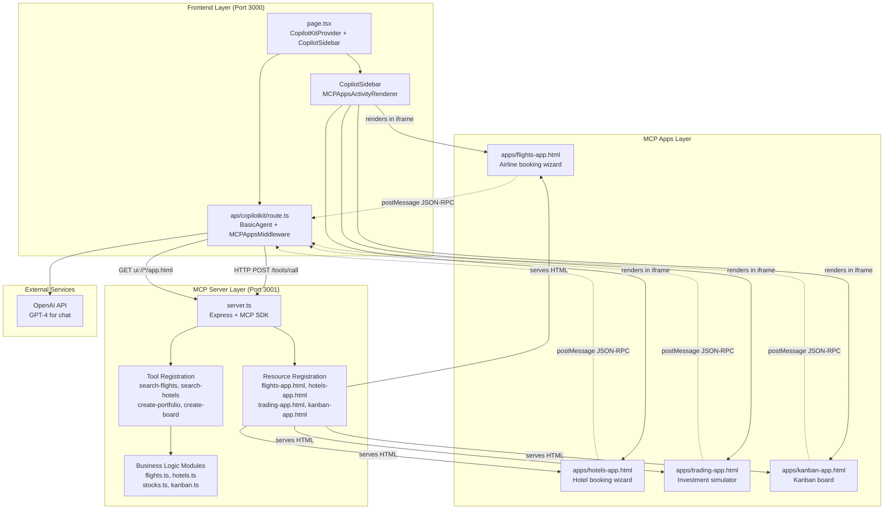
```mermaid
graph TB
    subgraph "Frontend Layer (Port 3000)"
        PageComponent["page.tsx<br/>CopilotKitProvider + CopilotSidebar"]
        APIRoute["api/copilotkit/route.ts<br/>BasicAgent + MCPAppsMiddleware"]
        Sidebar["CopilotSidebar<br/>MCPAppsActivityRenderer"]
    end
    
    subgraph "MCP Server Layer (Port 3001)"
        ServerEntry["server.ts<br/>Express + MCP SDK"]
        ToolRegistry["Tool Registration<br/>search-flights, search-hotels<br/>create-portfolio, create-board"]
        ResourceRegistry["Resource Registration<br/>flights-app.html, hotels-app.html<br/>trading-app.html, kanban-app.html"]
        BusinessLogic["Business Logic Modules<br/>flights.ts, hotels.ts<br/>stocks.ts, kanban.ts"]
    end
    
    subgraph "MCP Apps Layer"
        FlightsHTML["apps/flights-app.html<br/>Airline booking wizard"]
        HotelsHTML["apps/hotels-app.html<br/>Hotel booking wizard"]
        TradingHTML["apps/trading-app.html<br/>Investment simulator"]
        KanbanHTML["apps/kanban-app.html<br/>Kanban board"]
    end
    
    subgraph "External Services"
        OpenAI["OpenAI API<br/>GPT-4 for chat"]
    end
    
    PageComponent --> Sidebar
    PageComponent --> APIRoute
    APIRoute --> OpenAI
    APIRoute -->|"HTTP POST /tools/call"| ServerEntry
    APIRoute -->|"GET ui://*/app.html"| ServerEntry
    
    ServerEntry --> ToolRegistry
    ServerEntry --> ResourceRegistry
    ToolRegistry --> BusinessLogic
    
    ResourceRegistry -->|"serves HTML"| FlightsHTML
    ResourceRegistry -->|"serves HTML"| HotelsHTML
    ResourceRegistry -->|"serves HTML"| TradingHTML
    ResourceRegistry -->|"serves HTML"| KanbanHTML
    
    Sidebar -->|"renders in iframe"| FlightsHTML
    Sidebar -->|"renders in iframe"| HotelsHTML
    Sidebar -->|"renders in iframe"| TradingHTML
    Sidebar -->|"renders in iframe"| KanbanHTML
    
    FlightsHTML -.->|"postMessage JSON-RPC"| APIRoute
    HotelsHTML -.->|"postMessage JSON-RPC"| APIRoute
    TradingHTML -.->|"postMessage JSON-RPC"| APIRoute
    KanbanHTML -.->|"postMessage JSON-RPC"| APIRoute
```

**Diagram: System Component Architecture with Code Entities**

This diagram shows the three-tier architecture with specific code entities. The frontend layer at port 3000 includes the Next.js `page.tsx` component and the API route that configures the `BasicAgent` with `MCPAppsMiddleware`. The MCP server layer at port 3001 contains the `server.ts` entry point that registers both tools and resources using the MCP SDK. The MCP Apps layer consists of the actual HTML files served as resources. Communication flows from the user through OpenAI, to the MCP server via HTTP, and bidirectionally between iframes and the server via postMessage.

**Sources:** [README.md:93-110](), [CLAUDE.md:36-55](), [CLAUDE.md:129-147]()

## Tool-to-UI Linking Pattern

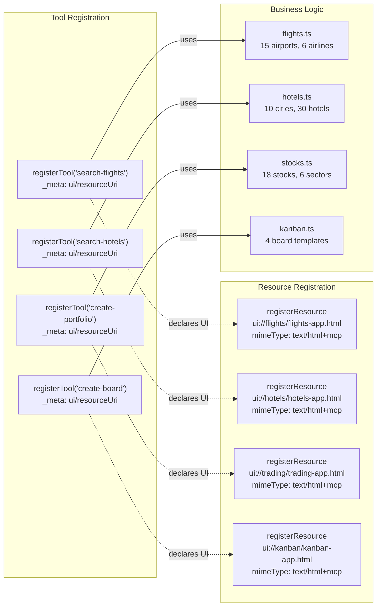
```mermaid
graph LR
    subgraph "Tool Registration"
        SearchFlights["registerTool('search-flights')<br/>_meta: ui/resourceUri"]
        SearchHotels["registerTool('search-hotels')<br/>_meta: ui/resourceUri"]
        CreatePortfolio["registerTool('create-portfolio')<br/>_meta: ui/resourceUri"]
        CreateBoard["registerTool('create-board')<br/>_meta: ui/resourceUri"]
    end
    
    subgraph "Resource Registration"
        FlightsResource["registerResource<br/>ui://flights/flights-app.html<br/>mimeType: text/html+mcp"]
        HotelsResource["registerResource<br/>ui://hotels/hotels-app.html<br/>mimeType: text/html+mcp"]
        TradingResource["registerResource<br/>ui://trading/trading-app.html<br/>mimeType: text/html+mcp"]
        KanbanResource["registerResource<br/>ui://kanban/kanban-app.html<br/>mimeType: text/html+mcp"]
    end
    
    subgraph "Business Logic"
        FlightsBL["flights.ts<br/>15 airports, 6 airlines"]
        HotelsBL["hotels.ts<br/>10 cities, 30 hotels"]
        StocksBL["stocks.ts<br/>18 stocks, 6 sectors"]
        KanbanBL["kanban.ts<br/>4 board templates"]
    end
    
    SearchFlights -.->|"declares UI"| FlightsResource
    SearchHotels -.->|"declares UI"| HotelsResource
    CreatePortfolio -.->|"declares UI"| TradingResource
    CreateBoard -.->|"declares UI"| KanbanResource
    
    SearchFlights -->|"uses"| FlightsBL
    SearchHotels -->|"uses"| HotelsBL
    CreatePortfolio -->|"uses"| StocksBL
    CreateBoard -->|"uses"| KanbanBL
```

**Diagram: Tool-to-UI Linking with Code Entities**

This diagram illustrates the dual registration pattern used throughout the system. Each main tool (registered via `server.registerTool`) declares its UI resource through the `_meta["ui/resourceUri"]` field. The corresponding HTML resource is registered separately via `server.registerResource` with the special MIME type `"text/html+mcp"` that marks it as an interactive MCP App. Both the tool handler and the UI can access the same business logic modules, enabling consistent data access patterns.

**Sources:** [README.md:76-88](), [CLAUDE.md:59-84](), [CLAUDE.md:87-92]()

## Communication Protocol Flow

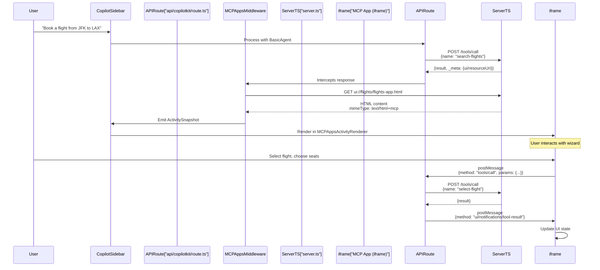
```mermaid
sequenceDiagram
    participant User
    participant CopilotSidebar
    participant APIRoute["api/copilotkit/route.ts"]
    participant MCPAppsMiddleware
    participant ServerTS["server.ts"]
    participant iframe["MCP App (iframe)"]
    
    User->>CopilotSidebar: "Book a flight from JFK to LAX"
    CopilotSidebar->>APIRoute: Process with BasicAgent
    APIRoute->>ServerTS: POST /tools/call<br/>{name: "search-flights"}
    ServerTS-->>APIRoute: {result, _meta: {ui/resourceUri}}
    
    APIRoute->>MCPAppsMiddleware: Intercepts response
    MCPAppsMiddleware->>ServerTS: GET ui://flights/flights-app.html
    ServerTS-->>MCPAppsMiddleware: HTML content<br/>mimeType: text/html+mcp
    
    MCPAppsMiddleware->>CopilotSidebar: Emit ActivitySnapshot
    CopilotSidebar->>iframe: Render in MCPAppsActivityRenderer
    
    Note over iframe: User interacts with wizard
    
    User->>iframe: Select flight, choose seats
    iframe->>APIRoute: postMessage<br/>{method: "tools/call", params: {...}}
    APIRoute->>ServerTS: POST /tools/call<br/>{name: "select-flight"}
    ServerTS-->>APIRoute: {result}
    APIRoute->>iframe: postMessage<br/>{method: "ui/notifications/tool-result"}
    iframe->>iframe: Update UI state
```

**Diagram: End-to-End Communication Flow**

This sequence diagram shows the complete interaction flow from natural language input to UI rendering and bidirectional communication. The key integration point is `api/copilotkit/route.ts`, which configures the `BasicAgent` with `MCPAppsMiddleware`. When a tool response contains `ui/resourceUri` metadata, the middleware fetches the HTML resource from `server.ts` and the `CopilotSidebar` renders it using the `MCPAppsActivityRenderer`. Once rendered, the iframe communicates directly with the MCP server via postMessage, bypassing the AI layer for interactive operations.

**Sources:** [README.md:59-73](), [CLAUDE.md:94-125](), [CLAUDE.md:129-147]()

## Key Technologies

The system is built using the following technologies and packages:

| Technology | Version | Purpose |
|------------|---------|---------|
| **CopilotKit** | `@copilotkitnext/*@1.51.0-next.4` | Chat interface with MCP Apps rendering support |
| **AG-UI MCP Apps Middleware** | `@ag-ui/mcp-apps-middleware@^0.0.1` | Bridges MCP servers with CopilotKit runtime |
| **MCP SDK** | `@modelcontextprotocol/sdk` | Model Context Protocol server implementation |
| **Next.js** | Latest | Frontend application framework |
| **Express.js** | Latest | MCP server HTTP/JSON-RPC endpoint |
| **Vite** | Latest | Bundles HTML apps into single-file outputs |
| **OpenAI API** | GPT-4 | Natural language processing |

**Critical Version Requirement:** MCP Apps support requires CopilotKit version `1.51.0-next.4` or later. Earlier versions (including `0.0.x` series) do not include the `MCPAppsActivityRenderer` component and cannot render MCP Apps.

The `viteSingleFile` plugin is used to bundle each MCP App into a self-contained HTML file with inlined CSS and JavaScript, eliminating external dependencies for iframe sandboxing.

**Sources:** [README.md:113-118](), [CLAUDE.md:156-175]()

## Project Layout

```
mcp-apps/
├── src/app/
│   ├── page.tsx                    # Main demo page with CopilotKitProvider
│   └── api/copilotkit/route.ts     # BasicAgent + MCPAppsMiddleware config
├── mcp-server/
│   ├── server.ts                   # MCP server entry point
│   ├── src/
│   │   ├── flights.ts              # 15 airports, 6 airlines data
│   │   ├── hotels.ts               # 10 cities, 30 hotels data
│   │   ├── stocks.ts               # 18 stocks, portfolio logic
│   │   └── kanban.ts               # Board templates and card management
│   └── apps/
│       ├── flights-app.html        # Airline booking wizard source
│       ├── hotels-app.html         # Hotel booking wizard source
│       ├── trading-app.html        # Investment simulator source
│       ├── kanban-app.html         # Kanban board source
│       ├── shared-styles.css       # Glassmorphism design system
│       ├── lucide-icons.js         # Icon library
│       └── dist/                   # Built single-file outputs
├── package.json                    # Frontend dependencies
└── README.md                       # Documentation
```

The repository follows a clear separation between the Next.js frontend (port 3000) and the independent MCP server (port 3001). Business logic modules in `mcp-server/src/` are used by both tool handlers in `server.ts` and can be referenced by the MCP Apps. The `apps/` directory contains source HTML files that are built into `dist/` using Vite with the `viteSingleFile` plugin.

**Sources:** [README.md:91-110](), [CLAUDE.md:36-54]()

## Deployment Architecture

The application is designed for independent deployment of frontend and server components:

| Component | Port | Deployment Target | Environment Variables |
|-----------|------|-------------------|----------------------|
| Next.js Frontend | 3000 | Railway / Vercel | `OPENAI_API_KEY`, `MCP_SERVER_URL` |
| MCP Server | 3001 | Railway | None required |

The `MCP_SERVER_URL` environment variable in the frontend configures the connection to the MCP server. For local development, this defaults to `http://localhost:3001`. In production, it points to the deployed MCP server instance (e.g., `https://mcp-server-production-bbb4.up.railway.app`).

Both components have separate Dockerfiles for containerized deployment, enabling independent scaling and updates.

**Sources:** [README.md:120-128](), [CLAUDE.md:12-23]()

---

# Page: Architecture

# Architecture

<details>
<summary>Relevant source files</summary>

The following files were used as context for generating this wiki page:

- [CLAUDE.md](CLAUDE.md)
- [README.md](README.md)

</details>


The MCP Apps Demo implements a three-tier architecture that enables interactive HTML/JavaScript applications to render within a conversational AI interface. This document explains the system structure, communication protocols, and the tool-to-UI linking mechanism that connects AI tool invocations to interactive user interfaces.

For implementation details of the frontend layer, see [Frontend Application](#4). For MCP Server implementation, see [MCP Server](#5). For individual MCP App architectures, see [MCP Apps](#6).

**Sources:** CLAUDE.md, README.md

---

## System Overview

The system consists of three primary layers that communicate via HTTP and postMessage protocols:

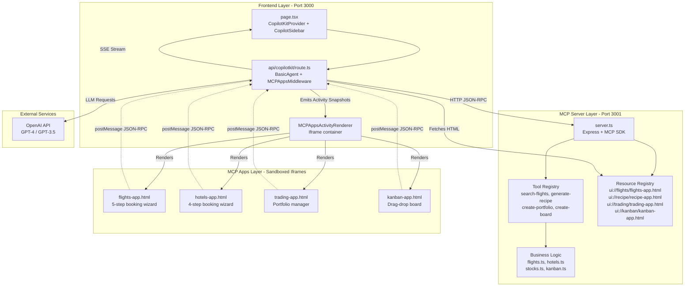
```mermaid
graph TB
    subgraph "Frontend Layer - Port 3000"
        PageTSX["page.tsx<br/>CopilotKitProvider + CopilotSidebar"]
        RouteTS["api/copilotkit/route.ts<br/>BasicAgent + MCPAppsMiddleware"]
        ActivityRenderer["MCPAppsActivityRenderer<br/>Iframe container"]
    end
    
    subgraph "MCP Server Layer - Port 3001"
        ServerTS["server.ts<br/>Express + MCP SDK"]
        ToolRegistry["Tool Registry<br/>search-flights, generate-recipe<br/>create-portfolio, create-board"]
        ResourceRegistry["Resource Registry<br/>ui://flights/flights-app.html<br/>ui://recipe/recipe-app.html<br/>ui://trading/trading-app.html<br/>ui://kanban/kanban-app.html"]
        BusinessLogic["Business Logic<br/>flights.ts, hotels.ts<br/>stocks.ts, kanban.ts"]
    end
    
    subgraph "MCP Apps Layer - Sandboxed Iframes"
        FlightsHTML["flights-app.html<br/>5-step booking wizard"]
        HotelsHTML["hotels-app.html<br/>4-step booking wizard"]
        TradingHTML["trading-app.html<br/>Portfolio manager"]
        KanbanHTML["kanban-app.html<br/>Drag-drop board"]
    end
    
    subgraph "External Services"
        OpenAI["OpenAI API<br/>GPT-4 / GPT-3.5"]
    end
    
    PageTSX --> RouteTS
    RouteTS -->|"SSE Stream"| PageTSX
    RouteTS -->|"LLM Requests"| OpenAI
    RouteTS -->|"HTTP JSON-RPC"| ServerTS
    
    ServerTS --> ToolRegistry
    ServerTS --> ResourceRegistry
    ToolRegistry --> BusinessLogic
    
    RouteTS -->|"Fetches HTML"| ResourceRegistry
    RouteTS -->|"Emits Activity Snapshots"| ActivityRenderer
    
    ActivityRenderer -->|"Renders"| FlightsHTML
    ActivityRenderer -->|"Renders"| HotelsHTML
    ActivityRenderer -->|"Renders"| TradingHTML
    ActivityRenderer -->|"Renders"| KanbanHTML
    
    FlightsHTML -.->|"postMessage JSON-RPC"| RouteTS
    HotelsHTML -.->|"postMessage JSON-RPC"| RouteTS
    TradingHTML -.->|"postMessage JSON-RPC"| RouteTS
    KanbanHTML -.->|"postMessage JSON-RPC"| RouteTS
```

**Sources:** CLAUDE.md:129-147, README.md:57-73

---

## Component Layers

### Frontend Layer

The frontend layer runs on port 3000 as a Next.js application. It provides the chat interface and orchestrates communication between the AI agent and the MCP Server.

| Component | File | Purpose |
|-----------|------|---------|
| Main Page | `src/app/page.tsx` | Renders `CopilotKitProvider` with `CopilotSidebar` |
| API Route | `src/app/api/copilotkit/route.ts` | Configures `BasicAgent` and `MCPAppsMiddleware` |
| Activity Renderer | `MCPAppsActivityRenderer` | Renders MCP Apps in sandboxed iframes |

The API route [src/app/api/copilotkit/route.ts]() serves as the primary integration point. It instantiates:

- `BasicAgent` - Processes natural language and executes tool calls
- `MCPAppsMiddleware` - Intercepts tool responses containing `ui/resourceUri` metadata
- `CopilotRuntime` - Manages the SSE stream to the frontend

**Sources:** CLAUDE.md:36-42, README.md:93-96

### MCP Server Layer

The MCP Server runs independently on port 3001 as an Express.js application using the `@modelcontextprotocol/sdk`. It registers tools and resources that define available operations and their associated UIs.

| Component | File | Purpose |
|-----------|------|---------|
| Server Core | `mcp-server/server.ts` | Express server with MCP SDK integration |
| Flights Logic | `mcp-server/src/flights.ts` | 15 airports, 6 airlines, flight search |
| Hotels Logic | `mcp-server/src/hotels.ts` | 10 cities, 30 hotels, availability |
| Stocks Logic | `mcp-server/src/stocks.ts` | 18 stocks, portfolio management |
| Kanban Logic | `mcp-server/src/kanban.ts` | Board templates, card operations |

The server exposes two primary registration APIs:

1. **Tool Registration** - Defines callable operations with JSON schemas
2. **Resource Registration** - Serves HTML content with special MIME type

**Sources:** CLAUDE.md:43-54, README.md:98-109

### MCP Apps Layer

MCP Apps are self-contained HTML/JavaScript applications built with Vite. Each app includes:

- Embedded CSS using the shared glassmorphism design system
- Inlined Lucide icons for UI elements
- `mcpApp` communication module for JSON-RPC over postMessage
- State management for multi-step workflows

| Application | File | Steps/Features |
|-------------|------|----------------|
| Airline Booking | `mcp-server/apps/flights-app.html` | Search → Select → Seats → Details → Confirm |
| Hotel Booking | `mcp-server/apps/hotels-app.html` | Search → Select → Rooms → Confirm |
| Investment Simulator | `mcp-server/apps/trading-app.html` | Holdings, Charts, Trade Modal |
| Kanban Board | `mcp-server/apps/kanban-app.html` | Columns, Drag-Drop Cards, Detail Modal |

Apps are built to `mcp-server/apps/dist/*.html` as single-file bundles via Vite with the `viteSingleFile` plugin.

**Sources:** CLAUDE.md:27-33, README.md:13-18, CLAUDE.md:54

---

## Communication Protocols

### Tool Invocation Flow

The system follows a standardized flow for tool invocation and UI rendering:

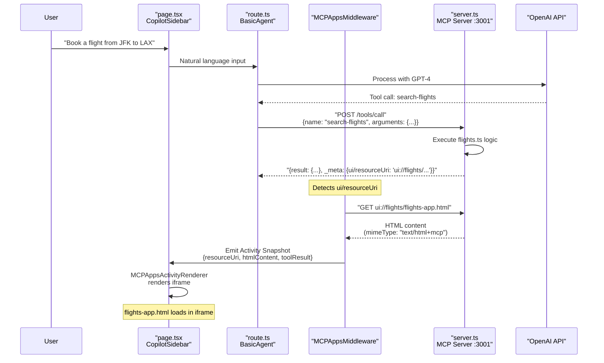
```mermaid
sequenceDiagram
    participant User
    participant Frontend as "page.tsx<br/>CopilotSidebar"
    participant Agent as "route.ts<br/>BasicAgent"
    participant Middleware as "MCPAppsMiddleware"
    participant MCPServer as "server.ts<br/>MCP Server :3001"
    participant OpenAI as "OpenAI API"
    
    User->>Frontend: "Book a flight from JFK to LAX"
    Frontend->>Agent: Natural language input
    Agent->>OpenAI: Process with GPT-4
    OpenAI-->>Agent: Tool call: search-flights
    
    Agent->>MCPServer: "POST /tools/call"<br/>{name: "search-flights", arguments: {...}}
    MCPServer->>MCPServer: Execute flights.ts logic
    MCPServer-->>Agent: "{result: {...}, _meta: {ui/resourceUri: 'ui://flights/...'}}"
    
    Note over Middleware: Detects ui/resourceUri
    
    Middleware->>MCPServer: "GET ui://flights/flights-app.html"
    MCPServer-->>Middleware: HTML content<br/>(mimeType: "text/html+mcp")
    
    Middleware->>Frontend: Emit Activity Snapshot<br/>{resourceUri, htmlContent, toolResult}
    Frontend->>Frontend: MCPAppsActivityRenderer<br/>renders iframe
    
    Note over Frontend: flights-app.html loads in iframe
```

**Key Points:**

1. Tools return results with `_meta["ui/resourceUri"]` to trigger UI rendering
2. The `text/html+mcp` MIME type identifies HTML as an interactive MCP App
3. Activity snapshots contain both the HTML content and the tool result data
4. The frontend automatically renders detected MCP Apps in iframes

**Sources:** CLAUDE.md:58-84, README.md:75-88

### JSON-RPC over postMessage

MCP Apps communicate bidirectionally with the MCP Server using JSON-RPC 2.0 over the postMessage API. All four apps implement an identical `mcpApp` module pattern:

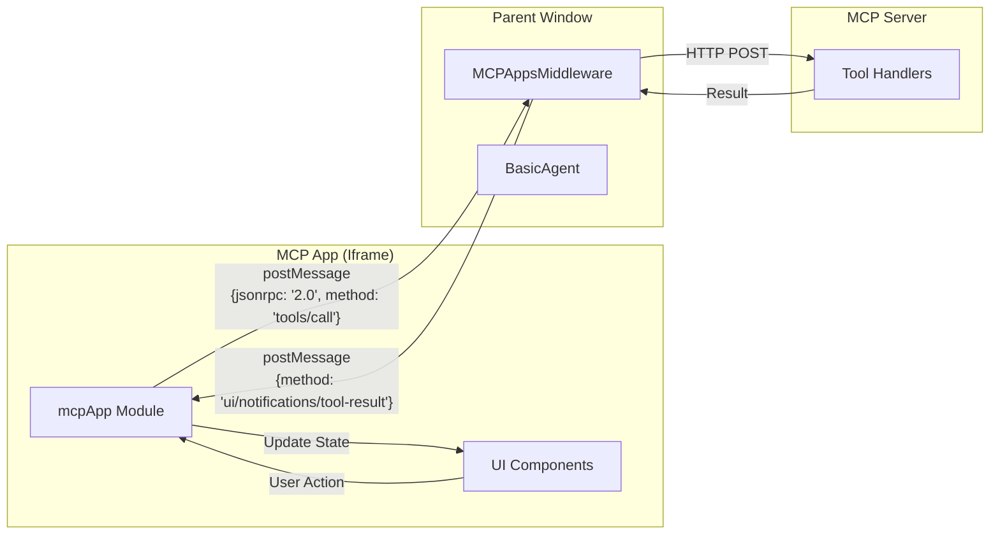
```mermaid
graph LR
    subgraph "MCP App (Iframe)"
        mcpApp["mcpApp Module"]
        UI["UI Components"]
    end
    
    subgraph "Parent Window"
        Middleware["MCPAppsMiddleware"]
        Agent["BasicAgent"]
    end
    
    subgraph "MCP Server"
        ToolHandlers["Tool Handlers"]
    end
    
    UI -->|"User Action"| mcpApp
    mcpApp -->|"postMessage<br/>{jsonrpc: '2.0', method: 'tools/call'}"| Middleware
    Middleware -->|"HTTP POST"| ToolHandlers
    ToolHandlers -->|"Result"| Middleware
    Middleware -->|"postMessage<br/>{method: 'ui/notifications/tool-result'}"| mcpApp
    mcpApp -->|"Update State"| UI
```

The `mcpApp` module provides two primary methods:

| Method | Purpose | Example |
|--------|---------|---------|
| `sendRequest(method, params)` | Call tools, returns Promise | `mcpApp.sendRequest("tools/call", {name: "select-flight", arguments: {...}})` |
| `sendNotification(method, params)` | Send one-way messages | `mcpApp.sendNotification("ui/state-changed", {...})` |
| `onNotification(method, handler)` | Listen for server events | `mcpApp.onNotification("ui/notifications/tool-result", (params) => {...})` |

**Request Format:**
```javascript
{
  jsonrpc: "2.0",
  id: 1,
  method: "tools/call",
  params: {
    name: "select-flight",
    arguments: { flightId: "UA123", ... }
  }
}
```

**Notification Format:**
```javascript
{
  jsonrpc: "2.0",
  method: "ui/notifications/tool-result",
  params: {
    toolName: "select-flight",
    structuredContent: { ... }
  }
}
```

**Sources:** CLAUDE.md:94-125

---

## Tool-to-UI Linking Mechanism

The system uses a dual registration pattern to link tools with their UI resources:

### Tool Registration with Metadata

Each main tool declares its UI resource using the `_meta` field with key `"ui/resourceUri"`:

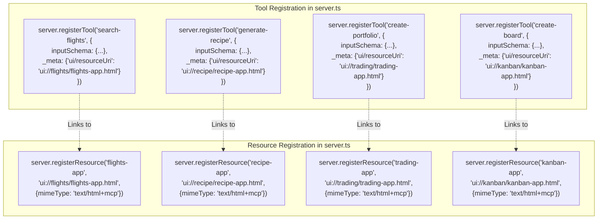
```mermaid
graph TB
    subgraph "Tool Registration in server.ts"
        Tool1["server.registerTool('search-flights', {<br/>inputSchema: {...},<br/>_meta: {'ui/resourceUri': 'ui://flights/flights-app.html'}<br/>})"]
        Tool2["server.registerTool('generate-recipe', {<br/>inputSchema: {...},<br/>_meta: {'ui/resourceUri': 'ui://recipe/recipe-app.html'}<br/>})"]
        Tool3["server.registerTool('create-portfolio', {<br/>inputSchema: {...},<br/>_meta: {'ui/resourceUri': 'ui://trading/trading-app.html'}<br/>})"]
        Tool4["server.registerTool('create-board', {<br/>inputSchema: {...},<br/>_meta: {'ui/resourceUri': 'ui://kanban/kanban-app.html'}<br/>})"]
    end
    
    subgraph "Resource Registration in server.ts"
        Resource1["server.registerResource('flights-app',<br/>'ui://flights/flights-app.html',<br/>{mimeType: 'text/html+mcp'})"]
        Resource2["server.registerResource('recipe-app',<br/>'ui://recipe/recipe-app.html',<br/>{mimeType: 'text/html+mcp'})"]
        Resource3["server.registerResource('trading-app',<br/>'ui://trading/trading-app.html',<br/>{mimeType: 'text/html+mcp'})"]
        Resource4["server.registerResource('kanban-app',<br/>'ui://kanban/kanban-app.html',<br/>{mimeType: 'text/html+mcp'})"]
    end
    
    Tool1 -.->|"Links to"| Resource1
    Tool2 -.->|"Links to"| Resource2
    Tool3 -.->|"Links to"| Resource3
    Tool4 -.->|"Links to"| Resource4
```

The `RESOURCE_URI_META_KEY` constant in [mcp-server/server.ts]() defines the metadata key: `"ui/resourceUri"`.

**Sources:** CLAUDE.md:58-84, CLAUDE.md:86-92

### Helper Tools Pattern

Each MCP App has access to additional helper tools that do NOT include `ui/resourceUri` metadata. These tools handle granular interactions:

| Main Tool | Helper Tools | Purpose |
|-----------|--------------|---------|
| `search-flights` | `select-flight`, `select-seats`, `book-flight` | Step-by-step booking operations |
| `search-hotels` | `select-hotel`, `select-room`, `book-hotel` | Hotel reservation workflow |
| `create-portfolio` | `execute-trade`, `refresh-prices` | Trading operations |
| `create-board` | `add-card`, `update-card`, `delete-card`, `move-card` | Kanban CRUD operations |

Helper tools are called directly from MCP App UIs via `mcpApp.sendRequest("tools/call", {...})` and return data without triggering new UI renders.

**Sources:** CLAUDE.md:27-33, README.md:13-18

---

## Data Flow Architecture

The complete data flow through the system demonstrates separation of concerns between AI-driven invocation and user-driven interaction:

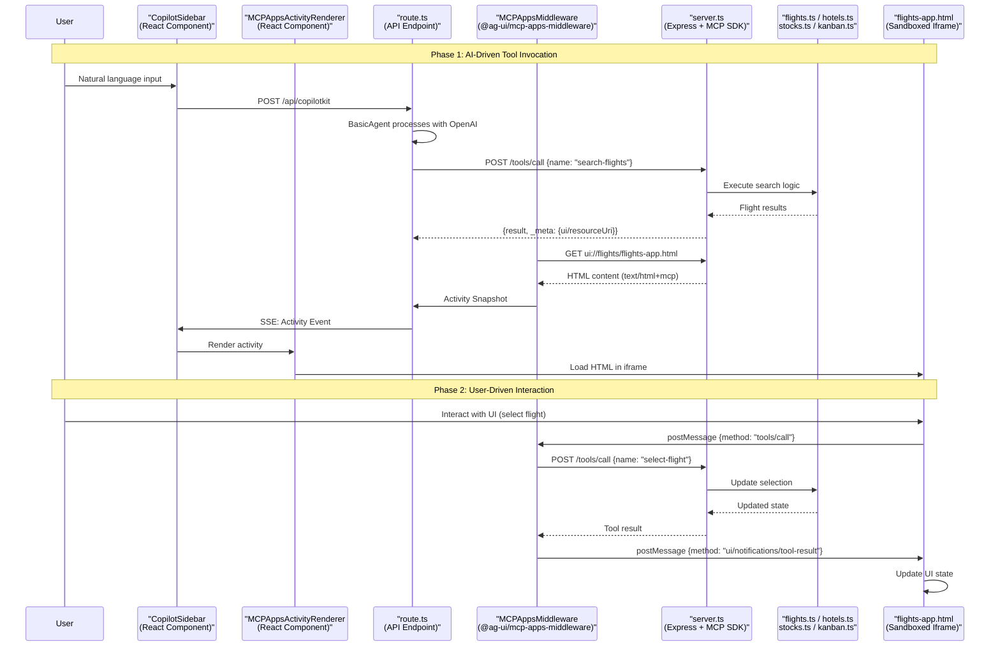
```mermaid
sequenceDiagram
    participant User
    participant CopilotSidebar as "CopilotSidebar<br/>(React Component)"
    participant MCPAppsRenderer as "MCPAppsActivityRenderer<br/>(React Component)"
    participant RouteTS as "route.ts<br/>(API Endpoint)"
    participant MCPAppsMiddleware as "MCPAppsMiddleware<br/>(@ag-ui/mcp-apps-middleware)"
    participant ServerTS as "server.ts<br/>(Express + MCP SDK)"
    participant BusinessLogic as "flights.ts / hotels.ts<br/>stocks.ts / kanban.ts"
    participant MCPAppIframe as "flights-app.html<br/>(Sandboxed Iframe)"
    
    Note over User,MCPAppIframe: Phase 1: AI-Driven Tool Invocation
    
    User->>CopilotSidebar: Natural language input
    CopilotSidebar->>RouteTS: POST /api/copilotkit
    RouteTS->>RouteTS: BasicAgent processes with OpenAI
    RouteTS->>ServerTS: POST /tools/call {name: "search-flights"}
    ServerTS->>BusinessLogic: Execute search logic
    BusinessLogic-->>ServerTS: Flight results
    ServerTS-->>RouteTS: {result, _meta: {ui/resourceUri}}
    
    MCPAppsMiddleware->>ServerTS: GET ui://flights/flights-app.html
    ServerTS-->>MCPAppsMiddleware: HTML content (text/html+mcp)
    MCPAppsMiddleware->>RouteTS: Activity Snapshot
    RouteTS->>CopilotSidebar: SSE: Activity Event
    CopilotSidebar->>MCPAppsRenderer: Render activity
    MCPAppsRenderer->>MCPAppIframe: Load HTML in iframe
    
    Note over User,MCPAppIframe: Phase 2: User-Driven Interaction
    
    User->>MCPAppIframe: Interact with UI (select flight)
    MCPAppIframe->>MCPAppsMiddleware: postMessage {method: "tools/call"}
    MCPAppsMiddleware->>ServerTS: POST /tools/call {name: "select-flight"}
    ServerTS->>BusinessLogic: Update selection
    BusinessLogic-->>ServerTS: Updated state
    ServerTS-->>MCPAppsMiddleware: Tool result
    MCPAppsMiddleware->>MCPAppIframe: postMessage {method: "ui/notifications/tool-result"}
    MCPAppIframe->>MCPAppIframe: Update UI state
```

### Key Architectural Properties

1. **Stateless Tool Handlers** - Each tool call is independent; state is managed by the MCP App UI
2. **Middleware Interception** - MCPAppsMiddleware transparently intercepts and processes `ui/resourceUri` metadata
3. **Sandboxed Execution** - MCP Apps run in iframes with restricted permissions for security
4. **Bidirectional Communication** - Apps can both receive data and call tools without AI involvement

**Sources:** CLAUDE.md:129-147, README.md:57-73

---

## Deployment Architecture

The system supports both local development and production deployment with independent scaling of frontend and MCP Server:

| Component | Development | Production |
|-----------|-------------|------------|
| Frontend | `localhost:3000` | Railway / Vercel |
| MCP Server | `localhost:3001` | Railway |
| Environment Variable | `MCP_SERVER_URL` (optional, defaults to localhost) | `MCP_SERVER_URL` (required) |

For deployment details, see [Docker Deployment](#8.2).

**Sources:** README.md:20-56, README.md:119-129

---

# Page: Getting Started

# Getting Started

<details>
<summary>Relevant source files</summary>

The following files were used as context for generating this wiki page:

- [Dockerfile](Dockerfile)
- [README.md](README.md)
- [mcp-server/Dockerfile](mcp-server/Dockerfile)

</details>


This page provides instructions for installing dependencies, configuring environment variables, and running the MCP Apps Demo locally. It covers the setup process for both the Next.js frontend application and the MCP Server, as well as verification steps to ensure the system is running correctly.

For information about the overall system architecture and how components interact, see [Architecture](#2). For details on the MCP Server implementation, see [MCP Server](#5). For deployment to production environments, see [Docker Deployment](#8.2).

## Prerequisites

The MCP Apps Demo requires the following software installed on your development machine:

| Requirement | Version | Purpose |
|-------------|---------|---------|
| Node.js | 20.x | Runtime environment for both frontend and MCP Server |
| npm | 9.x or higher | Package manager for dependency installation |
| OpenAI API Key | - | Required for LLM processing via CopilotKit |

The project uses Node.js 20 as specified in both [Dockerfile:1]() and [mcp-server/Dockerfile:1]().

**Sources:** Dockerfile, mcp-server/Dockerfile

## Repository Structure

The repository follows a monorepo structure with two main service directories:

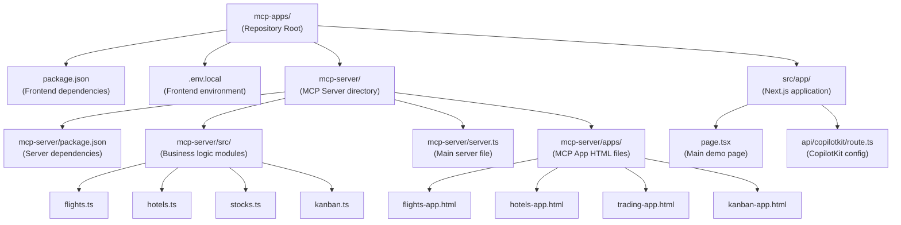
```mermaid
graph TB
    Root["mcp-apps/<br/>(Repository Root)"]
    
    RootPkg["package.json<br/>(Frontend dependencies)"]
    RootEnv[".env.local<br/>(Frontend environment)"]
    RootSrc["src/app/<br/>(Next.js application)"]
    
    MCPDir["mcp-server/<br/>(MCP Server directory)"]
    MCPPkg["mcp-server/package.json<br/>(Server dependencies)"]
    MCPSrc["mcp-server/src/<br/>(Business logic modules)"]
    MCPServer["mcp-server/server.ts<br/>(Main server file)"]
    MCPApps["mcp-server/apps/<br/>(MCP App HTML files)"]
    
    Root --> RootPkg
    Root --> RootEnv
    Root --> RootSrc
    Root --> MCPDir
    
    MCPDir --> MCPPkg
    MCPDir --> MCPSrc
    MCPDir --> MCPServer
    MCPDir --> MCPApps
    
    RootSrc --> PageTSX["page.tsx<br/>(Main demo page)"]
    RootSrc --> APIRoute["api/copilotkit/route.ts<br/>(CopilotKit config)"]
    
    MCPSrc --> Flights["flights.ts"]
    MCPSrc --> Hotels["hotels.ts"]
    MCPSrc --> Stocks["stocks.ts"]
    MCPSrc --> Kanban["kanban.ts"]
    
    MCPApps --> FlightsApp["flights-app.html"]
    MCPApps --> HotelsApp["hotels-app.html"]
    MCPApps --> TradingApp["trading-app.html"]
    MCPApps --> KanbanApp["kanban-app.html"]
```

The root directory contains the Next.js frontend application, while the `mcp-server/` subdirectory contains a separate Node.js application that serves as the MCP Server. Each has its own `package.json` and dependency set, as shown in [README.md:25-30]().

**Sources:** README.md

## Installation Steps

### Step 1: Install Frontend Dependencies

Navigate to the repository root and install dependencies for the Next.js application:

```bash
npm install
```

The frontend installation uses the `--legacy-peer-deps` flag in the Dockerfile configuration at [Dockerfile:9]() to resolve peer dependency conflicts between CopilotKit packages.

### Step 2: Install MCP Server Dependencies

Navigate to the MCP Server directory and install its dependencies:

```bash
cd mcp-server
npm install
cd ..
```

The MCP Server has its own dependency tree defined in `mcp-server/package.json`, separate from the frontend dependencies. In production, [mcp-server/Dockerfile:9]() uses `npm ci` for deterministic installs.

**Sources:** README.md, Dockerfile, mcp-server/Dockerfile

## Environment Configuration

### Required Environment Variables

Create a `.env.local` file in the repository root (the `mcp-apps/` directory) with the following configuration:

| Variable | Required | Description | Example |
|----------|----------|-------------|---------|
| `OPENAI_API_KEY` | Yes | OpenAI API key for LLM processing | `sk-proj-...` |
| `MCP_SERVER_URL` | No | URL of MCP Server (defaults to `http://localhost:3001/mcp` in development) | `https://mcp-server-production.up.railway.app` |

The minimum required configuration for local development:

```bash
OPENAI_API_KEY=sk-proj-your-key-here
```

As shown in [README.md:35-39](), the `OPENAI_API_KEY` is the only required variable for local development. The frontend application at [src/app/api/copilotkit/route.ts]() uses this key to configure the CopilotKit agent with OpenAI integration.

The `MCP_SERVER_URL` variable is optional in development because the system defaults to `http://localhost:3001/mcp` when running locally. This variable becomes necessary in production deployments where the MCP Server may be hosted separately, as mentioned in [README.md:128]().

**Sources:** README.md

## Running the Application

### Development Workflow

The application requires two separate processes running concurrently:

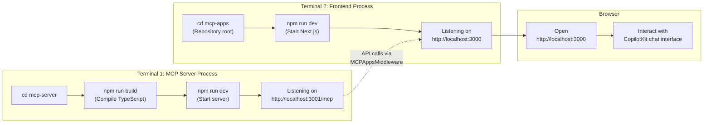
```mermaid
graph LR
    subgraph "Terminal 1: MCP Server Process"
        T1Start["cd mcp-server"]
        T1Build["npm run build<br/>(Compile TypeScript)"]
        T1Dev["npm run dev<br/>(Start server)"]
        T1Port["Listening on<br/>http://localhost:3001/mcp"]
    end
    
    subgraph "Terminal 2: Frontend Process"
        T2Start["cd mcp-apps<br/>(Repository root)"]
        T2Dev["npm run dev<br/>(Start Next.js)"]
        T2Port["Listening on<br/>http://localhost:3000"]
    end
    
    subgraph "Browser"
        Open["Open<br/>http://localhost:3000"]
        Chat["Interact with<br/>CopilotKit chat interface"]
    end
    
    T1Start --> T1Build
    T1Build --> T1Dev
    T1Dev --> T1Port
    
    T2Start --> T2Dev
    T2Dev --> T2Port
    
    T2Port --> Open
    T1Port -.->|"API calls via<br/>MCPAppsMiddleware"| T2Port
    Open --> Chat
```

### Terminal 1: Start MCP Server

From the `mcp-server/` directory:

```bash
cd mcp-server
npm run build
npm run dev
```

The server will start and listen at `http://localhost:3001/mcp`. The build step compiles TypeScript source files from `mcp-server/src/` into JavaScript, as specified in [mcp-server/Dockerfile:15](). The MCP Server exposes tool registration, resource serving, and JSON-RPC endpoints, which are documented in [MCP Server](#5).

### Terminal 2: Start Frontend Application

From the repository root (the `mcp-apps/` directory):

```bash
npm run dev
```

The Next.js development server will start at `http://localhost:3000`. The frontend application includes the CopilotKit chat interface configured at [src/app/api/copilotkit/route.ts]() and the main demo page at [src/app/page.tsx]().

These steps are documented in [README.md:42-55]().

**Sources:** README.md, mcp-server/Dockerfile

## Verification

### Accessing the Application

Once both services are running, open your browser and navigate to:

```
http://localhost:3000
```

You should see the MCP Apps Demo interface with a chat sidebar powered by CopilotKit.

### Testing with Example Prompts

Verify the system is working correctly by trying one of the following prompts in the chat interface:

| App Type | Example Prompt | Expected Behavior |
|----------|----------------|-------------------|
| Airline Booking | "Book a flight from JFK to LAX on January 20th for 2 passengers" | Opens `flights-app.html` in sidebar with 5-step wizard |
| Hotel Booking | "Find a hotel in Paris from January 15 to 18 for 2 guests" | Opens `hotels-app.html` in sidebar with search results |
| Investment Simulator | "Create a $10,000 tech-focused portfolio" | Opens `trading-app.html` with portfolio dashboard |
| Kanban Board | "Create a kanban board for my software project" | Opens `kanban-app.html` with drag-drop interface |

These example prompts are provided in [README.md:13-18](). Each prompt triggers the AI to call a corresponding MCP tool (`search-flights`, `search-hotels`, `create-portfolio`, `create-board`), which responds with a `ui/resourceUri` metadata field pointing to the appropriate HTML resource. The MCPAppsMiddleware intercepts this metadata and renders the HTML in an iframe within the CopilotSidebar.

### Process Communication Flow

When you submit a prompt, the following sequence occurs:

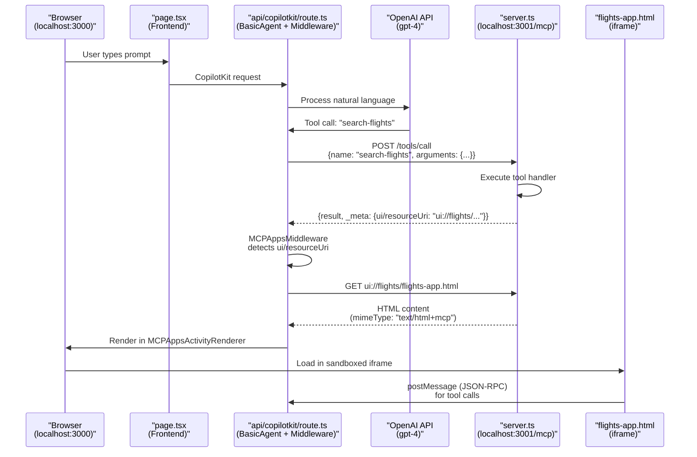
```mermaid
sequenceDiagram
    participant Browser as "Browser<br/>(localhost:3000)"
    participant NextJS as "page.tsx<br/>(Frontend)"
    participant APIRoute as "api/copilotkit/route.ts<br/>(BasicAgent + Middleware)"
    participant OpenAI as "OpenAI API<br/>(gpt-4)"
    participant MCPServer as "server.ts<br/>(localhost:3001/mcp)"
    participant MCPApp as "flights-app.html<br/>(iframe)"
    
    Browser->>NextJS: User types prompt
    NextJS->>APIRoute: CopilotKit request
    APIRoute->>OpenAI: Process natural language
    OpenAI->>APIRoute: Tool call: "search-flights"
    APIRoute->>MCPServer: POST /tools/call<br/>{name: "search-flights", arguments: {...}}
    MCPServer->>MCPServer: Execute tool handler
    MCPServer-->>APIRoute: {result, _meta: {ui/resourceUri: "ui://flights/..."}}
    APIRoute->>APIRoute: MCPAppsMiddleware<br/>detects ui/resourceUri
    APIRoute->>MCPServer: GET ui://flights/flights-app.html
    MCPServer-->>APIRoute: HTML content<br/>(mimeType: "text/html+mcp")
    APIRoute->>Browser: Render in MCPAppsActivityRenderer
    Browser->>MCPApp: Load in sandboxed iframe
    MCPApp->>APIRoute: postMessage (JSON-RPC)<br/>for tool calls
```

This flow demonstrates how the two services communicate during a typical user interaction. The sequence is described in [README.md:57-73]() and involves coordination between the frontend at port 3000, the MCP Server at port 3001, and the OpenAI API.

**Sources:** README.md

## Common Issues

### Port Already in Use

If you encounter errors about ports 3000 or 3001 already being in use, terminate existing Node.js processes:

```bash
# Find processes using ports
lsof -i :3000
lsof -i :3001

# Kill specific process IDs
kill -9 <PID>
```

### Missing OpenAI API Key

If you see authentication errors or the chat interface fails to respond, verify that:

1. The `.env.local` file exists in the repository root
2. The `OPENAI_API_KEY` variable is set correctly
3. The API key is valid and has available credits

The key is loaded by Next.js and passed to the CopilotKit configuration in [src/app/api/copilotkit/route.ts]().

### MCP Server Connection Failed

If the frontend cannot connect to the MCP Server, ensure:

1. The MCP Server process is running in Terminal 1
2. The server is listening on port 3001 (check terminal output)
3. No firewall is blocking localhost connections
4. The `MCP_SERVER_URL` environment variable (if set) points to `http://localhost:3001/mcp`

### TypeScript Build Errors

If `npm run build` fails in the `mcp-server/` directory, try:

```bash
cd mcp-server
rm -rf dist node_modules
npm install
npm run build
```

This clears compiled artifacts and reinstalls dependencies.

**Sources:** README.md, Dockerfile, mcp-server/Dockerfile

## Next Steps

After successfully running the application locally:

- Explore the [Frontend Application](#4) to understand the Next.js structure and CopilotKit integration
- Learn about [MCP Server](#5) architecture and tool registration patterns
- Study individual [MCP Apps](#6) to see how they implement the communication protocol
- Review [Build Configuration](#8.1) to understand how apps are bundled into single HTML files
- Deploy to production using [Docker Deployment](#8.2) instructions

**Sources:** README.md

---

# Page: Frontend Application

# Frontend Application

<details>
<summary>Relevant source files</summary>

The following files were used as context for generating this wiki page:

- [CLAUDE.md](CLAUDE.md)
- [README.md](README.md)
- [eslint.config.mjs](eslint.config.mjs)

</details>


The Frontend Application is a Next.js application that serves as the user-facing interface for the MCP Apps Demo. It integrates CopilotKit to provide an AI-powered chat interface where MCP Apps render in sandboxed iframes within the chat sidebar. The frontend communicates with both OpenAI for language model processing and the MCP Server for tool execution and resource retrieval.

For detailed information about CopilotKit integration patterns and middleware configuration, see [CopilotKit Integration](#4.1). For MCP Apps rendering details, see [MCP Apps](#6).

## Application Architecture

The frontend follows Next.js 13+ App Router conventions with a minimal structure focused on the chat interface integration. The application consists of two primary components: the main page that renders the CopilotKit interface and an API route that configures the agent runtime.

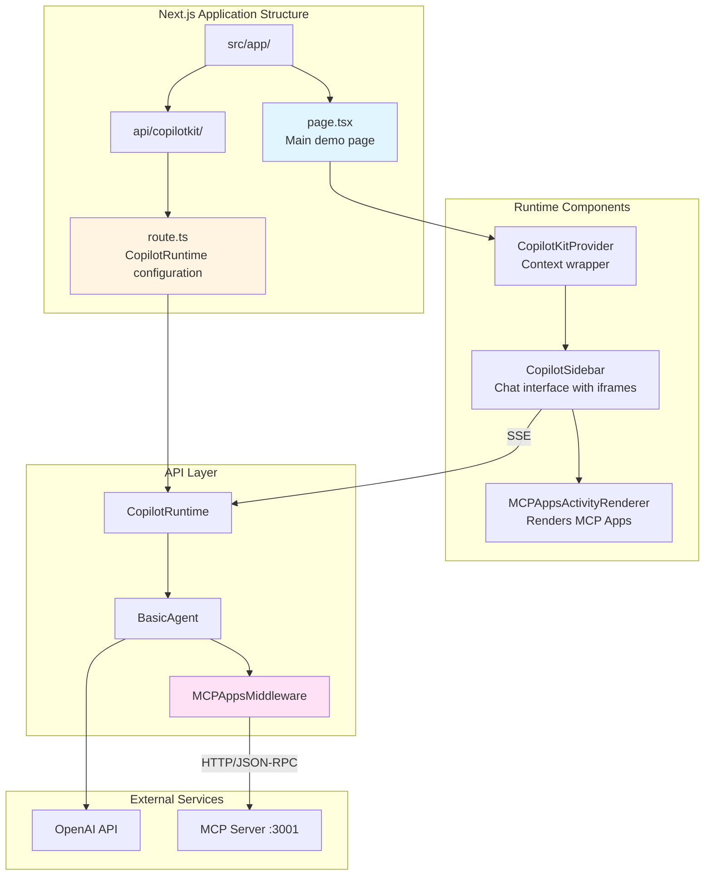
```mermaid
graph TB
    subgraph "Next.js Application Structure"
        App["src/app/"]
        PageTsx["page.tsx<br/>Main demo page"]
        ApiDir["api/copilotkit/"]
        RouteTsx["route.ts<br/>CopilotRuntime configuration"]
        
        App --> PageTsx
        App --> ApiDir
        ApiDir --> RouteTsx
    end
    
    subgraph "Runtime Components"
        CopilotKitProvider["CopilotKitProvider<br/>Context wrapper"]
        CopilotSidebar["CopilotSidebar<br/>Chat interface with iframes"]
        MCPActivityRenderer["MCPAppsActivityRenderer<br/>Renders MCP Apps"]
        
        PageTsx --> CopilotKitProvider
        CopilotKitProvider --> CopilotSidebar
        CopilotSidebar --> MCPActivityRenderer
    end
    
    subgraph "API Layer"
        CopilotRuntime["CopilotRuntime"]
        BasicAgent["BasicAgent"]
        MCPMiddleware["MCPAppsMiddleware"]
        
        RouteTsx --> CopilotRuntime
        CopilotRuntime --> BasicAgent
        BasicAgent --> MCPMiddleware
    end
    
    subgraph "External Services"
        OpenAI["OpenAI API"]
        MCPServer["MCP Server :3001"]
    end
    
    CopilotSidebar -->|SSE| CopilotRuntime
    BasicAgent --> OpenAI
    MCPMiddleware -->|HTTP/JSON-RPC| MCPServer
    
    style PageTsx fill:#e1f5ff
    style RouteTsx fill:#fff4e1
    style MCPMiddleware fill:#ffe1f5
```

**Sources**: CLAUDE.md, README.md, Diagram 1

## Main Page Component

The main page component at [src/app/page.tsx]() serves as the application's entry point. It configures the CopilotKit provider and renders the chat sidebar where MCP Apps display.

### Component Structure

The page implements a minimal React component that wraps the chat interface in the necessary CopilotKit providers:

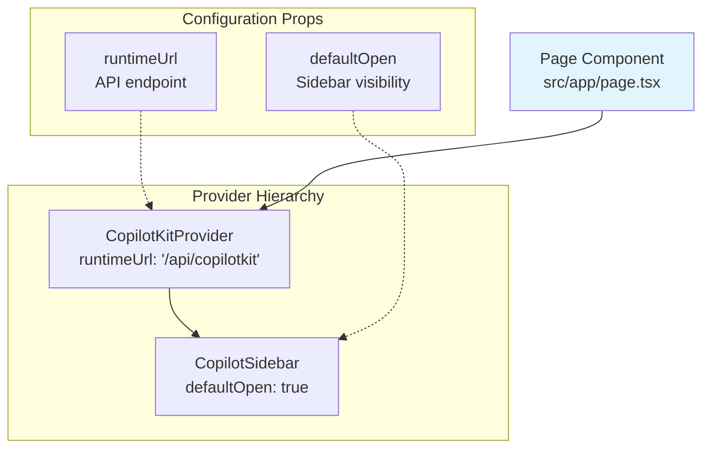
```mermaid
graph TB
    PageComponent["Page Component<br/>src/app/page.tsx"]
    
    subgraph "Provider Hierarchy"
        CKProvider["CopilotKitProvider<br/>runtimeUrl: '/api/copilotkit'"]
        Sidebar["CopilotSidebar<br/>defaultOpen: true"]
        
        CKProvider --> Sidebar
    end
    
    subgraph "Configuration Props"
        RuntimeUrl["runtimeUrl<br/>API endpoint"]
        DefaultOpen["defaultOpen<br/>Sidebar visibility"]
        
        RuntimeUrl -.-> CKProvider
        DefaultOpen -.-> Sidebar
    end
    
    PageComponent --> CKProvider
    
    style PageComponent fill:#e1f5ff
```

The `CopilotKitProvider` establishes connection to the API route at `/api/copilotkit` where the agent runtime is configured. The `CopilotSidebar` component renders with `defaultOpen={true}` to immediately display the chat interface when the page loads.

**Sources**: CLAUDE.md:41-42, README.md:95-96

## API Route Configuration

The API route at [src/app/api/copilotkit/route.ts]() configures the CopilotKit runtime with BasicAgent and MCPAppsMiddleware. This route serves as the bridge between the frontend chat interface and the MCP Server.

### Endpoint Pattern

The route uses Next.js catch-all route segments (`[[...slug]]`) to handle all requests under `/api/copilotkit/*`. This pattern allows CopilotKit to manage multiple endpoint paths for different aspects of the chat protocol.

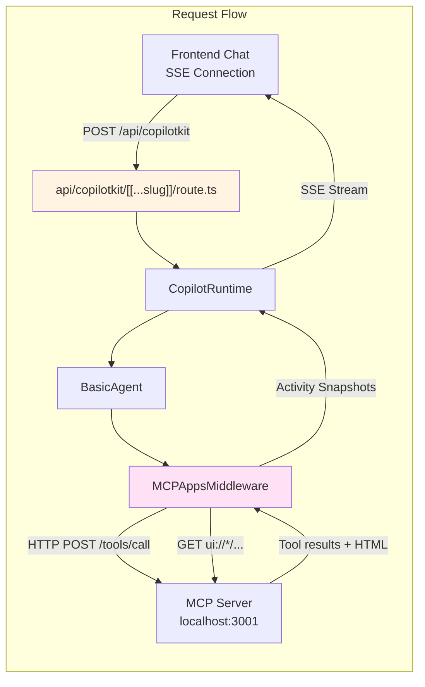
```mermaid
graph LR
    subgraph "Request Flow"
        Client["Frontend Chat<br/>SSE Connection"]
        Route["api/copilotkit/[[...slug]]/route.ts"]
        Runtime["CopilotRuntime"]
        Agent["BasicAgent"]
        Middleware["MCPAppsMiddleware"]
        MCPServer["MCP Server<br/>localhost:3001"]
    end
    
    Client -->|"POST /api/copilotkit"| Route
    Route --> Runtime
    Runtime --> Agent
    Agent --> Middleware
    Middleware -->|"HTTP POST /tools/call"| MCPServer
    Middleware -->|"GET ui://*/..."| MCPServer
    MCPServer -->|"Tool results + HTML"| Middleware
    Middleware -->|"Activity Snapshots"| Runtime
    Runtime -->|"SSE Stream"| Client
    
    style Route fill:#fff4e1
    style Middleware fill:#ffe1f5
```

### Runtime Configuration

The route configures three key components:

| Component | Purpose | Configuration |
|-----------|---------|---------------|
| `CopilotRuntime` | Manages SSE streaming to frontend | Wraps agent and middleware |
| `BasicAgent` | Processes LLM interactions | Configured with OpenAI model |
| `MCPAppsMiddleware` | Intercepts UI-enabled tool calls | Points to MCP Server URL |

The `MCPAppsMiddleware` is configured with the MCP Server URL, defaulting to `http://localhost:3001/mcp` for local development or using the `MCP_SERVER_URL` environment variable for production deployments.

**Sources**: CLAUDE.md:40-41, README.md:96, Diagram 2

## Package Dependencies

The frontend requires specific CopilotKit package versions to support MCP Apps rendering. Versions prior to `1.51.0-next.4` lack the `MCPAppsActivityRenderer` component necessary for iframe-based UI rendering.

### Core Dependencies

| Package | Version | Purpose |
|---------|---------|---------|
| `@copilotkitnext/react` | `1.51.0-next.4` | CopilotKitProvider, CopilotSidebar, MCPAppsActivityRenderer |
| `@copilotkitnext/runtime` | `1.51.0-next.4` | CopilotRuntime, createCopilotEndpoint |
| `@copilotkitnext/agent` | `1.51.0-next.4` | BasicAgent (deprecated, use BuiltInAgent) |
| `@copilotkitnext/core` | `1.51.0-next.4` | Core CopilotKit functionality |
| `@copilotkitnext/shared` | `1.51.0-next.4` | Shared utilities and types |
| `@copilotkitnext/web-inspector` | `1.51.0-next.4` | Development debugging tools |
| `@ag-ui/mcp-apps-middleware` | `^0.0.1` | MCPAppsMiddleware for tool interception |
| `zod` | `^3.25.75` | Schema validation |

### Version Compatibility

The `@copilotkitnext/*` packages must all use the same version (`1.51.0-next.4` or later) to ensure compatibility. Earlier versions (e.g., `0.0.x`) do not include MCP Apps support and will fail to render interactive UIs.

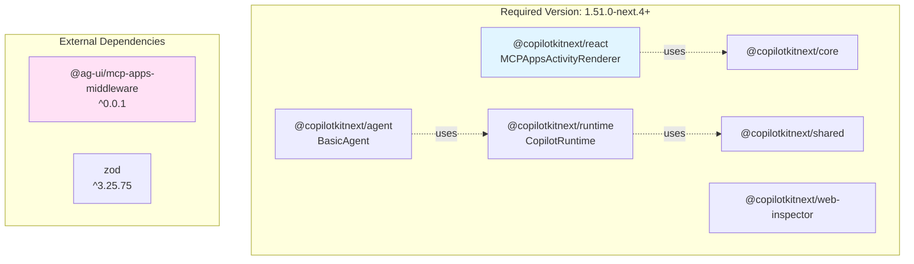
```mermaid
graph TB
    subgraph "Required Version: 1.51.0-next.4+"
        React["@copilotkitnext/react<br/>MCPAppsActivityRenderer"]
        Runtime["@copilotkitnext/runtime<br/>CopilotRuntime"]
        Agent["@copilotkitnext/agent<br/>BasicAgent"]
        Core["@copilotkitnext/core"]
        Shared["@copilotkitnext/shared"]
        Inspector["@copilotkitnext/web-inspector"]
    end
    
    subgraph "External Dependencies"
        Middleware["@ag-ui/mcp-apps-middleware<br/>^0.0.1"]
        Zod["zod<br/>^3.25.75"]
    end
    
    React -.->|"uses"| Core
    Runtime -.->|"uses"| Shared
    Agent -.->|"uses"| Runtime
    
    style React fill:#e1f5ff
    style Middleware fill:#ffe1f5
```

**Sources**: CLAUDE.md:156-175

## Environment Configuration

The frontend requires minimal environment configuration, with the primary requirement being an OpenAI API key for language model processing.

### Environment Variables

| Variable | Required | Default | Purpose |
|----------|----------|---------|---------|
| `OPENAI_API_KEY` | Yes | - | OpenAI API authentication |
| `MCP_SERVER_URL` | No | `http://localhost:3001/mcp` | MCP Server endpoint |

For local development, create a `.env.local` file in the project root:

```
OPENAI_API_KEY=sk-...
```

For production deployments (e.g., Railway, Vercel), set `MCP_SERVER_URL` to point to the deployed MCP Server instance.

**Sources**: README.md:35-39, README.md:128

## Build and Development

The frontend uses Next.js standard build tooling with ESLint configuration for code quality.

### Development Server

To run the development server:

```bash
npm run dev
```

The application starts at `http://localhost:3000` and requires the MCP Server to be running simultaneously at `http://localhost:3001`.

### Build Process

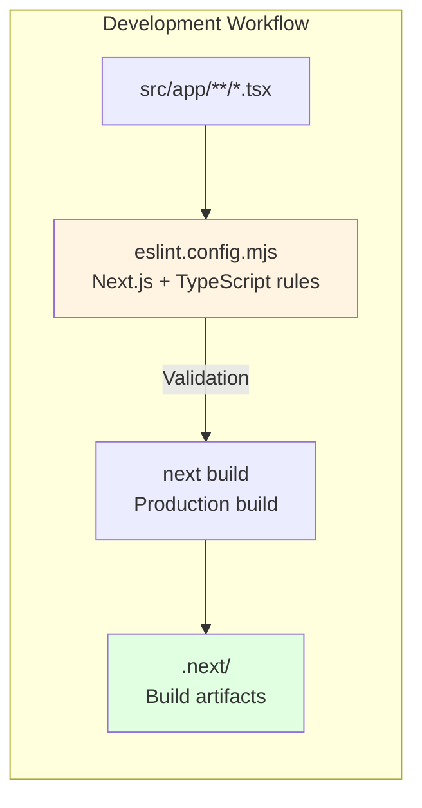
```mermaid
graph LR
    subgraph "Development Workflow"
        Source["src/app/**/*.tsx"]
        ESLint["eslint.config.mjs<br/>Next.js + TypeScript rules"]
        NextBuild["next build<br/>Production build"]
        Output[".next/<br/>Build artifacts"]
    end
    
    Source --> ESLint
    ESLint -->|"Validation"| NextBuild
    NextBuild --> Output
    
    style ESLint fill:#fff4e1
    style Output fill:#e1ffe1
```

The build process includes:

1. **ESLint Validation**: TypeScript and Next.js rules defined in [eslint.config.mjs]()
2. **Next.js Compilation**: Transforms TypeScript and React components
3. **Output Generation**: Produces optimized bundles in `.next/` directory

### ESLint Configuration

The project uses Next.js recommended ESLint presets:

- `eslint-config-next/core-web-vitals` - Web vitals and performance rules
- `eslint-config-next/typescript` - TypeScript-specific rules

Ignored paths include `.next/**`, `out/**`, `build/**`, and `next-env.d.ts` as defined in [eslint.config.mjs:9-15]().

**Sources**: README.md:50-52, eslint.config.mjs, Diagram 4

## Deployment Considerations

The frontend is deployed independently from the MCP Server, allowing for separate scaling and hosting strategies.

### Port Configuration

| Environment | Port | Access |
|-------------|------|--------|
| Development | 3000 | `http://localhost:3000` |
| Production | Platform-specific | Set by hosting provider |

### Multi-Platform Support

The application supports deployment to multiple platforms:

- **Railway**: Configured via `Dockerfile` in project root
- **Vercel**: Configured via `.vercel` directory settings

For production deployments, ensure `MCP_SERVER_URL` environment variable points to the deployed MCP Server endpoint. The live demo at `https://web-app-production-9af6.up.railway.app` connects to the MCP Server at `https://mcp-server-production-bbb4.up.railway.app`.

**Sources**: README.md:9, README.md:120-129, Diagram 4

---

# Page: CopilotKit Integration

# CopilotKit Integration

<details>
<summary>Relevant source files</summary>

The following files were used as context for generating this wiki page:

- [CLAUDE.md](CLAUDE.md)
- [README.md](README.md)

</details>


## Purpose and Scope

This document details the CopilotKit integration layer that enables MCP Apps rendering within the chat interface. It covers the configuration of `BasicAgent`, `MCPAppsMiddleware`, and the frontend components (`CopilotKitProvider`, `CopilotSidebar`) that orchestrate bidirectional communication between the user interface, AI runtime, and MCP Server.

For the overall system architecture, see [Architecture](#2). For MCP Server tool registration, see [MCP Server](#5). For the MCP Apps themselves, see [MCP Apps](#6).

---

## Package Dependencies

The CopilotKit integration requires specific package versions to support MCP Apps rendering. The following table lists the critical dependencies:

| Package | Version | Purpose |
|---------|---------|---------|
| `@copilotkitnext/agent` | `1.51.0-next.4` | Provides `BasicAgent` for AI agent orchestration |
| `@copilotkitnext/core` | `1.51.0-next.4` | Core CopilotKit functionality |
| `@copilotkitnext/react` | `1.51.0-next.4` | React components: `CopilotKitProvider`, `CopilotSidebar`, `MCPAppsActivityRenderer` |
| `@copilotkitnext/runtime` | `1.51.0-next.4` | Runtime utilities: `CopilotRuntime`, `createCopilotEndpoint` |
| `@copilotkitnext/shared` | `1.51.0-next.4` | Shared types and utilities |
| `@ag-ui/mcp-apps-middleware` | `^0.0.1` | Middleware for MCP Apps interception and rendering |
| `zod` | `^3.25.75` | Schema validation for tool inputs |

**Critical Requirement**: MCP Apps support requires `@copilotkitnext/*@1.51.0-next.4` or later. Earlier versions (including `0.0.x`) do not include `MCPAppsActivityRenderer` and cannot render MCP Apps.

Sources: [CLAUDE.md:157-175]()

---

## API Route Configuration

### Route Structure

The API route is defined at [src/app/api/copilotkit/[[...slug]]/route.ts](), using Next.js catch-all dynamic segments to handle all CopilotKit-related endpoints.

### Configuration Flow

The following diagram illustrates how the API route configures the CopilotKit runtime with `BasicAgent` and `MCPAppsMiddleware`:

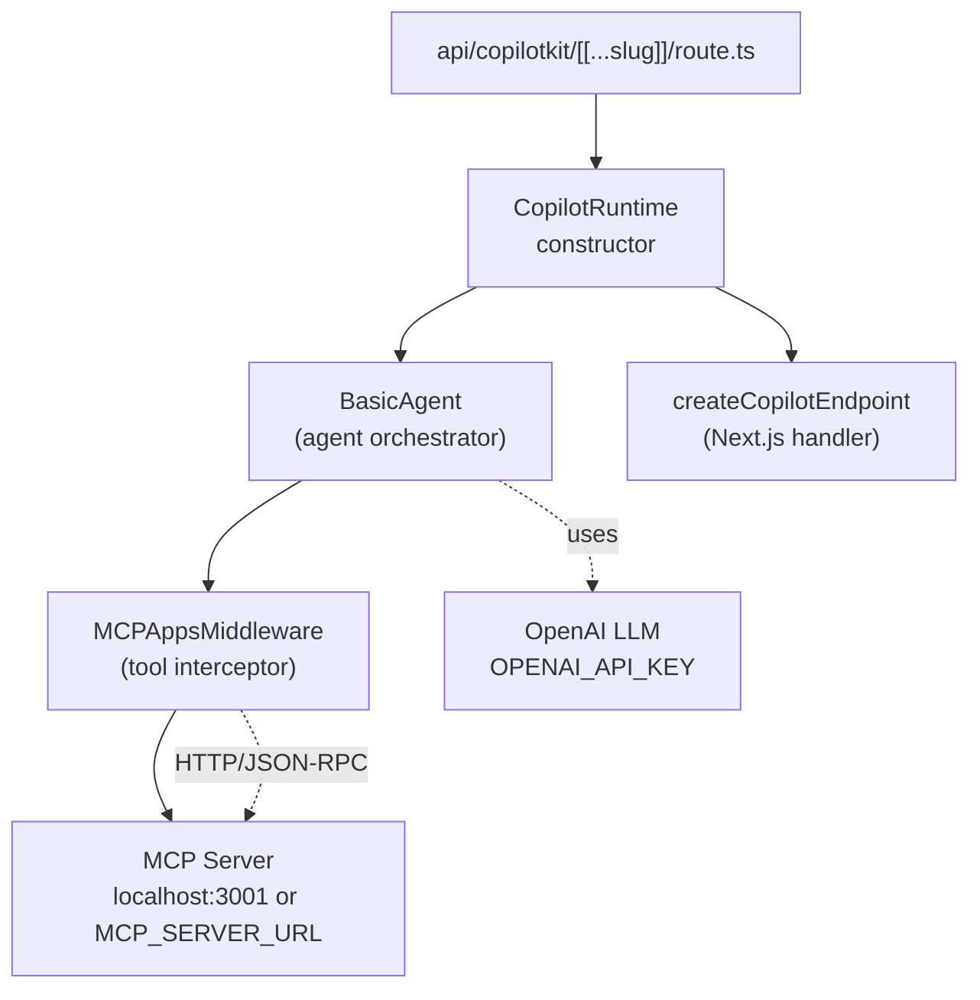
```mermaid
graph TB
    Route["api/copilotkit/[[...slug]]/route.ts"]
    CopilotRuntime["CopilotRuntime<br/>constructor"]
    BasicAgent["BasicAgent<br/>(agent orchestrator)"]
    MCPMiddleware["MCPAppsMiddleware<br/>(tool interceptor)"]
    MCPServer["MCP Server<br/>localhost:3001 or MCP_SERVER_URL"]
    Endpoint["createCopilotEndpoint<br/>(Next.js handler)"]
    
    Route --> CopilotRuntime
    CopilotRuntime --> BasicAgent
    BasicAgent --> MCPMiddleware
    MCPMiddleware --> MCPServer
    CopilotRuntime --> Endpoint
    
    BasicAgent -.->|"uses"| LLM["OpenAI LLM<br/>OPENAI_API_KEY"]
    MCPMiddleware -.->|"HTTP/JSON-RPC"| MCPServer
```

**Diagram: API Route Configuration Chain**

Sources: [CLAUDE.md:36-46](), [README.md:92-110]()

### Key Configuration Components

#### CopilotRuntime Initialization

The `CopilotRuntime` constructor initializes the runtime with an agent configuration:

```typescript
const runtime = new CopilotRuntime({
  agent: new BasicAgent({
    middleware: [
      new MCPAppsMiddleware({
        serverUrl: process.env.MCP_SERVER_URL || 'http://localhost:3001/mcp'
      })
    ]
  })
});
```

**Configuration Parameters**:
- `agent`: Instance of `BasicAgent` configured with middleware stack
- `BasicAgent.middleware`: Array of middleware instances, including `MCPAppsMiddleware`
- `MCPAppsMiddleware.serverUrl`: URL of the MCP Server endpoint

Sources: [CLAUDE.md:40-41](), [README.md:35-39]()

#### BasicAgent

`BasicAgent` (from `@copilotkitnext/agent`) orchestrates:
1. Natural language processing via OpenAI LLM
2. Tool call execution through middleware chain
3. Response generation and streaming

**Note**: `BasicAgent` is deprecated in favor of `BuiltInAgent`, but remains functional in this codebase.

Sources: [CLAUDE.md:172](), [CLAUDE.md:178]()

#### MCPAppsMiddleware

`MCPAppsMiddleware` (from `@ag-ui/mcp-apps-middleware`) provides:
1. **Tool Call Interception**: Detects when a tool response contains `ui/resourceUri` metadata
2. **Resource Fetching**: Requests HTML resources from MCP Server
3. **Activity Snapshot Emission**: Publishes UI rendering instructions to frontend
4. **Bidirectional Communication**: Proxies JSON-RPC messages between MCP Apps and MCP Server

Sources: [CLAUDE.md:10](), [CLAUDE.md:173]()

---

## Middleware Processing Flow

The following diagram shows how `MCPAppsMiddleware` intercepts and processes tool calls with UI metadata:

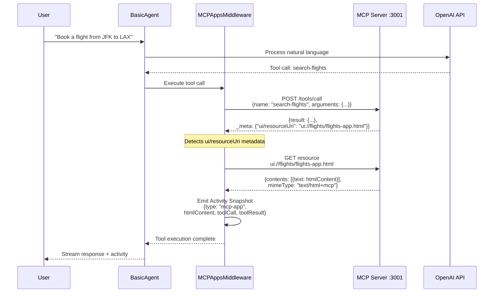
```mermaid
sequenceDiagram
    participant User
    participant BasicAgent
    participant MCPMiddleware as MCPAppsMiddleware
    participant MCPServer as MCP Server :3001
    participant LLM as OpenAI API
    
    User->>BasicAgent: "Book a flight from JFK to LAX"
    BasicAgent->>LLM: Process natural language
    LLM-->>BasicAgent: Tool call: search-flights
    
    BasicAgent->>MCPMiddleware: Execute tool call
    MCPMiddleware->>MCPServer: POST /tools/call<br/>{name: "search-flights", arguments: {...}}
    MCPServer-->>MCPMiddleware: {result: {...},<br/>_meta: {"ui/resourceUri": "ui://flights/flights-app.html"}}
    
    Note over MCPMiddleware: Detects ui/resourceUri metadata
    
    MCPMiddleware->>MCPServer: GET resource<br/>ui://flights/flights-app.html
    MCPServer-->>MCPMiddleware: {contents: [{text: htmlContent}],<br/>mimeType: "text/html+mcp"}
    
    MCPMiddleware->>MCPMiddleware: Emit Activity Snapshot<br/>{type: "mcp-app",<br/>htmlContent, toolCall, toolResult}
    MCPMiddleware-->>BasicAgent: Tool execution complete
    BasicAgent-->>User: Stream response + activity
```

**Diagram: MCPAppsMiddleware Tool Call Processing**

The middleware inspection logic:
1. **Post-execution hook**: Examines tool result after execution
2. **Metadata detection**: Checks for `_meta["ui/resourceUri"]` in tool result
3. **Resource resolution**: If present, fetches HTML resource via MCP Server's resource endpoints
4. **MIME type validation**: Confirms `mimeType: "text/html+mcp"` to distinguish MCP Apps from static HTML
5. **Activity emission**: Creates activity snapshot for frontend rendering

Sources: [CLAUDE.md:60-92](), [README.md:75-88]()

---

## Frontend Component Configuration

### Component Hierarchy

The following diagram shows the React component structure for CopilotKit integration:

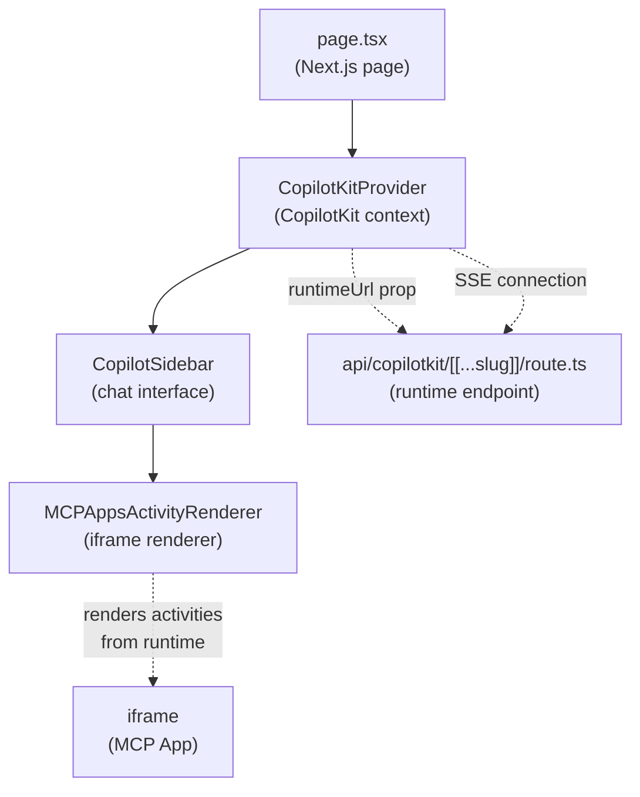
```mermaid
graph TB
    Page["page.tsx<br/>(Next.js page)"]
    Provider["CopilotKitProvider<br/>(CopilotKit context)"]
    Sidebar["CopilotSidebar<br/>(chat interface)"]
    Renderer["MCPAppsActivityRenderer<br/>(iframe renderer)"]
    APIRoute["api/copilotkit/[[...slug]]/route.ts<br/>(runtime endpoint)"]
    
    Page --> Provider
    Provider --> Sidebar
    Sidebar --> Renderer
    Provider -.->|"runtimeUrl prop"| APIRoute
    Renderer -.->|"renders activities<br/>from runtime"| Iframe["iframe<br/>(MCP App)"]
    
    Provider -.->|"SSE connection"| APIRoute
```

**Diagram: Frontend Component Hierarchy**

Sources: [CLAUDE.md:41-42](), [README.md:95-96]()

### CopilotKitProvider

The `CopilotKitProvider` component establishes the connection to the CopilotKit runtime:

```typescript
<CopilotKitProvider runtimeUrl="/api/copilotkit">
  {/* child components */}
</CopilotKitProvider>
```

**Key Props**:
- `runtimeUrl`: Path to the API route hosting `CopilotRuntime` (default: `/api/copilotkit`)
- Creates SSE (Server-Sent Events) connection for streaming responses
- Provides CopilotKit context to all child components

Sources: [CLAUDE.md:41]()

### CopilotSidebar

The `CopilotSidebar` component renders the chat interface:

```typescript
<CopilotSidebar>
  <MCPAppsActivityRenderer />
</CopilotSidebar>
```

**Responsibilities**:
- Displays chat messages and AI responses
- Renders user input field
- Contains `MCPAppsActivityRenderer` for MCP Apps
- Handles message streaming from runtime

Sources: [CLAUDE.md:41](), [CLAUDE.md:132-138]()

### MCPAppsActivityRenderer

The `MCPAppsActivityRenderer` component renders MCP Apps in sandboxed iframes:

**Rendering Logic**:
1. **Activity subscription**: Listens for activity snapshots from runtime
2. **Type filtering**: Processes activities with `type: "mcp-app"`
3. **Iframe creation**: Creates sandboxed iframe with HTML content
4. **Communication setup**: Establishes postMessage channel for bidirectional JSON-RPC

**Iframe Sandbox Attributes**:
- `allow-scripts`: Enables JavaScript execution
- `allow-same-origin`: Allows localStorage/sessionStorage access
- No `allow-top-navigation`: Prevents navigation hijacking
- No `allow-forms`: Prevents form submission to external URLs

Sources: [CLAUDE.md:170](), [README.md:59-73]()

---

## Request-Response Flow

### End-to-End Execution

The following table summarizes the complete flow from user input to MCP App rendering:

| Step | Component | Action | Protocol |
|------|-----------|--------|----------|
| 1 | User | Enters natural language prompt | Browser → Frontend |
| 2 | `CopilotKitProvider` | Sends message to runtime | SSE/HTTP |
| 3 | `BasicAgent` | Processes with OpenAI LLM | HTTP → OpenAI API |
| 4 | `BasicAgent` | Determines tool to call | Internal |
| 5 | `MCPAppsMiddleware` | Forwards tool call to MCP Server | HTTP/JSON-RPC |
| 6 | MCP Server | Executes tool, returns result with metadata | HTTP Response |
| 7 | `MCPAppsMiddleware` | Detects `ui/resourceUri`, fetches HTML | HTTP GET |
| 8 | `MCPAppsMiddleware` | Emits activity snapshot | SSE Stream |
| 9 | `MCPAppsActivityRenderer` | Renders HTML in iframe | postMessage setup |
| 10 | User | Interacts with MCP App UI | Browser → iframe |
| 11 | MCP App | Calls helper tools via postMessage | JSON-RPC |
| 12 | `MCPAppsMiddleware` | Proxies to MCP Server | HTTP/JSON-RPC |
| 13 | MCP Server | Executes tool, returns result | HTTP Response |
| 14 | `MCPAppsMiddleware` | Sends notification to iframe | postMessage |
| 15 | MCP App | Updates UI with new data | DOM manipulation |

Sources: [CLAUDE.md:129-147](), [README.md:57-73]()

### Communication Protocols

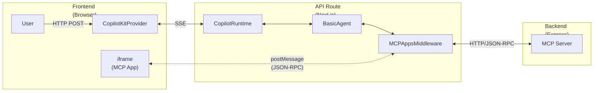
```mermaid
graph LR
    subgraph "Frontend<br/>(Browser)"
        User["User"]
        Provider["CopilotKitProvider"]
        Iframe["iframe<br/>(MCP App)"]
    end
    
    subgraph "API Route<br/>(Next.js)"
        Runtime["CopilotRuntime"]
        Agent["BasicAgent"]
        Middleware["MCPAppsMiddleware"]
    end
    
    subgraph "Backend<br/>(Express)"
        MCPServer["MCP Server"]
    end
    
    User -->|"HTTP POST"| Provider
    Provider <-->|"SSE"| Runtime
    Runtime <--> Agent
    Agent <--> Middleware
    Middleware <-->|"HTTP/JSON-RPC"| MCPServer
    Iframe <-.->|"postMessage<br/>(JSON-RPC)"| Middleware
```

**Diagram: Communication Protocol Stack**

Sources: [CLAUDE.md:129-147](), [README.md:57-73]()

---

## Environment Configuration

### Required Environment Variables

| Variable | Purpose | Default | Example |
|----------|---------|---------|---------|
| `OPENAI_API_KEY` | OpenAI API authentication | (required) | `sk-proj-...` |
| `MCP_SERVER_URL` | MCP Server endpoint URL | `http://localhost:3001/mcp` | `https://mcp-server-production-bbb4.up.railway.app` |

**Development Setup** (`.env.local`):
```bash
OPENAI_API_KEY=sk-...
# MCP_SERVER_URL defaults to localhost:3001 in dev
```

**Production Setup**:
```bash
OPENAI_API_KEY=sk-...
MCP_SERVER_URL=https://mcp-server-production-bbb4.up.railway.app
```

Sources: [README.md:35-39](), [README.md:122-128]()

---

## Activity Snapshot Structure

When `MCPAppsMiddleware` detects a tool call with `ui/resourceUri` metadata, it emits an activity snapshot with the following structure:

| Field | Type | Description |
|-------|------|-------------|
| `type` | `string` | Always `"mcp-app"` for MCP Apps |
| `htmlContent` | `string` | Full HTML content fetched from resource |
| `toolCall` | `object` | Original tool call with name and arguments |
| `toolResult` | `object` | Tool execution result with data and metadata |
| `resourceUri` | `string` | URI of the HTML resource (e.g., `ui://flights/flights-app.html`) |
| `mimeType` | `string` | Always `"text/html+mcp"` for MCP Apps |

The `MCPAppsActivityRenderer` component filters activity snapshots by `type: "mcp-app"` and renders the `htmlContent` in a sandboxed iframe.

Sources: [CLAUDE.md:86-92](), [README.md:86-88]()

---

## Tool-to-UI Linking Mechanism

### Metadata Convention

MCP Tools declare their associated UI resources using the `_meta` object:

```typescript
server.registerTool("search-flights", {
  inputSchema: { origin, destination, departureDate, passengers },
  _meta: { "ui/resourceUri": "ui://flights/flights-app.html" }
}, handler);
```

**Key**: `"ui/resourceUri"` (constant: `RESOURCE_URI_META_KEY` in [mcp-server/server.ts:62]())  
**Value**: URI with `ui://` scheme pointing to registered resource  

The middleware checks for this key in the tool result's `_meta` object after execution.

Sources: [CLAUDE.md:60-84](), [README.md:75-88]()

### Resource MIME Type

Resources must be registered with `mimeType: "text/html+mcp"` to distinguish interactive MCP Apps from static HTML:

```typescript
server.registerResource("flights-app", "ui://flights/flights-app.html", {
  mimeType: "text/html+mcp"
}, contentHandler);
```

The middleware only fetches and renders resources with this specific MIME type.

Sources: [CLAUDE.md:86-92](), [README.md:86]()

---

## Integration Patterns

### Main Tool vs Helper Tool

The architecture distinguishes between two types of tools:

| Type | Has `ui/resourceUri` | Called By | Purpose |
|------|---------------------|-----------|---------|
| **Main Tool** | ✅ Yes | AI agent (via natural language) | Triggers UI rendering |
| **Helper Tool** | ❌ No | MCP App (via postMessage) | Performs granular operations |

**Example - Flights App**:
- Main tool: `search-flights` (has `ui/resourceUri`, triggers UI)
- Helper tools: `select-flight`, `select-seats`, `book-flight` (no UI, called from iframe)

This pattern ensures the UI is only rendered once at the start of the interaction, while subsequent operations happen within the existing UI.

Sources: [CLAUDE.md:27-33](), [CLAUDE.md:60-84]()

### Bidirectional Communication Setup

Once the MCP App is rendered in an iframe, bidirectional communication is established:

**Direction 1: MCP App → MCP Server** (via postMessage/JSON-RPC):
```javascript
// Inside MCP App
mcpApp.sendRequest("tools/call", { 
  name: "select-flight", 
  arguments: { flightId: "FL123" } 
});
```

**Direction 2: MCP Server → MCP App** (via notification):
```javascript
// Inside MCP App
mcpApp.onNotification("ui/notifications/tool-result", (params) => {
  // params.structuredContent contains updated data
  updateUI(params.structuredContent);
});
```

The middleware proxies these messages, translating postMessage events to HTTP requests to the MCP Server and vice versa.

Sources: [CLAUDE.md:94-125](), [README.md:59-73]()

---

## Known Limitations

| Issue | Impact | Workaround |
|-------|--------|------------|
| `BasicAgent` deprecated | Deprecation warnings in console | Use `BuiltInAgent` (requires code update) |
| Package version requirement | Older versions lack `MCPAppsActivityRenderer` | Must use `@copilotkitnext/*@1.51.0-next.4+` |
| Iframe sandbox restrictions | Cannot load external CDN scripts | Inline all styles and scripts (Vite handles this) |
| Timer accuracy | Depends on browser tab focus | No workaround (browser limitation) |

Sources: [CLAUDE.md:176-182]()

---

## Summary

The CopilotKit integration establishes a three-layer architecture:

1. **Frontend Layer**: `CopilotKitProvider` → `CopilotSidebar` → `MCPAppsActivityRenderer`
2. **Runtime Layer**: `CopilotRuntime` → `BasicAgent` → `MCPAppsMiddleware`
3. **MCP Layer**: MCP Server with tools and resources

The `MCPAppsMiddleware` acts as the critical orchestrator, detecting `ui/resourceUri` metadata in tool results, fetching HTML resources, and emitting activity snapshots that trigger iframe rendering in the frontend. This architecture enables rich, interactive UIs to be embedded directly in the chat experience while maintaining security through iframe sandboxing and controlled communication via JSON-RPC over postMessage.

For details on the MCP Server tool registration, see [MCP Server](#5). For individual MCP App implementations, see [MCP Apps](#6).

Sources: [CLAUDE.md:1-182](), [README.md:1-133]()

---

# Page: MCP Server

# MCP Server

<details>
<summary>Relevant source files</summary>

The following files were used as context for generating this wiki page:

- [CLAUDE.md](CLAUDE.md)
- [README.md](README.md)
- [mcp-server/.nixpacks](mcp-server/.nixpacks)
- [mcp-server/Dockerfile](mcp-server/Dockerfile)

</details>


## Purpose and Scope

The MCP Server is an Express.js application that implements the Model Context Protocol (MCP) to provide tools and resources for the four interactive applications in this demo. It runs independently on port 3001 and serves two primary functions: (1) exposing tools that can be invoked by the AI agent, and (2) serving HTML resources for MCP Apps that render in iframes. This document covers the server architecture, tool and resource registration patterns, business logic organization, and deployment configuration.

For information about how the frontend integrates with this server, see [Frontend Application](#4). For details about the MCP Apps themselves and their communication protocols, see [MCP Apps](#6).

**Sources:** [CLAUDE.md:1-182](), [README.md:1-133]()

## Server Architecture

The MCP Server is built on Express.js with the `@modelcontextprotocol/sdk` package, exposing both MCP protocol endpoints and resource serving capabilities. The server orchestrates tool execution and resource delivery for all four applications in the demo.

```mermaid
graph TB
    subgraph "server.ts"
        Express["Express Application<br/>Port 3001"]
        MCPServer["MCP Server Instance<br/>@modelcontextprotocol/sdk"]
        ToolRegistry["Tool Registry"]
        ResourceRegistry["Resource Registry"]
    end
    
    subgraph "Business Logic Modules"
        FlightsLogic["flights.ts<br/>15 airports<br/>6 airlines"]
        HotelsLogic["hotels.ts<br/>10 cities<br/>30 hotels"]
        StocksLogic["stocks.ts<br/>18 stocks<br/>Portfolio logic"]
        KanbanLogic["kanban.ts<br/>Board templates<br/>Card operations"]
    end
    
    subgraph "HTML Resources"
        FlightsHTML["apps/dist/flights-app.html"]
        HotelsHTML["apps/dist/hotels-app.html"]
        TradingHTML["apps/dist/trading-app.html"]
        KanbanHTML["apps/dist/kanban-app.html"]
    end
    
    subgraph "External Clients"
        Agent["CopilotKit Agent<br/>MCPAppsMiddleware"]
        MCPApp["MCP App iframe<br/>postMessage/JSON-RPC"]
    end
    
    Express --> MCPServer
    MCPServer --> ToolRegistry
    MCPServer --> ResourceRegistry
    
    ToolRegistry --> FlightsLogic
    ToolRegistry --> HotelsLogic
    ToolRegistry --> StocksLogic
    ToolRegistry --> KanbanLogic
    
    ResourceRegistry --> FlightsHTML
    ResourceRegistry --> HotelsHTML
    ResourceRegistry --> TradingHTML
    ResourceRegistry --> KanbanHTML
    
    Agent -->|"POST /tools/call"| Express
    Agent -->|"GET ui://*"| Express
    MCPApp -->|"postMessage → middleware"| Agent
```

**Key Components:**

| Component | Type | Purpose |
|-----------|------|---------|
| `Express Application` | Web server | Handles HTTP requests on port 3001 |
| `MCP Server Instance` | Protocol handler | Implements MCP protocol for tool/resource management |
| `Tool Registry` | Registry | Stores registered tools (main + helper) with schemas |
| `Resource Registry` | Registry | Stores HTML resources with MIME types |
| Business logic modules | Domain logic | Provide data and operations for each application domain |

**Sources:** [CLAUDE.md:43-54](), [README.md:90-110]()

## Tool Registration Patterns

The MCP Server uses a dual registration pattern: **main tools** that trigger UI rendering and **helper tools** that handle granular interactions within the UI. The distinction is made through the `_meta` field containing the `ui/resourceUri` key.

### Main Tools with UI Linking

Main tools are the entry points for each application. They include `_meta["ui/resourceUri"]` to link the tool invocation to an HTML resource.

```mermaid
graph LR
    MainTool["Main Tool Registration"]
    UIMetadata["_meta:<br/>{ui/resourceUri}"]
    InputSchema["inputSchema:<br/>Zod schema"]
    Handler["Tool handler<br/>function"]
    
    MainTool --> UIMetadata
    MainTool --> InputSchema
    MainTool --> Handler
    
    UIMetadata -.->|"triggers"| ResourceFetch["Resource fetch<br/>by middleware"]
    Handler -.->|"returns"| ToolResult["Tool result +<br/>UI metadata"]
```

**Main Tool Examples:**

| Tool Name | Input Schema Fields | Linked Resource | Purpose |
|-----------|-------------------|-----------------|---------|
| `search-flights` | `origin`, `destination`, `departureDate`, `passengers` | `ui://flights/flights-app.html` | Initiates flight booking wizard |
| `search-hotels` | `city`, `checkIn`, `checkOut`, `guests` | `ui://hotels/hotels-app.html` | Initiates hotel booking wizard |
| `create-portfolio` | `initialBalance`, `riskTolerance`, `focus` | `ui://trading/trading-app.html` | Creates investment portfolio |
| `create-board` | `projectName`, `template` | `ui://kanban/kanban-app.html` | Creates kanban board |

**Sources:** [CLAUDE.md:58-84](), [README.md:76-88]()

### Tool Registration Code Pattern

The registration pattern follows this structure as shown in [mcp-server/server.ts]():

```typescript
// Pattern from CLAUDE.md:58-84
const RESOURCE_URI_META_KEY = "ui/resourceUri";

server.registerTool("search-flights", {
  inputSchema: {
    type: "object",
    properties: {
      origin: { type: "string" },
      destination: { type: "string" },
      departureDate: { type: "string" },
      passengers: { type: "number" }
    },
    required: ["origin", "destination", "departureDate", "passengers"]
  },
  _meta: {
    [RESOURCE_URI_META_KEY]: "ui://flights/flights-app.html"
  }
}, async (params) => {
  // Handler logic using business module
  const results = searchFlightsLogic(params);
  return { result: results };
});
```

**Sources:** [CLAUDE.md:58-84]()

### Helper Tools

Helper tools are invoked directly from MCP App UIs and do not include `ui/resourceUri` metadata. They handle granular operations like selecting items, updating state, or performing actions within an active UI session.

**Helper Tool Examples:**

| Application | Helper Tools |
|-------------|--------------|
| **Flights** | `select-flight`, `select-seats`, `book-flight` |
| **Hotels** | `select-hotel`, `select-room`, `book-hotel` |
| **Trading** | `execute-trade`, `refresh-prices` |
| **Kanban** | `add-card`, `update-card`, `delete-card`, `move-card` |

```mermaid
graph TB
    UIAction["User interaction<br/>in MCP App"]
    PostMessage["postMessage to<br/>parent window"]
    Middleware["MCPAppsMiddleware<br/>receives JSON-RPC"]
    ServerEndpoint["POST /tools/call"]
    HelperTool["Helper tool handler"]
    BusinessLogic["Business logic<br/>module"]
    Response["Tool result<br/>returned"]
    
    UIAction --> PostMessage
    PostMessage --> Middleware
    Middleware --> ServerEndpoint
    ServerEndpoint --> HelperTool
    HelperTool --> BusinessLogic
    BusinessLogic --> Response
    Response -.->|"notification"| UIAction
```

**Sources:** [CLAUDE.md:27-33](), [CLAUDE.md:118-125]()

## Resource Registration

Resources are HTML files that render as MCP Apps in sandboxed iframes. The critical aspect is the `mimeType: "text/html+mcp"`, which signals to the middleware that this is an interactive MCP App rather than static content.

### Resource Registration Pattern

```typescript
// Pattern from CLAUDE.md:87-92
server.registerResource(
  "flights-app-template",              // Resource name
  "ui://flights/flights-app.html",      // Resource URI
  {
    mimeType: "text/html+mcp"           // CRITICAL: marks as MCP App
  },
  async () => {
    // Content handler returns HTML
    const htmlContent = readFileSync('apps/dist/flights-app.html', 'utf-8');
    return {
      contents: [{
        text: htmlContent
      }]
    };
  }
);
```

### MIME Type Specification

The `text/html+mcp` MIME type is essential for the middleware to recognize and properly handle the resource:

| MIME Type | Interpretation | Rendering Behavior |
|-----------|---------------|-------------------|
| `text/html+mcp` | Interactive MCP App | Rendered in iframe with postMessage bridge |
| `text/html` | Static HTML content | Displayed as text or raw HTML |
| Other types | Non-UI content | Ignored by UI rendering logic |

**Sources:** [CLAUDE.md:87-92](), [README.md:84-88]()

## Business Logic Modules

The server organizes domain-specific logic into separate TypeScript modules. Each module provides data structures, mock data, and operation functions used by both main and helper tools.

```mermaid
graph TB
    subgraph "flights.ts"
        AirportsData["15 airports<br/>3-letter codes"]
        AirlinesData["6 airlines<br/>Flight schedules"]
        FlightSearch["searchFlights()"]
        SeatSelection["selectSeats()"]
        BookingLogic["bookFlight()"]
    end
    
    subgraph "hotels.ts"
        CitiesData["10 cities<br/>Popular destinations"]
        HotelsData["30 hotels<br/>Room types"]
        HotelSearch["searchHotels()"]
        RoomSelection["selectRoom()"]
        HotelBooking["bookHotel()"]
    end
    
    subgraph "stocks.ts"
        StocksData["18 stocks<br/>6 sectors"]
        PriceData["Mock price data"]
        PortfolioOps["createPortfolio()"]
        TradeOps["executeTrade()"]
        PriceRefresh["refreshPrices()"]
    end
    
    subgraph "kanban.ts"
        Templates["4 board templates"]
        BoardData["Board state"]
        CardOps["addCard()<br/>updateCard()<br/>deleteCard()"]
        MoveOps["moveCard()"]
    end
    
    MainTools["Main Tools"] --> FlightSearch
    MainTools --> HotelSearch
    MainTools --> PortfolioOps
    MainTools --> Templates
    
    HelperTools["Helper Tools"] --> SeatSelection
    HelperTools --> BookingLogic
    HelperTools --> RoomSelection
    HelperTools --> HotelBooking
    HelperTools --> TradeOps
    HelperTools --> PriceRefresh
    HelperTools --> CardOps
    HelperTools --> MoveOps
```

### Module Organization

| Module | Data Assets | Key Functions | Used By |
|--------|-------------|---------------|---------|
| `flights.ts` | 15 airports, 6 airlines | Flight search, seat selection, booking | `search-flights`, `select-flight`, `select-seats`, `book-flight` |
| `hotels.ts` | 10 cities, 30 hotels | Hotel search, room selection, booking | `search-hotels`, `select-hotel`, `select-room`, `book-hotel` |
| `stocks.ts` | 18 stocks, 6 sectors | Portfolio creation, trade execution, price updates | `create-portfolio`, `execute-trade`, `refresh-prices` |
| `kanban.ts` | 4 board templates | Board creation, card CRUD, card movement | `create-board`, `add-card`, `update-card`, `delete-card`, `move-card` |

**Sources:** [CLAUDE.md:43-54](), [README.md:99-104]()

## Communication Interface

The MCP Server exposes HTTP endpoints for tool invocation and resource retrieval. The communication follows the MCP protocol specification over HTTP.

### Tool Invocation Endpoint

The primary endpoint for tool execution is `POST /tools/call` (exact path depends on MCP SDK configuration).

```mermaid
sequenceDiagram
    participant Client as "Agent/Middleware"
    participant Endpoint as "POST /tools/call"
    participant Registry as "Tool Registry"
    participant Handler as "Tool Handler"
    participant Logic as "Business Logic"
    
    Client->>Endpoint: "HTTP POST<br/>{name, arguments}"
    Endpoint->>Registry: "Lookup tool by name"
    Registry->>Handler: "Invoke handler"
    Handler->>Logic: "Execute business logic"
    Logic-->>Handler: "Return data"
    Handler-->>Endpoint: "{result, _meta?}"
    Endpoint-->>Client: "JSON response"
    
    Note over Client,Endpoint: "If _meta[ui/resourceUri] present,<br/>middleware fetches resource"
```

**Request Format:**

```json
{
  "name": "search-flights",
  "arguments": {
    "origin": "JFK",
    "destination": "LAX",
    "departureDate": "2024-01-20",
    "passengers": 2
  }
}
```

**Response Format (with UI metadata):**

```json
{
  "result": {
    "flights": [...],
    "searchParams": {...}
  },
  "_meta": {
    "ui/resourceUri": "ui://flights/flights-app.html"
  }
}
```

**Sources:** [CLAUDE.md:129-147](), [README.md:57-73]()

### Resource Retrieval

Resources are fetched using the `ui://` scheme. The middleware translates these to HTTP GET requests to the MCP Server.

```mermaid
graph LR
    Middleware["MCPAppsMiddleware"]
    ResourceURI["ui://flights/flights-app.html"]
    HTTPGet["GET /resources"]
    ResourceHandler["Resource handler"]
    HTMLFile["apps/dist/flights-app.html"]
    Response["HTML content<br/>+ text/html+mcp"]
    
    Middleware -->|"detects"| ResourceURI
    ResourceURI -->|"translates to"| HTTPGet
    HTTPGet --> ResourceHandler
    ResourceHandler --> HTMLFile
    HTMLFile --> Response
    Response -.->|"renders in iframe"| Middleware
```

**Resource Response Structure:**

```json
{
  "contents": [{
    "text": "<!DOCTYPE html>...",
    "mimeType": "text/html+mcp"
  }]
}
```

**Sources:** [CLAUDE.md:87-92](), [README.md:84-88]()

## Server Lifecycle and State Management

The MCP Server is stateless with respect to tool invocations. Each tool call operates independently, and any state required by MCP Apps is managed client-side within the iframe or passed via tool arguments.

```mermaid
graph TB
    Start["Server Start"]
    Register["Register Tools<br/>and Resources"]
    Listen["Listen on Port 3001"]
    
    Request["Incoming Request"]
    ToolCall["Tool Invocation"]
    ResourceFetch["Resource Fetch"]
    Execute["Execute Handler"]
    Return["Return Result"]
    
    Start --> Register
    Register --> Listen
    Listen --> Request
    Request --> ToolCall
    Request --> ResourceFetch
    ToolCall --> Execute
    Execute --> Return
    ResourceFetch --> Return
    Return --> Listen
```

**Stateless Design Benefits:**

- Horizontal scaling: Multiple server instances can run without shared state
- Crash recovery: No state loss on server restart
- Simplified deployment: No database or persistence layer required

**Sources:** [CLAUDE.md:129-147]()

## Deployment Configuration

The MCP Server is containerized using Docker and configured to run on port 3001 in production environments.

### Docker Configuration

The [mcp-server/Dockerfile:1-22]() defines a multi-stage build process:

```dockerfile
FROM node:20-slim

WORKDIR /app

# Copy package files
COPY package*.json ./

# Install dependencies
RUN npm ci

# Copy source files
COPY . .

# Build TypeScript and app HTML
RUN npm run build

# Expose port
EXPOSE 3001

# Start server
CMD ["npm", "start"]
```

### Node.js Version

The server requires Node.js 20 or later, as specified in [mcp-server/.nixpacks:1-3]():

```
NODE_VERSION=20.18.1
```

### Environment Configuration

| Variable | Purpose | Default | Production |
|----------|---------|---------|------------|
| `PORT` | Server port | `3001` | `3001` |
| `NODE_ENV` | Environment mode | `development` | `production` |
| `MCP_SERVER_URL` | External server URL | `http://localhost:3001` | Set by deployment platform |

### Production Deployment

The demo is deployed on Railway with the MCP Server as a separate service:

| Deployment Aspect | Configuration |
|------------------|---------------|
| Platform | Railway |
| Service URL | https://mcp-server-production-bbb4.up.railway.app |
| Port | 3001 |
| Health check | HTTP GET / or /mcp |
| Build command | `npm run build` |
| Start command | `npm start` |

The frontend application references the MCP Server via the `MCP_SERVER_URL` environment variable, enabling independent deployment and scaling of the two services.

**Sources:** [mcp-server/Dockerfile:1-22](), [mcp-server/.nixpacks:1-3](), [README.md:119-129]()

## Server Startup Sequence

```mermaid
sequenceDiagram
    participant NPM as "npm start"
    participant ServerTS as "server.ts"
    participant MCPSDK as "@modelcontextprotocol/sdk"
    participant Express as "Express app"
    participant FS as "File System"
    
    NPM->>ServerTS: "Execute compiled JS"
    ServerTS->>MCPSDK: "new Server()"
    ServerTS->>ServerTS: "registerTool() x N"
    Note over ServerTS: "Flights: search-flights,<br/>select-flight, etc."
    ServerTS->>ServerTS: "registerResource() x 4"
    Note over ServerTS: "Load HTML from<br/>apps/dist/"
    ServerTS->>FS: "Read *.html files"
    FS-->>ServerTS: "HTML content"
    ServerTS->>Express: "app.listen(3001)"
    Express-->>NPM: "Server ready"
    Note over Express: "Listening on<br/>http://localhost:3001"
```

**Startup Steps:**

1. Execute compiled JavaScript from `mcp-server/dist/`
2. Initialize MCP Server instance with SDK
3. Register all main tools (4 total, one per app)
4. Register all helper tools (16+ total across all apps)
5. Register HTML resources (4 files from `apps/dist/`)
6. Start Express server on port 3001
7. Begin accepting HTTP requests

**Sources:** [CLAUDE.md:43-54](), [README.md:43-53]()

---

# Page: MCP Apps

# MCP Apps

<details>
<summary>Relevant source files</summary>

The following files were used as context for generating this wiki page:

- [CLAUDE.md](CLAUDE.md)
- [README.md](README.md)
- [mcp-server/apps/flights-app.html](mcp-server/apps/flights-app.html)

</details>


MCP Apps are self-contained HTML/JavaScript applications that render in sandboxed iframes within the CopilotKit chat sidebar. They provide rich, interactive user interfaces for MCP tools and communicate bidirectionally with the MCP Server via JSON-RPC over postMessage. This page introduces the MCP Apps concept, their architecture, and common patterns. For detailed communication protocol information, see [Communication Protocol](#6.1). For individual app implementations, see [Flights App](#6.2), [Hotels App](#6.3), [Trading App](#6.4), and [Kanban App](#6.5).

## Core Concepts

MCP Apps extend the Model Context Protocol (MCP) specification through the MCP Apps Extension (SEP-1865). Each app is:

| Characteristic | Description |
|----------------|-------------|
| **Self-contained** | Single HTML file with inlined CSS, JavaScript, and assets |
| **Sandboxed** | Runs in iframe with limited permissions |
| **Interactive** | Responds to user actions and calls MCP tools |
| **Linked** | Associated with MCP tools via `ui/resourceUri` metadata |
| **Reactive** | Receives notifications about tool results and state changes |

The system includes four demonstration apps:

| App | Entry Tool | Purpose |
|-----|------------|---------|
| **flights-app.html** | `search-flights` | 5-step airline booking wizard |
| **hotels-app.html** | `search-hotels` | 4-step hotel reservation wizard |
| **trading-app.html** | `create-portfolio` | Investment portfolio simulator with charts |
| **kanban-app.html** | `create-board` | Drag-and-drop task management board |

Sources: [CLAUDE.md:1-84](), [README.md:11-18]()

## Architecture and Lifecycle

**MCP App Rendering Flow**

```mermaid
sequenceDiagram
    participant User
    participant AI["OpenAI LLM"]
    participant Agent["BasicAgent<br/>(api/copilotkit/route.ts)"]
    participant Middleware["MCPAppsMiddleware"]
    participant Server["MCP Server<br/>(server.ts)"]
    participant Renderer["MCPAppsActivityRenderer<br/>(CopilotSidebar)"]
    participant App["MCP App<br/>(iframe)"]

    User->>AI: "Book a flight from JFK to LAX"
    AI->>Agent: "tool_call: search-flights"
    Agent->>Middleware: "interceptToolCall()"
    Middleware->>Server: "POST /tools/call<br/>{name: 'search-flights', arguments: {...}}"
    Server->>Server: "Execute tool handler"
    Server-->>Middleware: "{result, _meta: {'ui/resourceUri': 'ui://flights/...'}}"
    
    Note over Middleware: Detect ui/resourceUri metadata
    
    Middleware->>Server: "GET ui://flights/flights-app.html"
    Server->>Server: "Fetch resource<br/>(mimeType: 'text/html+mcp')"
    Server-->>Middleware: "HTML content"
    Middleware->>Agent: "Emit activity snapshot"
    Agent->>Renderer: "Render activity with HTML"
    Renderer->>App: "Create iframe, load HTML"
    
    App->>App: "window.load event"
    App->>Middleware: "postMessage: ui/initialize"
    Middleware-->>App: "Initialize response"
    App->>Middleware: "postMessage: ui/notifications/initialized"
    App->>Middleware: "postMessage: ui/notifications/size-change"
    
    Note over App: User interacts with UI
    
    User->>App: "Click 'Select Flight' button"
    App->>Middleware: "postMessage: tools/call<br/>{name: 'select-flight'}"
    Middleware->>Server: "POST /tools/call"
    Server-->>Middleware: "Tool result"
    Middleware->>App: "postMessage: ui/notifications/tool-result"
    App->>App: "Update UI state"
```

Sources: [README.md:57-73](), [CLAUDE.md:127-147](), [mcp-server/apps/flights-app.html:1594-1604]()

## Resource Registration

Each MCP App is registered as a resource on the MCP Server with a special MIME type that identifies it as an interactive application rather than static content.

**Resource Registration Pattern**

```mermaid
graph TB
    subgraph ServerTS["server.ts (MCP Server)"]
        RegisterResource["server.registerResource()"]
        ResourceHandler["Content Handler Function"]
        HTMLContent["Read HTML from apps/dist/"]
    end
    
    subgraph ResourceMetadata["Resource Metadata"]
        URI["uri: 'ui://flights/flights-app.html'"]
        MIMEType["mimeType: 'text/html+mcp'"]
        Name["name: 'flights-app-template'"]
    end
    
    subgraph DistFiles["apps/dist/ (Build Artifacts)"]
        FlightsHTML["flights-app.html"]
        HotelsHTML["hotels-app.html"]
        TradingHTML["trading-app.html"]
        KanbanHTML["kanban-app.html"]
    end
    
    RegisterResource --> ResourceMetadata
    RegisterResource --> ResourceHandler
    ResourceHandler --> HTMLContent
    HTMLContent --> DistFiles
    
    FlightsHTML -.->|"Bundled by Vite"| FlightsHTML
    HotelsHTML -.->|"Bundled by Vite"| HotelsHTML
    TradingHTML -.->|"Bundled by Vite"| TradingHTML
    KanbanHTML -.->|"Bundled by Vite"| KanbanHTML
```

The MIME type `"text/html+mcp"` is critical—it signals to `MCPAppsMiddleware` that the resource should be treated as an interactive MCP App rather than plain HTML.

**Registration Code Pattern (server.ts)**

| Component | Purpose |
|-----------|---------|
| `server.registerResource(name, uri, metadata, handler)` | Registers resource with MCP SDK |
| `uri: "ui://flights/flights-app.html"` | URI scheme for resource addressing |
| `mimeType: "text/html+mcp"` | Identifies resource as MCP App |
| `handler()` | Returns `{contents: [{text: htmlString}]}` |

Sources: [CLAUDE.md:86-92](), [README.md:84-88]()

## Tool-to-UI Linking Pattern

MCP Apps are triggered when an AI agent invokes a tool that has `ui/resourceUri` metadata. This dual registration pattern connects conversational AI capabilities to rich UIs.

**Tool and Resource Registration Pattern**

```mermaid
graph LR
    subgraph ToolRegistration["Tool Registration (server.ts)"]
        SearchFlights["server.registerTool('search-flights')"]
        InputSchema["inputSchema: {origin, destination, ...}"]
        MetaKey["_meta: {'ui/resourceUri': 'ui://flights/...'}"]
        ToolHandler["handler(args) => result"]
    end
    
    subgraph ResourceReg["Resource Registration (server.ts)"]
        RegResource["server.registerResource('flights-app-template')"]
        ResourceURI["uri: 'ui://flights/flights-app.html'"]
        ResourceMIME["mimeType: 'text/html+mcp'"]
        ContentHandler["contentHandler() => HTML"]
    end
    
    subgraph BusinessLogic["Business Logic (src/)"]
        FlightsTS["src/flights.ts"]
        AIRPORTS["AIRPORTS[]"]
        AIRLINES["AIRLINES[]"]
        SearchFunction["searchFlights()"]
    end
    
    SearchFlights --> InputSchema
    SearchFlights --> MetaKey
    SearchFlights --> ToolHandler
    ToolHandler --> SearchFunction
    
    MetaKey -.->|"Links to"| ResourceURI
    
    RegResource --> ResourceURI
    RegResource --> ResourceMIME
    RegResource --> ContentHandler
    
    SearchFunction --> AIRPORTS
    SearchFunction --> AIRLINES
```

The `RESOURCE_URI_META_KEY` constant defines the metadata key used for linking:

```typescript
const RESOURCE_URI_META_KEY = "ui/resourceUri";
```

Sources: [CLAUDE.md:59-84](), [README.md:76-88]()

**Example: Flights App Registration**

The flights app demonstrates the complete pattern:

| Registration Type | Code Entity | Location |
|-------------------|-------------|----------|
| **Main Tool** | `search-flights` | [mcp-server/server.ts]() |
| **Helper Tools** | `select-flight`, `select-seats`, `book-flight` | [mcp-server/server.ts]() |
| **Resource** | `flights-app-template` | [mcp-server/server.ts]() |
| **Business Logic** | `AIRPORTS`, `AIRLINES`, `searchFlights()` | [mcp-server/src/flights.ts]() |
| **UI Implementation** | `flights-app.html` | [mcp-server/apps/flights-app.html]() |

Helper tools (like `select-flight`) do not have `ui/resourceUri` metadata because they are called directly from the UI, not triggered by the AI.

Sources: [CLAUDE.md:56-84](), [README.md:90-109]()

## Self-Contained Design

MCP Apps use a single-file architecture where all dependencies are inlined during the build process. This eliminates external dependencies and ensures apps work in sandboxed iframes.

**Build and Bundle Architecture**

```mermaid
graph TB
    subgraph SourceFiles["Source Files (apps/)"]
        FlightsSrc["flights-app.html<br/>(Dev source)"]
        SharedCSS["shared-styles.css<br/>(Design system)"]
        LucideJS["lucide-icons.js<br/>(Icon library)"]
    end
    
    subgraph ViteBuild["Vite Build Process"]
        ViteConfig["vite.config.ts"]
        Plugin["viteSingleFile plugin"]
        BuildEnv["BUILD_APP env var"]
        EmptyOut["emptyOutDir: false"]
    end
    
    subgraph Output["Build Output (apps/dist/)"]
        FlightsDist["flights-app.html<br/>(Single-file bundle)"]
        InlinedCSS["<style>...shared-styles...</style>"]
        InlinedJS["<script>...icons + app logic...</script>"]
    end
    
    subgraph ServerServing["MCP Server (server.ts)"]
        ReadFile["fs.readFileSync()"]
        RegisterRes["registerResource()"]
        ServeHTML["Serve as 'text/html+mcp'"]
    end
    
    FlightsSrc --> ViteBuild
    SharedCSS --> ViteBuild
    LucideJS --> ViteBuild
    
    ViteBuild --> Plugin
    Plugin --> FlightsDist
    
    FlightsDist --> InlinedCSS
    FlightsDist --> InlinedJS
    
    FlightsDist --> ReadFile
    ReadFile --> RegisterRes
    RegisterRes --> ServeHTML
```

**Build Configuration (vite.config.ts)**

| Configuration | Purpose |
|---------------|---------|
| `viteSingleFile()` | Inlines all CSS, JS, and assets into single HTML |
| `build.rollupOptions.input` | Selects which app to build via `BUILD_APP` env var |
| `build.emptyOutDir: false` | Allows incremental builds to same `dist/` directory |
| `build.outDir: './apps/dist'` | Output directory for bundled apps |

The `BUILD_APP` environment variable controls which app is built:

```bash
BUILD_APP=flights npm run build    # Builds flights-app.html
BUILD_APP=hotels npm run build     # Builds hotels-app.html
```

Sources: [CLAUDE.md:34-54](), Diagram 4 from high-level architecture

## Common Patterns Across Apps

All four MCP Apps share architectural patterns and code structures that provide consistency and maintainability.

**Shared Code Patterns**

```mermaid
graph TB
    subgraph Communication["Communication Module (All Apps)"]
        mcpApp["const mcpApp = (() => {...})()"]
        SendRequest["sendRequest(method, params)"]
        SendNotification["sendNotification(method, params)"]
        OnNotification["onNotification(method, handler)"]
        PostMessage["window.parent.postMessage()"]
        MessageListener["window.addEventListener('message')"]
    end
    
    subgraph StateManagement["State Management"]
        StateObject["let state = {...}"]
        CurrentStep["currentStep"]
        UserData["User-entered data"]
        ServerData["Server-provided data"]
    end
    
    subgraph Initialization["Initialization Sequence"]
        WindowLoad["window.addEventListener('load')"]
        UIInitialize["mcpApp.sendRequest('ui/initialize')"]
        NotifyInit["mcpApp.sendNotification('ui/notifications/initialized')"]
        ReportSize["mcpApp.sendNotification('ui/notifications/size-change')"]
    end
    
    subgraph Notifications["Notification Handlers"]
        ToolInput["onNotification('ui/notifications/tool-input')"]
        ToolResult["onNotification('ui/notifications/tool-result')"]
        SizeObserver["ResizeObserver(reportSize)"]
    end
    
    mcpApp --> SendRequest
    mcpApp --> SendNotification
    mcpApp --> OnNotification
    SendRequest --> PostMessage
    SendNotification --> PostMessage
    MessageListener --> OnNotification
    
    WindowLoad --> UIInitialize
    UIInitialize --> NotifyInit
    NotifyInit --> ReportSize
    
    ToolInput --> StateObject
    ToolResult --> StateObject
```

**Common Code Structures**

| Pattern | Implementation | Location (Example) |
|---------|----------------|-------------------|
| **Communication Module** | Self-executing function returning `{sendRequest, sendNotification, onNotification}` | [mcp-server/apps/flights-app.html:986-1035]() |
| **Request ID Management** | `let requestId = 1; const pendingRequests = new Map()` | [mcp-server/apps/flights-app.html:987-988]() |
| **Initialization** | `await mcpApp.sendRequest('ui/initialize', {...})` | [mcp-server/apps/flights-app.html:1595-1599]() |
| **Size Reporting** | `new ResizeObserver(reportSize).observe(document.body)` | [mcp-server/apps/flights-app.html:1649]() |
| **Tool Calls** | `await mcpApp.sendRequest('tools/call', {name, arguments})` | [mcp-server/apps/flights-app.html:1192-1201]() |

Sources: [CLAUDE.md:94-125](), [mcp-server/apps/flights-app.html:982-1035]()

**State Management Pattern**

All apps maintain a `state` object that tracks:

```javascript
let state = {
  currentStep: 1,              // Current wizard step or view
  // User input data
  // Server-provided data (search results, selections)
  // UI state (selected items, form data)
};
```

This pattern is visible in:
- [mcp-server/apps/flights-app.html:1063-1074]() - Flight booking state
- Similar structures in hotels, trading, and kanban apps

Sources: [mcp-server/apps/flights-app.html:1060-1074]()

## Available MCP Apps

The system includes four complete MCP Apps, each demonstrating different UI patterns and interaction models.

**MCP Apps Feature Matrix**

| App | Main Tool | Helper Tools | UI Pattern | Key Features |
|-----|-----------|--------------|------------|--------------|
| **Flights** | `search-flights` | `select-flight`<br/>`select-seats`<br/>`book-flight` | Multi-step wizard | Airport selection<br/>Seat map grid<br/>Passenger forms<br/>Confirmation |
| **Hotels** | `search-hotels` | `select-hotel`<br/>`select-room`<br/>`book-hotel` | Multi-step wizard | Hotel cards<br/>Room comparison<br/>Date picker<br/>Guest details |
| **Trading** | `create-portfolio` | `execute-trade`<br/>`refresh-prices` | Dashboard | Holdings table<br/>CSS charts<br/>Trade modal<br/>Real-time prices |
| **Kanban** | `create-board` | `add-card`<br/>`update-card`<br/>`delete-card`<br/>`move-card` | Drag-and-drop | Column layout<br/>Card CRUD<br/>Detail modal<br/>Board templates |

**File Locations**

| App | Source | Built Output | Business Logic |
|-----|--------|--------------|----------------|
| **Flights** | [mcp-server/apps/flights-app.html]() | [mcp-server/apps/dist/flights-app.html]() | [mcp-server/src/flights.ts]() |
| **Hotels** | [mcp-server/apps/hotels-app.html]() | [mcp-server/apps/dist/hotels-app.html]() | [mcp-server/src/hotels.ts]() |
| **Trading** | [mcp-server/apps/trading-app.html]() | [mcp-server/apps/dist/trading-app.html]() | [mcp-server/src/stocks.ts]() |
| **Kanban** | [mcp-server/apps/kanban-app.html]() | [mcp-server/apps/dist/kanban-app.html]() | [mcp-server/src/kanban.ts]() |

All apps share the design system defined in [mcp-server/apps/shared-styles.css]() and icon library in [mcp-server/apps/lucide-icons.js](). See [Design System](#7) for details.

Sources: [CLAUDE.md:25-33](), [README.md:11-18]()

---

# Page: Communication Protocol

# Communication Protocol

<details>
<summary>Relevant source files</summary>

The following files were used as context for generating this wiki page:

- [CLAUDE.md](CLAUDE.md)
- [mcp-server/apps/flights-app.html](mcp-server/apps/flights-app.html)
- [mcp-server/apps/hotels-app.html](mcp-server/apps/hotels-app.html)

</details>


This document describes the bidirectional communication protocol used between MCP Apps (HTML/JS applications running in sandboxed iframes) and the host application. The protocol uses JSON-RPC 2.0 over `window.postMessage` to enable tool calls, notifications, and state synchronization.

For information about the overall MCP Apps architecture and tool-to-UI linking mechanism, see [MCP Apps](#6). For specific application implementations that use this protocol, see [Flights App](#6.2), [Hotels App](#6.3), [Trading App](#6.4), and [Kanban App](#6.5).

---

## Protocol Foundation

The communication protocol is built on **JSON-RPC 2.0** transported via the browser's `window.postMessage` API. This enables secure, sandboxed communication between the iframe (MCP App) and its parent window (CopilotKit runtime).

### Transport Layer

| Aspect | Implementation |
|--------|---------------|
| **Transport** | `window.postMessage` / `window.addEventListener('message')` |
| **Protocol** | JSON-RPC 2.0 |
| **Message Direction** | Bidirectional (iframe ↔ parent) |
| **Target Origin** | `*` (any origin accepted) |
| **Message Format** | JSON objects with `jsonrpc: "2.0"` |

All messages conform to JSON-RPC 2.0 specification with two patterns:
- **Requests**: Messages with an `id` field expecting a response
- **Notifications**: Messages without an `id` field (one-way)

Sources: [mcp-server/apps/flights-app.html:986-1035](), [mcp-server/apps/hotels-app.html:957-1003](), [CLAUDE.md:94-125]()

---

## The mcpApp Communication Module

### Module Structure

Every MCP App includes an identical `mcpApp` module that provides the communication abstraction. The module is implemented as an immediately-invoked function expression (IIFE) that encapsulates connection state and provides a clean API.

```mermaid
graph TB
    subgraph "mcpApp Module (IIFE)"
        requestId["requestId counter<br/>(increments per request)"]
        pendingRequests["pendingRequests<br/>Map<id, {resolve, reject}>"]
        notificationHandlers["notificationHandlers<br/>Map<method, handler[]>"]
        
        messageListener["window.addEventListener('message')<br/>Handles incoming JSON-RPC"]
        
        sendRequest["sendRequest(method, params)<br/>Returns Promise"]
        sendNotification["sendNotification(method, params)<br/>Fire-and-forget"]
        onNotification["onNotification(method, handler)<br/>Register listener"]
    end
    
    messageListener -->|"msg.id !== undefined"| pendingRequests
    messageListener -->|"msg.method && !msg.id"| notificationHandlers
    
    sendRequest --> requestId
    sendRequest --> pendingRequests
    sendRequest -->|"window.parent.postMessage"| ParentWindow["Parent Window"]
    
    sendNotification -->|"window.parent.postMessage"| ParentWindow
    
    onNotification --> notificationHandlers
    
    ParentWindow -->|"postMessage back"| messageListener
```

Sources: [mcp-server/apps/flights-app.html:986-1035](), [mcp-server/apps/hotels-app.html:957-1003]()

### Core Implementation

The module maintains three critical pieces of state:

1. **requestId**: Auto-incrementing counter for request correlation
2. **pendingRequests**: Map storing Promise resolve/reject callbacks keyed by request ID
3. **notificationHandlers**: Map storing arrays of handler functions keyed by notification method

[mcp-server/apps/flights-app.html:987-989]():
```javascript
let requestId = 1;
const pendingRequests = new Map();
const notificationHandlers = new Map();
```

### Message Routing Logic

Incoming messages are routed based on message structure:

```mermaid
graph TD
    IncomingMessage["Incoming postMessage event"]
    
    ValidateObject{"msg && typeof msg === 'object'"}
    HasId{"msg.id !== undefined"}
    IsPending{"pendingRequests.has(msg.id)"}
    HasError{"msg.error"}
    
    HasMethod{"msg.method && !msg.id"}
    HasHandlers{"notificationHandlers.has(method)"}
    
    IncomingMessage --> ValidateObject
    ValidateObject -->|No| Ignore["Ignore (return)"]
    ValidateObject -->|Yes| HasId
    
    HasId -->|Yes<br/>Response| IsPending
    IsPending -->|No| Ignore
    IsPending -->|Yes| HasError
    HasError -->|Yes| RejectPromise["reject(new Error(msg.error.message))"]
    HasError -->|No| ResolvePromise["resolve(msg.result)"]
    
    HasId -->|No| HasMethod
    HasMethod -->|Yes<br/>Notification| HasHandlers
    HasHandlers -->|Yes| InvokeHandlers["handlers.forEach(h => h(msg.params))"]
    HasHandlers -->|No| Ignore
    HasMethod -->|No| Ignore
    
    RejectPromise --> DeletePending["pendingRequests.delete(msg.id)"]
    ResolvePromise --> DeletePending
```

Sources: [mcp-server/apps/flights-app.html:992-1013](), [mcp-server/apps/hotels-app.html:962-981]()

---

## JSON-RPC Message Formats

### Request Format

Requests sent from the MCP App to the host include an `id` field and expect a response.

| Field | Type | Description |
|-------|------|-------------|
| `jsonrpc` | string | Always `"2.0"` |
| `id` | number | Unique request identifier |
| `method` | string | RPC method name (e.g., `"tools/call"`) |
| `params` | object | Method parameters |

**Example: Tool Call Request**

```json
{
  "jsonrpc": "2.0",
  "id": 42,
  "method": "tools/call",
  "params": {
    "name": "search-flights",
    "arguments": {
      "origin": "JFK",
      "destination": "LAX",
      "departureDate": "2024-12-25",
      "passengers": 2,
      "cabinClass": "economy"
    }
  }
}
```

Sources: [mcp-server/apps/flights-app.html:1192-1201](), [CLAUDE.md:119]()

### Response Format

Responses from the host contain the same `id` as the originating request.

| Field | Type | Description |
|-------|------|-------------|
| `jsonrpc` | string | Always `"2.0"` (optional in practice) |
| `id` | number | Matches request `id` |
| `result` | object | Success response data |
| `error` | object | Error response (mutually exclusive with `result`) |

**Example: Success Response**

```json
{
  "id": 42,
  "result": {
    "structuredContent": {
      "search": {
        "id": "search_abc123",
        "flights": [...],
        "searchParams": {...}
      }
    }
  }
}
```

**Example: Error Response**

```json
{
  "id": 42,
  "error": {
    "message": "Origin and destination cannot be the same",
    "code": -32602
  }
}
```

Sources: [mcp-server/apps/flights-app.html:997-1005](), [mcp-server/apps/hotels-app.html:967-974]()

### Notification Format

Notifications lack an `id` field and are unidirectional (no response expected).

| Field | Type | Description |
|-------|------|-------------|
| `jsonrpc` | string | Always `"2.0"` |
| `method` | string | Notification method name |
| `params` | object | Notification parameters |

**Example: Size Change Notification**

```json
{
  "jsonrpc": "2.0",
  "method": "ui/notifications/size-change",
  "params": {
    "width": 600,
    "height": 842
  }
}
```

Sources: [mcp-server/apps/flights-app.html:1567-1572](), [mcp-server/apps/hotels-app.html:1519-1523]()

---

## API Methods

### sendRequest(method, params)

Sends a JSON-RPC request and returns a Promise that resolves with the response.

**Signature:**
```typescript
function sendRequest(method: string, params: object): Promise<any>
```

**Implementation Flow:**

```mermaid
sequenceDiagram
    participant App as MCP App Code
    participant mcpApp as mcpApp.sendRequest
    participant RequestMap as pendingRequests Map
    participant Parent as window.parent
    
    App->>mcpApp: sendRequest("tools/call", {...})
    mcpApp->>mcpApp: id = requestId++
    mcpApp->>RequestMap: set(id, {resolve, reject})
    mcpApp->>Parent: postMessage({jsonrpc, id, method, params}, "*")
    mcpApp->>App: return Promise
    
    Note over Parent: Parent processes request
    
    Parent->>mcpApp: postMessage({id, result/error})
    mcpApp->>RequestMap: get(id).resolve(result) or reject(error)
    mcpApp->>RequestMap: delete(id)
    mcpApp->>App: Promise resolves/rejects
```

**Example Usage:**

[mcp-server/apps/flights-app.html:1192-1220]():
```javascript
const result = await mcpApp.sendRequest('tools/call', {
  name: 'search-flights',
  arguments: {
    origin: 'JFK',
    destination: 'LAX',
    departureDate: '2024-12-25',
    passengers: 2,
    cabinClass: 'economy'
  }
});

// result.structuredContent contains server response
const data = result.structuredContent;
state.searchId = data.search.id;
state.flights = data.search.flights;
```

Sources: [mcp-server/apps/flights-app.html:1016-1022](), [mcp-server/apps/hotels-app.html:984-990]()

### sendNotification(method, params)

Sends a one-way notification to the host (no response expected).

**Signature:**
```typescript
function sendNotification(method: string, params: object): void
```

**Implementation:**

[mcp-server/apps/flights-app.html:1024-1026]():
```javascript
sendNotification(method, params) {
  window.parent.postMessage({ jsonrpc: '2.0', method, params }, '*');
}
```

**Example Usage:**

[mcp-server/apps/flights-app.html:1567-1572]():
```javascript
// Notify host of content size changes
mcpApp.sendNotification('ui/notifications/size-change', {
  width: Math.ceil(rect.width),
  height: Math.ceil(rect.height)
});
```

Sources: [mcp-server/apps/flights-app.html:1024-1026](), [mcp-server/apps/hotels-app.html:992-994]()

### onNotification(method, handler)

Registers a handler function for incoming notifications from the host.

**Signature:**
```typescript
function onNotification(method: string, handler: (params: object) => void): void
```

**Implementation:**

[mcp-server/apps/flights-app.html:1028-1033]():
```javascript
onNotification(method, handler) {
  if (!notificationHandlers.has(method)) {
    notificationHandlers.set(method, []);
  }
  notificationHandlers.get(method).push(handler);
}
```

**Example Usage:**

[mcp-server/apps/flights-app.html:1607-1632]():
```javascript
// Listen for tool input prefilling
mcpApp.onNotification('ui/notifications/tool-input', (params) => {
  const args = params?.arguments;
  if (args?.origin) {
    $('origin').value = args.origin;
  }
  if (args?.destination) {
    $('destination').value = args.destination;
  }
});

// Listen for tool results
mcpApp.onNotification('ui/notifications/tool-result', (params) => {
  const content = params?.structuredContent;
  if (content?.search?.id) {
    state.searchId = content.search.id;
    state.flights = content.search.flights;
    renderFlightResults();
    goToStep(2);
  }
});
```

Sources: [mcp-server/apps/flights-app.html:1028-1033](), [mcp-server/apps/hotels-app.html:996-1001]()

---

## Protocol Methods

### tools/call

Invokes an MCP tool on the server. This is the primary mechanism for backend interaction.

**Request Structure:**
```typescript
{
  method: "tools/call",
  params: {
    name: string,        // Tool name (e.g., "search-flights")
    arguments: object    // Tool-specific arguments
  }
}
```

**Response Structure:**
```typescript
{
  result: {
    content?: Array<{type: string, text?: string}>,  // Text response
    structuredContent?: object                        // Structured data
  }
}
```

**Usage Pattern:**

```mermaid
graph LR
    AppCode["App Code"]
    sendRequest["mcpApp.sendRequest"]
    PostMessage["window.parent.postMessage"]
    Middleware["MCPAppsMiddleware"]
    MCPServer["MCP Server :3001"]
    
    AppCode -->|"'tools/call', {name, arguments}"| sendRequest
    sendRequest -->|"JSON-RPC request"| PostMessage
    PostMessage --> Middleware
    Middleware -->|"HTTP POST /tools/call"| MCPServer
    MCPServer -->|"Tool result"| Middleware
    Middleware -->|"JSON-RPC response"| PostMessage
    PostMessage --> sendRequest
    sendRequest -->|"Resolved Promise"| AppCode
```

**Examples:**

[mcp-server/apps/flights-app.html:1296-1302]():
```javascript
// Select a flight and get seat map
const result = await mcpApp.sendRequest('tools/call', {
  name: 'select-flight',
  arguments: {
    searchId: state.searchId,
    flightId: state.selectedFlightId
  }
});
```

[mcp-server/apps/hotels-app.html:1292-1298]():
```javascript
// Select hotel and get available rooms
const result = await mcpApp.sendRequest('tools/call', {
  name: 'select-hotel',
  arguments: {
    searchId: state.searchId,
    hotelId: state.selectedHotelId
  }
});
```

Sources: [mcp-server/apps/flights-app.html:1192-1201](), [mcp-server/apps/hotels-app.html:1189-1198](), [CLAUDE.md:119]()

### ui/initialize

Handshake method called on app startup to establish protocol version and capabilities.

**Request Structure:**
```typescript
{
  method: "ui/initialize",
  params: {
    protocolVersion: "2025-06-18",
    appInfo: {
      name: string,
      version: string
    },
    appCapabilities: object  // Reserved for future use
  }
}
```

**Example:**

[mcp-server/apps/flights-app.html:1595-1599]():
```javascript
await mcpApp.sendRequest('ui/initialize', {
  protocolVersion: '2025-06-18',
  appInfo: { name: 'Airline Booking', version: '1.0.0' },
  appCapabilities: {}
});
```

[mcp-server/apps/hotels-app.html:1545-1549]():
```javascript
await mcpApp.sendRequest('ui/initialize', {
  protocolVersion: '2025-06-18',
  appInfo: { name: 'Hotel Booking', version: '1.0.0' },
  appCapabilities: {}
});
```

Sources: [mcp-server/apps/flights-app.html:1595-1599](), [mcp-server/apps/hotels-app.html:1545-1549]()

### ui/notifications/initialized

Notification sent immediately after successful initialization to signal readiness.

**Notification Structure:**
```typescript
{
  method: "ui/notifications/initialized",
  params: {}
}
```

[mcp-server/apps/flights-app.html:1601]():
```javascript
mcpApp.sendNotification('ui/notifications/initialized', {});
```

Sources: [mcp-server/apps/flights-app.html:1601](), [mcp-server/apps/hotels-app.html:1551]()

### ui/notifications/size-change

Notification sent whenever the app's content dimensions change, enabling dynamic iframe resizing.

**Notification Structure:**
```typescript
{
  method: "ui/notifications/size-change",
  params: {
    width: number,   // Content width in pixels
    height: number   // Content height in pixels
  }
}
```

**Implementation Pattern:**

[mcp-server/apps/flights-app.html:1565-1573]():
```javascript
function reportSize() {
  requestAnimationFrame(() => {
    const rect = document.body.getBoundingClientRect();
    mcpApp.sendNotification('ui/notifications/size-change', {
      width: Math.ceil(rect.width),
      height: Math.ceil(rect.height)
    });
  });
}

// Called on step transitions, data loading, etc.
reportSize();

// Observe DOM changes
new ResizeObserver(reportSize).observe(document.body);
```

This notification is critical for smooth UX as it allows the host to adjust the iframe's dimensions without scrollbars.

Sources: [mcp-server/apps/flights-app.html:1565-1573](), [mcp-server/apps/hotels-app.html:1516-1524]()

### ui/notifications/tool-input (Incoming)

Notification received from host when the app is launched with pre-populated arguments from AI.

**Notification Structure:**
```typescript
{
  method: "ui/notifications/tool-input",
  params: {
    arguments: object  // Tool arguments from AI invocation
  }
}
```

**Usage Pattern:**

[mcp-server/apps/flights-app.html:1607-1632]():
```javascript
// AI called: "search-flights" with {origin: "JFK", destination: "LAX", ...}
mcpApp.onNotification('ui/notifications/tool-input', (params) => {
  const args = params?.arguments;
  if (args) {
    // Pre-fill search form with AI's parameters
    if (args.origin) $('origin').value = args.origin;
    if (args.destination) $('destination').value = args.destination;
    if (args.departureDate) $('departureDate').value = args.departureDate;
    if (args.passengers) {
      state.passengers = args.passengers;
      updatePassengerCount();
    }
    if (args.cabinClass) $('cabinClass').value = args.cabinClass;
  }
});
```

This enables seamless AI-to-UI handoff where the form is pre-populated with what the user asked for.

Sources: [mcp-server/apps/flights-app.html:1607-1632](), [mcp-server/apps/hotels-app.html:1557-1582]()

### ui/notifications/tool-result (Incoming)

Notification received when a tool completes execution, allowing the app to render results immediately.

**Notification Structure:**
```typescript
{
  method: "ui/notifications/tool-result",
  params: {
    structuredContent: object  // Tool's structured response
  }
}
```

**Usage Pattern:**

[mcp-server/apps/flights-app.html:1635-1646]():
```javascript
// If AI calls "search-flights" and gets results, skip form and show flights
mcpApp.onNotification('ui/notifications/tool-result', (params) => {
  const content = params?.structuredContent;
  if (content?.search?.id && content?.search?.flights) {
    // Tool already executed, show results
    state.searchId = content.search.id;
    state.flights = content.search.flights;
    state.passengers = content.search.searchParams?.passengers || 1;
    updatePassengerCount();
    renderFlightResults();
    goToStep(2);  // Skip search form
  }
});
```

This pattern enables "skip-ahead" UX where if the AI already executed the search, the app jumps directly to results.

Sources: [mcp-server/apps/flights-app.html:1635-1646](), [mcp-server/apps/hotels-app.html:1585-1599]()

### ui/message

Sends a user message back to the chat interface, enabling the app to trigger further AI interactions.

**Request Structure:**
```typescript
{
  method: "ui/message",
  params: {
    role: "user",
    content: Array<{type: "text", text: string}>
  }
}
```

**Example:**

[mcp-server/apps/flights-app.html:1587-1591]():
```javascript
// User clicks "Add to Calendar" button
$('addToCalendarBtn').addEventListener('click', () => {
  mcpApp.sendRequest('ui/message', {
    role: 'user',
    content: [{ type: 'text', text: 'Add this flight to my calendar' }]
  });
});
```

This allows the app to re-engage the AI for follow-up actions.

Sources: [mcp-server/apps/flights-app.html:1587-1591](), [mcp-server/apps/hotels-app.html:1537-1541]()

---

## Complete Communication Flow

### Initial Load and Handshake

```mermaid
sequenceDiagram
    participant Host as CopilotKit Host
    participant Iframe as MCP App Iframe
    participant mcpApp as mcpApp Module
    
    Host->>Iframe: Load HTML in iframe
    Iframe->>Iframe: Parse and execute <script>
    Iframe->>mcpApp: Define mcpApp module (IIFE)
    Iframe->>Iframe: window.addEventListener('load')
    
    Note over Iframe: DOM ready, initialize() called
    
    Iframe->>mcpApp: sendRequest('ui/initialize', {...})
    mcpApp->>Host: postMessage(JSON-RPC initialize)
    Host->>mcpApp: postMessage(JSON-RPC response)
    mcpApp->>Iframe: Promise resolves
    
    Iframe->>mcpApp: sendNotification('ui/notifications/initialized')
    mcpApp->>Host: postMessage(JSON-RPC notification)
    
    Iframe->>mcpApp: sendNotification('ui/notifications/size-change')
    mcpApp->>Host: postMessage(size notification)
    
    Note over Host,Iframe: Handshake complete
```

Sources: [mcp-server/apps/flights-app.html:1575-1604](), [mcp-server/apps/hotels-app.html:1526-1554]()

### AI-Initiated Tool Call with UI

```mermaid
sequenceDiagram
    participant User
    participant AI as OpenAI API
    participant Agent as BasicAgent + MCPAppsMiddleware
    participant MCPServer as MCP Server
    participant Host as CopilotKit Host
    participant Iframe as MCP App Iframe
    
    User->>AI: "Book a flight from JFK to LAX"
    AI->>Agent: Tool call: search-flights
    Agent->>MCPServer: POST /tools/call {name: "search-flights", args: {...}}
    MCPServer->>Agent: {result, ui/resourceUri: "ui://flights/..."}
    
    Note over Agent: Middleware detects ui/resourceUri
    
    Agent->>MCPServer: GET ui://flights/flights-app.html
    MCPServer->>Agent: HTML content
    Agent->>Host: Render in iframe
    Host->>Iframe: Load flights-app.html
    
    Note over Iframe: Handshake (ui/initialize)
    
    Host->>Iframe: postMessage({method: "ui/notifications/tool-input", params: {arguments: {...}}})
    Iframe->>Iframe: Prefill form with args
    
    Host->>Iframe: postMessage({method: "ui/notifications/tool-result", params: {structuredContent: {...}}})
    Iframe->>Iframe: Render results (skip form)
    
    Note over User,Iframe: User interacts with UI
```

Sources: [CLAUDE.md:94-125](), [mcp-server/apps/flights-app.html:1607-1646]()

### User-Initiated Tool Call from UI

```mermaid
sequenceDiagram
    participant User
    participant Iframe as MCP App
    participant mcpApp as mcpApp Module
    participant Host as CopilotKit Host
    participant Agent as MCPAppsMiddleware
    participant MCPServer as MCP Server
    
    User->>Iframe: Click "Select Flight"
    Iframe->>mcpApp: sendRequest('tools/call', {name: "select-flight", ...})
    mcpApp->>Host: postMessage({id: 5, method: "tools/call", params: {...}})
    
    Host->>Agent: Forward request
    Agent->>MCPServer: POST /tools/call {name: "select-flight"}
    MCPServer->>MCPServer: Execute business logic
    MCPServer->>Agent: {success: true, seatMap: [...]}
    Agent->>Host: JSON-RPC response
    
    Host->>mcpApp: postMessage({id: 5, result: {structuredContent: {...}}})
    mcpApp->>Iframe: Promise resolves
    Iframe->>Iframe: Update UI (render seat map)
    
    Iframe->>mcpApp: sendNotification('ui/notifications/size-change', {...})
    mcpApp->>Host: postMessage size change
    Host->>Host: Adjust iframe height
```

Sources: [mcp-server/apps/flights-app.html:1296-1320](), [CLAUDE.md:119]()

---

## Error Handling

### Request Errors

When a tool call fails, the server returns a JSON-RPC error response:

[mcp-server/apps/flights-app.html:1000-1002]():
```javascript
if (msg.error) {
  reject(new Error(msg.error.message || 'Unknown error'));
}
```

**Error Response Structure:**
```json
{
  "id": 42,
  "error": {
    "message": "Flight not available",
    "code": -32000
  }
}
```

**Application-Level Handling:**

[mcp-server/apps/flights-app.html:1214-1220]():
```javascript
try {
  const result = await mcpApp.sendRequest('tools/call', {...});
  // Process result
} catch (error) {
  console.error('Search failed:', error);
  hideLoading();
  goToStep(1);
  alert('Failed to search flights. Please try again.');
}
```

### Validation Errors

Apps perform client-side validation before sending requests:

[mcp-server/apps/flights-app.html:1179-1187]():
```javascript
if (!origin || !destination || !date) {
  alert('Please fill in all fields');
  return;
}

if (origin === destination) {
  alert('Origin and destination must be different');
  return;
}
```

Sources: [mcp-server/apps/flights-app.html:997-1005](), [mcp-server/apps/flights-app.html:1214-1220]()

---

## Implementation Patterns

### Consistent Module Pattern

All four MCP Apps (flights, hotels, trading, kanban) use the identical `mcpApp` module implementation. This consistency enables:

1. **Code reusability** - Copy the module between apps
2. **Predictable debugging** - Same patterns across apps
3. **Protocol evolution** - Update all apps by updating module

| App | mcpApp Location | Identical Implementation |
|-----|----------------|-------------------------|
| Flights | [mcp-server/apps/flights-app.html:986-1035]() | ✓ |
| Hotels | [mcp-server/apps/hotels-app.html:957-1003]() | ✓ |
| Trading | Not shown (similar pattern) | ✓ |
| Kanban | Not shown (similar pattern) | ✓ |

### Promise-Based Async/Await

All tool calls use modern async/await syntax over the Promise-based `sendRequest`:

```javascript
// Clean async/await pattern
async function searchFlights() {
  showLoading();
  try {
    const result = await mcpApp.sendRequest('tools/call', {...});
    processResults(result.structuredContent);
  } catch (error) {
    handleError(error);
  } finally {
    hideLoading();
  }
}
```

This eliminates callback hell and makes complex flows readable.

### Notification-Driven Prefilling

Apps register notification handlers during initialization, enabling them to receive AI context:

```javascript
// Register handlers once at startup
mcpApp.onNotification('ui/notifications/tool-input', prefillForm);
mcpApp.onNotification('ui/notifications/tool-result', renderResults);
```

The handlers can fire immediately (if data is ready) or later (if user manually invokes the app).

Sources: [mcp-server/apps/flights-app.html:1607-1646](), [mcp-server/apps/hotels-app.html:1557-1599]()

---

## Protocol Lifecycle Summary

```mermaid
stateDiagram-v2
    [*] --> Loading: Load HTML in iframe
    Loading --> Initializing: window.load event
    Initializing --> Ready: ui/initialize + ui/notifications/initialized
    Ready --> Listening: Register notification handlers
    
    Listening --> Prefilled: ui/notifications/tool-input
    Listening --> ShowingResults: ui/notifications/tool-result
    Prefilled --> Interactive
    ShowingResults --> Interactive
    
    Interactive --> CallingTool: User action triggers sendRequest
    CallingTool --> WaitingResponse: postMessage to parent
    WaitingResponse --> Interactive: Response received
    
    Interactive --> ResizingIframe: Content size changes
    ResizingIframe --> Interactive: ui/notifications/size-change sent
    
    Interactive --> SendingMessage: User triggers ui/message
    SendingMessage --> Interactive: Message sent to chat
    
    Interactive --> [*]: Close sidebar
```

The protocol supports a full lifecycle from initial handshake through repeated interactions until the app is closed.

Sources: [mcp-server/apps/flights-app.html:1575-1653](), [mcp-server/apps/hotels-app.html:1526-1605](), [CLAUDE.md:94-125]()

---

# Page: Flights App

# Flights App

<details>
<summary>Relevant source files</summary>

The following files were used as context for generating this wiki page:

- [README.md](README.md)
- [mcp-server/apps/flights-app.html](mcp-server/apps/flights-app.html)

</details>


## Purpose and Scope

The Flights App is a self-contained airline booking wizard implemented as a single-file HTML/JavaScript application that runs in a sandboxed iframe within the CopilotKit chat sidebar. It provides an interactive 5-step booking flow triggered by natural language queries like "Book a flight from JFK to LAX".

This page documents the implementation of `flights-app.html`, including its wizard flow, state management, MCP communication protocol, and integration with backend tools. For general information about MCP Apps architecture and communication patterns, see [Communication Protocol](#6.1). For the design system used by this app, see [Styles and Glassmorphism](#7.1).

**Sources**: [README.md:13-15](), [mcp-server/apps/flights-app.html:1-6]()

---

## Application Architecture

The Flights App follows a self-contained single-page application architecture with embedded JavaScript for state management, UI rendering, and bidirectional communication with the MCP Server.

### High-Level Structure

```mermaid
graph TB
    subgraph "flights-app.html"
        HTML["HTML Structure<br/>lines 828-979"]
        CSS["Embedded CSS<br/>Design System<br/>lines 8-825"]
        JS["Embedded JavaScript<br/>lines 981-1654"]
    end
    
    subgraph "JavaScript Modules"
        McpApp["mcpApp Module<br/>JSON-RPC Communication<br/>lines 986-1035"]
        State["Application State<br/>lines 1063-1074"]
        WizardNav["Wizard Navigation<br/>goToStep()<br/>lines 1086-1115"]
        Steps["Step Handlers<br/>Search, Results, Seats,<br/>Details, Confirmation"]
    end
    
    subgraph "MCP Tools"
        SearchFlights["search-flights<br/>Initial tool call"]
        SelectFlight["select-flight<br/>Load seat map"]
        SelectSeats["select-seats<br/>Confirm seats"]
        BookFlight["book-flight<br/>Complete booking"]
    end
    
    HTML --> CSS
    HTML --> JS
    JS --> McpApp
    JS --> State
    JS --> WizardNav
    JS --> Steps
    
    Steps -->|tools/call| SearchFlights
    Steps -->|tools/call| SelectFlight
    Steps -->|tools/call| SelectSeats
    Steps -->|tools/call| BookFlight
    
    McpApp -.->|postMessage| MCP["MCP Server<br/>Port 3001"]
```

**Sources**: [mcp-server/apps/flights-app.html:1-1656]()

---

## Wizard Flow

The application implements a 5-step booking wizard with visual step indicators and navigation controls.

### Step Sequence Diagram

```mermaid
sequenceDiagram
    participant User
    participant FlightsApp as flights-app.html
    participant McpApp as mcpApp Module
    participant MCP as MCP Server
    
    Note over FlightsApp: Step 1: Search Form
    User->>FlightsApp: Fill origin, destination, date
    User->>FlightsApp: Click "Search Flights"
    FlightsApp->>McpApp: sendRequest('tools/call', {name: 'search-flights', ...})
    McpApp->>MCP: POST /tools/call
    MCP-->>McpApp: {structuredContent: {search: {id, flights}}}
    McpApp-->>FlightsApp: result.structuredContent
    FlightsApp->>FlightsApp: renderFlightResults()
    FlightsApp->>FlightsApp: goToStep(2)
    
    Note over FlightsApp: Step 2: Flight Selection
    User->>FlightsApp: Click flight card
    FlightsApp->>FlightsApp: selectFlight(flightId)
    User->>FlightsApp: Click "Continue"
    FlightsApp->>McpApp: sendRequest('tools/call', {name: 'select-flight', ...})
    McpApp->>MCP: POST /tools/call
    MCP-->>McpApp: {structuredContent: {seatMap: Seat[][]}}
    FlightsApp->>FlightsApp: renderSeatMap()
    FlightsApp->>FlightsApp: goToStep(3)
    
    Note over FlightsApp: Step 3: Seat Selection
    User->>FlightsApp: Click seats on map
    FlightsApp->>FlightsApp: toggleSeat(seatId)
    User->>FlightsApp: Click "Continue"
    FlightsApp->>McpApp: sendRequest('tools/call', {name: 'select-seats', ...})
    McpApp->>MCP: POST /tools/call
    MCP-->>McpApp: {content: [{type: 'text', text: '...'}]}
    FlightsApp->>FlightsApp: renderPassengerForms()
    FlightsApp->>FlightsApp: goToStep(4)
    
    Note over FlightsApp: Step 4: Passenger Details
    User->>FlightsApp: Fill passenger forms
    User->>FlightsApp: Click "Complete Booking"
    FlightsApp->>McpApp: sendRequest('tools/call', {name: 'book-flight', ...})
    McpApp->>MCP: POST /tools/call
    MCP-->>McpApp: {structuredContent: {booking: {confirmationNumber, ...}}}
    FlightsApp->>FlightsApp: renderConfirmation()
    FlightsApp->>FlightsApp: goToStep(5)
    
    Note over FlightsApp: Step 5: Confirmation
    FlightsApp->>FlightsApp: Display booking summary
```

**Sources**: [mcp-server/apps/flights-app.html:1173-1220](), [mcp-server/apps/flights-app.html:1292-1321](), [mcp-server/apps/flights-app.html:1402-1427](), [mcp-server/apps/flights-app.html:1469-1513]()

---

## State Management

The application maintains a centralized state object that persists throughout the booking flow.

### State Structure

| Property | Type | Description | Initialized At |
|----------|------|-------------|----------------|
| `currentStep` | `number` | Active wizard step (1-5) | Line 1064 |
| `passengers` | `number` | Number of passengers | Line 1065 |
| `searchId` | `string \| null` | Search session ID from server | Line 1066 |
| `flights` | `Flight[]` | Available flight results | Line 1067 |
| `selectedFlightId` | `string \| null` | Selected flight ID | Line 1068 |
| `selectedFlight` | `Flight \| null` | Selected flight object | Line 1069 |
| `seatMap` | `Seat[][]` | 2D array of seat data | Line 1070 |
| `selectedSeats` | `string[]` | Array of seat IDs (e.g., "12A") | Line 1071 |
| `passengerDetails` | `object[]` | Passenger information | Line 1072 |
| `booking` | `Booking \| null` | Confirmation data | Line 1073 |

**Sources**: [mcp-server/apps/flights-app.html:1063-1074]()

### State Flow Diagram

```mermaid
stateDiagram-v2
    [*] --> Step1_Search: initialize()
    
    Step1_Search --> Step2_Results: searchFlights()<br/>stores searchId, flights
    Step2_Results --> Step1_Search: backToSearch
    
    Step2_Results --> Step3_Seats: loadSeatMap()<br/>stores selectedFlightId,<br/>selectedFlight, seatMap
    Step3_Seats --> Step2_Results: backToFlights
    
    Step3_Seats --> Step4_Details: confirmSeats()<br/>stores selectedSeats
    Step4_Details --> Step3_Seats: backToSeats
    
    Step4_Details --> Step5_Confirmation: completeBooking()<br/>stores booking
    Step5_Confirmation --> [*]: addToCalendarBtn
    
    note right of Step1_Search
        state.passengers updated
        via counter buttons
    end note
    
    note right of Step2_Results
        selectedFlightId updated
        via selectFlight(id)
    end note
    
    note right of Step3_Seats
        selectedSeats updated
        via toggleSeat(id)
    end note
```

**Sources**: [mcp-server/apps/flights-app.html:1086-1115](), [mcp-server/apps/flights-app.html:1277-1286](), [mcp-server/apps/flights-app.html:1378-1396]()

---

## MCP Communication Module

The `mcpApp` module implements JSON-RPC 2.0 communication over `postMessage` for bidirectional communication with the MCP Server.

### Communication Architecture

```mermaid
graph LR
    subgraph "flights-app.html (iframe)"
        App["Application Code"]
        McpModule["mcpApp Module<br/>lines 986-1035"]
        PendingReqs["pendingRequests Map<br/>line 988"]
        NotifHandlers["notificationHandlers Map<br/>line 989"]
    end
    
    subgraph "window.parent (CopilotKit)"
        Parent["Parent Window<br/>MCPAppsMiddleware"]
    end
    
    App -->|sendRequest| McpModule
    App -->|sendNotification| McpModule
    App -->|onNotification| McpModule
    
    McpModule -->|postMessage| Parent
    Parent -.->|message event| McpModule
    
    McpModule --> PendingReqs
    McpModule --> NotifHandlers
    
    PendingReqs -.->|resolve/reject| App
    NotifHandlers -.->|handler callbacks| App
```

**Sources**: [mcp-server/apps/flights-app.html:986-1035]()

### Request-Response Pattern

The module implements three core methods:

#### `sendRequest(method, params)`

Sends a JSON-RPC request and returns a Promise that resolves with the response. Used for tool calls and UI operations.

**Implementation**: [mcp-server/apps/flights-app.html:1016-1022]()

```javascript
// Example usage
const result = await mcpApp.sendRequest('tools/call', {
  name: 'search-flights',
  arguments: { origin, destination, departureDate, passengers, cabinClass }
});
```

**Key Features**:
- Generates unique request IDs (line 1017)
- Stores resolve/reject callbacks in `pendingRequests` Map (line 1019)
- Sends message via `window.parent.postMessage` (line 1020)

#### `sendNotification(method, params)`

Sends a one-way notification (no response expected). Used for size changes and initialization.

**Implementation**: [mcp-server/apps/flights-app.html:1024-1026]()

```javascript
// Example usage
mcpApp.sendNotification('ui/notifications/size-change', {
  width: Math.ceil(rect.width),
  height: Math.ceil(rect.height)
});
```

#### `onNotification(method, handler)`

Registers a callback to handle incoming notifications from the host.

**Implementation**: [mcp-server/apps/flights-app.html:1028-1033]()

```javascript
// Example usage
mcpApp.onNotification('ui/notifications/tool-input', (params) => {
  if (params?.arguments?.origin) {
    $('origin').value = params.arguments.origin;
  }
});
```

**Sources**: [mcp-server/apps/flights-app.html:986-1035]()

### Message Handler

The incoming message handler processes responses and notifications:

**Implementation**: [mcp-server/apps/flights-app.html:992-1013]()

| Message Type | Condition | Action |
|--------------|-----------|--------|
| Response | `msg.id !== undefined` and ID in `pendingRequests` | Resolve/reject Promise, delete from Map |
| Error Response | `msg.error` present | Reject with Error object |
| Success Response | `msg.result` present | Resolve with result |
| Notification | `msg.method` present and no `msg.id` | Execute all registered handlers |

**Sources**: [mcp-server/apps/flights-app.html:992-1013]()

---

## Step Implementations

### Step 1: Search Form

Provides form inputs for flight search criteria and initializes the booking flow.

#### Form Fields

| Field | Element ID | Type | Description |
|-------|-----------|------|-------------|
| Origin | `origin` | `<select>` | Airport selection (populated from `AIRPORTS` array) |
| Destination | `destination` | `<select>` | Airport selection |
| Departure Date | `departureDate` | `<input type="date">` | Date picker with min=today |
| Passengers | `passengerCount` | Counter | 1-9 passengers (±buttons) |
| Cabin Class | `cabinClass` | `<select>` | Economy/Business/First |

**Sources**: [mcp-server/apps/flights-app.html:851-899](), [mcp-server/apps/flights-app.html:1131-1171]()

#### Airport Data

The app includes a static array of 15 major airports for the dropdown menus:

**Data Structure**: [mcp-server/apps/flights-app.html:1041-1057]()

```javascript
const AIRPORTS = [
  { code: 'JFK', city: 'New York', name: 'John F. Kennedy' },
  { code: 'LAX', city: 'Los Angeles', name: 'Los Angeles Intl' },
  // ... 13 more airports
];
```

Populated into dropdowns at: [mcp-server/apps/flights-app.html:1136-1140]()

#### Search Flow

```mermaid
flowchart TD
    User["User fills form"] --> Validate["Validation<br/>lines 1179-1187"]
    Validate -->|Valid| ShowLoading["showLoading()<br/>line 1189"]
    Validate -->|Invalid| Alert["alert() message"]
    
    ShowLoading --> ToolCall["mcpApp.sendRequest()<br/>name: 'search-flights'<br/>lines 1192-1201"]
    
    ToolCall --> ParseResult["Parse result.structuredContent<br/>line 1204"]
    ParseResult --> UpdateState["Update state.searchId,<br/>state.flights<br/>lines 1206-1207"]
    UpdateState --> Render["renderFlightResults()<br/>line 1208"]
    Render --> HideLoad["hideLoading()<br/>line 1209"]
    HideLoad --> Navigate["goToStep(2)<br/>line 1210"]
    
    ToolCall -->|Error| Catch["Catch block<br/>lines 1214-1219"]
    Catch --> AlertError["alert() error message"]
```

**Sources**: [mcp-server/apps/flights-app.html:1173-1220]()

#### Passenger Counter

Custom counter implementation with increment/decrement buttons:

**Event Handlers**: [mcp-server/apps/flights-app.html:1149-1161]()

- Decrement: Disabled when `state.passengers <= 1`
- Increment: Disabled when `state.passengers >= 9`
- Updates `state.passengers` and button states via `updatePassengerCount()` [mcp-server/apps/flights-app.html:1167-1171]()

**Sources**: [mcp-server/apps/flights-app.html:1149-1171]()

---

### Step 2: Flight Results

Displays available flights as interactive cards with airline branding, pricing, and route information.

#### Flight Card Structure

```mermaid
graph TB
    Card["flight-card.glass<br/>lines 1234-1268"]
    
    subgraph Header["flight-header"]
        AirlineInfo["airline-info<br/>Logo + Name + Number"]
        Price["flight-price<br/>$XXX per person"]
    end
    
    subgraph Details["flight-details"]
        Origin["flight-endpoint<br/>Time + City"]
        Duration["flight-duration<br/>Icon + Time + Stops"]
        Destination["flight-endpoint<br/>Time + City"]
    end
    
    Card --> Header
    Card --> Details
    
    Header --> AirlineInfo
    Header --> Price
    
    Details --> Origin
    Details --> Duration
    Details --> Destination
```

**Sources**: [mcp-server/apps/flights-app.html:1226-1275]()

#### Flight Card Rendering

Each flight card is generated dynamically with airline branding:

**Key Elements** (lines 1237-1268):
- **Airline Logo**: Colored badge with airline code (`flight.airline.color`, `flight.airline.code`)
- **Flight Number**: Format `{airline.code} {flightNumber}`
- **Price**: `$${flight.price}` per person (line 1247)
- **Route Times**: `departureTime` and `arrivalTime` (lines 1253, 1264)
- **Duration**: SVG airplane icon + duration text (lines 1257-1260)
- **Stops**: "Nonstop" or "X stop(s)" (line 1261)

**Click Handler**: [mcp-server/apps/flights-app.html:1270]()

Calls `selectFlight(flight.id)` which:
1. Updates `state.selectedFlightId` and `state.selectedFlight`
2. Toggles `.selected` class on cards
3. Enables "Continue" button

**Sources**: [mcp-server/apps/flights-app.html:1226-1286]()

---

### Step 3: Seat Selection

Interactive seat map with visual grid and real-time selection feedback.

#### Seat Map Architecture

```mermaid
graph TB
    Container["seat-map-container.glass"]
    
    subgraph Header["seat-map-header"]
        Selected["seats-selected<br/>X of Y display"]
    end
    
    subgraph Legend["seat-legend"]
        Available["legend-seat.available<br/>White/border"]
        SelectedLegend["legend-seat.selected<br/>Lilac"]
        Occupied["legend-seat.occupied<br/>Gray"]
    end
    
    subgraph Map["seat-map grid"]
        HeaderRow["Header row<br/>A B C _ D E F"]
        Rows["Seat rows<br/>Row# + 6 seats + aisle"]
    end
    
    Container --> Header
    Container --> Legend
    Container --> Map
    
    Header --> Selected
    Legend --> Available
    Legend --> SelectedLegend
    Legend --> Occupied
    Map --> HeaderRow
    Map --> Rows
```

**Sources**: [mcp-server/apps/flights-app.html:916-947](), [mcp-server/apps/flights-app.html:1323-1376]()

#### Seat Data Structure

The server returns a 2D array `Seat[][]` where each `Seat` object contains:

| Property | Type | Description |
|----------|------|-------------|
| `id` | `string` | Seat identifier (e.g., "12A") |
| `row` | `number` | Row number |
| `position` | `string` | Seat letter (A-F) |
| `status` | `string` | "available" or "occupied" |

**Received at**: [mcp-server/apps/flights-app.html:1306]()

#### Seat Map Rendering

The `renderSeatMap()` function builds the visual grid:

**Header Row** (lines 1331-1343): Column labels A-F with aisle gap

**Seat Rows** (lines 1346-1373):
1. Extract row number from first seat: `rowSeats[0]?.row`
2. Add row number label
3. Iterate through 6 seats, inserting aisle after position C (index 3)
4. Apply CSS classes: `.seat`, `.occupied`, `.selected`
5. Attach click handlers to non-occupied seats

**Click Handler**: [mcp-server/apps/flights-app.html:1369]()

Calls `toggleSeat(seatId)` which:
1. Adds/removes seat from `state.selectedSeats` array (max = `state.passengers`)
2. Updates `.selected` class on all seat elements
3. Updates "X of Y" text display
4. Enables/disables "Continue" button based on selection count

**Sources**: [mcp-server/apps/flights-app.html:1323-1400]()

#### Seat Confirmation

When user clicks "Continue", `confirmSeats()` is called:

**Implementation**: [mcp-server/apps/flights-app.html:1402-1427]()

```javascript
const result = await mcpApp.sendRequest('tools/call', {
  name: 'select-seats',
  arguments: {
    searchId: state.searchId,
    flightId: state.selectedFlightId,
    seats: state.selectedSeats
  }
});
```

Response format: `{content: [{type: 'text', text: '...'}]}`

On success, transitions to Step 4 for passenger details.

**Sources**: [mcp-server/apps/flights-app.html:1402-1427]()

---

### Step 4: Passenger Details

Collects passenger information with dynamically generated forms based on passenger count and seat assignments.

#### Passenger Form Generation

```mermaid
flowchart LR
    Render["renderPassengerForms()<br/>line 1433"] --> Loop["for i = 0 to<br/>state.passengers"]
    
    Loop --> CreateCard["Create passenger-card.glass"]
    
    CreateCard --> Header["passenger-header<br/>Number badge + Label + Seat"]
    CreateCard --> NameField["name-{i}<br/>Full Name input"]
    CreateCard --> EmailField["email-{i}<br/>Email input"]
    CreateCard --> PhoneField["phone-{i}<br/>Phone input"]
    
    Header --> Display["Display seat from<br/>state.selectedSeats[i]"]
```

**Sources**: [mcp-server/apps/flights-app.html:1433-1467]()

#### Form Structure

Each passenger card contains:

| Field | ID Pattern | Type | Required | Placeholder |
|-------|-----------|------|----------|-------------|
| Full Name | `name-{i}` | `text` | Yes | "As shown on ID" |
| Email | `email-{i}` | `email` | Yes | "email@example.com" |
| Phone | `phone-{i}` | `tel` | No | "+1 (555) 000-0000" |

**Passenger Number Badge**: Gradient circle with passenger index + 1 (line 1443)

**Seat Display**: Shows assigned seat from `state.selectedSeats[i]` (line 1445)

**Sources**: [mcp-server/apps/flights-app.html:1441-1461]()

#### Booking Completion

The `completeBooking()` function validates and submits passenger data:

**Validation Loop** (lines 1472-1483):
1. Collect name, email, phone from form inputs
2. Validate required fields (name, email)
3. Build passenger array with seat assignments

**Tool Call** (lines 1488-1494):
```javascript
const result = await mcpApp.sendRequest('tools/call', {
  name: 'book-flight',
  arguments: {
    searchId: state.searchId,
    flightId: state.selectedFlightId,
    passengers: [{ name, email, phone, seat }, ...]
  }
});
```

**Response Processing** (lines 1497-1503):
- Expects `result.structuredContent.booking` object
- Stores booking in `state.booking`
- Calls `renderConfirmation()` and transitions to Step 5

**Sources**: [mcp-server/apps/flights-app.html:1469-1513]()

---

### Step 5: Confirmation

Displays booking confirmation with summary details and calendar integration option.

#### Confirmation Display

```mermaid
graph TB
    ConfCard["confirmation-card.glass"]
    
    Icon["confirmation-icon<br/>Checkmark SVG<br/>Gradient background<br/>lines 696-707"]
    
    Title["confirmation-title<br/>'Booking Confirmed!'<br/>line 968"]
    
    ConfCode["confirmation-ref<br/>Confirmation: #ABC123<br/>line 969"]
    
    Summary["booking-summary<br/>Route, Date, Time,<br/>Passengers, Seats, Total"]
    
    CalendarBtn["addToCalendarBtn<br/>Send UI message<br/>lines 973-976"]
    
    ConfCard --> Icon
    ConfCard --> Title
    ConfCard --> ConfCode
    ConfCard --> Summary
    ConfCard --> CalendarBtn
```

**Sources**: [mcp-server/apps/flights-app.html:963-978](), [mcp-server/apps/flights-app.html:1519-1559]()

#### Booking Summary Rendering

The `renderConfirmation()` function populates the summary from state:

**Confirmation Number**: [mcp-server/apps/flights-app.html:1524]()
- Reads from `booking.confirmationNumber` (not `confirmationCode`)

**Summary Rows** (lines 1527-1556):

| Row | Label | Value Source |
|-----|-------|--------------|
| Flight | `flight.airline.code` `flight.flightNumber` |
| Route | `flight.origin.code` → `flight.destination.code` |
| Date | `departureDate` formatted as "Mon, Jan 1" |
| Departure | `flight.departureTime` |
| Passengers | `state.passengers` |
| Seats | `state.selectedSeats.join(', ')` |
| Total | `booking.totalPrice` (highlighted in mint green) |

**Calendar Integration**: [mcp-server/apps/flights-app.html:1586-1590]()

Clicking "Add to Calendar" sends a UI message:
```javascript
mcpApp.sendRequest('ui/message', {
  role: 'user',
  content: [{ type: 'text', text: 'Add this flight to my calendar' }]
});
```

This allows the AI to process the calendar request in the context of the booking.

**Sources**: [mcp-server/apps/flights-app.html:1519-1559](), [mcp-server/apps/flights-app.html:1586-1591]()

---

## Wizard Navigation System

The wizard navigation system manages step transitions, visual indicators, and loading states.

### Navigation Functions

#### `goToStep(step)`

Central navigation function that transitions between wizard steps.

**Implementation**: [mcp-server/apps/flights-app.html:1086-1115]()

**Operations**:
1. **Update State**: Set `state.currentStep = step` (line 1087)
2. **Toggle Step Containers**: Show/hide `.step-container` divs (lines 1090-1092)
3. **Update Step Indicators**: Update dots and lines in wizard header (lines 1095-1112)
   - Active step: `.active` class with gradient background
   - Completed steps: `.completed` class with checkmark SVG
   - Future steps: Show step number
4. **Report Size**: Call `reportSize()` to notify parent of height change (line 1114)

**Step Indicator Updates**:
- Dots (`dot-{i}`): Apply `.active`, `.completed`, or reset to number
- Lines (`line-{i}`): Apply `.active` class for completed transitions
- Checkmark SVG injection for completed steps (line 1104)

**Sources**: [mcp-server/apps/flights-app.html:1086-1115]()

#### Loading States

Two functions manage loading overlays during asynchronous operations:

**`showLoading(text)`** (lines 1117-1121):
- Displays loading container with spinner
- Hides all step containers
- Updates loading text message

**`hideLoading()`** (lines 1123-1125):
- Hides loading container
- Returns to active step

**Usage Pattern**:
```javascript
showLoading('Searching for flights...');
// ... await tool call ...
hideLoading();
goToStep(2);
```

**Sources**: [mcp-server/apps/flights-app.html:1117-1125]()

---

## Initialization and Lifecycle

### Application Bootstrap

The `initialize()` function sets up the application on page load:

**Implementation**: [mcp-server/apps/flights-app.html:1575-1651]()

```mermaid
flowchart TD
    Load["window.addEventListener('load')"] --> Init["initialize()"]
    
    Init --> UI["Initialize UI Components<br/>initSearchForm()"]
    Init --> Nav["Setup Navigation Handlers<br/>Button click listeners"]
    Init --> MCP["Initialize MCP Protocol"]
    Init --> Listeners["Register Notification Listeners"]
    Init --> Observer["Setup ResizeObserver"]
    
    MCP --> HandshakeReq["sendRequest('ui/initialize')<br/>protocolVersion: '2025-06-18'"]
    MCP --> HandshakeNotif["sendNotification('ui/notifications/initialized')"]
    
    Listeners --> ToolInput["onNotification('ui/notifications/tool-input')<br/>Prefill search form"]
    Listeners --> ToolResult["onNotification('ui/notifications/tool-result')<br/>Auto-populate results"]
    
    Observer --> SizeReport["reportSize() on resize"]
```

**Sources**: [mcp-server/apps/flights-app.html:1575-1653]()

### Navigation Button Setup

**Button Event Listeners** (lines 1580-1591):

| Button ID | Action | Handler |
|-----------|--------|---------|
| `backToSearch` | Return to Step 1 | `() => goToStep(1)` |
| `selectFlightBtn` | Load seat map | `loadSeatMap` |
| `backToFlights` | Return to Step 2 | `() => goToStep(2)` |
| `confirmSeatsBtn` | Confirm seats | `confirmSeats` |
| `backToSeats` | Return to Step 3 | `() => goToStep(3)` |
| `confirmBookingBtn` | Complete booking | `completeBooking` |
| `addToCalendarBtn` | Send calendar message | `ui/message` request |

**Sources**: [mcp-server/apps/flights-app.html:1580-1591]()

### MCP Protocol Initialization

**Handshake Sequence** (lines 1594-1604):

1. **Initialize Request**: Send `ui/initialize` with protocol version and app info
2. **App Capabilities**: Empty object (no special capabilities required)
3. **Initialized Notification**: Confirm initialization to host
4. **Error Handling**: Log initialization failures

**Protocol Version**: `"2025-06-18"` (line 1596)

**App Info**:
- `name`: `"Airline Booking"`
- `version`: `"1.0.0"`

**Sources**: [mcp-server/apps/flights-app.html:1594-1604]()

### Pre-fill Notification Handlers

The app listens for two notification types to support pre-population:

#### Tool Input Notification

Receives initial tool arguments to pre-fill the search form:

**Handler**: [mcp-server/apps/flights-app.html:1607-1632]()

**Supported Arguments**:
- `origin`: Set origin airport code
- `destination`: Set destination airport code
- `departureDate`: Set departure date
- `passengers`: Update passenger count
- `cabinClass`: Set cabin class

#### Tool Result Notification

Receives search results to skip directly to Step 2:

**Handler**: [mcp-server/apps/flights-app.html:1635-1646]()

**Expected Structure**:
```javascript
{
  structuredContent: {
    search: {
      id: string,
      flights: Flight[],
      searchParams: { passengers: number, ... }
    }
  }
}
```

**Actions**:
1. Store `searchId` and `flights` in state
2. Update passenger count from `searchParams`
3. Render flight results
4. Navigate to Step 2

**Sources**: [mcp-server/apps/flights-app.html:1607-1646]()

---

## Size Reporting

The app continuously reports its dimensions to the parent window for proper iframe sizing.

### Size Reporting Mechanism

```mermaid
flowchart LR
    Event["DOM Changes<br/>Step transitions<br/>Content updates"] --> RAF["requestAnimationFrame<br/>line 1566"]
    
    RAF --> Measure["document.body.getBoundingClientRect()<br/>line 1567"]
    
    Measure --> Notify["sendNotification<br/>'ui/notifications/size-change'<br/>lines 1568-1571"]
    
    Notify --> Parent["Parent window updates<br/>iframe height"]
    
    ResizeObs["ResizeObserver<br/>line 1649"] -.-> Event
```

**Implementation**: [mcp-server/apps/flights-app.html:1565-1573]()

**Notification Payload**:
```javascript
{
  width: Math.ceil(rect.width),
  height: Math.ceil(rect.height)
}
```

**Triggers**:
- Step transitions via `goToStep()` (called at line 1114)
- Content rendering (called after each render function)
- ResizeObserver detection (line 1649)
- Initial load (line 1650)

**Sources**: [mcp-server/apps/flights-app.html:1565-1573](), [mcp-server/apps/flights-app.html:1649-1650]()

---

## Design System Integration

The Flights App uses the shared design system with embedded CSS for glassmorphism styling.

### CSS Variable System

The app defines comprehensive design tokens at `:root` level:

**Color Palette** (lines 14-20):
- Brand: `--color-lilac` (#BEC2FF), `--color-mint` (#85E0CE)
- Surfaces: `--color-surface`, `--color-container`
- Text: `--color-text-primary`, `--color-text-secondary`, `--color-text-tertiary`

**Spacing Scale** (lines 53-60): `--space-1` (4px) through `--space-8` (32px)

**Border Radii** (lines 63-68): `--radius-sm` through `--radius-full`

**Shadows** (lines 43-46): `--shadow-sm`, `--shadow-md`, `--shadow-lg`, `--shadow-glass`

**Sources**: [mcp-server/apps/flights-app.html:13-72]()

### Glassmorphism Implementation

Three primary glass component classes:

**`.glass`** (lines 141-148):
- Background: `rgba(255, 255, 255, 0.7)`
- `backdrop-filter: blur(12px)`
- Border: Semi-transparent white
- Shadow: `--shadow-glass`

**`.glass-subtle`** (lines 150-156):
- Background: `rgba(255, 255, 255, 0.5)`
- `backdrop-filter: blur(8px)`
- Used for nested containers (seat map, legend items)

**`.glass-dark`** (line 40):
- Background: `rgba(255, 255, 255, 0.85)`
- Used for form inputs and counter buttons

**Sources**: [mcp-server/apps/flights-app.html:141-156]()

### Abstract Background Animations

Floating blurred circles create depth:

**Pseudo-elements** (lines 89-117):
- `body::before`: Lilac circle, top-right, `float1` animation (20s)
- `body::after`: Mint circle, bottom-left, `float2` animation (25s)

**Animations**: Subtle translate transforms for organic movement

**Sources**: [mcp-server/apps/flights-app.html:89-127]()

### Component Class Patterns

| Component | Base Classes | Notable Styles |
|-----------|-------------|----------------|
| Wizard Steps | `.wizard-steps.glass` | Flexbox, centered dots/lines |
| Step Dot | `.step-dot` | 32px circle, gradient when active |
| Flight Card | `.flight-card.glass` | Hover lift effect, selectable state |
| Form Input | `.form-input` | Glass-dark background, focus ring |
| Button Primary | `.btn-primary` | Lilac-mint gradient, shadow glow |
| Seat | `.seat` | 32px square, toggle states |

**Sources**: [mcp-server/apps/flights-app.html:162-636]()

---

## Error Handling

The app implements error handling at multiple levels to ensure graceful degradation.

### Tool Call Error Handling

All async tool calls follow a try-catch pattern:

```mermaid
flowchart TD
    Try["try block"] --> ToolCall["await mcpApp.sendRequest()"]
    ToolCall --> ParseResult["Parse result.structuredContent"]
    ParseResult --> UpdateUI["Update state & UI"]
    UpdateUI --> Success["hideLoading() + goToStep()"]
    
    ToolCall -->|Error| Catch["catch (error)"]
    Catch --> Log["console.error()"]
    Catch --> Hide["hideLoading()"]
    Catch --> Revert["goToStep(previous)"]
    Catch --> Alert["alert() user message"]
```

**Examples**:

**Search Flights** (lines 1214-1219):
```javascript
catch (error) {
  console.error('Search failed:', error);
  hideLoading();
  goToStep(1);
  alert('Failed to search flights. Please try again.');
}
```

**Load Seat Map** (lines 1316-1320):
- Reverts to Step 2 on failure
- Shows alert: "Failed to load seat map"

**Confirm Seats** (lines 1422-1426):
- Reverts to Step 3 on failure

**Complete Booking** (lines 1508-1512):
- Reverts to Step 4 on failure
- Shows alert: "Failed to complete booking"

**Sources**: [mcp-server/apps/flights-app.html:1214-1219](), [mcp-server/apps/flights-app.html:1316-1320](), [mcp-server/apps/flights-app.html:1422-1426](), [mcp-server/apps/flights-app.html:1508-1512]()

### Validation Error Handling

Client-side validation prevents invalid requests:

**Search Validation** (lines 1179-1187):
- Missing fields: Alert "Please fill in all fields"
- Same origin/destination: Alert "Origin and destination must be different"
- Early return prevents tool call

**Passenger Details Validation** (lines 1473-1483):
- Missing required fields: Alert with passenger number
- Loop validation before submission

**Sources**: [mcp-server/apps/flights-app.html:1179-1187](), [mcp-server/apps/flights-app.html:1473-1483]()

### MCP Initialization Error

Initialization failure is logged but doesn't block the app:

**Handler**: [mcp-server/apps/flights-app.html:1602-1604]()

```javascript
catch (error) {
  console.error('Failed to initialize:', error);
}
```

The app continues to function, relying on manual user input rather than pre-filled data.

**Sources**: [mcp-server/apps/flights-app.html:1594-1604]()

---

## Integration with MCP Tools

The Flights App integrates with four backend tools exposed by the MCP Server.

### Tool Integration Map

| Step | Tool Name | Purpose | Request Args | Response Structure |
|------|-----------|---------|--------------|-------------------|
| 1→2 | `search-flights` | Find available flights | `origin`, `destination`, `departureDate`, `passengers`, `cabinClass` | `{structuredContent: {search: {id, flights[]}}}` |
| 2→3 | `select-flight` | Get seat map | `searchId`, `flightId` | `{structuredContent: {seatMap: Seat[][]}}` |
| 3→4 | `select-seats` | Reserve seats | `searchId`, `flightId`, `seats[]` | `{content: [{type: 'text', text}]}` |
| 4→5 | `book-flight` | Complete booking | `searchId`, `flightId`, `passengers[]` | `{structuredContent: {booking: {confirmationNumber, totalPrice}}}` |

**Sources**: [mcp-server/apps/flights-app.html:1192-1201](), [mcp-server/apps/flights-app.html:1296-1302](), [mcp-server/apps/flights-app.html:1406-1412](), [mcp-server/apps/flights-app.html:1488-1494]()

### Tool Response Processing

The app handles two response formats from the MCP Server:

#### Structured Content Format

Used by `search-flights`, `select-flight`, and `book-flight`:

**Access Pattern**: `result.structuredContent` (direct object access)

**Example** (search-flights):
```javascript
const data = result.structuredContent;
if (data?.search) {
  state.searchId = data.search.id;
  state.flights = data.search.flights || [];
}
```

**Source**: [mcp-server/apps/flights-app.html:1204-1207]()

#### Content Array Format

Used by `select-seats`:

**Access Pattern**: `result.content?.[0]`

**Example**:
```javascript
const content = result.content?.[0];
if (content?.type === 'text') {
  // Success - proceed to next step
}
```

**Source**: [mcp-server/apps/flights-app.html:1416-1419]()

**Sources**: [mcp-server/apps/flights-app.html:1204-1207](), [mcp-server/apps/flights-app.html:1416-1419]()

---

## Key Algorithms

### Seat Selection Algorithm

The `toggleSeat(seatId)` function implements multi-seat selection with capacity constraints:

**Implementation**: [mcp-server/apps/flights-app.html:1378-1396]()

```mermaid
flowchart TD
    Click["User clicks seat"] --> FindIndex["indexOf(seatId) in<br/>state.selectedSeats"]
    
    FindIndex -->|"index >= 0"| Remove["Remove from array<br/>splice(index, 1)"]
    FindIndex -->|"index < 0"| CheckCapacity["Check if length <<br/>state.passengers"]
    
    CheckCapacity -->|Yes| Add["Add to array<br/>push(seatId)"]
    CheckCapacity -->|No| Ignore["Ignore click"]
    
    Remove --> UpdateUI["Update all .seat elements<br/>Toggle .selected class"]
    Add --> UpdateUI
    
    UpdateUI --> UpdateText["Update 'X of Y' text"]
    UpdateText --> EnableBtn["Enable/disable Continue<br/>based on count"]
```

**Key Logic**:
1. If already selected: Deselect (remove from array)
2. If not selected and capacity available: Select (add to array)
3. Update all seat elements' `.selected` class based on new array
4. Continue button enabled only when `selectedSeats.length === passengers`

**Sources**: [mcp-server/apps/flights-app.html:1378-1396]()

### Passenger Form Loop

The `completeBooking()` function collects and validates passenger data:

**Implementation**: [mcp-server/apps/flights-app.html:1471-1483]()

**Algorithm**:
```
passengers = []
for i = 0 to state.passengers - 1:
    name = trim($(`name-${i}`).value)
    email = trim($(`email-${i}`).value)
    phone = trim($(`phone-${i}`).value)
    
    if !name or !email:
        alert(`Please fill in required fields for Passenger ${i + 1}`)
        return  // Abort booking
    
    passengers.push({
        name: name,
        email: email,
        phone: phone,
        seat: state.selectedSeats[i]
    })

// All valid - proceed with booking
```

**Sources**: [mcp-server/apps/flights-app.html:1471-1483]()

---

## Performance Considerations

### Rendering Optimization

**`requestAnimationFrame` for Size Reporting** (line 1566):
- Batches size calculations to next frame
- Prevents layout thrashing during rapid UI updates

**Lazy Rendering**:
- Flight cards only rendered when search completes
- Seat map only rendered when flight selected
- Passenger forms only rendered when seats confirmed

**Sources**: [mcp-server/apps/flights-app.html:1565-1573]()

### State Management

**Immutable State Updates**:
- State object never replaced, only properties mutated
- Enables reliable state tracking across async operations

**Minimal Re-renders**:
- DOM updates targeted to specific containers
- `.innerHTML` used for bulk updates, DOM manipulation for toggles

**Sources**: [mcp-server/apps/flights-app.html:1063-1074]()

### Asset Inlining

**No External Dependencies**:
- All CSS embedded in `<style>` tag
- All JavaScript embedded in `<script>` tag
- SVG icons inlined in HTML
- Google Fonts loaded via CDN (line 7)

**Build Process**: Vite with `viteSingleFile` plugin bundles into single HTML file

**Sources**: [mcp-server/apps/flights-app.html:7](), [README.md:117]()

---

# Page: Hotels App

# Hotels App

<details>
<summary>Relevant source files</summary>

The following files were used as context for generating this wiki page:

- [README.md](README.md)
- [mcp-server/apps/hotels-app.html](mcp-server/apps/hotels-app.html)

</details>


## Purpose and Scope

This document describes the Hotels App, a self-contained HTML/JavaScript application that provides an interactive hotel booking wizard within the CopilotKit chat interface. The Hotels App is one of four MCP Apps in the demo system and demonstrates how interactive UIs can be embedded in AI chat conversations.

For information about the overall MCP Apps architecture and communication protocols, see [MCP Apps](#6) and [Communication Protocol](#6.1). For other demo applications, see [Flights App](#6.2), [Trading App](#6.4), and [Kanban App](#6.5).

**Sources**: [README.md:1-133](), [mcp-server/apps/hotels-app.html:1-1609]()

## Architecture Overview

The Hotels App follows the standard MCP Apps pattern: it is a single-file HTML application that is served as a resource by the MCP Server, rendered in a sandboxed iframe by CopilotKit, and communicates bidirectionally with the server via JSON-RPC over postMessage.

```mermaid
graph TB
    User["User: 'Find a hotel in Paris'"]
    AI["OpenAI API"]
    Agent["BasicAgent + MCPAppsMiddleware"]
    MCPServer["MCP Server :3001"]
    ToolRegistry["Tool: search-hotels<br/>_meta: ui/resourceUri"]
    ResourceRegistry["Resource: ui://hotels/hotels-app.html<br/>mimeType: text/html+mcp"]
    HotelsHTML["hotels-app.html<br/>4-step wizard"]
    HelperTools["Helper Tools:<br/>select-hotel<br/>select-room<br/>book-hotel"]
    HotelsData["hotels.ts<br/>10 cities, 30 hotels"]
    
    User --> AI
    AI --> Agent
    Agent -->|"tools/call: search-hotels"| MCPServer
    MCPServer --> ToolRegistry
    ToolRegistry --> HotelsData
    ToolRegistry -->|"returns ui/resourceUri"| Agent
    Agent -->|"fetch resource"| ResourceRegistry
    ResourceRegistry -->|"HTML content"| HotelsHTML
    HotelsHTML -->|"postMessage: tools/call"| Agent
    Agent -->|"HTTP POST"| HelperTools
    HelperTools --> HotelsData
    
    style ToolRegistry fill:#ffe1e1
    style HotelsHTML fill:#e1f5ff
    style HotelsData fill:#e1ffe1
```

**Tool-to-UI Linking**: The `search-hotels` tool registers metadata `_meta: { "ui/resourceUri": "ui://hotels/hotels-app.html" }` which triggers the middleware to fetch and render the HTML resource in an iframe.

**Sources**: [mcp-server/apps/hotels-app.html:1-1609](), [README.md:75-88]()

## Wizard Flow

The Hotels App implements a 4-step booking wizard with progressive disclosure:

| Step | Title | Purpose | Tools Called |
|------|-------|---------|--------------|
| 1 | Search | User inputs destination, dates, guests, rooms | `search-hotels` |
| 2 | Hotel Selection | Display search results, compare hotels | `select-hotel` |
| 3 | Room Selection | Choose room type for selected hotel | `select-room` |
| 4 | Guest Details & Confirmation | Enter guest information, complete booking | `book-hotel` |

### Wizard Step Indicator

The wizard progress is visualized using a step indicator component [mcp-server/apps/hotels-app.html:163-214]() with four numbered dots connected by lines. Active steps have a gradient background, completed steps show a checkmark icon, and future steps are grayed out.

```mermaid
stateDiagram-v2
    [*] --> Step1_Search
    Step1_Search --> Loading_SearchHotels: "searchBtn click"
    Loading_SearchHotels --> Step2_HotelResults: "search-hotels success"
    Loading_SearchHotels --> Step1_Search: "error"
    
    Step2_HotelResults --> Step1_Search: "backToSearch click"
    Step2_HotelResults --> Loading_LoadRooms: "selectHotelBtn click"
    Loading_LoadRooms --> Step3_RoomSelection: "select-hotel success"
    Loading_LoadRooms --> Step2_HotelResults: "error"
    
    Step3_RoomSelection --> Step2_HotelResults: "backToHotels click"
    Step3_RoomSelection --> Loading_ConfirmRoom: "selectRoomBtn click"
    Loading_ConfirmRoom --> Step4_GuestDetails: "select-room success"
    Loading_ConfirmRoom --> Step3_RoomSelection: "error"
    
    Step4_GuestDetails --> Step3_RoomSelection: "backToRooms click"
    Step4_GuestDetails --> Loading_CompleteBooking: "confirmBookingBtn click"
    Loading_CompleteBooking --> Step4_Confirmation: "book-hotel success"
    Loading_CompleteBooking --> Step4_GuestDetails: "error"
    
    Step4_Confirmation --> [*]
```

**Sources**: [mcp-server/apps/hotels-app.html:793-949](), [mcp-server/apps/hotels-app.html:1060-1097]()

## Tool Integration

The Hotels App integrates with four MCP tools provided by the server. Each tool is invoked via `mcpApp.sendRequest('tools/call', {...})` with structured arguments.

### Step 1: search-hotels

Searches for available hotels based on user criteria [mcp-server/apps/hotels-app.html:1176-1218]().

**Tool Call**:
```javascript
mcpApp.sendRequest('tools/call', {
  name: 'search-hotels',
  arguments: {
    city: string,
    checkIn: string,      // ISO date
    checkOut: string,     // ISO date
    guests: number,
    rooms: number
  }
})
```

**Response Structure** [mcp-server/apps/hotels-app.html:1201-1206]():
```javascript
{
  structuredContent: {
    search: {
      id: string,
      hotels: Array<Hotel>,
      searchParams: {
        city: string,
        checkIn: string,
        checkOut: string,
        guests: number,
        rooms: number,
        nights: number
      }
    }
  }
}
```

### Step 2: select-hotel

Loads room options for the selected hotel [mcp-server/apps/hotels-app.html:1288-1316]().

**Tool Call**:
```javascript
mcpApp.sendRequest('tools/call', {
  name: 'select-hotel',
  arguments: {
    searchId: string,
    hotelId: string
  }
})
```

**Response Structure** [mcp-server/apps/hotels-app.html:1301-1303]():
```javascript
{
  structuredContent: {
    success: boolean,
    hotel: {
      ...hotelDetails,
      rooms: Array<Room>
    }
  }
}
```

### Step 3: select-room

Confirms room selection and quantity [mcp-server/apps/hotels-app.html:1382-1413]().

**Tool Call**:
```javascript
mcpApp.sendRequest('tools/call', {
  name: 'select-room',
  arguments: {
    searchId: string,
    hotelId: string,
    roomId: string,
    quantity: number
  }
})
```

### Step 4: book-hotel

Completes the booking with guest information [mcp-server/apps/hotels-app.html:1426-1466]().

**Tool Call**:
```javascript
mcpApp.sendRequest('tools/call', {
  name: 'book-hotel',
  arguments: {
    searchId: string,
    hotelId: string,
    roomId: string,
    guests: Array<{
      name: string,
      email: string,
      phone?: string
    }>,
    specialRequests?: string
  }
})
```

**Response Structure** [mcp-server/apps/hotels-app.html:1452-1454]():
```javascript
{
  structuredContent: {
    success: boolean,
    booking: {
      confirmationNumber: string,
      totalPrice: number,
      ...bookingDetails
    }
  }
}
```

**Sources**: [mcp-server/apps/hotels-app.html:1176-1466]()

## Communication Protocol

The Hotels App uses the `mcpApp` communication module [mcp-server/apps/hotels-app.html:957-1003]() to interact with the MCP Server via JSON-RPC 2.0 over postMessage.

```mermaid
sequenceDiagram
    participant User
    participant HotelsApp["hotels-app.html<br/>(iframe)"]
    participant mcpAppModule["mcpApp module<br/>sendRequest/onNotification"]
    participant ParentWindow["window.parent<br/>(MCPAppsMiddleware)"]
    participant MCPServer["MCP Server<br/>tools/call handler"]
    
    User->>HotelsApp: "Fill search form, click Search"
    HotelsApp->>mcpAppModule: "sendRequest('tools/call', {...})"
    mcpAppModule->>mcpAppModule: "requestId++"
    mcpAppModule->>ParentWindow: "postMessage({jsonrpc:'2.0',id,method,params})"
    ParentWindow->>MCPServer: "HTTP POST /tools/call"
    MCPServer->>MCPServer: "Execute search-hotels logic"
    MCPServer-->>ParentWindow: "{ result: {...} }"
    ParentWindow-->>mcpAppModule: "postMessage({id,result})"
    mcpAppModule->>mcpAppModule: "Resolve promise"
    mcpAppModule-->>HotelsApp: "Return result"
    HotelsApp->>HotelsApp: "renderHotelResults()"
    
    Note over HotelsApp,MCPServer: Notifications (no response expected)
    HotelsApp->>mcpAppModule: "sendNotification('ui/notifications/size-change')"
    mcpAppModule->>ParentWindow: "postMessage({method,params})<br/>no id field"
```

### Request/Response Pattern

**Request** [mcp-server/apps/hotels-app.html:984-990]():
- Assigns unique `requestId` 
- Creates Promise stored in `pendingRequests` Map
- Posts message to `window.parent` with `jsonrpc: '2.0'`

**Response Handling** [mcp-server/apps/hotels-app.html:962-975]():
- Listens for `message` events
- Matches response by `id` field
- Resolves/rejects corresponding Promise
- Deletes request from `pendingRequests` Map

### Notification Pattern

**Outgoing Notifications** [mcp-server/apps/hotels-app.html:992-994]():
- Sent via `sendNotification(method, params)`
- No `id` field (fire-and-forget)
- Used for `ui/notifications/size-change` [mcp-server/apps/hotels-app.html:1516-1524]()

**Incoming Notifications** [mcp-server/apps/hotels-app.html:977-980](), [mcp-server/apps/hotels-app.html:996-1001]():
- Handled by registered handlers in `notificationHandlers` Map
- `ui/notifications/tool-input`: Pre-fills form with AI parameters [mcp-server/apps/hotels-app.html:1557-1582]()
- `ui/notifications/tool-result`: Handles pre-populated search results [mcp-server/apps/hotels-app.html:1585-1599]()

**Sources**: [mcp-server/apps/hotels-app.html:957-1003](), [mcp-server/apps/hotels-app.html:1516-1603]()

## UI Components

The Hotels App uses the glassmorphism design system with CopilotKit brand colors (lilac and mint) [mcp-server/apps/hotels-app.html:9-73]().

### Form Components

**Search Form** [mcp-server/apps/hotels-app.html:813-859]():
- City dropdown populated from `CITIES` array [mcp-server/apps/hotels-app.html:1009-1020]()
- Date inputs with validation (check-in must be before check-out) [mcp-server/apps/hotels-app.html:1122-1129]()
- Counter inputs for guests (1-6) and rooms (1-4) [mcp-server/apps/hotels-app.html:839-852]()

**Counter Input Pattern** [mcp-server/apps/hotels-app.html:263-299]():
```
[−] <value> [+]
```
- Decrement/increment buttons with `disabled` state at boundaries
- Visual feedback on hover (lilac background) [mcp-server/apps/hotels-app.html:284-287]()

**Guest Details Form** [mcp-server/apps/hotels-app.html:896-924]():
- Full name, email (required), phone (optional)
- Special requests textarea with glassmorphic styling [mcp-server/apps/hotels-app.html:620-637]()

### Card Components

**Hotel Card** [mcp-server/apps/hotels-app.html:408-422]():
- Header: Hotel name, star rating, location icon
- Rating badge (mint background) with review count [mcp-server/apps/hotels-app.html:461-479]()
- Amenity tags with SVG icons [mcp-server/apps/hotels-app.html:481-497](), [mcp-server/apps/hotels-app.html:1023-1030]()
- Price display: per night and total [mcp-server/apps/hotels-app.html:499-521]()
- Selectable with `.selected` class applying lilac border [mcp-server/apps/hotels-app.html:419-422]()

**Room Card** [mcp-server/apps/hotels-app.html:533-547]():
- Room type, bed type with icon, guest capacity
- Available inventory count
- Amenity tags [mcp-server/apps/hotels-app.html:581-586]()
- Price per night [mcp-server/apps/hotels-app.html:577-579]()

### Confirmation Screen

**Confirmation Card** [mcp-server/apps/hotels-app.html:643-718]():
- Animated checkmark icon (scale-in animation) [mcp-server/apps/hotels-app.html:648-664]()
- Confirmation number prominently displayed [mcp-server/apps/hotels-app.html:672-682]()
- Booking summary table [mcp-server/apps/hotels-app.html:685-717]()
- "Add to Calendar" button triggers `ui/message` request [mcp-server/apps/hotels-app.html:1536-1541]()

**Sources**: [mcp-server/apps/hotels-app.html:217-789](), [mcp-server/apps/hotels-app.html:813-949]()

## State Management

The application maintains a single `state` object [mcp-server/apps/hotels-app.html:1036-1048]() that tracks the entire booking flow:

```javascript
{
  currentStep: number,           // 1-4
  guests: number,                // Counter value (1-6)
  rooms: number,                 // Counter value (1-4)
  searchId: string | null,       // From search-hotels response
  hotels: Array<Hotel>,          // Search results
  selectedHotelId: string | null,
  selectedHotel: Hotel | null,   // With rooms array
  selectedRoomId: string | null,
  selectedRoom: Room | null,
  searchParams: Object | null,   // city, checkIn, checkOut, nights
  booking: Booking | null        // Final confirmation
}
```

### State Updates

**Search Results** [mcp-server/apps/hotels-app.html:1202-1206]():
```javascript
state.searchId = data.search.id;
state.hotels = data.search.hotels;
state.searchParams = data.search.searchParams;
```

**Hotel Selection** [mcp-server/apps/hotels-app.html:1273-1282]():
```javascript
state.selectedHotelId = hotelId;
state.selectedHotel = state.hotels.find(h => h.id === hotelId);
```

**Room Selection** [mcp-server/apps/hotels-app.html:1371-1379]():
```javascript
state.selectedRoomId = roomId;
state.selectedRoom = state.selectedHotel.rooms.find(r => r.id === roomId);
```

**Booking Completion** [mcp-server/apps/hotels-app.html:1454]():
```javascript
state.booking = data.booking;
```

### Navigation Functions

**`goToStep(step)`** [mcp-server/apps/hotels-app.html:1060-1087]():
- Updates `state.currentStep`
- Toggles `.active` class on step containers
- Updates step indicator dots (active/completed states)
- Updates connecting lines between dots
- Calls `reportSize()` to notify parent of dimension changes

**Loading States** [mcp-server/apps/hotels-app.html:1089-1097]():
- `showLoading(text)`: Displays spinner overlay [mcp-server/apps/hotels-app.html:807-810]()
- `hideLoading()`: Hides spinner, restores previous step

**Sources**: [mcp-server/apps/hotels-app.html:1036-1097]()

## Data Structures

### City Data

Static array of 10 cities [mcp-server/apps/hotels-app.html:1009-1020]():

| City | Country |
|------|---------|
| Paris | France |
| New York | USA |
| Tokyo | Japan |
| London | UK |
| Dubai | UAE |
| Singapore | Singapore |
| Barcelona | Spain |
| Sydney | Australia |
| Rome | Italy |
| Amsterdam | Netherlands |

### Hotel Object Structure

```javascript
{
  id: string,
  name: string,
  stars: number,                // 1-5
  neighborhood: string,
  rating: number,               // Decimal (e.g., 4.5)
  reviewCount: number,
  amenities: Array<string>,     // wifi, pool, gym, spa, restaurant, parking
  pricePerNight: number,
  totalPrice: number,           // pricePerNight * nights
  rooms?: Array<Room>           // Added by select-hotel
}
```

### Room Object Structure

```javascript
{
  id: string,
  type: string,                 // "Standard Room", "Deluxe Room", etc.
  bedType: string,              // "1 King Bed", "2 Queen Beds", etc.
  maxGuests: number,
  available: number,            // Inventory count
  amenities: Array<string>,
  pricePerNight: number
}
```

### Booking Object Structure

```javascript
{
  confirmationNumber: string,   // Format: ABC123
  totalPrice: number,
  // Additional booking details returned by server
}
```

### Amenity Icons

The app includes inline SVG icons for six amenity types [mcp-server/apps/hotels-app.html:1023-1030]():
- `wifi`: WiFi signal waves
- `pool`: Swimming pool
- `gym`: Dumbbell
- `spa`: Spa/wellness icon
- `restaurant`: Utensils
- `parking`: Parking 'P' sign

Icons are rendered inline using `innerHTML` within amenity tags [mcp-server/apps/hotels-app.html:1237-1239]().

**Sources**: [mcp-server/apps/hotels-app.html:1009-1030](), [README.md:100-103]()

## Initialization and Lifecycle

### Initialization Sequence

```mermaid
sequenceDiagram
    participant Window["window"]
    participant InitFunc["initialize()"]
    participant mcpApp["mcpApp"]
    participant FormSetup["Form Setup"]
    participant Observers["Observers"]
    
    Window->>InitFunc: "load event"
    InitFunc->>FormSetup: "initSearchForm()"
    FormSetup->>FormSetup: "Populate city dropdown"
    FormSetup->>FormSetup: "Set default dates (tomorrow + 3 days)"
    FormSetup->>FormSetup: "Attach counter event listeners"
    FormSetup->>FormSetup: "Attach search button handler"
    
    InitFunc->>InitFunc: "Attach navigation button handlers"
    InitFunc->>mcpApp: "sendRequest('ui/initialize')"
    mcpApp-->>InitFunc: "Success"
    InitFunc->>mcpApp: "sendNotification('ui/notifications/initialized')"
    
    InitFunc->>mcpApp: "onNotification('ui/notifications/tool-input')"
    Note over InitFunc,mcpApp: Pre-fill form if AI provides params
    
    InitFunc->>mcpApp: "onNotification('ui/notifications/tool-result')"
    Note over InitFunc,mcpApp: Skip to step 2 if search pre-populated
    
    InitFunc->>Observers: "new ResizeObserver(reportSize)"
    Observers->>mcpApp: "Initial size notification"
```

**Initialization Steps** [mcp-server/apps/hotels-app.html:1526-1603]():

1. **Form Setup** [mcp-server/apps/hotels-app.html:1103-1162]():
   - Populate city dropdown from `CITIES` array
   - Set default check-in (tomorrow) and check-out (tomorrow + 3 days)
   - Attach counter increment/decrement handlers
   - Attach search button click handler

2. **Navigation Setup** [mcp-server/apps/hotels-app.html:1530-1541]():
   - Back/continue buttons for each step
   - "Add to Calendar" button sends `ui/message` request

3. **MCP Initialization** [mcp-server/apps/hotels-app.html:1544-1554]():
   - Send `ui/initialize` request with protocol version `2025-06-18`
   - Send `ui/notifications/initialized` notification

4. **Notification Handlers** [mcp-server/apps/hotels-app.html:1557-1599]():
   - `tool-input`: Pre-fills form fields from AI-provided arguments
   - `tool-result`: Loads search results if AI pre-populates data

5. **Size Reporting** [mcp-server/apps/hotels-app.html:1601-1602]():
   - ResizeObserver watches `document.body`
   - Calls `reportSize()` on every dimension change [mcp-server/apps/hotels-app.html:1516-1524]()

### Size Reporting Mechanism

The `reportSize()` function [mcp-server/apps/hotels-app.html:1516-1524]() uses `requestAnimationFrame` to batch dimension calculations and sends `ui/notifications/size-change` notifications to ensure the iframe is properly sized by the parent:

```javascript
mcpApp.sendNotification('ui/notifications/size-change', {
  width: Math.ceil(rect.width),
  height: Math.ceil(rect.height)
});
```

This is called after every state change that affects content dimensions: step navigation, rendering results, loading states, etc.

**Sources**: [mcp-server/apps/hotels-app.html:1516-1606]()

## Design System Integration

The Hotels App uses shared design system patterns defined inline [mcp-server/apps/hotels-app.html:9-789]():

### CSS Variables

**Brand Colors** [mcp-server/apps/hotels-app.html:14-20]():
- `--color-lilac: #BEC2FF` (primary brand)
- `--color-mint: #85E0CE` (secondary brand)
- Light/dark variants for each

**Surfaces** [mcp-server/apps/hotels-app.html:22-25]():
- `--color-surface: #DEDEE9`
- `--color-container: #FFFFFF`
- Glassmorphism variants with alpha transparency

**Typography** [mcp-server/apps/hotels-app.html:72]():
- Font family: `Plus Jakarta Sans` (Google Fonts)

### Glassmorphism Classes

**`.glass`** [mcp-server/apps/hotels-app.html:142-149]():
- `backdrop-filter: blur(12px)`
- Semi-transparent white background (`rgba(255, 255, 255, 0.7)`)
- Border with glassmorphic effect
- Used for main containers

**`.glass-subtle`** [mcp-server/apps/hotels-app.html:151-157]():
- Lower opacity (`rgba(255, 255, 255, 0.5)`)
- Less blur (`blur(8px)`)
- Used for nested elements

### Button Styles

**`.btn-primary`** [mcp-server/apps/hotels-app.html:332-341]():
- Gradient background: `linear-gradient(135deg, var(--color-lilac), var(--color-mint))`
- Shadow with lilac tint
- Hover: Increased shadow and lift effect

**`.btn-secondary`** [mcp-server/apps/hotels-app.html:343-352]():
- Glassmorphic background
- Border and hover states with lilac accent

### Animations

**Background Blobs** [mcp-server/apps/hotels-app.html:90-128]():
- Two floating gradients (lilac and mint)
- Positioned using `::before` and `::after` pseudo-elements
- 20s and 25s animation cycles with `ease-in-out`

**Transitions** [mcp-server/apps/hotels-app.html:376-379]():
- `@keyframes fadeIn` for step transitions
- `@keyframes scaleIn` for confirmation icon [mcp-server/apps/hotels-app.html:661-664]()
- `@keyframes spin` for loading spinner [mcp-server/apps/hotels-app.html:741-743]()

**Sources**: [mcp-server/apps/hotels-app.html:9-789]()

---

# Page: Trading App

# Trading App

<details>
<summary>Relevant source files</summary>

The following files were used as context for generating this wiki page:

- [README.md](README.md)
- [mcp-server/apps/trading-app.html](mcp-server/apps/trading-app.html)

</details>


This document describes the Trading App (investment simulator), a self-contained HTML/JS application that provides portfolio management functionality within the MCP Apps Demo chat interface. For information about other MCP Apps, see [MCP Apps](#6). For the communication protocol used by all apps, see [Communication Protocol](#6.1).

## Purpose and Scope

The Trading App demonstrates interactive financial portfolio management through a glassmorphism-styled interface. Users can create portfolios, execute buy/sell trades, monitor holdings, and visualize performance through charts. The app communicates with the MCP Server via JSON-RPC over postMessage to execute trades and refresh market data.

**Sources:** [README.md:1-133](), [mcp-server/apps/trading-app.html:1-1242]()

## Application Architecture

The Trading App follows the standard MCP App pattern: a single HTML file containing embedded CSS and JavaScript, served by the MCP Server as a resource, and rendered in an iframe within the CopilotKit sidebar.

```mermaid
graph TB
    subgraph "MCP Server Layer"
        CreateTool["create-portfolio tool<br/>inputSchema: balance, riskLevel<br/>_meta: ui/resourceUri"]
        TradeTool["execute-trade tool<br/>inputSchema: portfolioId, symbol, action, quantity"]
        RefreshTool["refresh-prices tool<br/>inputSchema: portfolioId"]
        StocksLogic["stocks.ts<br/>18 stocks, 6 sectors<br/>Portfolio calculation logic"]
        Resource["Resource: ui://trading/trading-app.html<br/>mimeType: text/html+mcp"]
    end
    
    subgraph "trading-app.html (iframe)"
        AppState["App State<br/>portfolio object<br/>availableStocks array<br/>currentTrade object"]
        MCPModule["mcpApp module<br/>sendRequest()<br/>sendNotification()<br/>onNotification()"]
        UIComponents["UI Components<br/>Portfolio Header<br/>Charts (bar, pie)<br/>Holdings List<br/>Available Stocks<br/>Trade Modal"]
        EventHandlers["Event Handlers<br/>Buy/Sell buttons<br/>Refresh button<br/>Modal controls"]
    end
    
    CreateTool -.->|links to| Resource
    Resource -->|serves HTML| UIComponents
    
    MCPModule -->|"tools/call"| TradeTool
    MCPModule -->|"tools/call"| RefreshTool
    
    TradeTool --> StocksLogic
    RefreshTool --> StocksLogic
    CreateTool --> StocksLogic
    
    StocksLogic -.->|returns portfolio data| MCPModule
    
    MCPModule -->|updates| AppState
    AppState -->|renders| UIComponents
    EventHandlers -->|triggers| MCPModule
    UIComponents -->|contains| EventHandlers
```

**Sources:** [mcp-server/apps/trading-app.html:872-1242](), [README.md:76-88]()

## UI Structure and Components

The Trading App interface is organized into distinct functional sections, each rendered from the application state.

### Component Hierarchy

```mermaid
graph TB
    App["#app container"]
    Loading["#loading<br/>loading-container class<br/>Shows during initialization"]
    Content["#content<br/>Main content wrapper<br/>Hidden until portfolio loads"]
    
    Header["Portfolio Header<br/>.portfolio-header<br/>Total value, P/L, cash balance"]
    ChartsGrid["Charts Grid<br/>.grid.grid-cols-2<br/>Two-column layout"]
    HoldingsCard["Holdings Card<br/>.card<br/>Current positions"]
    StocksCard["Available Stocks Card<br/>.card<br/>Buyable stocks"]
    Modal["#trade-modal<br/>.modal-overlay<br/>Buy/Sell dialog"]
    
    App --> Loading
    App --> Content
    Content --> Header
    Content --> ChartsGrid
    Content --> HoldingsCard
    Content --> StocksCard
    Content --> Modal
    
    ChartsGrid --> PerfChart["Performance Chart<br/>#performance-chart<br/>7-day bar chart"]
    ChartsGrid --> AllocChart["Allocation Chart<br/>#pie-chart<br/>Stocks vs Cash pie"]
    
    HoldingsCard --> HoldingsList["#holdings-list<br/>Rendered holding-row divs"]
    StocksCard --> AvailableList["#available-stocks<br/>Rendered stock-card divs"]
    
    Modal --> ModalContent["Modal Content<br/>Header, quantity input, total, actions"]
```

**Sources:** [mcp-server/apps/trading-app.html:731-869]()

### Key DOM Elements

The app maintains references to critical DOM elements in the `el` object for efficient updates:

| Element ID | Purpose | Updates |
|------------|---------|---------|
| `total-value` | Display total portfolio value | On render, trade execution, price refresh |
| `total-pl` | Display profit/loss amount | On render, styled positive/negative |
| `cash-amount` | Display available cash | On render, trade execution |
| `performance-chart` | Container for bar chart | Rendered from `portfolio.performance` array |
| `pie-chart` | Container for allocation pie | Rendered from `portfolio.allocation` object |
| `holdings-list` | Container for holdings | Rendered from `portfolio.holdings` array |
| `available-stocks` | Container for buyable stocks | Rendered from `availableStocks` array |
| `trade-modal` | Buy/Sell modal dialog | Shown on button click |

**Sources:** [mcp-server/apps/trading-app.html:937-962]()

## Application State and Data Model

The Trading App maintains three primary state variables that drive all UI rendering.

### State Structure

```mermaid
graph LR
    subgraph "Global State Variables"
        Portfolio["portfolio object<br/>Initialized from tool result"]
        AvailableStocks["availableStocks array<br/>List of buyable stocks"]
        CurrentTrade["currentTrade object<br/>Active buy/sell operation"]
    end
    
    subgraph "Portfolio Object Properties"
        ID["id: string"]
        TotalValue["totalValue: number"]
        Cash["cash: number"]
        TotalPL["totalProfitLoss: number"]
        Holdings["holdings: array"]
        Performance["performance: array<br/>7-day history"]
        Allocation["allocation: object<br/>stocks/cash percentages"]
    end
    
    subgraph "Holding Object"
        Symbol["symbol: string"]
        Shares["shares: number"]
        AvgCost["avgCost: number"]
        CurrentPrice["currentPrice: number"]
        Value["value: number"]
        ProfitLoss["profitLoss: number"]
    end
    
    subgraph "Available Stock Object"
        StockSymbol["symbol: string"]
        StockName["name: string"]
        StockPrice["price: number"]
        StockChange["change: number (percentage)"]
    end
    
    Portfolio --> ID
    Portfolio --> TotalValue
    Portfolio --> Cash
    Portfolio --> TotalPL
    Portfolio --> Holdings
    Portfolio --> Performance
    Portfolio --> Allocation
    
    Holdings --> Holding["holding object"]
    Holding --> Symbol
    Holding --> Shares
    Holding --> AvgCost
    Holding --> CurrentPrice
    Holding --> Value
    Holding --> ProfitLoss
    
    AvailableStocks --> Stock["stock object"]
    Stock --> StockSymbol
    Stock --> StockName
    Stock --> StockPrice
    Stock --> StockChange
```

**Sources:** [mcp-server/apps/trading-app.html:933-935]()

### State Initialization Flow

The portfolio state is initialized through the MCP notification system:

1. App calls `mcpApp.sendRequest("ui/initialize", ...)` [mcp-server/apps/trading-app.html:969-973]()
2. App registers handler for `"ui/notifications/tool-result"` [mcp-server/apps/trading-app.html:982-989]()
3. When `create-portfolio` tool executes, middleware sends notification with `structuredContent.portfolio`
4. Handler extracts `portfolio` and `availableStocks` from notification params
5. `render()` function populates all UI components from state

**Sources:** [mcp-server/apps/trading-app.html:967-989]()

## MCP Communication Module

The Trading App uses the standard `mcpApp` module pattern for JSON-RPC communication over postMessage.

### Communication Functions

```mermaid
graph TB
    subgraph "mcpApp Module (IIFE)"
        SendRequest["sendRequest(method, params)<br/>Returns Promise<br/>Generates unique ID"]
        SendNotification["sendNotification(method, params)<br/>Fire-and-forget"]
        OnNotification["onNotification(method, handler)<br/>Register notification handlers"]
        ReportSize["reportSize()<br/>Notify parent of size changes"]
        
        PendingMap["pendingRequests Map<br/>id → {resolve, reject}"]
        NotificationHandlers["notificationHandlers object<br/>method → handler function"]
        MessageListener["window.addEventListener('message')<br/>Handles responses and notifications"]
    end
    
    SendRequest -->|stores| PendingMap
    SendRequest -->|"window.parent.postMessage"| ParentWindow["Parent Window<br/>MCPAppsMiddleware"]
    
    SendNotification -->|"window.parent.postMessage"| ParentWindow
    
    MessageListener -->|resolves/rejects| PendingMap
    MessageListener -->|invokes| NotificationHandlers
    
    OnNotification -->|registers| NotificationHandlers
    
    ReportSize --> SendNotification
```

**Sources:** [mcp-server/apps/trading-app.html:884-928]()

### Tool Call Pattern

All tool invocations follow this pattern:

```javascript
// Execute trade
const res = await mcpApp.sendRequest("tools/call", {
  name: "execute-trade",
  arguments: {
    portfolioId: portfolio.id,
    symbol: symbol,
    action: "buy", // or "sell"
    quantity: quantity
  }
});
```

**Location:** [mcp-server/apps/trading-app.html:1171-1178]()

### Initialization Sequence

```mermaid
sequenceDiagram
    participant App as "trading-app.html"
    participant Module as "mcpApp module"
    participant Parent as "MCPAppsMiddleware"
    participant Server as "MCP Server"
    
    App->>Module: initialize()
    Module->>Parent: sendRequest("ui/initialize", {...})
    Parent-->>Module: Success response
    Module->>Parent: sendNotification("ui/notifications/initialized")
    
    Note over App: create-portfolio tool executed<br/>by AI or previous action
    
    Server->>Parent: Tool result with portfolio data
    Parent->>Module: Notification: "ui/notifications/tool-result"
    Module->>App: onNotification handler invoked
    App->>App: Extract portfolio and availableStocks
    App->>App: render()
    App->>Module: reportSize()
    Module->>Parent: sendNotification("ui/notifications/size-change")
```

**Sources:** [mcp-server/apps/trading-app.html:967-989]()

## Trading Operations

The Trading App supports three primary operations: buying stocks, selling holdings, and refreshing market prices.

### Buy/Sell Workflow

```mermaid
graph TB
    StockCard["User clicks Buy button<br/>on stock-card"]
    HoldingRow["User clicks Sell button<br/>on holding-row"]
    
    OpenModal["openModal(action, symbol, price, maxShares)<br/>Sets currentTrade state<br/>Shows trade-modal"]
    
    ModalUI["Modal UI<br/>Shows stock info<br/>Quantity input<br/>Total calculation"]
    
    UserInput["User enters quantity<br/>updateTotal() recalculates"]
    
    ConfirmBtn["User clicks Confirm button"]
    
    ExecuteTrade["executeTrade()<br/>Validates quantity and cash"]
    
    ToolCall["mcpApp.sendRequest('tools/call', {<br/>name: 'execute-trade',<br/>arguments: {portfolioId, symbol, action, quantity}<br/>})"]
    
    ServerResponse["Server returns updated portfolio<br/>in structuredContent"]
    
    UpdateState["portfolio = res.structuredContent.portfolio"]
    
    Render["render()<br/>Updates all UI components"]
    
    StockCard --> OpenModal
    HoldingRow --> OpenModal
    OpenModal --> ModalUI
    ModalUI --> UserInput
    UserInput --> ConfirmBtn
    ConfirmBtn --> ExecuteTrade
    ExecuteTrade --> ToolCall
    ToolCall --> ServerResponse
    ServerResponse --> UpdateState
    UpdateState --> Render
```

**Sources:** [mcp-server/apps/trading-app.html:1116-1188]()

### Trade Modal Implementation

The modal supports both buy and sell operations with dynamic styling:

| Property | Buy Mode | Sell Mode |
|----------|----------|-----------|
| Modal Icon Class | `.modal-icon.buy` | `.modal-icon.sell` |
| Icon Background | `linear-gradient(var(--color-mint), var(--color-mint-dark))` | `linear-gradient(var(--color-danger), var(--color-danger-dark))` |
| Confirm Button Class | `.btn.btn-success` | `.btn.btn-danger` |
| Quantity Max | `9999` | `maxShares` from holding |
| Validation | Check cash balance | Check available shares |

**Sources:** [mcp-server/apps/trading-app.html:1116-1143](), [mcp-server/apps/trading-app.html:839-869]()

### Refresh Prices Operation

The refresh button triggers a price update for all holdings and available stocks:

```javascript
async function refreshPrices() {
  if (!portfolio) return;
  
  // Disable button and show loading state
  el.refreshBtn.disabled = true;
  el.refreshBtn.innerHTML = `<svg class="animate-spin">...</svg> Refreshing...`;
  
  try {
    const res = await mcpApp.sendRequest("tools/call", {
      name: "refresh-prices",
      arguments: { portfolioId: portfolio.id }
    });
    
    // Update state with new data
    if (res?.structuredContent?.portfolio) {
      portfolio = res.structuredContent.portfolio;
      availableStocks = res.structuredContent.availableStocks || availableStocks;
      render();
    }
  } finally {
    // Restore button state
    el.refreshBtn.disabled = false;
    el.refreshBtn.innerHTML = `<svg>...</svg> Refresh`;
  }
}
```

**Location:** [mcp-server/apps/trading-app.html:1190-1225]()

**Sources:** [mcp-server/apps/trading-app.html:1190-1225]()

## Rendering System

The Trading App implements a reactive rendering pattern where all UI updates flow from state changes through dedicated render functions.

### Render Function Hierarchy

```mermaid
graph TB
    RenderMain["render()<br/>Main render coordinator"]
    
    RenderChart["renderChart()<br/>7-day performance bars"]
    RenderPie["renderPie()<br/>Allocation pie chart"]
    RenderHoldings["renderHoldings()<br/>Holdings list with sell buttons"]
    RenderStocks["renderStocks()<br/>Available stocks with buy buttons"]
    
    ShowContent["Show #content<br/>Hide #loading"]
    UpdateHeader["Update portfolio header<br/>total-value, cash-amount, profit-loss"]
    
    ReportSize["mcpApp.reportSize()<br/>Notify parent of height change"]
    
    RenderMain --> ShowContent
    RenderMain --> UpdateHeader
    RenderMain --> RenderChart
    RenderMain --> RenderPie
    RenderMain --> RenderHoldings
    RenderMain --> RenderStocks
    RenderMain --> ReportSize
    
    RenderChart --> BarCalculation["Calculate bar heights<br/>from performance array"]
    RenderPie --> ConicGradient["Set conic-gradient CSS<br/>from allocation percentages"]
    RenderHoldings --> AttachSellHandlers["Attach click handlers<br/>to sell buttons"]
    RenderStocks --> AttachBuyHandlers["Attach click handlers<br/>to buy buttons"]
```

**Sources:** [mcp-server/apps/trading-app.html:1000-1023]()

### Chart Rendering

**Performance Chart (7-Day Bar Chart):**

The bar chart visualizes portfolio value over 7 days using dynamically calculated heights:

```javascript
function renderChart() {
  const perf = portfolio.performance || [];
  if (!perf.length) return;
  
  // Calculate range for normalization
  const vals = perf.map(p => p.value);
  const min = Math.min(...vals) * 0.95;
  const max = Math.max(...vals) * 1.05;
  const range = max - min || 1;
  
  // Generate bar elements with calculated heights
  el.performanceChart.innerHTML = perf.map((p, i) => {
    const h = Math.max(10, ((p.value - min) / range) * 100);
    const isLast = i === perf.length - 1;
    return `<div class="bar${isLast ? ' current' : ''}" style="height:${h}%;"></div>`;
  }).join("");
}
```

The last bar receives the `.current` class, which applies a mint gradient instead of the default lilac gradient [mcp-server/apps/trading-app.html:394-396]().

**Location:** [mcp-server/apps/trading-app.html:1025-1039]()

**Allocation Pie Chart:**

The pie chart uses CSS `conic-gradient` to show stock vs. cash allocation:

```javascript
function renderPie() {
  const s = portfolio.allocation?.stocks || 0;
  const c = portfolio.allocation?.cash || 0;
  
  // conic-gradient: lilac for stocks, border color for cash
  el.pieChart.style.background = 
    `conic-gradient(var(--color-lilac) 0% ${s}%, var(--color-border) ${s}% 100%)`;
  
  el.stocksPercent.textContent = `${s}%`;
  el.cashPercent.textContent = `${c}%`;
}
```

**Location:** [mcp-server/apps/trading-app.html:1041-1047]()

**Sources:** [mcp-server/apps/trading-app.html:1025-1047]()

### Holdings and Stocks Rendering

Both holdings and available stocks are rendered as card lists with inline event handlers:

**Holdings Rendering Pattern:**
1. Check if `portfolio.holdings` array is empty → render empty state
2. Map each holding to HTML string with data attributes
3. Query all `[data-action="sell"]` buttons
4. Attach click event listeners that call `openModal("sell", ...)`

**Stocks Rendering Pattern:**
1. Check if `availableStocks` array is empty → render empty state
2. Map each stock to HTML string with data attributes
3. Query all `[data-action="buy"]` buttons
4. Attach click event listeners that call `openModal("buy", ...)`

**Sources:** [mcp-server/apps/trading-app.html:1049-1111]()

### Dynamic Styling

The app applies conditional styling based on data values:

| Condition | CSS Class | Applied To |
|-----------|-----------|-----------|
| `profitLoss >= 0` | `.profit-loss.positive` | Profit/loss display |
| `profitLoss < 0` | `.profit-loss.negative` | Profit/loss display |
| `change >= 0` | `.stock-change.positive` | Stock price change |
| `change < 0` | `.stock-change.negative` | Stock price change |

**Sources:** [mcp-server/apps/trading-app.html:1011-1013](), [mcp-server/apps/trading-app.html:1059-1061]()

## Design System Integration

The Trading App implements the shared glassmorphism design system with CopilotKit brand colors.

### CSS Architecture

The embedded stylesheet follows this structure:

```mermaid
graph TB
    Root["Root CSS Variables<br/>Lines 15-83"]
    Base["Base Styles<br/>Lines 88-138"]
    Utilities["Utility Classes<br/>Lines 143-157"]
    Glass["Glassmorphism<br/>Lines 161-178"]
    Buttons["Button System<br/>Lines 183-268"]
    Animations["Animations<br/>Lines 272-288"]
    Domain["Domain Components<br/>Portfolio header, charts,<br/>holdings, stocks, modal"]
    
    Root --> Base
    Root --> Utilities
    Root --> Glass
    Root --> Buttons
    Root --> Animations
    Root --> Domain
```

**Sources:** [mcp-server/apps/trading-app.html:9-728]()

### Key Design Tokens

| Token Category | Examples | Usage |
|----------------|----------|-------|
| Brand Colors | `--color-lilac`, `--color-mint` | Primary gradients, chart colors |
| Surfaces | `--color-glass`, `--color-glass-subtle` | Card backgrounds with backdrop blur |
| Semantic | `--color-success`, `--color-danger` | Buy/sell actions, profit/loss |
| Spacing | `--space-1` through `--space-6` | Consistent padding/margins |
| Radii | `--radius-sm` through `--radius-2xl` | Border radius scale |

**Sources:** [mcp-server/apps/trading-app.html:15-83]()

### Glassmorphism Implementation

The Trading App uses three glassmorphism styles:

1. **Portfolio Header:** `linear-gradient(135deg, var(--color-lilac-light), var(--color-mint-light))` with backdrop blur [mcp-server/apps/trading-app.html:293-302]()
2. **Cards:** `.card` class with `backdrop-filter: blur(12px)` and glass background [mcp-server/apps/trading-app.html:169-178]()
3. **Modal:** `.modal-content` with `backdrop-filter: blur(20px)` for enhanced depth [mcp-server/apps/trading-app.html:570-581]()

**Sources:** [mcp-server/apps/trading-app.html:161-178](), [mcp-server/apps/trading-app.html:293-302](), [mcp-server/apps/trading-app.html:570-581]()

### Button Variants

The app uses four button styles mapped to trading actions:

```mermaid
graph LR
    subgraph "Button Classes and Usage"
        Primary[".btn-primary<br/>Lilac-to-mint gradient<br/>Not used in this app"]
        Success[".btn-success<br/>Mint gradient<br/>Buy button, Confirm buy"]
        Danger[".btn-danger<br/>Red gradient<br/>Sell button, Confirm sell"]
        Outline[".btn-outline<br/>Glass with border<br/>Cancel, Refresh"]
    end
    
    BuyBtn["Buy stock button"] --> Success
    SellBtn["Sell holding button"] --> Danger
    ConfirmBuy["Confirm trade (buy)"] --> Success
    ConfirmSell["Confirm trade (sell)"] --> Danger
    CancelBtn["Cancel button"] --> Outline
    RefreshBtn["Refresh prices"] --> Outline
```

**Sources:** [mcp-server/apps/trading-app.html:213-254]()

### Typography and Icons

The app uses Plus Jakarta Sans (CopilotKit's brand font) [mcp-server/apps/trading-app.html:8]() and inline SVG icons for all graphics [mcp-server/apps/trading-app.html:876-879](). Icons are embedded directly in the HTML rather than using the separate `lucide-icons.js` library, keeping the file self-contained.

**Sources:** [mcp-server/apps/trading-app.html:8](), [mcp-server/apps/trading-app.html:876-879]()

## Event Handling

The Trading App registers event listeners for user interactions after DOM initialization.

### Event Listener Registration

```mermaid
graph TB
    WindowLoad["window.addEventListener('load', initialize)"]
    
    QuantityInput["#quantity-input<br/>input event"]
    CancelBtn["#cancel-trade-btn<br/>click event"]
    ConfirmBtn["#confirm-trade-btn<br/>click event"]
    RefreshBtn["#refresh-btn<br/>click event"]
    ModalOverlay["#trade-modal<br/>click event (backdrop)"]
    
    BuyButtons["[data-action='buy'] buttons<br/>Dynamically attached in renderStocks()"]
    SellButtons["[data-action='sell'] buttons<br/>Dynamically attached in renderHoldings()"]
    
    WindowLoad --> Initialize["initialize()<br/>MCP handshake"]
    
    QuantityInput --> UpdateTotal["updateTotal()<br/>Recalculate modal total"]
    CancelBtn --> CloseModal["closeModal()"]
    ConfirmBtn --> ExecuteTrade["executeTrade()"]
    RefreshBtn --> RefreshPrices["refreshPrices()"]
    ModalOverlay --> CloseModalCheck["if (e.target === modal) closeModal()"]
    
    BuyButtons --> OpenBuyModal["openModal('buy', symbol, price)"]
    SellButtons --> OpenSellModal["openModal('sell', symbol, price, maxShares)"]
```

**Sources:** [mcp-server/apps/trading-app.html:1230-1239]()

### Dynamic Button Attachment

Buy and sell buttons are re-attached after each render:

```javascript
// In renderStocks()
document.querySelectorAll('[data-action="buy"]').forEach(btn => {
  btn.addEventListener("click", () => 
    openModal("buy", btn.dataset.symbol, +btn.dataset.price)
  );
});

// In renderHoldings()
document.querySelectorAll('[data-action="sell"]').forEach(btn => {
  btn.addEventListener("click", () => 
    openModal("sell", btn.dataset.symbol, +btn.dataset.price, +btn.dataset.max)
  );
});
```

This pattern ensures handlers work correctly after DOM updates. Data attributes store stock information directly in the button elements for easy retrieval.

**Sources:** [mcp-server/apps/trading-app.html:1078-1080](), [mcp-server/apps/trading-app.html:1108-1110]()

## Complete Interaction Flow

The following diagram shows the end-to-end flow from user prompt to interactive trading:

```mermaid
sequenceDiagram
    participant User
    participant Chat as "CopilotKit Chat"
    participant AI as "OpenAI API"
    participant Agent as "BasicAgent + Middleware"
    participant Server as "MCP Server"
    participant App as "trading-app.html"
    
    User->>Chat: "Create a $10,000 tech portfolio"
    Chat->>AI: Process prompt
    AI->>Agent: Tool call: create-portfolio
    Agent->>Server: POST /tools/call<br/>{name: "create-portfolio", arguments: {balance: 10000, riskLevel: "moderate"}}
    Server->>Server: Execute stocks.ts logic<br/>Generate portfolio
    Server-->>Agent: {result, ui/resourceUri: "ui://trading/trading-app.html"}
    
    Note over Agent: Middleware detects ui/resourceUri
    
    Agent->>Server: GET ui://trading/trading-app.html
    Server-->>Agent: HTML content (text/html+mcp)
    Agent->>Chat: Render in iframe
    Chat->>App: Load HTML
    
    App->>App: initialize()<br/>UI handshake
    App->>Agent: sendRequest("ui/initialize")
    Agent-->>App: Success
    App->>Agent: sendNotification("ui/notifications/initialized")
    
    Agent->>App: Notification: "ui/notifications/tool-result"<br/>{portfolio, availableStocks}
    App->>App: render()<br/>Show portfolio UI
    
    Note over User,App: User interacts with UI
    
    User->>App: Click Buy button on AAPL
    App->>App: openModal("buy", "AAPL", 150.25)
    User->>App: Enter quantity: 10
    App->>App: updateTotal()<br/>Total: $1,502.50
    User->>App: Click Confirm
    
    App->>Agent: sendRequest("tools/call",<br/>{name: "execute-trade", arguments: {portfolioId, symbol: "AAPL", action: "buy", quantity: 10}})
    Agent->>Server: POST /tools/call<br/>{name: "execute-trade", ...}
    Server->>Server: Process trade in stocks.ts<br/>Update holdings and cash
    Server-->>Agent: {portfolio: {...}}
    Agent-->>App: Response with updated portfolio
    
    App->>App: portfolio = result.portfolio
    App->>App: render()<br/>Update all UI components
    App->>Agent: reportSize()
```

**Sources:** [mcp-server/apps/trading-app.html:967-1242](), [README.md:57-74]()

## Key Implementation Files

| File | Lines | Purpose |
|------|-------|---------|
| [mcp-server/apps/trading-app.html]() | 1-1242 | Complete self-contained Trading App |
| [mcp-server/apps/trading-app.html]() | 9-728 | Embedded CSS with design system |
| [mcp-server/apps/trading-app.html]() | 872-928 | MCP communication module (mcpApp) |
| [mcp-server/apps/trading-app.html]() | 933-935 | Application state variables |
| [mcp-server/apps/trading-app.html]() | 967-989 | Initialization and notification handlers |
| [mcp-server/apps/trading-app.html]() | 1000-1111 | Rendering functions for all UI components |
| [mcp-server/apps/trading-app.html]() | 1116-1225 | Trading operations (buy, sell, refresh) |
| [mcp-server/apps/trading-app.html]() | 1230-1239 | Event listener registration |

**Sources:** [mcp-server/apps/trading-app.html:1-1242]()

---

# Page: Kanban App

# Kanban App

<details>
<summary>Relevant source files</summary>

The following files were used as context for generating this wiki page:

- [README.md](README.md)
- [mcp-server/apps/kanban-app.html](mcp-server/apps/kanban-app.html)

</details>


## Purpose and Scope

This document details the Kanban Board application, a self-contained HTML/JavaScript MCP App that provides drag-and-drop task management functionality. The page covers the UI architecture, communication protocol, CRUD operations for cards, and drag-and-drop implementation.

For information about other MCP Apps in the system, see:
- Flights App ([#6.2](#6.2))
- Hotels App ([#6.3](#6.3))
- Trading App ([#6.4](#6.4))

For general MCP Apps communication patterns, see [Communication Protocol](#6.1).

**Sources**: [README.md:1-133](), [mcp-server/apps/kanban-app.html:1-1266]()

## Application Overview

The Kanban App is triggered when the AI calls the `create-board` tool via natural language input (e.g., "Create a kanban board for my software project"). The tool returns metadata with `ui/resourceUri` pointing to `ui://kanban/kanban-app.html`, which the MCPAppsMiddleware fetches and renders in a sandboxed iframe within the CopilotKit sidebar.

The application implements a complete task management system with:
- Multiple columns (Backlog, To Do, In Progress, Done)
- Draggable cards with title, description, priority, and tags
- CRUD operations for card management
- Real-time board state synchronization
- Glassmorphism visual design with animated backgrounds

**Sources**: [README.md:18](), [mcp-server/apps/kanban-app.html:1-6]()

## UI Architecture

### Component Structure

```mermaid
graph TB
    subgraph "kanban-app.html"
        App["#app container"]
        BoardHeader["board-header"]
        Columns["columns wrapper"]
        Modal["modal-overlay #modal"]
        DeleteModal["modal-overlay #delete-modal"]
    end
    
    subgraph "Board Header Components"
        BoardIcon["board-icon<br/>layoutGrid SVG"]
        BoardTitle["board-title<br/>board.name"]
        BoardStats["board-stats<br/>columns count + cards count"]
    end
    
    subgraph "Column Structure"
        Column["column<br/>data-column-id"]
        ColumnHeader["column-header<br/>icon + name + count"]
        ColumnCards["column-cards<br/>drag-drop zone"]
        AddCardBtn["add-card-btn<br/>showAddForm()"]
        AddCardForm["add-card-form<br/>submitCard()"]
    end
    
    subgraph "Card Components"
        Card["card<br/>draggable=true<br/>data-card-id"]
        CardGrip["card-grip<br/>gripVertical icon"]
        CardTitle["card-title"]
        CardDesc["card-desc"]
        CardFooter["card-footer"]
        CardPriority["card-priority<br/>priority-high/medium/low"]
        CardTags["card-tags<br/>tag spans"]
    end
    
    subgraph "Modal Components"
        ModalHeader["modal-header<br/>edit icon + title"]
        ModalFields["modal-field inputs<br/>title, desc, priority"]
        ModalActions["modal-actions<br/>delete, cancel, save"]
    end
    
    App --> BoardHeader
    App --> Columns
    App --> Modal
    App --> DeleteModal
    
    BoardHeader --> BoardIcon
    BoardHeader --> BoardTitle
    BoardHeader --> BoardStats
    
    Columns --> Column
    Column --> ColumnHeader
    Column --> ColumnCards
    Column --> AddCardBtn
    Column --> AddCardForm
    
    ColumnCards --> Card
    Card --> CardGrip
    Card --> CardTitle
    Card --> CardDesc
    Card --> CardFooter
    CardFooter --> CardPriority
    CardFooter --> CardTags
    
    Modal --> ModalHeader
    Modal --> ModalFields
    Modal --> ModalActions
```

**DOM Structure**: The application uses a single `#app` container that dynamically renders the board state. The `renderBoard()` function [mcp-server/apps/kanban-app.html:1018-1093]() generates the complete HTML structure from the `board` state object.

**Sources**: [mcp-server/apps/kanban-app.html:143-148](), [mcp-server/apps/kanban-app.html:173-238](), [mcp-server/apps/kanban-app.html:263-342](), [mcp-server/apps/kanban-app.html:346-466]()

### Column Styles and Icons

The application defines style configurations for each column type using the `columnStyles` object [mcp-server/apps/kanban-app.html:936-941]() and `getColumnStyle()` function [mcp-server/apps/kanban-app.html:1002-1016]():

| Column Name | Icon | Gradient Variable | Visual Style |
|------------|------|-------------------|--------------|
| Backlog | `icons.archive` | `--column-backlog` | Gray gradient |
| To Do | `icons.circle` | `--column-todo` | Lilac gradient |
| In Progress | `icons.clock` | `--column-progress` | Orange gradient |
| Done | `icons.checkCircle` | `--column-done` | Mint gradient |

The `getColumnStyle()` function performs fuzzy matching for column names, checking both exact matches and partial string matches (e.g., "progress" → "In Progress", "complete" → "Done").

**Sources**: [mcp-server/apps/kanban-app.html:936-1016](), [mcp-server/apps/kanban-app.html:49-53]()

## Communication Protocol

### MCP App Communication Module

The application implements the `mcpApp` module [mcp-server/apps/kanban-app.html:948-992]() for JSON-RPC communication:

```mermaid
sequenceDiagram
    participant User
    participant KanbanApp as kanban-app.html
    participant mcpApp as mcpApp module
    participant ParentWindow as window.parent
    participant Middleware as MCPAppsMiddleware
    participant MCPServer as MCP Server :3001
    
    Note over KanbanApp: User drags card to new column
    User->>KanbanApp: handleDrop(event, columnId)
    KanbanApp->>mcpApp: sendRequest("tools/call",<br/>{name: "move-card", arguments})
    mcpApp->>mcpApp: Assign requestId++<br/>Store promise in pendingRequests
    mcpApp->>ParentWindow: postMessage({<br/>jsonrpc: "2.0",<br/>id: requestId,<br/>method: "tools/call",<br/>params})
    ParentWindow->>Middleware: Forward message
    Middleware->>MCPServer: HTTP POST /tools/call<br/>{name: "move-card"}
    MCPServer->>Middleware: {result: {structuredContent: {board}}}
    Middleware->>ParentWindow: postMessage response
    ParentWindow->>mcpApp: message event
    mcpApp->>mcpApp: Resolve pendingRequests[id]
    mcpApp->>KanbanApp: Promise resolves with result
    KanbanApp->>KanbanApp: board = result.structuredContent.board<br/>renderBoard()
```

**Request/Response Pattern**: The `sendRequest()` function [mcp-server/apps/kanban-app.html:953-959]() generates unique IDs for each request and stores promises in the `pendingRequests` Map. The message event listener [mcp-server/apps/kanban-app.html:965-984]() matches responses by ID and resolves the corresponding promise.

**Notification Pattern**: The `sendNotification()` function [mcp-server/apps/kanban-app.html:961-963]() sends one-way messages without expecting responses, used for `ui/notifications/size-change` and `ui/notifications/initialized`.

**Sources**: [mcp-server/apps/kanban-app.html:948-992](), [mcp-server/apps/kanban-app.html:994-1000]()

### Initialization Flow

```mermaid
sequenceDiagram
    participant Browser
    participant KanbanApp as kanban-app.html
    participant mcpApp
    participant Middleware
    participant MCPServer
    
    Browser->>KanbanApp: window load event
    KanbanApp->>mcpApp: onNotification("ui/notifications/tool-result")
    Note over KanbanApp: Register handler for board updates
    
    KanbanApp->>mcpApp: sendRequest("ui/initialize",<br/>{protocolVersion: "2025-06-18",<br/>appInfo: {name, version}})
    mcpApp->>Middleware: postMessage initialization
    Middleware->>MCPServer: Process initialization
    MCPServer-->>Middleware: Acknowledge
    Middleware-->>mcpApp: Response
    mcpApp-->>KanbanApp: Promise resolves
    
    KanbanApp->>mcpApp: sendNotification("ui/notifications/initialized")
    
    Note over KanbanApp: ResizeObserver starts monitoring
    KanbanApp->>mcpApp: sendNotification("ui/notifications/size-change",<br/>{width, height})
    
    Note over KanbanApp: Wait for initial board data via tool-result notification
```

The initialization sequence [mcp-server/apps/kanban-app.html:1241-1262]() establishes the communication channel and registers notification handlers before the board data arrives.

**Sources**: [mcp-server/apps/kanban-app.html:1241-1262](), [mcp-server/apps/kanban-app.html:994-1000](), [mcp-server/apps/kanban-app.html:1242-1248]()

## Card Management

### CRUD Operations

The application provides four main tools for card management:

| Tool Name | Method | Arguments | Purpose | Handler Function |
|-----------|--------|-----------|---------|-----------------|
| `add-card` | `tools/call` | `{boardId, columnId, title, priority}` | Create new card in column | `submitCard()` [1148-1166]() |
| `update-card` | `tools/call` | `{boardId, cardId, updates: {title, description, priority}}` | Modify existing card | `saveCard()` [1188-1210]() |
| `delete-card` | `tools/call` | `{boardId, cardId}` | Remove card from board | `confirmDelete()` [1221-1238]() |
| `move-card` | `tools/call` | `{boardId, cardId, targetColumnId}` | Move card between columns | `handleDrop()` [1116-1133]() |

Each tool call follows the same pattern:
1. Collect parameters from UI state or event data
2. Call `mcpApp.sendRequest("tools/call", {name, arguments})`
3. Extract `result.structuredContent.board` from response
4. Update local `board` state variable
5. Call `renderBoard()` to refresh UI

**Sources**: [mcp-server/apps/kanban-app.html:1148-1166](), [mcp-server/apps/kanban-app.html:1188-1210](), [mcp-server/apps/kanban-app.html:1221-1238](), [mcp-server/apps/kanban-app.html:1116-1133]()

### Card Data Structure

Cards contain the following properties rendered in the UI:

```javascript
{
  id: string,           // Unique identifier, used in data-card-id
  title: string,        // Displayed in card-title
  description: string,  // Displayed in card-desc (optional)
  priority: "high" | "medium" | "low",  // Rendered with priority-* class
  tags: string[]        // Rendered in card-tags (max 2 shown)
}
```

**Priority Rendering**: The `card-priority` element [mcp-server/apps/kanban-app.html:1063-1066]() applies CSS classes `.priority-high`, `.priority-medium`, or `.priority-low` [mcp-server/apps/kanban-app.html:436-447]() which control background and text colors using status color variables.

**Sources**: [mcp-server/apps/kanban-app.html:1050-1072](), [mcp-server/apps/kanban-app.html:436-447]()

### Modal Edit Interface

The edit modal [mcp-server/apps/kanban-app.html:860-900]() provides form inputs for card properties:

```mermaid
graph LR
    User["User clicks card"] --> openCardModal["openCardModal(cardId)"]
    openCardModal --> FindCard["Find card in board.columns"]
    FindCard --> PopulateModal["Set currentCard<br/>Populate modal inputs<br/>modal-title, modal-desc, modal-priority"]
    PopulateModal --> ShowModal["Add 'show' class to #modal"]
    
    User2["User clicks Save"] --> saveCard["saveCard()"]
    saveCard --> CollectData["Collect values from inputs"]
    CollectData --> SendRequest["mcpApp.sendRequest('tools/call',<br/>{name: 'update-card'})"]
    SendRequest --> UpdateBoard["board = result.structuredContent.board"]
    UpdateBoard --> Render["renderBoard()"]
    Render --> CloseModal["closeModal()"]
```

The modal also includes a delete button that triggers the delete confirmation modal [mcp-server/apps/kanban-app.html:902-918]() before calling the `delete-card` tool.

**Sources**: [mcp-server/apps/kanban-app.html:1168-1181](), [mcp-server/apps/kanban-app.html:1188-1210](), [mcp-server/apps/kanban-app.html:1212-1238]()

## Drag and Drop System

### Event Handler Chain

The drag-and-drop system uses HTML5 Drag and Drop API with the following event handlers:

```mermaid
graph TB
    DragStart["ondragstart<br/>handleDragStart(e, cardId)"]
    DragEnd["ondragend<br/>handleDragEnd(e)"]
    DragOver["ondragover<br/>handleDragOver(e)"]
    DragLeave["ondragleave<br/>handleDragLeave(e)"]
    Drop["ondrop<br/>handleDrop(e, columnId)"]
    
    subgraph "Card Element (draggable=true)"
        DragStart
        DragEnd
    end
    
    subgraph "column-cards Drop Zone"
        DragOver
        DragLeave
        Drop
    end
    
    DragStart -->|"Set draggedCard = cardId<br/>Add 'dragging' class<br/>effectAllowed = 'move'"| DragState["Global draggedCard variable"]
    
    DragOver -->|"e.preventDefault()<br/>Add 'drag-over' class"| VisualFeedback["Visual highlight"]
    
    DragLeave -->|"Remove 'drag-over' class"| RemoveFeedback["Clear highlight"]
    
    Drop -->|"e.preventDefault()<br/>Remove 'drag-over' class<br/>Check draggedCard"| CallMoveTool["mcpApp.sendRequest('tools/call',<br/>{name: 'move-card'})"]
    
    DragEnd -->|"Remove 'dragging' class<br/>Clear draggedCard"| ResetState["Reset drag state"]
    
    CallMoveTool --> UpdateState["board = result.structuredContent.board<br/>renderBoard()"]
```

**State Management**: The global `draggedCard` variable [mcp-server/apps/kanban-app.html:946]() stores the ID of the card being dragged. This is set in `handleDragStart()` [mcp-server/apps/kanban-app.html:1096-1100]() and cleared in `handleDragEnd()` [mcp-server/apps/kanban-app.html:1102-1105]().

**Visual Feedback**: 
- Dragging card: `.dragging` class [mcp-server/apps/kanban-app.html:369-373]() applies opacity, rotation, and scale transform
- Drop zone: `.drag-over` class [mcp-server/apps/kanban-app.html:337-341]() adds dashed border and lilac background tint

**Sources**: [mcp-server/apps/kanban-app.html:1096-1133](), [mcp-server/apps/kanban-app.html:1046-1049](), [mcp-server/apps/kanban-app.html:369-373](), [mcp-server/apps/kanban-app.html:337-341]()

### Drop Operation Flow

```mermaid
sequenceDiagram
    participant User
    participant Card as Card Element
    participant DropZone as column-cards
    participant Handler as handleDrop()
    participant mcpApp
    participant Server as MCP Server
    
    User->>Card: Start drag
    Card->>Card: draggedCard = cardId
    
    User->>DropZone: Drag over
    DropZone->>DropZone: Add drag-over class
    
    User->>DropZone: Release (drop)
    DropZone->>Handler: handleDrop(e, columnId)
    Handler->>Handler: e.preventDefault()<br/>Remove drag-over class<br/>Validate draggedCard
    
    Handler->>mcpApp: sendRequest("tools/call", {<br/>name: "move-card",<br/>arguments: {boardId, cardId, targetColumnId}<br/>})
    mcpApp->>Server: HTTP POST /tools/call
    Server->>Server: Update board state<br/>Move card to new column
    Server-->>mcpApp: {result: {structuredContent: {board}}}
    mcpApp-->>Handler: Promise resolves
    
    Handler->>Handler: board = result.structuredContent.board
    Handler->>Handler: renderBoard()
    Note over Handler: UI re-renders with updated positions
    
    Card->>Card: dragend event<br/>Clear draggedCard<br/>Remove dragging class
```

**Error Handling**: The `handleDrop()` function [mcp-server/apps/kanban-app.html:1116-1133]() includes a try-catch block that logs errors without disrupting the UI. Failed moves leave the board in its previous state.

**Sources**: [mcp-server/apps/kanban-app.html:1116-1133]()

## State Management

### Board State Object

The application maintains a single `board` state variable [mcp-server/apps/kanban-app.html:944]() with the following structure:

```javascript
{
  id: string,              // Board identifier
  name: string,            // Board title (e.g., "Software Project")
  columns: [
    {
      id: string,          // Column identifier
      name: string,        // Column name (e.g., "To Do")
      color: string?,      // Optional gradient override
      cards: [
        {
          id: string,
          title: string,
          description: string,
          priority: "high" | "medium" | "low",
          tags: string[]
        }
      ]
    }
  ]
}
```

**State Updates**: The `board` variable is updated in three scenarios:
1. Initial load via `ui/notifications/tool-result` handler [mcp-server/apps/kanban-app.html:1242-1248]()
2. Tool call responses after CRUD operations [mcp-server/apps/kanban-app.html:1126-1129](), [mcp-server/apps/kanban-app.html:1158-1161](), [mcp-server/apps/kanban-app.html:1202-1205](), [mcp-server/apps/kanban-app.html:1230-1233]()
3. Real-time notifications from other sources (via same tool-result handler)

**Reactivity**: Every state update is followed by `renderBoard()` [mcp-server/apps/kanban-app.html:1018-1093](), which regenerates the entire DOM tree from the state object. This ensures the UI always reflects the server's source of truth.

**Sources**: [mcp-server/apps/kanban-app.html:944](), [mcp-server/apps/kanban-app.html:1018-1093](), [mcp-server/apps/kanban-app.html:1242-1248]()

### Computed Values

The `renderBoard()` function computes display values from the state:

| Computed Value | Calculation | Display Location |
|----------------|-------------|------------------|
| Total cards | `board.columns.reduce((sum, c) => sum + c.cards.length, 0)` | Board stats badge [1031]() |
| Column count | `board.columns.length` | Board stats badge [1030]() |
| Cards per column | `col.cards.length` | Column header badge [1044]() |
| Visible tags | `card.tags.slice(0, 2)` | Card footer [1068]() |

**Sources**: [mcp-server/apps/kanban-app.html:1021](), [mcp-server/apps/kanban-app.html:1030-1032](), [mcp-server/apps/kanban-app.html:1044](), [mcp-server/apps/kanban-app.html:1068]()

## Design System Integration

### Glassmorphism Classes

The Kanban App uses the shared design system's glassmorphism patterns:

| Class | Properties | Usage in Kanban |
|-------|-----------|-----------------|
| `.glass` | `backdrop-filter: blur(12px)` [154-160]() | Board header, columns [174-178](), [265-268]() |
| `.glass-subtle` | `backdrop-filter: blur(8px)` [162-168]() | Stat badges, add card form [222-227](), [501]() |
| `.glass-dark` | More opaque background [347]() | Cards, modals [347](), [626-628]() |

**Abstract Background**: The animated blob shapes [104-141]() use `@keyframes blob1` and `@keyframes blob2` with lilac and mint gradients, matching the CopilotKit brand palette [14-19]().

**Sources**: [mcp-server/apps/kanban-app.html:153-168](), [mcp-server/apps/kanban-app.html:104-141](), [mcp-server/apps/kanban-app.html:12-19]()

### Icon System

The application embeds Lucide SVG icons directly in the JavaScript [mcp-server/apps/kanban-app.html:922-933]():

```javascript
const icons = {
  layoutGrid: `<svg>...</svg>`,     // Board icon
  columns: `<svg>...</svg>`,        // Columns stat
  cards: `<svg>...</svg>`,          // Cards stat
  gripVertical: `<svg>...</svg>`,   // Card drag handle
  plus: `<svg>...</svg>`,           // Add card button
  circle: `<svg>...</svg>`,         // To Do column
  alertCircle: `<svg>...</svg>`,    // Priority indicator
  archive: `<svg>...</svg>`,        // Backlog column
  clock: `<svg>...</svg>`,          // In Progress column
  checkCircle: `<svg>...</svg>`     // Done column
};
```

Icons are injected into the DOM as raw HTML strings during rendering, avoiding external dependencies for iframe sandboxing compatibility.

**Sources**: [mcp-server/apps/kanban-app.html:922-933](), [mcp-server/apps/kanban-app.html:1026](), [mcp-server/apps/kanban-app.html:1041](), [mcp-server/apps/kanban-app.html:1058]()

## Size Reporting

The application implements dynamic height adjustment using ResizeObserver [mcp-server/apps/kanban-app.html:1261]() and the `reportSize()` function [mcp-server/apps/kanban-app.html:994-1000]():

```mermaid
graph LR
    ResizeObserver["ResizeObserver<br/>monitors #app"] --> Callback["reportSize()"]
    Callback --> Measure["Math.ceil(app.scrollWidth)<br/>Math.ceil(app.scrollHeight)"]
    Measure --> Notify["mcpApp.sendNotification<br/>('ui/notifications/size-change')"]
    Notify --> Middleware["MCPAppsMiddleware<br/>adjusts iframe dimensions"]
```

This ensures the iframe grows to fit the board content without scrollbars within the iframe itself. The ResizeObserver fires whenever the board structure changes via `renderBoard()`.

**Sources**: [mcp-server/apps/kanban-app.html:994-1000](), [mcp-server/apps/kanban-app.html:1261](), [mcp-server/apps/kanban-app.html:1092]()

---

# Page: Design System

# Design System

<details>
<summary>Relevant source files</summary>

The following files were used as context for generating this wiki page:

- [mcp-server/apps/lucide-icons.js](mcp-server/apps/lucide-icons.js)
- [mcp-server/apps/shared-styles.css](mcp-server/apps/shared-styles.css)

</details>


## Purpose and Scope

The Design System provides a cohesive visual language and component library used across all MCP Apps in the demo. It establishes the glassmorphism aesthetic with CopilotKit brand colors (lilac `#BEC2FF` and mint `#85E0CE`), defines reusable component patterns, and supplies iconography through a centralized library.

The design system consists of two primary artifacts:
- [mcp-server/apps/shared-styles.css:1-556]() - Complete CSS design system with variables, components, and utilities
- [mcp-server/apps/lucide-icons.js:1-69]() - Curated SVG icon collection with runtime utility

These resources are **inlined** into each MCP App during the Vite build process, producing self-contained HTML files that require no external dependencies. This approach is critical for the iframe sandboxing model used by MCP Apps.

For detailed information about CSS variables, glassmorphism implementation, and component classes, see [Styles and Glassmorphism](#7.1). For icon categories and the `getIcon` utility function, see [Icon Library](#7.2).

**Sources:** [mcp-server/apps/shared-styles.css:1-10](), [mcp-server/apps/lucide-icons.js:1-5](), Diagram 5 from architecture overview

---

## Design System Architecture

The design system follows a **compile-time distribution model** where shared resources are bundled into each application during the build phase rather than loaded at runtime.

### Design System Structure

```mermaid
graph TB
    subgraph SourceFiles["Source Files"]
        SharedCSS["shared-styles.css<br/>556 lines"]
        IconsJS["lucide-icons.js<br/>~40 icons"]
    end
    
    subgraph CSSModules["CSS Modules in shared-styles.css"]
        Fonts["@import Google Fonts<br/>Plus Jakarta Sans"]
        Variables["CSS Variables :root<br/>Colors, Typography, Spacing"]
        Keyframes["@keyframes<br/>fadeIn, slideUp, spin, blob"]
        Components["Component Classes<br/>.glass, .btn-*, .card"]
        Utilities["Utility Classes<br/>.flex, .p-4, .text-center"]
    end
    
    subgraph IconCategories["Icon Categories in lucide-icons.js"]
        Fitness["FITNESS: dumbbell, timer, flame"]
        Recipe["RECIPE: chef-hat, utensils, leaf"]
        Trading["TRADING: trending-up, pie-chart"]
        Kanban["KANBAN: grip-vertical, edit, tag"]
        Common["COMMON: check, plus, loader"]
    end
    
    subgraph BuildProcess["Vite Build Process"]
        VitePlugin["viteSingleFile plugin"]
        Inlining["Asset Inlining"]
    end
    
    subgraph OutputApps["Compiled MCP Apps"]
        FlightsHTML["flights-app.html"]
        HotelsHTML["hotels-app.html"]
        TradingHTML["trading-app.html"]
        KanbanHTML["kanban-app.html"]
    end
    
    SharedCSS --> Variables
    SharedCSS --> Keyframes
    SharedCSS --> Components
    SharedCSS --> Utilities
    SharedCSS --> Fonts
    
    IconsJS --> Fitness
    IconsJS --> Recipe
    IconsJS --> Trading
    IconsJS --> Kanban
    IconsJS --> Common
    
    SharedCSS --> VitePlugin
    IconsJS --> VitePlugin
    VitePlugin --> Inlining
    
    Inlining --> FlightsHTML
    Inlining --> HotelsHTML
    Inlining --> TradingHTML
    Inlining --> KanbanHTML
```

**Build-Time Inlining Flow:**
1. Each MCP App source (e.g., `flights-app.html`) references `shared-styles.css` and `lucide-icons.js`
2. Vite with `viteSingleFile` plugin processes the app during `npm run build`
3. CSS and JavaScript assets are inlined directly into `<style>` and `<script>` tags
4. Output is a single HTML file in `apps/dist/` with no external dependencies

This architecture ensures that each app is **fully self-contained** and can execute in a sandboxed iframe without cross-origin restrictions.

**Sources:** [mcp-server/apps/shared-styles.css:1-10](), [mcp-server/apps/lucide-icons.js:1-7](), [vite.config.ts]() (referenced in architecture diagrams), Diagram 4 from architecture overview

---

## Design Token System

The design system uses **CSS custom properties** (variables) organized into semantic categories. All tokens are defined in the `:root` scope and can be referenced throughout any component.

### Token Categories

| Category | Variable Prefix | Purpose | Example Variables |
|----------|----------------|---------|-------------------|
| **Colors** | `--color-*` | Brand palette, surfaces, text, status | `--color-lilac`, `--color-mint`, `--color-surface` |
| **Typography** | `--text-*`, `--font-*`, `--leading-*` | Type scale, weights, line heights | `--text-xl`, `--font-semibold`, `--leading-tight` |
| **Spacing** | `--space-*` | Consistent spacing increments | `--space-2` (8px), `--space-4` (16px) |
| **Shadows** | `--shadow-*` | Elevation and glass effects | `--shadow-glass`, `--shadow-glow-lilac` |
| **Radius** | `--radius-*` | Border radius scale | `--radius-lg` (12px), `--radius-xl` (16px) |
| **Animation** | `--transition-*` | Timing functions | `--transition-fast` (150ms), `--transition-slow` (300ms) |

### CopilotKit Brand Colors

The primary accent colors define the visual identity:

```css
/* From shared-styles.css */
--color-lilac: #BEC2FF;        /* Primary accent */
--color-lilac-light: #D4D7FF;
--color-lilac-dark: #9599E0;

--color-mint: #85E0CE;         /* Secondary accent */
--color-mint-light: #A8EBE0;
--color-mint-dark: #1B936F;
```

These colors appear in:
- Button hover states with glow effects (`--shadow-glow-lilac`, `--shadow-glow-mint`)
- Abstract background blobs for ambient lighting
- Focus indicators and interactive element highlights
- Status indicators (mint for success actions)

**Sources:** [mcp-server/apps/shared-styles.css:20-56](), [mcp-server/apps/shared-styles.css:62-85](), [mcp-server/apps/shared-styles.css:91-101](), [mcp-server/apps/shared-styles.css:107-128]()

---

## Glassmorphism Implementation

The signature aesthetic of the design system is **glassmorphism** - semi-transparent backgrounds with backdrop blur effects creating a frosted glass appearance.

### Glass Component Classes

```mermaid
graph LR
    subgraph GlassVariants["Glassmorphism Variants"]
        Glass[".glass<br/>Standard glass effect"]
        GlassSubtle[".glass-subtle<br/>Lighter blur"]
        GlassDark[".glass-dark<br/>Dark mode variant"]
    end
    
    subgraph CSSProperties["CSS Properties"]
        Background["background:<br/>rgba with transparency"]
        Backdrop["backdrop-filter: blur()"]
        WebkitBackdrop["-webkit-backdrop-filter"]
        Border["border: 1px solid<br/>semi-transparent"]
        Shadow["box-shadow:<br/>var(--shadow-glass)"]
    end
    
    subgraph UsageInApps["Used In Components"]
        Cards[".card components"]
        Buttons[".btn-secondary"]
        Inputs[".input fields"]
        Overlays["Modal overlays"]
    end
    
    Glass --> Background
    Glass --> Backdrop
    Glass --> WebkitBackdrop
    Glass --> Border
    Glass --> Shadow
    
    Glass --> Cards
    GlassSubtle --> Inputs
    Glass --> Overlays
    GlassSubtle --> Buttons
```

### Implementation Details

The `.glass` class [mcp-server/apps/shared-styles.css:182-189]() provides:
- `background: var(--color-container-glass)` - `rgba(255, 255, 255, 0.7)` for 70% opacity
- `backdrop-filter: blur(12px)` - Creates the frosted effect (requires WebKit prefix for Safari)
- `border: 1px solid var(--color-border-glass)` - Subtle border with 30% opacity
- `box-shadow: var(--shadow-glass)` - `0 4px 30px rgba(0, 0, 0, 0.1)` for depth

**Abstract Background Pattern:**

The `.abstract-bg` class [mcp-server/apps/shared-styles.css:212-246]() creates animated gradient blobs using pseudo-elements:
- `::before` - 500px lilac blob animating from top-right
- `::after` - 400px mint blob animating from bottom-left
- Additional `.abstract-blob` element provides third accent
- All use `filter: blur(80px)` and `animation: blob 20s ease-in-out infinite` for smooth movement

This creates the ambient lighting effect visible behind glass surfaces in all MCP Apps.

**Sources:** [mcp-server/apps/shared-styles.css:178-207](), [mcp-server/apps/shared-styles.css:208-262]()

---

## Component Library

The design system provides pre-styled component classes that implement the glassmorphism aesthetic and ensure consistency across applications.

### Component Inventory

```mermaid
graph TB
    subgraph Buttons["Button System"]
        BtnPrimary[".btn-primary<br/>Lilac background"]
        BtnSecondary[".btn-secondary<br/>Glass effect"]
        BtnGhost[".btn-ghost<br/>Transparent"]
        BtnSuccess[".btn-success<br/>Mint background"]
        BtnDanger[".btn-danger<br/>Error state"]
    end
    
    subgraph Cards["Card Components"]
        Card[".card<br/>Glass container"]
        CardHeader[".card-header<br/>Flex with gap"]
        CardTitle[".card-title<br/>Semibold heading"]
        CardSubtitle[".card-subtitle<br/>Secondary text"]
    end
    
    subgraph Forms["Form Elements"]
        Input[".input<br/>Glass background"]
        FormGroup[".form-group"]
        FocusState["Focus: lilac ring"]
    end
    
    subgraph Utilities["Utility Classes"]
        Layout["Flexbox: .flex, .flex-col"]
        Spacing["Spacing: .p-4, .gap-3"]
        Typography["Text: .text-lg, .font-semibold"]
        Colors["Colors: .text-primary, .bg-glass"]
        Animation["Animation: .animate-fadeIn"]
    end
    
    BtnPrimary -->|"Used in"| Actions["Primary actions"]
    BtnSecondary -->|"Used in"| Secondary["Secondary actions"]
    Card -->|"Contains"| CardHeader
    CardHeader -->|"Contains"| CardTitle
    Input -->|"State"| FocusState
```

### Button System

All buttons extend the base `.btn` class [mcp-server/apps/shared-styles.css:268-282]() which provides:
- Flexbox layout with centered content and gap for icons
- `font-size: var(--text-sm)` and `font-weight: var(--font-medium)`
- `border-radius: var(--radius-lg)` for consistent rounding
- `transition: all var(--transition-fast)` for smooth interactions
- Focus visible outline with 2px lilac color and 2px offset

**Variant Examples:**
- `.btn-primary` [mcp-server/apps/shared-styles.css:294-306]() - Lilac background with hover glow and `transform: scale(0.98)` on active
- `.btn-secondary` [mcp-server/apps/shared-styles.css:308-319]() - Glassmorphism with backdrop blur, border becomes lilac on hover
- `.btn-success` [mcp-server/apps/shared-styles.css:331-340]() - Mint background, transitions to dark mint with white text on hover

### Card System

Cards implement the glassmorphism pattern for content containers:
- `.card` [mcp-server/apps/shared-styles.css:355-363]() - Glass background with 12px blur, border, and shadow
- `.card-header` [mcp-server/apps/shared-styles.css:365-370]() - Flexbox layout with `gap: var(--space-3)` for icon + text
- `.card-title` [mcp-server/apps/shared-styles.css:372-376]() - `font-size: var(--text-lg)`, semibold weight

Used extensively in flights-app and hotels-app for search results and booking confirmations.

### Form Elements

The `.input` class [mcp-server/apps/shared-styles.css:387-408]() provides:
- Glass background with 8px backdrop blur
- Border that becomes lilac on focus with `box-shadow: 0 0 0 3px rgba(190, 194, 255, 0.2)` ring
- Placeholder text uses `--color-text-disabled` for reduced emphasis
- Full width by default with consistent padding

**Sources:** [mcp-server/apps/shared-styles.css:264-350](), [mcp-server/apps/shared-styles.css:351-382](), [mcp-server/apps/shared-styles.css:383-408]()

---

## Icon System Overview

The icon library [mcp-server/apps/lucide-icons.js:1-69]() provides approximately 40 SVG icons from [Lucide](https://lucide.dev), organized by domain category.

### Icon Organization

| Category | Icons | Usage Context |
|----------|-------|---------------|
| **FITNESS** | `dumbbell`, `timer`, `flame`, `zap`, `play`, `pause`, `skip-forward`, `activity` | Workout app (not in demo, prepared for extension) |
| **RECIPE** | `chef-hat`, `users`, `utensils`, `scale`, `leaf` | Recipe generation and meal planning |
| **TRADING** | `trending-up`, `trending-down`, `dollar-sign`, `pie-chart`, `bar-chart`, `wallet` | Trading app portfolio and charts |
| **KANBAN** | `grip-vertical`, `trash-2`, `edit`, `calendar`, `tag`, `layout-grid` | Kanban board card operations |
| **COMMON** | `check`, `check-circle`, `x`, `plus`, `minus`, `clock`, `arrow-right`, `chevron-up`, `chevron-down`, `loader`, `info`, `sparkles` | Shared across all apps |

### Icon Retrieval Function

The `getIcon(name, size)` function [mcp-server/apps/lucide-icons.js:56-63]() provides runtime icon access:

```javascript
function getIcon(name, size = 24) {
  const svg = icons[name];
  if (!svg) return icons.info;  // Fallback to info icon
  if (size !== 24) {
    return svg.replace(/width="24"/g, `width="${size}"`)
              .replace(/height="24"/g, `height="${size}"`);
  }
  return svg;
}
```

**Key Features:**
- Icons stored as SVG strings in the `icons` object [mcp-server/apps/lucide-icons.js:7-54]()
- All icons use `stroke="currentColor"` allowing CSS color control via `color` property
- Default 24x24 size with runtime resizing capability
- Automatic fallback to `info` icon for missing icon names
- Global exposure via `window.icons` and `window.getIcon` for iframe use [mcp-server/apps/lucide-icons.js:65-68]()

For detailed usage patterns and icon rendering examples, see [Icon Library](#7.2).

**Sources:** [mcp-server/apps/lucide-icons.js:1-69]()

---

## Build Integration

The design system integrates with MCP Apps through the Vite build pipeline, which inlines all shared resources into self-contained HTML files.

### Vite Configuration for Asset Inlining

```mermaid
graph LR
    subgraph AppSource["App Source Files"]
        FlightsSrc["apps/flights-app.html"]
        StylesRef["<link rel='stylesheet'<br/>href='shared-styles.css'>"]
        IconsRef["<script src='lucide-icons.js'>"]
    end
    
    subgraph ViteBuild["Vite Build Process"]
        Plugin["viteSingleFile plugin"]
        Config["emptyOutDir: false"]
        BuildVar["BUILD_APP env var"]
    end
    
    subgraph OutputDist["apps/dist/"]
        FlightsDist["flights-app.html<br/><style>...inlined CSS...</style>"]
        IconsInlined["<script>...inlined JS...</script>"]
        SingleFile["Single self-contained file"]
    end
    
    FlightsSrc --> StylesRef
    FlightsSrc --> IconsRef
    StylesRef --> Plugin
    IconsRef --> Plugin
    BuildVar --> Plugin
    Config --> Plugin
    Plugin --> FlightsDist
    Plugin --> IconsInlined
    FlightsDist --> SingleFile
    IconsInlined --> SingleFile
```

### Build Process Steps

1. **Source References**: Each MCP App HTML file contains `<link>` tags to `shared-styles.css` and `<script>` tags to `lucide-icons.js`

2. **Vite Single File Plugin**: The `viteSingleFile` plugin processes these references during build:
   - Reads referenced CSS and JS files
   - Inlines content into `<style>` and `<script>` tags within the HTML
   - Removes external file references

3. **Incremental Builds**: The `emptyOutDir: false` configuration allows building multiple apps sequentially:
   ```bash
   BUILD_APP=flights npm run build   # Creates flights-app.html
   BUILD_APP=hotels npm run build    # Creates hotels-app.html (doesn't delete flights)
   ```

4. **Output**: Each app in `apps/dist/` is a single HTML file containing:
   - All CSS variables and component styles (typically 500+ lines)
   - Complete icon library (40+ SVG strings)
   - App-specific HTML structure and JavaScript logic
   - No external dependencies or network requests required

This approach is **essential for iframe sandboxing** - browsers restrict iframes from loading external resources, so all assets must be embedded.

**Sources:** [vite.config.ts]() (referenced in architecture diagrams), Diagram 4 from architecture overview

---

## Usage Patterns in MCP Apps

Each MCP App consumes the design system to maintain visual consistency while implementing domain-specific functionality.

### Cross-App Design System Usage

```mermaid
graph TB
    subgraph FlightsApp["flights-app.html"]
        F_Glass[".glass containers"]
        F_Buttons[".btn-primary, .btn-secondary"]
        F_Cards[".card for flight results"]
        F_Forms[".input for search fields"]
        F_Icons["plane, calendar, users icons"]
    end
    
    subgraph HotelsApp["hotels-app.html"]
        H_Glass[".glass-subtle for overlays"]
        H_Buttons[".btn-success for booking"]
        H_Cards[".card for hotel listings"]
        H_Forms[".input for date pickers"]
        H_Icons["bed, map-pin, star icons"]
    end
    
    subgraph TradingApp["trading-app.html"]
        T_Abstract[".abstract-bg background"]
        T_Buttons[".btn-ghost for nav"]
        T_Cards[".card for holdings"]
        T_Icons["TRADING category icons"]
        T_Charts["Custom chart styles"]
    end
    
    subgraph KanbanApp["kanban-app.html"]
        K_Cards[".card for kanban cards"]
        K_Buttons[".btn-danger for delete"]
        K_DragDrop["Custom drag-drop styles"]
        K_Icons["KANBAN category icons"]
        K_Utilities[".flex, .gap-* utilities"]
    end
    
    subgraph SharedStyles["shared-styles.css"]
        Variables["CSS Variables"]
        Components["Component Classes"]
        Utilities["Utility Classes"]
        Animations["Keyframe Animations"]
    end
    
    subgraph IconLibrary["lucide-icons.js"]
        IconObj["icons object"]
        GetIconFn["getIcon() function"]
    end
    
    Variables --> F_Glass
    Variables --> H_Glass
    Variables --> T_Abstract
    Components --> F_Buttons
    Components --> H_Buttons
    Components --> T_Buttons
    Components --> K_Buttons
    Components --> F_Cards
    Components --> H_Cards
    Components --> T_Cards
    Components --> K_Cards
    Utilities --> K_Utilities
    Animations --> T_Abstract
    
    GetIconFn --> F_Icons
    GetIconFn --> H_Icons
    GetIconFn --> T_Icons
    GetIconFn --> K_Icons
```

### Common Patterns

**Layout Utilities**: All apps use flexbox utilities for responsive layouts:
```html
<div class="flex items-center gap-3">
  <div class="flex-1">...</div>
</div>
```

**Button Patterns**: Consistent button usage with icon + text:
```html
<button class="btn btn-primary">
  <span class="icon">${getIcon('check', 20)}</span>
  Confirm Selection
</button>
```

**Card Patterns**: Glass cards for content sections:
```html
<div class="card">
  <div class="card-header">
    <div class="icon">${getIcon('info', 24)}</div>
    <h3 class="card-title">Title</h3>
  </div>
  <!-- Card content -->
</div>
```

**Animation Usage**: Apps use utility classes for transitions:
```html
<div class="animate-fadeIn">
  <!-- Content fades in on mount -->
</div>
```

Each app selectively uses the components and utilities relevant to its domain while maintaining the consistent glassmorphism aesthetic established by the design system.

**Sources:** [mcp-server/apps/shared-styles.css:410-556](), Diagram 5 from architecture overview

---

# Page: Styles and Glassmorphism

# Styles and Glassmorphism

<details>
<summary>Relevant source files</summary>

The following files were used as context for generating this wiki page:

- [mcp-server/apps/shared-styles.css](mcp-server/apps/shared-styles.css)

</details>


This page documents the CSS variable system, glassmorphism implementation, component classes, and animation system defined in the shared design system. The [mcp-server/apps/shared-styles.css:1-556]() file serves as a reference implementation that is inlined into each MCP App during the Vite build process.

For information about the icon library and visual elements, see [Icon Library](#7.2). For details on how individual apps use these styles, see [Flights App](#6.2), [Hotels App](#6.3), [Trading App](#6.4), and [Kanban App](#6.5).

## Architecture Overview

The design system uses a **reference file pattern** where [mcp-server/apps/shared-styles.css:1-7]() is maintained as a single source of truth, but styles are inlined into each HTML application during the build process. This architecture eliminates external dependencies and enables the MCP Apps to run in sandboxed iframes without requiring additional network requests.

```mermaid
graph TB
    subgraph "Design System Source"
        SharedStyles["shared-styles.css<br/>(Reference Implementation)"]
    end
    
    subgraph "CSS Variable Layers"
        Colors["Color Palette<br/>:root { --color-lilac, --color-mint }"]
        Typography["Typography<br/>:root { --text-*, --font-* }"]
        Spacing["Spacing System<br/>:root { --space-1 through --space-12 }"]
        Effects["Visual Effects<br/>:root { --shadow-*, --radius-* }"]
        Animations["Animation Variables<br/>:root { --transition-* }"]
    end
    
    subgraph "Component Classes"
        Glass[".glass, .glass-subtle, .glass-dark<br/>backdrop-filter: blur()"]
        Buttons[".btn-primary, .btn-secondary<br/>.btn-ghost, .btn-success"]
        Cards[".card, .card-header, .card-title"]
        Forms[".input<br/>with focus states"]
        Utils[".flex, .grid, .p-4, .text-center<br/>400+ utility classes"]
    end
    
    subgraph "Animation System"
        Keyframes["@keyframes<br/>fadeIn, slideUp, scaleIn, blob"]
        AnimClasses[".animate-fadeIn<br/>.animate-spin<br/>.abstract-bg"]
    end
    
    subgraph "Build Process (Vite)"
        ViteBuild["viteSingleFile plugin<br/>Inlines CSS into HTML"]
    end
    
    subgraph "MCP Apps (Self-Contained HTML)"
        FlightsApp["flights-app.html<br/>&lt;style&gt; inlined CSS &lt;/style&gt;"]
        HotelsApp["hotels-app.html<br/>&lt;style&gt; inlined CSS &lt;/style&gt;"]
        TradingApp["trading-app.html<br/>&lt;style&gt; inlined CSS &lt;/style&gt;"]
        KanbanApp["kanban-app.html<br/>&lt;style&gt; inlined CSS &lt;/style&gt;"]
    end
    
    SharedStyles --> Colors
    SharedStyles --> Typography
    SharedStyles --> Spacing
    SharedStyles --> Effects
    SharedStyles --> Animations
    
    Colors --> Glass
    Colors --> Buttons
    Colors --> Cards
    Typography --> Buttons
    Typography --> Forms
    Spacing --> Utils
    Effects --> Glass
    Animations --> Keyframes
    
    Keyframes --> AnimClasses
    
    Glass --> ViteBuild
    Buttons --> ViteBuild
    Cards --> ViteBuild
    Forms --> ViteBuild
    Utils --> ViteBuild
    AnimClasses --> ViteBuild
    
    ViteBuild --> FlightsApp
    ViteBuild --> HotelsApp
    ViteBuild --> TradingApp
    ViteBuild --> KanbanApp
```

**Sources:** [mcp-server/apps/shared-styles.css:1-556]()

## CSS Variable System

The design system establishes design tokens using CSS custom properties in the `:root` selector. This enables centralized theming and consistent application across all components.

### Color Palette

The color system uses **CopilotKit brand colors** with lilac and mint as primary accents. [mcp-server/apps/shared-styles.css:20-56]() defines the complete palette:

| Category | Variables | Usage |
|----------|-----------|-------|
| **Primary Accents** | `--color-lilac`, `--color-lilac-light`, `--color-lilac-dark` | Primary buttons, focus states, highlights |
| | `--color-mint`, `--color-mint-light`, `--color-mint-dark` | Success buttons, positive indicators |
| **Surfaces** | `--color-surface`, `--color-surface-light`, `--color-surface-darker` | Background layers |
| | `--color-container`, `--color-container-glass` | Card backgrounds, glassmorphism |
| **Text** | `--color-text-primary`, `--color-text-secondary`, `--color-text-disabled`, `--color-text-invert` | Typography hierarchy |
| **Borders** | `--color-border`, `--color-border-glass` | Component boundaries |
| **Status** | `--color-success`, `--color-warning`, `--color-error`, `--color-info` | Feedback states |

```mermaid
graph LR
    subgraph "Brand Colors"
        Lilac["--color-lilac: #BEC2FF<br/>--color-lilac-light: #D4D7FF<br/>--color-lilac-dark: #9599E0"]
        Mint["--color-mint: #85E0CE<br/>--color-mint-light: #A8EBE0<br/>--color-mint-dark: #1B936F"]
    end
    
    subgraph "Surface Layers"
        Surface["--color-surface: #DEDEE9"]
        Container["--color-container: #FFFFFF"]
        ContainerGlass["--color-container-glass: rgba(255,255,255,0.7)"]
    end
    
    subgraph "Component Usage"
        BtnPrimary[".btn-primary<br/>background: var(--color-lilac)"]
        BtnSuccess[".btn-success<br/>background: var(--color-mint)"]
        Glass[".glass<br/>background: var(--color-container-glass)"]
        AbstractBg[".abstract-bg::before<br/>background: var(--color-lilac)"]
        AbstractBgAfter[".abstract-bg::after<br/>background: var(--color-mint)"]
    end
    
    Lilac --> BtnPrimary
    Lilac --> AbstractBg
    Mint --> BtnSuccess
    Mint --> AbstractBgAfter
    ContainerGlass --> Glass
```

**Sources:** [mcp-server/apps/shared-styles.css:20-56]()

### Typography Scale

The typography system [mcp-server/apps/shared-styles.css:62-85]() provides:

- **Font Family**: `'Plus Jakarta Sans'` from Google Fonts [mcp-server/apps/shared-styles.css:14]()
- **Type Scale**: 8 size variables from `--text-xs` (12px) to `--text-4xl` (40px)
- **Font Weights**: `--font-normal` (400) through `--font-bold` (700)
- **Line Heights**: `--leading-tight` (1.25), `--leading-normal` (1.5), `--leading-relaxed` (1.625)

### Spacing System

The spacing scale [mcp-server/apps/shared-styles.css:91-101]() uses consistent increments:

| Variable | Value | Pixels |
|----------|-------|--------|
| `--space-1` | 0.25rem | 4px |
| `--space-2` | 0.5rem | 8px |
| `--space-3` | 0.75rem | 12px |
| `--space-4` | 1rem | 16px |
| `--space-5` | 1.25rem | 20px |
| `--space-6` | 1.5rem | 24px |
| `--space-8` | 2rem | 32px |
| `--space-10` | 2.5rem | 40px |
| `--space-12` | 3rem | 48px |

### Visual Effects

[mcp-server/apps/shared-styles.css:107-128]() defines shadow and border radius tokens:

- **Shadows**: `--shadow-sm`, `--shadow-md`, `--shadow-lg`, `--shadow-xl` with progressive elevation
- **Glassmorphism Shadows**: `--shadow-glass`, `--shadow-glow-lilac`, `--shadow-glow-mint` for depth effects
- **Border Radius**: `--radius-sm` (6px) through `--radius-2xl` (24px), plus `--radius-full` (9999px)

**Sources:** [mcp-server/apps/shared-styles.css:62-128]()

## Glassmorphism Implementation

The glassmorphism aesthetic is the signature visual style of the MCP Apps. It creates depth and hierarchy through layered transparency, blur effects, and subtle borders.

### Core Glassmorphism Classes

[mcp-server/apps/shared-styles.css:182-206]() defines three intensity levels:

```mermaid
graph TB
    subgraph "Glassmorphism Layer Composition"
        Glass[".glass<br/>background: rgba(255,255,255,0.7)<br/>backdrop-filter: blur(12px)<br/>border: 1px solid rgba(255,255,255,0.3)"]
        GlassSubtle[".glass-subtle<br/>background: rgba(255,255,255,0.5)<br/>backdrop-filter: blur(8px)<br/>border: 1px solid rgba(255,255,255,0.2)"]
        GlassDark[".glass-dark<br/>background: rgba(1,5,7,0.7)<br/>backdrop-filter: blur(12px)<br/>border: 1px solid rgba(255,255,255,0.1)"]
    end
    
    subgraph "Component Integration"
        Card[".card<br/>Uses .glass composition"]
        BtnSecondary[".btn-secondary<br/>Uses glassmorphism backdrop"]
        Input[".input<br/>Uses glass background"]
    end
    
    subgraph "Visual Properties"
        BackdropFilter["backdrop-filter: blur()<br/>-webkit-backdrop-filter: blur()"]
        SemiTransparent["Semi-transparent background<br/>rgba() values"]
        SoftBorders["Subtle borders<br/>rgba(255,255,255,0.1-0.3)"]
    end
    
    Glass --> Card
    Glass --> BackdropFilter
    GlassSubtle --> BtnSecondary
    GlassDark --> BackdropFilter
    
    BackdropFilter --> Card
    SemiTransparent --> Card
    SoftBorders --> Card
```

**Class Details:**

| Class | Background | Blur | Border | Use Case |
|-------|-----------|------|--------|----------|
| `.glass` | `rgba(255,255,255,0.7)` | 12px | `rgba(255,255,255,0.3)` | Primary cards, main containers |
| `.glass-subtle` | `rgba(255,255,255,0.5)` | 8px | `rgba(255,255,255,0.2)` | Lighter overlays, secondary elements |
| `.glass-dark` | `rgba(1,5,7,0.7)` | 12px | `rgba(255,255,255,0.1)` | Dark mode or inverted sections |

### Abstract Background System

The animated background creates the visual context for glassmorphism effects. [mcp-server/apps/shared-styles.css:212-262]() implements a three-blob system:

```mermaid
graph TB
    subgraph "Abstract Background Layers"
        AbstractBg[".abstract-bg<br/>position: fixed<br/>background: var(--color-surface)"]
        Blob1[".abstract-bg::before<br/>500px lilac blob<br/>top-right position"]
        Blob2[".abstract-bg::after<br/>400px mint blob<br/>bottom-left position"]
        Blob3[".abstract-blob<br/>350px lilac-light blob<br/>centered position"]
    end
    
    subgraph "Animation"
        BlobKeyframe["@keyframes blob<br/>translate + scale transforms<br/>20-25s duration"]
    end
    
    subgraph "Visual Effect"
        BlurFilter["filter: blur(80px)<br/>opacity: 0.5-0.6"]
    end
    
    AbstractBg --> Blob1
    AbstractBg --> Blob2
    AbstractBg --> Blob3
    
    Blob1 --> BlobKeyframe
    Blob2 --> BlobKeyframe
    Blob3 --> BlobKeyframe
    
    Blob1 --> BlurFilter
    Blob2 --> BlurFilter
    Blob3 --> BlurFilter
```

**Implementation Details:**

- **First Blob** [mcp-server/apps/shared-styles.css:230-237](): 500px lilac circle, positioned top-right, `animation-delay: 0s`
- **Second Blob** [mcp-server/apps/shared-styles.css:239-246](): 400px mint circle, positioned bottom-left, `animation-delay: -7s`
- **Third Blob** [mcp-server/apps/shared-styles.css:249-262](): 350px lilac-light circle, centered, `animation-delay: -14s`

All blobs use `filter: blur(80px)` and the `blob` keyframe animation [mcp-server/apps/shared-styles.css:171-176]() with organic movement patterns.

**Sources:** [mcp-server/apps/shared-styles.css:182-262]()

## Component Classes

The design system provides pre-built component classes that implement the glassmorphism aesthetic and maintain visual consistency.

### Button System

[mcp-server/apps/shared-styles.css:268-350]() defines a comprehensive button system:

```mermaid
graph LR
    subgraph "Base Button"
        BtnBase[".btn<br/>display: inline-flex<br/>padding: var(--space-2) var(--space-4)<br/>border-radius: var(--radius-lg)"]
    end
    
    subgraph "Button Variants"
        BtnPrimary[".btn-primary<br/>background: var(--color-lilac)<br/>hover: --color-lilac-dark<br/>box-shadow: --shadow-glow-lilac"]
        BtnSecondary[".btn-secondary<br/>background: var(--color-container-glass)<br/>backdrop-filter: blur(8px)<br/>border: 1px solid var(--color-border)"]
        BtnGhost[".btn-ghost<br/>background: transparent<br/>hover: rgba(0,0,0,0.05)"]
        BtnSuccess[".btn-success<br/>background: var(--color-mint)<br/>hover: --color-mint-dark"]
        BtnDanger[".btn-danger<br/>background: var(--color-error)<br/>hover: #dc2626"]
    end
    
    subgraph "States"
        Focus["focus-visible: 2px outline<br/>--color-lilac"]
        Disabled["disabled: opacity 0.5<br/>cursor: not-allowed"]
        Active["active: transform scale(0.98)"]
    end
    
    BtnBase --> BtnPrimary
    BtnBase --> BtnSecondary
    BtnBase --> BtnGhost
    BtnBase --> BtnSuccess
    BtnBase --> BtnDanger
    
    BtnPrimary --> Focus
    BtnPrimary --> Disabled
    BtnPrimary --> Active
```

**Key Features:**

- All buttons extend `.btn` base class [mcp-server/apps/shared-styles.css:268-282]()
- Glassmorphism in `.btn-secondary` [mcp-server/apps/shared-styles.css:308-319]() with backdrop-filter
- Hover glow effects on primary and success buttons [mcp-server/apps/shared-styles.css:299-302, 336-340]()
- Focus-visible outline for accessibility [mcp-server/apps/shared-styles.css:284-287]()
- Active state scale transform [mcp-server/apps/shared-styles.css:304-306]()

### Card Components

[mcp-server/apps/shared-styles.css:355-382]() implements card containers with glassmorphism:

| Class | Purpose | Styling |
|-------|---------|---------|
| `.card` | Main container | Full glassmorphism composition: `backdrop-filter: blur(12px)`, `rgba(255,255,255,0.7)` background |
| `.card-header` | Header section | Flexbox with gap, margin-bottom |
| `.card-title` | Title text | `--text-lg`, `--font-semibold` |
| `.card-subtitle` | Subtitle text | `--text-sm`, `--color-text-secondary` |

### Form Elements

[mcp-server/apps/shared-styles.css:387-408]() provides styled input fields:

- **`.input`**: Full-width input with glassmorphism background
- **Focus state** [mcp-server/apps/shared-styles.css:400-404](): Border changes to `--color-lilac` with 3px rgba shadow
- **Placeholder** [mcp-server/apps/shared-styles.css:406-408](): Uses `--color-text-disabled`

**Sources:** [mcp-server/apps/shared-styles.css:268-408]()

## Animation System

The design system includes a comprehensive animation library for smooth transitions and engaging interactions.

### Keyframe Animations

[mcp-server/apps/shared-styles.css:141-176]() defines seven keyframe animations:

```mermaid
graph TB
    subgraph "Entrance Animations"
        FadeIn["@keyframes fadeIn<br/>opacity: 0 → 1"]
        SlideUp["@keyframes slideUp<br/>translateY(10px) → 0<br/>opacity: 0 → 1"]
        SlideDown["@keyframes slideDown<br/>translateY(-10px) → 0<br/>opacity: 0 → 1"]
        ScaleIn["@keyframes scaleIn<br/>scale(0.95) → 1<br/>opacity: 0 → 1"]
    end
    
    subgraph "Continuous Animations"
        Spin["@keyframes spin<br/>rotate(0deg) → 360deg<br/>1s linear infinite"]
        Pulse["@keyframes pulse<br/>opacity: 1 → 0.5 → 1<br/>2s ease-in-out infinite"]
        Blob["@keyframes blob<br/>organic movement<br/>translate + scale<br/>20-25s infinite"]
    end
    
    subgraph "Utility Classes"
        AnimFadeIn[".animate-fadeIn<br/>animation: fadeIn 200ms"]
        AnimSlideUp[".animate-slideUp<br/>animation: slideUp 200ms"]
        AnimSpin[".animate-spin<br/>animation: spin 1s linear infinite"]
        AnimPulse[".animate-pulse<br/>animation: pulse 2s infinite"]
    end
    
    FadeIn --> AnimFadeIn
    SlideUp --> AnimSlideUp
    Spin --> AnimSpin
    Pulse --> AnimPulse
    
    Blob --> AbstractBlobUsage[".abstract-bg::before/after<br/>.abstract-blob"]
```

### Transition Variables

[mcp-server/apps/shared-styles.css:134-139]() defines timing constants:

| Variable | Duration | Usage |
|----------|----------|-------|
| `--transition-fast` | 150ms ease | Button hovers, quick interactions |
| `--transition-base` | 200ms ease | Default transitions, animations |
| `--transition-slow` | 300ms ease | Complex state changes |
| `--transition-slower` | 500ms ease | Large-scale transformations |

### Animation Usage Patterns

Utility classes [mcp-server/apps/shared-styles.css:540-543]() enable easy animation application:

- `.animate-fadeIn`: Fade in entrance
- `.animate-slideUp`: Slide up with fade
- `.animate-spin`: Continuous rotation (loading indicators)
- `.animate-pulse`: Breathing effect

**Sources:** [mcp-server/apps/shared-styles.css:134-176, 540-543]()

## Utility Classes

The design system includes 400+ utility classes [mcp-server/apps/shared-styles.css:414-555]() covering all common CSS needs:

### Category Breakdown

| Category | Classes | Examples |
|----------|---------|----------|
| **Display** | 5 | `.hidden`, `.block`, `.flex`, `.grid`, `.inline-flex` |
| **Flexbox** | 11 | `.flex-col`, `.items-center`, `.justify-between`, `.flex-1` |
| **Gap** | 5 | `.gap-1` through `.gap-6` using spacing variables |
| **Padding** | 10 | `.p-2`, `.px-4`, `.py-3` using spacing variables |
| **Margin** | 8 | `.mt-4`, `.mb-3`, `.ml-auto` |
| **Width/Height** | 3 | `.w-full`, `.h-full`, `.min-h-screen` |
| **Position** | 4 | `.relative`, `.absolute`, `.fixed`, `.inset-0` |
| **Text Size** | 7 | `.text-xs` through `.text-3xl` using typography variables |
| **Text Weight** | 4 | `.font-normal`, `.font-medium`, `.font-semibold`, `.font-bold` |
| **Text Align** | 3 | `.text-center`, `.text-right`, `.truncate` |
| **Colors** | 9 | `.text-primary`, `.text-lilac`, `.bg-glass`, `.bg-mint` |
| **Borders** | 7 | `.border`, `.border-glass`, `.rounded-lg`, `.rounded-full` |
| **Shadows** | 4 | `.shadow-md`, `.shadow-glass` using shadow variables |
| **Overflow** | 3 | `.overflow-hidden`, `.overflow-auto`, `.overflow-x-auto` |
| **Cursor** | 3 | `.cursor-pointer`, `.cursor-grab`, `.cursor-grabbing` |
| **Transitions** | 2 | `.transition`, `.transition-fast` using timing variables |
| **Opacity** | 4 | `.opacity-0`, `.opacity-50`, `.opacity-75`, `.opacity-100` |
| **Z-index** | 4 | `.z-0`, `.z-10`, `.z-20`, `.z-50` |

### Design Token Integration

All utility classes use CSS variables for values, ensuring consistency:

```mermaid
graph LR
    subgraph "CSS Variables"
        SpaceVars["--space-1 through --space-12"]
        ColorVars["--color-lilac, --color-mint, etc."]
        TextVars["--text-xs through --text-4xl"]
        ShadowVars["--shadow-sm through --shadow-glass"]
    end
    
    subgraph "Utility Classes"
        PaddingUtils[".p-4 { padding: var(--space-4) }"]
        ColorUtils[".text-lilac { color: var(--color-lilac-dark) }"]
        TextUtils[".text-xl { font-size: var(--text-xl) }"]
        ShadowUtils[".shadow-glass { box-shadow: var(--shadow-glass) }"]
    end
    
    SpaceVars --> PaddingUtils
    ColorVars --> ColorUtils
    TextVars --> TextUtils
    ShadowVars --> ShadowUtils
```

**Sources:** [mcp-server/apps/shared-styles.css:414-555]()

## Usage in MCP Apps

Each MCP App receives the complete design system through Vite's inlining process during build. The apps can use any combination of component classes and utilities to build their interfaces.

### Style Distribution Flow

```mermaid
graph TB
    subgraph "Source"
        SharedCSS["shared-styles.css<br/>Complete design system<br/>556 lines"]
    end
    
    subgraph "Build Process"
        ViteConfig["vite.config.ts<br/>viteSingleFile plugin<br/>inlinePattern: [**]"]
        BuildApp["BUILD_APP env var<br/>Selects which app to build"]
    end
    
    subgraph "Target Apps"
        FlightsHTML["flights-app.html<br/>&lt;style&gt;...inlined CSS...&lt;/style&gt;<br/>Uses: .glass, .btn-primary, .card"]
        HotelsHTML["hotels-app.html<br/>&lt;style&gt;...inlined CSS...&lt;/style&gt;<br/>Uses: .glass-subtle, .btn-secondary"]
        TradingHTML["trading-app.html<br/>&lt;style&gt;...inlined CSS...&lt;/style&gt;<br/>Uses: .abstract-bg, .glass, charts"]
        KanbanHTML["kanban-app.html<br/>&lt;style&gt;...inlined CSS...&lt;/style&gt;<br/>Uses: .glass, .card, drag-drop utils"]
    end
    
    subgraph "Runtime"
        IframeSandbox["Sandboxed iframes<br/>No external CSS requests<br/>All styles self-contained"]
    end
    
    SharedCSS --> ViteConfig
    BuildApp --> ViteConfig
    
    ViteConfig --> FlightsHTML
    ViteConfig --> HotelsHTML
    ViteConfig --> TradingHTML
    ViteConfig --> KanbanHTML
    
    FlightsHTML --> IframeSandbox
    HotelsHTML --> IframeSandbox
    TradingHTML --> IframeSandbox
    KanbanHTML --> IframeSandbox
```

### Common Pattern Examples

**Glassmorphism Container:**
```html
<div class="glass p-6 rounded-xl">
  <h2 class="text-xl font-semibold mb-4">Section Title</h2>
  <p class="text-secondary">Content</p>
</div>
```

**Button Group:**
```html
<div class="flex gap-3">
  <button class="btn btn-primary">Primary Action</button>
  <button class="btn btn-secondary">Secondary</button>
  <button class="btn btn-ghost">Cancel</button>
</div>
```

**Form with Glassmorphism:**
```html
<div class="card">
  <div class="card-header">
    <h3 class="card-title">Form Title</h3>
  </div>
  <input class="input mb-3" placeholder="Enter value">
  <button class="btn btn-success w-full">Submit</button>
</div>
```

**Sources:** [mcp-server/apps/shared-styles.css:1-556]()

## Design Principles

The design system follows several key principles:

1. **Single Source of Truth**: All styles originate from [mcp-server/apps/shared-styles.css]()
2. **Variable-Driven**: CSS custom properties enable centralized theming [mcp-server/apps/shared-styles.css:20-139]()
3. **Glassmorphism First**: Transparency and blur create depth without heavy shadows
4. **Self-Contained**: Inlining eliminates external dependencies for iframe sandboxing
5. **Progressive Enhancement**: Three glassmorphism intensities (`.glass`, `.glass-subtle`, `.glass-dark`) provide hierarchy
6. **Consistent Spacing**: Incremental spacing scale ensures visual rhythm
7. **Animation Performance**: Hardware-accelerated transforms and backdrop-filter
8. **Accessibility**: Focus-visible outlines and semantic color usage

**Sources:** [mcp-server/apps/shared-styles.css:1-556]()

---

# Page: Icon Library

# Icon Library

<details>
<summary>Relevant source files</summary>

The following files were used as context for generating this wiki page:

- [mcp-server/apps/lucide-icons.js](mcp-server/apps/lucide-icons.js)

</details>


This document describes the `lucide-icons.js` icon library, a collection of approximately 40 SVG icons from [Lucide](https://lucide.dev) used across all MCP Apps. The library provides domain-categorized icons and a utility function for icon retrieval and sizing.

For information about the broader design system including styles and glassmorphism, see [Styles and Glassmorphism](#7.1). For implementation details of individual MCP Apps that consume these icons, see [MCP Apps](#6).

## Icon Collection Structure

The icon library is defined in a single JavaScript file that exports an `icons` object containing SVG string definitions and a `getIcon` utility function. All icons are stored as inline SVG strings using the `currentColor` attribute, allowing CSS-based color control.

**Icon Categories and Usage**

The library organizes icons into five domain-specific categories:

| Category | Icon Count | Purpose | Primary App Consumer |
|----------|------------|---------|---------------------|
| FITNESS | 7 | Workout and exercise visualization | Fitness App (if implemented) |
| RECIPE | 5 | Cooking and meal planning | Recipe App (if implemented) |
| TRADING | 6 | Financial charts and portfolio management | Trading App ([trading-app.html](#6.4)) |
| KANBAN | 6 | Board management and card operations | Kanban App ([kanban-app.html](#6.5)) |
| COMMON | 14 | General UI operations and states | All MCP Apps |

### Fitness Icons

Icons for exercise and workout interfaces:

| Icon Name | Visual Purpose |
|-----------|---------------|
| `dumbbell` | Exercise selection and workout indicators |
| `timer` | Duration tracking |
| `flame` | Calorie burn visualization |
| `zap` | Intensity levels |
| `play` | Start workout |
| `pause` | Pause workout |
| `skip-forward` | Skip exercise |
| `activity` | Activity metrics |

**Sources:** [mcp-server/apps/lucide-icons.js:8-17]()

### Recipe Icons

Icons for cooking and meal planning interfaces:

| Icon Name | Visual Purpose |
|-----------|---------------|
| `chef-hat` | Recipe headers and cooking mode |
| `users` | Serving size indicators |
| `utensils` | Recipe type markers |
| `scale` | Ingredient measurements |
| `leaf` | Dietary restrictions (vegan/vegetarian) |

**Sources:** [mcp-server/apps/lucide-icons.js:18-24]()

### Trading Icons

Icons for financial and portfolio interfaces:

| Icon Name | Visual Purpose |
|-----------|---------------|
| `trending-up` | Price increases and positive performance |
| `trending-down` | Price decreases and negative performance |
| `dollar-sign` | Currency and pricing |
| `pie-chart` | Portfolio allocation visualization |
| `bar-chart` | Performance charts |
| `wallet` | Account balance and holdings |

**Sources:** [mcp-server/apps/lucide-icons.js:25-32]()

### Kanban Icons

Icons for project management and board interfaces:

| Icon Name | Visual Purpose |
|-----------|---------------|
| `grip-vertical` | Drag handles for card reordering |
| `trash-2` | Delete operations |
| `edit` | Edit card content |
| `calendar` | Due date indicators |
| `tag` | Card labels and categories |
| `layout-grid` | Board view toggles |

**Sources:** [mcp-server/apps/lucide-icons.js:33-40]()

### Common Icons

General-purpose icons used across multiple applications:

| Icon Name | Visual Purpose |
|-----------|---------------|
| `check` | Success confirmations |
| `check-circle` | Completed state indicators |
| `x` | Close dialogs and cancel actions |
| `plus` | Add new items |
| `minus` | Remove or decrease operations |
| `clock` | Time-related information |
| `arrow-right` | Navigation and progression |
| `chevron-up` | Expand/collapse upward |
| `chevron-down` | Expand/collapse downward |
| `loader` | Loading states |
| `info` | Informational messages |
| `sparkles` | AI-generated content markers |

**Sources:** [mcp-server/apps/lucide-icons.js:41-54]()

## Icon Organization and Retrieval System

**Icon Object Structure and getIcon Function Flow**

```mermaid
graph TB
    subgraph "icons Object [lucide-icons.js:7-54]"
        IconsObj["icons = {...}"]
        FitnessIcons["icons.dumbbell<br/>icons.timer<br/>icons.flame<br/>..."]
        RecipeIcons["icons['chef-hat']<br/>icons.users<br/>icons.utensils<br/>..."]
        TradingIcons["icons['trending-up']<br/>icons['dollar-sign']<br/>icons['pie-chart']<br/>..."]
        KanbanIcons["icons['grip-vertical']<br/>icons['trash-2']<br/>icons.edit<br/>..."]
        CommonIcons["icons.check<br/>icons.plus<br/>icons.x<br/>..."]
    end
    
    subgraph "getIcon Function [lucide-icons.js:56-63]"
        GetIconFn["getIcon(name, size = 24)"]
        LookupIcon["svg = icons[name]"]
        CheckExists["if (!svg)"]
        ReturnInfo["return icons.info"]
        CheckSize["if (size !== 24)"]
        ReplaceSize["replace width/height<br/>attributes"]
        ReturnSVG["return svg"]
    end
    
    subgraph "Global Registration [lucide-icons.js:65-68]"
        WindowCheck["if (typeof window !== 'undefined')"]
        WindowIcons["window.icons = icons"]
        WindowGetIcon["window.getIcon = getIcon"]
    end
    
    IconsObj --> FitnessIcons
    IconsObj --> RecipeIcons
    IconsObj --> TradingIcons
    IconsObj --> KanbanIcons
    IconsObj --> CommonIcons
    
    GetIconFn --> LookupIcon
    LookupIcon --> CheckExists
    CheckExists -->|"icon not found"| ReturnInfo
    CheckExists -->|"icon found"| CheckSize
    CheckSize -->|"size !== 24"| ReplaceSize
    CheckSize -->|"size === 24"| ReturnSVG
    ReplaceSize --> ReturnSVG
    
    WindowCheck --> WindowIcons
    WindowCheck --> WindowGetIcon
    
    FitnessIcons -.->|"accessed via"| GetIconFn
    RecipeIcons -.->|"accessed via"| GetIconFn
    TradingIcons -.->|"accessed via"| GetIconFn
    KanbanIcons -.->|"accessed via"| GetIconFn
    CommonIcons -.->|"accessed via"| GetIconFn
```

**Sources:** [mcp-server/apps/lucide-icons.js:7-68]()

## Icon Retrieval Function

The `getIcon` function provides a safe, flexible interface for retrieving icons with optional resizing. The function is defined at [mcp-server/apps/lucide-icons.js:56-63]().

### Function Signature

```javascript
function getIcon(name, size = 24)
```

**Parameters:**
- `name` (string): Icon identifier matching a key in the `icons` object
- `size` (number, optional): Desired width/height in pixels (default: 24)

**Returns:**
- SVG string with appropriate dimensions
- Falls back to `icons.info` if the requested icon is not found

### Resizing Implementation

The function uses string replacement to modify SVG dimensions:

```javascript
svg.replace(/width="24"/g, `width="${size}"`)
   .replace(/height="24"/g, `height="${size}"`)
```

This approach maintains the original viewBox while scaling the rendered size. The default 24px size matches the source SVGs from Lucide.

**Sources:** [mcp-server/apps/lucide-icons.js:56-63]()

### Browser Integration

The library registers itself globally when executed in a browser context:

```javascript
if (typeof window !== 'undefined') {
  window.icons = icons;
  window.getIcon = getIcon;
}
```

This registration at [mcp-server/apps/lucide-icons.js:65-68]() enables direct usage in MCP Apps without imports:

```javascript
// Available globally in all MCP Apps
const icon = window.getIcon('dumbbell', 20);
const largeIcon = window.getIcon('trending-up', 32);
```

**Sources:** [mcp-server/apps/lucide-icons.js:65-68]()

## Usage in MCP Apps

**Icon Integration Pattern Across Applications**

```mermaid
graph TB
    subgraph "Build Process"
        ViteConfig["vite.config.ts<br/>viteSingleFile plugin"]
        IconsSource["lucide-icons.js<br/>~40 icons + getIcon()"]
        ViteInline["Inline JavaScript<br/>during build"]
    end
    
    subgraph "MCP Apps Runtime"
        TradingApp["trading-app.html"]
        KanbanApp["kanban-app.html"]
        FlightsApp["flights-app.html"]
    end
    
    subgraph "Icon Usage Patterns"
        GlobalAccess["window.getIcon(name, size)"]
        
        TradingUsage["getIcon('trending-up', 20)<br/>getIcon('dollar-sign', 24)<br/>getIcon('pie-chart', 32)"]
        
        KanbanUsage["getIcon('grip-vertical', 16)<br/>getIcon('trash-2', 18)<br/>getIcon('edit', 18)"]
        
        FlightsUsage["getIcon('check', 20)<br/>getIcon('arrow-right', 24)<br/>getIcon('loader', 20)"]
    end
    
    subgraph "SVG Rendering"
        InnerHTML["element.innerHTML = getIcon(...)"]
        DynamicColor["stroke: currentColor<br/>fills from CSS"]
        ResponsiveSize["Requested size applied<br/>to width/height attrs"]
    end
    
    IconsSource --> ViteInline
    ViteInline --> TradingApp
    ViteInline --> KanbanApp
    ViteInline --> FlightsApp
    
    TradingApp --> GlobalAccess
    KanbanApp --> GlobalAccess
    FlightsApp --> GlobalAccess
    
    GlobalAccess --> TradingUsage
    GlobalAccess --> KanbanUsage
    GlobalAccess --> FlightsUsage
    
    TradingUsage --> InnerHTML
    KanbanUsage --> InnerHTML
    FlightsUsage --> InnerHTML
    
    InnerHTML --> DynamicColor
    InnerHTML --> ResponsiveSize
```

**Sources:** [mcp-server/apps/lucide-icons.js:1-69](), vite.config.ts (build configuration)

### Direct Icon Access Pattern

MCP Apps access icons through the global `window.getIcon` function. Common usage patterns include:

**Button Icons:**
```html
<button class="btn-primary">
  ${window.getIcon('check', 20)}
  Confirm
</button>
```

**Status Indicators:**
```html
<div class="status-badge">
  ${window.getIcon('trending-up', 16)}
  <span>+5.2%</span>
</div>
```

**Loading States:**
```html
<div class="loader">
  ${window.getIcon('loader', 24)}
</div>
```

### Color Control via CSS

Icons use `stroke="currentColor"` in their SVG definitions, allowing dynamic color control through CSS:

```css
.btn-primary {
  color: var(--color-text-primary);
}

.status-badge.positive {
  color: var(--color-accent-secondary); /* mint */
}

.status-badge.negative {
  color: var(--color-error);
}
```

The icon inherits the text color of its containing element, ensuring visual consistency with the glassmorphism design system documented in [Styles and Glassmorphism](#7.1).

**Sources:** [mcp-server/apps/lucide-icons.js:1-69]()

## Build-Time Integration

**Icon Library Inlining Process**

```mermaid
graph LR
    subgraph "Source Files"
        IconsJS["lucide-icons.js<br/>Standalone module"]
    end
    
    subgraph "Vite Build [vite.config.ts]"
        ViteEntry["Entry point:<br/>apps/{appname}-app.html"]
        ViteProcess["Process imports<br/>and inline assets"]
        SingleFile["viteSingleFile plugin<br/>Bundle to single HTML"]
    end
    
    subgraph "Output [apps/dist/]"
        TradingDist["trading-app.html<br/>&lt;script&gt;...icons...&lt;/script&gt;"]
        KanbanDist["kanban-app.html<br/>&lt;script&gt;...icons...&lt;/script&gt;"]
        FlightsDist["flights-app.html<br/>&lt;script&gt;...icons...&lt;/script&gt;"]
    end
    
    subgraph "MCP Server [server.ts]"
        ResourceReg["Resource Registration<br/>ui://trading/trading-app.html"]
        ServeHTML["Serve HTML with inlined icons<br/>mimeType: 'text/html+mcp'"]
    end
    
    subgraph "Runtime Execution"
        IframeLoad["Load in sandboxed iframe"]
        GlobalReg["window.icons = icons<br/>window.getIcon = getIcon"]
        AppUsage["App calls getIcon('name', size)"]
    end
    
    IconsJS --> ViteEntry
    ViteEntry --> ViteProcess
    ViteProcess --> SingleFile
    SingleFile --> TradingDist
    SingleFile --> KanbanDist
    SingleFile --> FlightsDist
    
    TradingDist --> ResourceReg
    KanbanDist --> ResourceReg
    FlightsDist --> ResourceReg
    
    ResourceReg --> ServeHTML
    ServeHTML --> IframeLoad
    IframeLoad --> GlobalReg
    GlobalReg --> AppUsage
```

**Sources:** [mcp-server/apps/lucide-icons.js:1-69](), vite.config.ts, mcp-server/src/server.ts

### Inlining Benefits

The Vite build process with `viteSingleFile` plugin inlines the entire icon library into each MCP App, providing:

1. **No External Dependencies**: Each HTML file is completely self-contained
2. **Iframe Compatibility**: Sandboxed iframes cannot load external resources
3. **Zero Network Requests**: All icons available immediately on load
4. **Consistent Versioning**: Each app bundles the icon library version it was built with

### Build Command Pattern

Icons are inlined automatically during app builds:

```bash
BUILD_APP=trading npm run build
# Produces: apps/dist/trading-app.html with inlined lucide-icons.js

BUILD_APP=kanban npm run build
# Produces: apps/dist/kanban-app.html with inlined lucide-icons.js
```

The `emptyOutDir: false` configuration in [vite.config.ts]() allows incremental builds without overwriting previously built apps.

**Sources:** [mcp-server/apps/lucide-icons.js:1-69](), vite.config.ts

## Icon SVG Specifications

All icons follow Lucide's standardized SVG format:

**SVG Attributes:**
- `xmlns="http://www.w3.org/2000/svg"`
- `width="24"` (default, can be modified by `getIcon`)
- `height="24"` (default, can be modified by `getIcon`)
- `viewBox="0 0 24 24"`
- `fill="none"`
- `stroke="currentColor"`
- `stroke-width="2"`
- `stroke-linecap="round"`
- `stroke-linejoin="round"`

This consistent format ensures:
- **Scalability**: Vector graphics scale without quality loss
- **Color Flexibility**: `currentColor` inherits from CSS
- **Visual Consistency**: Uniform stroke width and style
- **Performance**: Minimal markup with clean paths

**Sources:** [mcp-server/apps/lucide-icons.js:7-54]()

---

# Page: Development Guide

# Development Guide

<details>
<summary>Relevant source files</summary>

The following files were used as context for generating this wiki page:

- [.gitignore](.gitignore)
- [README.md](README.md)
- [mcp-server/apps/vite.config.ts](mcp-server/apps/vite.config.ts)

</details>


## Purpose and Scope

This document provides guidance for developers working on the MCP Apps Demo codebase. It covers the development workflow, local setup, building applications, and extending functionality. For specific build configuration details, see [Build Configuration](#8.1). For deployment and containerization, see [Docker Deployment](#8.2). For project configuration files, see [Project Configuration](#8.3).

The guide assumes familiarity with the system architecture (see [Architecture](#2)) and the basic concepts of MCP Apps (see [MCP Apps](#6)).

## Development Workflow Overview

```mermaid
graph TB
    subgraph "Development Cycle"
        LocalSetup["Local Setup<br/>npm install, .env.local"]
        DevServers["Run Dev Servers<br/>Terminal 1: mcp-server npm run dev<br/>Terminal 2: npm run dev"]
        Develop["Development<br/>Edit .tsx, .ts, .html files"]
        Build["Build Process<br/>BUILD_APP=... npm run build<br/>mcp-server npm run build"]
        Test["Testing<br/>Manual testing in browser<br/>localhost:3000"]
        Commit["Commit Changes<br/>.gitignore filters outputs"]
    end
    
    subgraph "Code Entities"
        SourceFiles["Source Files<br/>src/app/page.tsx<br/>mcp-server/server.ts<br/>apps/*.html"]
        BuildConfig["Build Configuration<br/>vite.config.ts<br/>tsconfig.json<br/>package.json"]
        BuildOutputs["Build Outputs<br/>apps/dist/*.html<br/>mcp-server/dist/*<br/>.next/"]
        EnvFiles[".env.local<br/>OPENAI_API_KEY<br/>MCP_SERVER_URL"]
    end
    
    LocalSetup --> EnvFiles
    LocalSetup --> DevServers
    DevServers --> Develop
    Develop --> SourceFiles
    Develop --> Test
    Test --> Build
    Build --> BuildConfig
    Build --> BuildOutputs
    BuildOutputs --> Test
    Test --> Commit
    Commit -.->|filters| BuildOutputs
```

**Sources**: [README.md:20-56](), [.gitignore:1-45]()

## Local Development Setup

### Prerequisites

| Requirement | Version | Purpose |
|-------------|---------|---------|
| Node.js | 20+ | Runtime for both frontend and MCP server |
| npm | 8+ | Package manager |
| OpenAI API Key | - | LLM processing via CopilotKit |

### Installation Steps

1. **Install Root Dependencies**
   ```bash
   npm install
   ```
   This installs the Next.js frontend dependencies including CopilotKit packages.

2. **Install MCP Server Dependencies**
   ```bash
   cd mcp-server
   npm install
   cd ..
   ```
   This installs the MCP SDK and Express.js server dependencies.

3. **Configure Environment Variables**
   
   Create `.env.local` in the root directory:
   ```
   OPENAI_API_KEY=sk-...
   MCP_SERVER_URL=http://localhost:3001/mcp
   ```
   
   The `MCP_SERVER_URL` defaults to `http://localhost:3001/mcp` if not set, but can be overridden for production deployments.

**Sources**: [README.md:22-39]()

### Running Development Servers

The application requires two concurrent processes:

| Terminal | Command | Port | Purpose |
|----------|---------|------|---------|
| Terminal 1 | `cd mcp-server && npm run dev` | 3001 | MCP Server with tool registry and resource serving |
| Terminal 2 | `npm run dev` | 3000 | Next.js frontend with CopilotKit interface |

The MCP server must be running before the frontend, as [src/app/api/copilotkit/route.ts]() attempts to connect to it on initialization.

**Development Mode Diagram**

```mermaid
graph LR
    subgraph "Terminal 1 - Port 3001"
        MCPDev["npm run dev<br/>(mcp-server directory)"]
        MCPWatch["tsc --watch or<br/>ts-node server.ts"]
        MCPProcess["Express Server<br/>server.ts<br/>Endpoint: /mcp"]
    end
    
    subgraph "Terminal 2 - Port 3000"
        NextDev["npm run dev<br/>(root directory)"]
        NextWatch["next dev<br/>Hot reload enabled"]
        NextProcess["Next.js Server<br/>page.tsx<br/>api/copilotkit/route.ts"]
    end
    
    subgraph "Browser"
        UI["localhost:3000<br/>CopilotKit Interface"]
    end
    
    MCPDev --> MCPWatch
    MCPWatch --> MCPProcess
    
    NextDev --> NextWatch
    NextWatch --> NextProcess
    
    UI --> NextProcess
    NextProcess -->|HTTP/JSON-RPC| MCPProcess
```

**Sources**: [README.md:43-53]()

## Building Applications

### Building MCP Apps

MCP Apps are built individually using the `BUILD_APP` environment variable with Vite. The [mcp-server/apps/vite.config.ts:1-20]() configuration uses the `viteSingleFile` plugin to bundle each app into a single HTML file.

```bash
cd mcp-server
BUILD_APP=flights-app npm run build
BUILD_APP=hotels-app npm run build
BUILD_APP=trading-app npm run build
BUILD_APP=kanban-app npm run build
```

Each build command:
1. Reads the source HTML from `apps/${BUILD_APP}.html`
2. Inlines all CSS from `apps/shared-styles.css`
3. Inlines all JavaScript including `apps/lucide-icons.js`
4. Outputs to `apps/dist/${BUILD_APP}.html`

The `emptyOutDir: false` setting in [vite.config.ts:11]() ensures that building multiple apps sequentially does not overwrite previous builds.

**Build Output Structure**

```mermaid
graph TB
    subgraph "Source Files - apps/"
        FlightsSrc["flights-app.html<br/>5-step wizard"]
        HotelsSrc["hotels-app.html<br/>4-step wizard"]
        TradingSrc["trading-app.html<br/>Portfolio manager"]
        KanbanSrc["kanban-app.html<br/>Drag-drop board"]
        SharedCSS["shared-styles.css<br/>Design system"]
        LucideJS["lucide-icons.js<br/>Icon library"]
    end
    
    subgraph "Vite Build Process"
        ViteConfig["vite.config.ts<br/>viteSingleFile plugin<br/>emptyOutDir: false"]
        BuildEnv["BUILD_APP env var<br/>Selects input file"]
    end
    
    subgraph "Build Outputs - apps/dist/"
        FlightsDist["flights-app.html<br/>Self-contained bundle"]
        HotelsDist["hotels-app.html<br/>Self-contained bundle"]
        TradingDist["trading-app.html<br/>Self-contained bundle"]
        KanbanDist["kanban-app.html<br/>Self-contained bundle"]
    end
    
    FlightsSrc --> ViteConfig
    HotelsSrc --> ViteConfig
    TradingSrc --> ViteConfig
    KanbanSrc --> ViteConfig
    SharedCSS -.->|inlined| ViteConfig
    LucideJS -.->|inlined| ViteConfig
    
    BuildEnv --> ViteConfig
    
    ViteConfig --> FlightsDist
    ViteConfig --> HotelsDist
    ViteConfig --> TradingDist
    ViteConfig --> KanbanDist
```

**Sources**: [mcp-server/apps/vite.config.ts:1-20](), [README.md:112-118]()

### Building the MCP Server

The MCP server TypeScript source must be compiled before running:

```bash
cd mcp-server
npm run build
```

This compiles all TypeScript files in [mcp-server/src/]() and [mcp-server/server.ts]() into the `mcp-server/dist/` directory. The compiled JavaScript can then be executed with `npm start` or `npm run dev`.

**Sources**: [README.md:44-48]()

### Building the Frontend

The Next.js frontend is built for production with:

```bash
npm run build
```

This creates an optimized production build in the `.next/` directory. Both `.next/` and `out/` are excluded from version control via [.gitignore:17-18]().

**Sources**: [.gitignore:16-21]()

## Adding New MCP Apps

### Creating a New App

1. **Create HTML File**: Add `apps/new-app.html` with the base structure:
   ```html
   <!DOCTYPE html>
   <html lang="en">
   <head>
       <meta charset="UTF-8">
       <title>New App</title>
       <link rel="stylesheet" href="shared-styles.css">
   </head>
   <body>
       <div id="app"></div>
       <script type="module" src="./lucide-icons.js"></script>
       <script type="module">
           // App implementation
       </script>
   </body>
   </html>
   ```

2. **Implement App Logic**: Add the MCP communication module and UI implementation. See [Communication Protocol](#6.1) for details on the `mcpApp` object and JSON-RPC messaging.

3. **Build the App**:
   ```bash
   cd mcp-server
   BUILD_APP=new-app npm run build
   ```

4. **Register Tool and Resource** in [mcp-server/server.ts]():
   ```typescript
   server.registerTool("launch-new-app", {
     inputSchema: { /* params */ },
     _meta: { "ui/resourceUri": "ui://new-app/new-app.html" }
   }, handler);
   
   server.registerResource("new-app", "ui://new-app/new-app.html", {
     mimeType: "text/html+mcp"
   }, () => ({ contents: [{ text: readFileSync('apps/dist/new-app.html', 'utf-8') }] }));
   ```

5. **Create Business Logic** (optional): Add a new module in [mcp-server/src/]() (e.g., `new-app-logic.ts`) for domain-specific data and operations.

6. **Register Helper Tools** (optional): Add additional tools that the UI can call for interactive operations.

**Sources**: [README.md:75-88]()

### App Integration Checklist

| Step | File | Action |
|------|------|--------|
| 1. HTML Source | `apps/new-app.html` | Create app UI and logic |
| 2. Build App | `BUILD_APP=new-app npm run build` | Bundle to single HTML |
| 3. Business Logic | `mcp-server/src/new-app-logic.ts` | Add domain operations (optional) |
| 4. Main Tool | `server.ts` | Register tool with `ui/resourceUri` |
| 5. Resource | `server.ts` | Register HTML resource |
| 6. Helper Tools | `server.ts` | Register UI-callable tools (optional) |
| 7. Test | `localhost:3000` | Test with natural language prompt |

## Extending Tools and Business Logic

### Adding a New Tool

Tools are registered in [mcp-server/server.ts]() using the MCP SDK's `server.registerTool()` method. Each tool requires:

1. **Tool Name**: A unique identifier (e.g., `"select-flight"`)
2. **Input Schema**: JSON Schema defining parameters
3. **Handler Function**: Async function that implements the tool logic
4. **Metadata** (optional): `_meta` object with `"ui/resourceUri"` for UI-linked tools

**Tool Registration Pattern**

```mermaid
graph TB
    subgraph "Tool Registration Flow"
        ToolCall["server.registerTool()<br/>in server.ts"]
        InputSchema["inputSchema<br/>JSON Schema definition"]
        Handler["handler function<br/>async (params) => result"]
        MetaUI["_meta<br/>ui/resourceUri (optional)"]
        BusinessLogic["Business Logic Module<br/>src/*.ts"]
    end
    
    subgraph "Tool Types"
        MainTool["Main Tool<br/>Has ui/resourceUri<br/>Triggers UI rendering"]
        HelperTool["Helper Tool<br/>No ui/resourceUri<br/>Called from UI"]
    end
    
    subgraph "Execution Path"
        AICall["AI invokes tool<br/>via BasicAgent"]
        UICall["UI invokes tool<br/>via postMessage/JSON-RPC"]
        Middleware["MCPAppsMiddleware<br/>Intercepts ui/resourceUri"]
        DirectCall["Direct execution<br/>Returns result"]
    end
    
    ToolCall --> InputSchema
    ToolCall --> Handler
    ToolCall --> MetaUI
    Handler --> BusinessLogic
    
    MetaUI --> MainTool
    ToolCall -.->|no _meta| HelperTool
    
    MainTool --> AICall
    AICall --> Middleware
    HelperTool --> UICall
    UICall --> DirectCall
```

**Sources**: [README.md:75-88]()

### Business Logic Modules

Business logic should be separated into modules in [mcp-server/src/]():

| Module | Purpose | Exports |
|--------|---------|---------|
| `flights.ts` | Airline booking data | Airports, airlines, flight search logic |
| `hotels.ts` | Hotel booking data | Cities, hotels, room types |
| `stocks.ts` | Investment data | Stock prices, portfolio operations |
| `kanban.ts` | Project management | Board templates, card operations |

Each module exports:
- **Data structures**: Arrays or objects containing domain data
- **Helper functions**: Operations on the data (search, filter, calculate)
- **Type definitions**: TypeScript interfaces for strong typing

**Sources**: [README.md:99-108]()

## Testing and Debugging

### Manual Testing

1. **Start Development Servers**: Run both MCP server and frontend in development mode
2. **Open Browser**: Navigate to `http://localhost:3000`
3. **Test with Natural Language**: Use example prompts from the README
4. **Inspect Network**: Check browser DevTools Network tab for JSON-RPC calls to `/mcp`
5. **Check Console**: Look for errors in both browser console and terminal output

### Common Issues

| Issue | Symptom | Solution |
|-------|---------|----------|
| MCP Server Not Running | Frontend fails to load tools | Start `mcp-server` first, check port 3001 |
| Missing API Key | CopilotKit errors | Set `OPENAI_API_KEY` in `.env.local` |
| Build Artifacts Not Found | 404 on resource fetch | Run `BUILD_APP=... npm run build` for each app |
| postMessage Errors | UI not communicating | Check iframe sandbox permissions |
| TypeScript Errors | Compilation fails | Run `npm install` in both root and `mcp-server` |

### Debugging MCP Communication

The communication between frontend and MCP server uses JSON-RPC over HTTP. To debug:

1. **Enable Verbose Logging**: Add `console.log()` in [mcp-server/server.ts]() handler functions
2. **Inspect Network Tab**: Look for POST requests to `/mcp` in browser DevTools
3. **Check Request/Response**: Verify JSON-RPC format in request body and response
4. **Verify Tool Registration**: Confirm tools appear in `tools/list` response

**Sources**: [README.md:57-73]()

## Common Development Tasks

### Task Reference Table

| Task | Command | Location |
|------|---------|----------|
| Install dependencies | `npm install` | Root directory |
| Install MCP dependencies | `cd mcp-server && npm install` | `mcp-server/` |
| Run frontend dev | `npm run dev` | Root directory |
| Run MCP server dev | `cd mcp-server && npm run dev` | `mcp-server/` |
| Build MCP app | `cd mcp-server && BUILD_APP=flights-app npm run build` | `mcp-server/` |
| Build MCP server | `cd mcp-server && npm run build` | `mcp-server/` |
| Build frontend | `npm run build` | Root directory |
| Clean build outputs | `rm -rf .next/ mcp-server/dist/ mcp-server/apps/dist/` | Root directory |
| Check TypeScript | `npx tsc --noEmit` | Root or `mcp-server/` |
| Format code | `npx prettier --write .` | Root directory |

### Environment Variables

| Variable | Default | Purpose |
|----------|---------|---------|
| `OPENAI_API_KEY` | (required) | OpenAI API authentication |
| `MCP_SERVER_URL` | `http://localhost:3001/mcp` | MCP server endpoint |
| `BUILD_APP` | `fitness-app` | Vite build target (used in [vite.config.ts:5]()) |

### Excluded Files

The [.gitignore:1-45]() excludes:
- `node_modules/` - Dependencies (line 4)
- `dist/` - Build outputs (line 44)
- `.next/` and `/out/` - Next.js builds (lines 17-18)
- `.env*` - Environment variables (line 34)
- `*.tsbuildinfo` - TypeScript incremental build info (line 40)
- `CLAUDE.md` - AI assistant context (line 45)

**Sources**: [.gitignore:1-45](), [mcp-server/apps/vite.config.ts:4-5](), [README.md:33-39]()

## Code Organization Best Practices

### File Structure Guidelines

```mermaid
graph TB
    subgraph "Frontend - src/app/"
        PageTSX["page.tsx<br/>Main demo page<br/>CopilotKit setup"]
        RouteTSX["api/copilotkit/route.ts<br/>BasicAgent + MCPAppsMiddleware<br/>Tool execution"]
    end
    
    subgraph "MCP Server - mcp-server/"
        ServerTS["server.ts<br/>Tool registration<br/>Resource registration"]
        SrcDir["src/*.ts<br/>Business logic modules<br/>Domain operations"]
        AppsDir["apps/*.html<br/>MCP App source files<br/>Before build"]
        DistDir["apps/dist/*.html<br/>Built MCP Apps<br/>Single-file bundles"]
    end
    
    subgraph "Configuration Files"
        ViteConfig["apps/vite.config.ts<br/>App build config"]
        TSConfig["tsconfig.json<br/>TypeScript config"]
        PackageJSON["package.json<br/>Dependencies"]
        GitIgnore[".gitignore<br/>VCS exclusions"]
    end
    
    PageTSX -.->|references| RouteTSX
    RouteTSX -.->|calls| ServerTS
    ServerTS --> SrcDir
    ServerTS -.->|serves| DistDir
    AppsDir -.->|built by| ViteConfig
    ViteConfig --> DistDir
```

### Separation of Concerns

| Layer | Responsibility | Files |
|-------|----------------|-------|
| **Frontend UI** | CopilotKit interface, chat rendering | `src/app/page.tsx` |
| **API Route** | Agent configuration, middleware setup | `src/app/api/copilotkit/route.ts` |
| **MCP Server** | Tool registry, resource serving | `mcp-server/server.ts` |
| **Business Logic** | Domain operations, data structures | `mcp-server/src/*.ts` |
| **MCP Apps** | Interactive UIs, user workflows | `mcp-server/apps/*.html` |
| **Design System** | Shared styles, icons | `mcp-server/apps/shared-styles.css`, `lucide-icons.js` |

**Sources**: [README.md:90-109]()

---

For detailed information on build configuration and the Vite bundling process, see [Build Configuration](#8.1). For Docker containerization and deployment strategies, see [Docker Deployment](#8.2). For project configuration files including ESLint setup, see [Project Configuration](#8.3).

---

# Page: Build Configuration

# Build Configuration

<details>
<summary>Relevant source files</summary>

The following files were used as context for generating this wiki page:

- [README.md](README.md)
- [mcp-server/apps/vite.config.ts](mcp-server/apps/vite.config.ts)

</details>


## Purpose and Scope

This document covers the build configuration for MCP Apps, focusing on the Vite-based bundling system that compiles each application into a self-contained HTML file. The configuration enables single-file deployment of interactive applications that can be served as MCP resources.

For information about Docker-based deployment and containerization, see [Docker Deployment](#8.2). For Next.js frontend build configuration, see [Frontend Application](#4). For MCP Server TypeScript compilation, see [MCP Server](#5).

**Sources:** [README.md:1-133](), [mcp-server/apps/vite.config.ts:1-21]()

---

## Build System Architecture

The MCP Apps Demo uses a multi-component build system where each subsystem has its own build process and output:

```mermaid
graph TB
    subgraph "Source Files"
        AppsHTML["apps/*.html<br/>(flights-app, hotels-app,<br/>trading-app, kanban-app)"]
        SharedCSS["apps/shared-styles.css"]
        LucideJS["apps/lucide-icons.js"]
        ServerTS["mcp-server/src/*.ts<br/>(flights, hotels, stocks, kanban)"]
        FrontendTSX["src/app/**/*.tsx"]
    end
    
    subgraph "Build Tools"
        ViteBuild["Vite + viteSingleFile"]
        TSC["tsc (mcp-server)"]
        NextBuild["Next.js build"]
    end
    
    subgraph "Build Outputs"
        DistApps["apps/dist/*.html<br/>(single-file bundles)"]
        DistServer["mcp-server/dist/**/*.js"]
        NextOut[".next/<br/>(frontend build)"]
    end
    
    subgraph "Runtime Serving"
        MCPServer["MCP Server :3001<br/>serves apps/dist/*.html"]
        NextServer["Next.js :3000<br/>serves frontend"]
    end
    
    AppsHTML --> ViteBuild
    SharedCSS --> ViteBuild
    LucideJS --> ViteBuild
    ViteBuild --> DistApps
    
    ServerTS --> TSC
    TSC --> DistServer
    
    FrontendTSX --> NextBuild
    NextBuild --> NextOut
    
    DistApps --> MCPServer
    DistServer --> MCPServer
    NextOut --> NextServer
```

The build system is partitioned into three independent pipelines:
1. **MCP Apps Pipeline**: Vite bundles HTML/CSS/JS apps into single files
2. **MCP Server Pipeline**: TypeScript compilation of business logic
3. **Frontend Pipeline**: Next.js build of the chat interface

**Sources:** [README.md:41-53](), High-Level Diagram 4

---

## Vite Configuration

The Vite configuration at [mcp-server/apps/vite.config.ts:1-21]() controls the build process for MCP Apps. The configuration file exports a single build configuration that processes one app at a time.

### Configuration Structure

```mermaid
graph LR
    ENV["process.env.BUILD_APP"] --> App["app variable"]
    App --> Input["rollupOptions.input<br/>${app}.html"]
    Plugin["viteSingleFile()"] --> Vite["Vite build process"]
    Input --> Vite
    OutDir["outDir: 'dist'"] --> Vite
    EmptyOut["emptyOutDir: false"] --> Vite
    Vite --> Output["dist/${app}.html"]
```

| Configuration Key | Value | Purpose |
|------------------|-------|---------|
| `app` | `process.env.BUILD_APP \|\| "fitness-app"` | Determines which HTML file to build |
| `plugins` | `[viteSingleFile()]` | Inlines all assets into single HTML file |
| `build.outDir` | `"dist"` | Output directory for built apps |
| `build.emptyOutDir` | `false` | Preserves previous builds in dist/ |
| `rollupOptions.input` | `` `${app}.html` `` | Entry point HTML file |
| `rollupOptions.output.entryFileNames` | `` `${app}.js` `` | JavaScript bundle name |
| `rollupOptions.output.assetFileNames` | `` `${app}.[ext]` `` | Asset file naming pattern |

**Sources:** [mcp-server/apps/vite.config.ts:1-21]()

---

## Single-File Bundling Strategy

### viteSingleFile Plugin

The `vite-plugin-singlefile` plugin at [mcp-server/apps/vite.config.ts:2,8]() is the critical component enabling self-contained MCP Apps. This plugin performs the following transformations:

```mermaid
graph TB
    HTML["Input HTML File<br/>&lt;link rel='stylesheet'&gt;<br/>&lt;script src='...'&gt;"]
    CSS["External CSS<br/>shared-styles.css"]
    JS["External JS<br/>lucide-icons.js"]
    Images["Image Assets"]
    
    Plugin["viteSingleFile Plugin"]
    
    Inline["Single HTML File<br/>&lt;style&gt;...inlined CSS...&lt;/style&gt;<br/>&lt;script&gt;...inlined JS...&lt;/script&gt;<br/>data:image/... URLs"]
    
    HTML --> Plugin
    CSS --> Plugin
    JS --> Plugin
    Images --> Plugin
    Plugin --> Inline
```

The plugin ensures that:
- All `<link>` tags are replaced with inline `<style>` blocks
- All `<script src>` tags are replaced with inline `<script>` blocks
- All image references are converted to data URLs
- The resulting HTML file has no external dependencies

This is critical for MCP Apps because they run in sandboxed iframes that cannot make cross-origin requests to load external resources.

**Sources:** [mcp-server/apps/vite.config.ts:2,8](), High-Level Diagram 4

---

## Multi-App Build Process

### Incremental Build Pattern

The `emptyOutDir: false` configuration at [mcp-server/apps/vite.config.ts:11]() enables building multiple apps sequentially without overwriting previous builds:

```mermaid
sequenceDiagram
    participant Dev as "Developer"
    participant ENV as "BUILD_APP env var"
    participant Vite as "Vite Build"
    participant Dist as "apps/dist/"
    
    Dev->>ENV: "BUILD_APP=flights npm run build"
    ENV->>Vite: "app = 'flights'"
    Vite->>Vite: "Process flights-app.html"
    Vite->>Dist: "Write dist/flights-app.html"
    Note over Dist: "dist/ contains flights-app.html"
    
    Dev->>ENV: "BUILD_APP=hotels npm run build"
    ENV->>Vite: "app = 'hotels'"
    Vite->>Vite: "Process hotels-app.html"
    Vite->>Dist: "Write dist/hotels-app.html"
    Note over Dist: "dist/ contains flights-app.html<br/>AND hotels-app.html"
    
    Dev->>ENV: "BUILD_APP=trading npm run build"
    ENV->>Vite: "app = 'trading'"
    Vite->>Vite: "Process trading-app.html"
    Vite->>Dist: "Write dist/trading-app.html"
    Note over Dist: "dist/ contains all 3 apps"
```

### Build Commands

| Command | Purpose | Output |
|---------|---------|--------|
| `BUILD_APP=flights npm run build` | Build flights booking app | `apps/dist/flights-app.html` |
| `BUILD_APP=hotels npm run build` | Build hotels booking app | `apps/dist/hotels-app.html` |
| `BUILD_APP=trading npm run build` | Build investment simulator | `apps/dist/trading-app.html` |
| `BUILD_APP=kanban npm run build` | Build kanban board | `apps/dist/kanban-app.html` |

Each build command:
1. Reads the specified `${app}.html` file from `mcp-server/apps/`
2. Resolves all relative imports (CSS, JS, images)
3. Inlines all assets using `viteSingleFile`
4. Writes the self-contained HTML to `mcp-server/apps/dist/${app}.html`
5. Preserves any existing files in `dist/` due to `emptyOutDir: false`

**Sources:** [mcp-server/apps/vite.config.ts:4-5,11](), [README.md:41-53]()

---

## Rollup Output Configuration

The `rollupOptions` section at [mcp-server/apps/vite.config.ts:12-18]() controls how Vite/Rollup names the intermediate build artifacts:

```mermaid
graph LR
    Input["rollupOptions.input<br/>${app}.html"]
    
    EntryFile["entryFileNames<br/>${app}.js"]
    AssetFile["assetFileNames<br/>${app}.[ext]"]
    
    Input --> Build["Rollup Build Process"]
    Build --> EntryFile
    Build --> AssetFile
    EntryFile --> Inline["viteSingleFile inlines"]
    AssetFile --> Inline
    Inline --> Final["dist/${app}.html"]
```

These naming patterns are important for:
- **Consistent file naming**: Each app's bundle uses predictable names
- **Debugging**: Intermediate artifacts (before inlining) have clear names
- **Cache busting**: The `[ext]` placeholder preserves file extensions

However, because `viteSingleFile` inlines everything, these intermediate files do not appear in the final `dist/` output—only the single HTML file is emitted.

**Sources:** [mcp-server/apps/vite.config.ts:12-18]()

---

## Build Process Flow

### Complete Build Pipeline

```mermaid
flowchart TD
    Start["npm run build<br/>in mcp-server/apps"]
    
    ReadEnv["Read BUILD_APP env var"]
    DefaultApp["Default to 'fitness-app'"]
    
    LoadHTML["Load ${app}.html"]
    ParseDeps["Parse dependencies:<br/>shared-styles.css<br/>lucide-icons.js"]
    
    ProcessCSS["Process CSS:<br/>- Parse variables<br/>- Minify<br/>- Inline into &lt;style&gt;"]
    
    ProcessJS["Process JS:<br/>- Bundle modules<br/>- Minify<br/>- Inline into &lt;script&gt;"]
    
    ProcessAssets["Process assets:<br/>- Convert images to data URLs"]
    
    Bundle["Create single HTML file:<br/>All assets inlined"]
    
    Write["Write to dist/${app}.html"]
    
    Preserve["Preserve existing dist/ files<br/>(emptyOutDir: false)"]
    
    Start --> ReadEnv
    ReadEnv --> DefaultApp
    DefaultApp --> LoadHTML
    LoadHTML --> ParseDeps
    ParseDeps --> ProcessCSS
    ParseDeps --> ProcessJS
    ParseDeps --> ProcessAssets
    ProcessCSS --> Bundle
    ProcessJS --> Bundle
    ProcessAssets --> Bundle
    Bundle --> Write
    Write --> Preserve
```

**Sources:** [mcp-server/apps/vite.config.ts:1-21](), High-Level Diagram 4

---

## Integration with MCP Server

### Resource Serving

Once built, the MCP Server reads the compiled HTML files from `apps/dist/` and serves them as MCP resources:

```mermaid
sequenceDiagram
    participant MCPServer as "MCP Server"
    participant FS as "File System"
    participant Client as "MCPAppsMiddleware"
    
    Note over MCPServer: "Startup: Register resources"
    MCPServer->>FS: "Read dist/flights-app.html"
    FS-->>MCPServer: "HTML content (inlined)"
    MCPServer->>MCPServer: "registerResource('flights-app',<br/>'ui://flights/flights-app.html',<br/>{mimeType: 'text/html+mcp'})"
    
    Note over MCPServer,Client: "Runtime: Resource request"
    Client->>MCPServer: "GET ui://flights/flights-app.html"
    MCPServer->>MCPServer: "Lookup resource 'flights-app'"
    MCPServer-->>Client: "Return HTML content"
    Client->>Client: "Render in iframe"
```

The build process ensures that the HTML content served by the MCP Server is:
1. **Self-contained**: No external dependencies to load
2. **Sandboxed-safe**: Can execute in restrictive iframe contexts
3. **Single-request**: One fetch gets the entire application

**Sources:** [README.md:84-88](), [mcp-server/apps/vite.config.ts:1-21]()

---

## Development Workflow

### Local Development Build Sequence

For local development, the build sequence follows these steps:

```mermaid
graph TB
    Install["npm install<br/>(in mcp-server/)"]
    
    BuildApp1["BUILD_APP=flights npm run build"]
    BuildApp2["BUILD_APP=hotels npm run build"]
    BuildApp3["BUILD_APP=trading npm run build"]
    BuildApp4["BUILD_APP=kanban npm run build"]
    
    BuildServer["npm run build<br/>(TypeScript compilation)"]
    
    DevServer["npm run dev<br/>(Start MCP Server :3001)"]
    
    Install --> BuildApp1
    BuildApp1 --> BuildApp2
    BuildApp2 --> BuildApp3
    BuildApp3 --> BuildApp4
    BuildApp4 --> BuildServer
    BuildServer --> DevServer
```

Each app must be built individually because the `BUILD_APP` environment variable controls which HTML entry point Vite processes. The sequential builds accumulate in `apps/dist/` due to `emptyOutDir: false`.

**Sources:** [README.md:41-53](), [mcp-server/apps/vite.config.ts:4-5,11]()

---

## Default App Configuration

The default app value at [mcp-server/apps/vite.config.ts:5]() is set to `"fitness-app"`:

```typescript
const app = process.env.BUILD_APP || "fitness-app";
```

This default exists for fallback purposes but is not actively used in the current demo. The actual apps in the demo are:
- `flights-app`
- `hotels-app`
- `trading-app`
- `kanban-app`

The `"fitness-app"` default suggests that the configuration was originally templated for a different application and the default was not updated. In practice, all build commands explicitly set `BUILD_APP` to avoid relying on this default.

**Sources:** [mcp-server/apps/vite.config.ts:4-5](), [README.md:11-18]()

---

## Build Output Structure

After building all apps, the `apps/dist/` directory contains:

| File | Size | Contents |
|------|------|----------|
| `flights-app.html` | ~300KB | Flights booking wizard with all styles, scripts, and icons inlined |
| `hotels-app.html` | ~250KB | Hotels booking wizard with all assets inlined |
| `trading-app.html` | ~280KB | Investment simulator with chart libraries inlined |
| `kanban-app.html` | ~260KB | Kanban board with drag-drop logic inlined |

Each file is a complete, standalone application that:
- Requires zero external HTTP requests
- Can be served as a single MCP resource
- Executes in a sandboxed iframe environment
- Includes all CSS variables, animations, and JavaScript logic

**Sources:** [README.md:104-108](), High-Level Diagram 4

---

# Page: Docker Deployment

# Docker Deployment

<details>
<summary>Relevant source files</summary>

The following files were used as context for generating this wiki page:

- [Dockerfile](Dockerfile)
- [README.md](README.md)
- [mcp-server/.nixpacks](mcp-server/.nixpacks)
- [mcp-server/Dockerfile](mcp-server/Dockerfile)

</details>


This document explains the containerization setup for the MCP Apps Demo, including Dockerfile configurations for both the frontend Next.js application and the MCP server, build processes, and deployment strategies. The system uses separate Docker containers for the frontend (port 3000) and MCP server (port 3001) to enable independent scaling and deployment.

For information about the build configuration and Vite bundling process, see [Build Configuration](#8.1). For general development setup instructions, see [Getting Started](#3).

## Deployment Architecture

The MCP Apps Demo uses a dual-container architecture where the frontend and MCP server run as separate services. This separation enables independent scaling, deployment, and version management.

```mermaid
graph TB
    subgraph "Container 1: Frontend (Port 3000)"
        FrontDockerfile["Dockerfile"]
        FrontBuild["npm run build<br/>(Next.js)"]
        FrontStart["npm start"]
        NextOutput[".next/<br/>Production build"]
    end
    
    subgraph "Container 2: MCP Server (Port 3001)"
        MCPDockerfile["mcp-server/Dockerfile"]
        MCPBuild["npm run build<br/>(TypeScript + Vite)"]
        MCPStart["npm start"]
        MCPOutput["mcp-server/dist/<br/>Compiled JS + HTML"]
    end
    
    subgraph "Deployment Targets"
        Railway["Railway Platform"]
        Vercel["Vercel Platform"]
        Local["Docker Compose / Local"]
    end
    
    subgraph "Configuration"
        EnvFront["MCP_SERVER_URL<br/>Points to MCP container"]
        EnvMCP["PORT=3001<br/>OPENAI_API_KEY"]
        Nixpacks["mcp-server/.nixpacks<br/>NODE_VERSION=20.18.1"]
    end
    
    FrontDockerfile --> FrontBuild
    FrontBuild --> NextOutput
    NextOutput --> FrontStart
    
    MCPDockerfile --> MCPBuild
    MCPBuild --> MCPOutput
    MCPOutput --> MCPStart
    
    FrontStart --> Railway
    FrontStart --> Vercel
    MCPStart --> Railway
    
    EnvFront -.->|configures| FrontStart
    EnvMCP -.->|configures| MCPStart
    Nixpacks -.->|configures| MCPDockerfile
```

**Sources:** [Dockerfile:1-22](), [mcp-server/Dockerfile:1-22](), [README.md:119-128]()

## Frontend Dockerfile

The frontend Dockerfile containerizes the Next.js application that serves the main user interface and CopilotKit chat interface.

### Build Configuration

| Stage | Command | Purpose |
|-------|---------|---------|
| Base Image | `FROM node:20-slim` | Lightweight Node.js 20 runtime |
| Dependencies | `npm install --legacy-peer-deps` | Install all dependencies including CopilotKit |
| Build | `npm run build` | Compile Next.js for production |
| Runtime | `npm start` | Start Next.js production server |

The frontend Dockerfile follows this sequence:

```mermaid
sequenceDiagram
    participant Dockerfile
    participant npm
    participant Next.js
    participant Container
    
    Dockerfile->>Container: FROM node:20-slim
    Dockerfile->>Container: WORKDIR /app
    Dockerfile->>Container: COPY package*.json
    Dockerfile->>npm: RUN npm install --legacy-peer-deps
    Note over npm: Installs @copilotkit/react-*<br/>next, react, etc.
    Dockerfile->>Container: COPY . .
    Dockerfile->>Next.js: RUN npm run build
    Note over Next.js: Compiles to .next/<br/>Optimizes pages, API routes
    Dockerfile->>Container: EXPOSE 3000
    Dockerfile->>npm: CMD npm start
    Note over npm: Starts production server<br/>on port 3000
```

### Key Implementation Details

The frontend container is defined in [Dockerfile:1-22]():

- **Line 1:** Uses `node:20-slim` as the base image, providing a minimal Node.js 20 environment
- **Line 9:** Uses `--legacy-peer-deps` flag to handle peer dependency conflicts in CopilotKit packages
- **Line 15:** Executes `npm run build`, which compiles the Next.js application including [src/app/page.tsx]() and [src/app/api/copilotkit/route.ts]()
- **Line 18:** Exposes port 3000 for the Next.js server
- **Line 21:** Starts the production server with `npm start`

**Sources:** [Dockerfile:1-22]()

## MCP Server Dockerfile

The MCP server Dockerfile containerizes the Express.js server that handles MCP protocol communication and serves HTML resources.

### Build Configuration

| Stage | Command | Purpose |
|-------|---------|---------|
| Base Image | `FROM node:20-slim` | Lightweight Node.js 20 runtime |
| Dependencies | `npm ci` | Clean install from lockfile |
| Build | `npm run build` | Compile TypeScript + bundle HTML apps |
| Runtime | `npm start` | Start MCP server on port 3001 |

The MCP server build process includes both TypeScript compilation and HTML app bundling:

```mermaid
graph LR
    subgraph "Build Phase"
        TSFiles["src/*.ts<br/>exercises.ts<br/>recipes.ts<br/>stocks.ts<br/>kanban.ts"]
        AppFiles["apps/*.html<br/>flights-app.html<br/>hotels-app.html<br/>trading-app.html<br/>kanban-app.html"]
        ServerTS["server.ts"]
        
        TSCompile["tsc / esbuild"]
        ViteBuild["vite --build<br/>(with viteSingleFile)"]
    end
    
    subgraph "Output (dist/)"
        CompiledJS["*.js<br/>Compiled business logic"]
        BundledHTML["apps/dist/*.html<br/>Self-contained apps"]
    end
    
    subgraph "Runtime"
        ExpressServer["Express on :3001"]
        MCPEndpoint["/mcp<br/>JSON-RPC endpoint"]
    end
    
    TSFiles --> TSCompile
    ServerTS --> TSCompile
    TSCompile --> CompiledJS
    
    AppFiles --> ViteBuild
    ViteBuild --> BundledHTML
    
    CompiledJS --> ExpressServer
    BundledHTML --> ExpressServer
    ExpressServer --> MCPEndpoint
```

### Key Implementation Details

The MCP server container is defined in [mcp-server/Dockerfile:1-22]():

- **Line 1:** Uses `node:20-slim` base image, matching the frontend container
- **Line 9:** Uses `npm ci` for reproducible builds from `package-lock.json`
- **Line 15:** Executes `npm run build`, which:
  - Compiles TypeScript files from [mcp-server/src/]() using `tsc` or `esbuild`
  - Bundles HTML apps from [mcp-server/apps/]() using Vite (see [Build Configuration](#8.1))
  - Outputs compiled JavaScript to `mcp-server/dist/`
  - Outputs bundled HTML to `mcp-server/apps/dist/`
- **Line 18:** Exposes port 3001 for the MCP server
- **Line 21:** Starts the server with `npm start`, which runs the compiled [mcp-server/server.ts]()

**Sources:** [mcp-server/Dockerfile:1-22]()

## Build Comparison

The two containers have slightly different build approaches optimized for their respective roles:

| Aspect | Frontend Container | MCP Server Container |
|--------|-------------------|---------------------|
| **Base Image** | `node:20-slim` | `node:20-slim` |
| **Install Command** | `npm install --legacy-peer-deps` | `npm ci` |
| **Install Strategy** | Flexible peer deps for CopilotKit | Lockfile-based for reproducibility |
| **Build Output** | `.next/` (Next.js optimized pages) | `dist/` (TypeScript) + `apps/dist/` (HTML) |
| **Port** | 3000 | 3001 |
| **Runtime Command** | `npm start` (Next.js server) | `npm start` (Express server) |

The frontend uses `npm install --legacy-peer-deps` [Dockerfile:9]() to handle peer dependency conflicts in the CopilotKit ecosystem, while the MCP server uses `npm ci` [mcp-server/Dockerfile:9]() for deterministic builds.

**Sources:** [Dockerfile:1-22](), [mcp-server/Dockerfile:1-22]()

## Environment Variables

Both containers require specific environment variables for proper operation:

### Frontend Environment Variables

| Variable | Purpose | Example |
|----------|---------|---------|
| `OPENAI_API_KEY` | OpenAI API authentication | `sk-...` |
| `MCP_SERVER_URL` | URL of MCP server container | `http://localhost:3001/mcp` or `https://mcp-server-production-bbb4.up.railway.app` |
| `NODE_ENV` | Node.js environment | `production` |

The `MCP_SERVER_URL` variable is critical for connecting the frontend to the MCP server. It is referenced in [src/app/api/copilotkit/route.ts]() to configure the `MCPAppsMiddleware`.

### MCP Server Environment Variables

| Variable | Purpose | Example |
|----------|---------|---------|
| `PORT` | Server listening port | `3001` |
| `NODE_VERSION` | Node.js version (Nixpacks) | `20.18.1` |

The [mcp-server/.nixpacks:1-2]() file specifies `NODE_VERSION=20.18.1` for Railway deployments using Nixpacks.

**Sources:** [README.md:35-39](), [README.md:119-128](), [mcp-server/.nixpacks:1-2]()

## Deployment Strategies

The dual-container architecture supports multiple deployment strategies:

### Railway Deployment

Railway hosts both services as separate containers with automatic service discovery:

```mermaid
graph TB
    subgraph "Railway Platform"
        WebApp["web-app service<br/>Port 3000<br/>URL: web-app-production-9af6.up.railway.app"]
        MCPServer["mcp-server service<br/>Port 3001<br/>URL: mcp-server-production-bbb4.up.railway.app"]
    end
    
    subgraph "Configuration"
        WebEnv["MCP_SERVER_URL=<br/>https://mcp-server-production-bbb4.up.railway.app"]
        MCPEnv["PORT=3001<br/>NODE_VERSION=20.18.1"]
        Nixpacks[".nixpacks file"]
    end
    
    User["User Browser"]
    
    User -->|HTTPS| WebApp
    WebApp -->|HTTP POST<br/>/mcp endpoint| MCPServer
    
    WebEnv -.->|configures| WebApp
    MCPEnv -.->|configures| MCPServer
    Nixpacks -.->|read by Railway| MCPServer
```

Railway deployment configuration:
- **Frontend Service:** [Dockerfile:1-22]() deployed as `web-app` service
- **MCP Server Service:** [mcp-server/Dockerfile:1-22]() deployed as `mcp-server` service
- **Environment Variable:** `MCP_SERVER_URL` set to the public URL of the MCP server service
- **Nixpacks Configuration:** [mcp-server/.nixpacks:1-2]() specifies Node.js 20.18.1

The live demo is available at:
- **Web App:** https://web-app-production-9af6.up.railway.app
- **MCP Server:** https://mcp-server-production-bbb4.up.railway.app

**Sources:** [README.md:7-10](), [README.md:119-128](), [mcp-server/.nixpacks:1-2]()

### Vercel Deployment

Vercel can host the frontend container, but the MCP server must be deployed separately:

- **Frontend:** Deployed to Vercel using [Dockerfile:1-22]()
- **MCP Server:** Deployed to Railway, Fly.io, or similar platform
- **Configuration:** Set `MCP_SERVER_URL` environment variable in Vercel dashboard to point to the deployed MCP server

### Local Docker Development

For local development with Docker:

```bash
# Build frontend container
docker build -t mcp-apps-frontend .

# Build MCP server container
cd mcp-server
docker build -t mcp-apps-server .

# Run MCP server
docker run -p 3001:3001 mcp-apps-server

# Run frontend (pointing to local MCP server)
docker run -p 3000:3000 \
  -e MCP_SERVER_URL=http://localhost:3001/mcp \
  -e OPENAI_API_KEY=sk-... \
  mcp-apps-frontend
```

For production-like local testing, Docker Compose can orchestrate both containers with proper networking.

**Sources:** [Dockerfile:1-22](), [mcp-server/Dockerfile:1-22](), [README.md:42-53]()

## Container Networking

The two containers communicate over HTTP using the MCP protocol:

```mermaid
sequenceDiagram
    participant Browser
    participant Frontend as "Frontend Container<br/>:3000"
    participant API as "api/copilotkit/route.ts<br/>MCPAppsMiddleware"
    participant MCP as "MCP Server Container<br/>:3001/mcp"
    
    Browser->>Frontend: GET /
    Frontend-->>Browser: Render page + CopilotKit
    
    Browser->>API: POST /api/copilotkit<br/>(chat message)
    API->>MCP: POST $MCP_SERVER_URL<br/>tools/call: search-flights
    Note over API,MCP: HTTP JSON-RPC request
    MCP-->>API: Tool result + ui/resourceUri
    
    API->>MCP: GET $MCP_SERVER_URL<br/>resources/read: ui://flights/...
    MCP-->>API: HTML content
    
    API-->>Browser: Render HTML in iframe
    
    Note over Browser: User interacts with MCP App
    
    Browser->>API: postMessage (tool call)
    API->>MCP: POST $MCP_SERVER_URL<br/>tools/call: select-flight
    MCP-->>API: Updated data
    API-->>Browser: postMessage notification
```

The `MCP_SERVER_URL` environment variable determines the target endpoint for all MCP protocol communication. In production deployments, this must be set to the publicly accessible URL of the MCP server container.

**Sources:** [README.md:57-73](), [Dockerfile:1-22](), [mcp-server/Dockerfile:1-22]()

## Build Optimization

Both Dockerfiles use Node.js 20 slim base images to minimize container size:

| Aspect | Standard `node:20` | `node:20-slim` |
|--------|-------------------|----------------|
| Base OS | Debian with build tools | Minimal Debian |
| Image Size | ~900 MB | ~200 MB |
| Includes | gcc, make, python | Node.js runtime only |
| Use Case | Native module compilation | Pre-built dependencies |

The `node:20-slim` base [Dockerfile:1](), [mcp-server/Dockerfile:1]() reduces container size while providing sufficient runtime for both Next.js and Express.js applications. Native dependencies (if any) must be pre-compiled or included in `package.json` as prebuilt binaries.

**Sources:** [Dockerfile:1](), [mcp-server/Dockerfile:1]()

## Production Considerations

### Security

- Both containers run as non-root user (Node.js default in official images)
- Environment variables containing secrets (e.g., `OPENAI_API_KEY`) should be injected at runtime, not baked into images
- MCP server should implement rate limiting and authentication in production environments

### Scaling

- **Frontend:** Can be horizontally scaled as it is stateless
- **MCP Server:** Can be scaled horizontally with shared session storage if needed
- Railway automatically handles load balancing for scaled services

### Health Checks

Production deployments should implement health check endpoints:
- **Frontend:** `GET /api/health` endpoint
- **MCP Server:** `GET /health` endpoint

**Sources:** [Dockerfile:1-22](), [mcp-server/Dockerfile:1-22](), [README.md:119-128]()

---

# Page: Project Configuration

# Project Configuration

<details>
<summary>Relevant source files</summary>

The following files were used as context for generating this wiki page:

- [.gitignore](.gitignore)
- [eslint.config.mjs](eslint.config.mjs)

</details>


## Purpose and Scope

This page documents the project-level configuration files that control development tooling and artifact management in the MCP Apps Demo repository. Specifically, it covers:

- `.gitignore` patterns for version control exclusions
- ESLint configuration for Next.js and TypeScript linting

For build-related configuration (Vite, TypeScript compiler), see [Build Configuration](#8.1). For Docker-specific configuration, see [Docker Deployment](#8.2).

---

## Configuration Files Overview

The project uses configuration files to manage development workflow, code quality, and version control. These files establish conventions that apply across both the Next.js frontend and the MCP Server.

### Configuration File Structure

```mermaid
graph TB
    subgraph "Root Configuration"
        gitignore[".gitignore<br/>Version control exclusions"]
        eslint["eslint.config.mjs<br/>Code quality rules"]
    end
    
    subgraph "Affected Artifacts"
        dependencies["node_modules/<br/>Package dependencies"]
        nextBuild[".next/<br/>Next.js build output"]
        outDir["out/<br/>Static export"]
        mcpDist["dist/<br/>Compiled MCP server"]
        envFiles[".env*<br/>Environment variables"]
        tsArtifacts["*.tsbuildinfo<br/>next-env.d.ts"]
    end
    
    subgraph "Development Tools"
        git["Git<br/>Version control"]
        nextESLint["ESLint Next.js<br/>Linter rules"]
        tsESLint["TypeScript ESLint<br/>Type-aware rules"]
    end
    
    gitignore -->|"excludes"| dependencies
    gitignore -->|"excludes"| nextBuild
    gitignore -->|"excludes"| outDir
    gitignore -->|"excludes"| mcpDist
    gitignore -->|"excludes"| envFiles
    gitignore -->|"excludes"| tsArtifacts
    
    git -->|"reads"| gitignore
    
    eslint -->|"extends"| nextESLint
    eslint -->|"extends"| tsESLint
    
    nextESLint -->|"lints"| nextBuild
    tsESLint -->|"lints"| tsArtifacts
```

**Sources**: `.gitignore:1-45`, `eslint.config.mjs:1-19`

---

## Git Ignore Patterns

The `.gitignore` file defines patterns for files and directories that should not be tracked by version control. The configuration follows Next.js best practices while adding patterns specific to the MCP Server.

### Ignore Pattern Categories

| Category | Patterns | Rationale |
|----------|----------|-----------|
| **Dependencies** | `/node_modules`, `/.pnp`, `.pnp.*` | Package manager artifacts, regenerated by `npm install` |
| **Yarn PnP** | `.yarn/*` (with exceptions) | Yarn v2+ cache, excluding patches/plugins/releases/versions |
| **Next.js Builds** | `/.next/`, `/out/`, `/build` | Build outputs regenerated by `npm run build` |
| **Test Coverage** | `/coverage` | Jest/testing framework reports |
| **Environment** | `.env*` | Sensitive API keys and configuration (e.g., `OPENAI_API_KEY`) |
| **TypeScript** | `*.tsbuildinfo`, `next-env.d.ts` | Incremental build cache and type definitions |
| **Deployment** | `.vercel` | Vercel deployment metadata |
| **System Files** | `.DS_Store`, `*.pem` | OS-specific and certificate files |
| **Debug Logs** | `npm-debug.log*`, `yarn-debug.log*`, etc. | Package manager debug outputs |
| **Compiled Output** | `dist/` | MCP Server compiled JavaScript |
| **Documentation** | `CLAUDE.md` | AI-generated documentation scratch file |

**Sources**: `.gitignore:1-45`

### Critical Exclusions

#### Dependency Directories

[.gitignore:4-11]() excludes `node_modules/` and Yarn PnP artifacts while preserving specific Yarn subdirectories needed for reproducible builds:

```
/node_modules
/.pnp
.pnp.*
.yarn/*
!.yarn/patches
!.yarn/plugins
!.yarn/releases
!.yarn/versions
```

The negation patterns (`!`) ensure that Yarn patches, plugins, releases, and version manifests remain tracked for package resolution consistency.

#### Build Outputs

[.gitignore:16-21]() excludes all build artifacts:

- `/.next/`: Next.js incremental build cache and server chunks
- `/out/`: Static export directory (if using `next export`)
- `/build`: Alternative build output directory
- `dist/`: MCP Server compiled TypeScript output

These directories are regenerated during CI/CD and local development, making version control unnecessary.

#### Environment Variables

[.gitignore:34]() uses the wildcard pattern `.env*` to exclude all environment files:

- `.env`: Default environment variables
- `.env.local`: Local overrides (highest priority)
- `.env.development`: Development-specific variables
- `.env.production`: Production-specific variables

This prevents accidental commit of sensitive values like `OPENAI_API_KEY` and `MCP_SERVER_URL`.

**Sources**: `.gitignore:4-11`, `.gitignore:16-21`, `.gitignore:34`

---

## ESLint Configuration

The `eslint.config.mjs` file configures code quality rules using the new flat config format (ESLint v9+). It extends Next.js recommended presets for both JavaScript and TypeScript.

### ESLint Configuration Structure

```mermaid
graph TB
    subgraph "eslint.config.mjs"
        defineConfig["defineConfig()<br/>from eslint/config"]
        nextVitals["nextVitals<br/>eslint-config-next/core-web-vitals"]
        nextTs["nextTs<br/>eslint-config-next/typescript"]
        globalIgnores["globalIgnores()<br/>Override default ignores"]
    end
    
    subgraph "Extended Configurations"
        vitalsRules["Core Web Vitals Rules<br/>Performance best practices"]
        tsRules["TypeScript Rules<br/>Type safety checks"]
    end
    
    subgraph "Ignored Paths"
        nextDir[".next/**"]
        outDir["out/**"]
        buildDir["build/**"]
        nextEnv["next-env.d.ts"]
    end
    
    defineConfig -->|"includes"| nextVitals
    defineConfig -->|"includes"| nextTs
    defineConfig -->|"includes"| globalIgnores
    
    nextVitals -->|"provides"| vitalsRules
    nextTs -->|"provides"| tsRules
    
    globalIgnores -->|"excludes"| nextDir
    globalIgnores -->|"excludes"| outDir
    globalIgnores -->|"excludes"| buildDir
    globalIgnores -->|"excludes"| nextEnv
```

**Sources**: `eslint.config.mjs:1-19`

### Configuration Breakdown

#### Import Statements

[eslint.config.mjs:1-3]() imports the necessary ESLint configuration utilities and Next.js presets:

```javascript
import { defineConfig, globalIgnores } from "eslint/config";
import nextVitals from "eslint-config-next/core-web-vitals";
import nextTs from "eslint-config-next/typescript";
```

| Import | Purpose |
|--------|---------|
| `defineConfig` | Helper function for creating flat config objects |
| `globalIgnores` | Function to define global ignore patterns |
| `nextVitals` | Next.js Core Web Vitals rules (accessibility, performance) |
| `nextTs` | Next.js TypeScript-specific linting rules |

#### Configuration Array

[eslint.config.mjs:5-16]() composes the configuration by spreading multiple config objects:

```javascript
const eslintConfig = defineConfig([
  ...nextVitals,
  ...nextTs,
  globalIgnores([
    ".next/**",
    "out/**",
    "build/**",
    "next-env.d.ts",
  ]),
]);
```

The spread operator (`...`) merges rules from both preset configurations. This approach provides:

- **Core Web Vitals rules**: Enforces Next.js performance best practices (e.g., no `` without `next/image`, proper `<Link>` usage)
- **TypeScript rules**: Type-aware linting for `.ts` and `.tsx` files, including strict null checks and type imports

#### Global Ignores Override

[eslint.config.mjs:9-15]() explicitly overrides the default ignore patterns from `eslint-config-next`. This is necessary because the flat config system requires explicit ignore specifications.

The ignored paths match the build outputs excluded by `.gitignore`:

- `.next/**`: Next.js build cache and server components
- `out/**`: Static export directory
- `build/**`: Alternative build output
- `next-env.d.ts`: Auto-generated Next.js type definitions

**Sources**: `eslint.config.mjs:1-3`, `eslint.config.mjs:5-16`, `eslint.config.mjs:9-15`

### ESLint Usage in Development

The ESLint configuration is invoked through npm scripts and IDE integrations:

```mermaid
graph LR
    subgraph "Developer Actions"
        save["File save in IDE"]
        precommit["Pre-commit hook"]
        ciPipeline["CI/CD pipeline"]
    end
    
    subgraph "ESLint Execution"
        idePlugin["IDE ESLint Plugin<br/>VS Code, WebStorm"]
        lintCommand["npm run lint<br/>next lint"]
        autofix["eslint --fix"]
    end
    
    subgraph "Configuration"
        eslintConfig["eslint.config.mjs"]
    end
    
    subgraph "Source Files"
        tsx["src/**/*.tsx<br/>src/**/*.ts"]
        mcpServer["mcp-server/src/**/*.ts"]
    end
    
    save -->|"triggers"| idePlugin
    precommit -->|"runs"| lintCommand
    ciPipeline -->|"runs"| lintCommand
    
    idePlugin -->|"reads"| eslintConfig
    lintCommand -->|"reads"| eslintConfig
    autofix -->|"reads"| eslintConfig
    
    eslintConfig -->|"lints"| tsx
    eslintConfig -->|"lints"| mcpServer
```

**Sources**: `eslint.config.mjs:1-19`

---

## Configuration Maintenance

### When to Update .gitignore

Add patterns when:
- Introducing new build tools that generate artifacts (e.g., bundlers, compilers)
- Adding development tools with cache directories (e.g., test runners, profilers)
- Creating temporary files during development that should not be committed

The current patterns comprehensively cover Next.js, TypeScript, Node.js, and common development tooling.

### When to Update ESLint Config

Modify `eslint.config.mjs` when:
- Adding new file patterns that require linting (e.g., `.mjs`, `.cjs`)
- Integrating additional plugins (e.g., `eslint-plugin-react-hooks`, custom rules)
- Adjusting rule severity for project-specific requirements
- Excluding additional directories from linting (use `globalIgnores`)

The current configuration provides a solid baseline for Next.js + TypeScript projects without requiring customization.

**Sources**: `.gitignore:1-45`, `eslint.config.mjs:1-19`

---

## Integration with Build System

The configuration files interact with the build system defined in [Build Configuration](#8.1):

| Configuration | Build Stage | Impact |
|---------------|-------------|--------|
| `.gitignore` | Pre-commit | Prevents accidental commit of build artifacts and secrets |
| `.gitignore` | CI/CD | Ensures clean working directory in deployment pipelines |
| `eslint.config.mjs` | Pre-build | Enforces code quality before compilation |
| `eslint.config.mjs` | Development | Provides real-time feedback in IDE |

The `dist/` exclusion in `.gitignore` is particularly important for the Vite build process documented in [Build Configuration](#8.1), which uses `emptyOutDir: false` to allow incremental builds of multiple MCP Apps without overwriting previous outputs.

**Sources**: `.gitignore:44`, `eslint.config.mjs:1-19`
